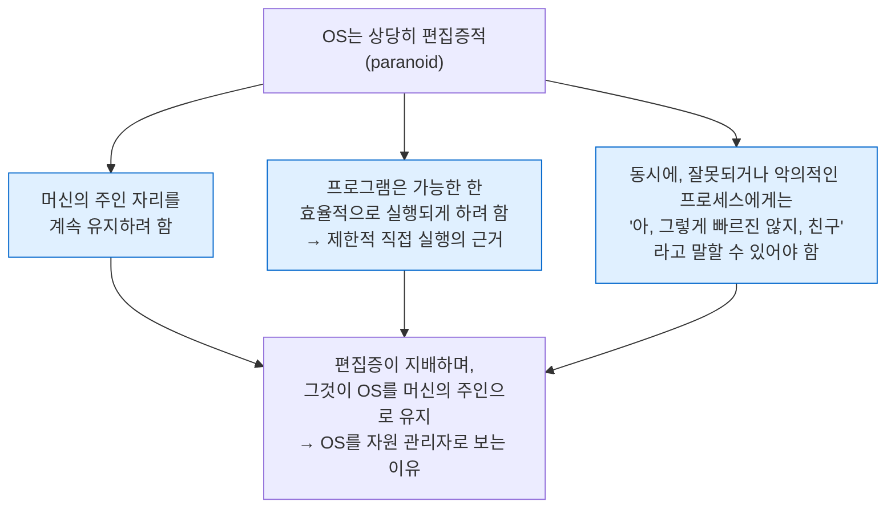

---
tags:
  - topic/os
  - ostep/virtualization
  - dialogue
  - summary
  - status/verified
aliases:
  - CPU 가상화 요약
  - Summary Dialogue on CPU Virtualization
created: 2026-08-19
updated: 2026-08-19
---

# 11. CPU 가상화 요약 대화 (Summary Dialogue on CPU Virtualization)

> ch 4~10 을 교수·학생 문답으로 되짚으며 OS의 "편집증적" 철학과 정책 논쟁의 성격을 정리

- 원서 PDF — [11-Summary.pdf](../../pdfs/01-virtualization/11-Summary.pdf)
- 형식 — Dialogue. 파트 복습용

## 학생이 배운 것 — 기법

- OS가 CPU를 가상화하는 방식. 이를 이해하려면 파악해야 했던 중요 기법들
  - **트랩과 트랩 핸들러**
  - **타이머 인터럽트**
  - 프로세스 전환 시 **OS와 하드웨어가 상태를 신중히 저장·복원**하는 방식
- 학생 소감 — 이 상호작용들이 복잡해 보인다는 것
- 교수 답 — **직접 해보는 것을 대신할 수 있는 것은 없음**. 읽기만으로는 적절한 감각이 생기지 않음. 수업 프로젝트를 해 볼 것

> [!tip] 본 저장소 대응
> 교수의 조언이 `projects/` 존재 이유. [[OS/ostep/projects/02-process-api/README|실습 2]] 에서 `fork`·`wait`·`exec` 를 직접 실행하며 위 기법들의 사용자 측 인터페이스를 확인

## OS의 철학 — 편집증(paranoia)

학생이 정리한 OS의 성격.

- 두 요구의 동시 충족이 CPU 가상화 기법 전체의 설계 동기
- 이것이 OS를 **자원 관리자(resource manager)** 로 부르는 근거와 연결

## 정책에서 얻은 교훈

| 교훈 | 내용 |
|---|---|
| **짧은 작업을 큐 앞으로** | 다소 자명하나 자명한 것이 좋을 수 있음. 학생 비유 — 껌을 사려는데 앞사람의 신용카드가 작동하지 않던 경험. "He was no short job" |
| **SJF와 RR을 동시에 닮은 스케줄러** | MLFQ. 실제 스케줄러 구축은 어려워 보임 |
| **정책 논쟁은 계속됨** | 오늘날까지도 어느 스케줄러를 쓸지 논쟁 — Linux의 CFS·BFS·O(1) 대립 |
| **스케줄러 게이밍** | 학생이 EC2 같은 서비스에서 다른 고객의 사이클을 훔칠 생각을 함 → 교수의 반응 "It looks like I might have created a monster!" |

### 옳은 답이 있는가

- 교수 답 — **아마 없음**. 우리의 지표 자체가 서로 충돌하기 때문
  - 스케줄러가 반환 시간에 좋으면 응답 시간에 나쁘고, 그 역도 성립
- **Lampson 의 관점 인용** — 목표는 **최선의 해법을 찾는 것이 아니라 재앙을 피하는 것**일 수 있음
- 학생 반응 — 다소 우울함
- 교수 답 — 좋은 엔지니어링이 그럴 수 있고, 고양적일 수도 있음. **관점의 문제**. 실용주의(pragmatism)가 좋은 것이며, 실용주의자는 **모든 문제에 깔끔하고 쉬운 해법이 있지는 않다**는 것을 앎

## 정리

- 기법(ch 4~6) — 트랩·타이머 인터럽트·문맥 교환. **OS가 통제를 잃지 않으면서 효율을 얻는 장치**
- 정책(ch 7~10) — FIFO·SJF·STCF·RR·MLFQ·비례 배분·멀티프로세서. **지표 간 상충이 본질적이므로 완벽한 정책은 부재**
- 학습 방법 — 읽기만으로 부족. **직접 코드를 작성해 실행**할 것
- 다음 — 가상화의 두 번째 축인 **메모리 가상화**(ch 12~24)

## 관련 문서

- [[OS/ostep/docs/01-virtualization/06-direct-execution|6. 제한적 직접 실행]] — 트랩·타이머 인터럽트·문맥 교환
- [[OS/ostep/docs/01-virtualization/07-cpu-scheduling|7. CPU 스케줄링]] — 반환·응답 시간의 본질적 상충
- [[OS/ostep/docs/01-virtualization/08-multi-level-feedback|8. 멀티 레벨 피드백 큐]] — SJF와 RR을 동시에 닮은 스케줄러
- [[OS/ostep/docs/01-virtualization/10-multi-cpu-scheduling|10. 멀티프로세서 스케줄링]] — CFS·BFS·O(1) 대립의 배경
- [[OS/ostep/docs/01-virtualization/12-dialogue|12. 메모리 가상화 대화]] — 다음 주제 도입
- [[OS/ostep/docs/README|이론 문서 인덱스]] — 전 챕터 목록
