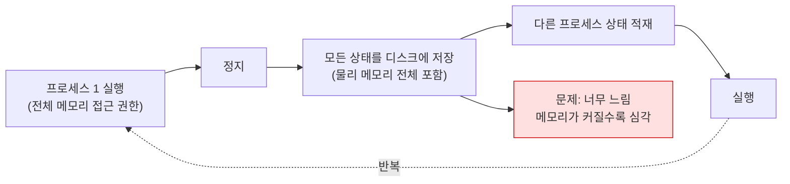

---
tags:
  - topic/os
  - ostep/virtualization
  - address-space
  - virtual-memory
  - isolation
  - aslr
  - lang/c
  - status/verified
aliases:
  - 주소 공간
  - The Abstraction Address Spaces
  - 가상 주소
created: 2026-08-19
updated: 2026-08-19
---

# 13. 주소 공간 추상 (The Abstraction: Address Spaces)

> 초기 시스템 → 다중 프로그래밍 → 시분할 순으로 요구가 커지며 등장한 주소 공간 추상. 투명성·효율·보호 3목표

- 원서 PDF — [13-Address-Spaces.pdf](../../pdfs/01-virtualization/13-Address-Spaces.pdf)
- 실습 — [[OS/ostep/projects/03-address-space/README|실습 3. 주소 공간 관찰]]
- 원서 절 구조 — 13.1 초기 시스템 · 13.2 다중 프로그래밍과 시분할 · 13.3 주소 공간 · 13.4 목표 · 13.5 요약

- 원서 도입 — 초기에는 시스템 구축이 쉬웠음. **사용자가 많은 것을 기대하지 않았기 때문**. "사용 편의성"·"고성능"·"신뢰성" 기대가 이 모든 골칫거리를 초래

## 13.1 초기 시스템

메모리 관점에서 초기 머신은 사용자에게 추상을 거의 제공하지 않음.

```text
0KB    ┌──────────────────────────────┐
       │ Operating System             │
       │ (code, data, etc.)           │
64KB   ├──────────────────────────────┤
       │                              │
       │ Current Program              │
       │ (code, data, etc.)           │
       │                              │
max    └──────────────────────────────┘
```

- OS는 메모리에 앉은 **루틴 집합(사실상 라이브러리)**. 이 예에서 물리 주소 0 부터 시작
- 현재 실행 중인 프로그램(프로세스) 하나가 물리 주소 64KB 부터 앉아 나머지 메모리 사용
- 환상이 거의 없었고 사용자도 OS에 많은 것을 기대하지 않았음

## 13.2 다중 프로그래밍과 시분할

- 머신이 비싸서 사람들이 머신을 더 효과적으로 공유하기 시작 → **다중 프로그래밍(multiprogramming)** 시대
  - 여러 프로세스가 실행 준비 상태로 있고, OS가 그들 사이를 전환(예: 하나가 I/O 수행 시)
  - CPU **실효 이용률 증가**. 머신 한 대가 수십만~수백만 달러였던 시절에 특히 중요
- 이후 사람들이 머신에 더 많은 것을 요구 → **시분할(time sharing)** 시대
  - 일괄 처리의 한계 인식, 특히 프로그래머 자신들이 **길고 비효율적인 프로그램-디버그 주기**에 지침
  - **대화형(interactivity)** 개념이 중요해짐 — 여러 사용자가 동시에 머신을 쓰며 각자 실행 중 작업의 시의적절한 응답을 기대

### 순진한 시분할 구현과 그 문제



| 저장 대상 | 속도 |
|---|---|
| 레지스터 수준 상태(PC·범용 레지스터 등) | 상대적으로 빠름 |
| **메모리 전체 내용을 디스크로** | **극도로 비성능적(brutally non-performant)** |

- 따라서 원하는 방식 — **프로세스를 메모리에 남겨 둔 채 전환**

```text
0KB    ┌──────────────────────────────┐
       │ Operating System             │
64KB   ├──────────────────────────────┤
       │ (free)                       │
128KB  ├──────────────────────────────┤
       │ Process C                    │
192KB  ├──────────────────────────────┤
       │ Process B                    │
256KB  ├──────────────────────────────┤
       │ (free)                       │
320KB  ├──────────────────────────────┤
       │ Process A                    │
384KB  ├──────────────────────────────┤
       │ (free)                       │
448KB  ├──────────────────────────────┤
       │ (free)                       │
512KB  └──────────────────────────────┘
```

- 프로세스 3개(A·B·C)가 512KB 물리 메모리의 일부를 각각 차지
- 단일 CPU 가정 시 OS가 하나(예: A)를 실행하고 나머지(B·C)는 준비 큐에서 대기
- 새 요구 발생 — 여러 프로그램이 메모리에 **동시 상주**하므로 **보호(protection)** 가 중요해짐. 어떤 프로세스가 다른 프로세스의 메모리를 읽거나, 더 나쁘게 쓰는 것을 원하지 않음

## 13.3 주소 공간

- **주소 공간(address space)** — OS가 만드는 **물리 메모리의 사용하기 쉬운 추상**. 실행 중 프로그램이 보는 시스템 메모리의 관점
- 프로세스의 주소 공간은 실행 중 프로그램의 **모든 메모리 상태**를 포함

| 구성 요소 | 내용 |
|---|---|
| **코드(code)** | 프로그램의 명령어. 메모리 어딘가에 있어야 함 |
| **스택(stack)** | 함수 호출 사슬의 현재 위치 추적, 지역 변수 할당, 인자·반환값 전달 |
| **힙(heap)** | 동적 할당되고 사용자가 관리하는 메모리. C의 `malloc()`, C++·Java 의 `new` 로 얻는 것 |

- 그 밖에도 있음(예: 정적 초기화 변수). 지금은 코드·스택·힙 3개만 가정

### 16KB 주소 공간 예 (원서 Figure 13.3)

```text
0KB    ┌──────────────────────────────┐  코드 세그먼트:
       │ Program Code                 │  명령어가 사는 곳 (정적)
1KB    ├──────────────────────────────┤
       │ Heap                         │  힙 세그먼트:
2KB    │  ↓ (아래로 성장)             │  malloc 된 데이터 · 동적 자료 구조
       ├ ─ ─ ─ ─ ─ ─ ─ ─ ─ ─ ─ ─ ─ ─ ┤
       │                              │
       │          (free)              │
       │                              │
       ├ ─ ─ ─ ─ ─ ─ ─ ─ ─ ─ ─ ─ ─ ─ ┤
15KB   │  ↑ (위로 성장)               │  스택 세그먼트:
       │ Stack                        │  지역 변수 · 루틴 인자 · 반환값
16KB   └──────────────────────────────┘
```

- **코드를 맨 위(주소 0 쪽)에 배치하는 이유** — 코드는 **정적**이어서 메모리에 놓기 쉽고, 실행 중 더 많은 공간을 필요로 하지 않음
- **힙과 스택을 양 끝에 배치하는 이유** — 둘 다 **자랄 수 있어야** 하므로 주소 공간의 반대 끝에 두어 **서로 반대 방향으로** 자라게 함
  - 힙 — 코드 직후(1KB)에서 시작해 아래로(주소 증가 방향) 성장. 사용자가 `malloc()` 으로 메모리를 더 요청할 때
  - 스택 — 16KB 에서 시작해 위로(주소 감소 방향) 성장. 사용자가 프로시저 호출을 할 때
- 이 배치는 **관례일 뿐** — 다르게 배치할 수도 있음. 실제로 **여러 스레드가 한 주소 공간에 공존하면 이런 좋은 분할이 더 이상 통하지 않음**

> [!question] CRUX: 메모리를 어떻게 가상화하는가
> 단일 물리 메모리 위에서, (모두 메모리를 공유하는) 여러 실행 중 프로세스에 대해 **사설이며 잠재적으로 거대한 주소 공간**이라는 추상을 OS가 어떻게 구축하는가

- 프로그램은 실제로 물리 주소 0~16KB 에 있는 것이 아니라 **임의의 물리 주소에 적재**됨
- 예 — 프로세스 A가 (가상) 주소 0 에서 `load` 를 수행하면, OS는 하드웨어 지원과 함께 그 `load` 가 물리 주소 0 이 아니라 **물리 주소 320KB**(A가 적재된 곳)로 가게 만들어야 함
- 이것이 메모리 가상화의 핵심이며 **세계의 모든 현대 컴퓨터 시스템의 기반**

## 13.4 목표

| 목표 | 내용 |
|---|---|
| **투명성(transparency)** | 가상 메모리를 **실행 중 프로그램에게 보이지 않는 방식**으로 구현. 프로그램은 메모리가 가상화된 사실을 몰라야 하며, 자기만의 사설 물리 메모리가 있는 것처럼 행동. 뒤에서 OS(와 하드웨어)가 다수 작업 사이에 메모리를 다중화 |
| **효율성(efficiency)** | **시간**(프로그램을 훨씬 느리게 만들지 않음)과 **공간**(가상화 지원 구조에 메모리를 너무 쓰지 않음) 양면. 시간 효율 구현에는 **TLB 같은 하드웨어 지원**에 의존해야 함 |
| **보호(protection)** | 프로세스를 서로에게서, 그리고 OS 자신을 프로세스로부터 보호. `load`·`store`·명령어 반입이 **자기 주소 공간 밖**의 어떤 것에도 접근·영향을 주지 못해야 함 |

> [!note] ASIDE: transparency 의 혼동 (원서 각주)
> 여기서 "투명함"은 모든 것을 공개한다는 뜻(정부가 그래야 하는 방식)의 **반대**. OS가 제공하는 환상이 응용에게 **보이지 않아야 한다**는 뜻. 통상적 용법으로 투명한 시스템은 **알아차리기 어려운** 시스템

> [!tip] TIP: 격리의 원리
> **격리(isolation)** 는 신뢰성 있는 시스템 구축의 핵심 원리. 두 개체가 제대로 격리되면 **한쪽이 실패해도 다른 쪽에 영향이 없음**.
> OS는 프로세스를 서로 격리해 한쪽이 다른 쪽을 해치는 것을 방지. **메모리 격리**로 실행 중 프로그램이 하부 OS의 동작에 영향을 주지 못하게 함.
> 일부 현대 OS는 격리를 더 밀고 나가 **OS의 일부를 OS의 다른 일부로부터 차단** — 이런 **마이크로커널(microkernel)** 은 전형적 모놀리식 커널 설계보다 높은 신뢰성을 제공할 수 있음

- 보호가 프로세스 간 **격리 속성**을 제공. 각 프로세스가 자기만의 격리된 고치 안에서 실행되어 다른 결함 있는·악의적 프로세스의 파괴로부터 안전

## 13.5 정리

- 가상 메모리(VM) 시스템의 책임 — 각 실행 중 프로그램에게 **크고 희소하며(sparse) 사설인 주소 공간**의 환상 제공
- 각 가상 주소 공간은 프로그램의 모든 명령어와 데이터를 포함하며, 프로그램은 **가상 주소**로 이를 참조
- OS는 (상당한 하드웨어 도움을 받아) 이 가상 메모리 참조를 **물리 주소로 변환**해 물리 메모리에 제시
- 이를 **여러 프로세스에 대해 동시에** 제공하며, 프로그램 간 보호와 OS 보호를 보장
- 이 접근 전체는 **많은 기법(저수준 기계 장치)** 과 **몇 가지 결정적 정책**을 요구 → 아래에서부터, 기법을 먼저

> [!note] ASIDE: 보이는 모든 주소는 가상 주소
> C 프로그램에서 포인터를 출력한 값(큰 수, 흔히 16진수)은 **가상 주소**. 프로그램 코드의 위치도 출력할 수 있고, 그것도 가상 주소.
> **사용자 수준 프로그램의 프로그래머가 볼 수 있는 어떤 주소든 가상 주소.** 물리 메모리의 어디에 이 명령어와 데이터 값이 있는지는 **오직 OS(와 하드웨어)만** 알고 있음

원서 예제 코드 `va.c`.

```c
#include <stdio.h>
#include <stdlib.h>

int main(int argc, char *argv[]) {
    printf("location of code : %p\n", main);
    printf("location of heap : %p\n", malloc(100e6));
    int x = 3;
    printf("location of stack: %p\n", &x);
    return x;
}
```

원서 실행 결과 (64비트 Mac, x86-64).

```text
location of code : 0x1095afe50
location of heap : 0x1096008c0
location of stack: 0x7fff691aea64
```

- 코드가 주소 공간에서 먼저, 그다음 힙, 스택은 이 거대한 가상 공간의 **반대쪽 끝**
- 이 주소들 모두 가상이며 OS와 하드웨어가 변환해 진짜 물리 위치에서 값을 가져옴

### macOS arm64 실측과의 대조

```bash
gcc -Wall -Wextra -Wno-unused-parameter -g -o va va.c
./va
```

- `-Wall` — 주요 경고 활성
- `-Wextra` — 추가 경고 활성
- `-Wno-unused-parameter` — 미사용 매개변수 경고 비활성. 원서 원형 보존 목적
- `-g` — 디버그 심볼 포함
- `-o va` — 출력 실행 파일명 지정
- `./va` — 옵션 없음

```text
location of code : 0x1004d8460
location of heap : 0x5cc000000
location of stack: 0x16f9267ac
```

| 항목 | 원서 (x86-64 Mac) | 실측 (macOS arm64) | 차이 원인 |
|---|---|---|---|
| 코드 | `0x1095afe50` | `0x1004d8460` | 같은 `0x1...` 대역. 실행마다 변동(**ASLR**) |
| 힙 | `0x1096008c0` (코드 직후) | `0x5cc000000` (별개 대역) | `malloc(100e6)` = 100MB. 큰 요청은 할당자가 **`mmap` 으로 처리**해 별도 매핑에 배치 (확인 필요: macOS 할당자 임계값) |
| 스택 | `0x7fff691aea64` | `0x16f9267ac` | **아키텍처별 주소 공간 배치 차이** |

- **코드 → 힙 → 스택 순으로 주소가 커진다는 구조는 동일**
- 상세 실측(세그먼트별 배치, 스택 성장 방향 실증)은 [[OS/ostep/projects/03-address-space/README|실습 3]] 참조

## 관련 문서

- [[OS/ostep/docs/01-virtualization/12-dialogue|12. 메모리 가상화 대화]] — "모든 주소는 가상 주소" 출발점
- [[OS/ostep/docs/01-virtualization/14-memory-api|14. 메모리 API]] — 힙을 다루는 `malloc`·`free` 와 대표 오류
- [[OS/ostep/docs/01-virtualization/15-address-translation|15. 주소 변환]] — 가상 → 물리 변환 기법
- [[OS/ostep/projects/03-address-space/README|실습 3. 주소 공간 관찰]] — 본 챕터 코드 실행·확장
- [[C/docs/01-basics/c-program-execution-model|C 프로그램의 동작 및 컴파일 방식]] — 세그먼트 배치의 C 관점
- [[OS/ostep/docs/README|이론 문서 인덱스]] — 전 챕터 목록
