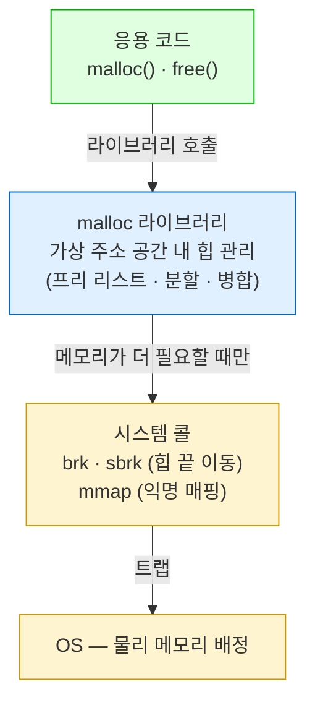

---
tags:
  - topic/os
  - ostep/virtualization
  - malloc
  - free
  - memory-leak
  - brk
  - mmap
  - lang/c
  - status/verified
aliases:
  - 메모리 API
  - Interlude Memory API
  - malloc free
created: 2026-08-19
updated: 2026-08-19
---

# 14. 메모리 API (Interlude: Memory API)

> UNIX 메모리 할당 인터페이스. 스택 vs 힙, `malloc`/`free` 규칙, 대표 오류 7종, 하부 시스템 콜(`brk`·`mmap`)

- 원서 PDF — [14-Memory-API.pdf](../../pdfs/01-virtualization/14-Memory-API.pdf)
- 실습 — [[OS/ostep/projects/04-memory-api/README|실습 4. 메모리 API와 오류 검출]]
- 원서 절 구조 — 14.1 메모리 종류 · 14.2 `malloc` · 14.3 `free` · 14.4 흔한 오류 · 14.5 하부 OS 지원 · 14.6 기타 호출 · 14.7 요약

> [!question] CRUX: 메모리를 어떻게 할당하고 관리하는가
> UNIX/C 프로그램에서 메모리 할당·관리 방법을 이해하는 것은 견고하고 신뢰성 있는 소프트웨어 구축에 결정적. 어떤 인터페이스가 흔히 쓰이는가. 어떤 실수를 피해야 하는가

## 14.1 메모리의 두 종류

| 종류 | 관리 주체 | 별칭 | 수명 |
|---|---|---|---|
| **스택 메모리(stack memory)** | **컴파일러가 암묵적으로** 할당·해제 | **자동 메모리(automatic memory)** | 함수 호출 구간 |
| **힙 메모리(heap memory)** | **프로그래머가 명시적으로** 전부 처리 | — | 명시적 해제까지 |

스택 선언.

```c
void func() {
    int x;   // 스택에 정수 선언
    ...
}
```

- 컴파일러가 `func()` 호출 시 스택에 공간을 만들고, 반환 시 해제
- 따라서 **호출 구간을 넘어 살아야 하는 정보는 스택에 두면 안 됨**

힙 할당.

```c
void func() {
    int *x = (int *) malloc(sizeof(int));
    ...
}
```

- 이 한 줄에서 **스택 할당과 힙 할당이 동시에** 발생
  1. 컴파일러가 `int *x` 선언을 보고 **포인터를 담을 자리를 스택에** 확보
  2. `malloc()` 호출이 **힙에 정수용 공간**을 요청
  3. 반환된 주소(성공 시 주소, 실패 시 `NULL`)가 **스택의 포인터 변수에 저장**
- 힙은 명시적 성격과 다양한 사용 방식 때문에 사용자·시스템 모두에게 더 많은 과제를 제기

> [!note] ASIDE: Java 와의 대응
> Java 의 `int x;`(지역 변수)는 스택, `new Foo()`는 힙에 대응. 결정적 차이 — **Java 는 GC 가 힙을 회수**하나 C 는 `free` 를 프로그래머가 호출해야 함. 원서 지적대로 "A heavy responsibility, no doubt! And certainly the cause of many bugs"

## 14.2 `malloc()` 호출

```c
#include <stdlib.h>
...
void *malloc(size_t size);
```

- 힙에 공간을 요청하는 크기를 넘기면, 성공 시 새로 할당된 공간의 **포인터**, 실패 시 **`NULL`** 반환
- 헤더 `<stdlib.h>` 를 포함하면 됨. **사실 포함하지 않아도 링크는 됨** — 모든 C 프로그램이 기본으로 링크하는 C 라이브러리에 `malloc()` 코드가 있으므로. 헤더는 **컴파일러가 호출 방식(인자 개수·타입)을 검사**하게 해 줌
- 인자는 `size_t` 타입 — 필요한 **바이트 수**

> [!note] ASIDE: `NULL` 은 특별한 것이 아님 (원서 각주)
> C 의 `NULL` 은 통상 값 0 에 대한 매크로일 뿐 — `#define NULL 0` 또는 때로 `#define NULL (void *)0`

### `sizeof()` 사용

```c
double *d = (double *) malloc(sizeof(double));
```

- `sizeof()` 로 올바른 크기를 요청. 숫자를 직접 타이핑하는 것(`10` 등)은 **나쁜 형식(poor form)** 으로 간주
- C에서 `sizeof()` 는 일반적으로 **컴파일 시점 연산자** — 실제 크기가 컴파일 시점에 알려져 숫자(`double` 이면 8)로 치환됨
- 따라서 `sizeof()` 는 **함수 호출이 아니라 연산자**로 이해하는 것이 정확 (함수 호출은 실행 시점에 일어남)

### `sizeof()` 의 함정

```c
int *x = malloc(10 * sizeof(int));
printf("%d\n", sizeof(x));
```

- 첫 줄은 정수 10개 배열 공간 확보 — 문제 없음
- 그러나 `sizeof(x)` 는 **작은 값**(32비트 머신 4, 64비트 8) 반환
- 이유 — `sizeof()` 가 "정수 포인터가 얼마나 큰지"를 묻는 것으로 해석. **동적 할당한 메모리 양이 아님**

```c
int x[10];
printf("%d\n", sizeof(x));
```

- 이 경우는 기대대로 동작 — 컴파일러가 **40바이트가 할당되었다는 정적 정보**를 충분히 가짐

### 문자열의 경우

```c
malloc(strlen(s) + 1)
```

- `strlen()` 으로 길이를 얻고 **`+ 1`** — **문자열 종료 문자(`'\0'`) 자리** 확보 목적
- 여기서 `sizeof()` 를 쓰면 문제 발생

### 캐스팅

- `malloc()` 은 **`void` 포인터**를 반환 — 주소를 돌려주고 프로그래머가 무엇을 할지 결정하게 하는 C의 방식
- 캐스팅(`(double *)`)은 **정확성을 위해 필요한 것이 아님**. 컴파일러와 코드를 읽는 다른 프로그래머에게 "그래, 나는 내가 뭘 하는지 안다"고 알리는 안심용

> [!tip] TIP: 의심스러우면 직접 해 볼 것
> 사용 중인 루틴이나 연산자의 동작이 확실하지 않으면, **직접 시도해 기대대로 동작하는지 확인**하는 것을 대신할 것이 없음. man page 나 문서를 읽는 것도 유용하나 **실제로 어떻게 동작하는지가 중요**. 코드를 쓰고 테스트할 것. 원서 저자들도 `sizeof()` 에 관해 쓴 내용을 이 방법으로 재확인했음

## 14.3 `free()` 호출

- 메모리 할당은 쉬운 부분. **언제·어떻게·심지어 해제해야 하는지 여부**를 아는 것이 어려운 부분

```c
int *x = malloc(10 * sizeof(int));
...
free(x);
```

- 인자는 **`malloc()` 이 반환한 포인터** 하나
- **할당 영역의 크기는 사용자가 전달하지 않음** → **메모리 할당 라이브러리 자신이 추적해야 함** (ch 17 주제)

## 14.4 흔한 오류

- 아래 예시 전부 **컴파일러의 불만 없이 컴파일되고 실행됨** — C 프로그램을 컴파일하는 것은 올바른 C 프로그램을 만드는 데 **필요하나 전혀 충분하지 않음**
- 올바른 메모리 관리가 이토록 문제여서, 많은 신생 언어가 **자동 메모리 관리**를 지원. `malloc()` 유사 호출(`new`)은 하되 해제 호출은 없고, **가비지 컬렉터**가 참조가 없어진 메모리를 찾아 해제

### 오류 1 — 할당을 잊음

```c
char *src = "hello";
char *dst;          // oops! 미할당
strcpy(dst, src);   // segfault and die
```

- 많은 루틴이 호출 전에 메모리가 할당되어 있기를 기대. `strcpy(dst, src)` 가 그 예
- 통상 **세그멘테이션 폴트(segmentation fault)** 로 이어짐 — 원서 표현: "YOU DID SOMETHING WRONG WITH MEMORY YOU FOOLISH PROGRAMMER AND I AM ANGRY"

올바른 코드.

```c
char *src = "hello";
char *dst = (char *) malloc(strlen(src) + 1);
strcpy(dst, src);   // work properly
```

- 대안 — `strdup()` 사용. man page 참조

> [!tip] TIP: 컴파일되었거나 실행되었다 ≠ 올바르다
> 프로그램이 컴파일되었다는 것, 심지어 한 번 또는 여러 번 올바르게 실행되었다는 것이 **프로그램이 올바르다는 뜻은 아님**. 여러 사건이 공모해 "동작한다"고 믿는 지점에 도달했을 뿐, 무언가 바뀌면 멈춤.
> 학생의 흔한 반응은 "But it worked before!" 라며 컴파일러·OS·하드웨어·(감히 말하면) 교수를 탓하는 것. 그러나 **문제는 보통 생각하는 그곳, 자기 코드에 있음**

### 오류 2 — 충분히 할당하지 않음 (버퍼 오버플로)

```c
char *src = "hello";
char *dst = (char *) malloc(strlen(src));   // too small!
strcpy(dst, src);
```

- 목적지 버퍼를 **거의** 충분하게 만드는 흔한 실수
- **이상하게도 이 프로그램은 종종 겉보기에 올바르게 실행됨** — `malloc` 구현 등 여러 세부에 따라
  - 어떤 경우 문자열 복사가 할당 공간 끝을 **1바이트 넘어 기록**하나 무해할 수 있음(더 쓰이지 않는 변수를 덮어씀)
  - 어떤 경우 이 오버플로가 **믿을 수 없이 유해**하며, 실제로 시스템의 많은 **보안 취약점의 원천**
  - 어떤 경우 `malloc` 라이브러리가 여분 공간을 조금 할당해 두어 실제로 다른 변수 값을 건드리지 않고 잘 동작
  - 또 어떤 경우 프로그램이 폴트하고 크래시
- 교훈 — **한 번 올바르게 실행되었다고 올바른 것은 아님**

### 오류 3 — 할당한 메모리 초기화를 잊음

- `malloc()` 은 올바르게 호출했으나 새로 할당한 타입에 값을 채워 넣는 것을 잊음
- 결과 — **미초기화 읽기(uninitialized read)**. 힙에서 알 수 없는 값의 데이터를 읽음
- 운이 좋으면 프로그램이 여전히 동작하는 값(예: 0), 운이 나쁘면 **무작위이며 유해한 값**

### 오류 4 — 해제를 잊음 (메모리 누수)

- **메모리 누수(memory leak)**
- **장기 실행 응용이나 시스템(OS 자신 등)** 에서 거대한 문제 — 천천히 누수되다 결국 메모리 고갈 → 재시작 필요
- **GC 언어를 쓴다고 해결되지 않음** — 어떤 메모리 덩어리에 대한 참조를 여전히 갖고 있으면 어떤 GC도 해제하지 않음. **현대 언어에서도 누수는 문제로 남음**
- `free()` 를 부르지 않는 것이 합리적으로 보이는 경우 — 프로그램이 단기 실행이고 곧 종료. 프로세스가 죽을 때 OS가 할당 페이지 전부를 정리하므로 **누수 자체는 일어나지 않음**
- 그래도 **나쁜 습관** — 프로그래머의 목표 중 하나는 좋은 습관을 기르는 것. **명시적으로 할당한 모든 바이트를 해제하는 습관**이 그중 하나

> [!note] ASIDE: 프로세스 종료 시 왜 메모리가 누수되지 않는가
> 시스템에 **두 수준의 메모리 관리**가 존재.
> 1. **OS 수준** — 프로세스가 실행될 때 메모리를 넘겨주고, 종료(또는 사망)할 때 되찾음
> 2. **프로세스 내부 수준** — `malloc()`·`free()` 를 부를 때의 힙 내부
> `free()` 를 부르지 않아(힙에서 누수) 있어도, 프로그램 실행이 끝나면 **OS가 프로세스 메모리 전체를 회수** — 코드·스택·힙 페이지 모두. 주소 공간 내 힙 상태가 어떻든 프로세스가 죽으면 OS가 그 페이지 전부를 되찾음.
> 따라서 **단기 프로그램의 누수는 운영상 문제를 일으키지 않는 경우가 많음**(다만 나쁜 형식으로 간주될 수 있음). **장기 실행 서버**(웹 서버·DBMS 등 종료하지 않는 것)에서는 훨씬 큰 문제이며 결국 메모리 고갈로 크래시. 그리고 **OS 자신** 안에서 누수는 더 큰 문제 — 커널 코드를 쓰는 사람이 가장 힘든 일을 함

### 오류 5 — 다 쓰기 전에 해제 (댕글링 포인터)

- **댕글링 포인터(dangling pointer)**
- 이후 사용이 프로그램을 크래시시킬 수도, **유효한 메모리를 덮어쓸 수도** 있음
  - 예 — `free()` 를 호출한 뒤 다시 `malloc()` 으로 다른 것을 할당하면, **잘못 해제된 그 메모리가 재활용**됨

### 오류 6 — 반복 해제 (이중 해제)

- **이중 해제(double free)**
- 결과는 **정의되지 않음(undefined)**. 메모리 할당 라이브러리가 혼란에 빠져 온갖 이상한 일을 할 수 있으며 **크래시가 흔한 결말**

### 오류 7 — `free()` 를 잘못 호출

- `free()` 는 **앞서 `malloc()` 에서 받은 포인터만** 넘기기를 기대
- 다른 값을 넘기면 나쁜 일이 일어날 수 있고 실제로 일어남 → **무효 해제(invalid free)** 는 위험하며 피해야 함

### 오류 검출 도구

- 메모리를 오용하는 방법이 이토록 많아, 코드에서 이런 문제를 찾는 **도구 생태계 전체**가 발전
- 원서 추천 — **purify**, **valgrind**. 둘 다 메모리 관련 문제의 출처를 찾는 데 우수. 익숙해지면 **이것 없이 어떻게 살았는지 의아해질 것**

> [!note] macOS 에서의 도구 대체
> Apple Silicon macOS 에서 valgrind 는 사실상 사용 불가 → **AddressSanitizer**(`-fsanitize=address`)와 macOS 기본 제공 **`leaks`** 명령이 대체.
> 오류 9종을 재현하고 각 도구의 검출 범위를 실측한 결과는 [[OS/ostep/projects/04-memory-api/README|실습 4]] 참조. 요약 — **9종 중 6종이 일반 실행에서 종료 코드 0 으로 "성공"**, ASan 은 그중 대부분을 지목하나 **미초기화 포인터 사용과 미초기화 읽기는 놓침**

## 14.5 하부 OS 지원

- **`malloc()`·`free()` 는 시스템 콜이 아니라 라이브러리 호출**
- `malloc` 라이브러리는 가상 주소 공간 내 공간을 관리하되, 그 자신은 **OS에 메모리를 더 요청하거나 반납하는 시스템 콜 위에 구축**됨

| 시스템 콜 | 역할 |
|---|---|
| **`brk`** | 프로그램의 **break**(힙의 끝 위치)를 변경. 인자는 새 break 주소. 현재 break 보다 크거나 작음에 따라 힙 크기 증가·감소 |
| **`sbrk`** | 증분(increment)을 넘기며 유사한 목적 |
| **`mmap`** | 올바른 인자를 넘기면 프로그램 내에 **익명(anonymous) 메모리 영역** 생성 — 특정 파일과 연관되지 않고 **스왑 공간**과 연관된 영역. 이 메모리도 힙처럼 취급·관리 가능 |

- **`brk`·`sbrk` 를 직접 호출해서는 안 됨** — 메모리 할당 라이브러리가 사용하는 것. 직접 쓰면 무언가가 (끔찍하게) 잘못될 가능성. **`malloc()`·`free()` 를 쓸 것**



- 이 계층 구조가 **실습 3에서 `malloc(100e6)` 의 주소가 코드 근처가 아니었던 이유** — 큰 요청은 `brk` 로 힙을 늘리는 대신 `mmap` 으로 별도 매핑을 만드는 경로를 타기 때문 (확인 필요: macOS 할당자의 정확한 임계값)

## 14.6 기타 호출

| 호출 | 동작 | 용도 |
|---|---|---|
| **`calloc()`** | 메모리를 할당하고 **반환 전에 0 으로 채움** | 메모리가 0 이라 가정하고 초기화를 잊는 오류(미초기화 읽기) 방지 |
| **`realloc()`** | **더 큰 새 영역**을 만들고 옛 영역을 복사한 뒤 새 영역 포인터 반환 | 배열 등에 공간을 할당했다가 무언가를 추가해야 할 때 |

## 14.7 정리

- 메모리는 **스택(컴파일러 관리)** 과 **힙(프로그래머 관리)** 두 종류
- `malloc(size)` — 바이트 수 요청, 성공 시 포인터·실패 시 `NULL`. `sizeof()` 로 크기 산출, 문자열은 `strlen(s) + 1`
- `free(ptr)` — `malloc` 이 준 포인터만. 크기는 라이브러리가 추적
- 오류 7종 — 할당 누락 · 크기 부족 · 초기화 누락 · 해제 누락 · 조기 해제 · 이중 해제 · 무효 해제
- `malloc`·`free` 는 **라이브러리 호출**이며 하부에서 `brk`·`sbrk`·`mmap` 시스템 콜 사용
- `calloc`(0 초기화)·`realloc`(확장 복사) 도 함께 활용
- 더 상세한 내용은 K&R 의 C 책, Stevens & Rago 7장 참조

## 관련 문서

- [[OS/ostep/docs/01-virtualization/13-address-spaces|13. 주소 공간 추상]] — 힙·스택이 주소 공간에서 놓이는 위치
- [[OS/ostep/docs/01-virtualization/15-address-translation|15. 주소 변환]] — 다음 주제(기법)
- [[OS/ostep/docs/01-virtualization/17-free-space-management|17. 프리 공간 관리]] — `malloc` 라이브러리가 내부에서 하는 일
- [[OS/ostep/projects/04-memory-api/README|실습 4. 메모리 API와 오류 검출]] — 오류 9종 재현·ASan·`leaks` 실측
- [[C/docs/02-memory/heap-and-free|힙과 free]] — `free` 의 실제 동작
- [[C/docs/07-stdlib/03-stdlib|메모리 · 변환]] — `malloc`·`calloc`·`realloc`·`free` API 규칙
- [[OS/ostep/docs/README|이론 문서 인덱스]] — 전 챕터 목록
