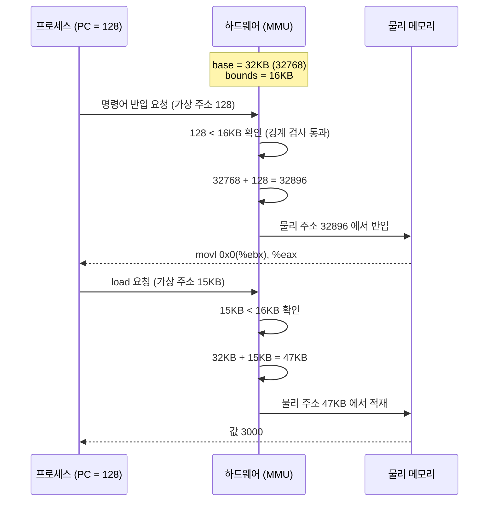
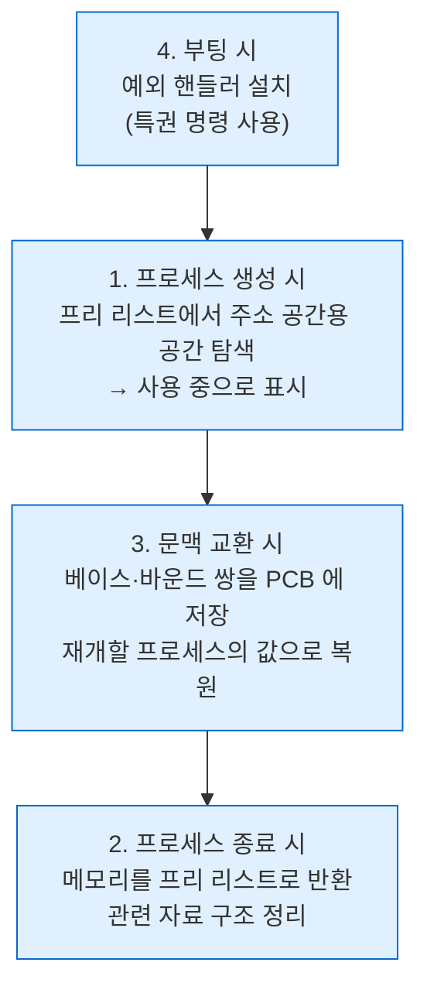

---
tags:
  - topic/os
  - ostep/virtualization
  - address-translation
  - base-and-bounds
  - mmu
  - dynamic-relocation
  - status/verified
aliases:
  - 주소 변환
  - Address Translation
  - 베이스와 바운드
  - 동적 재배치
  - MMU
created: 2026-08-19
updated: 2026-08-19
---

# 15. 주소 변환 (Mechanism: Address Translation)

> 메모리 가상화의 첫 기법. 베이스·바운드 레지스터로 가상 주소를 물리 주소로 변환하고 경계를 검사하는 동적 재배치

- 원서 PDF — [15-Address-Translation.pdf](../../pdfs/01-virtualization/15-Address-Translation.pdf)
- 원서 절 구조 — 15.1 가정 · 15.2 예제 · 15.3 동적 재배치 · 15.4 하드웨어 지원 요약 · 15.5 OS 문제 · 15.6 요약

- CPU 가상화에서는 **제한적 직접 실행(LDE)** 이라는 일반 기법에 집중. 메모리 가상화도 **유사한 전략**을 추구
- 세 가지 요구

| 요구 | 내용 |
|---|---|
| **효율성(efficiency)** | 하드웨어 지원 활용. 처음에는 초보적(레지스터 몇 개)이나 점차 복잡해짐(TLB·페이지 테이블 지원 등) |
| **통제(control)** | 어떤 응용도 자기 메모리 외에는 접근하지 못하게 보장. 응용 간 보호와 OS 보호를 위해 하드웨어 도움 필요 |
| **유연성(flexibility)** | 프로그램이 주소 공간을 **원하는 방식으로** 사용할 수 있게 → 시스템 프로그래밍이 쉬워짐 |

> [!question] CRUX: 메모리를 효율적이고 유연하게 어떻게 가상화하는가
> 효율적인 메모리 가상화를 어떻게 구축하는가. 응용이 필요로 하는 유연성을 어떻게 제공하는가. 응용이 접근할 수 있는 메모리 위치에 대한 통제를 어떻게 유지하며, 응용의 메모리 접근이 적절히 제한되도록 보장하는가. 이 모든 것을 어떻게 **효율적으로** 하는가

- 사용할 일반 기법 — **하드웨어 기반 주소 변환(hardware-based address translation)**, 줄여서 **주소 변환**. LDE 접근에 대한 추가로 볼 수 있음
- 동작 — 하드웨어가 **모든 메모리 접근**(명령어 반입·`load`·`store`)에 개입해, 명령어가 제공한 **가상 주소를 실제 정보가 있는 물리 주소로** 변환
- 하드웨어만으로는 메모리를 가상화할 수 없음 — **저수준 기법**만 제공. OS는 핵심 지점에서 개입해 올바른 변환이 일어나도록 하드웨어를 설정하고, **어느 위치가 비었고 어느 위치가 쓰이는지 추적**하며 메모리 사용을 통제

> [!tip] TIP: 개입(interposition)은 강력하다
> **개입(interposition)** 은 컴퓨터 시스템에서 큰 효과로 자주 쓰이는 일반적이고 강력한 기법. 메모리 가상화에서 하드웨어는 **모든 메모리 접근에 개입**해 프로세스가 발행한 가상 주소를 물리 주소로 변환.
> 그러나 개입 기법은 훨씬 넓게 적용 가능 — **잘 정의된 거의 모든 인터페이스에 개입**해 새 기능을 추가하거나 시스템의 다른 측면을 개선할 수 있음.
> 통상적 이점 중 하나가 **투명성** — 개입이 클라이언트의 인터페이스를 바꾸지 않고 수행되므로 **클라이언트 변경이 불필요**

## 15.1 가정

첫 시도는 매우 단순. 이후 완화됨.

| 가정 | 내용 |
|---|---|
| 1 | 사용자의 주소 공간이 물리 메모리에 **연속적으로(contiguously)** 배치되어야 함 |
| 2 | 주소 공간 크기가 너무 크지 않음 — **물리 메모리 크기보다 작음** |
| 3 | 각 주소 공간의 크기가 **정확히 동일** |

## 15.2 예제

메모리에서 값을 읽어 3을 더하고 다시 저장하는 코드.

```c
void func() {
    int x = 3000;
    x = x + 3;      // 관심 대상 코드 줄
    ...
}
```

컴파일 결과 (x86 어셈블리). Linux 는 `objdump`, Mac 은 `otool` 로 역어셈블.

```text
128: movl 0x0(%ebx), %eax   ;load 0+ebx into eax
132: addl $0x03, %eax       ;add 3 to eax register
135: movl %eax, 0x0(%ebx)   ;store eax back to mem
```

- `x` 의 주소가 레지스터 `ebx` 에 있다고 전제
- `movl` — "longword" 이동. 그 주소의 값을 범용 레지스터 `eax` 로 적재
- 다음 명령이 `eax` 에 3 을 더하고, 마지막 명령이 `eax` 값을 같은 위치로 저장

### 프로세스가 보는 주소 공간

```text
0KB    ┌──────────────────────────────┐
       │ 128 movl 0x0(%ebx),%eax      │
1KB    │ 132 addl 0x03, %eax          │  Program Code
       │ 135 movl %eax,0x0(%ebx)      │
2KB    ├──────────────────────────────┤
       │ Heap                         │
3KB    ├──────────────────────────────┤
4KB    │                              │
       │          (free)              │
14KB   │                              │
15KB   ├──────────────────────────────┤
       │ 3000  ← x                    │  Stack
16KB   └──────────────────────────────┘
```

명령어 실행 시 프로세스 관점에서 일어나는 메모리 접근.

| 순서 | 접근 |
|---|---|
| 1 | 주소 **128** 의 명령어 반입 |
| 2 | 그 명령어 실행 — **15KB 에서 적재** |
| 3 | 주소 **132** 의 명령어 반입 |
| 4 | 그 명령어 실행 — 메모리 참조 없음 |
| 5 | 주소 **135** 의 명령어 반입 |
| 6 | 그 명령어 실행 — **15KB 로 저장** |

- 프로그램 관점에서 주소 공간은 **주소 0 에서 시작**해 최대 16KB 까지. 발생하는 모든 메모리 참조가 이 범위 내여야 함
- 그러나 메모리 가상화를 위해 OS는 프로세스를 **물리 메모리의 다른 곳**에 배치하고자 함 → **문제 발생**

### 재배치된 물리 메모리

```text
0KB    ┌──────────────────────────────┐
       │ Operating System             │
16KB   ├──────────────────────────────┤
       │ (not in use)                 │
32KB   ├──────────────────────────────┤  ← base = 32KB
       │ Code                         │
       │ Heap                         │  Relocated Process
       │ (allocated but not in use)   │
       │ Stack                        │
48KB   ├──────────────────────────────┤
       │ (not in use)                 │
64KB   └──────────────────────────────┘
```

- OS가 물리 메모리 첫 슬롯을 자신이 사용하고, 프로세스를 **물리 주소 32KB 슬롯**에 재배치
- 나머지 두 슬롯(16KB~32KB, 48KB~64KB)은 비어 있음

## 15.3 동적(하드웨어 기반) 재배치

- 1950년대 말 최초 시분할 머신에 도입된 단순한 착상 — **베이스와 바운드(base and bounds)**. **동적 재배치(dynamic relocation)** 라고도 함
- CPU 내에 하드웨어 레지스터 2개 필요

| 레지스터 | 역할 |
|---|---|
| **베이스(base) 레지스터** | 주소 공간이 물리 메모리에 배치된 시작 위치 |
| **바운드(bounds) 레지스터** | 주소 공간의 크기. **한계(limit) 레지스터**라고도 함. 보호 담당 |

- 각 프로그램은 **주소 0 에 적재된다는 전제로** 작성·컴파일됨
- 프로그램 실행 시작 시 OS가 물리 메모리의 어디에 적재할지 결정하고 **베이스 레지스터를 그 값으로 설정**

### 변환 공식

```text
physical address = virtual address + base
```

- 프로세스가 생성하는 모든 메모리 참조는 **가상 주소**
- 하드웨어가 베이스 레지스터 내용을 더해 **물리 주소**를 얻어 메모리 시스템에 발행

### 명령어 하나의 추적



- 가상 주소를 물리 주소로 바꾸는 것이 정확히 **주소 변환**
- 주소 재배치가 **실행 시점(runtime)** 에 일어나고, 프로세스가 실행을 시작한 뒤에도 주소 공간을 옮길 수 있어 **동적 재배치**라고 부름

### 바운드 레지스터의 역할

- 프로세서가 먼저 메모리 참조가 **경계 내인지 검사**해 합법인지 확인
- 위 예에서 바운드 레지스터는 항상 16KB 로 설정
- 프로세스가 **바운드보다 크거나 같은** 가상 주소, 또는 **음수** 주소를 생성하면 **CPU가 예외를 발생**시키고 프로세스는 종료될 가능성

### 바운드 레지스터의 두 정의 방식

| 방식 | 내용 | 검사 순서 |
|---|---|---|
| 1 (원서 기본 가정) | **주소 공간의 크기**를 보관 | 베이스를 더하기 **전에** 가상 주소를 검사 |
| 2 | 주소 공간 **끝의 물리 주소**를 보관 | 베이스를 **먼저 더하고** 경계 내인지 확인 |

- 두 방법은 **논리적으로 등가**

### MMU

- 베이스·바운드 레지스터는 **칩 상의 하드웨어 구조** (CPU당 한 쌍)
- 주소 변환을 돕는 프로세서 부분을 **MMU(memory management unit)** 라고 부름
- 더 정교한 메모리 관리 기법을 개발하면서 **MMU에 회로를 추가**해 나감

> [!tip] TIP: 하드웨어 기반 동적 재배치
> 동적 재배치에서는 **약간의 하드웨어가 큰 역할**. **베이스 레지스터**가 (프로그램이 생성한) 가상 주소를 물리 주소로 변환하고, **바운드(한계) 레지스터**가 그런 주소가 주소 공간 범위 내임을 보장. 둘이 합쳐 단순하고 효율적인 메모리 가상화를 제공

### 변환 예제 — 검산

주소 공간 크기 4KB 프로세스가 물리 주소 16KB 에 적재된 경우.

| 가상 주소 | 계산 | 물리 주소 |
|---|---|---|
| 0 | `16384 + 0` | **16 KB** |
| 1 KB | `16384 + 1024` | **17 KB** |
| 3000 | `16384 + 3000 = 19384` | **19384** |
| 4400 | `4400 ≥ 4096`(4KB) | **Fault (out of bounds)** |

- 베이스 주소에 가상 주소(**주소 공간 내 오프셋**으로 볼 수 있음)를 더하면 됨
- 가상 주소가 **"너무 크거나" 음수인 경우에만** 폴트가 발생해 예외 발생

> [!note] ASIDE: 소프트웨어 기반 재배치
> 하드웨어 지원이 등장하기 전, 일부 시스템은 **순수 소프트웨어 방법**으로 조악한 재배치를 수행 — **정적 재배치(static relocation)**.
> **로더(loader)** 라는 소프트웨어가 실행될 실행 파일을 받아 **주소를 물리 메모리의 원하는 오프셋으로 다시 씀**.
> 예 — 명령어가 주소 1000 에서 레지스터로 적재하는 것(`movl 1000, %eax`)이고 프로그램 주소 공간이 주소 3000 에서 적재되면(프로그램 생각과 달리 0 이 아니라), 로더가 각 주소에 3000 을 더해 다시 씀(`movl 4000, %eax`).
> **문제점**
> 1. **보호를 제공하지 않음** — 프로세스가 잘못된 주소를 생성해 다른 프로세스나 OS 메모리에 불법 접근 가능. 진정한 보호에는 하드웨어 지원이 필요할 가능성이 높음
> 2. 일단 배치되면 이후 **다른 위치로 재배치하기 어려움**

## 15.4 하드웨어 지원 요약

| 하드웨어 요구 | 비고 |
|---|---|
| **특권 모드(privileged mode)** | 사용자 모드 프로세스가 특권 연산을 실행하지 못하게 하는 데 필요 |
| **베이스/바운드 레지스터** | 주소 변환과 경계 검사를 지원하려면 **CPU당 한 쌍** 필요 |
| **가상 주소 변환 + 경계 내 확인 능력** | 변환과 한계 검사를 수행하는 회로. 이 경우 상당히 단순 |
| **베이스/바운드 갱신용 특권 명령** | OS가 사용자 프로그램 실행 전에 이 값들을 설정할 수 있어야 함 |
| **예외 핸들러 등록용 특권 명령** | 예외 발생 시 실행할 코드를 OS가 하드웨어에 알릴 수 있어야 함 |
| **예외 발생 능력** | 프로세스가 특권 명령이나 경계 밖 메모리에 접근하려 할 때 |

- **CPU 모드 두 가지** — OS는 특권(커널) 모드에서 머신 전체에 접근, 응용은 사용자 모드에서 제한. **프로세서 상태 워드**의 한 비트가 현재 모드를 표시
- 베이스·바운드 갱신 명령은 **특권 명령** — 커널 모드에서만 수정 가능
  - 원서 표현 — 사용자 프로세스가 실행 중 베이스 레지스터를 임의로 바꿀 수 있다면 어떤 대혼란(havoc)이 일어날지 상상해 볼 것
- CPU는 사용자 프로그램이 **경계 밖 주소**로 불법 접근을 시도할 때 예외를 생성해야 함 → CPU가 실행을 멈추고 OS의 "out-of-bounds" 예외 핸들러를 실행하게 준비
- 사용자 프로그램이 (특권) 베이스·바운드 값을 바꾸려 하면 **"사용자 모드에서 특권 연산 시도" 핸들러** 실행

## 15.5 OS가 해야 하는 일

| OS 요구 | 비고 |
|---|---|
| **메모리 관리** | 새 프로세스에 메모리 할당, 종료 프로세스에서 메모리 회수, **프리 리스트**로 메모리 관리 |
| **베이스/바운드 관리** | **문맥 교환 시** 베이스·바운드를 올바르게 설정 |
| **예외 처리** | 예외 발생 시 실행할 코드. 통상 조치는 위반 프로세스 종료 |

### 4가지 개입 지점



1. **프로세스 생성** — 메모리에서 주소 공간용 공간을 찾음. 가정(주소 공간이 물리 메모리보다 작고 모두 같은 크기) 덕분에 쉬움 — 물리 메모리를 **슬롯 배열**로 보고 각각의 사용 여부를 추적. **프리 리스트**를 탐색해 자리를 찾고 사용 중으로 표시
   - 위 예에서 프리 리스트는 16KB~32KB 와 48KB~64KB 두 항목으로 구성
2. **프로세스 종료** — 정상 종료든 강제 종료든 **모든 메모리를 회수**해 다른 프로세스나 OS가 쓸 수 있게. 메모리를 프리 리스트에 되돌리고 관련 자료 구조 정리
3. **문맥 교환** — CPU당 베이스·바운드 레지스터 쌍이 **하나뿐**이며 실행 프로그램마다 값이 다름 → **저장·복원 필요**
   - 프로세스 실행을 멈추기로 결정하면 베이스·바운드 값을 **프로세스 구조체 또는 PCB** 같은 프로세스별 구조에 저장
   - 재개 시 CPU의 베이스·바운드를 그 프로세스의 올바른 값으로 설정
   - **프로세스가 멈춘 상태에서는 주소 공간을 다른 위치로 옮기는 것이 상당히 쉬움**
     1. 프로세스를 디스케줄
     2. 주소 공간을 현재 위치에서 새 위치로 복사
     3. **저장된 베이스 레지스터**(프로세스 구조체 내)를 새 위치로 갱신
     4. 재개 시 새 베이스가 복원되며, 프로세스는 자기 명령어·데이터가 완전히 새 자리에 있음을 **알아채지 못함**
4. **예외 핸들러 제공** — 부팅 시점에 특권 명령으로 설치. 경계 밖 접근 시 통상 반응은 **위반 프로세스 종료**

> [!note] ASIDE: 자료 구조 — 프리 리스트
> OS는 프로세스에 메모리를 할당할 수 있도록 **비어 있는 메모리 부분을 추적**해야 함. 여러 자료 구조를 쓸 수 있으나 가장 단순한 것이 **프리 리스트(free list)** — 현재 쓰이지 않는 물리 메모리 범위들의 리스트

### 부팅 시 LDE 프로토콜 (동적 재배치)

| 부팅 시 OS (커널 모드) | 하드웨어 |
|---|---|
| 트랩 테이블 초기화 | |
| | 다음 주소들을 기억 — 시스템 콜 핸들러 · 타이머 핸들러 · **불법 메모리 접근 핸들러** · 불법 명령어 핸들러 |
| 인터럽트 타이머 시작 | |
| | 타이머 시작 — X ms 후 인터럽트 |
| **프로세스 테이블 초기화** | |
| **프리 리스트 초기화** | |

### 실행 시 LDE 프로토콜

| 실행 시 OS (커널 모드) | 하드웨어 | 프로그램 (사용자 모드) |
|---|---|---|
| 프로세스 A 시작 — 프로세스 테이블 항목 할당, 메모리 할당, **베이스/바운드 설정** | | |
| return-from-trap (A로) | | |
| | A 레지스터 복원, 사용자 모드로, A의 초기 PC로 점프 | |
| | | **프로세스 A 실행** |
| | 명령어 반입 → **가상 주소 변환** → 반입 수행 | |
| | 명시적 load/store 시 → **주소 합법성 확인** → 변환 → 수행 | |
| | 타이머 인터럽트 → 커널 모드 → 핸들러로 점프 | |
| 타이머 처리 — A 정지·B 실행 결정, `switch()` 호출 | | |
| `regs(A)`(**베이스/바운드 포함**)를 `proc-struct(A)` 에 저장 | | |
| `regs(B)`(**베이스/바운드 포함**)를 `proc-struct(B)` 에서 복원 | | |
| return-from-trap (B로) | | |
| | B 레지스터 복원, 사용자 모드로, B의 PC로 점프 | |
| | | **프로세스 B 실행** |
| | | **잘못된 load 실행** |
| | 경계 밖 판정 → 커널 모드 → 핸들러로 점프 | |
| 트랩 처리 — **B 종료**, B 메모리 해제, 프로세스 테이블 항목 제거 | | |

- **대부분의 경우 OS는 하드웨어를 적절히 설정하고 프로세스를 CPU에서 직접 실행시킬 뿐** — 프로세스가 오동작할 때만 OS가 개입. 여전히 **LDE 기본 접근**을 따름

## 15.6 정리

- LDE 개념을 가상 메모리의 구체적 기법 **주소 변환**으로 확장
- 주소 변환으로 OS는 프로세스의 **모든 메모리 접근을 통제**해 접근이 주소 공간 경계 내에 머무름을 보장
- 효율성의 핵심은 **하드웨어 지원** — 매 접근마다 변환을 빠르게 수행해 가상 주소를 물리 주소로 바꿈
- 이 전부가 **재배치된 프로세스에게 투명하게** 수행됨 — 프로세스는 자기 메모리 참조가 변환되고 있음을 전혀 모름
- **베이스와 바운드(동적 재배치)** — 덧셈과 비교 회로만 추가하면 되므로 상당히 효율적
- 그러나 남는 문제 — 다음 챕터에서 다룸 (주소 공간 내부의 미사용 공간 낭비 → **내부 단편화**)

## 관련 문서

- [[OS/ostep/docs/01-virtualization/06-direct-execution|6. 제한적 직접 실행]] — 이 기법이 확장하는 LDE 프로토콜
- [[OS/ostep/docs/01-virtualization/13-address-spaces|13. 주소 공간 추상]] — 변환 대상인 가상 주소 공간
- [[OS/ostep/docs/01-virtualization/16-segmentation|16. 세그멘테이션]] — 베이스/바운드 한 쌍의 한계를 세그먼트별 쌍으로 극복
- [[OS/ostep/docs/01-virtualization/04-processes|4. 프로세스 추상]] — 베이스·바운드가 저장되는 PCB
- [[OS/ostep/docs/README|이론 문서 인덱스]] — 전 챕터 목록
