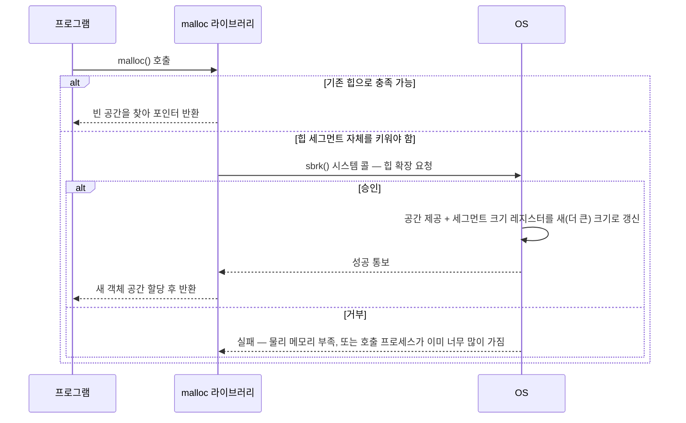

---
tags:
  - topic/os
  - ostep/virtualization
  - segmentation
  - external-fragmentation
  - segmentation-fault
  - mach-o
  - status/verified
aliases:
  - 세그멘테이션
  - Segmentation
  - 외부 단편화
  - 세그멘테이션 폴트
created: 2026-08-19
updated: 2026-08-19
---

# 16. 세그멘테이션 (Segmentation)

> 베이스/바운드 한 쌍을 **논리 세그먼트별 한 쌍**으로 일반화. 희소 주소 공간을 지원하나 외부 단편화라는 새 문제 발생

- 원서 PDF — [16-Segmentation.pdf](../../pdfs/01-virtualization/16-Segmentation.pdf)
- 원서 절 구조 — 16.1 일반화된 베이스/바운드 · 16.2 어느 세그먼트인가 · 16.3 스택 처리 · 16.4 공유 지원 · 16.5 세밀도 · 16.6 OS 지원 · 16.7 요약

## 문제 — 스택과 힙 사이의 낭비

- 지금까지 각 프로세스의 **주소 공간 전체**를 메모리에 넣었음
- 주소 공간에서 흥미로운 지점 — **스택과 힙 사이에 큰 "빈" 공간**
- 그 공간은 프로세스가 쓰지 않지만, 주소 공간 전체를 재배치할 때 **여전히 물리 메모리를 차지** → 베이스/바운드 한 쌍 방식은 **낭비적**
- 또한 주소 공간 전체가 메모리에 맞지 않으면 프로그램 실행이 어려움 → **유연성 부족**

> [!question] CRUX: 큰 주소 공간을 어떻게 지원하는가
> 스택과 힙 사이에 (잠재적으로) 많은 빈 공간이 있는 큰 주소 공간을 어떻게 지원하는가.
> 작은(가상의) 주소 공간 예에서는 낭비가 심해 보이지 않으나, **32비트 주소 공간(4GB)** 을 상상해 볼 것 — 전형적 프로그램은 메가바이트 단위만 쓰지만 주소 공간 전체가 메모리에 상주해야 함

## 16.1 세그멘테이션 — 일반화된 베이스/바운드

- 착상 — MMU에 베이스/바운드를 **한 쌍만** 두는 대신, **주소 공간의 논리 세그먼트마다 한 쌍**을 두는 것
- 매우 오래된 착상 — 최소한 1960년대 초까지 거슬러 감
- **세그먼트(segment)** — 특정 길이의 주소 공간 **연속 부분**. 표준 주소 공간에는 논리적으로 다른 세그먼트 3개(코드·스택·힙) 존재
- 효과 — OS가 각 세그먼트를 **물리 메모리의 서로 다른 부분**에 배치 가능 → 쓰이지 않는 가상 주소 공간으로 물리 메모리를 채우는 일을 피함

### 세그먼트별 배치

```text
[물리 메모리 64KB]
0KB    ┌──────────────────────────────┐
       │ Operating System             │
16KB   ├──────────────────────────────┤
       │ (not in use)                 │
       ├──────────────────────────────┤  ← Stack base = 28KB
       │ Stack                        │
32KB   ├──────────────────────────────┤  ← Code base = 32KB
       │ Code                         │
       │ Heap                         │  ← Heap base = 34KB
       ├──────────────────────────────┤
48KB   │ (not in use)                 │
       ├──────────────────────────────┤
       │ (not in use)                 │
64KB   └──────────────────────────────┘
```

- **쓰이는 메모리만** 물리 메모리에 공간을 배정 → 미사용 영역이 큰 **희소 주소 공간(sparse address space)** 수용 가능

### 세그먼트 레지스터 값

| 세그먼트 | 베이스 | 크기 |
|---|---|---|
| Code | 32K | 2K |
| Heap | 34K | 3K |
| Stack | 28K | 2K |

- 크기(size) 레지스터는 앞서 도입한 **바운드 레지스터와 정확히 동일** — 이 세그먼트에서 몇 바이트가 유효한지 하드웨어에 알려줌

### 변환 예제 — 검산

**코드 세그먼트** — 가상 주소 100 참조 (명령어 반입 등).

```text
100 < 2KB (경계 검사 통과)
물리 주소 = 32KB + 100 = 32768 + 100 = 32868
```

**힙 세그먼트** — 가상 주소 4200 참조.

```text
잘못된 계산: 4200 + 34KB = 39016  ← 오답
```

- **먼저 세그먼트 내 오프셋을 추출해야 함**

```text
힙은 가상 주소 4KB(4096) 에서 시작
오프셋 = 4200 − 4096 = 104
물리 주소 = 34KB + 104 = 34816 + 104 = 34920
```

**불법 주소** — 가상 주소 7KB 이상(힙 끝을 넘음).

- 하드웨어가 경계 밖임을 탐지 → OS로 트랩 → 위반 프로세스 종료 가능성

> [!note] ASIDE: 세그멘테이션 폴트
> **세그멘테이션 폴트(segmentation fault)** 또는 위반(violation)이라는 용어는 **세그먼트 방식 머신**에서 불법 주소에 메모리 접근한 것에서 유래.
> 유머러스하게도 이 용어는 **세그멘테이션을 전혀 지원하지 않는 머신에서도** 살아남음. 또는 자기 코드가 왜 계속 폴트하는지 알 수 없다면 그다지 유머러스하지 않음

## 16.2 어느 세그먼트를 참조하는가

### 명시적(explicit) 방식

- 가상 주소의 **상위 몇 비트**로 주소 공간을 세그먼트로 나눔. VAX/VMS 시스템에서 사용
- 세그먼트가 3개면 **2비트** 필요. 14비트 가상 주소의 상위 2비트로 세그먼트 선택

```text
 13 12 | 11 10  9  8  7  6  5  4  3  2  1  0
 ──────┼───────────────────────────────────
Segment|              Offset
```

| 상위 2비트 | 세그먼트 |
|---|---|
| `00` | 코드 |
| `01` | 힙 |
| `11` | 스택 |

가상 주소 4200 의 이진 표현.

```text
 13 12 | 11 10  9  8  7  6  5  4  3  2  1  0
  0  1 |  0  0  0  0  0  1  1  0  1  0  0  0
Segment|              Offset
```

- 상위 2비트 `01` → **힙**
- 하위 12비트 `0000 0110 1000` = 16진 `0x068` = 10진 **104** → 앞서 계산한 오프셋과 일치
- **오프셋이 경계 검사도 쉽게 만듦** — 오프셋이 바운드보다 작은지만 확인하면 됨

하드웨어 알고리즘 (베이스·바운드가 세그먼트당 한 항목인 배열인 경우).

```c
// get top 2 bits of 14-bit VA
Segment = (VirtualAddress & SEG_MASK) >> SEG_SHIFT
// now get offset
Offset = VirtualAddress & OFFSET_MASK
if (Offset >= Bounds[Segment])
    RaiseException(PROTECTION_FAULT)
else
    PhysAddr = Base[Segment] + Offset
    Register = AccessMemory(PhysAddr)
```

| 상수 | 값 | 의미 |
|---|---|---|
| `SEG_MASK` | `0x3000` | 상위 2비트 추출 마스크 (`11 0000 0000 0000`) |
| `SEG_SHIFT` | `12` | 추출한 세그먼트 번호를 오른쪽으로 밀어 정렬 |
| `OFFSET_MASK` | `0xFFF` | 하위 12비트 추출 마스크 |

### 명시적 방식의 두 한계

| 한계 | 내용 |
|---|---|
| **세그먼트 하나가 미사용** | 상위 2비트로 4개를 구분하나 세그먼트는 3개 → 하나가 낭비. 일부 시스템은 **코드를 힙과 같은 세그먼트에 두어 1비트만** 사용 |
| **세그먼트 최대 크기 제한** | 이 예에서 16KB 주소 공간이 4조각으로 나뉘어 **세그먼트당 최대 4KB**. 프로그램이 그 이상으로 힙·스택을 키우려 하면 **불가** |

### 암묵적(implicit) 방식

- 하드웨어가 **주소가 어떻게 형성되었는지 보고** 세그먼트를 판단

| 주소 출처 | 판정 세그먼트 |
|---|---|
| 프로그램 카운터에서 생성 (명령어 반입) | **코드** |
| 스택 포인터·베이스 포인터 기반 | **스택** |
| 그 외 모든 주소 | **힙** |

## 16.3 스택 처리 — 역방향 성장

- 스택은 물리 주소 28KB 로 재배치되었으나 **결정적 차이** — **거꾸로 자람**(낮은 주소 쪽으로)
- 물리 메모리에서 28KB 에서 "시작"해 26KB 로 되돌아 자람. 가상 주소 16KB~14KB 에 대응 → **변환이 다르게 진행되어야 함**

추가 하드웨어 — 세그먼트가 **어느 방향으로 자라는지** 나타내는 비트.

| 세그먼트 | 베이스 | 크기 (최대 4K) | 양의 방향 성장? |
|---|---|---|---|
| Code `00` | 32K | 2K | **1** |
| Heap `01` | 34K | 3K | **1** |
| Stack `11` | 28K | 2K | **0** |

### 스택 변환 검산

가상 주소 15KB → 물리 주소 27KB 로 매핑되어야 함.

```text
가상 주소 15KB = 11 1100 0000 0000 (16진 0x3C00)

상위 2비트 11 → 스택 세그먼트
남은 오프셋 = 3KB

음수 오프셋 계산: 최대 세그먼트 크기를 뺀다
  3KB − 4KB = −1KB

물리 주소 = 베이스 + 음수 오프셋
          = 28KB + (−1KB) = 27KB   ✓

경계 검사: |−1KB| = 1KB ≤ 현재 크기 2KB   ✓
```

> [!note] ASIDE: 스택이 28KB 에서 "시작"한다는 표현 (원서 각주)
> 단순화를 위해 스택이 28KB 에서 시작한다고 말하지만, 이 값은 실제로는 **역방향 성장 영역 위치 바로 아래 바이트**. 첫 유효 바이트는 실제로 **28KB − 1**.
> 반대로 순방향 성장 영역은 세그먼트 **첫 바이트의 주소**에서 시작. 이렇게 잡는 이유는 물리 주소 계산이 단순해지기 때문 — **물리 주소 = 베이스 + 음수 오프셋**

## 16.4 공유 지원

- 메모리 절약을 위해 **주소 공간 간에 특정 메모리 세그먼트를 공유**하는 것이 유용한 경우 존재
- 특히 **코드 공유**는 흔하며 오늘날 시스템에서도 여전히 사용
- 필요한 하드웨어 — **보호 비트(protection bits)**. 세그먼트당 몇 비트를 추가해 프로그램이 그 세그먼트를 읽기·쓰기·실행할 수 있는지 표시

| 세그먼트 | 베이스 | 크기 (최대 4K) | 양의 방향 성장? | 보호 |
|---|---|---|---|---|
| Code `00` | 32K | 2K | 1 | **Read-Execute** |
| Heap `01` | 34K | 3K | 1 | Read-Write |
| Stack `11` | 28K | 2K | 0 | Read-Write |

- 코드 세그먼트를 **읽기 전용**으로 설정하면, 격리를 해칠 걱정 없이 **같은 코드를 여러 프로세스가 공유** 가능
- 각 프로세스는 여전히 자기 사설 메모리에 접근한다고 생각하나, OS는 **프로세스가 수정할 수 없는 메모리를 몰래 공유** → 환상은 보존됨
- 보호 비트가 있으면 하드웨어 알고리즘도 변경 필요 — 경계 검사에 더해 **그 접근이 허용되는지** 확인. 사용자 프로세스가 읽기 전용 세그먼트에 쓰려 하거나 실행 불가 세그먼트에서 실행하려 하면 **예외 발생**

## 16.5 세밀도 — 조밀 vs 정밀

| 구분 | 세그먼트 수 | 특징 |
|---|---|---|
| **조밀(coarse-grained)** | 소수 (코드·스택·힙) | 주소 공간을 상대적으로 큰 덩어리로 나눔 |
| **정밀(fine-grained)** | 다수의 작은 세그먼트 | 초기 시스템(Multics 등)이 더 유연하게 지원 |

- 다수 세그먼트 지원에는 추가 하드웨어 지원 — **메모리에 저장된 세그먼트 테이블(segment table)** 필요
- 예 — Burroughs B5000 은 **수천 개 세그먼트** 지원. 컴파일러가 코드와 데이터를 별개 세그먼트로 쪼개고 OS·하드웨어가 이를 지원할 것을 기대
- 당시 사고 — 정밀 세그먼트가 있으면 **OS가 어느 세그먼트가 사용 중인지 더 잘 학습**해 주 메모리를 더 효과적으로 활용할 수 있다는 것

### macOS 실측 — Mach-O 의 세그먼트 구조

macOS 실행 파일 형식(Mach-O)은 실제로 **세그먼트 단위**로 구성됨. 실습 3의 `layout` 실행 파일을 조사.

```bash
size -m ./layout
```

- `size` — 실행 파일의 섹션·세그먼트 크기 출력
- `-m` — macOS 전용. **Mach-O 세그먼트별로** 그 안의 섹션까지 상세 표시

```text
Segment __PAGEZERO: 4294967296 (zero fill) 
Segment __TEXT: 16384
	Section __text: 624
	Section __stubs: 36
	Section __cstring: 589
	Section __unwind_info: 96
	total 1345
Segment __DATA_CONST: 16384
	Section __got: 24
	total 24
Segment __DATA: 16384
	Section __data: 20
	Section __common: 4 (zerofill)
	total 24
Segment __LINKEDIT: 16384
total 4295032832
```

| 세그먼트 | 크기 | 역할 | 실습 3 관찰과의 대응 |
|---|---|---|---|
| **`__PAGEZERO`** | **4 GB** (zero fill) | 주소 0 부터 접근 **불가** 영역 | **NULL 역참조가 세그폴트를 내는 이유** — 실습 4 `01-null` 의 `Hint: address points to the zero page` |
| **`__TEXT`** | 16 KB | 코드(`__text`) + **문자열 리터럴(`__cstring` 589바이트)** | 실습 3 에서 문자열 리터럴 주소가 **코드 근처**였던 이유 |
| **`__DATA_CONST`** | 16 KB | 상수 데이터·GOT(`__got`) | 동적 링킹용 전역 오프셋 테이블 |
| **`__DATA`** | 16 KB | 초기화 데이터(`__data` 20바이트) + **`__common` 4바이트 (zerofill)** | `global_init`·`static_var` 는 `__data`, **`global_uninit`(int 4바이트)은 `__common` 의 zerofill** → 값이 0 이었던 이유 |
| **`__LINKEDIT`** | 16 KB | 심볼 테이블·재배치 정보 | — |

- 원서의 조밀 세그멘테이션(코드·스택·힙 3개)보다 **세분화**되어 있음 — 보호 속성이 다른 영역을 분리
- `__PAGEZERO` 가 **4GB 를 zero fill 로 예약**하는 것은 물리 메모리를 그만큼 쓴다는 뜻이 아님 — **매핑되지 않은 영역**으로 두어 접근 시 폴트를 유발하는 장치
- 세그먼트 크기가 모두 **16384(16KB)** 인 것은 arm64 macOS 의 **페이지 크기가 16KB** 이며 세그먼트가 페이지 경계에 정렬되기 때문 (ch 18 페이징과 연결)

## 16.6 OS 지원

세그멘테이션이 OS에 제기하는 새 문제 3가지.

### 문제 1 — 문맥 교환

- **세그먼트 레지스터를 저장·복원**해야 함. 각 프로세스가 자기 가상 주소 공간을 가지므로, 프로세스를 다시 실행시키기 전에 이 레지스터들을 올바르게 설정

### 문제 2 — 세그먼트 성장(또는 축소)



- 전통적 UNIX 시스템 콜 **`sbrk()`** 사용

### 문제 3 (가장 중요) — 물리 메모리의 프리 공간 관리

- 이전에는 각 주소 공간이 같은 크기라고 가정 → 물리 메모리를 **슬롯 묶음**으로 볼 수 있었음
- 이제 프로세스마다 세그먼트가 여러 개이며 **각 세그먼트 크기가 다를 수 있음**
- 발생하는 일반 문제 — 물리 메모리가 **작은 빈 구멍들로 빠르게 채워짐** → 새 세그먼트 할당이나 기존 세그먼트 확장이 어려워짐. 이것이 **외부 단편화(external fragmentation)**

```text
[압축 전 — Not Compacted]          [압축 후 — Compacted]
0KB  ┌────────────────┐            0KB  ┌────────────────┐
     │ Operating      │                 │ Operating      │
8KB  │ System         │            8KB  │ System         │
16KB ├────────────────┤            16KB ├────────────────┤
     │ (not in use)   │                 │ Allocated      │
24KB ├────────────────┤            24KB │                │
     │ Allocated      │                 ├────────────────┤
32KB ├────────────────┤            32KB │ Allocated      │
     │ (not in use)   │                 ├────────────────┤
40KB ├────────────────┤            40KB │                │
     │ Allocated      │                 │                │
48KB ├────────────────┤            48KB │                │
     │ (not in use)   │                 │ (not in use)   │
56KB │                │            56KB │                │
     ├────────────────┤                 │                │
     │ Allocated      │                 │                │
64KB └────────────────┘            64KB └────────────────┘
```

- 예 — 20KB 세그먼트를 할당하려는 프로세스가 도착. **빈 공간 총합은 24KB** 이나 **하나의 연속 세그먼트가 아님**(3개 비연속 덩어리) → OS가 20KB 요청을 **충족할 수 없음**
- 세그먼트 확장 요청에서도 유사 문제 — 다음 바이트들이 사용 가능하지 않으면, 물리 메모리 다른 곳에 빈 바이트가 있어도 OS가 요청을 거부해야 함

### 해법 후보

| 해법 | 방법 | 비용 |
|---|---|---|
| **압축(compaction)** | 실행 중 프로세스를 멈추고 데이터를 하나의 연속 영역으로 복사, 세그먼트 레지스터 값을 새 물리 위치로 변경 | **비쌈** — 세그먼트 복사가 메모리 집약적이며 프로세서 시간을 상당히 소모. 역설적으로 **기존 세그먼트 확장 요청을 처리하기 어렵게** 만들어 추가 재배열을 유발할 수 있음 |
| **프리 리스트 관리 알고리즘** | 큰 연속 영역을 할당 가능한 상태로 유지하려는 알고리즘 — best-fit, worst-fit, first-fit, buddy 등 | 어떤 알고리즘도 **외부 단편화를 없애지는 못함**. 좋은 알고리즘은 이를 **최소화**하려 시도 |

> [!tip] TIP: 1000가지 해법이 있다면 훌륭한 해법은 없다
> 외부 단편화를 최소화하려는 알고리즘이 이토록 많이 존재한다는 사실은 더 강한 근본 진실을 시사 — **문제를 푸는 하나의 "최선" 방법이 없음**. 따라서 합리적인 것에 만족하고 그것이 충분히 좋기를 바랄 뿐.
> **유일한 진짜 해법은 문제를 아예 피하는 것** — **가변 크기 덩어리로 메모리를 할당하지 않음**으로써 (다음 챕터들에서 다룸 → 페이징)

## 16.7 정리

**세그멘테이션이 해결한 것**

- 동적 재배치를 넘어 **희소 주소 공간을 더 잘 지원** — 논리 세그먼트 사이의 거대한 메모리 낭비 회피
- **빠름** — 세그멘테이션이 요구하는 산술(덧셈·비교)은 쉽고 하드웨어에 적합. 변환 오버헤드 최소
- 부수 이익 — **코드 공유**. 코드를 별개 세그먼트에 두면 여러 실행 프로그램이 공유 가능

**남은 두 문제**

| 문제 | 내용 |
|---|---|
| **외부 단편화** | 세그먼트가 가변 크기이므로 빈 메모리가 **이상한 크기 조각들로 쪼개짐** → 메모리 할당 요청 충족이 어려워짐. 영리한 알고리즘이나 주기적 압축을 시도할 수 있으나 **문제는 근본적이며 피하기 어려움** |
| **여전히 부족한 유연성** | 완전히 일반화된 희소 주소 공간을 지원하기에 부족. **크지만 희소하게 쓰이는 힙**이 하나의 논리 세그먼트에 있으면, 접근을 위해 **힙 전체가 메모리에 상주**해야 함. 주소 공간 사용 모델이 하부 세그멘테이션 설계와 정확히 맞지 않으면 잘 동작하지 않음 |

- 따라서 **새 해법을 찾아야 함** → ch 18 페이징

## 관련 문서

- [[OS/ostep/docs/01-virtualization/15-address-translation|15. 주소 변환]] — 베이스/바운드 한 쌍 방식의 한계가 이 챕터의 출발점
- [[OS/ostep/docs/01-virtualization/17-free-space-management|17. 프리 공간 관리]] — 외부 단편화를 다루는 프리 리스트 알고리즘
- [[OS/ostep/docs/01-virtualization/18-introduction-to-paging|18. 페이징 도입]] — 고정 크기 할당으로 외부 단편화를 아예 회피
- [[OS/ostep/projects/03-address-space/README|실습 3. 주소 공간 관찰]] — Mach-O 세그먼트 실측의 배경
- [[OS/ostep/projects/04-memory-api/README|실습 4. 메모리 API와 오류 검출]] — `__PAGEZERO` 와 NULL 역참조 세그폴트
- [[OS/ostep/docs/README|이론 문서 인덱스]] — 전 챕터 목록
