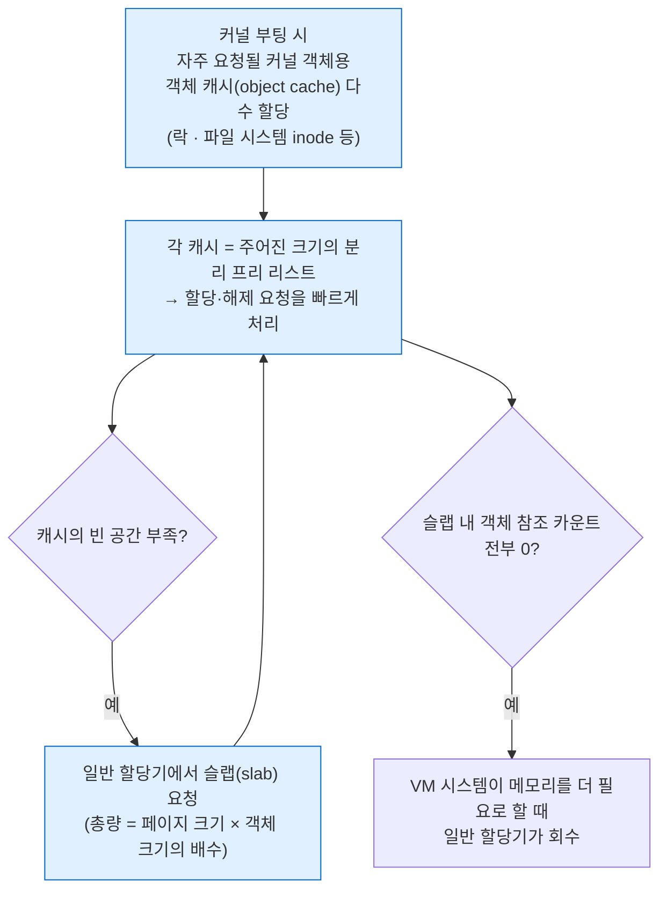
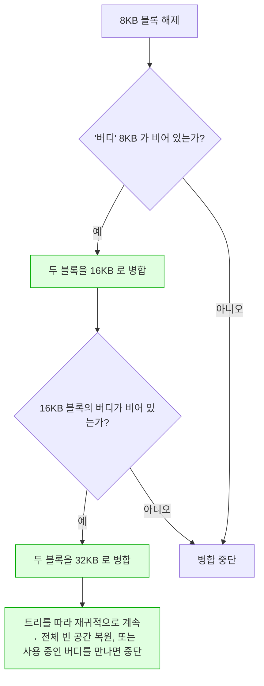

---
tags:
  - topic/os
  - ostep/virtualization
  - free-list
  - allocator
  - fragmentation
  - buddy-allocation
  - slab-allocator
  - lang/c
  - status/verified
aliases:
  - 프리 공간 관리
  - Free-Space Management
  - 프리 리스트
  - best fit
  - 버디 할당
created: 2026-08-19
updated: 2026-08-19
---

# 17. 프리 공간 관리 (Free-Space Management)

> 가변 크기 요청을 다루는 할당기의 내부. 분할·병합·헤더·프리 리스트 임베딩과 fit 정책, 그리고 분리 리스트·버디 할당

- 원서 PDF — [17-Free-Space-Management.pdf](../../pdfs/01-virtualization/17-Free-Space-Management.pdf)
- 실습 — [[OS/ostep/projects/05-free-space/README|실습 5. 프리 리스트 할당기 직접 구현]]
- 원서 절 구조 — 17.1 가정 · 17.2 저수준 기법 · 17.3 기본 전략 · 17.4 기타 접근 · 17.5 요약

- 메모리 가상화 논의에서 잠시 벗어나, **모든 메모리 관리 시스템의 근본적 측면**을 다룸 — `malloc` 라이브러리(프로세스 힙의 페이지 관리)든 OS 자신(프로세스 주소 공간 일부 관리)이든

| 관리 대상 | 난이도 |
|---|---|
| **고정 크기 단위** | **쉬움** — 고정 크기 단위 리스트를 두고 요청 시 첫 항목 반환 (→ ch 18 페이징) |
| **가변 크기 단위** | **어렵고 흥미로움** — 사용자 수준 할당 라이브러리(`malloc`/`free`), 세그멘테이션으로 가상 메모리를 구현하는 OS |

가변 크기에서 발생하는 문제가 **외부 단편화(external fragmentation)**.

```text
     free          used          free
 0            10            20            30
```

- 총 빈 공간은 **20바이트**이나 각 10바이트 **두 조각으로 단편화**
- 결과 — **15바이트 요청이 실패**. 20바이트가 비어 있는데도

> [!question] CRUX: 프리 공간을 어떻게 관리하는가
> 가변 크기 요청을 충족할 때 프리 공간을 어떻게 관리해야 하는가. 단편화를 최소화하기 위해 어떤 전략을 쓸 수 있는가. 대안적 접근들의 시간·공간 오버헤드는 무엇인가

## 17.1 가정

| 가정 | 내용 |
|---|---|
| 인터페이스 | `void *malloc(size_t size)` / `void free(void *ptr)`. **해제 시 사용자가 크기를 알려주지 않음** → 라이브러리가 포인터만으로 크기를 알아내야 함 |
| 자료 구조 | 라이브러리가 관리하는 공간이 역사적으로 **힙(heap)**. 프리 공간 추적 구조가 **프리 리스트(free list)**. 반드시 리스트일 필요는 없고 어떤 형태든 무방 |
| 주 관심사 | **외부 단편화**. 할당기가 요청보다 큰 청크를 주면 그 안의 미사용 공간이 **내부 단편화(internal fragmentation)** — 낭비가 할당 단위 **내부**에서 발생하므로 |
| 재배치 불가 | 일단 클라이언트에게 넘긴 메모리는 **다른 위치로 옮길 수 없음** → **압축(compaction) 불가** |
| 연속 영역 | 할당기가 연속된 바이트 영역을 관리. 단순화를 위해 **크기 고정**으로 가정 |

> [!note] ASIDE: 왜 압축이 불가능한가 (원서 각주)
> C 프로그램에 메모리 청크 포인터를 넘긴 뒤에는, 그 영역에 대한 **모든 참조(포인터)를 찾아내는 것이 일반적으로 어려움** — 다른 변수나 실행 중 레지스터에 저장되어 있을 수 있음.
> **더 강한 타입 체계와 GC를 가진 언어**에서는 사정이 다르며, 그래서 압축을 단편화 대응 기법으로 쓸 수 있음. OS 는 세그멘테이션 구현 시 압축을 사용할 수 있음(ch 16)

## 17.2 저수준 기법

### 분할(splitting)과 병합(coalescing)

30바이트 힙의 프리 리스트.

```text
     free          used          free
 0            10            20            30

head --> [addr:0  len:10] --> [addr:20 len:10] --> NULL
```

**분할** — 1바이트 요청 시. 요청을 충족할 청크를 찾아 **둘로 쪼갬**. 첫 조각을 호출자에게, 둘째 조각은 리스트에 유지.

```text
malloc(1) → 주소 20 반환

head --> [addr:0  len:10] --> [addr:21 len:9] --> NULL
```

- 리스트 구조는 유지되고, **빈 영역 시작이 20 → 21, 길이가 10 → 9** 로만 변함
- 요청이 특정 프리 청크 크기보다 작을 때 흔히 사용

**병합** — `free(10)` 으로 힙 중간 공간을 반환하는 경우. 생각 없이 리스트에 되돌리면.

```text
head --> [addr:10 len:10] --> [addr:0 len:10] --> [addr:20 len:10] --> NULL
```

- 문제 — 힙 전체가 비었는데 **10바이트 3조각으로 보임** → 20바이트 요청 시 단순 순회로는 못 찾고 실패

**병합 적용** — 청크를 반환할 때 **반환 청크와 인접 프리 청크들의 주소를 살펴** 바로 옆이면 하나의 큰 청크로 합침.

```text
head --> [addr:0 len:30] --> NULL
```

- 할당 전 최초 상태로 복원 → **큰 연속 영역을 응용에 제공할 수 있음**

### 할당 영역 크기 추적 — 헤더

- `free(void *ptr)` 가 크기 인자를 받지 않으므로, 라이브러리가 **포인터만으로 크기를 결정**해야 함
- 대부분 할당기는 **헤더 블록(header block)** 에 추가 정보를 저장 — 통상 넘겨준 청크 **바로 앞**

```text
        ┌─────────────────────────────┐
        │  header (malloc 라이브러리)  │
 ptr →  ├─────────────────────────────┤
        │                             │
        │  호출자에게 반환한 20 바이트 │
        │                             │
        └─────────────────────────────┘
```

- 헤더는 최소한 **할당 영역 크기**를 포함. 해제를 빠르게 하는 추가 포인터, **무결성 검사용 매직 넘버** 등도 포함 가능

```c
typedef struct {
    int size;
    int magic;
} header_t;
```

```text
hptr →  ┌─────────────────────────────┐
        │ size:  20                   │
        │ magic: 1234567              │
 ptr →  ├─────────────────────────────┤
        │  호출자에게 반환한 20 바이트 │
        └─────────────────────────────┘
```

`free(ptr)` 시 라이브러리가 포인터 산술로 헤더 시작 위치를 찾음.

```c
void free(void *ptr) {
    header_t *hptr = (header_t *) ptr - 1;
    ...
```

- 헤더 포인터를 얻은 뒤 **매직 넘버 일치 여부를 온전성 검사**(`assert(hptr->magic == 1234567)`)
- 새로 해제된 영역의 총 크기 = **헤더 크기 + 사용자 할당 크기**
- **결정적으로 중요한 세부** — 사용자가 `N` 바이트를 요청하면 라이브러리는 크기 `N` 청크를 찾는 것이 **아니라** `N + 헤더 크기` 청크를 찾음

### 프리 리스트를 빈 공간 안에 임베딩

- 통상 리스트는 노드 공간이 필요할 때 `malloc()` 을 호출하면 되나, **메모리 할당 라이브러리 내부에서는 그럴 수 없음**
- **빈 공간 자체 안에** 리스트를 구축해야 함

```c
typedef struct __node_t {
    int              size;
    struct __node_t *next;
} node_t;
```

4096바이트 힙 초기화 (`mmap` 으로 확보).

```c
// mmap() returns a pointer to a chunk of free space
node_t *head = mmap(NULL, 4096, PROT_READ|PROT_WRITE,
                    MAP_ANON|MAP_PRIVATE, -1, 0);
head->size   = 4096 - sizeof(node_t);
head->next   = NULL;
```

- `mmap` 인자 — `NULL`(커널이 주소 선택), `4096`(길이), `PROT_READ|PROT_WRITE`(읽기·쓰기 허용), `MAP_ANON|MAP_PRIVATE`(파일 무관 익명 매핑 · 사설), `-1, 0`(익명이므로 fd·오프셋 미사용)
- 결과 — 크기 **4088** 항목 하나 (원서의 32비트 가정: `sizeof(node_t)` = 8)

```text
[가상 주소 16KB]
head → ┌─────────────────────────────┐
       │ size: 4088                  │  header: size field
       │ next: 0                     │  header: next field (NULL is 0)
       ├─────────────────────────────┤
       │                             │
       │  4KB 청크의 나머지          │
       │                             │
       └─────────────────────────────┘
```

**100바이트 요청 후** — 헤더 8바이트 가정.

```text
[가상 주소 16KB]
       ┌─────────────────────────────┐
       │ size: 100                   │
       │ magic: 1234567              │
 ptr → ├─────────────────────────────┤
       │  할당된 100 바이트          │
head → ├─────────────────────────────┤
       │ size: 3980                  │
       │ next: 0                     │
       ├─────────────────────────────┤
       │  빈 3980 바이트 청크        │
       └─────────────────────────────┘
```

- 100바이트 요청에 **108바이트를 소비**(헤더 8 + 사용자 100), `4088 − 108 = 3980`

**100바이트 3회 할당 후**

- 힙 앞쪽 **324바이트**(`108 × 3`)가 할당됨. 헤더 3개와 100바이트 영역 3개
- 프리 리스트는 여전히 노드 1개이나 크기가 `4088 − 324 = 3764`

**가운데 청크 해제 후** — `free(16500)`

```text
16500 = 16384(힙 시작) + 108(앞 청크) + 8(이 청크의 헤더)
```

```text
head → [size:100, next:16708] (가운데, 이제 프리) → [size:3764, next:0] → NULL
```

- 리스트가 **작은 프리 청크(100바이트)** 와 **큰 프리 청크(3764바이트)** 로 시작 → **드디어 항목이 2개 이상**
- 프리 공간이 **단편화** — 불행하나 흔한 일
- `16708 = 16384 + 324` — 세 번째 청크 다음, 즉 큰 프리 청크의 시작

**남은 두 청크도 해제, 병합 없음** — 원서 Figure 17.7

```text
[size:100, next:16492] (프리)
[size:100, next:16708] (프리)
head → [size:100, next:16384] (프리)
[size:3764, next:0]
```

- 모든 메모리가 비었는데 **조각으로 쪼개져 단편화된 것처럼 보임**
- 해법 — 리스트를 훑어 **이웃 청크를 병합**하면 힙이 다시 온전해짐

### 힙 성장

- 힙 공간이 고갈되면?

| 접근 | 내용 |
|---|---|
| **그냥 실패** | `NULL` 반환. 어떤 경우에는 유일한 선택 |
| **OS 에 더 요청** | 대부분 전통적 할당기는 작은 힙에서 시작해 고갈 시 OS에 요청. **`sbrk`** 같은 시스템 콜로 힙을 늘리고 새 청크를 그곳에서 할당 |

- `sbrk` 요청 처리 — OS가 **빈 물리 페이지를 찾아 요청 프로세스 주소 공간에 매핑**하고 새 힙 끝 값을 반환

## 17.3 기본 전략

- **이상적 할당기는 빠르면서 단편화를 최소화**
- 그러나 할당·해제 요청 흐름이 임의적이므로(프로그래머가 결정) **어떤 전략이든 잘못된 입력에서는 매우 나쁠 수 있음** → "최선" 접근은 서술하지 않고 기본들의 장단점만 논의

| 전략 | 방법 | 장점 | 단점 |
|---|---|---|---|
| **Best Fit** | 요청 이상 크기 청크 전부를 찾은 뒤 **그중 가장 작은 것** 반환 (smallest fit) | 낭비 공간 축소 시도 | **전체 탐색** 필요 → 순진한 구현은 무거운 성능 페널티. **작은 자투리 청크**가 남음 |
| **Worst Fit** | **가장 큰 청크**를 찾아 요청량만 주고 남은 큰 청크를 리스트에 유지 | 큰 청크를 남기려는 의도 | **전체 탐색** 필요. 대부분 연구가 **나쁜 성능** 보고 — 과도한 단편화 + 높은 오버헤드 |
| **First Fit** | **충분히 큰 첫 블록**을 찾아 반환 | **빠름** — 전체 탐색 불필요 | 리스트 **앞부분이 작은 객체로 오염**될 수 있음 → **주소 기반 정렬**로 완화(병합이 쉬워지고 단편화 감소) |
| **Next Fit** | first fit 탐색을 **마지막으로 본 위치**부터 시작 (추가 포인터 유지) | 탐색을 리스트 전반에 고르게 분산 → 앞부분 파편화 회피. 성능은 first fit 과 유사 | — |

### 예제 — 검산

프리 리스트 항목 3개: 크기 10, 30, 20. **요청 15**.

```text
head --> [10] --> [30] --> [20] --> NULL
```

| 전략 | 선택 | 결과 리스트 |
|---|---|---|
| **Best Fit** | **20** (요청을 수용하는 가장 작은 공간) | `[10] --> [30] --> [5]` |
| **Worst Fit** | **30** (가장 큰 것) | `[10] --> [15] --> [20]` |
| **First Fit** | **30** (충족하는 첫 블록. 10은 부족) | `[10] --> [15] --> [20]` — worst fit 과 동일 결과 |

- best fit 결과에 **작은 프리 청크(5)** 가 남음 — best fit 에서 흔히 일어나는 일
- first fit 과 worst fit 이 이 예에서 같은 결과이나 **차이는 탐색 비용** — best·worst 는 전체 리스트를 보고, first 는 맞는 것을 찾을 때까지만 봄

### macOS 실측 — 세 정책의 실제 선택 차이

직접 구현한 할당기로 동일 프리 리스트에 대해 세 정책을 실행 (상세는 [[OS/ostep/projects/05-free-space/README|실습 5]]).

```text
요청 전 프리 리스트  [off:208 len:38] -> [off:454 len:18] -> [off:680 len:3400]
```

| 정책 | 선택 청크 | 반환 오프셋 | 요청 후 프리 리스트 |
|---|---|---|---|
| **best fit** | `len:18` | 462 | `[off:208 len:38] -> [off:680 len:3400]` |
| **worst fit** | `len:3400` | 688 | `[off:208 len:38] -> [off:454 len:18] -> [off:696 len:3384]` |
| **first fit** | `len:38` | 216 | `[off:224 len:22] -> [off:454 len:18] -> [off:680 len:3400]` |

- **best fit** — 딱 맞는 청크를 소비해 리스트 항목이 3 → 2. 남은 2바이트는 노드(16바이트)를 담을 수 없어 **회수 불가 = 내부 단편화**
- **worst fit** — 큰 청크를 깎고 **작은 청크들을 그대로 남김** → 원서 지적과 일치
- **first fit** — 첫 청크를 분할해 **작은 조각(22바이트)을 리스트 앞쪽에 남김** → 원서 지적 "pollutes the beginning of the free list with small objects" 재현

## 17.4 기타 접근

### 분리 리스트 (segregated lists)

- 착상 — 특정 응용이 **인기 있는 크기 요청** 하나(또는 몇 개)를 한다면, **그 크기 객체만 관리하는 별도 리스트**를 유지. 나머지는 일반 할당기로 전달
- 이점
  - 특정 크기 요청에 전용 메모리 청크를 둠 → **단편화 우려가 훨씬 줄어듦**
  - 맞는 크기의 할당·해제 요청은 **리스트 복잡 탐색 없이 매우 빠르게** 처리
- 새 난점 — **특화 요청용 풀에 메모리를 얼마나 배정**할 것인가(일반 풀 대비)

**슬랩 할당기(slab allocator)** — Jeff Bonwick 이 Solaris 커널용으로 설계해 이 문제를 우아하게 처리.



- 슬랩 할당기는 대부분 분리 리스트 방식을 넘어, **프리 객체를 미리 초기화된(pre-initialized) 상태로** 리스트에 보관
- 근거 — Bonwick 은 **자료 구조 초기화·파괴가 비싸다**는 것을 보임. 해제된 객체를 초기화 상태로 유지하면 **객체별 초기화·파괴 주기를 자주 피할 수 있어** 오버헤드가 뚜렷하게 낮아짐

> [!note] ASIDE: 훌륭한 엔지니어는 정말로 훌륭하다
> Jeff Bonwick(슬랩 할당기 저자이며 놀라운 파일 시스템 **ZFS** 의 리드) 같은 엔지니어가 실리콘 밸리의 심장.
> 거의 모든 훌륭한 제품·기술 뒤에는 재능·능력·헌신에서 평균을 훨씬 넘는 사람(또는 소수 집단)이 있음.
> Mark Zuckerberg 인용 — "Someone who is exceptional in their role is not just a little better than someone who is pretty good. They are 100 times better."
> 그래서 오늘날에도 한두 사람이 세상의 얼굴을 영구히 바꾸는 회사를 시작할 수 있음. 열심히 하면 그런 "100x" 사람이 될 수도 있고, 그러지 못하면 **그런 사람과 함께 일할 방법을 찾을 것** — 대부분이 한 달에 배우는 것을 하루에 배울 것

### 버디 할당 (buddy allocation)

- 병합이 할당기에 결정적이므로, **병합을 단순하게 만드는 것**을 중심으로 설계된 접근. 대표 예가 **이진 버디 할당기(binary buddy allocator)**
- 동작 — 빈 메모리를 개념적으로 크기 `2^N` 인 하나의 큰 공간으로 봄. 요청이 오면 요청을 수용할 만큼 큰 블록을 찾을 때까지 **빈 공간을 재귀적으로 2등분**(더 쪼개면 너무 작아지는 지점까지)

64KB 빈 공간에서 **7KB 블록**을 찾는 과정.

```text
                    64 KB
           ┌──────────┴──────────┐
        32 KB                 32 KB
    ┌─────┴─────┐
 16 KB       16 KB
 ┌──┴──┐
8KB   8KB
 ▲
 └─ 이 8KB 블록을 할당해 반환
```

- **내부 단편화 발생 가능** — **2의 거듭제곱 크기 블록만** 줄 수 있으므로 (7KB 요청에 8KB 배정 → 1KB 낭비)
- **버디 할당의 아름다움은 해제 시점에 드러남**



- 버디 할당이 잘 동작하는 이유 — **특정 블록의 버디를 판정하기가 단순**함
- 근거 — 빈 공간 내 블록들의 주소를 생각해 보면, **각 버디 쌍의 주소는 단 한 비트만 다름**. 어느 비트인지는 **버디 트리에서의 레벨**이 결정

### 그 밖의 착상

- 위 접근들의 주요 문제 — **확장성 부족**. 리스트 탐색이 상당히 느릴 수 있음
- 고급 할당기는 더 복잡한 자료 구조로 이 비용을 해결하며 **단순성을 성능과 교환** — 균형 이진 트리, 스플레이 트리, 부분 정렬 트리 등
- 현대 시스템은 다중 프로세서에 멀티스레드 워크로드를 실행하므로, **멀티프로세서에서 잘 동작하는 할당기**에 많은 노력이 투입됨 — Berger 등의 **Hoard**, Evans 의 **jemalloc**(FreeBSD·NetBSD·Firefox·Facebook 에서 사용)
- 실제 세계 감각을 얻으려면 **glibc 할당기 동작**을 읽어볼 것

## 17.5 정리

- 이 챕터는 메모리 할당기의 **가장 기초적 형태**를 다룸. 이런 할당기는 작성하는 모든 C 프로그램에 링크되어 있고, 자기 자료 구조용 메모리를 관리하는 **하부 OS 안에도** 존재
- 많은 시스템처럼 **다수의 트레이드오프**가 존재하며, 할당기에 제시되는 **정확한 워크로드를 많이 알수록** 그 워크로드에 맞게 더 잘 조율할 수 있음
- **광범위한 워크로드에서 잘 동작하는 빠르고 공간 효율적이며 확장 가능한 할당기**를 만드는 것은 현대 컴퓨터 시스템에서 **여전히 진행 중인 도전**

## 관련 문서

- [[OS/ostep/docs/01-virtualization/16-segmentation|16. 세그멘테이션]] — 외부 단편화가 발생하는 맥락
- [[OS/ostep/docs/01-virtualization/14-memory-api|14. 메모리 API]] — 이 챕터가 구현하는 `malloc`/`free` 인터페이스
- [[OS/ostep/docs/01-virtualization/18-introduction-to-paging|18. 페이징 도입]] — 고정 크기 단위로 이 문제를 회피
- [[OS/ostep/projects/05-free-space/README|실습 5. 프리 리스트 할당기 직접 구현]] — 분할·병합·fit 정책 실측
- [[OS/ostep/projects/04-memory-api/README|실습 4. 메모리 API와 오류 검출]] — 헤더 훼손이 검출되는 이유
- [[C/docs/02-memory/heap-and-free|힙과 free]] — 실제 할당자의 동작
- [[OS/ostep/docs/README|이론 문서 인덱스]] — 전 챕터 목록
