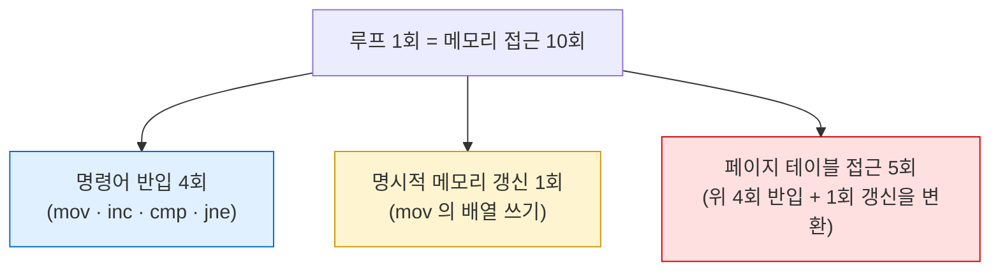

---
tags:
  - topic/os
  - ostep/virtualization
  - paging
  - page-table
  - pte
  - vpn
  - status/verified
aliases:
  - 페이징 도입
  - Paging Introduction
  - 페이지 테이블
  - PTE
  - VPN
created: 2026-08-19
updated: 2026-08-19
---

# 18. 페이징 도입 (Paging: Introduction)

> 주소 공간을 **고정 크기 페이지**로 나눠 외부 단편화를 원천 회피. 대신 페이지 테이블이 **너무 크고 너무 느리다**는 두 문제 발생

- 원서 PDF — [18-Introduction-to-Paging.pdf](../../pdfs/01-virtualization/18-Introduction-to-Paging.pdf)
- 원서 절 구조 — 18.1 예제와 개요 · 18.2 페이지 테이블 저장 위치 · 18.3 페이지 테이블 내용 · 18.4 너무 느림 · 18.5 메모리 트레이스 · 18.6 요약

## 두 가지 공간 관리 접근

| 접근 | 예 | 문제 |
|---|---|---|
| **가변 크기 조각으로 쪼갬** | 세그멘테이션 (ch 16) | 공간 자체가 **단편화** → 시간이 지나며 할당이 어려워짐 |
| **고정 크기 조각으로 쪼갬** | **페이징(paging)** | 이 챕터 주제 |

- 페이징은 초기 중요 시스템 **Atlas** 까지 거슬러 감
- 프로세스 주소 공간을 가변 크기 논리 세그먼트(코드·힙·스택)로 쪼개는 대신 **고정 크기 단위**로 나누고, 각각을 **페이지(page)** 라고 부름
- 물리 메모리는 **페이지 프레임(page frame)** 이라는 고정 크기 슬롯 배열로 봄. 각 프레임이 가상 메모리 페이지 하나를 담을 수 있음

> [!question] CRUX: 페이지로 메모리를 어떻게 가상화하는가
> 세그멘테이션의 문제를 피하도록 페이지로 메모리를 어떻게 가상화하는가. 기본 기법은 무엇인가. 그 기법을 **최소한의 공간·시간 오버헤드**로 잘 동작하게 만드는 방법은 무엇인가

## 18.1 단순 예제와 개요

64바이트 주소 공간, 16바이트 페이지 4개 (가상 페이지 0·1·2·3).

```text
 0  ┌────────────────────────┐
    │ (주소 공간의 page 0)   │
16  ├────────────────────────┤
    │ (page 1)               │
32  ├────────────────────────┤
    │ (page 2)               │
48  ├────────────────────────┤
    │ (page 3)               │
64  └────────────────────────┘
```

128바이트 물리 메모리 (페이지 프레임 8개).

```text
  0 ┌────────────────────────┐
    │ reserved for OS        │  page frame 0
 16 ├────────────────────────┤
    │ (unused)               │  page frame 1
 32 ├────────────────────────┤
    │ page 3 of AS           │  page frame 2
 48 ├────────────────────────┤
    │ page 0 of AS           │  page frame 3
 64 ├────────────────────────┤
    │ (unused)               │  page frame 4
 80 ├────────────────────────┤
    │ page 2 of AS           │  page frame 5
 96 ├────────────────────────┤
    │ (unused)               │  page frame 6
112 ├────────────────────────┤
    │ page 1 of AS           │  page frame 7
128 └────────────────────────┘
```

### 페이징의 장점

| 장점 | 내용 |
|---|---|
| **유연성(flexibility)** | 프로세스가 주소 공간을 **어떻게 쓰든** 주소 공간 추상을 효과적으로 지원. 힙·스택이 자라는 방향이나 사용 방식에 대해 **가정하지 않음** |
| **프리 공간 관리의 단순성** | 64바이트 주소 공간을 배치할 때 **빈 페이지 4개만 찾으면 됨**. 모든 빈 페이지의 프리 리스트에서 앞 4개를 집어가는 식 |

### 페이지 테이블

- 각 가상 페이지가 물리 메모리 어디에 배치되었는지 기록하는 **프로세스별 자료 구조**
- 역할 — 주소 공간의 각 가상 페이지에 대한 **주소 변환을 저장**

위 예의 페이지 테이블 항목 4개.

| 가상 페이지 | 물리 프레임 |
|---|---|
| VP 0 | **PF 3** |
| VP 1 | **PF 7** |
| VP 2 | **PF 5** |
| VP 3 | **PF 2** |

- 페이지 프레임 1·4·6 은 현재 비어 있음
- **프로세스별 자료 구조**임을 기억할 것 — 다른 프로세스가 실행되면 OS는 그 프로세스용 다른 페이지 테이블을 관리해야 함 (예외 — **역페이지 테이블**, ch 20)

> [!note] ASIDE: 자료 구조 — 페이지 테이블
> 현대 OS 메모리 관리 서브시스템의 **가장 중요한 자료 구조 중 하나**. 가상→물리 주소 변환을 저장해 주소 공간의 각 페이지가 실제로 물리 메모리 어디에 있는지 시스템이 알게 함.
> 각 주소 공간이 그런 변환을 필요로 하므로 일반적으로 **시스템의 프로세스당 페이지 테이블 하나**.
> 페이지 테이블의 정확한 구조는 **하드웨어가 결정**(구형 시스템)하거나 **OS가 더 유연하게 관리**(현대 시스템)

### 주소 변환 — 검산

```c
movl <virtual address>, %eax
```

가상 주소를 **VPN(virtual page number)** 과 **오프셋(offset)** 으로 분해.

```text
주소 공간 64바이트 → 6비트 필요 (2^6 = 64)

  Va5 Va4 Va3 Va2 Va1 Va0

페이지 크기 16바이트 → 4페이지 선택에 상위 2비트, 나머지 4비트가 오프셋

  ┌── VPN ──┐┌──────── offset ────────┐
   Va5  Va4   Va3  Va2  Va1  Va0
```

`movl 21, %eax` 의 변환.

```text
21 → 이진 010101

  ┌ VPN ┐┌── offset ──┐
   0  1   0  1  0  1

VPN    = 01     = 1   → 가상 페이지 1
offset = 0101   = 5   → 페이지 내 5번째 바이트

페이지 테이블: VP 1 → PF 7 (이진 111)

물리 주소 = PFN 111 + offset 0101 = 1110101 = 117 (10진)
```

- 검산 — `1110101` = `64 + 32 + 16 + 4 + 1` = **117** ✓
- **오프셋은 변환되지 않음** — 페이지 내 어느 바이트인지만 알려주므로
- 물리 주소 117 은 물리 메모리 그림에서 `page 1 of AS`(프레임 7, 112~128) 내부의 `112 + 5 = 117` 위치와 일치 ✓


## 18.2 페이지 테이블은 어디에 저장되는가

페이지 테이블은 앞서 다룬 작은 세그먼트 테이블이나 베이스/바운드 쌍보다 **훨씬 커질 수 있음**.

### 크기 계산 — 32비트 주소 공간, 4KB 페이지

```text
가상 주소 32비트 = VPN 20비트 + offset 12비트
  (1KB 페이지면 10비트, 4KB 면 +2 → 12비트)

VPN 20비트 → 2^20 = 약 100만 개 변환을 프로세스마다 관리해야 함

PTE 하나에 4바이트(물리 변환 + 기타 유용한 정보) 가정
  → 2^20 × 4바이트 = 4 MB (프로세스당 페이지 테이블)

프로세스 100개 → 400 MB (주소 변환에만)
```

- 기가바이트 메모리 시대에도 **변환에만 큰 덩어리를 쓰는 것은 이상해 보임**
- 64비트 주소 공간의 페이지 테이블 크기는 **너무 끔찍해서** 원서가 언급을 회피

> [!note] ASIDE: 64비트 주소 공간의 규모 (원서 각주)
> 상상하기 어려울 만큼 거대함. 비유 — **32비트 주소 공간을 테니스 코트 크기**로 생각하면 **64비트 주소 공간은 유럽 정도**의 크기

### 결론 — 메모리에 저장

- 페이지 테이블이 너무 크므로, 현재 실행 프로세스의 페이지 테이블을 담는 **MMU 내 특별한 온칩 하드웨어를 두지 않음**
- 대신 각 프로세스의 페이지 테이블을 **메모리 어딘가에** 저장
- 나중에 보게 될 것 — OS 메모리 자체도 상당 부분 가상화 가능하므로 **페이지 테이블을 OS 가상 메모리에 두고 디스크로 스왑**할 수도 있음

## 18.3 페이지 테이블에는 무엇이 들어 있는가

- 페이지 테이블은 가상 주소(정확히는 VPN)를 물리 주소(PFN)로 매핑하는 자료 구조일 뿐 → **어떤 자료 구조든 가능**
- 가장 단순한 형태가 **선형 페이지 테이블(linear page table)** — 그냥 **배열**. OS가 VPN 으로 배열을 인덱싱해 그 위치의 **PTE(page-table entry)** 를 찾아 원하는 PFN 을 얻음

### PTE 의 비트들

| 비트 | 역할 |
|---|---|
| **valid** | 이 변환이 유효한지. 프로그램 시작 시 코드·힙은 주소 공간 한쪽, 스택은 다른 쪽 → **그 사이 미사용 공간 전부를 무효로 표시**. 프로세스가 접근하면 OS로 트랩 → 종료 가능성 |
| **protection** | 페이지를 읽기·쓰기·실행할 수 있는지. 허용되지 않은 방식의 접근은 OS로 트랩 |
| **present** | 이 페이지가 **물리 메모리에 있는지, 디스크에 있는지**(스왑 아웃되었는지) → ch 21 |
| **dirty** | 페이지가 메모리에 들어온 뒤 **수정되었는지** |
| **reference (accessed)** | 페이지가 **접근되었는지** 추적. 어느 페이지가 인기 있어 메모리에 유지해야 하는지 판단에 유용 → **페이지 교체**(ch 22)에 결정적 |

- **valid 비트가 희소 주소 공간 지원의 핵심** — 주소 공간의 미사용 페이지 전부를 무효로 표시하면 **그 페이지에 물리 프레임을 배정할 필요가 없어져** 많은 메모리를 절약

### x86 PTE 예

```text
 31                          12 11    9 8 7 6 5 4 3 2 1 0
┌──────────────────────────────┬───────┬─┬─┬─┬─┬─┬─┬─┬─┬─┐
│            PFN               │       │G│P│D│A│P│P│U│R│P│
│                              │       │ │A│ │ │C│W│/│/│ │
│                              │       │ │T│ │ │D│T│S│W│ │
└──────────────────────────────┴───────┴─┴─┴─┴─┴─┴─┴─┴─┴─┘
```

| 비트 | 의미 |
|---|---|
| **P** | present |
| **R/W** | 이 페이지에 쓰기가 허용되는지 |
| **U/S** | user/supervisor — **사용자 모드 프로세스가 접근 가능한지** |
| **PWT · PCD · PAT · G** | 이 페이지들에 대해 **하드웨어 캐싱이 어떻게 동작하는지** 결정 |
| **A** | accessed |
| **D** | dirty |
| **PFN** | 물리 프레임 번호 |

> [!note] ASIDE: 왜 valid 비트가 없는가
> Intel 예에는 **별도의 valid 와 present 비트가 없고 present 비트(P) 하나만** 존재.
> - `P=1` → 페이지가 **present 이면서 valid**
> - `P=0` → 페이지가 메모리에 없을 수도(그러나 valid) 있고, valid 하지 않을 수도 있음
> `P=0` 인 페이지 접근은 OS로 트랩을 유발하며, **OS가 자기가 유지하는 추가 구조로** 그 페이지가 유효한지(스왑 인 해야 하는지) 아니면 불법 접근인지 판정해야 함.
> 이런 신중함은 하드웨어에 흔함 — 하드웨어는 **OS가 완전한 서비스를 구축할 수 있는 최소 기능 집합**만 제공하는 경우가 많음

## 18.4 페이징도 너무 느리다

- 페이지 테이블이 메모리에 있으므로 **너무 클 뿐 아니라 느리게 만들기도 함**

```c
movl 21, %eax
```

- 데이터를 가져오려면 시스템은 먼저 가상 주소(21)를 올바른 물리 주소(117)로 변환해야 함
- 즉 주소 117 에서 데이터를 가져오기 **전에** 프로세스 페이지 테이블에서 **적절한 PTE를 먼저 반입**하고, 변환을 수행한 뒤, 물리 메모리에서 데이터를 적재해야 함
- 하드웨어가 현재 실행 프로세스의 페이지 테이블 위치를 알아야 함 → **페이지 테이블 베이스 레지스터(PTBR)** 가 페이지 테이블 시작 위치의 물리 주소를 담는다고 가정

```c
VPN     = (VirtualAddress & VPN_MASK) >> SHIFT
PTEAddr = PageTableBaseRegister + (VPN * sizeof(PTE))
```

| 상수 | 값 | 의미 |
|---|---|---|
| `VPN_MASK` | `0x30` (이진 `110000`) | 전체 가상 주소에서 VPN 비트를 골라냄 |
| `SHIFT` | `4` | 오프셋 비트 수. VPN 비트를 내려서 올바른 정수 VPN 을 만듦 |

검산 — 가상 주소 21(`010101`).

```text
010101 & 110000 = 010000
010000 >> 4     = 01 = 1   → 가상 페이지 1  ✓
```

물리 주소 형성.

```c
offset   = VirtualAddress & OFFSET_MASK
PhysAddr = (PFN << SHIFT) | offset
```

- PFN 을 `SHIFT` 만큼 **왼쪽으로 밀고** 오프셋과 **비트 OR**

### 메모리 접근 프로토콜

```c
// Extract the VPN from the virtual address
VPN = (VirtualAddress & VPN_MASK) >> SHIFT

// Form the address of the page-table entry (PTE)
PTEAddr = PTBR + (VPN * sizeof(PTE))

// Fetch the PTE
PTE = AccessMemory(PTEAddr)

// Check if process can access the page
if (PTE.Valid == False)
    RaiseException(SEGMENTATION_FAULT)
else if (CanAccess(PTE.ProtectBits) == False)
    RaiseException(PROTECTION_FAULT)
else
    // Access OK: form physical address and fetch it
    offset   = VirtualAddress & OFFSET_MASK
    PhysAddr = (PTE.PFN << PFN_SHIFT) | offset
    Register = AccessMemory(PhysAddr)
```

- **모든 메모리 참조**(명령어 반입이든 명시적 `load`/`store`든)마다 페이지 테이블에서 변환을 먼저 반입하는 **추가 메모리 참조 1회**가 필요
- 추가 메모리 참조는 비싸며, 이 경우 프로세스를 **2배 이상 느리게** 만들 가능성

> [!question] 해결해야 할 두 문제
> 하드웨어와 소프트웨어를 신중히 설계하지 않으면 페이지 테이블은 시스템을 **너무 느리게** 만들고 **너무 많은 메모리**를 차지함. 메모리 가상화의 훌륭한 해법으로 보이지만 이 두 문제를 먼저 극복해야 함 → ch 19(TLB · 속도) · ch 20(멀티 레벨 · 크기)

## 18.5 메모리 트레이스

```c
int array[1000];
...
for (i = 0; i < 1000; i++)
    array[i] = 0;
```

```bash
gcc -o array array.c -Wall -O
./array
```

- `-Wall` — 주요 경고 활성
- `-O` — 최적화 활성
- `-o array` — 출력 실행 파일명 지정

원서의 x86 어셈블리 결과.

```text
1024 movl $0x0,(%edi,%eax,4)
1028 incl %eax
1032 cmpl $0x03e8,%eax
1036 jne 1024
```

| 명령어 | 동작 |
|---|---|
| `movl $0x0,(%edi,%eax,4)` | 값 0 을 배열 위치의 가상 메모리 주소에 이동. 주소 = `%edi`(배열 베이스) + `%eax`(인덱스 `i`) × **4**(int 크기) |
| `incl %eax` | 배열 인덱스 증가 |
| `cmpl $0x03e8,%eax` | 레지스터를 16진 `0x03e8`(10진 **1000**)과 비교 |
| `jne 1024` | 같지 않으면 루프 top 으로 점프 |

### 가정

| 항목 | 값 |
|---|---|
| 가상 주소 공간 | 64KB (비현실적으로 작음) |
| 페이지 크기 | **1KB** |
| 페이지 테이블 | 선형(배열 기반), **물리 주소 1KB(1024)** 에 위치 |
| 코드 위치 | 가상 주소 1024 → 페이지 크기 1KB 이므로 **VPN=1** (VPN=0 이 첫 페이지). **VPN 1 → PFN 4** |
| 배열 | 4000바이트(int 1000개), 가상 주소 **40000~44000**. VPN=39~42 |
| 배열 매핑 | **VPN 39 → PFN 7**, VPN 40 → PFN 8, VPN 41 → PFN 9, VPN 42 → PFN 10 |

### 루프 1회당 메모리 접근 10회



- 각 명령어 반입이 **메모리 참조 2회** 발생 — 명령어가 있는 물리 프레임을 찾기 위한 페이지 테이블 참조 1회, 명령어 자체 반입 1회
- 더해서 `mov` 의 명시적 메모리 참조가 페이지 테이블 접근 1회 + 배열 접근 1회

### macOS arm64 실측 — 원서와 달라지는 지점

```bash
sysctl -n hw.pagesize
getconf PAGESIZE
```

- `sysctl -n hw.pagesize` — 커널 변수로 페이지 크기 조회. `-n` 은 값만 출력
- `getconf PAGESIZE` — POSIX 표준 방식의 페이지 크기 조회

```text
16384
getconf PAGESIZE: 16384
```

| 항목 | 원서 예 | x86-64 통상 | **macOS arm64 실측** |
|---|---|---|---|
| 페이지 크기 | 1KB (예제용) | 4KB | **16KB (16384)** |

- 이 값이 실습 3의 **Mach-O 세그먼트가 모두 16384바이트였던 이유** — 세그먼트가 페이지 경계에 정렬됨
- 4000바이트 배열은 16KB 페이지에서 **단 1페이지**에 수용됨 → 원서의 "VPN 39~42 4페이지 걸침"과 다른 상황

**최적화가 메모리 접근 패턴을 바꾸는 문제**

```bash
gcc -o array array.c -Wall -O
objdump -d array | sed -n '/<_main>:/,/^$/p'
```

- `objdump -d <파일>` — 실행 파일 역어셈블. `-d` 는 실행 가능 섹션 대상
- `sed -n '/<_main>:/,/^$/p'` — `_main` 심볼부터 빈 줄까지 출력. `-n` 자동 출력 억제, `p` 해당 행 인쇄

```text
00000001000004a8 <_main>:
1000004a8: a9bf7bfd    	stp	x29, x30, [sp, #-0x10]!
1000004ac: 910003fd    	mov	x29, sp
1000004b0: 90000040    	adrp	x0, 0x100008000 <_array>
1000004b4: 91000000    	add	x0, x0, #0x0
1000004b8: 5281f401    	mov	w1, #0xfa0              ; =4000
1000004bc: 94000004    	bl	0x1000004cc <_bzero+0x1000004cc>
1000004c0: 52800000    	mov	w0, #0x0                ; =0
```

- **루프가 사라지고 `bzero` 호출로 치환됨** — 컴파일러가 "배열 전체를 0 으로 채우는 루프"를 인식해 최적화
- `mov w1, #0xfa0` = **4000** (배열 바이트 수), 그다음 `bl _bzero`
- 결과 — 원서가 분석한 **루프당 10회 메모리 접근 패턴이 성립하지 않음**

원서 루프를 재현하려면 최적화를 끔.

```bash
gcc -o array0 array.c -Wall -O0
objdump -d array0 | sed -n '/<_main>:/,/^$/p'
```

- `-O0` — 최적화 비활성. 루프 구조 보존
- 나머지 옵션은 위와 동일

```text
1000003e0: b9800bea    	ldrsw	x10, [sp, #0x8]
1000003e4: 90000029    	adrp	x9, 0x100004000 <_array>
1000003e8: 91000129    	add	x9, x9, #0x0
1000003ec: 52800008    	mov	w8, #0x0                ; =0
1000003f0: b82a7928    	str	w8, [x9, x10, lsl #2]
1000003f4: 14000001    	b	0x1000003f8 <_main+0x38>
1000003f8: b9400be8    	ldr	w8, [sp, #0x8]
1000003fc: 11000508    	add	w8, w8, #0x1
100000400: b9000be8    	str	w8, [sp, #0x8]
100000404: 17fffff3    	b	0x1000003d0 <_main+0x10>
```

| arm64 명령 | 원서 x86 대응 | 의미 |
|---|---|---|
| `str w8, [x9, x10, lsl #2]` | `movl $0x0,(%edi,%eax,4)` | `x9`(배열 베이스) + `x10`(인덱스) **`lsl #2` = ×4**(int 크기) 위치에 0 저장 |
| `add w8, w8, #0x1` | `incl %eax` | 인덱스 증가 |
| `subs w8, w8, #0x3e8` (앞부분) | `cmpl $0x03e8,%eax` | 1000 과 비교 |
| `b`, `b.ge` | `jne` | 분기 |

- **`lsl #2`(왼쪽 2비트 시프트 = ×4)가 원서의 `,4`(스케일 4)와 정확히 대응**
- arm64 `-O0` 는 루프 변수를 스택(`[sp, #0x8]`)에 두고 매번 `ldr`/`str` → **원서의 4개 명령보다 메모리 접근이 더 많음**
- 교훈 — **컴파일 옵션과 아키텍처가 메모리 접근 패턴을 결정적으로 바꿈**. 트레이스를 분석할 때 반드시 실제 산출 코드를 확인할 것

## 18.6 정리

- **페이징** — 주소 공간을 고정 크기 페이지로, 물리 메모리를 고정 크기 페이지 프레임으로 나눔
- 장점 — **외부 단편화 회피**, 힙·스택 성장 방향에 대한 가정 불필요(**유연성**), 프리 공간 관리 단순
- **페이지 테이블** — 프로세스별 자료 구조. VPN → PFN 매핑. 가장 단순한 형태는 **선형(배열)**
- PTE 비트 — valid · protection · present · dirty · reference. **valid 비트가 희소 주소 공간 지원의 핵심**
- **두 가지 심각한 문제**

| 문제 | 규모 | 해결 챕터 |
|---|---|---|
| **너무 큼** | 32비트·4KB 페이지·PTE 4바이트 → 프로세스당 **4MB**, 100 프로세스 → **400MB** | ch 20 (멀티 레벨 페이지 테이블) |
| **너무 느림** | 모든 메모리 참조마다 **추가 메모리 참조 1회** → 2배 이상 감속 | ch 19 (TLB) |

## 관련 문서

- [[OS/ostep/docs/01-virtualization/17-free-space-management|17. 프리 공간 관리]] — 가변 크기 할당의 어려움이 페이징의 동기
- [[OS/ostep/docs/01-virtualization/16-segmentation|16. 세그멘테이션]] — 외부 단편화 문제의 출처
- [[OS/ostep/docs/01-virtualization/19-tlb|19. TLB]] — "너무 느림" 문제의 해법
- [[OS/ostep/docs/01-virtualization/20-advanced-page-tables|20. 고급 페이지 테이블]] — "너무 큼" 문제의 해법
- [[OS/ostep/projects/03-address-space/README|실습 3. 주소 공간 관찰]] — 16KB 페이지 정렬이 관찰되는 Mach-O 세그먼트
- [[OS/ostep/docs/README|이론 문서 인덱스]] — 전 챕터 목록
