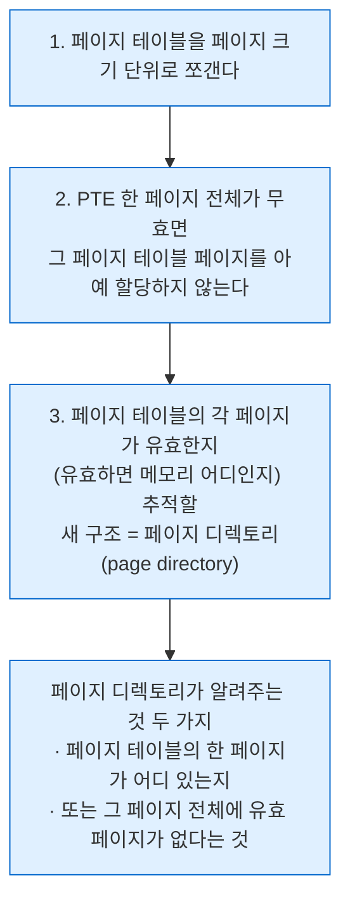

---
tags:
  - topic/os
  - ostep/virtualization
  - paging
  - multi-level-page-table
  - page-directory
  - inverted-page-table
  - status/verified
aliases:
  - 고급 페이지 테이블
  - Paging Smaller Tables
  - 멀티 레벨 페이지 테이블
  - 페이지 디렉토리
  - 역페이지 테이블
created: 2026-08-19
updated: 2026-08-19
---

# 20. 고급 페이지 테이블 (Paging: Smaller Tables)

> 페이징의 "너무 큼" 문제 해결. 큰 페이지 → 페이징·세그멘테이션 혼합 → **멀티 레벨 페이지 테이블** → 역페이지 테이블

- 원서 PDF — [20-Advanced-Page-Tables.pdf](../../pdfs/01-virtualization/20-Advanced-Page-Tables.pdf)
- 원서 절 구조 — 20.1 큰 페이지 · 20.2 혼합 방식 · 20.3 멀티 레벨 · 20.4 역페이지 테이블 · 20.5 페이지 테이블 스왑 · 20.6 요약

## 문제 재확인

```text
32비트 주소 공간(2^32), 4KB(2^12) 페이지, PTE 4바이트

가상 페이지 수 = 2^32 / 2^12 = 2^20 = 약 100만
페이지 테이블 크기 = 2^20 × 4바이트 = 4 MB (프로세스당)

활성 프로세스 100개 → 400 MB (페이지 테이블만)
```

> [!question] CRUX: 페이지 테이블을 어떻게 작게 만드는가
> 단순 배열 기반 페이지 테이블(**선형 페이지 테이블**)은 너무 커서 전형적 시스템에서 지나치게 많은 메모리를 차지. 어떻게 작게 만드는가. 핵심 착상은 무엇인가. 그 결과 어떤 비효율이 생기는가

## 20.1 단순 해법 — 더 큰 페이지

```text
32비트 주소 공간, 16KB(2^14) 페이지
→ VPN 18비트 + offset 14비트
→ 2^18 항목 × 4바이트 = 1 MB (프로세스당)

= 4KB 페이지 대비 정확히 1/4 (페이지 크기 4배 증가에 정확히 대응)
```

- **주요 문제** — 큰 페이지는 각 페이지 **내부의 낭비**를 유발 → **내부 단편화(internal fragmentation)**
- 응용이 페이지를 할당하고도 각 페이지의 작은 조각만 사용 → 지나치게 큰 페이지들로 메모리가 빠르게 채워짐
- 그래서 대부분 시스템은 일반적 경우에 **상대적으로 작은 페이지**를 사용 — **4KB**(x86) 또는 **8KB**(SPARCv9)

> [!note] ASIDE: 다중 페이지 크기
> 많은 아키텍처(MIPS·SPARC·x86-64)가 이제 **다중 페이지 크기**를 지원. 통상 작은(4KB·8KB) 크기를 쓰되, "똑똑한" 응용이 요청하면 주소 공간의 특정 부분에 **큰 페이지 하나**(예: 4MB)를 쓸 수 있음 → 자주 쓰이는 큰 자료 구조를 **TLB 항목 하나만 소모**하면서 배치 가능. DBMS 등 고성능 상용 응용에서 흔함.
> **다중 페이지 크기의 주된 이유는 페이지 테이블 공간 절약이 아니라 TLB 압력 감소** — 프로그램이 TLB 미스를 너무 겪지 않으면서 주소 공간의 더 많은 부분에 접근할 수 있게 함.
> 다만 연구가 보인 대로 다중 페이지 크기는 **OS 가상 메모리 관리자를 뚜렷하게 복잡하게** 만들므로, 큰 페이지는 종종 **응용이 직접 요청하는 새 인터페이스를 노출**하는 방식으로 가장 쉽게 사용됨
>
> 실측 참고 — **macOS arm64 의 기본 페이지 크기는 16KB** (`sysconf(_SC_PAGESIZE)` = 16384). 원서가 언급한 x86 4KB 와 다름 → [[OS/ostep/projects/06-tlb-measure/README|실습 6]]

## 20.2 혼합 방식 — 페이징과 세그멘테이션

> [!tip] TIP: 혼합(hybrid)을 사용할 것
> 두 개의 좋고 겉보기에 상반된 착상이 있으면, 항상 **둘의 장점을 모두 취하는 혼합**으로 결합할 수 있는지 살펴볼 것. 예를 들어 잡종 옥수수 품종은 자연 발생 품종보다 견고한 것으로 알려짐.
> 물론 **모든 혼합이 좋은 착상은 아님** — 얼룩말과 당나귀의 교배인 **Zeedonk(Zonkey)** 를 찾아볼 것

- Multics 창시자들(특히 Jack Dennis)이 착안 — **페이징과 세그멘테이션을 결합**해 페이지 테이블의 메모리 오버헤드를 줄임

### 동기 — 선형 페이지 테이블의 낭비

16KB 주소 공간, 1KB 페이지의 페이지 테이블.

| VPN | PFN | valid | prot | present | dirty |
|---|---|---|---|---|---|
| 0 | 10 | 1 | r-x | 1 | 0 |
| 1 | — | 0 | — | | |
| 2 | — | 0 | — | | |
| 3 | — | 0 | — | | |
| 4 | 23 | 1 | rw- | 1 | 1 |
| 5~13 | — | **0** | — | | |
| 14 | 28 | 1 | rw- | 1 | 1 |
| 15 | 4 | 1 | rw- | 1 | 1 |

- 코드 1페이지(VPN 0) → PF 10, 힙 1페이지(VPN 4) → PF 23, 스택 2페이지(VPN 14·15) → PF 28·4
- **페이지 테이블 대부분이 무효 항목으로 가득 찬 낭비**. 이것도 겨우 16KB 주소 공간

### 혼합 구조

- 프로세스 주소 공간 전체에 페이지 테이블 하나가 아니라, **논리 세그먼트마다 페이지 테이블 하나**
- 이 예에서는 코드·힙·스택 3개 페이지 테이블

| 레지스터 | 세그멘테이션에서의 의미 | **혼합 방식에서의 의미** |
|---|---|---|
| **base** | 세그먼트가 물리 메모리 어디에 있는지 | **그 세그먼트의 페이지 테이블의 물리 주소** |
| **bounds** | 세그먼트 크기 | **페이지 테이블의 끝**(= 유효 페이지가 몇 개인지) |

32비트 가상 주소 공간, 4KB 페이지, 4개 세그먼트 가정 (`00` 미사용, `01` 코드, `10` 힙, `11` 스택).

```text
 31 30 | 29 ......................... 12 | 11 .............. 0
 ──────┼───────────────────────────────┼──────────────────
  Seg  |             VPN               |      Offset
```

TLB 미스 시 하드웨어 동작.

```c
SN           = (VirtualAddress & SEG_MASK) >> SN_SHIFT
VPN          = (VirtualAddress & VPN_MASK) >> VPN_SHIFT
AddressOfPTE = Base[SN] + (VPN * sizeof(PTE))
```

- 선형 페이지 테이블 때와 거의 동일. **차이는 단일 PTBR 대신 3개 세그먼트 베이스 레지스터 중 하나를 사용**
- **결정적 차이는 세그먼트별 bounds 레지스터의 존재** — 각 bounds 가 그 세그먼트의 **최대 유효 페이지 값**을 보관
  - 예 — 코드 세그먼트가 첫 3페이지(0·1·2)를 쓰면 코드 세그먼트 페이지 테이블은 **항목 3개만 할당**되고 bounds 는 3
  - 세그먼트 끝을 넘는 메모리 접근은 예외를 발생시키고 프로세스 종료로 이어질 가능성
- 문맥 교환 시 이 레지스터들을 **새로 실행될 프로세스의 페이지 테이블 위치로 변경**해야 함

### 혼합 방식의 문제

| 문제 | 내용 |
|---|---|
| **여전히 세그멘테이션 필요** | 세그멘테이션은 원하는 만큼 유연하지 않음 — **주소 공간의 특정 사용 패턴을 가정**. 크지만 희소하게 쓰이는 힙이 있으면 여전히 페이지 테이블 낭비가 큼 |
| **외부 단편화 재발** | 메모리 대부분은 페이지 크기 단위로 관리되나, **페이지 테이블 자체는 임의 크기**(PTE 의 배수)가 될 수 있음 → 메모리에서 자리를 찾는 것이 더 복잡 |

## 20.3 멀티 레벨 페이지 테이블

- 세그멘테이션에 의존하지 않고 같은 문제를 공격 — **페이지 테이블의 무효 영역을 메모리에 두지 않고 없애는 방법**
- 선형 페이지 테이블을 **트리 같은 것**으로 바꿈. 매우 효과적이어서 **많은 현대 시스템(x86 등)이 채택**

### 기본 착상



### 선형 vs 멀티 레벨 대조

```text
[선형 페이지 테이블]                    [멀티 레벨 페이지 테이블]
PTBR → PFN 201                        PDBR → 페이지 디렉토리
  ┌────────────────────┐                     ┌──────────────┐
  │ PFN 12  1  rx      │  PFN 201            │ PFN 201  1   │
  │ PFN 13  1  rx      │                     │   —      0   │
  │   —     0          │                     │   —      0   │
  │ PFN 100 1  rw      │                     │ PFN 204  1   │
  ├────────────────────┤                     └──────────────┘
  │ [전부 무효]        │  PFN 202  ← 낭비           │
  ├────────────────────┤                            ├──→ PFN 201 (유효 페이지만)
  │ [전부 무효]        │  PFN 203  ← 낭비           └──→ PFN 204 (유효 페이지만)
  ├────────────────────┤
  │ PFN 86  1  rw      │  PFN 204            (PFN 202·203 은 아예 할당 안 함)
  │ PFN 15  1  rw      │
  └────────────────────┘
```

- 선형은 주소 공간 중간 영역이 대부분 무효인데도 **그 영역용 페이지 테이블 공간을 할당해야 함**
- 멀티 레벨은 페이지 디렉토리가 **두 페이지만 유효로 표시** → 그 두 페이지만 메모리에 상주
- 시각화 — **선형 페이지 테이블의 일부를 사라지게 하고**(그 프레임을 다른 용도로 해방), 어느 페이지가 할당되었는지를 페이지 디렉토리로 추적

### PDE (page directory entry)

- 2단계 테이블에서 페이지 디렉토리는 **페이지 테이블의 페이지당 항목 1개**를 가짐
- PDE 는 최소한 **valid 비트와 PFN** 을 가짐 (PTE 와 유사)
- 그러나 **valid 비트의 의미가 약간 다름**

| PDE valid | 의미 |
|---|---|
| **1** | 이 항목이 (PFN 을 통해) 가리키는 페이지 테이블 페이지 안의 **PTE 중 최소 하나가 유효** |
| **0** | PDE 의 나머지 부분은 **정의되지 않음** |

### 장점과 비용

| 항목 | 내용 |
|---|---|
| **장점 1 — 비례 할당** | **사용하는 주소 공간 양에 비례해서만** 페이지 테이블 공간을 할당 → 일반적으로 간결하며 **희소 주소 공간 지원** |
| **장점 2 — 페이지 단위 관리** | 각 부분이 페이지 안에 깔끔히 들어맞아 메모리 관리가 쉬움. OS가 필요할 때 **다음 빈 페이지를 그냥 집으면 됨**. 선형 페이지 테이블은 **전체가 물리 메모리에 연속**해야 함 — 4MB 같은 큰 덩어리를 찾는 것이 상당한 도전 |
| **비용 1 — 시간** | TLB 미스 시 올바른 변환을 얻기 위해 **메모리 로드 2회** 필요 (페이지 디렉토리 1회 + PTE 1회). 선형은 1회 → **시간-공간 상충의 작은 예** |
| **비용 2 — 복잡성** | 페이지 테이블 조회가 단순 선형 조회보다 확실히 더 복잡 |

> [!tip] TIP: 시간-공간 상충을 이해할 것
> 자료 구조를 만들 때는 항상 **시간-공간 상충**을 고려해야 함. 통상 특정 자료 구조 접근을 더 빠르게 하려면 **공간 사용의 대가**를 치러야 함

> [!tip] TIP: 복잡성을 경계할 것
> 시스템 설계자는 시스템에 복잡성을 추가하는 것을 경계해야 함. 좋은 시스템 구축자가 하는 일은 **당면 과제를 달성하는 가장 덜 복잡한 시스템을 구현**하는 것.
> 예 — 디스크 공간이 풍부하면 최소 바이트를 쓰려고 애쓰는 파일 시스템을 설계하지 말 것. 프로세서가 빠르면 CPU 최적화된 손 어셈블리보다 **깔끔하고 이해 가능한 OS 모듈**을 쓰는 것이 나음.
> Antoine de Saint-Exupery 인용 — "Perfection is finally attained not when there is no longer anything to add, but when there is no longer anything to take away."

### 상세 예제 — 검산

```text
주소 공간 16KB, 페이지 64바이트
→ 14비트 가상 주소 = VPN 8비트 + offset 6비트

선형 페이지 테이블: 2^8 = 256 항목
PTE 4바이트 가정 → 256 × 4 = 1KB
페이지가 64바이트 → 1KB / 64 = 16 페이지, 각 페이지에 16 PTE
페이지 디렉토리는 페이지 테이블 페이지당 1항목 → 16 항목 → 인덱스에 4비트 필요
```

주소 공간 사용 — VPN 0·1(코드), 4·5(힙), 254·255(스택), 나머지 미사용.

VPN 비트 분할.

```text
 13 12 11 10 | 9  8 | 7  6  5  4  3  2  1  0
 ────────────┼──────┼───────────────────────
 PD Index    | PT Index |      offset
 (상위 4비트)| (다음 4비트)
```

```c
PDEAddr = PageDirBase + (PDIndex * sizeof(PDE))
PTEAddr = (PDE.PFN << SHIFT) + (PTIndex * sizeof(PTE))
```

- **PDE 에서 얻은 PFN 을 왼쪽 시프트한 뒤** 페이지 테이블 인덱스와 결합해 PTE 주소를 형성

**페이지 디렉토리 (16 항목)**

| 인덱스 | PFN | valid |
|---|---|---|
| 0 | **100** | 1 |
| 1~14 | — | 0 |
| 15 | **101** | 1 |

**PFN 100 의 페이지 테이블 페이지 (VPN 0~15)**

| 인덱스 | PFN | valid | prot |
|---|---|---|---|
| 0 | 10 | 1 | r-x |
| 1 | 23 | 1 | r-x |
| 2·3 | — | 0 | — |
| 4 | 80 | 1 | rw- |
| 5 | 59 | 1 | rw- |
| 6~15 | — | 0 | — |

**PFN 101 의 페이지 테이블 페이지 (VPN 240~255)**

| 인덱스 | PFN | valid | prot |
|---|---|---|---|
| 0~13 | — | 0 | — |
| 14 | **55** | 1 | rw- |
| 15 | 45 | 1 | rw- |

**공간 절약** — 선형 페이지 테이블용 16페이지 전부를 할당하는 대신 **3페이지만** 할당(페이지 디렉토리 1 + 유효 매핑이 있는 페이지 테이블 조각 2).

### 변환 검산 — VPN 254 의 0번째 바이트

```text
가상 주소 0x3F80 = 11 1111 1000 0000 (이진)

VPN    = 1111 1110 (상위 8비트) = 254
offset = 000000

PD Index = 1111 = 15 → 페이지 디렉토리 마지막 항목 → 유효, PFN 101
PT Index = 1110 = 14 → PFN 101 페이지의 14번째 항목 → 유효, PFN 55

PhysAddr = (55 << 6) + 0 = 3520 = 00 1101 1100 0000 = 0x0DC0   ✓
```

- 검산 — `55 × 64 = 3520`, `0xDC0 = 3520` ✓

### 2단계로 부족한 경우

```text
30비트 가상 주소 공간, 512바이트 페이지
→ VPN 21비트 + offset 9비트

목표: 페이지 테이블의 각 조각이 페이지 하나에 들어가야 함

페이지 512바이트, PTE 4바이트 → 페이지당 128 PTE
→ PT Index 에 log2(128) = 7비트 필요

남는 VPN 비트 = 21 − 7 = 14비트
→ 페이지 디렉토리 항목 2^14 개 × 4바이트(PDE) = 64KB
→ 64KB / 512바이트 = 128 페이지  ← 페이지 하나에 안 들어감!
```

- 해법 — **트리를 한 단계 더** 만듦. 페이지 디렉토리 자체를 여러 페이지로 쪼개고, 그 위에 또 하나의 페이지 디렉토리를 두어 페이지 디렉토리의 페이지들을 가리킴

```text
 29 ......... 15 | 14 ......... 7 | 6 ....... 0
 ───────────────┼───────────────┼─────────────
   PD Index 0   |  PD Index 1   | Page Table Index
```

| 단계 | 사용 비트 | 동작 |
|---|---|---|
| 1 | **PD Index 0** (최상위) | 최상위 페이지 디렉토리에서 PDE 반입 |
| 2 | **PD Index 1** | 유효하면, 최상위 PDE 의 PFN 과 결합해 2단계 페이지 디렉토리 참조 |
| 3 | **Page Table Index** | 유효하면, 2단계 PDE 의 주소와 결합해 PTE 주소 형성 |

### 전체 제어 흐름 (TLB 포함)

```c
VPN = (VirtualAddress & VPN_MASK) >> SHIFT
(Success, TlbEntry) = TLB_Lookup(VPN)
if (Success == True)   // TLB Hit
    if (CanAccess(TlbEntry.ProtectBits) == True)
        Offset   = VirtualAddress & OFFSET_MASK
        PhysAddr = (TlbEntry.PFN << SHIFT) | Offset
        Register = AccessMemory(PhysAddr)
    else
        RaiseException(PROTECTION_FAULT)
else                   // TLB Miss
    // first, get page directory entry
    PDIndex = (VPN & PD_MASK) >> PD_SHIFT
    PDEAddr = PDBR + (PDIndex * sizeof(PDE))
    PDE     = AccessMemory(PDEAddr)
    if (PDE.Valid == False)
        RaiseException(SEGMENTATION_FAULT)
    else
        // PDE is valid: now fetch PTE from page table
        PTIndex = (VPN & PT_MASK) >> PT_SHIFT
        PTEAddr = (PDE.PFN << SHIFT) + (PTIndex * sizeof(PTE))
        PTE     = AccessMemory(PTEAddr)
        if (PTE.Valid == False)
            RaiseException(SEGMENTATION_FAULT)
        else if (CanAccess(PTE.ProtectBits) == False)
            RaiseException(PROTECTION_FAULT)
        else
            TLB_Insert(VPN, PTE.PFN, PTE.ProtectBits)
            RetryInstruction()
```

- **복잡한 멀티 레벨 접근이 일어나기 전에 하드웨어가 먼저 TLB를 확인**. 히트면 페이지 테이블에 전혀 접근하지 않고 물리 주소를 바로 형성
- **TLB 미스에서만** 전체 멀티 레벨 조회 수행 → 이 경로에서 전통적 2단계 페이지 테이블의 비용이 드러남: **유효 변환 조회에 추가 메모리 접근 2회**

## 20.4 역페이지 테이블 (inverted page tables)

- 훨씬 극단적인 공간 절약. **페이지 테이블을 여러 개(프로세스당 1개) 두는 대신, 시스템의 물리 페이지마다 항목이 있는 페이지 테이블 하나**를 유지
- 각 항목이 알려주는 것 — **어느 프로세스가 이 페이지를 쓰고 있는지**, 그 프로세스의 **어느 가상 페이지가 이 물리 페이지에 매핑되는지**
- 올바른 항목 찾기가 **이 자료 구조를 탐색하는 문제**가 됨. 선형 스캔은 비싸므로 흔히 **해시 테이블**을 기반 구조 위에 만들어 조회를 가속. **PowerPC** 가 그런 아키텍처의 예
- 더 일반적으로, 역페이지 테이블은 처음부터 말해 온 것을 예시 — **페이지 테이블은 그냥 자료 구조**. 더 작게·크게, 더 느리게·빠르게 온갖 것을 할 수 있음

## 20.5 페이지 테이블을 디스크로 스왑

- 지금까지 페이지 테이블이 **커널 소유 물리 메모리에 상주**한다고 가정
- 크기를 줄이는 여러 기법을 써도 **한 번에 메모리에 다 들어가지 않을 가능성**은 남음
- 따라서 일부 시스템은 페이지 테이블을 **커널 가상 메모리**에 두어, 메모리 압박이 심해지면 **일부 페이지 테이블을 디스크로 스왑**할 수 있게 함 → ch 23 (VAX/VMS 사례 연구)

## 20.6 정리

| 접근 | 절약 방식 | 대가 |
|---|---|---|
| **큰 페이지** | 페이지 크기 4배 → 테이블 1/4 | **내부 단편화** |
| **페이징 + 세그멘테이션 혼합** | 세그먼트별 페이지 테이블 + bounds | 세그멘테이션의 유연성 부족 + **외부 단편화 재발** |
| **멀티 레벨 페이지 테이블** | 무효 페이지 테이블 페이지를 **아예 할당하지 않음** | TLB 미스 시 **메모리 접근 2회 이상** + 복잡성 |
| **역페이지 테이블** | 시스템 전체에 **테이블 1개** | 탐색 비용 (해시 테이블 필요) |

- 핵심 통찰 — **페이지 테이블은 자료 구조일 뿐**. 시간-공간 상충 안에서 설계 선택이 이루어짐
- 멀티 레벨이 널리 채택된 이유 — **사용하는 주소 공간에 비례한 공간**만 쓰고, 각 조각이 페이지에 들어맞아 관리가 쉬움

## 관련 문서

- [[OS/ostep/docs/01-virtualization/18-introduction-to-paging|18. 페이징 도입]] — "너무 큼" 문제의 출처와 크기 계산
- [[OS/ostep/docs/01-virtualization/19-tlb|19. TLB]] — 멀티 레벨의 추가 메모리 접근을 TLB 히트가 감춰 주는 구조
- [[OS/ostep/docs/01-virtualization/16-segmentation|16. 세그멘테이션]] — 혼합 방식이 결합하는 다른 축
- [[OS/ostep/docs/01-virtualization/23-complete-vm-systems|23. 완전한 가상 메모리 시스템]] — 페이지 테이블을 커널 가상 메모리에 두는 실제 사례
- [[OS/ostep/projects/06-tlb-measure/README|실습 6. TLB 크기·비용 측정]] — macOS 16KB 페이지 실측
- [[OS/ostep/docs/README|이론 문서 인덱스]] — 전 챕터 목록
