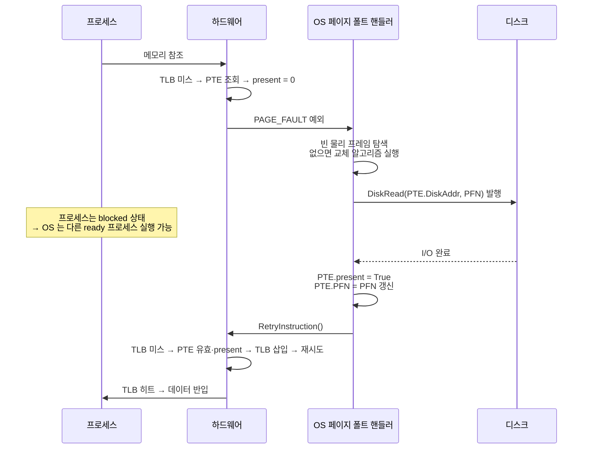
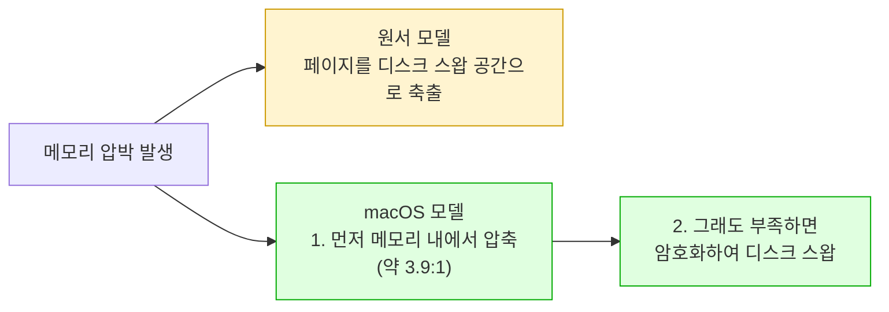

---
tags:
  - topic/os
  - ostep/virtualization
  - swapping
  - page-fault
  - present-bit
  - demand-paging
  - status/verified
aliases:
  - 스와핑 기법
  - Beyond Physical Memory Mechanisms
  - 페이지 폴트
  - present 비트
  - 스왑 공간
created: 2026-08-19
updated: 2026-08-19
---

# 21. 스와핑 기법 (Beyond Physical Memory: Mechanisms)

> 물리 메모리보다 큰 주소 공간의 환상. 스왑 공간 · present 비트 · 페이지 폴트 핸들러 · 워터마크 기반 백그라운드 축출

- 원서 PDF — [21-Swapping-Mechanisms.pdf](../../pdfs/01-virtualization/21-Swapping-Mechanisms.pdf)
- 원서 절 구조 — 21.1 스왑 공간 · 21.2 present 비트 · 21.3 페이지 폴트 · 21.4 메모리가 꽉 찬 경우 · 21.5 제어 흐름 · 21.6 교체 시점 · 21.7 요약

- 지금까지 **모든 실행 프로세스의 주소 공간이 메모리에 들어간다**고 가정. 이제 완화
- 필요한 것 — **메모리 계층의 추가 단계**. 현재 크게 요구되지 않는 주소 공간 부분을 치워 둘 장소
  - 특성 — 메모리보다 **용량이 크고**, 그 결과 일반적으로 **더 느림** (더 빠르다면 그냥 메모리로 쓸 것)
  - 현대 시스템에서 이 역할은 통상 **하드 디스크**

> [!question] CRUX: 물리 메모리를 어떻게 넘어서는가
> OS는 더 크고 느린 장치를 활용해 **큰 가상 주소 공간의 환상을 투명하게** 제공할 수 있는가

### 왜 큰 주소 공간을 지원하려 하는가

- 답 — **편의성과 사용 용이성**
- 큰 주소 공간이 있으면 프로그램 자료 구조를 담을 메모리가 충분한지 걱정하지 않고, **자연스럽게 프로그램을 작성**하며 필요한 만큼 할당하면 됨
- 대조 — 구형 시스템의 **메모리 오버레이(memory overlays)**. 프로그래머가 코드·데이터 조각을 필요할 때 **손으로 메모리에 넣고 빼야** 했음. 함수를 호출하거나 데이터에 접근하기 전에 그것이 메모리에 있도록 먼저 준비해야 함
- 다중 프로그래밍의 발명이 사실상 **일부 페이지를 스왑 아웃하는 능력을 요구** — 초기 머신은 모든 프로세스의 모든 페이지를 동시에 담을 수 없었음

## 21.1 스왑 공간

- **스왑 공간(swap space)** — 페이지를 주고받기 위해 디스크에 예약한 공간. 메모리에서 그곳으로 **스왑 아웃**하고 그곳에서 메모리로 **스왑 인**하므로
- OS는 스왑 공간을 **페이지 크기 단위**로 읽고 쓸 수 있어야 하며, 주어진 페이지의 **디스크 주소를 기억**해야 함
- 스왑 공간 크기가 중요 — 궁극적으로 **한 시점에 시스템이 사용할 수 있는 최대 메모리 페이지 수**를 결정

4페이지 물리 메모리 + 8페이지 스왑 공간 예.

```text
              PFN 0     PFN 1     PFN 2     PFN 3
물리 메모리  [Proc 0]  [Proc 1]  [Proc 1]  [Proc 2]
             [VPN 0]   [VPN 2]   [VPN 3]   [VPN 0]

          Blk 0    Blk 1    Blk 2    Blk 3    Blk 4    Blk 5    Blk 6    Blk 7
스왑 공간 [Proc 0] [Proc 0] [Free]  [Proc 1] [Proc 1] [Proc 3] [Proc 2] [Proc 3]
          [VPN 1]  [VPN 2]          [VPN 0]  [VPN 1]  [VPN 0]  [VPN 1]  [VPN 1]
```

- 프로세스 3개(Proc 0·1·2)가 물리 메모리를 활발히 공유하되 **각자 유효 페이지의 일부만** 메모리에 있고 나머지는 디스크 스왑 공간에
- **Proc 3 은 모든 페이지가 스왑 아웃** → 현재 실행 중이 아님이 분명
- 스왑 블록 1개가 비어 있음

### 스왑 공간만이 유일한 디스크 위치는 아님

- 프로그램 바이너리(`ls` 등)를 실행하는 경우 — **코드 페이지는 애초에 디스크에 있음**. 실행되면 메모리로 적재
- 시스템이 다른 용도로 물리 메모리를 비워야 하면 **이 코드 페이지의 메모리 공간을 안전하게 재사용** 가능 — 나중에 **파일 시스템의 디스크 상 바이너리에서 다시 스왑 인**할 수 있음을 알고 있으므로

## 21.2 present 비트

- 하드웨어가 PTE 를 볼 때 **페이지가 물리 메모리에 없음**을 발견할 수 있음
- 이를 판정하는 새 정보가 PTE 의 **present 비트**

| present | 의미 |
|---|---|
| **1** | 페이지가 물리 메모리에 있음 → 정상 진행 |
| **0** | 페이지가 메모리에 없고 **디스크 어딘가에** 있음 |

- 물리 메모리에 없는 페이지에 접근하는 행위를 통칭 **페이지 폴트(page fault)**
- 페이지 폴트 시 OS가 호출되어 서비스. **페이지 폴트 핸들러(page-fault handler)** 라는 코드가 실행

> [!note] ASIDE: 스와핑 용어
> 가상 메모리 시스템의 용어는 머신·OS마다 다소 혼란스럽고 가변적.
> **페이지 폴트**는 더 일반적으로 페이지 테이블 참조가 어떤 종류의 폴트를 발생시키는 모든 경우를 가리킬 수 있음 — 여기서 논의하는 **page-not-present 폴트**뿐 아니라 때로 **불법 메모리 접근**도 포함.
> 실제로 확실히 **합법적인 접근**(프로세스 가상 주소 공간에 매핑되었으나 그 시점에 물리 메모리에 없을 뿐)을 "폴트"라 부르는 것은 이상 — 정말로는 **page miss** 라 불려야 함.
> 그래도 "폴트"로 불리게 된 이유는 OS의 처리 기제와 관련된 것으로 추정 — 뭔가 특이한 일이 생기면(하드웨어가 다룰 방법을 모르는 일) 하드웨어는 **그냥 OS로 제어를 이전**하고 상황이 나아지기를 바람. 프로세스가 불법적인 일을 했을 때와 동일하므로 "폴트"라 부르게 된 것이 놀랍지 않음

## 21.3 페이지 폴트

- 하드웨어 관리 TLB 든 소프트웨어 관리 TLB 든, **페이지가 present 하지 않으면 OS가 처리 책임**을 맡음
- **사실상 모든 시스템이 페이지 폴트를 소프트웨어로 처리** — 하드웨어 관리 TLB 를 쓰는 시스템조차 이 중요한 임무는 OS를 신뢰

> [!note] ASIDE: 하드웨어가 페이지 폴트를 처리하지 않는 이유
> TLB 경험에서 하드웨어 설계자가 OS를 잘 신뢰하지 않는다는 것을 알았는데, 왜 페이지 폴트는 OS에 맡기는가.
> 1. **디스크로의 페이지 폴트는 느림** — OS가 폴트 처리에 오래 걸리고 수많은 명령어를 실행해도, **디스크 연산 자체가 전통적으로 훨씬 느려서** 소프트웨어 실행의 추가 오버헤드는 미미
> 2. 페이지 폴트를 처리하려면 하드웨어가 **스왑 공간, 디스크에 I/O 를 발행하는 방법** 등 현재 잘 모르는 많은 세부를 이해해야 함
> 성능과 단순성 양쪽 이유로 OS가 페이지 폴트를 처리하며, 하드웨어 진영도 만족

### 디스크 주소를 어디에 저장하는가

- 많은 시스템에서 **페이지 테이블이 자연스러운 저장 장소**
- OS는 통상 PFN 등에 쓰이는 PTE 비트를 **디스크 주소용으로** 사용할 수 있음
- 페이지 폴트를 받으면 PTE 에서 주소를 찾아 **디스크에 요청을 발행**해 페이지를 메모리로 가져옴

### 처리 순서



- **I/O 가 진행되는 동안 프로세스는 blocked 상태** → OS는 다른 ready 프로세스를 실행할 자유를 얻음
- I/O 가 비싸므로, **한 프로세스의 I/O(페이지 폴트)와 다른 프로세스의 실행을 중첩**시키는 것이 다중 프로그래밍 시스템이 하드웨어를 가장 효과적으로 쓰는 또 하나의 방법

## 21.4 메모리가 꽉 찬 경우

- 위 과정은 **스왑 인할 여유 메모리가 충분하다고 가정**. 그렇지 않을 수 있음
- OS는 먼저 **하나 이상의 페이지를 페이지 아웃**해 자리를 만들어야 함
- 축출할 페이지를 고르는 과정이 **페이지 교체 정책(page-replacement policy)**
- **잘못된 페이지를 축출하면 프로그램 성능에 큰 대가** — 잘못된 결정은 프로그램을 메모리 속도가 아니라 **디스크 속도**로 실행시킴. 현재 기술에서 **1만~10만 배 느려질 수 있음** → ch 22 주제

## 21.5 페이지 폴트 제어 흐름

### 하드웨어 측

```c
VPN = (VirtualAddress & VPN_MASK) >> SHIFT
(Success, TlbEntry) = TLB_Lookup(VPN)
if (Success == True)   // TLB Hit
    if (CanAccess(TlbEntry.ProtectBits) == True)
        Offset   = VirtualAddress & OFFSET_MASK
        PhysAddr = (TlbEntry.PFN << SHIFT) | Offset
        Register = AccessMemory(PhysAddr)
    else
        RaiseException(PROTECTION_FAULT)
else                   // TLB Miss
    PTEAddr = PTBR + (VPN * sizeof(PTE))
    PTE = AccessMemory(PTEAddr)
    if (PTE.Valid == False)
        RaiseException(SEGMENTATION_FAULT)
    else
        if (CanAccess(PTE.ProtectBits) == False)
            RaiseException(PROTECTION_FAULT)
        else if (PTE.Present == True)
            // assuming hardware-managed TLB
            TLB_Insert(VPN, PTE.PFN, PTE.ProtectBits)
            RetryInstruction()
        else if (PTE.Present == False)
            RaiseException(PAGE_FAULT)
```

**TLB 미스 시 이해해야 할 3가지 경우**

| 경우 | 조건 | 처리 |
|---|---|---|
| 1 | valid = 1, **present = 1** | TLB 미스 핸들러가 PTE 에서 PFN 을 집어 TLB 에 넣고 명령어 재시도 → TLB 히트 |
| 2 | valid = 1, **present = 0** | **페이지 폴트 핸들러 실행**. 프로세스가 접근할 정당한 페이지이나 물리 메모리에 없음 |
| 3 | **valid = 0** | 프로그램 버그 등에 의한 **불법 페이지 접근**. PTE 의 다른 비트는 무의미. 하드웨어가 트랩 → OS 트랩 핸들러 실행 → 위반 프로세스 종료 가능성 |

### 소프트웨어(OS) 측

```c
PFN = FindFreePhysicalPage()
if (PFN == -1)                  // no free page found
    PFN = EvictPage()           // replacement algorithm
DiskRead(PTE.DiskAddr, PFN)     // sleep (wait for I/O)
PTE.present = True              // update page table:
PTE.PFN     = PFN               // (present/translation)
RetryInstruction()              // retry instruction
```

1. 폴트 페이지가 들어갈 **물리 프레임 확보**. 없으면 교체 알고리즘이 페이지를 축출하기를 기다림
2. 물리 프레임을 확보하면 **스왑 공간에서 페이지를 읽는 I/O 요청** 발행
3. 느린 연산이 완료되면 **페이지 테이블 갱신 후 명령어 재시도**
4. 재시도는 TLB 미스를 낳고, 다시 재시도하면 TLB 히트 → 하드웨어가 원하는 항목에 접근

## 21.6 교체가 실제로 일어나는 시점

- 지금까지 **메모리가 완전히 꽉 찰 때까지 기다렸다가** 축출하는 방식으로 서술 — 다소 비현실적
- 대부분 OS는 **워터마크(watermark)** 두 개를 둠

| 워터마크 | 역할 |
|---|---|
| **LW (low watermark)** | 사용 가능 페이지가 이보다 적어지면 **메모리 해제 담당 백그라운드 스레드**가 실행 시작 |
| **HW (high watermark)** | 백그라운드 스레드가 이만큼 확보되면 축출을 멈추고 잠듦 |

- 이 백그라운드 스레드를 **스왑 데몬(swap daemon)** 또는 **페이지 데몬(page daemon)** 이라 부름
- **한 번에 여러 교체를 수행하면 새로운 성능 최적화 가능** — 많은 시스템이 여러 페이지를 **묶음(cluster·group)** 으로 스왑 파티션에 한 번에 기록 → 디스크의 탐색·회전 오버헤드를 줄여 성능이 뚜렷하게 향상
- 제어 흐름 수정 — 교체를 직접 수행하는 대신 **빈 페이지가 있는지 확인**만 하고, 없으면 백그라운드 스레드에 알림. 스레드가 페이지를 해제하면 원래 스레드를 다시 깨움

> [!note] ASIDE: 데몬(daemon)의 어원
> 보통 "demon" 으로 발음되며, 유용한 일을 하는 백그라운드 스레드·프로세스를 가리키는 오래된 용어. 출처는 (이번에도) **Multics**.
> Corbato 의 설명 — 물리학·열역학의 **Maxwell's daemon** 에서 착상. Maxwell 의 데몬은 서로 다른 속도의 분자를 분류하도록 돕는 가상의 행위자로 **배경에서 지치지 않고 일함**. 그래서 시스템 잡무를 지치지 않고 수행하는 백그라운드 프로세스를 데몬이라 부르기 시작

> [!tip] TIP: 백그라운드에서 일할 것
> 할 일이 있으면 **효율을 높이고 연산을 묶기 위해** 백그라운드에서 하는 것이 좋은 착상인 경우가 많음. OS는 자주 백그라운드에서 일함 — 예: 많은 시스템이 파일 쓰기를 실제 디스크 기록 전에 메모리에 버퍼링.
> 이점 — **디스크 효율 향상**(디스크가 여러 쓰기를 한 번에 받아 더 잘 스케줄), **쓰기 지연 시간 개선**(응용은 쓰기가 매우 빨리 끝났다고 여김), **작업량 감소 가능성**(파일이 삭제되면 쓰기가 디스크에 갈 필요조차 없음), **유휴 시간 활용**(시스템이 다른 때 유휴 상태일 때 백그라운드 작업 수행)

## 21.7 정리

- 시스템에 물리적으로 존재하는 것보다 **많은 메모리에 접근**하는 개념 도입
- 요구 사항 — 페이지 테이블 구조에 **present 비트** 포함(페이지가 메모리에 있는지 여부를 알려줌)
- present 하지 않으면 **OS 페이지 폴트 핸들러**가 실행되어 디스크→메모리 전송을 준비. 필요하면 먼저 메모리의 일부 페이지를 교체해 자리를 만듦
- **이 모든 동작이 프로세스에게 투명하게** 일어남. 프로세스 입장에서는 자기 사설·연속 가상 메모리에 접근하는 것뿐
- 뒤에서는 페이지들이 물리 메모리의 **임의(비연속) 위치**에 놓이고, 때로는 메모리에 아예 없어 디스크에서 반입해야 함
- 일반적 경우 메모리 접근이 빠르기를 바라나, **어떤 경우 여러 디스크 연산이 필요** — 단일 명령어 수행 같은 단순한 일이 최악의 경우 **수 밀리초** 걸릴 수 있음

### macOS 실측 — 현대 시스템의 추가 계층

```bash
vm_stat
```

- 옵션 없음. Mach 가상 메모리 통계 출력

```text
Mach Virtual Memory Statistics: (page size of 16384 bytes)
Pages free:                                    15696.
Pages active:                                 847776.
Pages inactive:                               844471.
Pages speculative:                              4404.
Pages wired down:                             187707.
"Translation faults":                      419296513.
Pages copy-on-write:                        11126991.
Pages zero filled:                         304713202.
File-backed pages:                            517358.
Anonymous pages:                             1179293.
Pages stored in compressor:                   545192.
Pages occupied by compressor:                 141163.
Decompressions:                              1224141.
```

```bash
sysctl -n vm.swapusage
sysctl -n hw.memsize
```

- `sysctl -n vm.swapusage` — 스왑 사용량. `-n` 은 값만 출력
- `sysctl -n hw.memsize` — 물리 메모리 바이트 수

```text
total = 3072.00M  used = 1649.00M  free = 1423.00M  (encrypted)
34359738368     (= 32.0 GB)
```

| 항목 | 실측값 | 원서 모델과의 관계 |
|---|---|---|
| 페이지 크기 | **16384 바이트** | 원서 예제(1KB·4KB)와 다름 |
| `Pages active` / `inactive` | 847,776 / 844,471 | **active·inactive 리스트 분리** — 교체 정책이 2단 큐 구조 (ch 22 클럭 계열 확장) |
| `Pages wired down` | 187,707 | **축출 불가 페이지** — 커널 핵심 자료 구조. ch 19 의 wired TLB 항목과 같은 개념 |
| `"Translation faults"` | **419,296,513** | 부팅 이후 누적 주소 변환 폴트. 원서가 말한 "page fault" 의 광의 용법 |
| `File-backed` / `Anonymous` | 517,358 / 1,179,293 | 원서 21.1 의 **"스왑 공간만이 유일한 디스크 위치는 아니다"** 를 반영 — 파일 기반 페이지는 원본 파일에서 재적재, 익명 페이지는 스왑 필요 |
| **`Pages stored in compressor`** | **545,192** | 원서에 없는 층 |
| **`Pages occupied by compressor`** | **141,163** | |
| 스왑 사용량 | total 3072M, used 1649M (encrypted) | |

**핵심 차이 — 메모리 압축**

```text
압축된 페이지 수 / 압축이 점유한 페이지 수 = 545192 / 141163 ≈ 3.86 : 1
```



- macOS는 **디스크로 스왑하기 전에 메모리 안에서 페이지를 압축** — 약 **3.9:1** 압축률로 545,192 페이지를 141,163 페이지 공간에 보관 (약 6.3GB 분량을 1.6GB 로)
- 디스크 접근보다 **압축·해제(CPU 작업)가 훨씬 빠르므로**, 원서가 말한 "1만~10만 배 느려짐"을 상당 부분 회피하는 현대적 층
- `Decompressions: 1,224,141` — 압축된 페이지를 되돌린 횟수. 원서의 "스왑 인"에 대응하는 값
- 스왑이 `(encrypted)` 로 표시 — 디스크에 나가는 스왑 데이터를 **암호화**. 원서 모델에 없는 보안 층

## 관련 문서

- [[OS/ostep/docs/01-virtualization/18-introduction-to-paging|18. 페이징 도입]] — present 비트가 들어가는 PTE 구조
- [[OS/ostep/docs/01-virtualization/22-swapping-policies|22. 스와핑 정책]] — 어느 페이지를 축출할지 결정하는 정책
- [[OS/ostep/docs/01-virtualization/19-tlb|19. TLB]] — 폴트 처리 전 TLB 조회 경로, wired 항목
- [[OS/ostep/docs/01-virtualization/23-complete-vm-systems|23. 완전한 가상 메모리 시스템]] — 실제 시스템의 스와핑 구현
- [[OS/ostep/docs/README|이론 문서 인덱스]] — 전 챕터 목록
