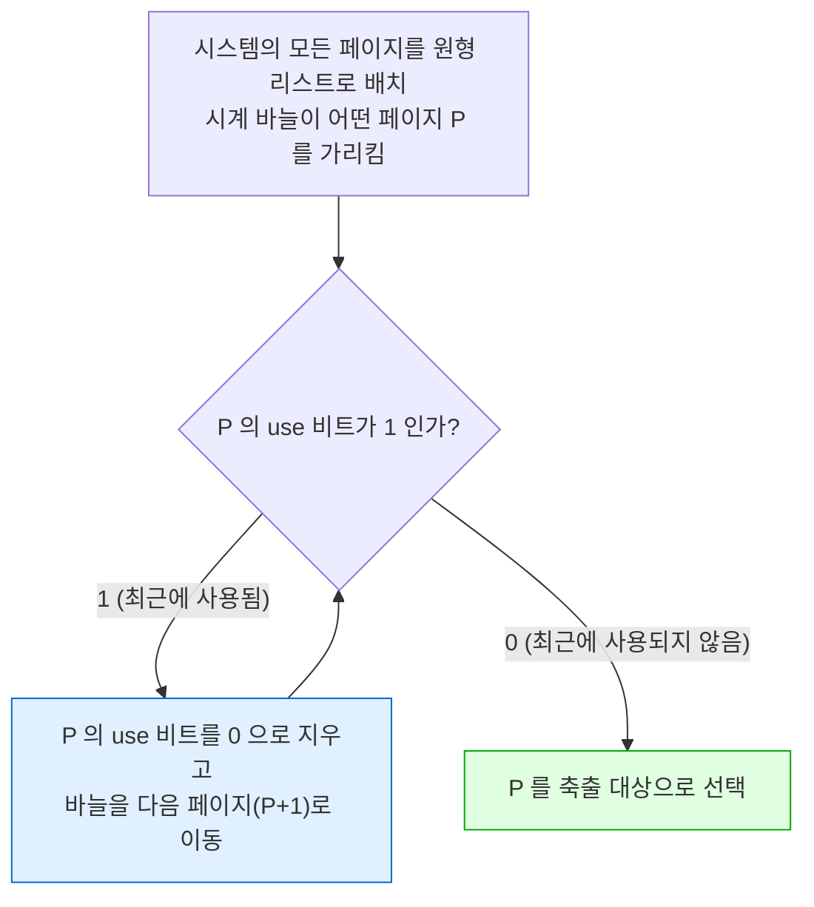

---
tags:
  - topic/os
  - ostep/virtualization
  - page-replacement
  - lru
  - clock
  - thrashing
  - amat
  - status/verified
aliases:
  - 스와핑 정책
  - Beyond Physical Memory Policies
  - 페이지 교체 정책
  - LRU
  - 클럭 알고리즘
  - 스래싱
created: 2026-08-19
updated: 2026-08-19
---

# 22. 스와핑 정책 (Beyond Physical Memory: Policies)

> 어느 페이지를 축출할지 결정하는 정책. AMAT · 최적(OPT) · FIFO · Random · LRU · 클럭 근사 · 스래싱

- 원서 PDF — [22-Swapping-Policies.pdf](../../pdfs/01-virtualization/22-Swapping-Policies.pdf)
- 실습 — [[OS/ostep/projects/07-page-replacement/README|실습 7. 페이지 교체 정책 시뮬레이터]]
- 원서 절 구조 — 22.1 캐시 관리 · 22.2 최적 정책 · 22.3 FIFO · 22.4 Random · 22.5 LRU · 22.6 워크로드 예 · 22.7 구현 · 22.8 LRU 근사 · 22.9 더티 페이지 · 22.10 기타 정책 · 22.11 스래싱

- 여유 메모리가 많을 때는 쉬움. **메모리가 적으면 흥미로워짐** — 메모리 압박이 OS로 하여금 활발히 쓰이는 페이지를 위한 자리를 만들도록 강제

> [!question] CRUX: 어느 페이지를 축출할지 어떻게 결정하는가
> OS는 메모리에서 어느 페이지(들)를 축출할지 어떻게 결정하는가. 이 결정은 시스템의 **교체 정책**이 내리며, 통상 일반 원칙을 따르되 **코너 케이스 동작을 피하기 위한 조정**도 포함

## 22.1 캐시 관리와 AMAT

- 주 메모리는 시스템 내 모든 페이지의 부분집합을 담으므로 **가상 메모리 페이지의 캐시**로 볼 수 있음
- 목표 — **캐시 미스 최소화**(디스크에서 페이지를 가져와야 하는 횟수 최소화) = **캐시 히트 최대화**

**AMAT (average memory access time)**

```text
AMAT = T_M + (P_Miss × T_D)

T_M     : 메모리 접근 비용
T_D     : 디스크 접근 비용
P_Miss  : 캐시에서 데이터를 찾지 못할 확률 (0.0 ~ 1.0)
```

- **메모리 접근 비용은 항상 지불**. 미스하면 **추가로** 디스크 반입 비용을 지불

### 계산 예 — 검산

```text
주소 공간 4KB, 페이지 256바이트
→ 가상 주소 = VPN 4비트(상위) + offset 8비트(하위)
→ 접근 가능 가상 페이지 2^4 = 16개

참조: 0x000, 0x100, 0x200, 0x300, 0x400, 0x500, 0x600, 0x700, 0x800, 0x900
      (각 페이지의 첫 바이트. 페이지 번호는 첫 16진 숫자)

가상 페이지 3 만 메모리에 없다고 가정
→ hit, hit, hit, miss, hit, hit, hit, hit, hit, hit

히트율 = 9/10 = 90%,  미스율 = 10% (P_Miss = 0.1)
(항상 P_Hit + P_Miss = 1.0)
```

```text
T_M = 100 ns, T_D = 10 ms 가정

AMAT = 100ns + 0.1 × 10ms
     = 100ns + 1ms
     = 1.0001 ms  ≈ 1 밀리초

히트율이 99.9% (P_Miss = 0.001) 라면
AMAT = 100ns + 0.001 × 10ms = 100ns + 10μs = 10.1 μs   → 약 100배 빠름

히트율이 100% 에 접근하면 AMAT 는 100 ns 에 접근
```

- **현대 시스템에서 디스크 접근 비용이 너무 높아, 아주 작은 미스율도 전체 AMAT 를 빠르게 지배**
- 결론 — 가능한 만큼 미스를 피해야 하며, 그러지 않으면 **디스크 속도로 실행**

## 22.2 최적 정책 (OPT)

- Belady 가 오래 전 개발 (원래 이름 **MIN**)
- **가장 먼 미래에 접근될 페이지를 교체** → 전체 미스가 가장 적음 (증명됨)
- 직관 — 어떤 페이지를 버려야 한다면 **지금부터 가장 먼 시점에 필요한 것**을 버리는 것이 낫음. 캐시의 다른 모든 페이지가 그것보다 중요하다고 말하는 셈이며, 실제로 **그 페이지를 참조하기 전에 다른 페이지들을 참조**하게 되므로 참

> [!tip] TIP: 최적과 비교하는 것은 유용하다
> 최적은 실제 정책으로는 별로 실용적이지 않으나, **시뮬레이션 등 연구에서 비교 기준으로 대단히 유용**.
> "내 새 알고리즘의 히트율이 80%" 라는 말은 고립되어서는 의미가 없음. "최적이 82% 를 달성한다(따라서 내 접근은 최적에 상당히 가깝다)" 고 말하면 결과에 **맥락**이 생김.
> 최적을 알면 **얼마나 개선 여지가 남았는지**, 그리고 **언제 정책 개선을 멈춰도 되는지**(이상에 충분히 가까우므로) 알 수 있음

### 트레이스 — 캐시 3페이지, 참조 0,1,2,0,1,3,0,3,1,2,1

| 접근 | Hit/Miss | 축출 | 결과 캐시 상태 |
|---|---|---|---|
| 0 | Miss | | 0 |
| 1 | Miss | | 0, 1 |
| 2 | Miss | | 0, 1, 2 |
| 0 | Hit | | 0, 1, 2 |
| 1 | Hit | | 0, 1, 2 |
| 3 | Miss | **2** | 0, 1, 3 |
| 0 | Hit | | 0, 1, 3 |
| 3 | Hit | | 0, 1, 3 |
| 1 | Hit | | 0, 1, 3 |
| 2 | Miss | **3** | 0, 1, 2 |
| 1 | Hit | | 0, 1, 2 |

```text
히트 6, 미스 5 → 히트율 = 6/11 = 54.5%
강제 미스 제외 시 = 6/7 = 85.7%   (고유 페이지 4개의 첫 접근을 분모에서 제외)
```

- 첫 3개 접근은 캐시가 비어 있어 미스 — **콜드 스타트 미스(cold-start miss)** 또는 **강제 미스(compulsory miss)**
- 페이지 3 접근 시 캐시가 꽉 참 → 미래를 조사: 0 은 거의 즉시, 1 은 조금 뒤, **2 는 가장 먼 미래** → **2 축출**
- 다음 2 접근 시에는 **1 을 축출하지 않으면 됨** (곧 접근되므로). 예에서는 3 을 축출하나 0 도 괜찮은 선택

> [!note] ASIDE: 캐시 미스의 종류 (Three C's)
> | 종류 | 원인 |
> |---|---|
> | **compulsory (cold-start)** | 캐시가 처음에 비어 있고 이 항목에 대한 **첫 참조**이므로 |
> | **capacity** | 캐시 공간이 부족해 새 항목을 들이려고 **항목을 축출**해야 했으므로 |
> | **conflict** | 하드웨어 캐시에서 **set-associativity** 제약 때문에 항목을 놓을 위치가 한정되므로. **OS 페이지 캐시에는 발생하지 않음** — 항상 완전 연관이어서 페이지를 메모리 어디에 놓아도 제약이 없음 |

- 일반 목적 OS 에서는 미래를 알 수 없으므로 **최적 정책을 구축할 수 없음** → 비교 기준으로만 사용

## 22.3 FIFO

- 페이지가 시스템에 들어올 때 **큐에 넣고**, 교체 시 큐 꼬리("first-in" 페이지)를 축출
- **큰 강점 — 구현이 매우 단순**

| 접근 | Hit/Miss | 축출 | 결과 캐시 상태 (First-in →) |
|---|---|---|---|
| 0 | Miss | | 0 |
| 1 | Miss | | 0, 1 |
| 2 | Miss | | 0, 1, 2 |
| 0 | Hit | | 0, 1, 2 |
| 1 | Hit | | 0, 1, 2 |
| 3 | Miss | **0** | 1, 2, 3 |
| 0 | Miss | **1** | 2, 3, 0 |
| 3 | Hit | | 2, 3, 0 |
| 1 | Miss | **2** | 3, 0, 1 |
| 2 | Miss | **3** | 0, 1, 2 |
| 1 | Hit | | 0, 1, 2 |

```text
히트 4, 미스 7 → 히트율 = 4/11 = 36.4%
강제 미스 제외 시 = 4/7 = 57.1%
```

- 최적(54.5%)보다 **뚜렷하게 나쁨**
- 원인 — **FIFO 는 블록의 중요도를 판단할 수 없음**. 페이지 0 이 여러 번 접근되었어도, **먼저 메모리에 들어왔다는 이유만으로** 쫓아냄

> [!note] ASIDE: Belady 의 역설
> Belady 와 동료들이 예상 밖으로 동작하는 흥미로운 참조 흐름을 발견.
> 트레이스 — `1, 2, 3, 4, 1, 2, 5, 1, 2, 3, 4, 5`. 정책은 FIFO. **캐시를 3에서 4페이지로 늘렸을 때 히트율이 오히려 나빠짐**.
> 이 이상 동작을 **Belady 의 역설(Belady's Anomaly)** 이라 부름.
> **LRU 같은 일부 정책은 이 문제를 겪지 않음** — **스택 속성(stack property)** 때문. 이 속성을 가진 알고리즘에서는 크기 `N+1` 캐시가 **자연히 크기 `N` 캐시의 내용을 포함**하므로, 캐시를 늘리면 히트율이 같거나 개선됨.
> FIFO 와 Random 은 스택 속성을 지키지 않아 이상 동작에 취약

**실습 7 실측 — 역설 재현**

| 정책 | 캐시 3 | 캐시 4 | 변화 |
|---|---|---|---|
| **FIFO** | 25.0% (히트 3) | **16.7%** (히트 2) | **하락** ← 역설 |
| **LRU** | 16.7% (히트 2) | **33.3%** (히트 4) | 상승 (정상) |

## 22.4 Random

- 메모리 압박 시 **무작위 페이지**를 교체. FIFO 와 유사한 성질 — 단순하나 영리하려 하지 않음
- 성능은 **운에 달림**. 원서는 같은 트레이스를 10,000회 다른 시드로 실험
  - 40% 조금 넘는 경우 **최적과 같은 6히트** 달성
  - 어떤 때는 **2히트 이하**로 훨씬 나쁨

## 22.5 역사 사용 — LRU

- FIFO·Random 처럼 단순한 정책의 공통 문제 — **곧 다시 참조될 중요한 페이지를 쫓아낼 수 있음**
- 스케줄링 정책에서처럼 **과거에 기대어 미래를 추측**

| 사용 가능한 역사 정보 | 정책 |
|---|---|
| **빈도(frequency)** — 여러 번 접근된 페이지는 가치가 있을 것 | **LFU** (Least-Frequently-Used) |
| **최근성(recency)** — 더 최근에 접근된 페이지가 다시 접근될 가능성이 높을 것 | **LRU** (Least-Recently-Used) |

- 근거 — **지역성의 원리(principle of locality)**. 프로그램은 특정 코드 시퀀스(루프)와 자료 구조(루프가 접근하는 배열)를 꽤 자주 접근
- 반대 정책도 존재 — **MFU**(Most-Frequently-Used), **MRU**(Most-Recently-Used). **대부분(전부는 아님) 잘 동작하지 않음** — 대부분 프로그램이 보이는 지역성을 **받아들이는 대신 무시**하므로

### LRU 트레이스

| 접근 | Hit/Miss | 축출 | 결과 캐시 상태 (LRU →) |
|---|---|---|---|
| 0 | Miss | | 0 |
| 1 | Miss | | 0, 1 |
| 2 | Miss | | 0, 1, 2 |
| 0 | Hit | | 1, 2, 0 |
| 1 | Hit | | 2, 0, 1 |
| 3 | Miss | **2** | 0, 1, 3 |
| 0 | Hit | | 1, 3, 0 |
| 3 | Hit | | 1, 0, 3 |
| 1 | Hit | | 0, 3, 1 |
| 2 | Miss | **0** | 3, 1, 2 |
| 1 | Hit | | 3, 2, 1 |

```text
히트 6, 미스 5 → 54.5% (강제 미스 제외 85.7%) — 최적과 동일
```

- 첫 교체에서 **2 를 축출** (0 과 1 이 더 최근에 접근됨), 다음 교체에서 **0 을 축출** (1 과 3 이 더 최근)
- 두 경우 모두 역사 기반 결정이 옳았고 다음 참조가 히트

> [!note] ASIDE: 지역성의 두 종류
> | 종류 | 내용 |
> |---|---|
> | **공간 지역성** | 페이지 `P` 가 접근되면 **그 주변 페이지**(`P−1`·`P+1`)도 접근될 가능성이 높음 |
> | **시간 지역성** | **가까운 과거에 접근된 페이지**가 가까운 미래에 다시 접근될 가능성이 높음 |
> 이 지역성의 존재 가정이 하드웨어 캐싱 계층에서 큰 역할 — 명령어·데이터·주소 변환 캐싱을 여러 단계 배치.
> 물론 지역성의 원리는 **모든 프로그램이 따라야 하는 엄격한 규칙이 아님**. 일부 프로그램은 메모리(또는 디스크)를 상당히 무작위로 접근해 지역성을 거의 보이지 않음. 지역성은 **성공을 보장하지 않는 휴리스틱**

## 22.6 워크로드 예 (실습 7 실측으로 재현)

3가지 워크로드, 각 **참조 1만 회**. 캐시 크기를 1~100 으로 변화. 상세 표는 [[OS/ostep/projects/07-page-replacement/README|실습 7]].

### 지역성 없음 워크로드 (원서 Figure 22.6)

| 캐시 | OPT | FIFO | LRU | CLOCK | RAND |
|---|---|---|---|---|---|
| 20 | **51.3%** | 19.5% | 19.7% | 19.6% | 19.4% |
| 50 | **78.5%** | 49.6% | 49.5% | 49.0% | 49.0% |
| 100 | 99.0% | 99.0% | 99.0% | 99.0% | 99.0% |

**원서 결론 3개가 모두 재현됨**

1. **지역성이 없으면 어떤 현실적 정책을 쓰든 큰 차이가 없음** — 히트율이 **캐시 크기로만 결정**
2. **캐시가 전체 워크로드를 담으면 정책이 무관** — 캐시 100 에서 전부 수렴
3. **최적이 뚜렷하게 우수** — 미래를 볼 수 있으면 훨씬 잘함

### 80-20 워크로드 (원서 Figure 22.7·22.9)

참조의 **80% 가 페이지의 20%**("hot")로, 나머지 20% 가 나머지 80%("cold")로.

| 캐시 | OPT | FIFO | **LRU** | **CLOCK** | RAND |
|---|---|---|---|---|---|
| 20 | 80.3% | 52.3% | **57.7%** | 55.5% | 51.6% |
| 30 | 87.8% | 66.4% | **76.5%** | **73.0%** | 66.3% |
| 40 | 91.3% | 75.3% | **84.4%** | 82.5% | 75.9% |

- **LRU 가 FIFO·RAND 보다 뚜렷하게 우수** — 캐시 30 에서 약 **10%p 차이**. LRU 가 **hot 페이지를 붙들고** 있으므로
- **CLOCK 이 LRU 와 FIFO 사이(73.0%)** — 원서 Figure 22.9 의 결론 재현
- **최적이 여전히 우수** → LRU 의 역사 정보가 완벽하지 않음

- 원서 지적 — LRU 의 개선이 정말 중요한가는 **"경우에 따라 다름"**. **각 미스가 매우 비싸면**(드물지 않음) 작은 히트율 증가도 성능에 큰 차이. 미스가 비싸지 않으면 LRU 의 이점도 그만큼 중요하지 않음

### 순환 순차 워크로드 (원서 Figure 22.8)

50페이지를 0→49 순서로 반복, 총 1만 회 접근.

| 캐시 | OPT | FIFO | LRU | CLOCK | **RAND** |
|---|---|---|---|---|---|
| 20 | 38.6% | **0.0%** | **0.0%** | **0.0%** | **10.1%** |
| 40 | 79.2% | **0.0%** | **0.0%** | **0.0%** | **62.4%** |
| 50 | 99.5% | 99.5% | 99.5% | 99.5% | 99.5% |

- **LRU 와 FIFO 의 최악 사례**. DB 등 중요한 상용 응용에서 흔한 워크로드
- 원인 — 이 알고리즘들은 **오래된 페이지를 쫓아내는데**, 워크로드의 순환 성질 때문에 그 오래된 페이지가 **정책이 유지하려는 페이지보다 먼저 접근**됨
- **캐시 49 에서도 50페이지 순환은 0% 히트율** — 실측이 정확히 재현
- **Random 이 뚜렷하게 나음** — 최적에 근접하지는 않으나 **0 이 아닌 히트율**. 무작위의 좋은 성질 하나가 **이상한 코너 케이스 동작이 없다는 것**

## 22.7 역사 기반 알고리즘의 구현 문제

- LRU 를 완벽히 구현하려면 **모든 페이지 접근마다**(모든 메모리 접근 — 명령어 반입이든 load/store 든) 자료 구조를 갱신해 그 페이지를 리스트 앞(MRU 쪽)으로 옮겨야 함
- 대조 — FIFO 는 리스트가 **축출 시 또는 새 페이지 추가 시에만** 접근됨
- 결과 — LRU 는 **모든 메모리 참조마다 계정 작업**. 세심하지 않으면 성능을 크게 떨어뜨림

### 하드웨어 지원으로도 부족

- 머신이 페이지 접근마다 메모리의 **시각 필드**를 갱신할 수 있음. 교체 시 OS가 모든 시각 필드를 스캔해 최소값을 찾으면 됨
- 그러나 페이지 수가 늘면 **거대한 배열 스캔이 금지될 정도로 비쌈**
  - 예 — 4GB 메모리를 4KB 페이지로 쪼개면 **페이지 100만 개**. 현대 CPU 속도로도 LRU 페이지 찾기에 오래 걸림

> [!question] CRUX: LRU 교체 정책을 어떻게 구현하는가
> 완벽한 LRU 구현이 비싸다면, 어떤 방식으로 **근사**하면서도 원하는 동작을 얻을 수 있는가

## 22.8 LRU 근사 — 클럭 알고리즘

- 필요한 하드웨어 지원 — **use 비트(reference 비트)**. 페이징을 갖춘 최초 시스템 **Atlas** 에 처음 구현
- 시스템의 페이지당 use 비트 1개. 페이지가 참조(읽기·쓰기)될 때마다 **하드웨어가 1 로 설정**
- **하드웨어는 절대 비트를 지우지 않음(0 으로 만들지 않음)** — 그것은 **OS의 책임**

### 클럭 알고리즘 (Corbato)



- **최악의 경우** 모든 페이지가 사용되었고, 전체 페이지 집합을 순회하며 **모든 비트를 지운 뒤** 0 을 만남
- use 비트로 LRU 를 근사하는 방법은 이것만이 아님 — **주기적으로 use 비트를 지우고 1 과 0 을 구분해 축출을 결정하는 어떤 방식도 괜찮음**
- 클럭 알고리즘의 좋은 성질 — **사용되지 않은 페이지를 찾기 위해 메모리 전체를 반복 스캔하지 않음**

**실측 확인** — 실습 7 의 80-20 워크로드 캐시 30 에서 **CLOCK 73.0%** (LRU 76.5%, FIFO 66.4%) → 완전한 LRU 만큼은 아니나 역사를 전혀 고려하지 않는 방식보다 뚜렷하게 나음

## 22.9 더티 페이지 고려

- 흔히 이뤄지는 클럭 알고리즘 수정 (역시 Corbato 제안) — **페이지가 메모리에 있는 동안 수정되었는지** 추가 고려

| 페이지 상태 | 축출 비용 |
|---|---|
| **더티(dirty)** — 수정됨 | **디스크에 되써야 함** → 비쌈 |
| **클린(clean)** — 미수정 | **축출이 무료** — 물리 프레임을 추가 I/O 없이 재사용 가능 |

- 그래서 일부 VM 시스템은 **클린 페이지를 더티 페이지보다 우선 축출**
- 필요한 하드웨어 — **modified 비트(더티 비트)**. 페이지에 쓰기가 있을 때마다 설정
- 클럭 알고리즘 확장 — **사용되지 않고 클린인 페이지**를 먼저 스캔해 축출, 없으면 **사용되지 않은 더티 페이지**, 그다음 순

## 22.10 기타 VM 정책

| 정책 | 내용 |
|---|---|
| **페이지 선택 정책(page selection policy)** | 페이지를 **언제** 메모리로 들일지 결정 |
| **요구 페이징(demand paging)** | 대부분 페이지에 대해 OS가 사용하는 방식 — 접근될 때 "요구에 따라" 들여옴 |
| **선반입(prefetching)** | 곧 쓰일 것이라 추측해 미리 들여옴. **성공 가능성이 합리적일 때만** 해야 함. 예 — 코드 페이지 `P` 가 들어오면 `P+1` 도 곧 접근될 것이라 가정 |
| **클러스터링(clustering·grouping)** | 여러 대기 중 쓰기를 메모리에 모아 **한 번의 (더 효율적인) 쓰기**로 디스크에 기록. 디스크가 **큰 쓰기 하나를 작은 쓰기 여러 개보다 효율적으로** 수행하므로 효과적 |

## 22.11 스래싱 (thrashing)

- 메모리 요구가 **가용 물리 메모리를 초과**하면 시스템이 끊임없이 페이징하게 됨 → **스래싱(thrashing)**

| 대응 | 방식 |
|---|---|
| **입장 제어(admission control)** | 프로세스 집합 중 **일부를 실행하지 않기로 결정** → 축소된 집합의 **워킹셋**(활발히 쓰는 페이지)이 메모리에 들어가 진행 가능. 원리 — "때로는 **모든 것을 한꺼번에 형편없이** 하려 하기보다 **더 적은 일을 잘** 하는 것이 낫다" |
| **OOM 킬러(out-of-memory killer)** | 일부 Linux 버전의 방식. 메모리 초과 시 데몬이 **메모리 집약적 프로세스를 골라 죽임** → 그리 섬세하지 않은 방식으로 메모리 감소 |

### macOS 의 현대적 대응 — 메모리 압축

원서에 없는 층. `vm_stat` 실측 (상세는 [[OS/ostep/docs/01-virtualization/21-swapping-mechanisms|ch 21]]).

```text
Pages stored in compressor:                   545192.
Pages occupied by compressor:                 141163.
Decompressions:                              1224141.

압축률 = 545192 / 141163 ≈ 3.86 : 1
```

- 디스크로 스왑하기 **전에 메모리 안에서 압축** → 약 6.3GB 분량을 1.6GB 공간에 보관
- 압축·해제(CPU 작업)가 디스크 접근보다 훨씬 빠르므로, 원서가 말한 **"1만~10만 배 느려짐"을 상당 부분 회피**
- 또한 `Pages active` / `Pages inactive` 리스트가 분리되어 있음 → **클럭 계열을 확장한 2단 큐** 구조 (정확한 알고리즘은 확인 필요 — XNU 소스 참조)

## 정리 — 정책 비교

| 정책 | 역사 사용 | 스택 속성 | 80-20 성능 | 순환 순차 성능 | 구현 비용 |
|---|---|---|---|---|---|
| **OPT** | 미래 | — | 최상 | 최상 | **구현 불가** |
| **FIFO** | 없음 | ✗ (Belady 역설) | 낮음 | **0%** | 매우 낮음 |
| **RAND** | 없음 | ✗ | 낮음 | **중간** (코너 케이스 없음) | 매우 낮음 |
| **LRU** | 최근성 | ✓ | **높음** | **0%** | **매우 높음** (모든 접근마다 갱신) |
| **CLOCK** | 최근성 근사 | ✗ | 높음 | **0%** | **낮음** (use 비트 1개) |

- **완벽한 정책은 없음** — 워크로드에 따라 최선이 달라짐
- 현대 시스템은 **CLOCK 계열 근사 + 더티 비트 고려 + 다단 리스트**를 조합

## 관련 문서

- [[OS/ostep/docs/01-virtualization/21-swapping-mechanisms|21. 스와핑 기법]] — 교체가 필요해지는 구조와 macOS 압축 메모리 실측
- [[OS/ostep/docs/01-virtualization/19-tlb|19. TLB]] — 같은 캐시·지역성 원리가 적용되는 다른 계층, TLB 교체 정책
- [[OS/ostep/docs/01-virtualization/07-cpu-scheduling|7. CPU 스케줄링]] — 미래를 모르는 상태에서 과거로 추측하는 같은 구조
- [[OS/ostep/docs/01-virtualization/23-complete-vm-systems|23. 완전한 가상 메모리 시스템]] — 실제 시스템의 교체 정책
- [[OS/ostep/projects/07-page-replacement/README|실습 7. 페이지 교체 정책 시뮬레이터]] — 원서 Figure 22.1~22.9 재현·Belady 역설 검증
- [[OS/ostep/docs/README|이론 문서 인덱스]] — 전 챕터 목록
