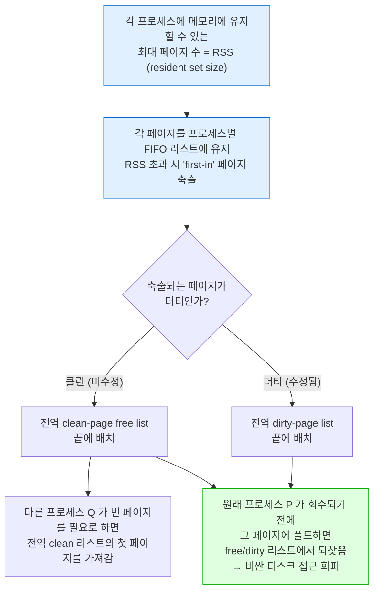
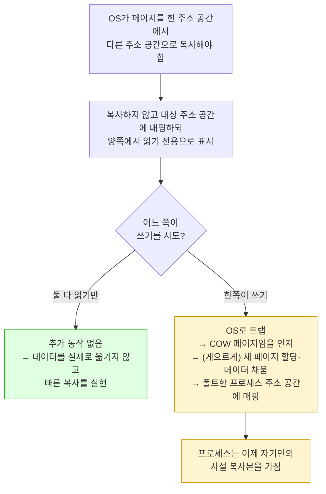
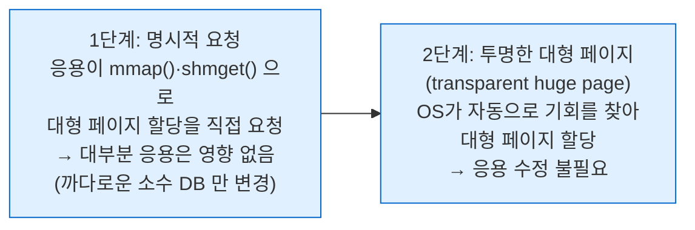
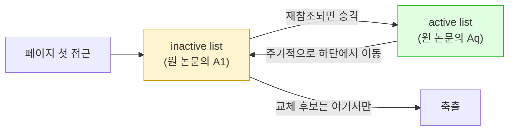
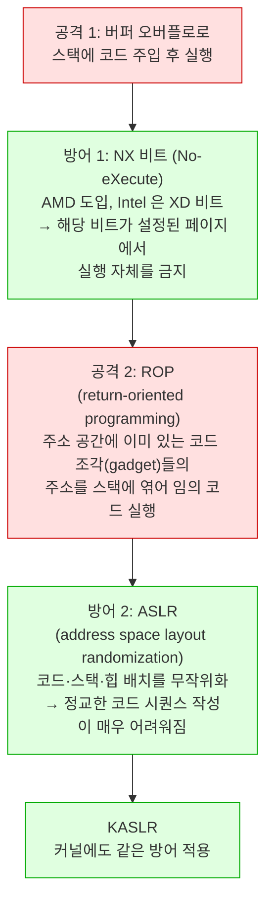
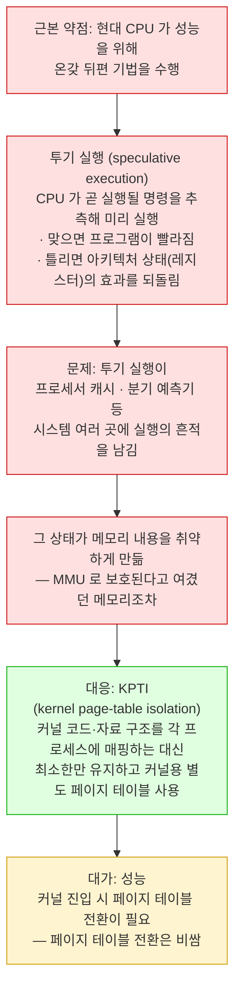

---
tags:
  - topic/os
  - ostep/virtualization
  - vax-vms
  - linux-vm
  - copy-on-write
  - aslr
  - meltdown-spectre
  - status/verified
aliases:
  - 완전한 가상 메모리 시스템
  - Complete Virtual Memory Systems
  - VAX/VMS
  - COW
  - ASLR
  - Meltdown
  - Spectre
created: 2026-08-19
updated: 2026-08-19
---

# 23. 완전한 가상 메모리 시스템 (Complete Virtual Memory Systems)

> VAX/VMS 와 Linux 두 실제 시스템. 세그먼트 FIFO · 요구 제로화 · COW · 대형 페이지 · 2Q 교체 · NX·ASLR·Meltdown/Spectre

- 원서 PDF — [23-Case-Study-VAX.pdf](../../pdfs/01-virtualization/23-Case-Study-VAX.pdf)
- 원서 절 구조 (영문판) — 23.1 VAX/VMS 가상 메모리 · 23.2 Linux 가상 메모리 시스템 · 23.3 요약

> [!warning] 판본 차이 — 한국어판과 영문판의 범위가 다름
> | | 챕터 번호 | 제목 | 범위 |
> |---|---|---|---|
> | **한국어 번역판** | **26** | VAX/VMS 가상 메모리 시스템 | **VAX/VMS 만** (절 구조 26.1 배경 ~ 26.6 요약) |
> | **영문판 (v1.10)** | **23** | Complete Virtual Memory Systems | VAX/VMS **+ Linux + 보안**(NX·ASLR·Meltdown/Spectre) |
>
> 본 문서는 **영문판 기준**으로 작성하여 Linux·보안 절을 포함. 보유한 한국어판 PDF(`23-Case-Study-VAX.pdf`)에는 **23.2 Linux 절 이하가 없음** — 해당 부분은 영문판 원문에서 확인한 내용

> [!question] CRUX: 완전한 VM 시스템을 어떻게 구축하는가
> 완전한 가상 메모리 시스템을 실현하려면 어떤 기능이 필요한가. 그것들이 어떻게 **성능을 개선하고 보안을 높이거나** 시스템을 개선하는가

- 다루는 두 시스템

| 시스템 | 시기 | 왜 다루는가 |
|---|---|---|
| **VAX/VMS** | 1970년대~1980년대 초 | "현대적" 가상 메모리 관리자의 **가장 이른 예** 중 하나. **놀랄 만큼 많은 기법이 오늘날까지 살아남음**. 50년 된 착상도 알 가치가 있음 |
| **Linux** | 현재 | 폰처럼 작고 저사양인 시스템부터 데이터센터의 최대 확장 멀티코어까지 효과적으로 동작 → VM 시스템이 **그 모든 상황에서 성공적으로 돌 만큼 유연**해야 함 |

## 23.1 VAX/VMS 가상 메모리

- VAX-11 미니컴퓨터 아키텍처 — 1970년대 말 **DEC**(Digital Equipment Corporation) 도입. VAX-11/780, 덜 강력한 VAX-11/750 등 여러 구현
- OS 는 **VAX/VMS**(또는 VMS). 주 설계자 중 한 명이 **Dave Cutler** — 나중에 Microsoft **Windows NT** 개발을 주도
- VMS 의 일반적 문제 — **매우 저렴한 VAXen**(맞다, 이게 올바른 복수형)부터 같은 아키텍처 계열의 극히 고사양 머신까지 넓은 범위에서 실행되어야 함
- VMS 는 **아키텍처의 내재적 결함을 감추는 소프트웨어 혁신의 훌륭한 예** — 하드웨어 설계자가 모든 것을 제대로 해내지 못했을 때 OS가 무엇을 하는지 보여줌

> [!note] ASIDE: 일반성의 저주 (the curse of generality)
> OS는 **넓은 부류의 응용과 시스템을 일반적으로 지원**하는 임무를 맡는 문제를 자주 겪음. 근본적 결과는 OS가 **어느 한 설치 환경도 아주 잘 지원하지는 못하게** 되는 것.
> VMS 의 경우 VAX-11 아키텍처가 여러 다른 구현으로 실현되었으므로 저주가 매우 현실적. 오늘날도 마찬가지 — Linux 는 폰, TV 셋톱박스, 노트북, 데스크톱, 그리고 클라우드 데이터센터에서 수천 프로세스를 돌리는 고사양 서버에서 모두 잘 돌기를 기대받음

### 메모리 관리 하드웨어

```text
VAX-11: 프로세스당 32비트 가상 주소 공간, 512바이트 페이지
→ 가상 주소 = VPN 23비트 + offset 9비트
→ VPN 상위 2비트로 페이지가 속한 세그먼트 구별
   = 페이징과 세그멘테이션의 혼합 (ch 20.2)
```

| 영역 | 이름 | 내용 |
|---|---|---|
| 주소 공간 **하위 절반** 전반부 | **P0** (process space) | 사용자 프로그램 + **아래로 자라는 힙** |
| 주소 공간 하위 절반 후반부 | **P1** | **위로 자라는 스택** |
| 주소 공간 **상위 절반** (절반만 사용) | **S** (system space) | **보호된 OS 코드·데이터**. 프로세스 간 공유 |

**설계자의 주요 우려 — 512바이트라는 믿기 힘들게 작은 페이지**

- 역사적 이유로 선택된 이 크기는 **단순 선형 페이지 테이블을 지나치게 크게** 만드는 근본 문제를 가짐
- VMS 설계자의 첫 목표 중 하나가 **페이지 테이블로 메모리를 압도하지 않게 하는 것**

**압박을 줄인 두 가지 방법**

| 방법 | 내용 |
|---|---|
| **1. 사용자 주소 공간을 둘로 세그먼트화** | VAX-11 이 프로세스당 **P0·P1 각각에 페이지 테이블 1개** 제공 → **스택과 힙 사이 미사용 부분에 페이지 테이블 공간이 불필요**. base 는 그 세그먼트 페이지 테이블의 주소, bounds 는 그 크기(PTE 개수) |
| **2. 사용자 페이지 테이블을 커널 가상 메모리에 배치** | 페이지 테이블을 할당·확장할 때 커널이 **자기 가상 메모리(세그먼트 S)에서 공간을 할당**. 메모리 압박이 심하면 커널이 **이 페이지 테이블의 페이지들을 디스크로 스왑** → 물리 메모리를 다른 용도로 확보 |

**대가 — 주소 변환이 더 복잡해짐**


- 다행히 **VAX의 하드웨어 관리 TLB** 가 이 수고로운 조회를 통상(바라건대) 우회시켜 빠르게 만듦

### 실제 주소 공간

```text
0        ┌──────────────────────┐
         │ Page 0: Invalid      │  ← 널 포인터 접근 탐지용
         │ User Code            │
         │ User Heap            │  User (P0)
         ├──────────────────────┤
         │                      │
2^30     │ User Stack           │  User (P1)
         ├──────────────────────┤
2^31     │ Trap Tables          │
         │ Kernel Data          │
         │ Kernel Code          │  System (S)
         │ Kernel Heap          │
         ├──────────────────────┤
         │ Unused               │
2^32     └──────────────────────┘
```

**세 가지 관찰**

1. **코드 세그먼트가 페이지 0 에서 시작하지 않음** — 이 페이지는 **접근 불가로 표시**되어 **널 포인터 접근 탐지**를 지원. 주소 공간 설계 시 **디버깅 지원**이 고려 사항임을 보여줌
2. **커널 가상 주소 공간이 각 사용자 주소 공간의 일부** — 문맥 교환 시 OS는 P0·P1 레지스터를 새 프로세스의 페이지 테이블로 바꾸지만 **S 의 base·bounds 는 바꾸지 않음** → "같은" 커널 구조가 각 사용자 주소 공간에 매핑
3. **보호** — 하드웨어가 페이지별로 **다른 보호 수준**을 지원해야 함. VAX 는 페이지 테이블의 보호 비트에 **그 페이지에 접근하려면 CPU가 어느 특권 수준이어야 하는지** 명시

**커널을 각 주소 공간에 매핑하는 이유**

- 커널의 삶이 쉬워짐 — `write()` 시스템 콜 등으로 **사용자 프로그램에서 포인터를 받으면** 그 포인터에서 자기 구조로 **데이터를 복사하기 쉬움**. OS는 접근하는 데이터가 어디서 왔는지 걱정 없이 자연스럽게 작성·컴파일됨
- 반대로 커널이 전적으로 물리 메모리에 있으면 **페이지 테이블 페이지를 디스크로 스왑하는 일이 상당히 어려움**
- 커널에 자기만의 주소 공간을 주면 **사용자 응용과 커널 사이의 데이터 이동이 다시 복잡하고 고통스러워짐**
- 이 구성(현재 널리 사용)에서 커널은 응용에 **거의 라이브러리처럼 보임** — 다만 보호된 라이브러리

> [!note] ASIDE: 널 포인터 접근이 왜 세그폴트를 일으키는가
> ```c
> int *p = NULL;  // set p = 0
> // try to store 10 to virtual addr 0
> *p = 10;
> ```
> 하드웨어가 TLB 에서 VPN(여기서도 0)을 조회 → **TLB 미스**. 페이지 테이블 참조 → **VPN 0 의 항목이 무효로 표시**되어 있음. 따라서 무효 접근이며 제어가 OS로 이전되고 OS가 프로세스를 종료할 가능성이 큼.
> (UNIX 계열에서는 프로세스에 **시그널**이 전달되어 폴트에 반응할 기회를 줌. 잡지 않으면 프로세스가 죽음)

### 페이지 교체

**VAX PTE 의 비트**

| 필드 | 크기 |
|---|---|
| valid 비트 | 1 |
| protection 필드 | **4비트** |
| modify(dirty) 비트 | 1 |
| OS 용 예약 필드 | **5비트** |
| PFN | — |

- **reference 비트가 없음!** → VMS 교체 알고리즘은 **어느 페이지가 활발한지 판정할 하드웨어 지원 없이** 해내야 함
- 개발자들은 **메모리 호그(memory hog)** 도 우려 — 메모리를 많이 써서 다른 프로그램 실행을 어렵게 하는 프로그램. 지금까지 본 정책 대부분이 호깅에 취약. 예 — **LRU 는 전역 정책이어서 프로세스 간에 메모리를 공정히 나누지 않음**

> [!note] ASIDE: reference 비트 흉내내기
> 하드웨어 reference 비트 없이도 어느 페이지가 사용 중인지에 대한 개념을 얻을 수 있음. 1980년대 초 Babaoglu 와 Joy 가 **VAX 의 보호 비트로 reference 비트를 흉내낼 수 있음**을 보였음.
> **기본 착상** — 페이지 테이블의 **모든 페이지를 접근 불가로 표시**(단, 실제로 어느 페이지가 접근 가능한지는 PTE 의 "OS 예약 필드"에 보관). 프로세스가 페이지에 접근하면 OS로 트랩 → OS가 실제로 접근 가능해야 하는지 확인하고, 그렇다면 **정상 보호로 되돌림**(읽기 전용, 읽기·쓰기 등). 교체 시점에 OS는 **어느 페이지가 접근 불가로 남아 있는지** 확인해 최근에 쓰이지 않은 페이지를 파악.
> 핵심은 **오버헤드를 줄이면서도 페이지 사용에 대한 좋은 감각을 얻는 것** — 접근 불가 표시에 **너무 적극적이면 오버헤드가 과도**하고, **너무 소극적이면 모든 페이지가 참조된 것으로 끝나** 다시 어느 페이지를 축출할지 알 수 없게 됨

**세그먼트 FIFO (segmented FIFO) 교체 정책**



- FIFO 는 **하드웨어 지원이 전혀 필요 없어** 구현이 쉬움 → reference 비트가 없는 VAX 에 적합
- 순수 FIFO 는 성능이 좋지 않으므로(ch 22 실측 참고) **두 개의 second-chance 리스트**를 도입
- **이 전역 second-chance 리스트가 클수록 세그먼트 FIFO 알고리즘의 성능이 LRU 에 가까워짐**

**클러스터링 (clustering)**

- 작은 페이지 크기 때문에 스와핑 중 디스크 I/O 가 매우 비효율적일 수 있음 — 디스크는 **큰 전송**에서 더 잘함
- VMS 는 **전역 더티 리스트에서 페이지를 큰 배치로 묶어 한 번에 디스크에 기록**(그렇게 해서 클린으로 만듦)
- **대부분 현대 시스템이 클러스터링 사용** — 스왑 공간 어디에나 페이지를 놓을 자유가 있으므로 OS가 페이지를 묶어 **더 적고 더 큰 쓰기**를 수행해 성능을 개선

### 그 밖의 깔끔한 기법 — 게으름의 미덕

> [!tip] TIP: 게을러질 것 (Be Lazy)
> 게으름은 인생에서도 OS 에서도 미덕일 수 있음. 게으름은 일을 뒤로 미룰 수 있게 하며, 이는 OS 안에서 여러 이유로 유익.
> 1. 일을 미루면 **현재 연산의 지연 시간이 줄어** 응답성이 개선됨 — 예: OS가 파일 쓰기가 즉시 성공했다고 보고하고 나중에 백그라운드로 디스크에 기록
> 2. 더 중요하게, 게으름은 때로 **그 일을 아예 할 필요를 없앰** — 예: 파일이 삭제될 때까지 쓰기를 지연하면 그 쓰기를 할 필요가 사라짐

**요구 제로화 (demand zeroing)**

| 방식 | 동작 |
|---|---|
| **소박한 구현** | 힙에 페이지를 추가하라는 요청에 대해 물리 메모리에서 페이지를 찾아 **0으로 채우고**(보안상 필수 — 그러지 않으면 다른 프로세스가 쓰던 내용을 볼 수 있음) 주소 공간에 매핑. **페이지가 쓰이지 않으면 비용이 낭비** |
| **요구 제로화** | 페이지 추가 시 OS는 **거의 일을 하지 않음** — 페이지 테이블에 **접근 불가로 표시된 항목**만 넣음. 프로세스가 읽거나 쓰면 트랩 → OS가 (통상 PTE 의 "OS 예약" 부분 비트로) 이것이 **demand-zero 페이지**임을 인지 → 이 시점에 물리 페이지를 찾아 0으로 채우고 매핑. **프로세스가 절대 접근하지 않으면 이 모든 일이 회피됨** |

**COW (copy-on-write)**

- 착상의 기원은 최소한 **TENEX** 운영체제까지 거슬러 감



**COW 가 유용한 이유**

- 어떤 종류의 **공유 라이브러리**든 여러 프로세스의 주소 공간에 COW 로 매핑 가능 → **귀중한 메모리 공간 절약**
- UNIX 계열에서는 `fork()`·`exec()` 의 의미 때문에 **더욱 결정적**
  - `fork()` 는 호출자 주소 공간의 **정확한 복사본**을 만듦. 큰 주소 공간에서 이런 복사는 **느리고 데이터 집약적**
  - 더 나쁜 것은 주소 공간 대부분이 곧이어지는 `exec()` 호출로 **즉시 덮어써진다**는 것
  - **COW `fork()`** 를 수행하면 OS가 **불필요한 복사 대부분을 회피**하면서 올바른 의미를 유지하고 성능을 개선

## 23.2 Linux 가상 메모리 시스템

- Linux 개발은 **실제 엔지니어가 프로덕션에서 만난 실제 문제를 해결하며** 전진 → 많은 기능이 천천히 통합됨
- 논의는 **Intel x86 용 Linux** 에 초점 (가장 지배적·중요한 배포)

### Linux 주소 공간

```text
0x00000000  ┌──────────────────────┐
            │ Page 0: Invalid      │
            │ User Code            │
            │ User Heap            │  User
            │ User Stack           │
0xC0000000  ├──────────────────────┤
            │ Kernel (Logical)     │  Kernel
            │ Kernel (Virtual)     │
            └──────────────────────┘
```

- 고전 32비트 Linux 에서 사용자·커널 분할이 **`0xC0000000`**(주소 공간의 3/4 지점)에서 일어남
  - 가상 주소 **0 ~ 0xBFFFFFFF** — 사용자 가상 주소
  - **0xC0000000 ~ 0xFFFFFFFF** — 커널 가상 주소 공간
- 64비트 Linux 도 비슷한 분할이나 지점이 약간 다름
- 문맥 교환 시 **사용자 부분은 바뀌고 커널 부분은 프로세스 간 동일**. 사용자 모드 프로그램은 커널 가상 페이지에 접근 불가 — **커널로 트랩해 특권 모드로 전이해야만** 접근 가능

**두 종류의 커널 가상 주소**

| 종류 | 할당자 | 물리 메모리와의 관계 | 용도 |
|---|---|---|---|
| **커널 논리 주소** (kernel logical) | `kmalloc` | **물리 메모리 앞부분과 직접 매핑** — `0xC0000000` → 물리 `0x00000000`, `0xC0000FFF` → `0x00000FFF` | 페이지 테이블, 프로세스별 커널 스택 등 대부분 커널 자료 구조. **디스크로 스왑 불가** |
| **커널 가상 주소** (kernel virtual) | `vmalloc` | **연속이 아님** — 각 커널 가상 페이지가 비연속 물리 페이지에 매핑될 수 있음 | 큰 연속 물리 덩어리를 찾기 어려운 **대형 버퍼**. 할당이 쉬움 |

**직접 매핑의 두 가지 함의**

1. 커널 논리 주소와 물리 주소 사이 **변환이 단순** → 이 주소들은 사실상 물리 주소처럼 취급됨
2. 커널 논리 주소 공간에서 **연속이면 물리 메모리에서도 연속** → **DMA**(direct memory access)처럼 연속 물리 메모리가 필요한 연산에 적합

- 32비트 Linux 에서 커널 가상 주소가 존재하는 또 하나의 이유 — 커널이 **약 1GB 를 넘는 메모리를 주소지정**할 수 있게 함. 64비트로 이동하며 필요성이 덜 긴급해짐

### 페이지 테이블 구조

- x86 은 **하드웨어 관리 멀티 레벨 페이지 테이블**을 프로세스당 1개 제공. OS는 메모리에 매핑을 설정하고 특권 레지스터를 페이지 디렉토리 시작으로 향하게 하면 **나머지는 하드웨어가 처리**
- OS가 개입하는 시점 — **프로세스 생성·삭제·문맥 교환**

```text
 63          47        31        15         0
┌───────────┬─────────┬─────────┬─────────┬─────────┐
│  Unused   │   P1    │   P2    │   P3    │  P4  │ Offset
│ (상위 16) │         │         │         │      │ (하위 12)
└───────────┴─────────┴─────────┴─────────┴─────────┘
```

- 현재 64비트 시스템은 **4단계 테이블** 사용. 64비트 주소 공간이 전부 쓰이지는 않고 **하위 48비트만** 사용
  - **상위 16비트는 미사용**(변환에 역할 없음)
  - **하위 12비트는 offset**(4KB 페이지 때문. 변환 없이 직접 사용)
  - **가운데 36비트가 변환에 참여** — P1 이 최상위 페이지 디렉토리 인덱싱, 한 단계씩 진행해 P4 가 실제 페이지 테이블 페이지를 인덱싱
- 시스템 메모리가 더 커지면 **5단계, 결국 6단계** 트리 구조로 이어질 것 — 단순한 페이지 테이블 조회에 6단계 변환이 필요해짐

### 대형 페이지 지원 (huge pages)

- Intel x86 은 4KB 외에 **2MB·1GB 페이지**까지 하드웨어 지원. Linux 는 이를 활용하도록 진화

| 이점 | 내용 |
|---|---|
| **주된 이점 — TLB 동작 개선** | 페이지 테이블 항목 수 감소가 **추진력이 아님**. 프로세스가 메모리를 활발히 많이 쓰면 TLB 를 변환으로 빠르게 채움. 4KB 페이지면 **TLB 미스 없이 접근 가능한 총 메모리가 적음** → 최근 연구는 일부 응용이 **사이클의 10% 를 TLB 미스 처리에 소비**한다고 보임 |
| **더 짧은 TLB 미스 경로** | 미스가 발생해도 **더 빨리 처리**됨 |
| **할당이 빠를 수 있음** | 특정 상황에서. 작지만 때로 중요한 이점 |

**비용**

| 비용 | 내용 |
|---|---|
| **내부 단편화** | 가장 큰 잠재 비용. 크지만 **희소하게 쓰이는 페이지**가 메모리를 채울 수 있음 |
| **스와핑과 잘 안 맞음** | 활성화된 경우 시스템의 **I/O 양을 크게 증폭**시킬 수 있음 |
| **할당 오버헤드** | 일부 경우 나쁠 수 있음 |

> [!tip] TIP: 점진주의를 고려할 것 (incrementalism)
> 많은 경우 삶에서 혁명가가 되라고 권장받음 — "크게 생각하라", "세상을 바꿔라". 그러나 많은 경우 **더 느리고 점진적인 접근**이 옳을 수 있음.
> 이 챕터의 Linux 대형 페이지 예가 **공학적 점진주의**의 예 — 근본주의자의 입장을 취해 대형 페이지가 미래의 길이라고 주장하는 대신, 개발자들은 **먼저 특수 목적 지원을 도입**하고 장단점을 더 배운 뒤, **실제 이유가 생겼을 때만** 모든 응용을 위한 더 일반적 지원을 추가하는 신중한 접근을 취함.
> 점진주의는 때로 경시되나 종종 **느리고 사려 깊고 합리적인 진보**로 이어짐

**Linux 의 점진적 도입 경로**



### 페이지 캐시

- Linux 페이지 캐시는 **통합(unified)** 되어 있으며 **세 가지 주요 출처**의 페이지를 메모리에 유지

| 출처 | 설명 |
|---|---|
| **메모리 매핑 파일** | `mmap()` 으로 매핑된 파일 |
| **장치의 파일 데이터·메타데이터** | 통상 `read()`·`write()` 호출을 파일 시스템에 보내 접근 |
| **각 프로세스의 힙·스택 페이지** | 때로 **익명 메모리(anonymous memory)** 라 불림 — 밑에 이름 붙은 파일이 없고 **스왑 공간**이 있으므로 |

- 이들은 **페이지 캐시 해시 테이블**에 보관되어 빠른 조회 가능
- 페이지 캐시가 항목의 **클린**(읽었으나 갱신 안 됨) / **더티**(수정됨) 여부를 추적
- 더티 데이터는 백그라운드 스레드(**`pdflush`**)가 주기적으로 백킹 스토어(파일 데이터는 특정 파일로, 익명 영역은 스왑 공간으로)에 기록. **일정 시간 경과** 또는 **너무 많은 페이지가 더티로 간주될 때** 발동 (둘 다 설정 가능)

**2Q 교체 (수정판)**



- **해결하는 문제** — 표준 LRU 는 효과적이나 특정 흔한 접근 패턴에 무너짐. 예 — 프로세스가 **큰 파일**(메모리 크기에 가깝거나 더 큰)을 반복 접근하면 **LRU 가 다른 모든 파일을 메모리에서 쫓아냄**. 더 나쁜 것은 그 파일의 일부를 메모리에 유지하는 것이 **유용하지도 않다**는 점 — 축출되기 전에 재참조되지 않으므로
- Linux 는 **active list 를 전체 페이지 캐시 크기의 약 2/3** 로 유지
- 이상적으로는 완벽한 LRU 순서로 관리하고 싶으나 비싸므로 **LRU 근사(클럭 교체와 유사)** 사용
- **2Q 는 대체로 LRU 처럼 동작하되**, 순환적 대용량 파일 접근의 경우 그 페이지들을 **inactive list 에 국한**시켜 active list 의 유용한 페이지를 밀어내지 않게 함

> [!note] 실측 대응
> [[OS/ostep/docs/01-virtualization/21-swapping-mechanisms|ch 21]] 의 macOS `vm_stat` 실측에서 관찰한 `Pages active` / `Pages inactive` 분리가 **이 2단 리스트 구조와 같은 계열**. 다만 macOS(XNU)의 정확한 알고리즘은 확인 필요

> [!note] ASIDE: 메모리 매핑의 보편성
> 메모리 매핑은 Linux 보다 몇 년 앞서며 Linux 와 다른 현대 시스템 여러 곳에서 사용됨. 이미 열린 파일 디스크립터에 `mmap()` 을 호출하면 프로세스는 **파일 내용이 있는 것처럼 보이는 가상 메모리 영역의 시작 포인터**를 받음. 이후 그 포인터로 **단순 포인터 역참조**로 파일 어느 부분에나 접근 가능.
> 아직 메모리에 들어오지 않은 부분에 접근하면 **페이지 폴트**가 발생하고 OS가 관련 데이터를 페이지 인하며 페이지 테이블을 갱신 (= **요구 페이징**).
> **모든 일반 Linux 프로세스가 메모리 매핑 파일을 사용** — `main()` 의 코드가 `mmap()` 을 직접 호출하지 않아도, Linux 가 실행 파일과 공유 라이브러리 코드를 메모리로 적재하는 방식 때문.
> `pmap` 출력 예 (원서, tcsh) — 가상 주소 / 크기 / 보호 비트 / 매핑 출처 4열
> ```text
> 0000000000400000    372K r-x-- tcsh
> 00000000019d5000   1780K rw---   [ anon ]
> 00007f4e7cf06000   1792K r-x-- libc-2.23.so
> 00007f4e7d2d0000     36K r-x-- libcrypt-2.23.so
> 00007f4e7d508000    148K r-x-- libtinfo.so.5.9
> 00007f4e7d731000    152K r-x-- ld-2.23.so
> 00007f4e7d932000     16K rw---   [ stack ]
> ```
> `tcsh` 바이너리 코드, `libc`·`libcrypt`·`libtinfo`, 동적 링커(`ld.so`) 코드가 모두 주소 공간에 매핑됨. 익명 영역 2개(힙 = `anon`, 스택 = `stack`)도 존재

### macOS 실측 — `vmmap` (원서 `pmap` 대응)

```bash
vmmap <pid>
```

- `<pid>` — 대상 프로세스 ID. macOS 에서 프로세스의 가상 메모리 영역을 나열

```text
__TEXT          100398000-10039c000  [  16K  16K  0K  0K] r-x/r-x SM=COW   /tmp/vmm
__DATA_CONST    10039c000-1003a0000  [  16K  16K  0K  0K] r--/rw- SM=COW   /tmp/vmm
__LINKEDIT      1003a0000-1003a4000  [  16K  16K  0K  0K] r--/r-- SM=COW   /tmp/vmm
MALLOC guard page 100654000-10075c000 [1056K   0K  0K  0K] ---/--- SM=SHM
MALLOC metadata 100798000-10079c000  [  16K  16K 16K  0K] r--/rwx SM=PRV
__TEXT          1811a8000-1811fb000  [ 332K 332K  0K  0K] r-x/r-x SM=COW   /usr/lib/libobjc.A.dylib
__TEXT          181230000-1812d7000  [ 668K 668K  0K  0K] r-x/r-x SM=COW   /usr/lib/dyld
__TEXT          181400000-181451000  [ 324K 324K  0K  0K] r-x/r-x SM=COW   /usr/lib/system/libsystem_malloc.dylib
```

| 관찰 | 원서 개념과의 대응 |
|---|---|
| **`SM=COW`** | **copy-on-write 가 실제로 표시됨**. 실행 파일 코드와 모든 공유 라이브러리가 COW 로 매핑 → 원서의 "공유 라이브러리를 COW 로 매핑해 메모리 절약"을 직접 확인 |
| `SM=PRV` / `SM=SHM` | private / shared. `MALLOC metadata` 만 사설 |
| **`r-x/r-x`** | 코드는 **읽기·실행, 쓰기 불가** → NX·W^X 정책의 실현 |
| **`MALLOC guard page`, 권한 `---/---`** | **접근 불가 페이지**. 힙 오버플로 탐지용 → 원서의 "무효 페이지로 널 포인터·오버런 탐지" 개념의 확장 적용 |
| 모든 영역이 **16K 단위 정렬** | 페이지 크기 16KB ([[OS/ostep/projects/06-tlb-measure/README|실습 6]] 실측과 일치) |
| 매핑 출처에 `dyld`, `libsystem_*.dylib` | 원서 `pmap` 예의 `ld.so`, `libc` 에 대응 |

### 보안과 버퍼 오버플로

- 현대 VM 시스템(Linux·Solaris·BSD 계열)과 옛 시스템(VAX/VMS)의 **가장 큰 차이는 보안 강조**

**버퍼 오버플로 공격**

```c
int some_function(char *input) {
    char dest_buffer[100];
    strcpy(dest_buffer, input);   // oops, unbounded copy!
}
```

- 개발자가 **입력이 지나치게 길지 않을 것이라 (잘못) 가정**하고 버퍼에 복사 → 입력이 실제로 너무 길면 **버퍼를 넘쳐 대상의 메모리를 덮어씀**
- 많은 경우 치명적이지 않으나(크래시 정도), **악의적 프로그래머는 입력을 정교하게 조작해 자기 코드를 주입**하고 시스템을 장악할 수 있음
- OS 자체에 성공하면 **권한 상승(privilege escalation)** — 사용자 코드가 커널 접근 권한을 획득

**방어 계층**



- **ROP** 의 관찰 — 어떤 프로그램의 주소 공간에도 **코드 조각(gadget)이 많음**. 특히 방대한 C 라이브러리와 링크된 C 프로그램. 공격자는 스택을 덮어써서 현재 실행 함수의 **반환 주소가 원하는 악성 명령을 가리키게** 하고 그 뒤에 반환 명령이 오게 함. 다수의 gadget 을 엮으면(각 반환이 다음 gadget 으로 점프) **임의 코드 실행**
- ASLR 로 취약한 사용자 프로그램에 대한 공격 대부분이 **크래시로 끝나고 제어 획득에는 실패**

**ASLR 관찰 코드 (원서)**

```c
int main(int argc, char *argv[]) {
    int stack = 0;
    printf("%p\n", &stack);
    return 0;
}
```

```text
prompt> ./random
0x7ffd3e55d2b4
prompt> ./random
0x7ffe1033b8f4
prompt> ./random
0x7ffe45522e94
```

- ASLR 이 없던 옛 시스템에서는 매번 같은 값. 현대 시스템에서는 **실행마다 값이 변함**
- **macOS 실측** — [[OS/ostep/projects/03-address-space/README|실습 3]] 에서 동일 현상을 확인했으며, 다만 스택·힙 주소는 변하고 **코드 주소는 고정**(`0x1000...` 대역)인 차이가 관찰됨

### Meltdown 과 Spectre

- 2018년 8월(원서 집필 시점) 시스템 보안 세계를 뒤집은 두 공격. **4개 연구 그룹이 거의 동시에 발견**. **Spectre 가 둘 중 더 문제적**으로 간주됨



- **KPTI 가 위 보안 문제 전부를 해결하지는 않음** — 일부만
- **투기 실행을 끄는** 단순 해법은 의미가 없음 — 시스템이 **수천 배 느려짐**
- 원서의 마무리 — "보안이 관심사라면 살아 있기에 흥미로운 시대"
- 원서 권고 학습 경로 — 현대 컴퓨터 아키텍처(투기 실행과 그 구현 기제) → Meltdown·Spectre 논문(투기 실행 입문도 포함) → OS 의 추가 취약점

> [!note] 보안의 대가
> 원서 문장 — "Ah, the costs of security: convenience and performance." **보안은 편의성과 성능을 대가로 지불**한다는 것이 이 절의 요지

## 23.3 정리

### 두 시스템 대조

| 항목 | **VAX/VMS** (1970~80년대) | **Linux** (현재) |
|---|---|---|
| 페이지 크기 | **512바이트** (너무 작음) | 4KB 기본 + **2MB·1GB 대형 페이지** |
| 페이지 테이블 | 페이징+세그멘테이션 혼합 (P0·P1·S), **커널 가상 메모리에 배치** | x86 **4단계 멀티 레벨** (하위 48비트 사용) |
| reference 비트 | **없음** → 보호 비트로 흉내내기 | 있음 |
| 교체 정책 | **세그먼트 FIFO** + RSS + 전역 second-chance 리스트 2개 | **수정 2Q** (active/inactive 리스트) + LRU 근사 |
| 게으른 최적화 | **요구 제로화**, **COW** | 동일 (COW `fork()`, `/dev/zero` 매핑 요구 제로화) |
| I/O 최적화 | **클러스터링** | 동일 + `pdflush` 백그라운드 기록 |
| 보안 | 페이지 0 무효화, 특권 수준 보호 비트 | **NX·ASLR·KASLR·KPTI** |

- **VMS 의 기법 다수가 오늘날까지 살아남음** — COW, 요구 제로화, 클러스터링, 커널을 사용자 주소 공간에 매핑, 페이지 0 무효화
- Linux 는 **과거의 좋은 착상을 많이 물려받고** 자기 혁신도 다수 포함
- 원서 마무리 인용 — "What is any ocean, but a multitude of drops?"

## 관련 문서

- [[OS/ostep/docs/01-virtualization/20-advanced-page-tables|20. 고급 페이지 테이블]] — 페이징+세그멘테이션 혼합, 페이지 테이블 스왑
- [[OS/ostep/docs/01-virtualization/21-swapping-mechanisms|21. 스와핑 기법]] — 클러스터링·백그라운드 데몬, macOS `vm_stat` 실측
- [[OS/ostep/docs/01-virtualization/22-swapping-policies|22. 스와핑 정책]] — FIFO·LRU 근사·클럭. 2Q 가 해결하는 LRU 의 약점
- [[OS/ostep/docs/01-virtualization/13-address-spaces|13. 주소 공간]] — 주소 공간 추상의 출발점
- [[OS/ostep/docs/01-virtualization/24-summary-dialogue|24. 메모리 가상화 요약 대화]] — 파트 1 마무리
- [[OS/ostep/projects/03-address-space/README|실습 3. 주소 공간 관찰]] — ASLR·Mach-O 세그먼트 실측
- [[OS/ostep/docs/README|이론 문서 인덱스]] — 전 챕터 목록
