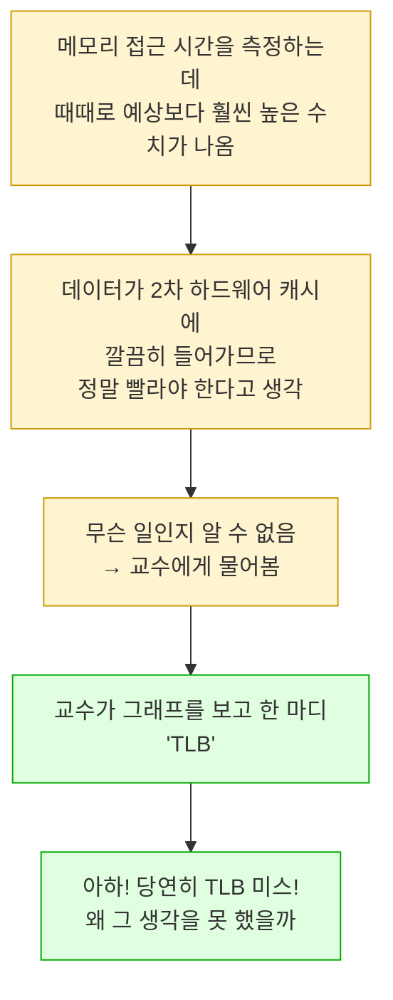
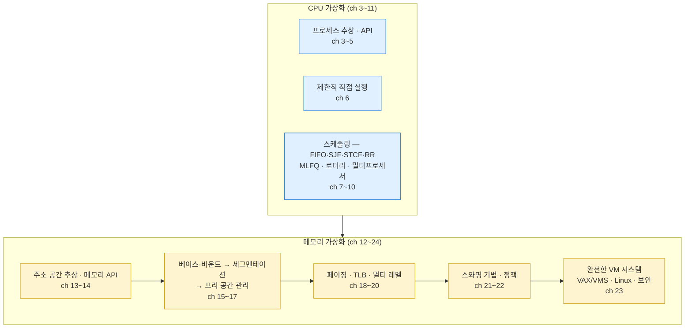

---
tags:
  - topic/os
  - ostep/virtualization
  - dialogue
  - summary
  - mental-model
  - status/verified
aliases:
  - 메모리 가상화 요약 대화
  - Summary Dialogue on Memory Virtualization
created: 2026-08-19
updated: 2026-08-19
---

# 24. 메모리 가상화 요약 대화 (Summary Dialogue on Memory Virtualization)

> 파트 1 마무리. "시험을 위해 외우는 것이 아니라 **정신 모형(mental model)** 을 만드는 것"

- 원서 PDF — [24-Summary.pdf](../../pdfs/01-virtualization/24-Summary.pdf)
- 위치 — 메모리 가상화(ch 13~23) 종료. 파트 1(가상화) 완결

## 왜 배우는가 — "TLB" 한 마디의 일화

- 학생 — "이걸 다 어떻게 기억하죠? 시험 때문에요"
- 교수 — "그게 기억하려는 이유가 아니기를 바란다. **세상에 나갔을 때 시스템이 실제로 어떻게 동작하는지 이해하기 위해** 배우는 것"

교수의 대학원 시절 일화.

- **가상 메모리가 어떻게 동작하는지에 대한 좋은 모형을 가지면 온갖 흥미로운 성능 문제를 진단하는 데 도움**
- 학생의 정리 — 정신 모형을 만들어 두면 **시스템이 예상과 다르게 동작할 때 놀라지 않고**, 생각만으로도 **시스템이 어떻게 동작할지 예상**할 수 있어야 함

> [!note] 본 정리에서 겪은 같은 경험
> [[OS/ostep/projects/06-tlb-measure/README|실습 6]] 에서 페이지 수를 늘려가며 접근당 시간을 측정했을 때 8→9 페이지에서 급증하고 31 페이지 부근에서 되돌아오는 곡선을 얻음. 원서가 예고한 "TLB" 한 마디가 첫 급증을 설명하고, 되돌아오는 부분은 **원서 모델에 없는 프리페처** 때문으로 추정됨.
> 정신 모형이 있으면 **어디까지 설명되고 어디부터 설명되지 않는지**를 구분할 수 있다는 것이 이 대화의 요지

## 학생이 정리한 정신 모형

### 1. 프로그램에서 보이는 모든 주소는 가상 주소

- C 프로그램 안에서 **관찰할 수 있는 모든 주소가 가상 주소**. 프로그래머는 데이터와 코드가 메모리 어디에 있는지에 대한 **환상**만 받음
- 학생의 소감 — 포인터 주소를 출력할 수 있는 것이 멋지다고 생각했는데, 이제는 좌절스러움 — **그저 가상 주소일 뿐**이며 데이터가 사는 **실제 물리 주소는 볼 수 없음**
- 교수 — "그렇다, OS가 확실히 그것을 숨긴다"

**실측 대응** — [[OS/ostep/projects/03-address-space/README|실습 3]] 에서 코드·스택·힙 주소를 출력해 확인. ASLR 때문에 스택·힙 주소가 실행마다 바뀌는 것까지 관찰

### 2. TLB 가 정말로 핵심 조각

- 시스템에 **주소 변환의 작은 하드웨어 캐시**를 제공
- 페이지 테이블은 통상 상당히 크므로 **크고 느린 메모리**에 상주. **TLB 가 없으면 프로그램이 훨씬 느리게 실행**될 것
- **TLB 가 진정으로 메모리 가상화를 가능하게 만듦**. TLB 없는 시스템은 상상할 수 없음
- **워킹셋이 TLB 커버리지를 초과하는 프로그램**을 생각하면 몸서리쳐짐 — 그 모든 TLB 미스로 보기 힘들 것

**실측 대응** — [[OS/ostep/projects/06-tlb-measure/README|실습 6]] 에서 TLB 커버리지 초과 시 접근당 시간이 **약 60배**(0.3ns → 18ns) 차이나는 것을 확인

### 3. 페이지 테이블은 그냥 자료 구조

- 알아야 하는 자료 구조 중 하나이되, **자료 구조일 뿐**이므로 거의 어떤 구조든 쓸 수 있음

### 4. 주소 변환 구조는 프로그래머가 원하는 것을 지원할 만큼 유연해야 함

| 구조 | 유연성 |
|---|---|
| **단순 베이스·바운드 레지스터** (ch 15) | **충분히 유연하지 않음** |
| **멀티 레벨 테이블** (ch 20) | 이 의미에서 **완벽** — **사용자가 주소 공간의 일부를 필요로 할 때만** 테이블 공간을 만들므로 낭비가 적음 |

- 구조는 **사용자가 가상 메모리 시스템에서 기대하고 원하는 것과 일치해야** 함

### 5. 기법(mechanism)과 정책(policy)

- 학생 — 페이지 교체 동작을 아는 것은 좋음. 기본 정책 일부는 당연해 보임(LRU 등). 그러나 **실제 가상 메모리 시스템을 구축하는 것**이 더 흥미로움 — VMS 사례 연구에서 본 것처럼
- 학생이 **기법을 더 흥미롭게, 정책을 덜 흥미롭게** 느낀 이유
  - 교수가 말한 대로 결국 **정책 문제의 최선 해법은 단순 — 메모리를 더 사라**
  - 그러나 **기법은 실제로 어떻게 동작하는지 알기 위해 이해해야 함**
- 마무리 — 학생이 DRAM 살 돈을 얻어냄. "다시는 디스크로 스왑하지 않겠어요 — 혹시 하더라도, 최소한 실제로 무슨 일이 일어나는지는 알 테니까요!"

## 파트 1 (가상화) 전체 지도

### 세 가지 반복된 주제

| 주제 | CPU 가상화에서 | 메모리 가상화에서 |
|---|---|---|
| **제한적 직접 실행** | 사용자 코드를 직접 실행하되 트랩·특권 명령으로 제한 (ch 6) | 하드웨어 MMU 가 변환·보호를 강제, 예외 시 OS로 트랩 (ch 15~21) |
| **기법과 정책의 분리** | 문맥 교환(기법) vs 스케줄링 정책(ch 7~10) | 주소 변환·페이지 폴트 처리(기법) vs 교체 정책(ch 21 vs 22) |
| **과거로 미래를 추측** | MLFQ 의 우선순위 조정 (ch 8) | LRU·클럭의 지역성 활용 (ch 22) |

### 파트 1 실측으로 확인한 것들

| 실습 | 확인한 것 |
|---|---|
| [[OS/ostep/projects/01-intro-four-pieces/README\|실습 1]] | 4개 프로그램으로 CPU·메모리 가상화·병행성·영속성을 한 번에 관찰 |
| [[OS/ostep/projects/02-process-api/README\|실습 2]] | `fork`·`wait`·`exec`·출력 리다이렉션, `fork` 버퍼 복제 함정 |
| [[OS/ostep/projects/03-address-space/README\|실습 3]] | Mach-O 세그먼트 배치, 스택 성장 방향, **ASLR** |
| [[OS/ostep/projects/04-memory-api/README\|실습 4]] | 메모리 오류 9종 — **6종이 종료 코드 0 으로 "성공"** |
| [[OS/ostep/projects/05-free-space/README\|실습 5]] | 프리 리스트 할당기 직접 구현, fit 정책 3종 |
| [[OS/ostep/projects/06-tlb-measure/README\|실습 6]] | **16KB 페이지**, TLB 경계, 프리페처 개입 |
| [[OS/ostep/projects/07-page-replacement/README\|실습 7]] | 교체 정책 5종, **Belady 의 역설** 재현 |

### 원서 모델과 macOS arm64 가 달랐던 지점

| 항목 | 원서 | macOS arm64 실측 |
|---|---|---|
| 페이지 크기 | 4KB (x86) | **16KB** |
| 스택·힙 주소 재현성 | 고정 (구형) / 변동 (ASLR 언급) | **변동**하되 코드 주소는 고정 |
| TLB 측정 곡선 | 단일 계단 | **경사 → 정점 → 회복 → 평탄** (다단 TLB·프리페처) |
| 스왑 | 디스크로 직접 | **메모리 압축 먼저** (약 3.9:1) → 이후 암호화 스왑 |
| 최적화의 영향 | 언급 없음 | `-O` 가 루프를 **`bzero` 호출로 치환** |

## 관련 문서

- [[OS/ostep/docs/01-virtualization/12-dialogue|12. 메모리 가상화 대화]] — 메모리 가상화의 시작
- [[OS/ostep/docs/01-virtualization/23-complete-vm-systems|23. 완전한 가상 메모리 시스템]] — 직전 챕터, VAX/VMS·Linux
- [[OS/ostep/docs/01-virtualization/19-tlb|19. TLB]] — 대화에서 "핵심 조각"으로 지목된 것
- [[OS/ostep/docs/01-virtualization/11-summary|11. CPU 가상화 요약 대화]] — 파트 1 전반부 마무리
- [[OS/ostep/docs/README|이론 문서 인덱스]] — 전 챕터 목록
- [[OS/ostep/projects/README|실습 프로젝트 인덱스]] — 전체 실습 커리큘럼
