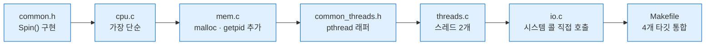

---
tags:
  - topic/os
  - ostep/intro
  - lang/c
  - project/ostep-01
  - virtualization
  - concurrency
  - persistence
  - status/verified
aliases:
  - OSTEP 실습 1
  - 네 조각 프로그램
created: 2026-08-19
updated: 2026-08-19
---

# 실습 1. 네 조각 프로그램 (ch2)

> 4개 프로그램으로 CPU 가상화 · 메모리 가상화 · 병행성 · 영속성을 각각 1회씩 직접 관찰

- 이론 — [[OS/ostep/docs/00-intro/02-introduction|2. 운영체제 개요]]
- 원서 PDF — [02-Introduction.pdf](../../pdfs/00-intro/02-Introduction.pdf) (Figure 2.1 · 2.3 · 2.5 · 2.6)
- 원서 공식 코드 — [ostep-code/intro](https://github.com/remzi-arpacidusseau/ostep-code/tree/master/intro)

## 목표

| 파일 | 관찰 대상 | 확인할 사실 |
|---|---|---|
| `cpu.c` | CPU 가상화 | 물리 CPU 수와 무관하게 여러 프로그램이 동시 실행되는 것처럼 보임 |
| `mem.c` | 메모리 가상화 | 각 프로세스가 자기만의 주소 공간을 가지며 서로 간섭 없음 |
| `threads.c` | 병행성 | 공유 변수 증가가 원자적이지 않아 결과가 어긋남 |
| `io.c` | 영속성 | 프로세스 종료 후에도 파일이 남음. 시스템 콜 3개로 달성 |

## 파일 구성

```text
01-intro-four-pieces/
├── README.md            이 문서
├── Makefile             4개 타깃 빌드
├── common.h             GetTime() · Spin() — 시간 측정 유틸
├── common_threads.h     Pthread_* 래퍼 매크로 (반환값 assert 검증)
├── cpu.c                CPU 가상화
├── mem.c                메모리 가상화
├── threads.c            병행성
└── io.c                 영속성
```

## 작성 순서



1. `common.h` — `Spin()` 이 `sleep` 이 아니라 **바쁜 대기**인 이유를 먼저 이해할 것. CPU 점유가 목적
2. `cpu.c` → `mem.c` → `threads.c` → `io.c` 순으로 난이도 상승
3. `Makefile` 은 마지막. 그 전까지는 `gcc` 직접 호출로 충분

> [!tip] TIP: 먼저 직접 작성할 것
> 소스는 주석까지 완성 형태로 제공하나, **먼저 빈 파일에서 직접 타이핑**하고 막힐 때 대조하는 용도. 복사·붙여넣기는 학습 효과 소실

## 빌드

```bash
make
```

- 옵션 없는 단순 실행. 기본 타깃 `all` → `cpu mem threads io` 4개 빌드

```text
gcc -Wall -Wextra -g -o cpu cpu.c
gcc -Wall -Wextra -g -o mem mem.c
gcc -Wall -Wextra -g -pthread -o threads threads.c
threads.c:25:20: warning: unused parameter 'arg' [-Wunused-parameter]
   25 | void *worker(void *arg) {
      |                    ^
1 warning generated.
gcc -Wall -Wextra -g -o io io.c
io.c:17:14: warning: unused parameter 'argc' [-Wunused-parameter]
   17 | int main(int argc, char *argv[]) {
      |              ^
io.c:17:26: warning: unused parameter 'argv' [-Wunused-parameter]
   17 | int main(int argc, char *argv[]) {
      |                          ^
2 warnings generated.
```

- `-Wall` — 주요 경고 활성
- `-Wextra` — 추가 경고 활성. 위 `unused parameter` 3건이 이 옵션 때문에 노출
- `-g` — 디버그 심볼 포함. lldb 행 번호 표시에 필요
- `-pthread` — POSIX 스레드 지원. `threads` 타깃에만 지정
- `-o <이름>` — 출력 실행 파일명 지정

경고 3건은 **정상이며 의도된 상태**. 대응은 아래 함정 절 참조.

```bash
make clean
```

- 옵션 없음. 실행 파일 4개와 `*.dSYM` 디버그 번들 제거

## 1. `cpu.c` — CPU 가상화

```bash
script -q /dev/null ./cpu A 2>&1 | head -4
```

- `script -q /dev/null <명령>` — 의사 터미널(pty) 할당 후 명령 실행. `-q` 는 시작·종료 메시지 억제, `/dev/null` 은 타이핑 기록 폐기
- `2>&1` — 표준 에러를 표준 출력으로 합류
- `| head -4` — 4줄만 취하고 종료

```text
A
A
A
A
```

4개 동시 실행.

```bash
script -q /dev/null sh -c './cpu A & ./cpu B & ./cpu C & ./cpu D & wait' 2>&1 | head -8
```

- `sh -c '<명령들>'` — 하위 셸에서 여러 명령을 한 문자열로 실행
- `&` — 백그라운드 작업 생성. 4개 프로세스 동시 기동
- `wait` — 하위 셸이 백그라운드 작업 종료까지 대기. 미지정 시 셸 즉시 종료 → pty 닫힘 → 출력 유실
- `| head -8` — 8줄 관찰 후 종료

```text
A
B
C
D
A
B
C
D
```

**관찰 포인트**

- 4개 프로세스 출력이 번갈아 나타남 → 동시 실행 환상
- 실행마다 순서가 달라질 수 있음. 프로세스 생성 순서 ≠ 스케줄 순서
- 종료 — `pkill -x cpu` 또는 포그라운드 실행 시 `Control-c`

```bash
pkill -x cpu
```

- `pkill` — 이름으로 프로세스에 신호 전송
- `-x` — 이름 **완전 일치**만 대상. 미지정 시 부분 일치로 무관한 프로세스까지 종료될 위험

## 2. `mem.c` — 메모리 가상화

```bash
script -q /dev/null sh -c './mem 0 & ./mem 0 & wait' 2>&1 | head -6
```

- `sh -c '<명령들>'` — 하위 셸에서 두 프로세스 동시 실행
- `&` — 백그라운드 작업 생성
- `wait` — 백그라운드 작업 종료까지 하위 셸 대기
- `| head -6` — 6줄 관찰 후 종료

```text
(22120) addr pointed to by p: 0x10159d9f0
(22119) addr pointed to by p: 0x10357d9f0
(22120) value of p: 1
(22119) value of p: 1
(22120) value of p: 2
(22119) value of p: 2
```

**관찰 포인트**

- 두 프로세스가 각각 `1, 2, 3...` 으로 **독립 증가** → 주소 공간 격리 확인
- PID(`22120`, `22119`)로 어느 프로세스 출력인지 구분

> [!note] ASIDE: 원서와 주소값이 다른 이유
> 원서는 두 프로세스가 **동일 주소** `0x200000` 을 출력. 실측은 상이 — **ASLR**(주소 공간 배치 무작위화) 때문. 원서 각주도 이 예제를 책처럼 보려면 ASLR 비활성화가 필요하다고 명시. macOS는 커널이 ASLR을 강제하여 사용자가 끌 수 없음.
> **결론은 불변** — 근거는 "주소가 같다"가 아니라 "값이 서로 간섭 없이 독립 증가한다". 격리 관찰에는 영향 없음

## 3. `threads.c` — 병행성

```bash
./threads 1000
```

- 옵션 없음. 인자 `1000` = 각 스레드의 증가 반복 횟수

```text
Initial value : 0
Final value   : 2000
```

기대값 `2 * 1000 = 2000` 과 일치. 반복 횟수를 100배 늘려 3회 실행.

```bash
./threads 100000; ./threads 100000; ./threads 100000
```

- `;` — 앞 명령의 성공·실패와 무관하게 순차 실행
- 인자 `100000` = 각 스레드 증가 반복 횟수. 기대값 200000

```text
Initial value : 0
Final value   : 102815
Initial value : 0
Final value   : 102323
Initial value : 0
Final value   : 103949
```

**관찰 포인트**

- 기대값 200000 대비 약 절반. 게다가 **실행마다 값이 다름**
- 원인 — `counter++` 가 기계어 3개(load · increment · store)로 분해. 원자적으로 실행되지 않아 두 스레드의 증가가 서로를 덮어씀
- `loops` 가 작을 때(1000) 정답이 나오는 것은 우연 — 스레드 1이 끝난 뒤 스레드 2가 시작될 가능성이 높기 때문. **정답이 나온다고 올바른 코드가 아님**

디스어셈블로 3개 명령어 확인.

```bash
objdump -d threads | sed -n '/<_worker>:/,/<_main>:/p' | sed -n '13,20p'
```

- `objdump -d <파일>` — 실행 파일 역어셈블. `-d` 는 실행 가능 섹션만 대상
- `sed -n '/<_worker>:/,/<_main>:/p'` — `_worker` 심볼부터 `_main` 심볼까지 구간만 출력. `-n` 은 자동 출력 억제, `p` 는 해당 행 인쇄. macOS 심볼은 앞에 `_` 접두
- `sed -n '13,20p'` — 그 구간의 13~20행만 추출 (`counter++` 대응 구간)

```text
100000604: 90000049    	adrp	x9, 0x100008000 <_counter>
100000608: b9400128    	ldr	w8, [x9]
10000060c: 11000508    	add	w8, w8, #0x1
100000610: b9000128    	str	w8, [x9]
100000614: 14000001    	b	0x100000618 <_worker+0x40>
100000618: b94007e8    	ldr	w8, [sp, #0x4]
10000061c: 11000508    	add	w8, w8, #0x1
100000620: b90007e8    	str	w8, [sp, #0x4]
```

**`counter++` 가 3개 명령어인 증거** — arm64 실측

| 주소 | 명령어 | 역할 |
|---|---|---|
| `100000604` | `adrp x9, <_counter>` | `counter` 의 주소를 레지스터 `x9` 에 적재 |
| `100000608` | `ldr w8, [x9]` | **load** — 메모리의 `counter` 값을 레지스터 `w8` 로 |
| `10000060c` | `add w8, w8, #0x1` | **increment** — 레지스터에서 1 증가 |
| `100000610` | `str w8, [x9]` | **store** — 레지스터 값을 메모리로 되쓰기 |

- 뒤이은 `ldr`·`add`·`str` (`sp` 기준)은 루프 변수 `i++` 에 해당. `[x9]`(전역 `counter`)와 `[sp, #0x4]`(스택 지역 변수 `i`)로 구분
- **`ldr` 과 `str` 사이에 다른 스레드가 끼어들 수 있음** → 두 스레드가 같은 값을 읽고 같은 값을 쓰면 증가 1회 소실
- 소실 지점이 실행마다 달라 결과값도 매번 달라짐

## 4. `io.c` — 영속성

```bash
rm -f /tmp/file
./io && ls -l /tmp/file && cat /tmp/file
```

- `rm -f <파일>` — 기존 파일 제거. `-f` 는 파일 부재 시 에러 억제
- `&&` — 앞 명령 성공(종료 코드 0) 시에만 다음 실행
- `ls -l` — 상세 목록. 권한·소유자·크기·시각 표시
- `cat` — 파일 내용 표준 출력

```text
-rw-------@ 1 sunwoo  wheel  12 Aug 19 16:25 /tmp/file
hello world
```

**관찰 포인트**

- 권한 `-rw-------` — `open` 의 `S_IRUSR|S_IWUSR`(=`0600`) 지정 결과
- 크기 `12` — `"hello world\n"` 바이트 수
- 프로세스가 종료된 뒤에도 파일 존재 → **영속성**
- 시스템 콜 3개(`open`·`write`·`close`)만으로 달성. 실제 디스크 배치·추적은 파일 시스템이 전담

## 함정

| 증상 | 원인 | 대응 |
|---|---|---|
| `warning: unused parameter 'arg'` | `worker` 의 시그니처는 `void *(*)(void *)` 로 고정. 인자를 안 써도 매개변수는 있어야 함 | 함수 첫 줄에 `(void) arg;` 추가하면 경고 소거. 원서 코드 원형 유지를 위해 본 실습은 경고를 남겨 둠 |
| `warning: unused parameter 'argc'` | `io.c` 가 명령행 인자를 사용하지 않음 | `int main(void)` 로 변경 가능. 원형 유지 목적으로 미변경 |
| 파이프로 넘기면 출력이 안 나옴 | `stdout` 이 파이프일 때 `printf` 가 **전체 버퍼링**(4096바이트)으로 전환. 1초에 2바이트씩 쌓이면 첫 flush 까지 30분 이상 소요 | `script -q /dev/null <명령>` 으로 pty 할당 → 행 버퍼링. 또는 코드에 `setvbuf(stdout, NULL, _IOLBF, 0)` 추가 |
| `make: *** missing separator` | Makefile 레시피 줄이 **탭이 아닌 공백**으로 시작 | 레시피 첫 문자를 탭으로 교체. `cat -A Makefile` 로 `^I` 확인 |
| `mem` 주소가 원서와 다름 | macOS ASLR 강제 활성 | 정상. 위 ASIDE 참조 |
| `threads` 가 항상 정답을 냄 | `loops` 가 작아 인터리빙이 발생하지 않음 | `loops` 를 100000 이상으로 상향 |
| 백그라운드 `cpu` 가 계속 남음 | 무한 루프 프로그램. `head` 종료만으로는 죽지 않음 | `pkill -x cpu` · `pkill -x mem` 로 정리 |

```bash
cat -A Makefile | head -12
```

- `cat -A` — 비출력 문자 표시. 탭은 `^I`, 행 끝은 `$`. macOS `cat` 은 `-A` 대신 `-e -t` 조합도 가능
- `| head -12` — 앞 12줄만 확인

## 확인 문제

1. `Spin(1)` 을 `sleep(1)` 로 바꾸면 `cpu` 4개 동시 실행 결과가 어떻게 달라지는가. **CPU 사용률** 관점에서 설명할 것 (`top -l 1 | head -12` 로 관찰)
2. `mem.c` 에서 `free(p)` 를 넣을 자리가 있는가. 없다면 이 프로그램이 메모리 누수인지 아닌지 판단할 것
3. `threads 100000` 결과가 기대값의 **약 절반**에 몰리는 이유는 무엇인가. 3개 명령어 인터리빙으로 설명할 것
4. `io.c` 에서 `fsync(fd)` 를 제거하면 무엇이 달라지는가. 정상 종료 시와 전원 차단 시를 구분해 답할 것
5. `io.c` 의 `open` 모드를 `S_IRUSR` 만으로 바꾸면 어떤 일이 일어나는가. 실제로 시도해 결과를 확인할 것

## 관련 문서

- [[OS/ostep/docs/00-intro/02-introduction|2. 운영체제 개요]] — 본 실습의 이론 배경 전체
- [[OS/ostep/projects/README|실습 프로젝트 인덱스]] — 전체 실습 커리큘럼
- [[C/docs/07-stdlib/06-stdio-buffering|stdio 버퍼링]] — pty·파이프별 `printf` flush 시점 차이
- [[C/docs/07-stdlib/05-posix|POSIX 시스템 콜]] — `open`·`write`·`close`·`getpid` 시그니처
- [[C/docs/02-memory/heap-and-free|힙과 free]] — `mem.c` 의 `malloc` 상세
