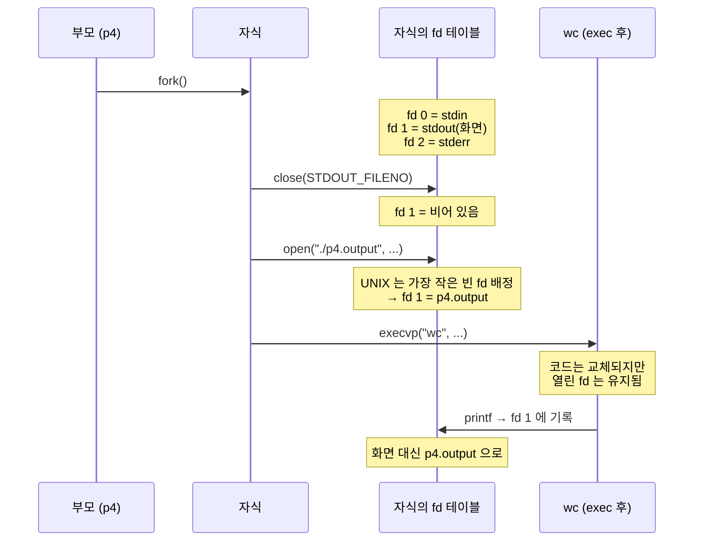

---
tags:
  - topic/os
  - ostep/virtualization
  - lang/c
  - project/ostep-02
  - process
  - fork
  - exec
  - file-descriptor
  - status/verified
aliases:
  - OSTEP 실습 2
  - 프로세스 API 실습
created: 2026-08-19
updated: 2026-08-19
---

# 실습 2. 프로세스 API (ch5)

> `fork` · `wait` · `exec` 세 시스템 콜을 단계적으로 조합해 셸의 동작 원리(출력 리다이렉션)까지 재현

- 이론 — [[OS/ostep/docs/01-virtualization/05-process-api|5. 프로세스 API]]
- 원서 PDF — [05-Process-API.pdf](../../pdfs/01-virtualization/05-Process-API.pdf) (Figure 5.1 ~ 5.4)
- 원서 공식 코드 — [ostep-code/cpu-api](https://github.com/remzi-arpacidusseau/ostep-code/tree/master/cpu-api)

## 목표

| 파일 | 추가되는 것 | 확인할 사실 |
|---|---|---|
| `p1.c` | `fork` | 자식은 `main` 이 아니라 `fork` 반환 지점부터 실행. 반환값이 부모·자식에서 다름 |
| `p2.c` | `wait` | 부모가 자식 종료를 기다림 → 출력 순서가 결정적으로 바뀜 |
| `p3.c` | `exec` | 새 프로세스를 만들지 않고 **현재 프로그램을 다른 프로그램으로 변신**. 성공 시 반환 없음 |
| `p4.c` | `close` + `open` | `fork` 와 `exec` 사이에서 환경을 바꿔 **출력 리다이렉션** 구현 |

## 작성 순서


각 단계에서 **직전 파일을 복사해 한 가지만 추가**하는 방식으로 진행. 무엇이 어떤 변화를 만드는지 분리 관찰이 목적.

## 빌드

```bash
make
```

- 옵션 없음. 기본 타깃 `all` → `p1 p2 p3 p4` 빌드

```text
gcc -Wall -Wextra -Wno-unused-parameter -g -o p1 p1.c
gcc -Wall -Wextra -Wno-unused-parameter -g -o p2 p2.c
gcc -Wall -Wextra -Wno-unused-parameter -g -o p3 p3.c
gcc -Wall -Wextra -Wno-unused-parameter -g -o p4 p4.c
```

- `-Wall` — 주요 경고 활성
- `-Wextra` — 추가 경고 활성
- `-Wno-unused-parameter` — 미사용 매개변수 경고만 비활성. 원서 코드가 `main(int argc, char *argv[])` 원형을 유지하면서 인자를 쓰지 않으므로, **원형 보존을 위해 이 경고만 끔**
- `-g` — 디버그 심볼 포함
- `-o <이름>` — 출력 실행 파일명 지정

> [!tip] TIP: 반드시 pty(터미널)에서 실행할 것
> 출력을 파이프로 넘기면 `printf` 가 전체 버퍼링으로 전환되어 **`fork` 시점에 버퍼가 자식에게 복제**됨 → 같은 메시지가 두 번 출력. 아래 함정 절 참조. 터미널에서 직접 실행하면 행 버퍼링이라 문제 없음

## 1. `p1.c` — `fork` 만

```bash
./p1
```

- 옵션 없음

6회 반복 실행 결과 (터미널 직접 실행).

```text
hello world (pid:25236)
hello, I am parent of 25237 (pid:25236)
hello, I am child (pid:25237)
---
hello world (pid:25238)
hello, I am parent of 25239 (pid:25238)
hello, I am child (pid:25239)
---
hello world (pid:25240)
hello, I am parent of 25241 (pid:25240)
hello, I am child (pid:25241)
---
hello world (pid:25242)
hello, I am parent of 25243 (pid:25242)
hello, I am child (pid:25243)
---
hello world (pid:25244)
hello, I am parent of 25245 (pid:25244)
hello, I am child (pid:25245)
---
hello world (pid:25246)
hello, I am parent of 25247 (pid:25246)
hello, I am child (pid:25247)
---
```

**관찰 포인트**

- `hello world` 가 **한 번만** 출력 → 자식은 `main` 처음부터가 아니라 **`fork` 에서 돌아오는 지점부터** 실행
- 부모의 `rc` = 자식 PID(`25237`), 자식의 `rc` = `0` → 같은 `fork` 호출이 서로 다른 값을 반환
- PID가 연속(`25236` → `25237`)인 것은 관례적 경향일 뿐 보장 사항 아님
- **6회 모두 부모가 먼저 출력됨** — 원서는 이 순서가 비결정적이며 자식이 먼저 출력되는 경우도 제시. 순서는 CPU 스케줄러 결정 사항이므로 **어느 쪽도 가정 불가**. 이 환경(macOS arm64, CPU 10개)에서는 부모 우선 경향이 관찰됨

> [!question] 확인해 볼 것
> 자식이 먼저 출력되게 만들 수 있는가. 부모 분기에 `sleep(1)` 을 넣어 확인할 것. 반대로 `sleep` 없이 순서를 뒤집으려면 무엇이 필요한가

## 2. `p2.c` — `wait` 추가

```bash
./p2
```

- 옵션 없음

2회 반복 실행 결과.

```text
hello world (pid:25252)
hello, I am child (pid:25253)
hello, I am parent of 25253 (wc:25253) (pid:25252)
---
hello world (pid:25256)
hello, I am child (pid:25257)
hello, I am parent of 25257 (wc:25257) (pid:25256)
---
```

**관찰 포인트**

- **자식이 항상 먼저** 출력 → 출력이 결정적으로 바뀜
- 이유 — 부모가 먼저 실행되더라도 즉시 `wait()` 에서 블록. 자식이 실행·종료하기까지 반환하지 않음
- `wc:25253` — `wait()` 반환값이 **종료한 자식의 PID**. 부모의 `rc`(25253)와 동일
- `p2.c` 의 자식에 `sleep(1)` 이 있어도 순서가 유지되는 것이 `wait` 의 효과

> [!note] ASIDE: "항상"에 대한 원서의 유보 (각주)
> 원서 각주 — `wait()` 가 자식 종료 전에 반환하는 경우도 존재. man page 참조 권고. 그리고 "the child will always print first" 같은 **절대적·무조건적 단정에는 주의**하라고 저자가 직접 경고

## 3. `p3.c` — `exec` 추가

```bash
./p3
```

- 옵션 없음

```text
hello world (pid:25261)
hello, I am child (pid:25262)
      51     225    1783 p3.c
hello, I am parent of 25262 (wc:25262) (pid:25261)
```

대조 — `wc` 를 직접 실행한 결과.

```bash
wc p3.c
```

- 옵션 없음. 기본 출력은 행 수 · 단어 수 · 바이트 수 순

```text
      51     225    1783 p3.c
```

**관찰 포인트**

- 자식이 출력한 `51 225 1783 p3.c` 는 **`wc` 프로그램의 출력** — 자식이 `wc` 로 변신한 결과
- 직접 `wc p3.c` 실행 결과와 **완전 일치** → 동일한 프로그램이 실행된 것
- `printf("this shouldn't print out")` 이 **출력되지 않음** → 성공한 `exec` 는 반환하지 않음
- `exec` 는 새 프로세스를 만들지 않음. 현재 프로그램의 코드·정적 데이터를 덮어쓰고 힙·스택을 재초기화 → `p3` 가 실행된 적이 없는 것과 거의 같은 상태가 됨

## 4. `p4.c` — 출력 리다이렉션

```bash
rm -f p4.output
./p4
```

- `rm -f <파일>` — 기존 결과 제거. `-f` 는 파일 부재 시 에러 억제
- `./p4` — 옵션 없음

```text
```

화면에 아무것도 출력되지 않음. 셸이 곧바로 다음 프롬프트를 표시.

```bash
cat p4.output
```

- 옵션 없음

```text
      48     210    1537 p4.c
```

대조 — 직접 실행.

```bash
wc p4.c
```

```text
      48     210    1537 p4.c
```

**관찰 포인트**

- 화면 출력이 없는 이유는 프로그램이 아무 일도 안 한 것이 아니라, `wc` 의 출력이 **파일로 리다이렉트**되었기 때문
- 결과가 직접 `wc p4.c` 와 일치 → 리다이렉션이 정확히 동작

### 리다이렉션이 성립하는 이유



- 전제 — **UNIX 는 비어 있는 가장 작은 파일 디스크립터 번호부터 배정**
- `close(STDOUT_FILENO)` 로 fd 1 을 비우면, 다음 `open` 이 반드시 1 번을 받음
- **열린 파일 디스크립터는 `exec` 를 넘어 유지됨** → 변신한 `wc` 의 `printf` 가 파일로 흘러감
- 셸의 `wc p4.c > p4.output` 이 정확히 이 방식으로 구현됨 — `fork` 와 `exec` **사이의 틈**에서 자식 환경을 바꿀 수 있다는 것이 핵심

## 함정

| 증상 | 원인 | 대응 |
|---|---|---|
| `hello world` 가 **두 번** 출력 | 출력이 파이프·파일이면 `printf` 가 전체 버퍼링으로 전환. `fork` 시 **버퍼 내용까지 자식에게 복제** → 부모·자식이 각각 flush | 터미널에서 직접 실행. 또는 `fork` 전에 `fflush(stdout)` 호출. 또는 `setvbuf(stdout, NULL, _IOLBF, 0)` 로 행 버퍼링 강제 |
| `p3` 의 `wc` 출력이 자식 메시지보다 먼저 나옴 | 동일한 버퍼링 문제. `exec` 가 주소 공간을 덮어쓰기 전에 flush 되지 않은 버퍼가 있으면 순서가 뒤바뀜 | 터미널 직접 실행 |
| `p3` 실행 시 `wc: p3.c: open: No such file or directory` | `p3.c` 가 **현재 작업 디렉토리**에 없음. `execvp` 인자가 상대 경로 | 소스 디렉토리에서 실행 |
| `execvp` 후 코드가 계속 실행됨 | `exec` **실패**. 반환했다는 것 자체가 실패 신호 | `execvp` 직후에 `perror("execvp")` 추가해 원인 확인 |
| `myargs` 마지막에 `NULL` 누락 | C 배열은 길이 정보가 없음. `execvp` 가 배열 끝을 알 수 없어 미정의 동작 | 마지막 원소를 반드시 `NULL` 로 |
| `p4` 가 화면에 출력을 안 함 | 정상 동작. 리다이렉션이 성공한 결과 | `cat p4.output` 으로 확인 |
| 좀비 프로세스 누적 | 부모가 `wait` 미호출 | `wait` 또는 `waitpid` 호출. `ps -ao pid,stat,command` 에서 `Z`·`<defunct>` 확인 |

버퍼 복제 함정 재현 — 출력을 파이프로 넘긴 경우.

```bash
./p1 | cat
```

- `| cat` — 출력을 파이프로 전달. `printf` 가 전체 버퍼링으로 전환됨

```text
hello world (pid:25484)
hello, I am parent of 25486 (pid:25484)
hello world (pid:25484)
hello, I am child (pid:25486)
```

- `hello world` 가 **같은 PID(25484)로 두 번** 출력 → 부모가 쓴 버퍼 내용이 자식에게 복제되었다는 증거
- 두 번째 `hello world` 의 PID가 자식(25486)이 아니라 부모(25484)인 점이 결정적 — 자식이 새로 출력한 것이 아니라 **복제된 버퍼를 flush** 한 것

## 확인 문제

1. `fork()` 를 두 번 연속 호출하면 프로세스가 몇 개가 되는가. 실제로 작성해 PID를 출력하고 확인할 것
2. `p2.c` 의 `wait(NULL)` 을 `waitpid(rc, NULL, 0)` 로 바꾸면 무엇이 달라지는가. 자식이 여러 개일 때의 차이로 설명할 것
3. `p3.c` 에서 `myargs[2] = NULL;` 을 제거하면 어떤 일이 일어나는가. 실제로 시도해 결과를 기록할 것
4. `p4.c` 에서 `close(STDOUT_FILENO)` 를 지우면 출력이 어디로 가는가. 그 이유를 fd 배정 규칙으로 설명할 것
5. `exec` 계열 6종(`execl`·`execlp`·`execle`·`execv`·`execvp`·`execvpe`)의 이름에서 `l`·`v`·`p`·`e` 는 각각 무엇을 뜻하는가. `man execvp` 로 확인할 것
6. 셸의 파이프(`grep -o foo file | wc -l`)는 `pipe()` 시스템 콜로 구현됨. `p4.c` 를 변형해 두 자식을 파이프로 연결해 볼 것

## 관련 문서

- [[OS/ostep/docs/01-virtualization/05-process-api|5. 프로세스 API]] — 본 실습의 이론 배경
- [[OS/ostep/docs/01-virtualization/04-processes|4. 프로세스 추상]] — 좀비 상태·프로세스 상태 전이
- [[OS/ostep/projects/README|실습 프로젝트 인덱스]] — 전체 실습 커리큘럼
- [[C/docs/07-stdlib/06-stdio-buffering|stdio 버퍼링]] — `fork` 시 버퍼 복제 문제의 상세
- [[C/docs/07-stdlib/05-posix|POSIX 시스템 콜]] — `fork`·`wait`·`execvp`·`open`·`close` 시그니처
- [[C/projects/make-shell/README|make-shell 프로젝트]] — 본 실습 내용을 셸 구현으로 확장한 사례
