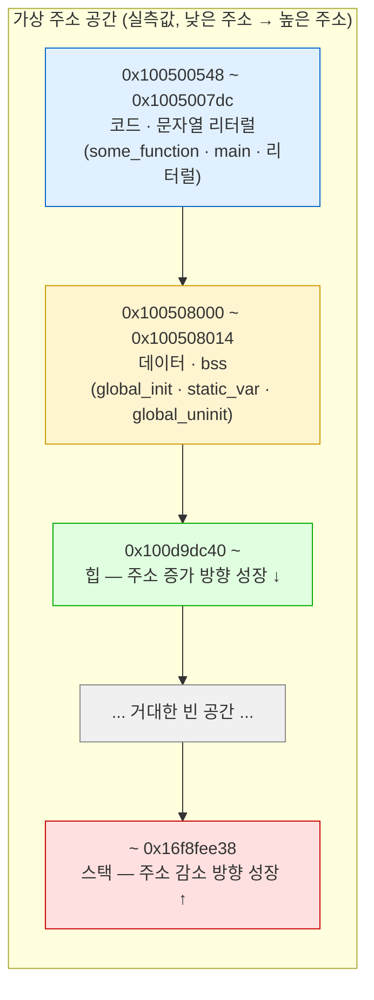

---
tags:
  - topic/os
  - ostep/virtualization
  - lang/c
  - project/ostep-03
  - address-space
  - virtual-memory
  - aslr
  - status/verified
aliases:
  - OSTEP 실습 3
  - 주소 공간 실습
created: 2026-08-19
updated: 2026-08-19
---

# 실습 3. 주소 공간 관찰 (ch13)

> 사용자 프로그램이 출력하는 모든 주소가 가상 주소임을 확인하고, 코드·데이터·힙·스택의 배치와 성장 방향을 실측

- 이론 — [[OS/ostep/docs/01-virtualization/13-address-spaces|13. 주소 공간 추상]]
- 원서 PDF — [13-Address-Spaces.pdf](../../pdfs/01-virtualization/13-Address-Spaces.pdf) (ASIDE "Every Address You See Is Virtual")
- 원서 공식 코드 — [ostep-code/vm-intro](https://github.com/remzi-arpacidusseau/ostep-code/tree/master/vm-intro)

## 목표

| 파일 | 내용 | 확인할 사실 |
|---|---|---|
| `va.c` | 원서 코드 그대로 — 코드·힙·스택 주소 출력 | 세 영역이 주소 공간의 서로 다른 위치에 놓임. 실행마다 값이 변함(ASLR) |
| `layout.c` | 확장판 — 세그먼트별 주소 + 성장 방향 실증 | 힙은 주소 증가 방향, **스택은 주소 감소 방향**으로 성장 |

## 빌드

```bash
make
```

- 옵션 없음. 기본 타깃 `all` → `va layout` 빌드

```text
gcc -Wall -Wextra -Wno-unused-parameter -g -o va va.c
gcc -Wall -Wextra -Wno-unused-parameter -g -o layout layout.c
```

- `-Wall` — 주요 경고 활성
- `-Wextra` — 추가 경고 활성
- `-Wno-unused-parameter` — 미사용 매개변수 경고만 비활성. 원서 코드의 `main(int argc, char *argv[])` 원형 보존 목적
- `-g` — 디버그 심볼 포함
- `-o <이름>` — 출력 실행 파일명 지정

## 1. `va.c` — 원서 코드

```bash
./va
```

- 옵션 없음

3회 반복 실행 (macOS arm64 실측).

```text
location of code : 0x1004d8460
location of heap : 0x5cc000000
location of stack: 0x16f9267ac
---
location of code : 0x100888460
location of heap : 0xcce000000
location of stack: 0x16f5767ac
---
location of code : 0x100dfc460
location of heap : 0x520000000
location of stack: 0x16f0027bc
```

원서(x86-64 Mac) 결과와 대조.

| 항목 | 원서 (x86-64 Mac) | 실측 (macOS arm64) | 차이 원인 |
|---|---|---|---|
| 코드 | `0x1095afe50` | `0x1004d8460` (실행마다 변동) | 둘 다 `0x1...` 대역. **ASLR** 로 실행마다 변동 |
| 힙 | `0x1096008c0` — **코드 바로 다음** | `0x5cc000000` — **완전히 다른 대역** | `malloc(100e6)` 은 100MB. 큰 요청은 할당자가 `mmap` 으로 처리해 힙 확장(`brk`) 영역이 아닌 별도 매핑에 배치 (확인 필요: macOS 할당자 임계값) |
| 스택 | `0x7fff691aea64` | `0x16f9267ac` | **아키텍처별 주소 공간 배치 차이**. x86-64 macOS 는 `0x7fff...`, arm64 macOS 는 `0x16f...` 대역 |

**관찰 포인트**

- **코드 → 힙 → 스택 순으로 주소가 커짐** — 이 순서 자체는 원서와 동일
- 세 값 모두 **가상 주소**. 물리 주소는 OS와 하드웨어만 알고 있음
- 실행마다 값이 변하는 것이 ASLR 의 증거 → [[OS/ostep/docs/00-intro/02-introduction|ch2 실측]] 의 `mem.c` 결과와 같은 원인

## 2. `layout.c` — 세그먼트별 배치와 성장 방향

```bash
./layout
```

- 옵션 없음

```text
=== 코드 (텍스트) ===
  main            : 0x1005005a8
  some_function   : 0x100500548
=== 읽기 전용 · 데이터 ===
  문자열 리터럴   : 0x1005007dc
  global_init     : 0x100508000
  static_var      : 0x100508010
  global_uninit   : 0x100508014  (값 0)
=== 힙 (아래로 = 주소 증가 방향으로 성장) ===
  malloc #1       : 0x100d9dc40
  malloc #2       : 0x100d9dc50  (차이 16 바이트)
=== 스택 (주소 감소 방향으로 성장) ===
  local1          : 0x16f8fe79c
  local2          : 0x16f8fe798  (차이 -4 바이트)
  argv            : 0x16f8fee38
=== 스택 성장 방향 (재귀 3단계) ===
  깊이 1 프레임    : 0x16f8fe738
  깊이 2 프레임    : 0x16f8fe708
  깊이 3 프레임    : 0x16f8fe6d8
```

### 실측 주소 공간 배치



**관찰 포인트**

| 관찰 | 실측 근거 |
|---|---|
| **코드가 가장 낮은 주소** | `some_function` `0x100500548` < `main` `0x1005005a8` — 둘 다 코드 세그먼트 |
| **문자열 리터럴이 코드 근처** | `0x1005007dc` — 코드와 같은 대역. macOS 는 `__TEXT` 세그먼트의 `__cstring` 섹션에 배치 |
| **데이터·bss 가 코드 다음** | `global_init` `0x100508000` → `static_var` `0x100508010` → `global_uninit` `0x100508014` — 인접 배치 |
| **미초기화 전역은 0** | `global_uninit` 값이 `0` — bss 는 0 으로 초기화됨. Java 의 필드 기본값과 동일 성질 |
| **힙이 데이터보다 높은 주소** | `0x100d9dc40` > `0x100508014` |
| **힙은 주소 증가 방향 성장** | `malloc #1` `0x100d9dc40` → `malloc #2` `0x100d9dc50`, **차이 +16 바이트** |
| **스택은 주소 감소 방향 성장** | 재귀 깊이 1 `0x16f8fe738` → 2 `0x16f8fe708` → 3 `0x16f8fe6d8`, **프레임당 -0x30(48) 바이트** |
| **힙과 스택 사이에 거대한 빈 공간** | 힙 `0x100d9dc40` 과 스택 `0x16f8fee38` 사이 약 **0x16E 대역 차이** — 양쪽이 서로를 향해 자랄 여유 |

- 원서 그림(ch13 Figure 13.3)의 "힙은 아래로, 스택은 위로 자란다"는 **그림의 위아래 방향** 기준. 주소 값 기준으로는 **힙은 증가, 스택은 감소**
- `local2` 가 `local1` 보다 4바이트 낮은 것은 컴파일러의 프레임 내 배치 결과 — **스택 성장 방향의 직접 증거는 재귀 프레임 비교**

## 함정

| 증상 | 원인 | 대응 |
|---|---|---|
| 실행마다 주소가 달라짐 | **ASLR**. macOS 는 커널이 강제하여 끌 수 없음 | 정상. 절대 주소값을 코드에 하드코딩하지 말 것 |
| 원서와 힙 주소 대역이 전혀 다름 | `malloc(100e6)` 은 100MB. 큰 요청은 `mmap` 경로로 별도 매핑 | `malloc(16)` 처럼 작은 요청으로 바꾸면 코드·데이터 근처 대역에 배치됨(`layout.c` 참조) |
| 원서와 스택 주소 대역이 다름 | x86-64 macOS 는 `0x7fff...`, arm64 macOS 는 `0x16f...` | 아키텍처별 주소 공간 배치 차이. 값 자체가 아니라 **상대 위치**를 볼 것 |
| `%p` 에 `main` 을 그대로 넘겨 경고 | 함수 포인터 → `void *` 변환은 표준상 보장되지 않음 | `(void *) main` 으로 명시 캐스팅 (`layout.c` 는 캐스팅함, `va.c` 는 원서 원형 유지) |
| `malloc` 반환값을 `free` 하지 않음 | `va.c` 는 원서 코드 그대로 — 프로그램 즉시 종료라 실무상 무해 | 프로세스 종료 시 OS가 주소 공간 전체 회수. 장기 실행 프로그램에서는 반드시 `free` |

## 확인 문제

1. `va.c` 의 `malloc(100e6)` 을 `malloc(16)` 으로 바꾸면 힙 주소가 어떻게 변하는가. 코드 주소와의 거리로 설명할 것
2. 재귀 프레임 간격이 48바이트인 이유는 무엇인가. `layout.c` 를 `-O2` 로 컴파일하면 간격이 어떻게 변하는가
3. `global_uninit` 을 `int global_uninit = 0;` 으로 명시 초기화하면 주소가 달라지는가. bss 와 data 세그먼트 배치로 설명할 것
4. 스택에 매우 큰 배열(`int big[10000000];`)을 지역 변수로 선언하면 무슨 일이 일어나는가. 실제로 시도해 결과를 기록할 것
5. `size -m ./layout` 명령으로 세그먼트별 크기를 확인하고, 위 실측 주소와 대응시켜 볼 것

## 관련 문서

- [[OS/ostep/docs/01-virtualization/13-address-spaces|13. 주소 공간 추상]] — 본 실습의 이론 배경
- [[OS/ostep/docs/00-intro/02-introduction|2. 운영체제 개요]] — `mem.c` 의 ASLR 관찰
- [[OS/ostep/projects/README|실습 프로젝트 인덱스]] — 전체 실습 커리큘럼
- [[C/docs/01-basics/c-program-execution-model|C 프로그램의 동작 및 컴파일 방식]] — 스택·힙·데이터 세그먼트 배치
- [[C/docs/02-memory/heap-and-free|힙과 free]] — `malloc` 이 힙을 확장하는 방식
