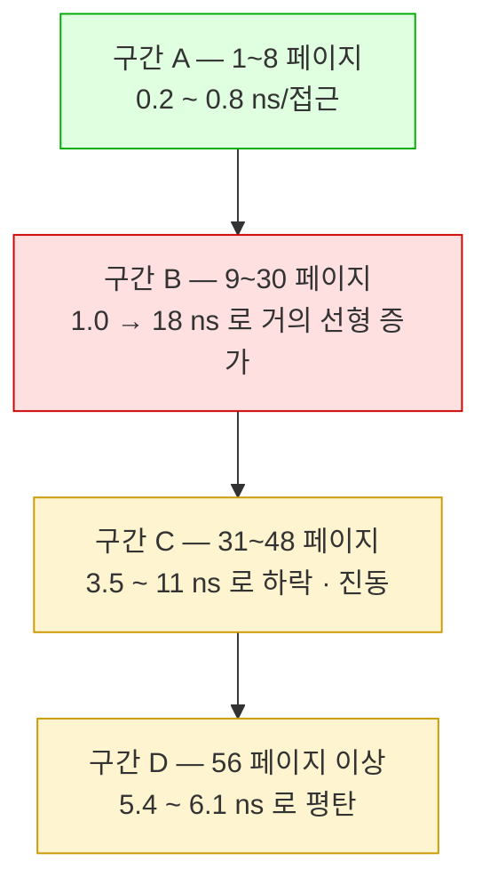

---
tags:
  - topic/os
  - ostep/virtualization
  - lang/c
  - project/ostep-06
  - tlb
  - locality
  - measurement
  - status/verified
aliases:
  - OSTEP 실습 6
  - TLB 측정 실습
created: 2026-08-19
updated: 2026-08-19
---

# 실습 6. TLB 크기·비용 측정 (ch19)

> 페이지 간격으로 배열을 훑어 TLB 용량 경계를 찾는 측정. 원서가 기대한 "깔끔한 계단"이 현대 하드웨어에서는 나타나지 않는 이유까지 확인

- 이론 — [[OS/ostep/docs/01-virtualization/19-tlb|19. TLB]]
- 원서 PDF — [19-Translation-Lookaside-Buffers.pdf](../../pdfs/01-virtualization/19-Translation-Lookaside-Buffers.pdf) (권말 Homework: Measurement)
- 방법의 출처 — Saavedra-Barrera 의 캐시 계층 측정 기법

## 원리


원서 숙제가 제시한 기본 루프.

```c
int jump = PAGESIZE / sizeof(int);
for (i = 0; i < NUMPAGES * jump; i += jump)
    a[i] += 1;
```

- 배열 `a` 의 **페이지당 정수 1개**를 갱신. `NUMPAGES` 로 만지는 페이지 수를 조절

## 측정 설계에서 통제한 것

| 변수 | 통제 방법 | 이유 |
|---|---|---|
| **페이지 크기** | `sysconf(_SC_PAGESIZE)` 로 실행 시점 조회 | 하드코딩하면 arm64(16KB)와 x86-64(4KB)에서 결과가 무의미해짐 |
| **컴파일러 최적화** | 배열을 `volatile int *` 로 선언 + `-O1` | `-O2` 이상은 접근 루프를 통째로 제거할 위험. `-O0` 은 루프 오버헤드가 측정을 지배 |
| **페이지 폴트** | 측정 전에 배열 전체를 한 번 훑음 | 측정 대상은 **TLB 미스**이지 페이지 폴트가 아님 |
| **총 접근 횟수** | 페이지 수와 무관하게 **4000만 회로 고정** (`trials = TOTAL / numpages`) | 페이지 수가 달라도 측정 시간이 비슷해져 비교 가능 |
| **시계** | `clock_gettime(CLOCK_MONOTONIC)` | `gettimeofday` 보다 정밀하고 시스템 시각 변경에 영향받지 않음 |

## 빌드 · 실행

```bash
make
./tlb
```

- `make` — 옵션 없음. `tlb` 빌드
- `./tlb` — 옵션 없음. 정밀 측정(8~64, 1씩) → 개괄 측정(1~8192, 2배씩) 순차 실행

```text
gcc -Wall -Wextra -Wno-unused-parameter -O1 -o tlb tlb.c
```

- `-Wall` — 주요 경고 활성
- `-Wextra` — 추가 경고 활성
- `-Wno-unused-parameter` — `main` 인자 미사용 경고 비활성
- `-O1` — **최적화 수준을 의도적으로 낮게** 유지. 상세는 위 표
- `-o tlb` — 출력 실행 파일명 지정

## 실측 결과 (macOS arm64, Apple M5)

```text
페이지 크기 = 16384 바이트, 정수 간격(jump) = 4096
```

- 페이지 크기가 **16KB** → 원서의 4KB 가정과 다름. `jump = 16384 / 4 = 4096`

### 개괄 측정 — 2배씩

```text
[개괄 측정] 1~8192 페이지, 2배씩 증가
 페이지 수   총 접근 횟수     총 시간(ms)    접근당(ns)
  --------    -----------     ----------    ---------
         1       40000000           32.9         0.82
         2       40000000           13.6         0.34
         4       40000000           11.6         0.29
         8       40000000           12.4         0.31
        16       40000000          294.4         7.36
        32       40000000          460.3        11.51
        64       40000000          242.4         6.06
       128       40000000          240.9         6.02
       256       40000000          221.2         5.53
       512       40000000          228.5         5.71
      1024       39999488          215.2         5.38
      2048       39999488          219.7         5.49
      4096       39997440          236.3         5.91
      8192       39993344          226.9         5.67
```

- **8 → 16 페이지에서 접근당 시간이 0.31 → 7.36 ns 로 약 24배 급증**
- 64 페이지 이후로는 **5.4~6.1 ns 로 평탄** — 더 늘려도 악화되지 않음

### 정밀 측정 — 1씩 (경계 탐색)

```text
[정밀 측정] 8~64 페이지, 1씩 증가
 페이지 수   접근당(ns)     2회차
  --------    ---------   -------
         8         0.53      0.37
         9         1.33      0.99
        10         1.60      1.56
        11         2.02      2.05
        12         2.68      2.67
        13         3.77      3.69
        14         4.65      4.55
        15         6.02      6.02
        16         7.29      7.18
        17         9.05      8.93
        18        10.88     10.86
        19        12.03     12.04
        20        15.11     15.02
        21        14.70     14.63
        22        13.82     13.84
        23        18.18     18.03
        24        17.00     16.76
        25        16.71     16.95
        26        14.48     14.14
        27        14.52     14.67
        28        17.08
        29        16.24
        30        15.18
        31         4.49
        32        10.90
        33         8.04
        ...
        42         4.71
        43         3.62
        44         3.48
        48         4.71
        56         5.38
        64         5.84
```

- **2회차 값이 1회차와 거의 동일** → 측정 노이즈가 아니라 **재현 가능한 하드웨어 특성**

## 해석



| 구간 | 관찰 | 해석 |
|---|---|---|
| **A (1~8)** | 접근당 **0.2~0.8 ns**. 3.5GHz 급 CPU 의 클럭 주기(약 0.29ns)와 같은 수준 | 접근당 1클럭 미만 — **비순차 실행(out-of-order)과 슈퍼스칼라로 여러 접근이 병렬 처리**된 결과. TLB·캐시 모두 히트 |
| **B (9~30)** | 페이지 1개 늘 때마다 **거의 선형으로 증가** | 원서가 기대한 "계단"이 아니라 **경사**. 병렬 처리 여력이 점차 소진되고 미스가 직렬화되는 과정으로 보임. **8~9 사이에 첫 경계**가 있음을 시사 |
| **C (31~48)** | **거꾸로 빨라짐** (18 → 3.5 ns) | 단순 TLB 용량으로 설명 불가. **하드웨어 프리페처**가 규칙적 스트라이드 패턴을 학습해 변환·데이터를 미리 가져오는 것으로 추정 (확인 필요: Apple Silicon 마이크로아키텍처 문서 비공개) |
| **D (56~8192)** | **5.4~6.1 ns 로 평탄**. 8192 페이지(128MB)까지 악화 없음 | 프리페처가 안정적으로 동작하는 정상 상태로 보임 |

### 원서가 기대한 결과와의 차이

| 항목 | 원서 기대 | 실측 |
|---|---|---|
| 그래프 형태 | TLB 용량에서 **급격한 계단 1개** | **경사 상승 → 정점 → 하락 → 평탄**의 복합 곡선 |
| 경계 판독 | 계단 위치 = TLB 항목 수 | 8~9 사이 첫 변화점은 보이나 **단일 값으로 특정 불가** |
| 큰 페이지 수 | 계속 느림 | **오히려 회복**되어 평탄 |

**차이의 원인 (추정, 확인 필요)**

1. **다단 TLB** — 현대 CPU는 L1 dTLB(작고 빠름)와 L2 TLB(크고 느림)를 둠. 단일 계단이 아니라 **두 개 이상의 완만한 전이**가 생김
2. **하드웨어 프리페처** — 페이지 단위 규칙적 스트라이드를 감지해 변환을 미리 채움. 원서가 이 기법을 전제하지 않음
3. **비순차 실행** — 여러 미스를 동시에 처리(memory-level parallelism)해 미스 비용이 감춰짐
4. **비대칭 코어** — 성능 코어 4개 + 효율 코어 6개. 스케줄러 이주에 따라 측정 대상 코어가 바뀔 수 있음

> [!tip] TIP: RAM 은 항상 RAM 이 아니다 (Culler의 법칙, 원서 19.7)
> **random-access memory** 라는 이름은 어느 부분이든 똑같이 빠르게 접근할 수 있다는 뜻을 함축. 그러나 TLB 같은 하드웨어·OS 기능 때문에 **특정 메모리 페이지 접근은 비쌀 수 있음** — 특히 그 페이지가 현재 TLB 에 매핑되어 있지 않으면.
> 접근하는 페이지 수가 **TLB 커버리지를 넘으면** 심각한 성능 저하로 이어질 수 있음.
> 실측의 **구간 A(0.3ns) vs 구간 B 끝(18ns) — 약 60배 차이**가 이 법칙의 직접 증거

## 함정

| 증상 | 원인 | 대응 |
|---|---|---|
| 모든 페이지 수에서 시간이 0 에 가까움 | 컴파일러가 접근 루프를 **제거** | 배열을 `volatile` 로 선언. `-O2` 이상 회피 |
| 첫 측정만 유독 느림 | **페이지 폴트**가 측정에 섞임 | 측정 전에 배열 전체를 한 번 훑어 폴트를 소진 (본 코드가 수행) |
| 페이지 수가 클 때 결과가 이상 | 접근 횟수가 페이지 수에 비례해 늘어 **측정 시간이 폭증** | `trials = TOTAL / numpages` 로 총 접근 횟수를 고정 |
| 값이 실행마다 크게 흔들림 | 백그라운드 부하, 코어 이주 | 여러 번 실행해 재현성 확인. 본 실측은 **2회차가 1회차와 거의 일치** |
| 원서처럼 깔끔한 계단이 안 나옴 | 다단 TLB · 프리페처 · 비순차 실행 | 정상. **그 차이 자체가 학습 대상** |
| `jump` 를 페이지 크기로 하드코딩 | 아키텍처별 페이지 크기 차이(4KB vs 16KB) | `sysconf(_SC_PAGESIZE)` 사용 |

## 확인 문제

1. `jump` 를 페이지 크기 대신 **캐시 라인 크기(128바이트)** 로 바꾸면 그래프가 어떻게 달라지는가. 무엇을 측정하게 되는가
2. 구간 A(1~8 페이지)의 접근당 시간이 CPU 클럭 주기보다 짧은 것이 어떻게 가능한가
3. 접근 순서를 **무작위로** 바꾸면(인덱스를 섞어 접근) 구간 C·D의 회복이 사라지는가. 프리페처 가설을 검증할 것
4. `TOTAL` 을 4억으로 늘리면 값이 안정되는가. 측정 시간과 정확도의 상충을 확인할 것
5. 원서는 CPU 친화성 고정(`sched_setaffinity`)을 권고. macOS 에는 대응 API 가 제약된다 — 코어 이주가 측정에 미치는 영향을 어떻게 줄일 수 있는가
6. 페이지 크기가 4KB 인 x86-64 리눅스에서 같은 코드를 실행하면 경계가 어디로 이동하는가. 예측하고 근거를 제시할 것

## 관련 문서

- [[OS/ostep/docs/01-virtualization/19-tlb|19. TLB]] — 본 실습의 이론 배경
- [[OS/ostep/docs/01-virtualization/18-introduction-to-paging|18. 페이징 도입]] — 페이지 크기·VPN·오프셋
- [[OS/ostep/docs/01-virtualization/10-multi-cpu-scheduling|10. 멀티프로세서 스케줄링]] — 캐시 친화성·Apple M5 캐시 구성 실측
- [[OS/ostep/projects/README|실습 프로젝트 인덱스]] — 전체 실습 커리큘럼
