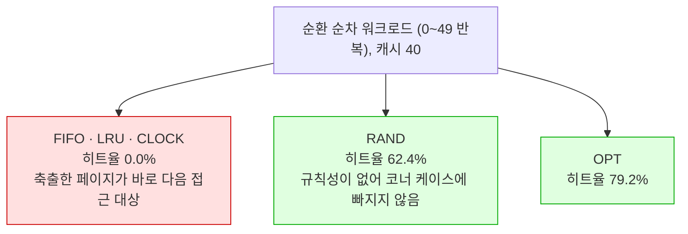

---
tags:
  - topic/os
  - ostep/virtualization
  - lang/c
  - project/ostep-07
  - page-replacement
  - lru
  - clock
  - belady
  - status/verified
aliases:
  - OSTEP 실습 7
  - 페이지 교체 시뮬레이터
created: 2026-08-19
updated: 2026-08-19
---

# 실습 7. 페이지 교체 정책 시뮬레이터 (ch22)

> OPT·FIFO·LRU·CLOCK·RAND 를 직접 구현해 원서 Figure 22.1~22.9 를 숫자로 재현하고, Belady 의 역설까지 검증

- 이론 — [[OS/ostep/docs/01-virtualization/22-swapping-policies|22. 스와핑 정책]]
- 원서 PDF — [22-Swapping-Policies.pdf](../../pdfs/01-virtualization/22-Swapping-Policies.pdf)

## 구현 정책

| 정책 | 축출 대상 | 필요한 상태 |
|---|---|---|
| **OPT** | **가장 먼 미래**에 접근될 페이지 (Belady MIN) | 미래 트레이스 전체 — 비현실적, 비교 기준용 |
| **FIFO** | 가장 먼저 **들어온** 페이지 | 진입 순서 |
| **LRU** | 가장 오래 전에 **접근된** 페이지 | 최근 접근 시각 (**히트 시에도 갱신**) |
| **CLOCK** | use 비트가 0 인 페이지 (시계 바늘로 순회하며 1을 0으로 지움) | 페이지당 use 비트 1개 |
| **RAND** | 무작위 | 없음 |

> [!tip] FIFO 와 LRU 를 가르는 단 한 줄
> ```c
> if (found >= 0) {
>     hits++;
>     /* LRU 만 히트 시 시각을 갱신한다.
>      * FIFO 는 '진입 순서' 이므로 히트해도 갱신하지 않는다 */
>     if (p == LRU) stamp[found] = ++clock_tick;
>     ...
> ```
> 이 조건을 빼면 FIFO 가 LRU 와 동일하게 동작한다. 구현 중 실제로 겪은 오류이며, 원서 Figure 22.2 와 대조해 발견

## 빌드 · 실행

```bash
make
./replace
```

- `make` — 옵션 없음. `replace` 빌드
- `./replace` — 옵션 없음. 예제 트레이스 → Belady 역설 → 워크로드 3종 순차 실행

```text
gcc -Wall -Wextra -Wno-unused-parameter -O2 -g -o replace replace.c
```

- `-Wall` — 주요 경고 활성
- `-Wextra` — 추가 경고 활성
- `-Wno-unused-parameter` — `main` 인자 미사용 경고 비활성
- `-O2` — 최적화. 시뮬레이션이 1만 참조 × 캐시 크기 11종 × 정책 5종이므로 속도 확보 목적
- `-g` — 디버그 심볼 포함

> [!note] 재현성 확보
> 무작위 정책과 워크로드 생성에 **선형 합동 생성기를 직접 구현**하고 시드를 고정. 정책 간 비교 시 매번 같은 시드로 초기화하므로 **실행마다 동일한 결과**가 나옴

## 1. 원서 예제 트레이스 재현 (캐시 3)

```text
트레이스: 0, 1, 2, 0, 1, 3, 0, 3, 1, 2, 1
고유 페이지 4개 → 강제 미스 4회
```

### OPT (원서 Figure 22.1)

```text
  Access  Hit/Miss? Evict  Cache State
  0       Miss             0
  1       Miss             0, 1
  2       Miss             0, 1, 2
  0       Hit              0, 1, 2
  1       Hit              0, 1, 2
  3       Miss      2      0, 1, 3
  0       Hit              0, 1, 3
  3       Hit              0, 1, 3
  1       Hit              0, 1, 3
  2       Miss      0      1, 2, 3
  1       Hit              1, 2, 3
  히트 6 / 미스 5 → 히트율 54.5%  (강제 미스 제외 시 85.7%)
```

### FIFO (원서 Figure 22.2)

```text
  Access  Hit/Miss? Evict  Cache State
  0       Miss             0
  1       Miss             0, 1
  2       Miss             0, 1, 2
  0       Hit              0, 1, 2
  1       Hit              0, 1, 2
  3       Miss      0      1, 2, 3
  0       Miss      1      0, 2, 3
  3       Hit              0, 2, 3
  1       Miss      2      0, 1, 3
  2       Miss      3      0, 1, 2
  1       Hit              0, 1, 2
  히트 4 / 미스 7 → 히트율 36.4%  (강제 미스 제외 시 57.1%)
```

### LRU (원서 Figure 22.5)

```text
  히트 6 / 미스 5 → 히트율 54.5%  (강제 미스 제외 시 85.7%)
```

### 원서 값과의 대조

| 정책 | 원서 히트율 | 원서(강제 미스 제외) | **실측** | 일치 |
|---|---|---|---|---|
| OPT | 54.5% | 85.7% | **54.5% / 85.7%** | ✓ |
| FIFO | 36.4% | 57.1% | **36.4% / 57.1%** | ✓ |
| LRU | (OPT 와 동일) | — | **54.5% / 85.7%** | ✓ |
| CLOCK | (원서 예제 없음) | — | 36.4% / 57.1% | — |

- **FIFO 축출 순서도 원서와 동일** — 0, 1, 2, 3
- LRU 가 OPT 와 같은 성능을 내는 것도 원서 서술과 일치 (원서 각주 — "OK, we cooked the results")

## 2. Belady 의 역설 검증

```text
===== 1-B. Belady 의 역설 (FIFO, 캐시 3 vs 4) =====
트레이스: 1, 2, 3, 4, 1, 2, 5, 1, 2, 3, 4, 5
    캐시     정책     히트   히트율
       3     FIFO        3    25.0%
       3      LRU        2    16.7%
       4     FIFO        2    16.7%
       4      LRU        4    33.3%
```

| 정책 | 캐시 3 | 캐시 4 | 변화 |
|---|---|---|---|
| **FIFO** | 25.0% | **16.7%** | **하락** ← 역설 |
| **LRU** | 16.7% | **33.3%** | 상승 (정상) |

- **캐시를 늘렸는데 FIFO 의 히트율이 떨어짐** → 원서 ASIDE 의 Belady 의 역설을 실증
- **LRU 는 역설이 없음** — **스택 속성(stack property)** 때문. 크기 `N+1` 캐시가 크기 `N` 캐시의 내용을 자연히 포함하므로, 캐시를 늘리면 히트율이 **같거나 개선**
- FIFO 와 RAND 는 스택 속성을 지키지 않아 이상 동작에 취약

## 3. 워크로드 3종 (원서 Figure 22.6~22.9 재현)

각 워크로드는 **참조 1만 회**. 캐시 크기를 1~100 으로 변화.

### 3-1. 지역성 없음 — 원서 Figure 22.6

```text
    캐시      OPT     FIFO      LRU    CLOCK     RAND
   -----  -------  -------  -------  -------  -------
       1     0.9%     0.9%     0.9%     0.9%     0.9%
       2     9.2%     1.9%     1.9%     1.9%     1.9%
       5    22.3%     5.2%     5.2%     5.2%     5.0%
      10    34.9%    10.3%    10.2%    10.2%     9.7%
      20    51.3%    19.5%    19.7%    19.6%    19.4%
      30    62.7%    29.1%    29.1%    29.3%    28.8%
      40    71.5%    39.4%    38.9%    39.1%    39.4%
      50    78.5%    49.6%    49.5%    49.0%    49.0%
      60    84.3%    59.9%    59.4%    59.1%    59.1%
      80    93.2%    78.9%    78.7%    78.7%    79.4%
     100    99.0%    99.0%    99.0%    99.0%    99.0%
```

**원서 결론 3개가 모두 재현됨**

1. **지역성이 없으면 어떤 현실적 정책을 쓰든 큰 차이가 없음** — FIFO·LRU·CLOCK·RAND 가 모든 캐시 크기에서 **거의 동일**. 히트율이 **캐시 크기로만 결정**됨 (캐시 20 → 약 19.5%, 캐시 50 → 약 49.5%)
2. **캐시가 전체 워크로드를 담을 만큼 크면 정책이 무관** — 캐시 100 에서 전부 **99.0%** 로 수렴
3. **OPT 가 뚜렷하게 우수** — 캐시 20 에서 51.3% vs 약 19.5%. 미래를 볼 수 있으면 훨씬 잘함

### 3-2. 80-20 워크로드 — 원서 Figure 22.7·22.9

```text
    캐시      OPT     FIFO      LRU    CLOCK     RAND
   -----  -------  -------  -------  -------  -------
       1     3.1%     3.1%     3.1%     3.1%     3.1%
       2    18.0%     6.3%     6.4%     6.3%     6.4%
       5    40.1%    15.3%    15.8%    15.6%    15.6%
      10    60.0%    29.8%    30.8%    30.3%    29.4%
      20    80.3%    52.3%    57.7%    55.5%    51.6%
      30    87.8%    66.4%    76.5%    73.0%    66.3%
      40    91.3%    75.3%    84.4%    82.5%    75.9%
      50    93.6%    81.3%    87.5%    87.1%    81.7%
      60    95.3%    86.2%    89.9%    89.9%    85.7%
      80    97.7%    92.8%    94.7%    94.3%    93.1%
     100    99.0%    99.0%    99.0%    99.0%    99.0%
```

**원서 결론 재현**

- **LRU 가 FIFO·RAND 보다 뚜렷하게 우수** — 캐시 30 에서 **LRU 76.5% vs FIFO 66.4% vs RAND 66.3%** (약 10%p 차이). LRU 가 **hot 페이지를 붙들고 있기** 때문
- **CLOCK 이 LRU 와 FIFO 사이** — 캐시 30 에서 **73.0%**. 원서 Figure 22.9 의 "완전한 LRU 만큼은 아니나 역사를 전혀 고려하지 않는 방식보다는 낫다"를 정확히 재현
- **OPT 가 여전히 우수** — 캐시 30 에서 87.8% → LRU 의 역사 정보가 완벽하지 않음을 보임

### 3-3. 순환 순차 워크로드 — 원서 Figure 22.8

```text
    캐시      OPT     FIFO      LRU    CLOCK     RAND
   -----  -------  -------  -------  -------  -------
       1     0.0%     0.0%     0.0%     0.0%     0.0%
       2     2.0%     0.0%     0.0%     0.0%     0.0%
       5     8.2%     0.0%     0.0%     0.0%     0.0%
      10    18.3%     0.0%     0.0%     0.0%     0.6%
      20    38.6%     0.0%     0.0%     0.0%    10.1%
      30    58.9%     0.0%     0.0%     0.0%    32.0%
      40    79.2%     0.0%     0.0%     0.0%    62.4%
      50    99.5%    99.5%    99.5%    99.5%    99.5%
      60    99.5%    99.5%    99.5%    99.5%    99.5%
```

**원서의 가장 극적인 결론이 그대로 재현됨**

- **FIFO·LRU·CLOCK 이 캐시 49 까지 정확히 0%** — 50페이지를 순환하므로, 이 정책들이 축출하는 "오래된" 페이지가 **바로 다음에 접근될 페이지**. 원서 문장 — "even with a cache of size 49, a looping-sequential workload of 50 pages results in a 0% hit rate"
- **RAND 는 0 이 아님** — 캐시 40 에서 **62.4%**. 원서 문장 — "Random fares notably better, not quite approaching optimal, but at least achieving a non-zero hit rate"
  - 근거 — 무작위는 **이상한 코너 케이스 동작이 없음**
- 캐시 50 에서 전부 99.5% 로 급등 — 워킹셋 전체가 들어가는 순간



## 함정

| 증상 | 원인 | 대응 |
|---|---|---|
| FIFO 가 LRU 와 같은 결과 | **히트 시에도 진입 시각을 갱신**함 | `if (p == LRU)` 로 LRU 만 갱신. 실제로 겪은 오류 |
| 강제 미스 제외 히트율이 원서와 다름 | 강제 미스를 **캐시 크기**로 계산 | 강제 미스 = **고유 페이지 수**. 각 페이지의 첫 접근은 피할 수 없음 |
| RAND 결과가 실행마다 다름 | 시스템 난수 사용 | 시드 고정 LCG 를 직접 구현. 정책 비교 시 매번 같은 시드로 초기화 |
| OPT 가 느림 | 매 축출마다 **미래 전체를 스캔** — O(n·csize) | 시뮬레이터에서는 허용. 실제 OS 에서 구현 불가한 이유이기도 함 |
| CLOCK 이 무한 루프 | 모든 use 비트가 1 일 때 종료 조건 부재 | 순회 중 1 을 **0 으로 지우므로** 최대 한 바퀴에 반드시 0 을 만남 |
| 순환 워크로드에서 LRU 가 0% | 정상 — LRU 의 최악 사례 | 원서 Figure 22.8 과 동일. **좋은 정책도 워크로드에 따라 최악이 됨** |

## 확인 문제

1. `LFU`(least-frequently-used)를 추가 구현하고 80-20 워크로드에서 LRU 와 비교할 것. 어느 쪽이 나은가
2. 순환 순차 워크로드의 주기를 50 이 아니라 **51** 로 바꾸면 캐시 50 에서 LRU 히트율이 어떻게 되는가. 예측하고 확인할 것
3. CLOCK 의 use 비트를 2비트로 확장(접근 시 3 으로 설정, 순회마다 1 감소)하면 80-20 에서 LRU 에 더 가까워지는가
4. 더티 비트를 추가해 **깨끗한 페이지를 우선 축출**하도록 CLOCK 을 확장할 것. 쓰기 비용을 미스 비용의 2배로 두면 총비용이 개선되는가
5. Belady 의 역설이 **LRU 에서는 왜 불가능**한지 스택 속성으로 증명할 것
6. AMAT 를 계산하는 코드를 추가할 것 — `T_M = 100ns`, `T_D = 10ms` 가정. 80-20 워크로드 캐시 30 에서 LRU 와 FIFO 의 AMAT 차이는 얼마인가

## 관련 문서

- [[OS/ostep/docs/01-virtualization/22-swapping-policies|22. 스와핑 정책]] — 본 실습의 이론 배경
- [[OS/ostep/docs/01-virtualization/21-swapping-mechanisms|21. 스와핑 기법]] — 교체가 필요해지는 구조
- [[OS/ostep/docs/01-virtualization/19-tlb|19. TLB]] — 같은 캐시 원리가 적용되는 다른 계층
- [[OS/ostep/projects/README|실습 프로젝트 인덱스]] — 전체 실습 커리큘럼
