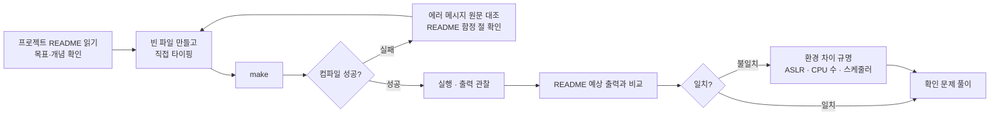

---
tags:
  - topic/os
  - ostep/index
  - lang/c
  - moc
aliases:
  - OSTEP 실습 인덱스
created: 2026-08-19
updated: 2026-08-19
---

# 실습 프로젝트 인덱스

> 원서 등장 C 코드를 직접 작성·컴파일·실행하는 실습 세트. 이론 문서와 챕터 단위로 대응

> [!tip] TIP: 실제 코드로 배울 것 (원서 서문)
> 원서는 의사 코드가 아닌 **실제 C 코드** 사용. "Running real code on real systems is the best way to learn about operating systems" → 읽지 말고 타이핑할 것

## 진행 방식

- 각 프로젝트 `README.md` 에 **목표 → 작성 순서 → 컴파일 → 예상 출력 → 함정 → 확인 문제** 순 배치
- 소스는 완성 형태로 제공하되 **줄 단위 주석**으로 각 호출의 의미 명시. 먼저 직접 작성하고 막힐 때 대조하는 용도
- 실행 결과는 macOS arm64 실측값. Linux·책과 다른 지점은 함정 절에 명시

## 파트 0 — 서론

| 프로젝트 | 대응 챕터 | 상태 | 다루는 것 |
|---|---|---|---|
| [01-intro-four-pieces](01-intro-four-pieces/) | 2 | 완료 | CPU·메모리 가상화, 스레드 경쟁 조건, 영속성 — 4개 프로그램으로 책 전체 축약 |

## 파트 1 — 가상화

| 프로젝트 | 대응 챕터 | 상태 | 다루는 것 |
|---|---|---|---|
| [02-process-api](02-process-api/) | 5 | 완료 | `fork` · `wait` · `exec` · 출력 리다이렉션, `fork` 버퍼 복제 함정 |
| `03-address-space` | 13 | 예정 | 코드·스택·힙 주소 출력, 주소 공간 배치 관찰 |
| `04-memory-api` | 14 | 예정 | 메모리 오류 6종 재현, ASan·`leaks` 검출 |
| `05-free-space` | 17 | 예정 | 프리 리스트 기반 할당기 직접 구현 |
| `06-tlb-measure` | 19 | 예정 | 스트라이드 접근으로 TLB 미스 비용 측정 |
| `07-page-replacement` | 22 | 예정 | FIFO·LRU·클럭 교체 정책 시뮬레이터 |

## 파트 2 — 병행성

| 프로젝트 | 대응 챕터 | 상태 | 다루는 것 |
|---|---|---|---|
| `08-threads-intro` | 26 | 예정 | 경쟁 조건 재현, 디스어셈블로 원자성 부재 확인 |
| `09-thread-api` | 27 | 예정 | 인자 전달·반환값 수령의 스택 수명 함정 |
| `10-locks` | 28 | 예정 | TAS·CAS·티켓락 직접 구현, 공정성 비교 |
| `11-locked-data-structures` | 29 | 예정 | 병행 카운터·리스트·큐, 확장성 측정 |
| `12-condition-variables` | 30 | 예정 | `join` 구현, 생산자·소비자 유한 버퍼 |
| `13-semaphores` | 31 | 예정 | 세마포어 자작(zemaphore), 독자·기록자, 철학자 |
| `14-concurrency-bugs` | 32 | 예정 | 원자성·순서 위반, 교착 상태 재현·해소 |
| `15-event-based` | 33 | 예정 | `select` 기반 단일 스레드 에코 서버 |

## 파트 3 — 영속성

| 프로젝트 | 대응 챕터 | 상태 | 다루는 것 |
|---|---|---|---|
| `16-files-and-directories` | 39 | 예정 | `open`/`read`/`write`, 링크, 미니 `ls`·`cat` |
| `17-file-system-sim` | 40 | 예정 | inode·비트맵 기반 파일 시스템 시뮬레이터 |
| `18-distributed` | 47 | 예정 | UDP 소켓 client·server, 재전송 처리 |

## 공용 규약

- 빌드 — 각 디렉토리 `Makefile`. `make` 로 전체 빌드, `make clean` 으로 산출물 제거
- 컴파일 옵션 기본값 — `-Wall -Wextra -Wno-unused-parameter -g`. `-Wno-unused-parameter` 는 원서 코드의 `main(int argc, char *argv[])` 원형을 보존하기 위한 것
- 산출물(실행 파일·`*.o`)은 git 추적 제외
- 원서 공식 코드 저장소 — [ostep-code](https://github.com/remzi-arpacidusseau/ostep-code). 본 실습은 이를 기준으로 주석·설명·검증 출력을 덧붙인 것

## 관련 문서

- [[OS/ostep/README|OSTEP 학습 진입점]] — 전체 구성·측정 환경
- [[OS/ostep/docs/README|이론 문서 인덱스]] — 각 실습의 이론 배경
- [[C/docs/README|C 학습 문서 인덱스]] — 포인터·메모리·빌드 등 전제 지식
