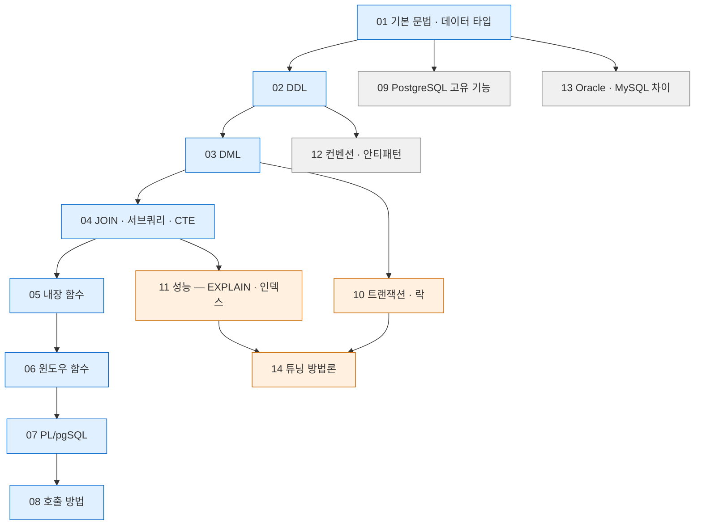

# PostgreSQL 문법 총정리

> PostgreSQL SQL 작성 문법·규칙 정리 인덱스. 기준 버전 — PostgreSQL 16/17 (버전 의존 기능은 각 문서에 명시)

## 학습 순서



- 파란 계열 — 문법 본류. 순서대로 읽는 경로
- 주황 계열 — 동시성·성능. 문법 습득 후 진입
- 회색 계열 — 참조용. 필요 시점에 개별 열람

## 전체 문서

| 문서 | 내용 |
|---|---|
| [[PostgreSQL/01-BASICS\|01. 기본 문법과 데이터 타입]] | 식별자·리터럴·주석·캐스팅·대소문자 규칙, 데이터 타입, NULL 처리, `search_path` |
| [[PostgreSQL/02-DDL\|02. DDL — 테이블, 제약조건, 인덱스]] | CREATE/ALTER/DROP, 제약조건, 인덱스, 시퀀스, VIEW, 파티셔닝, 권한 |
| [[PostgreSQL/03-DML\|03. DML — SELECT / INSERT / UPDATE / DELETE / MERGE]] | SELECT 실행 순서, `DISTINCT ON`, GROUP BY 확장, UPSERT, MERGE, RETURNING, 행 잠금 |
| [[PostgreSQL/04-JOIN-SUBQUERY\|04. JOIN, 서브쿼리, CTE]] | JOIN 종류, LATERAL, 서브쿼리, CTE·재귀 CTE, 조인 알고리즘·순서 제어 |
| [[PostgreSQL/05-FUNCTIONS\|05. 내장 함수]] | 문자열·숫자·날짜/시간·조건 표현식·집계·집합 반환·시스템 정보 함수 |
| [[PostgreSQL/06-WINDOW\|06. 윈도우 함수]] | `OVER` 절 기본 구조, 순위·값 접근 함수, 프레임 절, WINDOW 절 재사용 |
| [[PostgreSQL/07-PLPGSQL\|07. FUNCTION / PROCEDURE 작성 (PL/pgSQL)]] | FUNCTION vs PROCEDURE, volatility, 파라미터·반환 타입, 제어문, 예외 처리, 동적 SQL, 커서, 트리거 |
| [[PostgreSQL/08-CALLING\|08. 프로시저 / 함수 호출 방법]] | `SELECT` vs `CALL` 구분, 집합 반환·OUT 파라미터 호출, 애플리케이션 호출, `refcursor`, 호출 에러 |
| [[PostgreSQL/09-POSTGRES-ONLY\|09. PostgreSQL 고유 기능]] | 배열, JSON/JSONB, 범위 타입, 사용자 정의 타입, 확장, 전문 검색, LISTEN/NOTIFY, COPY |
| [[PostgreSQL/10-TRANSACTION\|10. 트랜잭션, 격리 수준, 락]] | BEGIN/COMMIT, SAVEPOINT, 격리 수준 4종, 락 종류, MVCC와 VACUUM, 타임아웃, 2단계 커밋 |
| [[PostgreSQL/11-PERFORMANCE\|11. 성능 — EXPLAIN, 인덱스 전략, 통계]] | EXPLAIN 읽기, 인덱스 미사용 원인, 인덱스 설계 원칙, 통계와 플래너, `pg_stat_statements` |
| [[PostgreSQL/12-CONVENTIONS\|12. 코딩 컨벤션과 안티패턴]] | 네이밍·포맷팅 규칙, 안티패턴, 마이그레이션 안전 수칙, 스키마 설계 기본형, 리뷰 체크리스트 |
| [[PostgreSQL/13-ORACLE-MYSQL-DIFF\|13. Oracle / MySQL 대비 차이점]] | 식별자 대소문자, 문법 대응표, 계층 쿼리 변환, 함수·타입 대응, 트랜잭션 동작 차이, 이관 체크리스트 |
| [[PostgreSQL/14-TUNING\|14. DB 튜닝 방법론]] | 튜닝 순서, 측정 → 쿼리/인덱스 → 스키마 → 서버 파라미터, VACUUM·통계 유지보수, 대량 작업 |

## 11 vs 14 구분

- **[[PostgreSQL/11-PERFORMANCE|11-PERFORMANCE]]** — 쿼리 하나를 어떻게 빠르게 만드는가. EXPLAIN 읽기, 인덱스 문법
- **[[PostgreSQL/14-TUNING|14-TUNING]]** — 시스템 전체를 어디부터 손대는가. 진단 절차, 서버 파라미터, 유지보수

## 주제별 빠른 참조

| 알고 싶은 것                     | 문서                                                             |
| --------------------------- | -------------------------------------------------------------- |
| 따옴표 없는 식별자가 소문자로 바뀌는 이유     | [[PostgreSQL/01-BASICS\|01. 기본 문법과 데이터 타입]]                    |
| 테이블·인덱스·시퀀스 생성 문법           | [[PostgreSQL/02-DDL\|02. DDL]]                                 |
| UPSERT (`ON CONFLICT`) 작성법  | [[PostgreSQL/03-DML\|03. DML]]                                 |
| 재귀 CTE로 계층 데이터 조회           | [[PostgreSQL/04-JOIN-SUBQUERY\|04. JOIN, 서브쿼리, CTE]]           |
| 날짜 계산·문자열 가공 함수             | [[PostgreSQL/05-FUNCTIONS\|05. 내장 함수]]                         |
| 그룹별 순위·직전 행 값 구하기           | [[PostgreSQL/06-WINDOW\|06. 윈도우 함수]]                           |
| 저장 프로시저 작성·예외 처리            | [[PostgreSQL/07-PLPGSQL\|07. PL/pgSQL]]                        |
| `SELECT`로 호출할지 `CALL`로 호출할지 | [[PostgreSQL/08-CALLING\|08. 호출 방법]]                           |
| JSONB·배열 다루기                | [[PostgreSQL/09-POSTGRES-ONLY\|09. PostgreSQL 고유 기능]]          |
| 격리 수준 선택·락 경합               | [[PostgreSQL/10-TRANSACTION\|10. 트랜잭션, 격리 수준, 락]]              |
| 인덱스를 만들었는데 안 타는 경우          | [[PostgreSQL/11-PERFORMANCE\|11. 성능]]                          |
| 네이밍 규칙·마이그레이션 안전 수칙         | [[PostgreSQL/12-CONVENTIONS\|12. 코딩 컨벤션과 안티패턴]]                |
| Oracle 쿼리를 PostgreSQL로 이관   | [[PostgreSQL/13-ORACLE-MYSQL-DIFF\|13. Oracle / MySQL 대비 차이점]] |
| 느린 DB를 어디부터 손댈지             | [[PostgreSQL/14-TUNING\|14. DB 튜닝 방법론]]                        |

## 빠른 확인 쿼리

```sql
-- 버전 확인
SELECT version();
SHOW server_version;

-- 현재 접속 정보
SELECT current_database(), current_user, current_schema();

-- 검색 경로
SHOW search_path;
```

## 관련 문서

- [[PostgreSQL/01-BASICS|01. 기본 문법과 데이터 타입]] — 학습 시작 지점
- [[PostgreSQL/14-TUNING|14. DB 튜닝 방법론]] — 운영 단계 진입 시 참조
