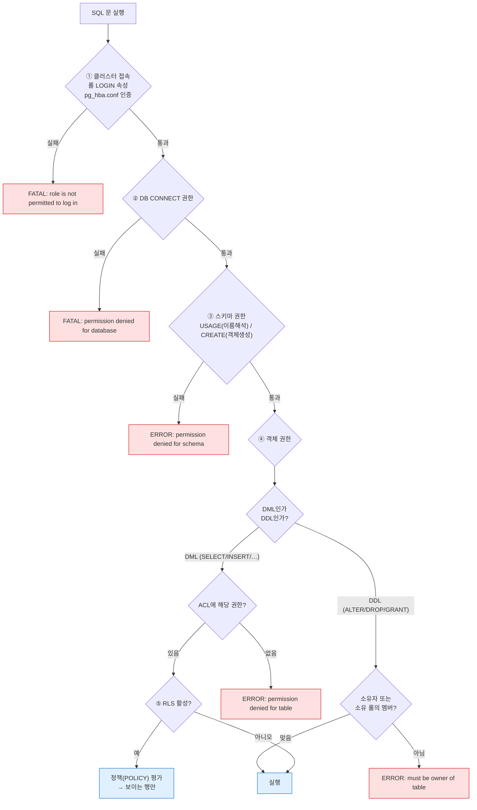
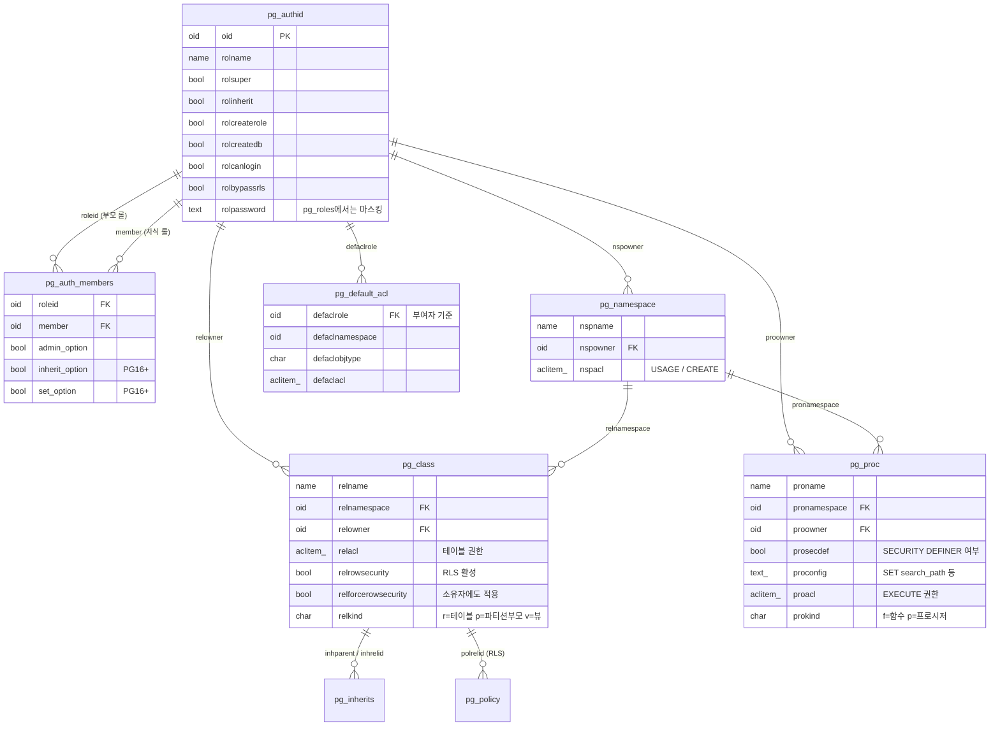
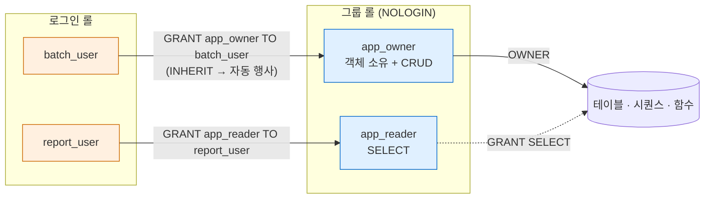
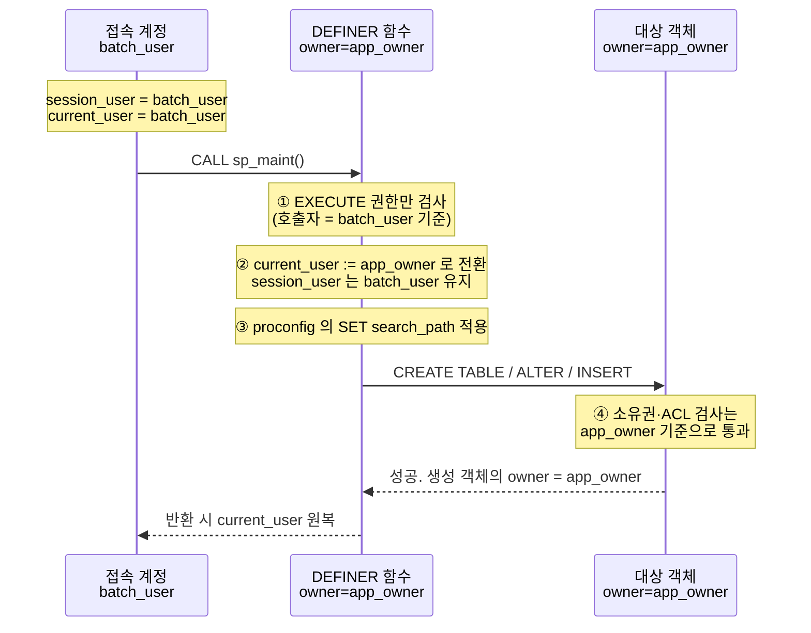
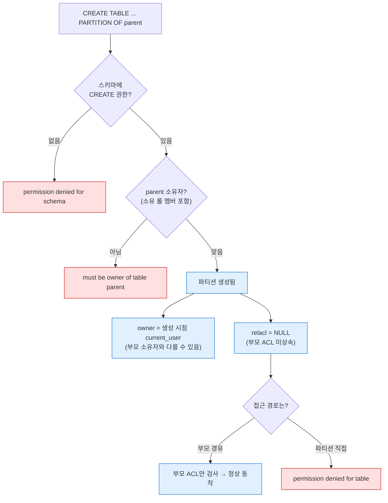
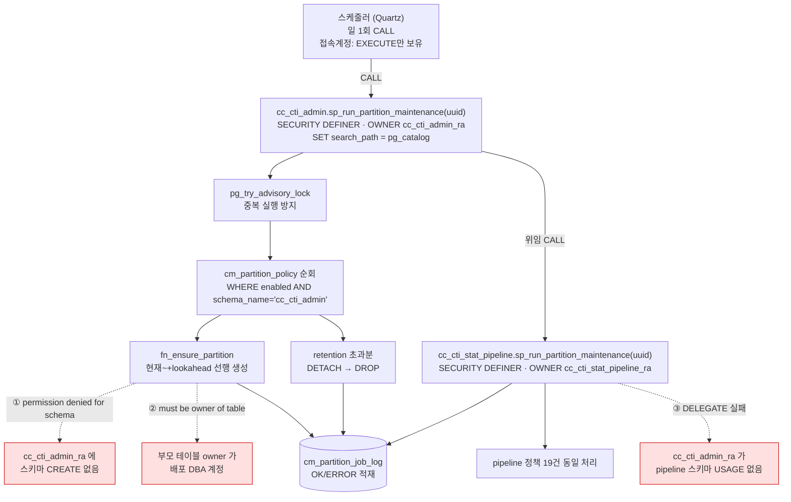
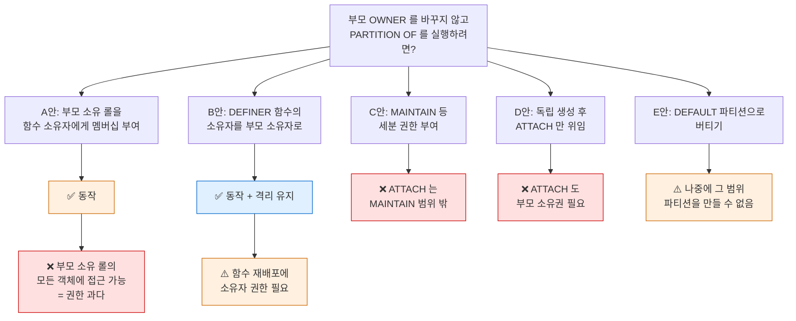

> **인덱스** [[PostgreSQL/00-INDEX|PostgreSQL 문법 총정리]]  ·  **이전** [[PostgreSQL/14-TUNING|14. DB 튜닝 방법론]]

# 15. 권한 체계 — Role, Owner, GRANT, SECURITY DEFINER

PostgreSQL 권한(Authority) 체계 단독 완결 정리. 이 문서 하나로 롤·소유권·ACL·
GRANT·SECURITY DEFINER·RLS·시스템 카탈로그까지 훑고, 최종적으로
`CREATE TABLE ... PARTITION OF`를 실행하는 파티션 유지관리 프로시저에
어떤 권한과 세팅이 필요한지에 도달한다.

핵심 동작은 로컬 PostgreSQL 18.4 임시 클러스터에서 전부 실증했다 (§10).
버전 의존 동작은 각 절에 명시.

## 0. 전체 지도

권한 검사는 **독립된 관문 4개**를 순서대로 통과하는 구조다. 어느 관문에서
막혔는지에 따라 에러 문구가 다르고, 처방도 완전히 달라진다.



이 문서에서 가장 중요한 구분은 **③ 스키마 권한**과 **④ 객체 권한**,
그리고 ④ 안에서 **ACL(GRANT로 주고받는 것)** 과 **소유권(GRANT로 못 주는 것)** 의
분리다. 실무 장애의 대부분이 이 셋을 뭉뚱그린 데서 나온다.

| 층위 | 통제 수단 | 에러 문구 | GRANT로 해결되나 |
|---|---|---|---|
| 스키마 | `GRANT USAGE / CREATE ON SCHEMA` | `permission denied for schema` | ✅ |
| 객체 DML | `GRANT SELECT/INSERT/…` | `permission denied for table` | ✅ |
| 객체 DDL | 소유권 이전 또는 멤버십 | `must be owner of table` | ❌ `ALTER ... OWNER TO` 필요 |
| 행 | `CREATE POLICY` (RLS) | 에러 없이 **행이 안 보임** | ❌ 정책 설계 문제 |

## 1. 용어와 기본 모델

| 용어 | 정의 | 비고 |
|---|---|---|
| **Role** | 권한의 주체. 8.1부터 user/group이 롤로 통합 | `CREATE USER` = `CREATE ROLE ... LOGIN` 별칭 |
| **Owner** | 객체를 소유한 롤. 객체당 정확히 1개 | GRANT로 못 주고 `ALTER ... OWNER TO`로만 이전 |
| **Privilege** | GRANT/REVOKE로 주고받는 개별 권한 (SELECT, USAGE…) | 소유권과 별개 층위 |
| **ACL** | 객체별 권한 목록 (`pg_class.relacl` 등) | `grantee=권한문자/grantor` 형식 |
| **PUBLIC** | 모든 롤을 뜻하는 의사 롤 | 함수 EXECUTE, DB CONNECT는 기본 부여됨 |
| **멤버십** | `GRANT 롤A TO 롤B` — B가 A의 권한을 물려받는 관계 | 그룹 개념의 구현 방식 |
| **RLS** | Row Level Security. 행 단위 가시성 통제 | ACL 통과 후에 적용되는 별도 층 |

### ACL 표기법 읽기

```
{o1=arwdDxtm/o1, u1=ar/o1}
 └┬┘ └───┬───┘ └┬┘
  │      │      └─ grantor: 이 권한을 부여한 롤
  │      └──────── 권한 문자열
  └─────────────── grantee: 권한을 받은 롤 (비어 있으면 PUBLIC)
```

권한 문자 (테이블 기준):

```
a = INSERT (append)      r = SELECT (read)       w = UPDATE (write)
d = DELETE               D = TRUNCATE            x = REFERENCES
t = TRIGGER              m = MAINTAIN (PG17+)    * = 앞 권한에 GRANT OPTION

-- 기타 객체
U = USAGE (스키마·시퀀스·타입)   C = CREATE (스키마·DB·테이블스페이스)
c = CONNECT (DB)                T = TEMPORARY (DB)      X = EXECUTE (함수)
```

**`relacl`이 NULL이면 "권한 없음"이 아니라 "기본 상태"** — 소유자 전권만 있고
누구에게도 부여하지 않은 상태다 (실증 V1). GRANT를 한 번이라도 하는 순간
소유자 자신의 권한까지 명시적으로 기록된다.

```sql
-- GRANT 전:  relacl = NULL
-- GRANT SELECT, INSERT ON sc.t TO u1;  실행 후:
--   relacl = {o1=arwdDxtm/o1, u1=ar/o1}
SELECT relname, relacl FROM pg_class WHERE relname = 'orders';
```

### PostgreSQL만의 특징

- **롤은 클러스터 전역, 소유권·ACL은 DB별.** 롤 하나가 모든 DB에 걸쳐 존재하지만
  무엇을 소유하는지는 DB마다 다르다. Oracle의 "스키마 = 유저"와 달리
  **스키마와 롤이 완전히 분리된 별개 개념** — 스키마 `app`의 소유자가 롤 `app`일
  이유가 전혀 없고, 실무 장애는 대개 이 둘을 같다고 가정한 데서 시작된다.
- **`session_user` vs `current_user`.** `session_user`는 접속 계정으로 고정,
  `current_user`는 `SET ROLE`·SECURITY DEFINER에 따라 바뀐다. 권한 검사는
  전부 `current_user` 기준.
- **`SET ROLE` vs `SET SESSION AUTHORIZATION`.** 전자는 멤버십이 있는 롤로 전환
  (누구나), 후자는 `session_user` 자체를 바꾼다 (superuser 전용).
- **PG15+: `public` 스키마의 CREATE가 PUBLIC에서 회수됨.** "아무나 public에
  테이블 생성"이 더는 안 된다. 소유자도 `pg_database_owner`로 변경.
- **사전 정의 롤** (PG14+): 테이블마다 GRANT하지 않고 멤버십 한 줄로 해결.

  | 롤 | 용도 |
  |---|---|
  | `pg_read_all_data` | 모든 테이블·뷰·시퀀스 SELECT (백업·감사 계정) |
  | `pg_write_all_data` | 모든 테이블 INSERT/UPDATE/DELETE |
  | `pg_monitor` | 모니터링 뷰·함수 전체 조회 |
  | `pg_signal_backend` | 다른 세션 취소·종료 |
  | `pg_maintain` (PG17+) | VACUUM/ANALYZE/REINDEX 등 유지보수 |

## 2. 시스템 카탈로그 — 권한 정보는 어디에 저장되는가

권한 진단은 결국 카탈로그 조회다. 구조를 알면 어떤 질문에도 쿼리를 쓸 수 있다.



핵심 카탈로그 요약:

| 카탈로그 | 담는 것 | 자주 보는 컬럼 |
|---|---|---|
| `pg_authid` / `pg_roles` | 롤과 속성 | `rolsuper`, `rolinherit`, `rolcanlogin`, `rolbypassrls` |
| `pg_auth_members` | 롤 멤버십 그래프 | `roleid`, `member`, `admin_option`, `inherit_option`/`set_option`(PG16+) |
| `pg_namespace` | 스키마 소유자·ACL | `nspowner`, `nspacl` |
| `pg_class` | 테이블·뷰·시퀀스 소유자·ACL·RLS | `relowner`, `relacl`, `relrowsecurity`, `relforcerowsecurity` |
| `pg_proc` | 함수·프로시저 | **`prosecdef`**, `proowner`, `proconfig`, `proacl` |
| `pg_default_acl` | `ALTER DEFAULT PRIVILEGES` 설정 | `defaclrole`(부여자!), `defaclnamespace` |
| `pg_policy` | RLS 정책 | `polcmd`, `polroles`, `polqual`, `polwithcheck` |
| `pg_inherits` | 파티션 부모-자식 관계 | `inhparent`, `inhrelid` |

`aclexplode()`로 ACL 배열을 행으로 풀 수 있다 — 반환 컬럼은
`grantor, grantee, privilege_type, is_grantable` 4개다 (실증 V2).
**`grantee = 0`은 PUBLIC**이므로 식별자로 quoting하면 안 된다.

```sql
-- 특정 테이블의 권한을 사람이 읽을 수 있게 전개
SELECT COALESCE(pg_get_userbyid(a.grantee), 'PUBLIC') AS grantee,
       a.privilege_type, a.is_grantable,
       pg_get_userbyid(a.grantor) AS granted_by
  FROM pg_class c, aclexplode(c.relacl) a
 WHERE c.oid = 'app.orders'::regclass;
```

정보 스키마 뷰(`information_schema.role_table_grants`,
`table_privileges`)도 있지만, **소유자 암묵 권한과 PUBLIC 부여를 온전히
보여주지 않는** 경우가 있어 진단에는 `pg_catalog` 직접 조회가 정확하다.

## 3. 롤 속성과 권한 상속

```sql
CREATE ROLE app_owner WITH NOSUPERUSER INHERIT NOCREATEROLE NOCREATEDB
                           LOGIN NOREPLICATION NOBYPASSRLS;
```

| 속성 | 의미 | 위험도 |
|---|---|---|
| `SUPERUSER` | 모든 권한 검사 우회 | 최고 — 운영 앱 계정에 절대 금지 |
| `CREATEDB` | DB 생성 | 중 |
| `CREATEROLE` | 롤 생성·관리. PG16부터 자기가 만든 롤만 | 높음 (PG15 이하는 사실상 준-superuser) |
| `LOGIN` | 접속 가능 | 그룹 롤은 `NOLOGIN`으로 |
| `INHERIT` | 멤버십 권한 자동 행사 (기본값) | — |
| `REPLICATION` | 복제 스트림 접속 | 높음 (전체 데이터 열람 가능) |
| `BYPASSRLS` | RLS 정책 무시 | 높음 (실증 V5) |

**롤 속성은 멤버십으로 상속되지 않는다.** 물려받는 것은 객체 권한(ACL)과
소유권 판정뿐이다. `GRANT superuser_role TO me`를 해도 슈퍼유저가 되지 않는다.



| 상황 | 동작 |
|---|---|
| 멤버가 `INHERIT` (기본값) | 부모 롤의 객체 권한을 **자동으로** 행사 |
| 멤버가 `NOINHERIT` | `SET ROLE app_owner` 후에만 행사 |
| 소유권 검사 | "소유자여야 한다" = "소유 롤의 **직·간접 멤버**여야 한다"로 완화 |
| 한계 | 멤버십이 있어도 **부모 롤보다 커지지 않는다** — 부모에 없는 권한은 멤버에게도 없다 |
| `SET ROLE` 시 생성 객체 | 소유자는 **전환한 롤** (`current_user`) |

마지막 두 줄이 실무에서 가장 자주 오해되는 지점이다.
"이 계정이 소유자 롤 권한을 다 갖고 있으니 괜찮다"는 말은 **부모 롤 자체에
권한이 있을 때만** 참이고, 그 계정이 직접 만든 객체의 소유자는 부모 롤이
아니라 그 계정 자신이 된다.

**PG16 변경점** — 멤버십에 옵션이 생기고 소유권 이전 요건이 바뀌었다:

```sql
GRANT app_owner TO batch_user WITH INHERIT TRUE, SET TRUE;   -- PG16+
-- pg_auth_members.inherit_option / set_option 으로 확인 (실증 V3)
```

- `ALTER ... OWNER TO` 요건: ~PG15 "대상 롤의 직·간접 멤버" → PG16+ "**대상 롤로
  `SET ROLE` 가능**". 에러 문구도 `must be able to SET ROLE "..."`로 바뀌었다.
- `CREATEROLE`이 대폭 축소 — 자기가 만든 롤만 관리 가능.

```sql
-- 멤버십 그래프 재귀 조회 (누가 결국 무엇의 멤버인가)
WITH RECURSIVE m AS (
    SELECT member::regrole AS role, roleid::regrole AS grants, 1 AS depth
      FROM pg_auth_members
    UNION ALL
    SELECT m.role, am.roleid::regrole, m.depth + 1
      FROM m JOIN pg_auth_members am ON am.member = m.grants::oid
)
SELECT * FROM m ORDER BY role, depth;

-- 특정 롤이 대상 롤의 권한을 행사할 수 있는가 (상속 경로 포함)
SELECT pg_has_role('batch_user', 'app_owner', 'USAGE') AS can_use,
       pg_has_role('batch_user', 'app_owner', 'MEMBER') AS can_set_role;
```

## 4. 소유권 (Ownership)

소유자만 할 수 있는 것 — **GRANT를 아무리 받아도 불가능한 영역**:

- `DROP`, `ALTER` (구조 변경 전반) — 단 `TRUNCATE`는 예외적으로 GRANT 가능
- `GRANT` / `REVOKE` (`WITH GRANT OPTION`을 받은 경우는 예외)
- `COMMENT ON`, 트리거·룰·RLS 정책 생성, `REINDEX`·`CLUSTER`·`VACUUM FULL`
  (PG17의 `MAINTAIN` 권한으로 일부 위임 가능)

소유자는 자기 객체에 대해 **모든 권한 + GRANT OPTION을 암묵적으로** 가진다
(`relacl`이 NULL이어도). 스스로 REVOKE할 수 있지만 언제든 다시 GRANT할 수
있으므로 보호 장치는 아니다.

```sql
ALTER TABLE orders OWNER TO app_owner;
```

`ALTER ... OWNER TO`의 3중 요건 (실증 T5):

1. 실행자가 해당 객체를 소유 (또는 superuser)
2. 실행자가 대상 롤로 전환 가능 (~PG15: 멤버십 / PG16+: `SET ROLE` 가능)
3. **대상 롤이 그 스키마에 CREATE 권한 보유** — 자주 잊는 조건

기타 소유권 규칙:

- **생성한 롤이 소유자가 된다** — 정확히는 생성 시점의 `current_user`.
  `SET ROLE` 중이면 그 롤, SECURITY DEFINER 함수 안이면 **함수 소유자**.
- `CREATE SCHEMA app;`는 실행자를 소유자로 만든다.
  **`CREATE SCHEMA app AUTHORIZATION app_owner;`** 를 습관화할 것 —
  이 한 줄을 빼먹은 것이 §11 사례의 1단 실패 원인이다.
- 시퀀스를 `OWNED BY 테이블.컬럼`으로 연결하려면 **시퀀스와 테이블의 소유자가
  같아야** 한다.
- 롤 정리 순서: `REASSIGN OWNED BY old TO new` → `DROP OWNED BY old`
  → `DROP ROLE old`. 소유 객체나 권한이 남아 있으면 `DROP ROLE`이 거부된다.
  두 명령 모두 **현재 DB에만** 작용하므로 DB마다 반복해야 한다.

```sql
-- 스키마별 소유자 일람 + 예상 소유자와 대조
SELECT n.nspname AS schema, pg_get_userbyid(n.nspowner) AS schema_owner,
       c.relname, pg_get_userbyid(c.relowner) AS table_owner,
       c.relowner <> n.nspowner AS owner_mismatch
  FROM pg_class c JOIN pg_namespace n ON n.oid = c.relnamespace
 WHERE n.nspname NOT IN ('pg_catalog','information_schema')
   AND c.relkind IN ('r','p')
 ORDER BY 1, 3;
```

## 5. GRANT / REVOKE

객체 유형별 권한:

| 객체 | 권한 | 자주 틀리는 것 |
|---|---|---|
| 테이블 | SELECT, INSERT, UPDATE, DELETE, TRUNCATE, REFERENCES, TRIGGER, MAINTAIN(17+) | `UPDATE ... WHERE`에는 SELECT도 필요 |
| 컬럼 | 위 권한을 컬럼 단위로 | `GRANT SELECT (col1, col2) ON t TO r` |
| 스키마 | **USAGE**, **CREATE** | USAGE = 이름 해석 허용일 뿐. CREATE는 별도 |
| 시퀀스 | USAGE, SELECT, UPDATE | `nextval`은 USAGE 또는 UPDATE 필요 |
| 함수/프로시저 | EXECUTE | **기본으로 PUBLIC에 부여됨** |
| DB | CONNECT, CREATE, TEMP | CONNECT도 기본 PUBLIC |
| 타입·도메인 | USAGE | 커스텀 타입 쓰는 스키마에서 누락 빈발 |
| 대용량 객체·FDW·언어 | USAGE 등 | — |

2단 관문 — 테이블에 접근하려면 **스키마 USAGE ∧ 테이블 권한** 둘 다 필요:

```sql
GRANT USAGE ON SCHEMA app TO app_rw;             -- 관문 1: 이름 해석
GRANT SELECT, INSERT ON app.orders TO app_rw;    -- 관문 2: 객체 접근
```

```sql
-- 일괄 부여 (실행 시점의 기존 객체에만 적용)
GRANT SELECT ON ALL TABLES IN SCHEMA app TO app_ro;
GRANT USAGE, SELECT ON ALL SEQUENCES IN SCHEMA app TO app_ro;

-- 미래 객체 자동 부여 — "생성하는 롤" 기준이라는 점이 함정 (실증 V6)
ALTER DEFAULT PRIVILEGES FOR ROLE app_owner IN SCHEMA app
    GRANT SELECT ON TABLES TO app_ro;
```

**`ALTER DEFAULT PRIVILEGES`의 `FOR ROLE`은 "부여받을 롤"이 아니라
"객체를 만들 롤"이다.** `app_owner`가 만든 테이블에만 적용되고, 다른 롤이
같은 스키마에 만들면 적용되지 않는다 (실증 V6: `by_owner`는 SELECT 가능,
`by_other`는 불가). 생략하면 현재 실행 롤 기준이 된다.

- `WITH GRANT OPTION` — 받은 권한을 남에게 재부여 가능. 회수 시 연쇄는
  `REVOKE ... CASCADE`.
- **뷰는 뷰 소유자 권한으로 원본을 읽는다.** 뷰에 SELECT를 줘도 뷰 소유자가
  원본 테이블을 못 읽으면 `permission denied`. 크로스 스키마 뷰에서 빈발하며,
  §11 사례에서도 뷰 13개가 이 이유로 깨졌다.
  PG15+는 `CREATE VIEW ... WITH (security_invoker = true)`로 호출자 기준 전환 가능.
- 권한 확인 함수: `has_schema_privilege()`, `has_table_privilege()`,
  `has_column_privilege()`, `has_function_privilege()`, `has_sequence_privilege()`,
  `pg_has_role()`. 첫 인자에 롤명을 주면 **그 롤 입장에서** 판정한다.

```sql
-- 크로스 스키마 뷰가 깨져 있는지 전수 점검 (뷰 소유자가 원본을 읽을 수 있는가)
SELECT vn.nspname || '.' || v.relname AS view_name,
       pg_get_userbyid(v.relowner)    AS view_owner,
       sn.nspname || '.' || s.relname AS source_table,
       has_table_privilege(pg_get_userbyid(v.relowner), s.oid, 'SELECT') AS ok
  FROM pg_depend d
  JOIN pg_rewrite r  ON r.oid = d.objid
  JOIN pg_class   v  ON v.oid = r.ev_class
  JOIN pg_namespace vn ON vn.oid = v.relnamespace
  JOIN pg_class   s  ON s.oid = d.refobjid
  JOIN pg_namespace sn ON sn.oid = s.relnamespace
 WHERE v.relkind = 'v' AND s.relkind IN ('r','p') AND v.oid <> s.oid
   AND vn.nspname <> sn.nspname
 GROUP BY 1,2,3,4
 ORDER BY ok, 1;
```

## 6. SECURITY DEFINER / INVOKER — 정의와 동작 원리

### 6.1 정의

함수·프로시저는 **누구의 권한으로 본문을 실행할지**를 선택할 수 있다.

```sql
CREATE FUNCTION f() RETURNS void LANGUAGE plpgsql
    SECURITY INVOKER   -- 기본값: 호출한 사람 권한으로 실행
    AS $$ ... $$;

CREATE FUNCTION g() RETURNS void LANGUAGE plpgsql
    SECURITY DEFINER   -- 이 함수를 소유한 롤의 권한으로 실행
    AS $$ ... $$;
```

UNIX의 `setuid` 비트와 같은 개념이다. `passwd` 명령이 일반 사용자로
실행돼도 `/etc/shadow`를 고칠 수 있는 것처럼, DEFINER 함수는 권한 없는
호출자에게 **"이 함수가 하는 딱 그 일만"** 소유자 권한으로 허용한다.

### 6.2 실행 컨텍스트 전환



핵심 4가지:

1. **호출자에게 필요한 건 EXECUTE뿐.** 본문이 건드리는 테이블 권한은 필요 없다.
2. **접속 계정이 누구인지는 무관하다.** "실행 계정에 권한을 더 주면 되지 않나"는
   DEFINER 앞에서 무의미하고, 고칠 대상은 **소유자 롤의 권한**이다 (실증 T2).
3. **본문에서 생성한 객체의 소유자는 함수 소유자**가 된다 (실증 T3).
   파티션 자동 생성 루틴에서 이 성질이 결정적으로 중요하다.
4. **`session_user`는 바뀌지 않는다.** 감사 로그에 실제 접속자를 남기려면
   `current_user`가 아니라 `session_user`를 기록해야 한다.

### 6.3 INVOKER와의 대조

| | INVOKER (기본값) | DEFINER |
|---|---|---|
| 실행 권한 주체 | 호출자 | **함수 소유자** |
| 호출자에게 필요한 것 | EXECUTE + 본문 객체 전부의 권한 | EXECUTE만 |
| 내부 `current_user` | 호출자 | 함수 소유자 |
| 내부 생성 객체의 소유자 | 호출자 | **함수 소유자** |
| 프로시저 내 `COMMIT`/`ROLLBACK` | ✅ 가능 | ❌ 불가 (실증 T6) |
| `SET ROLE` 본문 내 사용 | 가능 | 가능하나 권한 모델이 무너지므로 지양 |
| 용도 | 일반 로직 | 권한 위임·캡슐화 |
| 위험도 | 낮음 | 높음 — 아래 수칙 필수 |

**언제 DEFINER를 쓰는가:**

- 최소 권한 원칙 구현 — 스케줄러·앱 계정에 DDL 권한을 주지 않고,
  "파티션 생성"이라는 **특정 동작만** 위임 (§9의 핵심 패턴)
- 감사 로그 테이블처럼 앱이 INSERT만 하고 UPDATE/DELETE는 못 하게 할 때
- 다른 스키마의 객체를 캡슐화해 노출 없이 결과만 반환할 때

**언제 쓰면 안 되는가:**

- 사용자 입력을 동적 SQL로 조립하는 함수 — 권한 상승형 SQL 인젝션이 된다
- 트랜잭션 제어가 필요한 배치 프로시저 (6.5 참조)
- 그냥 "권한 에러가 나서" — 원인 층위(§0)를 먼저 확인할 것

### 6.4 필수 수칙 ① search_path 고정 — 미고정 시 실제 탈취 재현

```sql
CREATE FUNCTION app.fn_maint() RETURNS void
    LANGUAGE plpgsql
    SECURITY DEFINER
    SET search_path = pg_catalog        -- ★ 필수
    AS $$ ... $$;
```

고정하지 않으면 호출자가 `search_path` 앞쪽 스키마에 **동명 함수·연산자를
심어** 소유자 권한으로 실행시킬 수 있다. 로컬에서 그대로 재현했다 (실증 V4):

```sql
-- ① victim이 search_path 미고정 DEFINER 함수를 만든다 (취약)
SET ROLE victim;
CREATE FUNCTION vs.f_bad() RETURNS text LANGUAGE plpgsql SECURITY DEFINER AS $$
BEGIN RETURN now()::text; END $$;        -- now() 를 스키마 한정 없이 호출
GRANT EXECUTE ON FUNCTION vs.f_bad() TO attacker;

-- ② attacker가 자기가 쓸 수 있는 스키마에 now() 를 심는다
SET ROLE attacker;
CREATE FUNCTION public.now() RETURNS text LANGUAGE plpgsql AS $$
BEGIN RETURN 'HIJACKED as ' || current_user; END $$;
SET search_path = public, pg_catalog;

-- ③ 호출 → victim 권한으로 attacker 코드가 실행된다
SELECT vs.f_bad();
--  탈취결과
-- --------------------
--  HIJACKED as victim     ← 실제 출력
```

실제 공격에서는 `RETURN`이 아니라 `ALTER ROLE attacker SUPERUSER` 같은 문이
들어간다. 방어는 두 가지를 함께:

- `SET search_path = pg_catalog` (또는 `= ''`)로 고정
- 본문의 모든 객체를 **`스키마.객체`로 한정 참조**. 고정하면 비한정 이름이
  해석되지 않으므로 강제된다.

`SET search_path`는 `pg_proc.proconfig`에 저장되므로 감사 가능하다:

```sql
-- DEFINER인데 search_path 고정이 없는 함수 = 취약점
SELECT n.nspname, p.proname, pg_get_userbyid(p.proowner) AS owner, p.proconfig
  FROM pg_proc p JOIN pg_namespace n ON n.oid = p.pronamespace
 WHERE p.prosecdef
   AND (p.proconfig IS NULL
        OR NOT EXISTS (SELECT 1 FROM unnest(p.proconfig) cfg
                        WHERE cfg LIKE 'search\_path=%'))
   AND n.nspname NOT IN ('pg_catalog','information_schema');
```

### 6.5 필수 수칙 ② PUBLIC EXECUTE 회수

**`CREATE FUNCTION`/`CREATE PROCEDURE`는 PUBLIC에 EXECUTE를 기본 부여한다.**
DEFINER 함수에서 이를 방치하면 스키마 USAGE가 있는 아무나 소유자 권한
코드를 실행한다.

```sql
REVOKE EXECUTE ON FUNCTION app.fn_maint() FROM PUBLIC;   -- ② 기본값 회수
GRANT  EXECUTE ON FUNCTION app.fn_maint() TO batch_user; -- ③ 필요한 롤에만
```

순서가 중요하다 — REVOKE 없이 GRANT만 하면 PUBLIC 부여가 남아 있어 무의미하다.
스키마 전체에 적용하려면:

```sql
ALTER DEFAULT PRIVILEGES FOR ROLE app_owner IN SCHEMA app
    REVOKE EXECUTE ON FUNCTIONS FROM PUBLIC;
```

### 6.6 필수 수칙 ③ 트랜잭션 제어 불가

**DEFINER 프로시저 안에서는 `COMMIT`/`ROLLBACK`을 쓸 수 없다** (실증 T6):

```
ERROR:  invalid transaction termination
CONTEXT:  PL/pgSQL function ... COMMIT
```

INVOKER 프로시저는 가능하다. 따라서 "N건마다 커밋하는 대용량 배치"와
DEFINER는 양립하지 않는다. 둘 다 필요하면 구조를 나눈다:

- INVOKER 프로시저가 루프와 `COMMIT`을 담당하고,
- 권한이 필요한 단위 작업만 DEFINER 함수로 뽑아 호출

### 6.7 그 밖의 주의점

- **DEFINER 함수 안에서는 `SET ROLE`을 아예 쓸 수 없다.** 권고가 아니라
  언어 차원의 제약이다 (실증 W3):

  ```
  ERROR:  cannot set parameter "role" within security-definer function
  ```

  `SET LOCAL ROLE`도 마찬가지로 막힌다. INVOKER 함수에서는 정상 동작한다.
  따라서 "DEFINER로 권한을 얻은 뒤 내부에서 다른 롤로 갈아타는" 설계는
  불가능하고, **필요한 권한은 함수 소유자 자신이 갖고 있어야 한다.**
- **소유자를 superuser로 두지 말 것.** DEFINER의 소유자는 "그 일에 필요한
  최소 권한만 가진 전용 롤"이어야 한다.
- **소유자 변경은 곧 실행 권한 변경.** `ALTER FUNCTION ... OWNER TO`는
  그 함수가 무엇을 할 수 있는지를 통째로 바꾼다. 배포 스크립트에서
  `OWNER TO`가 주석 처리되면 실행 주체가 조용히 바뀐다 (§11 사례).
- **뷰의 `security_invoker`와 혼동 금지.** 뷰는 기본이 DEFINER 성격(뷰 소유자
  기준)이고 PG15+에서 옵션으로 INVOKER 전환, 함수는 기본이 INVOKER다.
  방향이 정반대다.

```sql
-- DEFINER 루틴 전수 감사: 소유자·search_path·PUBLIC EXECUTE 여부 한 번에
SELECT n.nspname, p.proname,
       CASE p.prokind WHEN 'p' THEN 'PROCEDURE' ELSE 'FUNCTION' END AS kind,
       pg_get_userbyid(p.proowner) AS owner,
       p.proconfig,
       has_function_privilege('public', p.oid, 'EXECUTE') AS public_can_execute
  FROM pg_proc p JOIN pg_namespace n ON n.oid = p.pronamespace
 WHERE p.prosecdef
 ORDER BY public_can_execute DESC, 1, 2;
```

## 7. Row Level Security (RLS)

ACL이 "테이블에 접근할 수 있는가"라면, RLS는 "그 테이블의 **어느 행이**
보이는가"다. ACL 검사를 통과한 뒤에 적용되는 별도 층이다.

```sql
ALTER TABLE app.doc ENABLE ROW LEVEL SECURITY;

CREATE POLICY p_self ON app.doc
    FOR SELECT
    TO app_user                          -- 생략하면 PUBLIC
    USING (owner_name = current_user);   -- 읽기 필터

CREATE POLICY p_insert ON app.doc
    FOR INSERT
    WITH CHECK (owner_name = current_user);  -- 쓰기 검증
```

- `USING` — 기존 행이 보이는 조건 (SELECT/UPDATE/DELETE)
- `WITH CHECK` — 새로 쓰는 행이 만족해야 할 조건 (INSERT/UPDATE)
- 여러 정책은 기본 **OR**로 결합 (`PERMISSIVE`). `AS RESTRICTIVE`로 만들면 AND.

**소유자와 RLS의 관계가 함정** (실증 V5, 4행 중 정책 통과는 1행):

| 롤 | `ENABLE`만 | `FORCE` 후 |
|---|---|---|
| 테이블 소유자 | **정책 무시, 전량 조회** | 정책 적용 |
| 일반 롤 | 정책 적용 | 정책 적용 |
| `BYPASSRLS` 속성 롤 | **항상 전량 조회** | **항상 전량 조회** |
| superuser | 항상 전량 조회 | 항상 전량 조회 |

```sql
ALTER TABLE app.doc FORCE ROW LEVEL SECURITY;  -- 소유자에게도 정책 적용
```

소유자가 정책을 우회한다는 사실을 모르고 소유자 계정으로 테스트하면
"정책이 동작하지 않는다"고 오판하기 쉽다. 반드시 `SET ROLE 일반계정`으로
검증할 것. 그리고 **DEFINER 함수의 소유자가 테이블 소유자면 그 함수 안에서는
RLS가 우회된다** — 의도한 것이 아니라면 `FORCE`를 걸어야 한다.

```sql
-- RLS 설정 현황
SELECT n.nspname, c.relname, c.relrowsecurity AS enabled,
       c.relforcerowsecurity AS forced,
       (SELECT count(*) FROM pg_policy WHERE polrelid = c.oid) AS policies
  FROM pg_class c JOIN pg_namespace n ON n.oid = c.relnamespace
 WHERE c.relrowsecurity ORDER BY 1,2;
```

## 8. 파티션 생성의 권한 특이사항

일반 `CREATE TABLE`은 스키마 CREATE만 있으면 된다.
**`CREATE TABLE ... PARTITION OF`는 다르다** — 부모 테이블에 파티션을 붙이는
행위가 부모에 대한 ALTER로 취급되기 때문이다.



| 동작 | 규칙 (실증 근거) |
|---|---|
| 생성 요건 | 스키마 CREATE ∧ 부모 소유권 (T1, T1b) |
| 새 파티션 소유자 | 생성 시점 `current_user` — 부모와 무관 (T2, T3) |
| 새 파티션 ACL | **NULL. 부모 ACL을 상속하지 않는다** (T3) |
| 부모 경유 접근 | **부모 ACL만 검사** (PG10+) — 파티션 무권한이어도 동작 (T4) |
| 파티션 직접 접근 | 파티션 자신의 ACL 검사 — 백필·직접 조회 경로에서 깨짐 (T4) |
| DETACH / DROP | 역시 부모 소유자만 (T8). ATTACH는 붙일 테이블 소유권도 필요 |
| 스키마 소유 ≠ CREATE | 부모 소유자라도 그 스키마에 CREATE 없으면 실패 (T7) |
| 인덱스·제약 | 부모에 만들면 자식에 자동 전파 (PG11+). 권한은 전파 안 됨 |

**"파티션 ACL이 비어도 앱은 잘 돌아간다"가 함정이다.** 부모 경유 INSERT/SELECT는
부모 ACL만 보므로 정상 동작하고, 백필 스크립트나 통계 배치가 파티션을 직접
지정하는 순간 처음 터진다. 그래서 자동 생성 루틴은 ACL을 명시적으로 승계한다.

## 9. 파티션 유지관리 루틴 표준형

**부모 소유자 = 함수 소유자인 DEFINER 함수**가 핵심이다.

```sql
CREATE OR REPLACE FUNCTION app.fn_ensure_partition(
    p_schema text, p_base text, p_gran text, p_anchor date, p_run_id uuid DEFAULT NULL
) RETURNS void
    LANGUAGE plpgsql
    SECURITY DEFINER
    SET search_path = pg_catalog
    AS $FN$
DECLARE
    v_from date; v_to date; v_suffix text; v_part text;
    v_parent  oid;
    v_grantee text;
    v_privs   text;
BEGIN
    IF p_gran = 'DAY' THEN
        v_from := date_trunc('day', p_anchor)::date;
        v_to   := (v_from + interval '1 day')::date;
        v_suffix := to_char(v_from, 'YYYYMMDD');
    ELSE
        v_from := date_trunc('month', p_anchor)::date;
        v_to   := (v_from + interval '1 month')::date;
        v_suffix := to_char(v_from, 'YYYYMM');
    END IF;
    v_part := p_base || '_' || v_suffix;

    IF to_regclass(format('%I.%I', p_schema, v_part)) IS NOT NULL THEN
        RETURN;                                   -- 이미 있으면 종료 (멱등)
    END IF;

    -- 상한 배타: FROM '2026-08-01' TO '2026-09-01' 은 9월 1일을 포함하지 않는다
    EXECUTE format('CREATE TABLE %I.%I PARTITION OF %I.%I FOR VALUES FROM (%L) TO (%L)',
                   p_schema, v_part, p_schema, p_base, v_from, v_to);

    -- 파티션은 부모의 소유자/ACL을 상속하지 않으므로 수동 승계한다.
    -- 계정명을 하드코딩하지 않고 부모에서 읽어오므로 스키마별 소유자에 자동 대응.
    v_parent := format('%I.%I', p_schema, p_base)::regclass;

    EXECUTE format('ALTER TABLE %I.%I OWNER TO %I', p_schema, v_part,
                   (SELECT pg_get_userbyid(relowner) FROM pg_class WHERE oid = v_parent));

    FOR v_grantee, v_privs IN
        SELECT CASE WHEN a.grantee = 0 THEN 'PUBLIC'      -- grantee=0 은 PUBLIC:
                    ELSE quote_ident(pg_get_userbyid(a.grantee))  -- 식별자 quoting 금지
               END,
               string_agg(a.privilege_type, ',')
          FROM pg_class c, aclexplode(c.relacl) a
         WHERE c.oid = v_parent
         GROUP BY a.grantee
    LOOP
        EXECUTE format('GRANT %s ON TABLE %I.%I TO %s',
                       v_privs, p_schema, v_part, v_grantee);
    END LOOP;
EXCEPTION
    WHEN duplicate_table THEN
        NULL;                                     -- 동시 실행 경쟁 방어
END;
$FN$;

ALTER FUNCTION app.fn_ensure_partition(text,text,text,date,uuid) OWNER TO app_owner;
REVOKE EXECUTE ON FUNCTION app.fn_ensure_partition(text,text,text,date,uuid) FROM PUBLIC;
GRANT  EXECUTE ON FUNCTION app.fn_ensure_partition(text,text,text,date,uuid) TO app_owner;
```

주의점:

- `aclexplode`의 `is_grantable`을 버리므로 `WITH GRANT OPTION`은 승계되지 않는다.
- 부모 소유자 = 함수 소유자면 `ALTER OWNER`는 no-op. 다르면 §4의 3중 요건 적용.
- `EXCEPTION WHEN OTHERS`로 감싸 로그 테이블에만 적재하는 구조를 쓸 경우,
  **로그를 모니터링하지 않으면 실패가 은폐된다** (§11 교훈 2).

정책 테이블로 대상을 관리하는 구성:

```sql
CREATE TABLE app.cm_partition_policy (
    schema_name      text    NOT NULL,
    table_name       text    NOT NULL,
    partition_key    text    NOT NULL,
    granularity      text    NOT NULL,          -- MONTH / DAY
    retention_count  integer NOT NULL,          -- 보존 기간(월수 또는 일수)
    lookahead_count  integer NOT NULL DEFAULT 2,-- 현재 기준 선행 생성 단위수
    enabled          boolean NOT NULL DEFAULT true,
    updated_at       timestamp NOT NULL DEFAULT now(),
    CONSTRAINT cm_partition_policy_pk PRIMARY KEY (schema_name, table_name),
    CONSTRAINT cm_partition_policy_ck01 CHECK (granularity IN ('MONTH','DAY'))
);

CREATE TABLE app.cm_partition_job_log (
    log_id         bigint GENERATED BY DEFAULT AS IDENTITY PRIMARY KEY,
    run_id         uuid NOT NULL,
    schema_name    text, table_name text,
    action         text,          -- CREATE / DROP / TABLE / DELEGATE
    partition_name text,
    status         text NOT NULL, -- OK / ERROR
    message        text,
    started_at     timestamp NOT NULL DEFAULT now(),
    finished_at    timestamp
);
```

## 10. 실증 기록 (PostgreSQL 18.4)

로컬 임시 클러스터에서 검증. T계열은 롤 3개(`owner_ra` 소유자 /
`sched_rs` 스케줄러 / `app_user` 앱)와 RANGE 파티션 부모로,
V계열은 별도 시나리오로 구성했다.

| # | 시나리오 | 결과 |
|---|---|---|
| T1 | 비소유자, 스키마 USAGE만 → `PARTITION OF` | ❌ `permission denied for schema` |
| T1b | 비소유자, 스키마 CREATE까지 부여 | ❌ `must be owner of table parent` |
| T2 | DEFINER 함수(소유자 owner_ra)를 sched_rs가 호출 | ✅ 생성. `current_user=owner_ra`, `session_user`는 접속 계정 유지 |
| T3 | 생성된 파티션 카탈로그 확인 | owner=owner_ra(함수 소유자), `relacl`=NULL |
| T4 | app_user: 부모 경유 vs 파티션 직접 SELECT | 부모 경유 ✅ / 직접 ❌ `permission denied` |
| T5 | `ALTER TABLE OWNER TO` — 멤버십 없이 / 멤버십+스키마 CREATE 후 | ❌ `must be able to SET ROLE` → ✅ |
| T6 | DEFINER 프로시저 `COMMIT` / INVOKER 프로시저 `COMMIT` | ❌ `invalid transaction termination` / ✅ |
| T7 | 부모 소유자이지만 스키마 CREATE 없음 | ❌ `permission denied for schema` |
| T8 | 비소유자의 `DETACH PARTITION` | ❌ `must be owner` |
| V1 | GRANT 전후 `relacl` | NULL → `{o1=arwdDxtm/o1,u1=ar/o1}` |
| V2 | `aclexplode` 반환 컬럼 | `grantor, grantee, privilege_type, is_grantable` |
| V3 | `pg_auth_members` (PG16+) | `inherit_option=t`, `set_option=t` 확인 |
| V4 | DEFINER + search_path 미고정 탈취 | ✅ 재현 — 반환값 `HIJACKED as victim` |
| V5 | RLS: 소유자 / FORCE 후 / 일반 롤 / BYPASSRLS | 2행 → 1행 → 1행 → 2행 |
| V6 | `ALTER DEFAULT PRIVILEGES FOR ROLE` | 부여자가 만든 테이블만 적용 (`by_owner` ✅ / `by_other` ❌) |
| W1 | 부모 소유 롤을 함수 소유자에게 멤버십 부여 (INHERIT) | ✅ 생성 성공, 단 **무관한 객체까지 접근 가능해짐** |
| W2 | 부모는 그대로, DEFINER 함수 소유자만 부모 소유자로 | ✅ 생성 + OWNER/ACL 승계 정상, **격리 유지** |
| W3 | DEFINER 함수 안에서 `SET ROLE` / INVOKER 함수에서 `SET ROLE` | ❌ `cannot set parameter "role"` / ✅ 동작 |
| W4 | PG17 `MAINTAIN` 권한만 부여하고 `PARTITION OF` | ❌ `must be owner` — ATTACH는 MAINTAIN 범위 밖 |
| W5 | 독립 테이블 생성 후 `ATTACH PARTITION` | ❌ ATTACH도 부모 소유권 필요 |
| W6 | `DEFAULT` 파티션으로 범위 밖 데이터 흡수 후 정식 파티션 생성 | ⚠️ 흡수는 되나 생성 시 제약 위배로 실패 |

## 11. 사례 연구 — CTI 통계 DB 파티션 유지관리의 3단 권한 실패

> 실제 운영 사례. 스키마·롤·객체명은 실제 값 그대로이며,
> 접속 정보(호스트·포트·계정 자격증명)와 고객사 식별 정보는 제외한다.

### 구성

두 스키마 `cc_cti_admin`(관리·운영 로그)과 `cc_cti_stat_pipeline`(통계 집계)에
파티션 부모 테이블이 **총 28개**(admin 9 + pipeline 19) 있고,
`cc_cti_admin.cm_partition_policy` 시드로 관리한다. 월 단위 25개, 일 단위 3개.

롤 체계는 스키마당 2개:

| 롤 | 역할 |
|---|---|
| `cc_cti_admin_ra` / `cc_cti_stat_pipeline_ra` | 객체 소유 + CRUD (`_ra` = read/append 계열 운영 롤) |
| `cc_cti_admin_rs` / `cc_cti_stat_pipeline_rs` | SELECT + 스케줄러 EXECUTE |

배포 스크립트는 psql 변수(`:"admin_owner"`, `:"stat_owner"`)로 작성돼 있고,
사이트에 따라 `cc_cti_admin_owner`/`cc_cti_stat_owner` 체계를 쓰는 서버도 있다.



**스키마별로 소유자가 고정된 DEFINER 루틴을 두고 서로 위임**하는 구조다.
DETACH/DROP이 부모 소유자만 가능하기 때문에, 한 프로시저가 두 스키마를
모두 처리할 수 없어 이렇게 나뉘었다. 설계 자체는 §8·§9의 규칙을 정확히 따른다.

### 실패 ① `permission denied for schema cc_cti_admin`

스케줄러 CALL은 `CALL`을 정상 반환하는데 `cm_partition_job_log`에만 에러가
쌓였다. 로컬 재현 DB에서 `ERROR/CREATE` 26행, 현장에서 `CREATE` 11행 +
`DELEGATE` 1행.

```
 status | action | count
--------+--------+-------
 ERROR  | CREATE |    26

 schema_name  |      table_name      | action |                  message
--------------+----------------------+--------+-------------------------------------------
 cc_cti_admin | cm_job_execution_log | CREATE | permission denied for schema cc_cti_admin
```

원인은 스키마 ACL이었다. 현장 5개 스키마 전부 소유자가 설치 DBA 계정이었다:

```
cc_cti_admin = {opr50=UC/opr50, cc_cti_admin_ra=U/opr50, cc_cti_admin_rs=U/opr50}
                       ↑ USAGE+CREATE       ↑ USAGE 만        ↑ USAGE 만
```

레포측 원인은 `00_install/03_create_schema.sql`의 한 줄이었다:

```sql
CREATE SCHEMA IF NOT EXISTS cc_cti_admin;   -- AUTHORIZATION 절 없음
```

`AUTHORIZATION`이 없으니 **설치를 실행한 DBA 계정이 스키마 소유자**가 됐고,
`00_install/99_grant.sql`은 USAGE만 부여하고 CREATE는 주지 않았다.
정작 `00_schema_grant.sql` 주석에는 `Owner: cc_cti_admin_ra`라고 적혀 있어
코드와 실제가 어긋난 상태였다.

한편 `DELEGATE` 행은 위임 블록에서만 나온다:

```sql
BEGIN
    CALL cc_cti_stat_pipeline.sp_run_partition_maintenance(v_run);
EXCEPTION WHEN OTHERS THEN
    INSERT INTO cc_cti_admin.cm_partition_job_log(run_id, schema_name, action, status, message, finished_at)
    VALUES (v_run, 'cc_cti_stat_pipeline', 'DELEGATE', 'ERROR', SQLERRM, now());
END;
```

**조치** — `ALTER SCHEMA ... OWNER TO`는 기존 ACL의 부여자까지 재작성되므로
운영 DB에서는 GRANT 4줄이 안전하다고 판단:

```sql
GRANT CREATE ON SCHEMA cc_cti_admin         TO cc_cti_admin_ra;
GRANT CREATE ON SCHEMA cc_cti_stat_pipeline TO cc_cti_stat_pipeline_ra;
GRANT USAGE  ON SCHEMA cc_cti_stat_pipeline TO cc_cti_admin_ra;          -- 위임 경로
GRANT USAGE  ON SCHEMA cc_cti_admin TO cc_cti_stat_pipeline_ra, cc_cti_stat_pipeline_rs;
```

### 실패 ② `must be owner of table cm_job_execution_log`

CREATE 권한이 부여된 뒤에도 생성이 실패했다. **층위가 다른 문제**였다 —
`PARTITION OF`는 부모에 대한 ALTER이므로 스키마 CREATE로는 해결되지 않는다
(§8, 실증 T1b와 정확히 동일).

부모 테이블 소유자는 여전히 배포 DBA 계정이었다. 레포의 테이블 DDL에서
`OWNER TO`가 **전량 주석 처리**되어 있었기 때문이다:

```sql
-- cm_partition_policy.sql
-- ALTER TABLE cc_cti_admin.cm_partition_policy OWNER TO cc_cti_admin_ra;   ← 주석
GRANT SELECT ON TABLE cc_cti_admin.cm_partition_policy TO cc_cti_admin_ra;
```

`02_table` 79건 + `01_sequence` 8건 + `03_view` 18건이 같은 상태였다.
영향 범위는 정책 테이블에 등록된 부모 28개 전량.

**조치** — 계정명을 하드코딩하지 않고 정책 테이블에서 생성:

```sql
-- 현재 소유자 대조
SELECT p.schema_name, p.table_name,
       c.relowner::regrole AS current_owner,
       (p.schema_name || '_ra')::regrole AS expected_ra_role,
       c.relowner::regrole::text = (p.schema_name || '_ra') AS owner_matches_ra
  FROM cc_cti_admin.cm_partition_policy p
  JOIN pg_namespace n ON n.nspname = p.schema_name
  JOIN pg_class c ON c.relname = p.table_name AND c.relnamespace = n.oid
 WHERE p.enabled
 ORDER BY 1, 2;

-- ALTER 문 일괄 생성
SELECT format('ALTER TABLE %I.%I OWNER TO %I;', schema_name, table_name,
              CASE schema_name WHEN 'cc_cti_admin' THEN 'cc_cti_admin_ra'
                               ELSE 'cc_cti_stat_pipeline_ra' END)
  FROM cc_cti_admin.cm_partition_policy WHERE enabled;
```

부수적으로 `permission denied for table cm_partition_policy`도 나왔다.
레포에 `_ra` 대상 CRUD GRANT가 정의돼 있으나 현장 미적용이었다 —
**같은 파일 안에서도 적용된 GRANT와 안 된 GRANT가 섞여 있었다.**

### 실패 ③ 접속 계정에 대한 오해

"스케줄러가 쓰는 접속 계정이 `_ra` 권한을 다 갖고 있으니 괜찮다"는 전달을
받았으나, 세 가지 이유로 해결책이 아니었다:

1. **멤버십은 부모 롤을 넘지 못한다.** `GRANT cc_cti_admin_ra TO 접속계정` +
   `INHERIT`이면 접속 계정 = `_ra`와 동일이지 그 이상이 아니다.
   `_ra`에 스키마 CREATE가 없으면 접속 계정에도 없다.
2. **DEFINER는 접속 계정을 아예 보지 않는다.** 누가 CALL하든 실행 주체는
   `pg_proc.proowner`. 고칠 대상은 접속 계정이 아니라 소유자 롤이다.
   실제로 `prosecdef = true`, owner = `_ra`임을 카탈로그로 확인해 확정했다.
3. **소유권 ≠ 멤버십.** 접속 계정이 직접 `CREATE TABLE`하면 소유자는
   그 계정이 된다(`_ra` 아님). 손으로 파티션을 만들면 다음 유지관리의
   DETACH/DROP이 깨진다 → **수동 작업 시 `SET ROLE cc_cti_admin_ra;` 선행**이
   운영 규칙으로 정착.

### 부수 사건 — 대소문자만 다른 중복 롤 8쌍

`cc_cti_admin_RA`와 `cc_cti_admin_ra`처럼 대소문자만 다른 롤이 8개 더
존재했고 전부 `rolcanlogin = true`였다. 원인은 배포 스크립트의 psql 변수
인용 방식이었다:

```sql
CREATE ROLE :"admin_owner" WITH ... LOGIN ...;   -- 큰따옴표 → 대소문자 보존
```

설정값이 대문자로 한 번, 소문자로 또 한 번 실행되면 **별개 롤 2개**가 생긴다.
GRANT는 소문자로 작성돼 있어 소문자 롤에만 권한이 붙고, 앱이 대문자 계정으로
접속하면 조회가 실패한다.

`DROP ROLE`은 되돌릴 수 없어, `pg_stat_activity`로 대문자 계정 활성 세션 0건과
ACL 참조 0건, 멤버십 0건을 확인한 뒤 `ALTER ROLE "cc_cti_admin_RA" NOLOGIN;`
8건만 적용하고 관찰 기간을 뒀다.

### 부수 사건 — 크로스 스키마 뷰 13개 permission denied

`cc_cti_admin.vw_st_*` 13개 뷰가 `cc_cti_stat_pipeline` 테이블을 참조하는데,
**뷰 소유자** `cc_cti_admin_ra`에게 원본 SELECT 권한이 없어 조회가 실패했다
(§5의 뷰 규칙). 반대 방향(pipeline → admin 참조) 뷰 11개는 정상이었다 —
한쪽 GRANT 블록만 누락된 레포 차원의 비대칭이었다.

```sql
-- cc_cti_admin 뷰가 참조하는 원본 테이블 : cc_cti_admin 계정 SELECT
-- 뷰는 뷰 소유자(cc_cti_admin_ra) 권한으로 원본을 읽으므로
-- 이 부여가 없으면 뷰 조회 시 permission denied 가 발생한다.
GRANT SELECT ON TABLE cc_cti_stat_pipeline.st_vdn_mi_tot TO cc_cti_admin_ra;
GRANT SELECT ON TABLE cc_cti_stat_pipeline.st_vdn_mi_tot TO cc_cti_admin_rs;
-- … 원본 15개 × 2롤 = 30줄
```

### 교훈

1. **실패 층위가 다르면 처방도 다르다.** 스키마 권한(①) → 객체 소유권(②) →
   이름 해석(③). CREATE를 줬는데도 안 되면 다음 층위를 의심할 것.
   에러 문구가 층위를 정확히 알려준다 (§0 표).
2. **조용한 실패를 경계.** `EXCEPTION WHEN OTHERS`가 삼키면 `CALL`은 성공으로
   보이고 로그 테이블에만 남는다. DEFINER + 예외 흡수 조합은 로그 모니터링이
   없으면 장애를 수 주간 은폐한다. 실제로 파티션 유지관리가 몇 달간 실패
   상태로 방치됐다.
3. **`CREATE SCHEMA`는 반드시 `AUTHORIZATION`과 함께.** 빼먹으면 실행 계정이
   소유자가 되고, 소유권 불일치가 배포마다 재생산된다.
4. **`OWNER TO`를 주석 처리하지 말 것.** "운영에서 따로 관리한다"며 주석
   처리하면 실행 주체가 조용히 바뀐다. 사이트마다 롤명이 다르면 주석이 아니라
   psql 변수로 처리할 것.
5. **수동 파티션 작업은 `SET ROLE 소유자` 후에.** 다른 계정으로 만들면 소유자가
   어긋나 다음 유지관리의 DETACH/DROP이 깨진다.
6. **advisory lock은 `pg_advisory_xact_lock` 우선.** 세션 레벨 lock은 unlock에
   도달하기 전에 예외가 전파되면 커넥션 풀 세션에 갇혀 다음 실행이 영구
   skip될 수 있다.
7. **psql 변수는 `:"var"`(큰따옴표)로 쓰면 대소문자가 보존된다.** 롤명 설정값의
   대소문자가 흔들리면 유령 롤이 생긴다.
8. **소유권 이전이 유일한 해법은 아니다.** 운영 DB에서 부모 테이블 28개의
   소유자를 한꺼번에 바꾸는 것이 부담스럽다면, DEFINER 루틴의 소유자만
   부모 소유자로 바꾸는 대안이 있다 → §12.

## 12. 소유권을 옮기지 않고 파티션 생성 권한을 확보하는 법

§11의 실패 ②를 정공법으로 풀면 부모 테이블 28개의 소유권 이전이다. 그러나
운영 DB에서 소유권 일괄 변경은 되돌리기 부담스럽고 승인도 오래 걸린다.
**"부모 소유권은 그대로 두고 파티션만 만들 수 없나"** 에 대한 검증 결과다.

전제: PostgreSQL에는 **GRANT 가능한 "ALTER 권한"이 없다.** DDL 위임 수단은
소유권 이전 · 롤 멤버십 · DEFINER 셋뿐이고, 아래는 그 조합의 전수 검토다.



| 안 | 방법 | 결과 | 실증 |
|---|---|---|---|
| **A** | `GRANT parent_owner TO func_owner` | ✅ 동작 · ❌ 권한 과다 노출 | W1 |
| **B** | **DEFINER 함수 소유자만 부모 소유자로** | ✅ **동작 + 격리 유지 — 권장** | W2 |
| A2 | `WITH INHERIT FALSE, SET TRUE` + 함수 내 `SET ROLE` | ❌ DEFINER 안에서 `SET ROLE` 금지 | W3 |
| C | `GRANT MAINTAIN`(PG17+) 등 세분 권한 | ❌ `must be owner` | W4 |
| D | 독립 테이블 생성 후 `ATTACH PARTITION` | ❌ ATTACH도 부모 소유권 필요 | W5 |
| E | `DEFAULT` 파티션 하나로 버티기 | ⚠️ 문제를 미래로 미룸 | W6 |

### B안 — 권장

부모 테이블은 손대지 않고 **함수·프로시저의 소유자만** 부모 소유자로 바꾼다.
DEFINER는 실행 시 `current_user`를 함수 소유자로 전환하므로 소유권 검사를
통과한다. 변경 범위가 테이블 28개에서 루틴 4개로 줄고, 되돌리기도 한 줄이다.

```sql
-- 부모 소유자(또는 superuser)가 실행
ALTER FUNCTION  app.fn_ensure_partition(text,text,text,date,uuid) OWNER TO parent_owner;
ALTER PROCEDURE app.sp_run_partition_maintenance(uuid)            OWNER TO parent_owner;
```

실증 결과 — 파티션 생성, 부모 OWNER 승계, 부모 ACL 승계, 로그 적재까지 전부 정상:

```
 relname | owner |                 relacl
---------+-------+----------------------------------------
 p_b     | dba50 | {dba50=arwdDxtm/dba50,app_rw=ar/dba50}
```

함수 안의 `ALTER TABLE ... OWNER TO 부모소유자`는 no-op이 되고,
`aclexplode` 승계 루프는 그대로 동작한다. 코드 수정이 전혀 필요 없다.

**감수할 점 2가지:**

1. **함수 재배포에 소유자 권한이 필요해진다.** 기존 배포 롤은 더 이상
   `CREATE OR REPLACE`를 못 한다 (`must be owner of function`). 배포 스크립트
   말미에 `ALTER FUNCTION ... OWNER TO` 를 넣고 소유자 권한으로 실행하는
   절차로 굳혀야 한다. 빠뜨리면 소유자가 되돌아가 다시 실패한다.
2. **정책 테이블이 권한 경계가 된다.** 함수가 부모 소유자 권한으로 돌면서
   대상 테이블명을 정책 테이블에서 읽으므로, **그 테이블에 행을 넣을 수 있는
   사람 = 부모 소유자 권한으로 DDL을 실행할 수 있는 사람**이 된다. 유지관리
   프로시저는 보존기간 초과분을 `DROP TABLE` 하므로 특히 그렇다.
   정책 테이블의 INSERT/UPDATE/DELETE 권한을 좁히고 SELECT만 남기는 것을
   함께 검토할 것.

### A안 — 동작하지만 권장하지 않음

```sql
GRANT parent_owner TO func_owner;   -- 소유권 검사는 멤버십으로도 통과
```

소유권 검사는 통과하지만, 멤버십은 **그 롤이 소유한 모든 객체에 대한 접근**을
함께 준다. 실증에서 무관한 스키마의 테이블이 그대로 읽혔다:

```
--- A안: func_owner 가 parent_owner 의 무관한 테이블을 읽을 수 있는가?
 other.secret 읽기
-------------------
                 1            ← 읽힘

--- B안: 동일 시도
ERROR:  permission denied for schema other     ← 격리 유지
```

부모 소유자가 배포 DBA 계정이면 사실상 DBA 권한을 상시 부여하는 셈이다.
PG16+의 `WITH INHERIT FALSE, SET TRUE`로 노출을 좁히는 방법도 **DEFINER 안에서
`SET ROLE`이 금지**되어 쓸 수 없고(W3), PG15 이하는 그 옵션 자체가 없다.

### E안 — DEFAULT 파티션은 해결이 아니라 유예

```sql
CREATE TABLE app.log_tbl_default PARTITION OF app.log_tbl DEFAULT;
```

범위 밖 데이터를 받아주므로 INSERT 실패는 막는다. 그러나 나중에 그 기간의
정식 파티션을 만들려 하면 막힌다 (W6):

```
ERROR:  updated partition constraint for default partition "log_tbl_default"
        would be violated by some row
```

DEFAULT를 비우거나 DETACH해야 하는데 그 역시 부모 소유자 권한이라,
문제를 미래로 미루면서 더 크게 만든다. 긴급 상황의 임시 방편 이상으로 쓰지 말 것.

## 13. 체크리스트 — 파티션 생성 프로시저에 필요한 권한

**DEFINER 소유자 롤 (스키마당 1개):**

```sql
-- ① 자기 스키마: USAGE(이름해석) + CREATE(파티션 생성)
GRANT USAGE, CREATE ON SCHEMA app TO app_owner;

-- ② 파티션 부모 테이블 전체 소유 (정책 테이블 등록분 전량)
ALTER TABLE app.parent_tbl OWNER TO app_owner;

-- ③ 위임 호출 대상 스키마 USAGE (크로스 스키마 구성인 경우)
GRANT USAGE ON SCHEMA neighbor TO app_owner;

-- ④ 정책·로그 테이블 접근 (다른 스키마에 있다면)
GRANT SELECT ON app.cm_partition_policy  TO app_owner;
GRANT INSERT ON app.cm_partition_job_log TO app_owner;
```

**스케줄러 접속 계정 — 이것이 전부. DDL 권한 불필요:**

```sql
-- LOGIN 속성 + DB CONNECT(기본 PUBLIC) 전제
GRANT USAGE ON SCHEMA app TO batch_user;
GRANT EXECUTE ON PROCEDURE app.sp_run_partition_maintenance(uuid) TO batch_user;
```

**프로시저 세팅:**

- `SECURITY DEFINER` + 소유자 = 부모 테이블 소유자
- `SET search_path = pg_catalog` + 본문 전 객체 스키마 한정 참조
- `REVOKE EXECUTE ... FROM PUBLIC` 후 필요한 롤에만 GRANT
- 내부 `COMMIT`/`ROLLBACK` 금지
- 로그 테이블 적재 시 **ERROR 행 모니터링 알림을 반드시 함께 구성**

**배포 전 진단 쿼리 5종:**

```sql
-- 1) 실행 주체 확정: DEFINER 여부·소유자·search_path
SELECT n.nspname, p.proname, pg_get_userbyid(p.proowner) AS owner,
       CASE p.prosecdef WHEN true THEN 'DEFINER' ELSE 'INVOKER' END AS security,
       p.proconfig
  FROM pg_proc p JOIN pg_namespace n ON n.oid = p.pronamespace
 WHERE p.proname LIKE '%partition%';

-- 2) 소유자 롤의 스키마 권한
SELECT has_schema_privilege('app_owner', 'app', 'CREATE')      AS can_create
     , has_schema_privilege('app_owner', 'neighbor', 'USAGE')  AS can_delegate;

-- 3) 정책 테이블 대비 부모 소유자 대조 (불일치 즉시 발견)
SELECT p.schema_name, p.table_name, c.relowner::regrole AS current_owner
  FROM app.cm_partition_policy p
  JOIN pg_namespace n ON n.nspname = p.schema_name
  JOIN pg_class c ON c.relname = p.table_name AND c.relnamespace = n.oid
 WHERE p.enabled AND c.relowner::regrole::text <> p.schema_name || '_ra';

-- 4) 기존 파티션 중 ACL 이 비어 있는 것 (직접 접근 시 터질 후보)
SELECT n.nspname, c.relname
  FROM pg_inherits i
  JOIN pg_class c ON c.oid = i.inhrelid
  JOIN pg_namespace n ON n.oid = c.relnamespace
 WHERE c.relacl IS NULL;

-- 5) 최근 실행 로그의 실패 집계
SELECT schema_name, action, status, count(*), max(message) AS sample
  FROM app.cm_partition_job_log
 WHERE started_at > now() - interval '7 days'
 GROUP BY 1,2,3 ORDER BY 3 DESC, 4 DESC;
```

**운영 규칙:** 수동 파티션 작업 전 `SET ROLE <소유자>;` 필수.
`CREATE SCHEMA`는 `AUTHORIZATION` 동반. 배포 DDL의 `OWNER TO`는 주석 금지.

## 관련 문서

- [[PostgreSQL/02-DDL|02. DDL]] — 파티셔닝 문법, 권한 기초
- [[PostgreSQL/07-PLPGSQL|07. PL/pgSQL]] — FUNCTION vs PROCEDURE, 예외 처리, 동적 SQL
- [[PostgreSQL/08-CALLING|08. 호출 방법]] — CALL과 트랜잭션 문맥
- [[PostgreSQL/12-CONVENTIONS|12. 컨벤션과 안티패턴]] — 배포 스크립트 안전 수칙
- [[PostgreSQL/01-BASICS|01. 기본 문법]] — `search_path` 기본 동작
