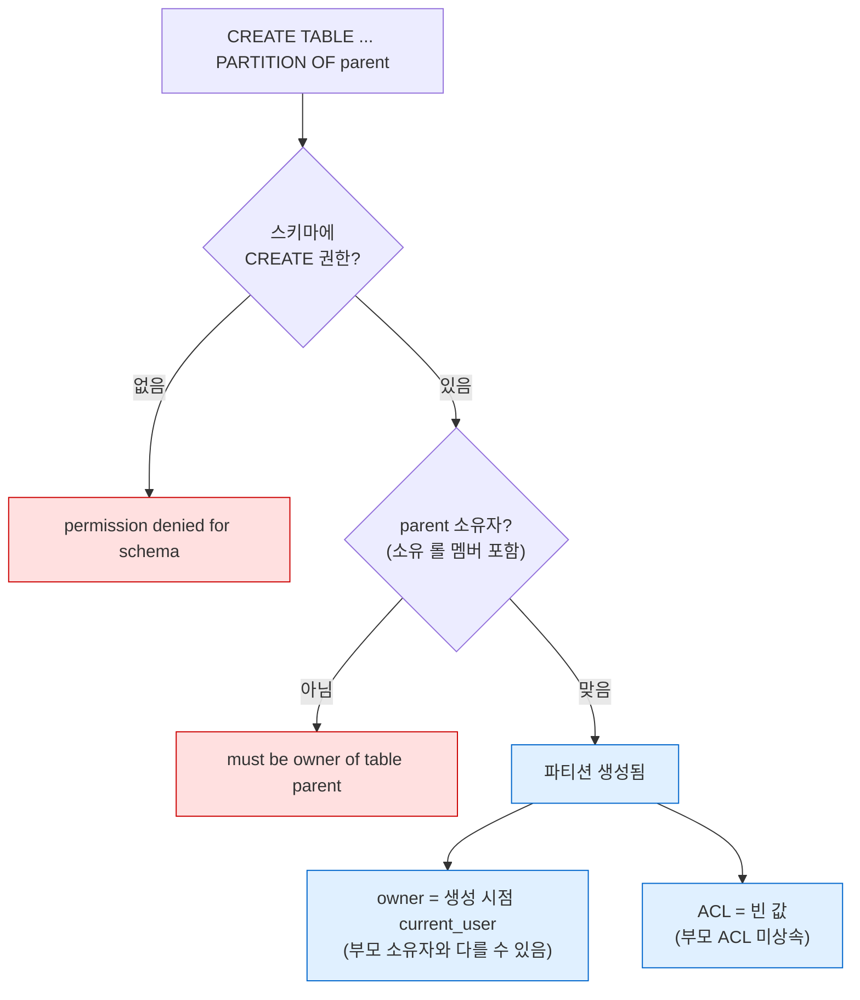
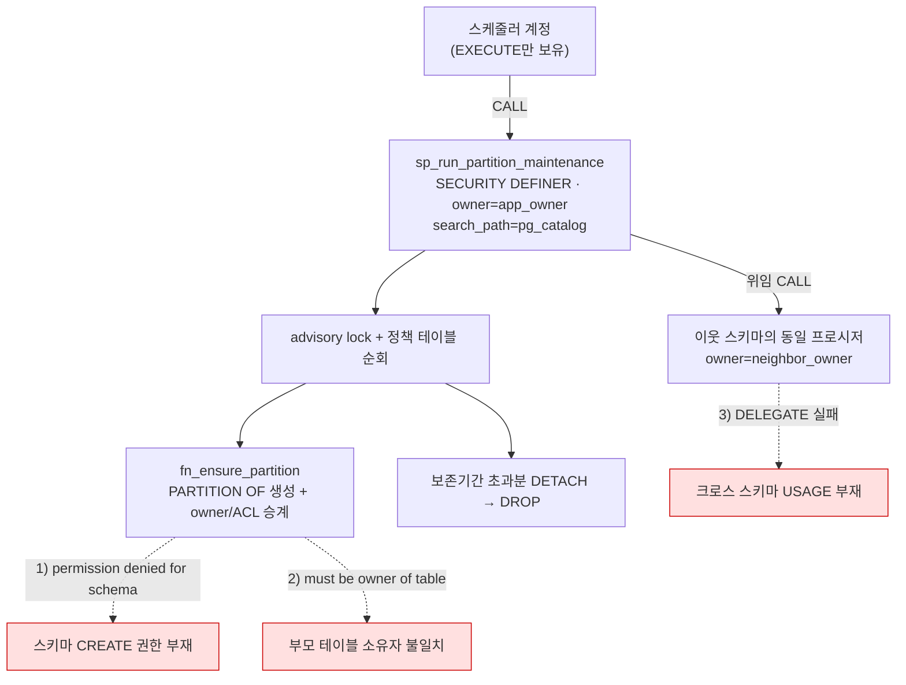

> **인덱스** [[PostgreSQL/00-INDEX|PostgreSQL 문법 총정리]]  ·  **이전** [[PostgreSQL/14-TUNING|14. DB 튜닝 방법론]]

# 15. 권한 체계 — Role, Owner, GRANT, SECURITY DEFINER

PostgreSQL 권한(Authority) 전반 정리. `CREATE TABLE ... PARTITION OF`를 실행하는
파티션 유지관리 프로시저에 어떤 권한과 세팅이 필요한지를 최종 목표로 두고,
용어 → 상속 → 소유권 → GRANT → SECURITY DEFINER → 파티션 특이사항 순으로 좁혀 들어간다.

핵심 동작은 로컬 PostgreSQL 18.4에서 전부 실증했다 (§7 실증 표 참조).
버전 의존 동작은 각 절에 명시.

## 1. 용어와 기본 모델

| 용어 | 정의 | 비고 |
|---|---|---|
| **Role** | 권한의 주체. 8.1부터 user/group이 롤로 통합 | `CREATE USER` = `CREATE ROLE ... LOGIN` 별칭 |
| **Owner** | 객체를 소유한 롤. 객체당 정확히 1개 | GRANT로 못 주고 `ALTER ... OWNER TO`로만 이전 |
| **ACL** | 객체별 권한 목록 (`pg_class.relacl` 등) | `grantee=권한문자/grantor` 형식 |
| **PUBLIC** | 모든 롤을 뜻하는 의사 롤 | 함수 EXECUTE, DB CONNECT는 기본 부여됨 |
| **멤버십** | `GRANT 롤A TO 롤B` — B가 A의 권한을 물려받는 관계 | 그룹 개념의 구현 방식 |

ACL 권한 문자 (테이블 기준):

```
a=INSERT(append)  r=SELECT(read)  w=UPDATE(write)  d=DELETE
D=TRUNCATE  x=REFERENCES  t=TRIGGER  m=MAINTAIN(PG17+)
```

```sql
-- app_rw=ar/app_owner → app_owner가 app_rw에게 INSERT+SELECT 부여
SELECT relname, relacl FROM pg_class WHERE relname = 'orders';
```

### PostgreSQL만의 특징

- **롤은 클러스터 전역, 소유권·ACL은 DB별.** 롤 하나가 모든 DB에 걸쳐 존재하지만
  무엇을 소유하는지는 DB마다 다르다. Oracle의 "스키마 = 유저"와 달리
  **스키마와 롤이 완전히 분리된 별개 개념**.
- **`session_user` vs `current_user`.** `session_user`는 접속 계정으로 고정,
  `current_user`는 `SET ROLE`·SECURITY DEFINER에 따라 바뀐다.
- **`SET ROLE` vs `SET SESSION AUTHORIZATION`.** 전자는 멤버십이 있는 롤로 전환
  (누구나), 후자는 `session_user` 자체를 바꾼다 (superuser 전용).
- **PG15+: `public` 스키마의 CREATE가 PUBLIC에서 회수됨.** "아무나 public에
  테이블 생성"이 더는 안 된다. 소유자도 `pg_database_owner`로 변경.
- **사전 정의 롤** (PG14+): `pg_read_all_data`, `pg_write_all_data`,
  `pg_monitor`, `pg_signal_backend` 등. 테이블마다 GRANT하지 않고 멤버십 한 줄로
  전체 읽기 권한 등을 부여.

## 2. 롤 속성과 권한 상속

```sql
CREATE ROLE app_owner WITH NOSUPERUSER INHERIT NOCREATEROLE NOCREATEDB
                           LOGIN NOREPLICATION NOBYPASSRLS;
```

**롤 속성(`LOGIN`, `SUPERUSER`, `CREATEDB`, `CREATEROLE`, `REPLICATION`,
`BYPASSRLS`)은 멤버십으로 상속되지 않는다.** 물려받는 것은 객체 권한(ACL)과
소유권 판정뿐이다.

```sql
GRANT app_owner TO batch_user;    -- batch_user는 app_owner의 멤버
```

| 상황 | 동작 |
|---|---|
| 멤버가 `INHERIT` (기본값) | 부모 롤의 객체 권한을 **자동으로** 행사 |
| 멤버가 `NOINHERIT` | `SET ROLE app_owner` 후에만 행사 |
| 소유권 검사 | "소유자여야 한다" = "소유 롤의 **직·간접 멤버**여야 한다"로 완화됨 |
| 한계 | 멤버십이 있어도 **부모 롤보다 커지지 않는다** — 부모에 없는 권한은 멤버에게도 없다 |

**PG16 변경점** — 멤버십에 옵션이 생겼고 소유권 이전 요건이 바뀌었다:

```sql
GRANT app_owner TO batch_user WITH INHERIT TRUE, SET TRUE;   -- PG16+
```

- `ALTER ... OWNER TO` 요건: ~PG15 "대상 롤의 직·간접 멤버" → PG16+ "**대상 롤로
  `SET ROLE` 가능**" (에러 문구도 `must be able to SET ROLE "..."`로 변경).
- `CREATEROLE`이 대폭 손질됨 — 자기가 만든 롤만 관리 가능해짐.

## 3. 소유권 (Ownership)

소유자만 할 수 있는 것 — GRANT를 아무리 받아도 불가능한 영역:

- `DROP`, `ALTER` (구조 변경 전반), `TRUNCATE`는 예외적으로 GRANT 가능
- `GRANT`/`REVOKE` (WITH GRANT OPTION을 받은 경우 예외)
- `COMMENT ON`, 트리거·룰·정책 생성, `REINDEX` 등 유지보수

소유자는 자기 객체에 대해 **모든 권한 + GRANT OPTION을 암묵적으로** 가진다
(relacl이 NULL이어도). 스스로 REVOKE할 수 있지만 언제든 다시 GRANT할 수 있으므로
보호 장치는 아니다.

```sql
ALTER TABLE orders OWNER TO app_owner;
```

`ALTER ... OWNER TO`의 3중 요건 (실증 T5):

1. 실행자가 해당 객체를 소유 (또는 superuser)
2. 실행자가 대상 롤로 전환 가능 (~15: 멤버십 / 16+: `SET ROLE` 가능)
3. **대상 롤이 그 스키마에 CREATE 권한 보유** — 자주 잊는 조건

기타 소유권 규칙:

- **생성한 롤이 소유자가 된다** — 정확히는 생성 시점의 `current_user`.
  `SET ROLE` 중이면 그 롤, SECURITY DEFINER 함수 안이면 **함수 소유자**.
- 시퀀스를 `OWNED BY 테이블.컬럼`으로 연결하려면 **시퀀스와 테이블의 소유자가
  같아야** 한다.
- 롤 정리: `REASSIGN OWNED BY old TO new` → `DROP OWNED BY old` → `DROP ROLE old`.
  소유 객체나 권한이 남아 있으면 `DROP ROLE`이 거부된다.

## 4. GRANT / REVOKE

객체 유형별 권한:

| 객체 | 권한 | 자주 틀리는 것 |
|---|---|---|
| 테이블 | SELECT, INSERT, UPDATE, DELETE, TRUNCATE, REFERENCES, TRIGGER | UPDATE만으로 부족한 경우 — WHERE 절 읽기에 SELECT 필요 |
| 스키마 | **USAGE**, **CREATE** | USAGE = 내부 객체 이름 해석 허용일 뿐. CREATE는 별도 |
| 시퀀스 | USAGE, SELECT, UPDATE | `nextval`은 USAGE 또는 UPDATE 필요 |
| 함수/프로시저 | EXECUTE | **기본으로 PUBLIC에 부여됨** |
| DB | CONNECT, CREATE, TEMP | CONNECT도 기본 PUBLIC |

2단 관문 구조 — 테이블에 접근하려면 **스키마 USAGE ∧ 테이블 권한** 둘 다 필요:

```sql
GRANT USAGE ON SCHEMA app TO app_rw;             -- 관문 1
GRANT SELECT, INSERT ON app.orders TO app_rw;    -- 관문 2
```

```sql
-- 일괄 부여 (기존 객체만)
GRANT SELECT ON ALL TABLES IN SCHEMA app TO app_ro;

-- 미래 객체 자동 부여 — "생성하는 롤" 기준이라는 점이 함정.
-- app_owner가 만드는 것에만 적용되고, 다른 롤이 만들면 적용 안 됨
ALTER DEFAULT PRIVILEGES FOR ROLE app_owner IN SCHEMA app
    GRANT SELECT ON TABLES TO app_ro;
```

- `WITH GRANT OPTION` — 받은 권한을 남에게 재부여 가능. REVOKE 시 연쇄 회수는
  `CASCADE` 필요.
- **뷰는 뷰 소유자 권한으로 원본을 읽는다.** 뷰에 SELECT를 줘도 뷰 소유자가
  원본 테이블을 못 읽으면 `permission denied`. 크로스 스키마 뷰에서 빈발.
  PG15+는 `CREATE VIEW ... WITH (security_invoker = true)`로 호출자 기준 전환 가능.
- 확인 함수: `has_schema_privilege()`, `has_table_privilege()`,
  `has_function_privilege()`, `pg_has_role()`.

## 5. SECURITY DEFINER / INVOKER

| | INVOKER (기본값) | DEFINER |
|---|---|---|
| 실행 권한 주체 | 호출자 (`current_user`) | **함수 소유자** |
| 호출자에게 필요한 것 | EXECUTE + 내부 객체 전부의 권한 | EXECUTE만 |
| 내부 `current_user` | 호출자 | 함수 소유자 |
| 내부에서 생성한 객체의 소유자 | 호출자 | **함수 소유자** |
| 용도 | 일반 로직 | 권한 위임 — UNIX setuid 유사 |

**접속 계정은 아예 안 본다.** 누가 CALL하든 DEFINER 루틴의 실행 주체는 소유자다.
"실행 계정에 권한을 더 주면 되지 않나"는 DEFINER 앞에서는 무의미하고,
고칠 대상은 **소유자 롤의 권한**이다.

DEFINER 작성 필수 수칙:

```sql
CREATE FUNCTION app.fn_maint(...) RETURNS void
    LANGUAGE plpgsql
    SECURITY DEFINER
    SET search_path = pg_catalog        -- ① search_path 고정 (필수)
    AS $$ ... $$;

REVOKE EXECUTE ON FUNCTION app.fn_maint(...) FROM PUBLIC;   -- ② 기본 EXECUTE 회수
GRANT EXECUTE ON FUNCTION app.fn_maint(...) TO batch_user;  -- ③ 필요한 롤에만
```

- ① 고정하지 않으면 호출자가 자기 스키마에 동명 객체·연산자를 심어 **소유자
  권한을 탈취**할 수 있다. 고정하면 본문에서 모든 객체를 `스키마.객체`로
  한정 참조해야 한다.
- ② EXECUTE가 PUBLIC 기본 부여이므로, 회수하지 않으면 스키마 USAGE가 있는
  아무나 소유자 권한 코드를 실행한다.
- **DEFINER 프로시저 안에서는 `COMMIT`/`ROLLBACK` 불가** —
  `invalid transaction termination` (실증 T6). INVOKER 프로시저는 가능.
  "N건마다 커밋" 식 개선과 DEFINER는 양립하지 않는다.

## 6. 파티션 생성의 권한 특이사항

일반 `CREATE TABLE`은 스키마 CREATE만 있으면 된다.
**`CREATE TABLE ... PARTITION OF`는 다르다** — 부모 테이블에 파티션을 붙이는
행위가 부모에 대한 ALTER로 취급되기 때문이다.



| 동작 | 규칙 (실증 근거) |
|---|---|
| 생성 요건 | 스키마 CREATE ∧ 부모 소유권 (T1, T1b) |
| 새 파티션 소유자 | 생성 시점 `current_user` — 부모와 무관 (T2, T3) |
| 새 파티션 ACL | **빈 값. 부모 ACL을 상속하지 않는다** (T3) |
| 부모 경유 접근 | **부모 ACL만 검사** (PG10+) — 파티션 무권한이어도 동작 (T4) |
| 파티션 직접 접근 | 파티션 자신의 ACL 검사 — 백필·직접 조회 경로에서 깨짐 (T4) |
| DETACH / DROP | 역시 부모 소유자만 (T8). ATTACH는 붙일 테이블 소유권도 필요 |
| 스키마 소유 ≠ CREATE | 부모 소유자라도 그 스키마에 CREATE 없으면 실패 (T7) |

파티션 유지관리 루틴의 표준형 — **부모 소유자를 소유자로 하는 DEFINER 루틴**:

```sql
CREATE OR REPLACE FUNCTION app.fn_ensure_partition(
    p_schema text, p_base text, p_from date, p_to date
) RETURNS void
    LANGUAGE plpgsql
    SECURITY DEFINER
    SET search_path = pg_catalog
    AS $FN$
DECLARE
    v_part   text := p_base || '_' || to_char(p_from, 'YYYYMM');
    v_parent oid;
    v_grantee text;
    v_privs   text;
BEGIN
    IF to_regclass(format('%I.%I', p_schema, v_part)) IS NOT NULL THEN
        RETURN;
    END IF;

    EXECUTE format('CREATE TABLE %I.%I PARTITION OF %I.%I FOR VALUES FROM (%L) TO (%L)',
                   p_schema, v_part, p_schema, p_base, p_from, p_to);

    -- 파티션은 부모의 소유자/ACL을 상속하지 않으므로 수동 승계한다
    v_parent := format('%I.%I', p_schema, p_base)::regclass;

    EXECUTE format('ALTER TABLE %I.%I OWNER TO %I', p_schema, v_part,
                   (SELECT pg_get_userbyid(relowner) FROM pg_class WHERE oid = v_parent));

    FOR v_grantee, v_privs IN
        SELECT CASE WHEN a.grantee = 0 THEN 'PUBLIC'          -- grantee=0은 PUBLIC
                    ELSE quote_ident(pg_get_userbyid(a.grantee)) END,
               string_agg(a.privilege_type, ',')
          FROM pg_class c, aclexplode(c.relacl) a
         WHERE c.oid = v_parent
         GROUP BY a.grantee
    LOOP
        EXECUTE format('GRANT %s ON TABLE %I.%I TO %s',
                       v_privs, p_schema, v_part, v_grantee);
    END LOOP;
EXCEPTION
    WHEN duplicate_table THEN NULL;    -- 동시 실행 경쟁 방어
END;
$FN$;
```

- `aclexplode`의 `is_grantable` 컬럼을 버리므로 `WITH GRANT OPTION`은 승계되지
  않는다 — 필요하면 별도 처리.
- 부모 소유자 = 함수 소유자라면 `ALTER OWNER`는 no-op. 다르면 §3의 3중 요건이
  적용된다.

## 7. 실증 기록 (PostgreSQL 18.4)

역할 3개(`owner_ra` 소유자 / `sched_rs` 스케줄러 / `app_user` 앱)와
`RANGE` 파티션 부모로 구성한 검증 결과:

| # | 시나리오 | 결과 |
|---|---|---|
| T1 | 비소유자, 스키마 USAGE만 → `PARTITION OF` | ❌ `permission denied for schema` |
| T1b | 비소유자, 스키마 CREATE까지 부여 | ❌ `must be owner of table parent` |
| T2 | DEFINER 함수(소유자 owner_ra)를 sched_rs가 호출 | ✅ 생성. 내부 `current_user=owner_ra`, `session_user`는 접속 계정 유지 |
| T3 | 생성된 파티션 카탈로그 확인 | owner=owner_ra(함수 소유자), `relacl`=NULL |
| T4 | app_user: 부모 경유 INSERT/SELECT vs 파티션 직접 SELECT | 부모 경유 ✅ / 직접 ❌ `permission denied` |
| T5 | `ALTER TABLE OWNER TO` — 멤버십 없이 / 멤버십+스키마 CREATE 부여 후 | ❌ `must be able to SET ROLE` → ✅ |
| T6 | DEFINER 프로시저 안 `COMMIT` / INVOKER 프로시저 안 `COMMIT` | ❌ `invalid transaction termination` / ✅ |
| T7 | 부모 소유자이지만 스키마 CREATE 없음 | ❌ `permission denied for schema` |
| T8 | 비소유자의 `DETACH PARTITION` | ❌ `must be owner` |

## 8. 사례 연구 — 파티션 유지관리 프로시저의 3단 실패

운영 환경에서 실제로 겪은 권한 실패 체인. 스케줄러가 매일 파티션 유지관리
프로시저(DEFINER, 소유자 `app_owner`)를 CALL하는 구조에서, 서로 다른 층위의
문제 3개가 순차적으로 드러났다.



| 단계 | 에러 | 근본 원인 | 조치 |
|---|---|---|---|
| 1 | `permission denied for schema` | `CREATE SCHEMA`에 `AUTHORIZATION` 절이 없어 스키마 소유자가 설치 DBA 계정이 됨. 소유자 롤에는 USAGE만 있고 CREATE 없음 | `GRANT CREATE ON SCHEMA ... TO app_owner` |
| 2 | `must be owner of table` | 배포 DDL의 `OWNER TO`가 전량 주석 처리되어 부모 테이블 소유자가 배포 계정으로 남음. 스키마 CREATE로는 해결 불가 (§6) | 정책 테이블 기준 `ALTER TABLE ... OWNER TO app_owner` 일괄 |
| 3 | 위임 CALL 실패 | 이웃 스키마에 USAGE조차 없어 이름 해석 단계에서 거부 | 양방향 `GRANT USAGE ON SCHEMA` |

### 교훈

1. **실패 층위가 다르면 처방도 다르다.** 스키마 권한(1) → 객체 소유권(2) →
   이름 해석(3). 에러 문구가 층위를 정확히 알려주므로 문구를 그대로 읽을 것.
2. **조용한 실패 구조를 경계.** 프로시저가 `EXCEPTION WHEN OTHERS`로 삼켜
   로그 테이블에만 기록하면 `CALL` 자체는 성공으로 보인다. DEFINER + 예외 흡수
   조합은 로그 테이블 모니터링이 없으면 장애를 수 주간 은폐한다.
3. **`CREATE SCHEMA`는 반드시 `AUTHORIZATION`과 함께.** 빼먹으면 실행 계정이
   소유자가 되고, 소유권 불일치가 배포마다 재생산된다.
4. **수동 파티션 작업은 `SET ROLE 소유자` 후에.** 다른 계정으로 만들면 파티션
   소유자가 어긋나 다음 유지관리의 DETACH/DROP이 깨진다.
5. **advisory lock은 `pg_advisory_xact_lock` 우선.** 세션 레벨 lock은 unlock 전에
   예외가 전파되면 커넥션 풀 세션에 갇혀 다음 실행이 영구 skip될 수 있다.

## 9. 체크리스트 — 파티션 생성 프로시저에 필요한 권한

**DEFINER 소유자 롤 (스키마당 1개):**

```sql
GRANT USAGE, CREATE ON SCHEMA app TO app_owner;        -- ① 자기 스키마
ALTER TABLE app.parent_tbl OWNER TO app_owner;         -- ② 부모 테이블 전체 소유
GRANT USAGE ON SCHEMA neighbor TO app_owner;           -- ③ 위임 호출 대상 스키마
```

**스케줄러 접속 계정 — 이것이 전부. DDL 권한 불필요:**

```sql
-- LOGIN + DB CONNECT (기본) 전제
GRANT USAGE ON SCHEMA app TO batch_user;
GRANT EXECUTE ON PROCEDURE app.sp_run_partition_maintenance(uuid) TO batch_user;
```

**프로시저 세팅:** `SECURITY DEFINER` + `SET search_path = pg_catalog` +
`REVOKE EXECUTE FROM PUBLIC` + 내부 `COMMIT` 금지.

**배포 전 진단 쿼리:**

```sql
-- 실행 주체 확정: DEFINER 여부와 소유자
SELECT n.nspname, p.proname, pg_get_userbyid(p.proowner) AS owner,
       CASE p.prosecdef WHEN true THEN 'DEFINER' ELSE 'INVOKER' END AS security
  FROM pg_proc p JOIN pg_namespace n ON n.oid = p.pronamespace
 WHERE p.proname LIKE '%partition%';

-- 소유자 롤의 권한 4종 점검
SELECT has_schema_privilege('app_owner', 'app', 'CREATE')     AS can_create
     , has_schema_privilege('app_owner', 'neighbor', 'USAGE') AS can_delegate;

-- 정책 테이블 대비 부모 테이블 소유자 대조
SELECT p.schema_name, p.table_name, c.relowner::regrole AS current_owner
  FROM app.partition_policy p
  JOIN pg_namespace n ON n.nspname = p.schema_name
  JOIN pg_class c ON c.relname = p.table_name AND c.relnamespace = n.oid
 WHERE p.enabled;
```

## 관련 문서

- [[PostgreSQL/02-DDL|02. DDL]] — 파티셔닝 문법, 권한 기초
- [[PostgreSQL/07-PLPGSQL|07. PL/pgSQL]] — FUNCTION vs PROCEDURE, 예외 처리, 동적 SQL
- [[PostgreSQL/08-CALLING|08. 호출 방법]] — CALL과 트랜잭션 문맥
- [[PostgreSQL/12-CONVENTIONS|12. 컨벤션과 안티패턴]] — 배포 스크립트 안전 수칙
