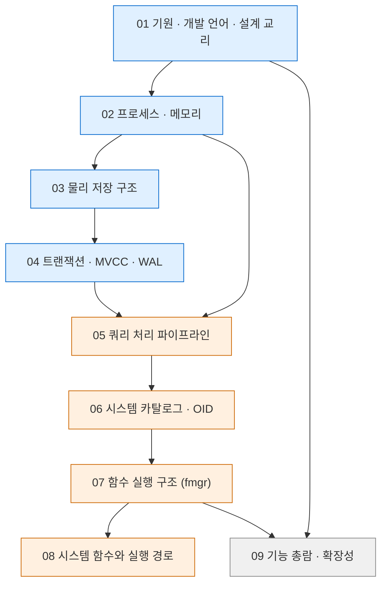

> **상위** [[PostgreSQL/00-INDEX|PostgreSQL 문법 총정리]]

# PostgreSQL 내부 구조 분석서

> 사용법이 아니라 **시스템 자체**를 해부하는 시리즈. 어떤 언어로 무엇을 지향하며 만들어졌는지에서
> 출발해 프로세스·메모리·디스크·트랜잭션·쿼리 처리·카탈로그·함수 실행 경로까지 내려간다.
> 기준 버전 — PostgreSQL 18.4. 각 문서의 핵심 동작은 로컬 임시 클러스터에서 실증했다.

## 읽는 순서

- 파란 계열 — 서버가 **어떻게 존재하는가**. 프로세스·메모리·디스크·내구성
- 주황 계열 — SQL 한 줄이 **어떻게 실행되는가**. 파서에서 C 함수까지
- 회색 계열 — 전체 기능과 확장 지점 조감. 어느 시점에 읽어도 무방

## 전체 문서

| 문서 | 내용 |
|---|---|
| [[PostgreSQL/INTERNALS/01-ORIGIN-PHILOSOPHY\|01. 기원·개발 언어·설계 교리]] | POSTGRES에서 PostgreSQL까지, C 언어와 표준 버전, 빌드 시스템, 소스 트리, 라이선스·거버넌스·릴리스 정책, 설계 교리 |
| [[PostgreSQL/INTERNALS/02-PROCESS-MEMORY\|02. 프로세스·메모리 아키텍처]] | postmaster와 backend fork 모델, 보조 프로세스, 공유 메모리 구성, MemoryContext, 시그널 |
| [[PostgreSQL/INTERNALS/03-STORAGE\|03. 물리 저장 구조]] | PGDATA, relfilenode·fork·세그먼트, 8KB 페이지와 튜플 헤더, TOAST, FSM·VM, 버퍼 매니저 |
| [[PostgreSQL/INTERNALS/04-MVCC-WAL\|04. 트랜잭션·MVCC·WAL 내부]] | XID·스냅샷·가시성 판정, CLOG·힌트 비트, HOT, VACUUM·freeze, WAL·체크포인트·복구·복제 |
| [[PostgreSQL/INTERNALS/05-QUERY-PIPELINE\|05. 쿼리 처리 파이프라인]] | 와이어 프로토콜, parser→analyzer→rewriter→planner→executor, Node 트리, 비용 모델, 플랜 캐시, 병렬·JIT |
| [[PostgreSQL/INTERNALS/06-CATALOG-OID\|06. 시스템 카탈로그와 OID]] | 자기 기술적 카탈로그, OID 할당 구간, reg* 타입, 시스템 컬럼, pg_depend, bootstrap, 캐시 무효화 |
| [[PostgreSQL/INTERNALS/07-FUNCTION-MANAGER\|07. 함수 실행 구조 (fmgr)]] | pg_proc → fmgr → V1 호출 규약 → Datum, volatility·strict, SRF, 언어 핸들러, C 확장 함수 빌드 실증 |
| [[PostgreSQL/INTERNALS/08-SYSTEM-FUNCTIONS\|08. 기본 제공 시스템 함수와 실행 경로]] | 시스템 정보·관리 함수 총람, `pg_backend_pid()`·`now()`·`pg_current_xact_id()`·`pg_cancel_backend()` 등 내부 경로 |
| [[PostgreSQL/INTERNALS/09-FEATURES-EXTENSIBILITY\|09. 지원 기능 총람과 확장성 아키텍처]] | 기능 지도, 인덱스 AM 6종, 타입·연산자 클래스, Table/Index AM API, 훅, FDW, EXTENSION 메커니즘, 버전 연표 |

## 사용법 문서와의 대응

| 내부 구조 문서 | 함께 보면 좋은 사용법 문서 |
|---|---|
| 02 프로세스·메모리 | [[PostgreSQL/14-TUNING\|14. 튜닝]] — 메모리 파라미터 |
| 03 물리 저장 구조 | [[PostgreSQL/02-DDL\|02. DDL]] — 테이블·인덱스·파티션 |
| 04 MVCC·WAL | [[PostgreSQL/10-TRANSACTION\|10. 트랜잭션]] — 격리 수준·락·VACUUM 사용 |
| 05 쿼리 파이프라인 | [[PostgreSQL/11-PERFORMANCE\|11. 성능]] — EXPLAIN 읽기 |
| 06 카탈로그·OID | [[PostgreSQL/15-AUTHORITY\|15. 권한 체계]] — 권한 카탈로그 |
| 07 fmgr | [[PostgreSQL/07-PLPGSQL\|07. PL/pgSQL]], [[PostgreSQL/08-CALLING\|08. 호출 방법]] |
| 08 시스템 함수 | [[PostgreSQL/05-FUNCTIONS\|05. 내장 함수]] |
| 09 기능·확장성 | [[PostgreSQL/09-POSTGRES-ONLY\|09. PostgreSQL 고유 기능]] |

## 주제별 빠른 참조

| 알고 싶은 것                                    | 문서                                                     |
| ------------------------------------------ | ------------------------------------------------------ |
| PostgreSQL은 무슨 언어로 만들었나                    | [[PostgreSQL/INTERNALS/01-ORIGIN-PHILOSOPHY\|01]]      |
| 옵티마이저 힌트가 없는 이유                            | [[PostgreSQL/INTERNALS/01-ORIGIN-PHILOSOPHY\|01]]      |
| 접속 하나당 프로세스 하나인 이유, 커넥션 풀이 필요한 이유          | [[PostgreSQL/INTERNALS/02-PROCESS-MEMORY\|02]]         |
| 테이블이 디스크에 어떤 파일로 존재하나                      | [[PostgreSQL/INTERNALS/03-STORAGE\|03]]                |
| UPDATE가 왜 새 행을 만드나, VACUUM이 왜 필요한가         | [[PostgreSQL/INTERNALS/04-MVCC-WAL\|04]]               |
| 크래시 후 어떻게 복구되나                             | [[PostgreSQL/INTERNALS/04-MVCC-WAL\|04]]               |
| SQL 한 줄이 실행되기까지의 단계                        | [[PostgreSQL/INTERNALS/05-QUERY-PIPELINE\|05]]         |
| OID가 무엇이고 어디서 오나, `::regclass`의 정체         | [[PostgreSQL/INTERNALS/06-CATALOG-OID\|06]]            |
| `ctid`·`xmin`·`xmax` 시스템 컬럼                | [[PostgreSQL/INTERNALS/06-CATALOG-OID\|06]]            |
| 함수 호출이 C 코드에 도달하는 경로                       | [[PostgreSQL/INTERNALS/07-FUNCTION-MANAGER\|07]]       |
| `IMMUTABLE`/`STABLE`/`VOLATILE`이 실제로 바꾸는 것 | [[PostgreSQL/INTERNALS/07-FUNCTION-MANAGER\|07]]       |
| `pg_backend_pid()`가 돌려주는 값의 정체             | [[PostgreSQL/INTERNALS/08-SYSTEM-FUNCTIONS\|08]]       |
| `now()`와 `clock_timestamp()` 차이            | [[PostgreSQL/INTERNALS/08-SYSTEM-FUNCTIONS\|08]]       |
| 다른 세션을 취소·종료하는 원리                          | [[PostgreSQL/INTERNALS/08-SYSTEM-FUNCTIONS\|08]]       |
| 확장(extension)이 서버에 끼어드는 지점                 | [[PostgreSQL/INTERNALS/09-FEATURES-EXTENSIBILITY\|09]] |

## 실증 환경

- PostgreSQL 18.4 (Homebrew, macOS arm64), 문서별 전용 임시 클러스터 (`initdb --auth=trust -E UTF8 --locale=C`)
- 헤더 근거 — `$(pg_config --includedir-server)` 의 18.4 서버 헤더
- 소스 근거 — `github.com/postgres/postgres` `REL_18_STABLE` 브랜치, 공식 문서 `postgresql.org/docs/18/`
- 출력 발췌의 로컬 경로는 `$PGDATA` 등으로 치환

## 관련 문서

- [[PostgreSQL/00-INDEX|PostgreSQL 문법 총정리]] — 사용법 시리즈 인덱스
