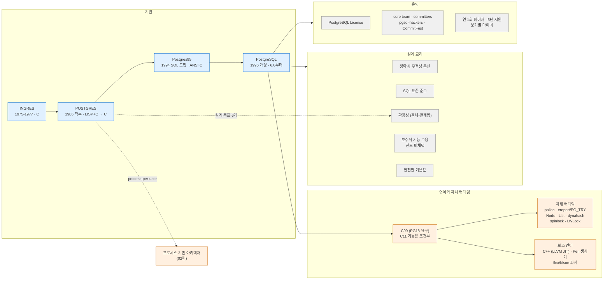
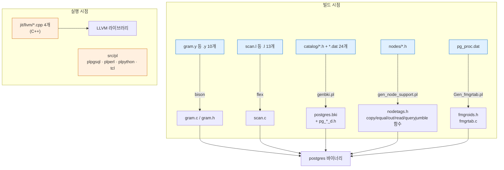
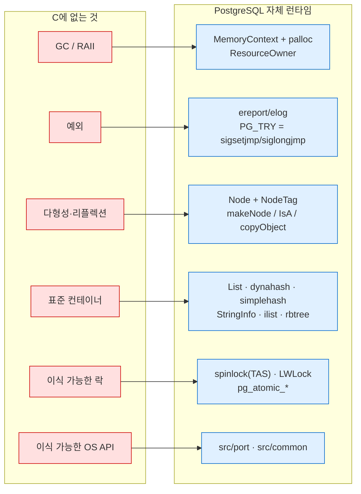
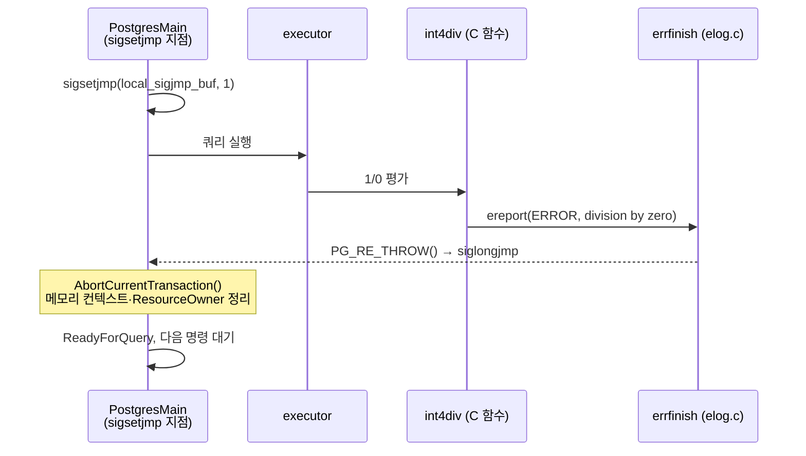
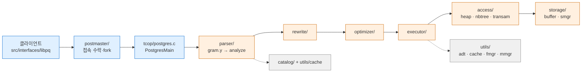
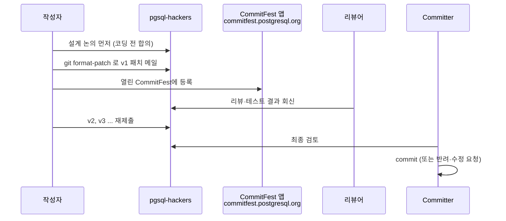
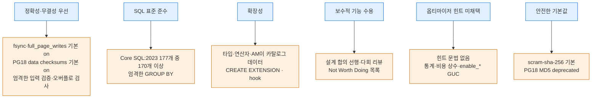

> **인덱스** [[PostgreSQL/INTERNALS/00-INDEX|내부 구조 분석서]]  ·  **다음** [[PostgreSQL/INTERNALS/02-PROCESS-MEMORY|02. 프로세스·메모리 아키텍처]]

# 01. 기원·개발 언어·설계 교리

PostgreSQL이 **어디서 왔고, 무엇으로 쓰였으며, 무엇을 지향하는가**를 정리한다.
뒤의 02~09편이 다루는 구조(프로세스 모델, 메모리 컨텍스트, Node 트리, fmgr, 카탈로그)는
대부분 1980년대 Berkeley에서 내린 결정과 "C로 DBMS를 만든다"는 조건에서 나온 결과다.
이 문서는 그 출발점과 프로젝트 운영 방식, 설계 교리가 실제 코드·기본값에 어떻게 박혀 있는지를 잇는다.

근거는 원 논문(Stonebraker·Rowe 1986, Stonebraker 외 1990), 공식 문서, `REL_18_4` 태그 소스,
로컬 PostgreSQL 18.4 바이너리·헤더다. 실증 결과는 §11에 모았다.

## 0. 전체 지도



| 축 | 한 줄 요약 | 상세 |
|---|---|---|
| 기원 | INGRES의 후속 연구 시스템 POSTGRES(POST inGRES)가 SQL을 얻어 PostgreSQL이 됨 | §1 |
| 언어 | 서버 본체는 C. PG18은 **C99** 요구, master(PG19 개발)는 **C11**로 상향 | §2 |
| 런타임 | GC·예외·제네릭이 없는 C를 메모리 컨텍스트·longjmp 예외·Node 태그로 보완 | §3 |
| 프로세스 | 1986년 "제한된 인력" 때문에 고른 process-per-user가 지금까지 유지 | §4 |
| 빌드 | autoconf+make(전통) / Meson(PG16+) 이원 체제 | §5 |
| 소스 | `src/backend` 약 111만 줄 C, 하위 디렉토리가 곧 서브시스템 경계 | §6 |
| 운영 | 단일 기업 소유 없음. core team은 기술 방향에 관여하지 않음 | §7~9 |
| 교리 | 정확성·표준·확장성·보수성. 힌트 거부와 안전 기본값으로 구체화 | §10 |

---

## 1. 역사 — INGRES에서 PostgreSQL 18까지

### 1.1 INGRES와 POSTGRES의 탄생

POSTGRES라는 이름 자체가 계보를 말한다. 1986 SIGMOD 논문 「The Design of POSTGRES」
(Stonebraker·Rowe, UC Berkeley 기술 보고서 ERL M85/95) 서론의 요지:

- INGRES 관계형 DBMS는 1975~1977년 UC에서 구현됨
- 1978년 이후 분산 DB, 추상 데이터 타입 등 확장 시제품을 덧붙이면서 코드가 "hacked up enough" 상태가 되어
  큰 기능을 더 넣기 극히 어려워짐
- 그래서 새 시스템을 만든다 — **POSTGRES (POST inGRES)**

같은 논문의 초록에 적힌 **설계 목표 6개**는 지금의 PostgreSQL을 읽는 열쇠다.

| # | 원 설계 목표 (1986) | 오늘의 PostgreSQL에 남은 형태 | 상세 |
|---|---|---|---|
| 1 | 복합 객체(complex objects) 지원 강화 | 배열·복합 타입·범위 타입·JSONB | [[PostgreSQL/INTERNALS/09-FEATURES-EXTENSIBILITY\|09편]] |
| 2 | **데이터 타입·연산자·접근 방법(access method)의 사용자 확장** | `CREATE TYPE/OPERATOR`, 연산자 클래스, index AM·table AM API, `CREATE EXTENSION` | [[PostgreSQL/INTERNALS/09-FEATURES-EXTENSIBILITY\|09편]] |
| 3 | 능동 DB(alerter·trigger)와 추론(규칙) | 트리거, `LISTEN/NOTIFY`, 규칙 시스템(rewriter) | [[PostgreSQL/INTERNALS/05-QUERY-PIPELINE\|05편]] |
| 4 | 크래시 복구 코드 단순화 | no-overwrite 저장 → 오늘의 MVCC 튜플 버전 모델 | [[PostgreSQL/INTERNALS/04-MVCC-WAL\|04편]] |
| 5 | 광디스크·다중 프로세서 워크스테이션·전용 VLSI 활용 | (당시 하드웨어 가정, 직접 계승은 없음) | — |
| 6 | 관계 모델은 가능한 한 바꾸지 않음 | "객체-관계형": 관계 모델 위에 확장 | §10.3 |

> 목표 2가 PostgreSQL 정체성의 핵심이다. 타입·연산자·인덱스 방법까지 **카탈로그 행으로 등록되는 데이터**로
> 다루는 설계가 여기서 시작됐고, 06편(카탈로그)·07편(fmgr)·09편(확장성)이 전부 이 목표의 구현 상세다.

### 1.2 Berkeley POSTGRES 연표

공식 문서 「A Brief History of PostgreSQL」(docs/18/history.html) 기준.

| 시점 | 사건 |
|---|---|
| 1986 | POSTGRES 구현 착수. 책임자 Michael Stonebraker 교수. 후원 DARPA, ARO, NSF, ESL Inc. |
| 1987 | 첫 "demoware" 가동. 1988 ACM-SIGMOD에서 시연 |
| 1989-06 | Version 1, 소수 외부 사용자에게 배포 |
| 1990-06 | Version 2 — 새 규칙 시스템 |
| 1991 | Version 3 — 다중 storage manager 지원, 실행기 개선, 규칙 시스템 재작성 |
| 1992 말 | Sequoia 2000 과학 컴퓨팅 프로젝트의 주 데이터 관리자로 채택 |
| — | 지원 부담 때문에 Berkeley 프로젝트가 Version 4.2로 공식 종료 (4.2의 연도는 공식 문서에 명시 없음) |
| — | Illustra가 상용화 → 이후 Informix에 합병, Informix는 현재 IBM 소유 |

### 1.3 Postgres95 → PostgreSQL

| 시점 | 사건 | 근거 |
|---|---|---|
| 1994 | Andrew Yu, Jolly Chen이 POSTGRES에 SQL 인터프리터 추가 | history.html |
| Postgres95 | 질의어 PostQUEL → SQL로 교체(서버 구현). **libpq라는 이름은 PostQUEL에서 유래** | history.html |
| Postgres95 | 코드 전체를 ANSI C로 정리, 크기 25% 축소. Wisconsin 벤치마크에서 4.2 대비 30~50% 빠름 | history.html |
| Postgres95 | 대화형 SQL 도구 `psql`(GNU Readline 사용), Tcl 클라이언트 라이브러리 libpgtcl, BSD make 대신 GNU make | history.html |
| 1996 | "Postgres95"라는 이름이 오래가지 못한다고 판단, **PostgreSQL**로 개명 | history.html |
| 1996~ | 버전 번호를 **6.0**부터 시작 — Berkeley POSTGRES의 번호 계열을 잇기 위함 | history.html |
| 1997-01-29 | 6.0 릴리스 | release/6.0 |

개발 초점 변화도 공식 문서에 적혀 있다 — Postgres95 시기는 "기존 서버 코드의 문제 파악", PostgreSQL 이후는 "기능 확장".

### 1.4 메이저 버전 연표 (발췌)

릴리스 날짜는 각 버전의 공식 release notes(`postgresql.org/docs/release/X.Y/`)에서, 대표 기능은 같은 페이지 본문에서 확인한 것만 적었다.

```mermaid
flowchart LR
    V6["6.0<br/>1997"] --> V71["7.1<br/>2001 WAL"]
    V71 --> V80["8.0<br/>2005 Windows·PITR"]
    V80 --> V83["8.3<br/>2008 HOT"]
    V83 --> V90["9.0<br/>2010 스트리밍 복제"]
    V90 --> V94["9.4<br/>2014 jsonb·논리 디코딩"]
    V94 --> V96["9.6<br/>2016 병렬 쿼리"]
    V96 --> V10["10<br/>2017 번호 체계 변경"]
    V10 --> V11["11<br/>2018 JIT"]
    V11 --> V12["12<br/>2019 table AM"]
    V12 --> V16["16<br/>2023 Meson"]
    V16 --> V18["18<br/>2025 AIO"]

    classDef base fill:#e0f0ff,stroke:#06c
    classDef run fill:#fff0e0,stroke:#c60
    class V6,V71,V80,V83,V90 base
    class V94,V96,V10,V11,V12,V16,V18 run
```



| 버전 | 릴리스 | 대표 변화 (release notes 표현 기준) | 내부 관점 |
|---|---|---|---|
| 6.0 | 1997-01-29 | PostgreSQL 이름의 첫 메이저 | — |
| 7.1 | 2001-04-13 | Write-ahead Log (WAL) | 내구성 모델의 근간 → [[PostgreSQL/INTERNALS/04-MVCC-WAL\|04편]] |
| 8.0 | 2005-01-19 | Microsoft Windows Native Server, Savepoints, Point-In-Time Recovery, Tablespaces | Windows용 `EXEC_BACKEND` 경로(§4) |
| 8.3 | 2008-02-04 | Heap-Only Tuples (HOT) | 갱신 시 인덱스 재삽입 회피 → 04편 |
| 9.0 | 2010-09-20 | Streaming Replication, Hot Standby | walsender/walreceiver → 02·04편 |
| 9.1 | 2011-09-12 | 동기 복제, `CREATE EXTENSION` | 확장 패키징 → 09편 |
| 9.2 | 2012-09-10 | index-only scans | visibility map 활용 → 03편 |
| 9.4 | 2014-12-18 | `jsonb`, logical decoding | 출력 플러그인 → 09편 |
| 9.6 | 2016-09-29 | 순차 스캔·조인·집계의 병렬 실행 | parallel worker → 05편 |
| 10 | 2017-10-05 | 선언적 파티셔닝, publish/subscribe 논리 복제, **버전 번호 체계 변경** | §9.2 |
| 11 | 2018-10-18 | 선택적 JIT 컴파일 | LLVM, C++ 코드 유입(§2.4) |
| 12 | 2019-10-03 | 새 table access method 개발 가능 (기존 heap은 기본 AM으로 유지) | table AM API → 09편 |
| 16 | 2023-09-14 | Meson 빌드 시스템 추가 | §5 |
| 17 | 2024-09-26 | 증분 백업(`pg_basebackup`), MSVC 전용 빌드 제거, AIX 지원 제거 | §5 |
| 18 | 2025-09-25 | 비동기 I/O 서브시스템(`io_method`), initdb 데이터 체크섬 기본 활성화, MD5 암호 인증 deprecated | io worker → 02편, §10.6 |

### 1.5 코드에 남은 역사의 흔적

| 흔적 | 위치 | 유래 |
|---|---|---|
| `libpq` | `src/interfaces/libpq` | PostQUEL의 "pq" (history.html) |
| `postmaster` | `src/backend/postmaster/` | 1986 설계 논문의 POSTMASTER 프로세스 (§4) |
| `List`, `NIL`, `lfirst`, `lnext` | `src/include/nodes/pg_list.h` | LISP 시절의 cons-cell 리스트. 헤더 주석이 직접 언급 (§3.3) |
| `nodeToString()` 출력의 `{QUERY :commandType 1 ...}` | `src/backend/nodes/outfuncs.c` | S-expression 형식 노드 직렬화 (V9) |
| `Portions Copyright (c) 1994, The Regents of the University of California` | `COPYRIGHT`, 모든 소스 파일 헤더 | Berkeley 코드 기원 (§7) |
| `(also known as Postgres, formerly known as Postgres95)` | `COPYRIGHT` 첫머리 | 개명 이력 |

---

## 2. 개발 언어 — C, 그리고 어떤 C인가

### 2.1 언어 구성 (REL_18_4 실측)

`REL_18_4` 태그를 shallow clone한 뒤 `git ls-files`로 추적 파일만 센 값(V2). 생성 산출물(gram.c 등)은 저장소에 없으므로 제외된다.

| 확장자 | 파일 수 | 줄 수 | 용도 |
|---|---:|---:|---|
| `.c` | 1,488 | 1,521,935 | 서버·클라이언트·contrib 본체 |
| `.h` | 973 | 197,705 | 헤더 (`src/include` 812개 포함) |
| `.y` | 10 | 27,013 | bison 문법 (`gram.y` 단독 19,728줄) |
| `.l` | 13 | 9,000 | flex 스캐너 |
| `.pl` / `.pm` | 316 / 17 | 75,077 / 10,369 | 빌드 시 코드 생성기, TAP 테스트 |
| `.cpp` | 4 | 1,485 | LLVM JIT 연동부 전용 |
| `.py` | 5 | 1,337 | 보조 스크립트(규칙 생성기, 테스트 서버 등) |
| `.sql` | 806 | 180,186 | 회귀 테스트, 확장 설치 스크립트 |
| `.sgml` | 389 | 332,172 | 공식 문서 원본 |

> 서버 본체는 사실상 **순수 C**다. C++는 4개 파일, 전부 `src/backend/jit/llvm/` 안에 있다.

### 2.2 C 표준 — PG18은 C99, 다음 메이저는 C11

**결론: PostgreSQL 18은 C99를 요구한다.** 근거는 네 갈래로 일치한다.

| 근거 | 내용 |
|---|---|
| 공식 문서 `docs/18/install-requirements.html` | "You need an ISO/ANSI C compiler (at least C99-compliant)." |
| `configure.ac` (REL_18_4, 367~373행) | `AC_PROG_CC_C99()` 후 실패 시 `C compiler "$CC" does not support C99` 로 중단 |
| `meson.build` (REL_18_4) | 지정 초기화자·`for` 루프 내 선언·복합 리터럴을 쓰는 `c99_test` 컴파일 시도. 실패하면 `-std=c99` 추가 재시도, 그래도 실패하면 `error('C compiler does not support C99')` |
| 서버 헤더 `c.h` (18.4 설치본) | "We require C99, hence the compiler should understand flexible array members." |

C11 기능은 **있으면 쓰고 없으면 대체**하는 조건부 사용이다. 설치된 `c.h`에서 확인:

```c
/* c.h — pg_noreturn: C11이면 _Noreturn, 아니면 컴파일러 확장으로 대체 */
#if defined(__STDC_VERSION__) && __STDC_VERSION__ >= 201112L
#define pg_noreturn _Noreturn
#elif defined(__GNUC__) || defined(__SUNPRO_C)
#define pg_noreturn __attribute__((noreturn))
#elif defined(_MSC_VER)
#define pg_noreturn __declspec(noreturn)
#else
#define pg_noreturn
#endif
```

`StaticAssertDecl()`도 같은 방식이다 — `HAVE__STATIC_ASSERT`면 C11 `_Static_assert`, 아니면 음수 폭 비트필드로
컴파일 에러를 유도하는 우회 구현(c.h 주석: "C11 has _Static_assert(), and most C99 compilers already support that").

**다음 메이저(PG19)는 C11.** master 브랜치 커밋 `f5e0186f86` "Raise C requirement to C11"(2025-08-26)이
configure·meson의 요구를 C99 → C11로 올렸다. 커밋 메시지 요지:

- Autoconf 2.69에는 `AC_PROG_CC_C11`이 없어 `__STDC_VERSION__` 검사를 직접 작성
- Meson의 공식 `c_std` 옵션은 올바르게 쓰기 어려워 사용하지 않음

이 커밋은 REL_18_STABLE에는 들어가지 않았다(REL_18_4 `configure.ac`는 여전히 `AC_PROG_CC_C99`). 공식 roadmap 페이지는
조회 시점(2026-10-05)에 PostgreSQL 19를 "2026년 10월 예정"으로 표기하고 있었다.

실제 빌드에서 쓰인 표준은 별도 문제다. Homebrew 18.4의 `pg_config --cflags`에는 `-std=` 옵션이 없으므로
**컴파일러 기본값**(Apple clang 21은 `__STDC_VERSION__ = 201710L`, 즉 C17)으로 빌드됐다. 요구 하한이 C99라는 뜻이지
C99로 컴파일된다는 뜻이 아니다. 설치 헤더를 `-std=c99`/`-std=c11`/기본값으로 컴파일하면 모두 통과하고,
`-std=c89`는 `inline` 미지원으로 20개 에러가 난다(V3).

```text
default    compile OK  __STDC_VERSION__=201710L
-std=c99   compile OK  __STDC_VERSION__=199901L
-std=c11   compile OK  __STDC_VERSION__=201112L
-std=c89   compile FAIL (20 errors)
  .../server/lib/stringinfo.h:156:8: error: unknown type name 'inline'
```

### 2.3 PostgreSQL의 "C 방언" — 컴파일러 플래그

`configure.ac`가 GCC 호환 컴파일러에 자동으로 붙이는 플래그와 소스 주석의 이유. 로컬 `pg_config --cflags`에 그대로 나타난다(V1).

| 플래그 | configure.ac 주석/의미 | 함의 |
|---|---|---|
| `-Wdeclaration-after-statement` | 문장 뒤 선언 경고 | C99가 허용해도 **블록 첫머리 선언** 스타일 고수 |
| `-Werror=vla` | "Really don't want VLAs to be used in our dialect of C" | 가변 길이 배열 금지 — 스택 크기 예측 가능성 |
| `-fno-strict-aliasing` | strict-aliasing 규칙 비활성 | `Datum`·`Node *`·페이지 버퍼를 서로 다른 타입 포인터로 보는 코드가 많음 |
| `-fwrapv` | "Disable optimizations that assume no overflow" | 부호 있는 정수 오버플로를 UB로 보고 최적화하는 것을 막음 |
| `-fexcess-precision=standard` | 일부 gcc의 FP 최적화 오류 회피 | 부동소수 결과 재현성 |
| `-Wmissing-prototypes`, `-Wmissing-variable-declarations` | 원형 없는 전역 함수·변수 경고 | 전역 심볼 관리 (스레드화 논의와도 연결, §4.3) |
| `-Wformat-security`, `-Wmissing-format-attribute` | printf 계열 형식 검사 | `ereport`/`elog`의 형식 문자열 안전성 |

정수 오버플로는 컴파일러에 맡기지 않고 **명시적으로 검사**한다. `int4pl`(정수 `+` 연산자의 C 구현):

```c
/* src/backend/utils/adt/int.c (REL_18_4) */
Datum
int4pl(PG_FUNCTION_ARGS)
{
	int32		arg1 = PG_GETARG_INT32(0);
	int32		arg2 = PG_GETARG_INT32(1);
	int32		result;

	if (unlikely(pg_add_s32_overflow(arg1, arg2, &result)))
		ereport(ERROR,
				(errcode(ERRCODE_NUMERIC_VALUE_OUT_OF_RANGE),
				 errmsg("integer out of range")));
	PG_RETURN_INT32(result);
}
```

`pg_add_s32_overflow`(`src/include/common/int.h`)는 `__builtin_add_overflow`가 있으면 그것을, 없으면 64비트로 넓혀 범위를 검사한다.
SQL `select 2147483647::int + 1` → `ERROR: integer out of range` (V12).

### 2.4 C 이외의 언어



| 언어/도구 | 쓰임 | 요구 버전 (docs/18 install-requirements) |
|---|---|---|
| **C++** | `src/backend/jit/llvm/` 의 `llvmjit_error.cpp`, `llvmjit_inline.cpp`, `llvmjit_wrap.cpp`, `SectionMemoryManager.cpp`. LLVM C++ API를 C에서 쓰기 위한 래퍼 | `--with-llvm` 시에만. "a working C++ compiler" 필요, LLVM 14 이상(PG18 release notes: "If LLVM is enabled, require version 14 or later") |
| **Perl** | 빌드 시 코드 생성: `genbki.pl`(카탈로그 → `postgres.bki`), `Gen_fmgrtab.pl`(내장 함수 표), `gen_node_support.pl`(Node 지원 함수·`nodetags.h`), `generate-errcodes.pl`, `generate-lwlocknames.pl`, `generate-wait_event_types.pl` 등. TAP 테스트도 Perl | Perl 5.14 이상 |
| **flex / bison** | SQL 문법 `parser/gram.y`·`scan.l`, 그 밖에 `bootparse.y`(bootstrap), `repl_gram.y`(복제 명령), `jsonpath_gram.y`, `pl_gram.y`(PL/pgSQL), `guc-file.l`(설정 파일) 등 | "Other lex and yacc programs cannot be used." Bison 2.3 이상 |
| **SQL** | 확장 설치 스크립트, 시스템 뷰 정의(`system_views.sql` 등), 회귀 테스트 | — |
| **PL 언어** | `src/pl/plpgsql`(기본 설치), `plperl`, `plpython`, `tcl` — 각자 C로 쓴 언어 핸들러 | PL/Perl은 Perl 5.14, PL/Python은 Python 3.6.8, PL/Tcl은 Tcl 8.4 이상 |
| **Make / Meson** | 빌드 | GNU make 3.81 이상, Meson 0.54 이상 |

JIT은 **선택 기능**이다. 로컬 Homebrew 빌드는 configure 옵션에 `--with-llvm`이 없고 `pg_config.h`에 `/* #undef USE_LLVM */`.
그래서 GUC `jit`의 기본값은 `on`이지만 `pg_jit_available()`은 `f`이고, `jit_above_cost=0`으로 강제해도 EXPLAIN에 JIT 절이 나오지 않는다(V6).
C++ 의존을 JIT 한 곳에 가둬 둔 덕에 C++ 없이도 서버 전체를 빌드할 수 있다.

### 2.5 왜 C인가 — 1985년의 결정과 그 후

1990년 논문 「The Implementation of POSTGRES」(Stonebraker·Rowe·Hirohama, UCB/ERL M90/34) §5.3 "Programming Language Used"가 직접 답한다.
초록 첫 문장부터 "Currently, POSTGRES is about 90,000 lines of code in C" — LISP을 걷어 낸 직후의 상태다.

| 단계 | 내용 (논문 요지) |
|---|---|
| 후보 | C, C++, MODULA 2+, LISP, ADA, SMALLTALK |
| 탈락 | SMALLTALK — 느리고 컴파일러 보급 부족. ADA·MODULA 2+ — C++ 대비 이점 적고 Berkeley에서 인력 확보 곤란. C++ — 착수 시점(1985-10)에 안정적인 컴파일러가 없음. C — INGRES가 C였기에 "다른 것을 해보고 싶어서" 꺼림 |
| 선택 | 소거법으로 **LISP**. 옵티마이저·추론 엔진이 트리 처리라 LISP이 쉬울 것으로 기대 |
| 현실 | 8K 페이지를 다루는 버퍼 매니저 등은 C가 쉬워 **C와 LISP 혼용**. Version 1 시점 LISP 약 17,000줄 + C 약 63,000줄 |
| 평가 | "the use of LISP has been a terrible mistake" — 런타임 메모리 과다(빈 프로그램도 약 3MB), DBMS는 GC 정지를 허용할 수 없어 결국 수동 메모리 관리, 실행 속도, 두 언어를 오가는 디버깅·메모리 모델 차이 |
| 결말 | LISP 17,000줄을 **C로 이식 완료**. 동일 알고리즘 기준 LISP판 footprint 약 4.5MB, C판 약 1MB |

이 평가에서 C를 고수하게 된 이유가 그대로 읽힌다.

- **GC가 없어야 한다** — 응답 시간에 민감한 DBMS는 GC 정지를 용납할 수 없다. 대신 PostgreSQL은 메모리 컨텍스트로
  "수명 단위 일괄 해제"를 구현했다(§3.1). GC 없는 언어에서 GC의 편의를 일부 되찾는 장치다.
- **메모리 레이아웃 직접 제어** — 8KB 페이지·튜플 헤더·공유 메모리 구조체를 바이트 단위로 정의해야 한다
  ([[PostgreSQL/INTERNALS/03-STORAGE|03편]]).
- **이식성** — Postgres95가 "completely ANSI C"로 정리된 뒤 다양한 Unix와 Windows로 퍼졌다.
- **확장 ABI** — 확장 모듈이 서버와 같은 C ABI로 `.so`/`.dylib`를 로드한다([[PostgreSQL/INTERNALS/07-FUNCTION-MANAGER|07편]]).

다른 언어로 전면 재작성하는 안은 위키 「Not Worth Doing」 목록에 "Rewrite the code in a different language"로 올라 있다(§10.4).

---

## 3. C의 한계를 메우는 자체 런타임

C에는 예외, GC, 제네릭 컨테이너, 다형성, 이식 가능한 동기화 원시가 없다(C11 이전 기준). PostgreSQL은 이를 전부 자체 구현했다.



| C의 공백 | PostgreSQL 해법 | 위치 | 상세 |
|---|---|---|---|
| GC·소멸자 | 수명별 메모리 컨텍스트, 트랜잭션 끝에 일괄 리셋 | `utils/mmgr/` (`aset.c`, `mcxt.c` 등) | [[PostgreSQL/INTERNALS/02-PROCESS-MEMORY\|02편]] |
| 자원 해제 보장 | ResourceOwner — 버퍼 핀·테이블 락 등 쿼리 관련 자원을 소유자 단위로 추적 (resowner/README) | `utils/resowner/` | 02편 |
| 예외 | `ereport(ERROR)` → `siglongjmp`, `PG_TRY/PG_CATCH/PG_FINALLY` | `utils/error/elog.c`, `utils/elog.h` | §3.2 |
| 다형성 | 모든 트리 노드 첫 필드 `NodeTag type` | `nodes/` | §3.3, [[PostgreSQL/INTERNALS/05-QUERY-PIPELINE\|05편]] |
| 컨테이너 | `List`(확장 배열), `dynahash`(공유/로컬 해시), `simplehash.h`(템플릿 해시) 등 | `nodes/list.c`, `utils/hash/`, `lib/` | §3.4 |
| 동기화 | 아키텍처별 TAS 스핀락, LWLock, atomics | `storage/lmgr/`, `port/atomics*` | 02편 |
| 함수 호출 규약 | fmgr V1 (`PG_FUNCTION_ARGS`, `Datum`) | `utils/fmgr/` | [[PostgreSQL/INTERNALS/07-FUNCTION-MANAGER\|07편]] |
| OS 차이 | `src/port`(누락 libc 함수 대체), `src/common`(서버·클라이언트 공용) | `src/port`, `src/common` | §6.3 |

### 3.1 메모리 컨텍스트 (개관)

`src/backend/utils/mmgr/README`의 요지:

- 대부분의 할당은 "memory context"에서 일어나며 보통 `aset.c`의 AllocSet 구현
- 기본 연산 — 생성, 청크 할당(`malloc` 상당), 삭제(안의 메모리 전부 해제), 리셋(컨텍스트 객체는 남기고 내용만 해제)
- `CurrentMemoryContext` 전역 변수가 "현재" 컨텍스트, `palloc()`은 거기서 할당, `MemoryContextSwitchTo()`로 전환
- 핵심 이점 — 청크별 `free` 없이 **컨텍스트 통째로 해제**. 트랜잭션 끝·쿼리 끝·튜플 처리 후마다 정리
- `palloc`은 메모리 부족 시 NULL을 반환하지 않고 `elog(ERROR)`로 빠져나간다 → 호출자가 NULL 검사 불필요

`utils/memutils.h`에 선언된 표준 컨텍스트: `TopMemoryContext`, `ErrorContext`, `PostmasterContext`, `CacheMemoryContext`,
`MessageContext`, `TopTransactionContext`, `CurTransactionContext`, `PortalContext`. 실행 중 트리는 `pg_backend_memory_contexts`로 보인다(V8).

```text
          name           |   type   | level |  path  | total_bytes
-------------------------+----------+-------+--------+-------------
 TopMemoryContext        | AllocSet |     1 | {1}    |       99456
 CacheMemoryContext      | AllocSet |     2 | {1,21} |     1048576
 Timezones               | AllocSet |     2 | {1,27} |      104112
 MessageContext          | AllocSet |     2 | {1,10} |       65536
 WAL record construction | AllocSet |     2 | {1,23} |       50200
```

계층 구조·AllocSet/Slab/Generation/Bump의 차이·work_mem과의 관계는 [[PostgreSQL/INTERNALS/02-PROCESS-MEMORY|02편]]에서 다룬다.

### 3.2 ereport/elog와 PG_TRY — longjmp 기반 예외

에러 심각도는 `utils/elog.h`의 정수 상수다. 주석 그대로 의미가 정해져 있다.

| 레벨 | 값 | elog.h 주석 | `errfinish()`의 처리 (elog.c) |
|---|---:|---|---|
| `DEBUG1` | 14 | GUC debug_* 변수에 사용 | 출력만 |
| `LOG` | 15 | 서버 운영 메시지 | 출력만 |
| `WARNING` | 19 | 경고 | 출력만 |
| `ERROR` | 21 | user error — 트랜잭션 중단, 메인 루프로 복귀 | `PG_RE_THROW()` → `siglongjmp` |
| `FATAL` | 22 | fatal error — 프로세스 중단 | `proc_exit(1)` |
| `PANIC` | 23 | "take down the other backends with me" | `abort()` → postmaster가 전체 재시작 |

`PG_TRY` 매크로(18.4 설치 헤더 `utils/elog.h`)는 `sigsetjmp`로 복귀 지점을 만들고 전역 `PG_exception_stack`에 쌓는다.

```c
#define PG_TRY(...)  \
	do { \
		sigjmp_buf *_save_exception_stack##__VA_ARGS__ = PG_exception_stack; \
		ErrorContextCallback *_save_context_stack##__VA_ARGS__ = error_context_stack; \
		sigjmp_buf _local_sigjmp_buf##__VA_ARGS__; \
		bool _do_rethrow##__VA_ARGS__ = false; \
		if (sigsetjmp(_local_sigjmp_buf##__VA_ARGS__, 0) == 0) \
		{ \
			PG_exception_stack = &_local_sigjmp_buf##__VA_ARGS__

#define PG_CATCH(...)	\
		} \
		else \
		{ \
			PG_exception_stack = _save_exception_stack##__VA_ARGS__; \
			error_context_stack = _save_context_stack##__VA_ARGS__
```

`pg_re_throw()`는 `siglongjmp(*PG_exception_stack, 1)`을 호출한다. 가장 바깥 복귀 지점은 `tcop/postgres.c`의 `PostgresMain()` —
`sigsetjmp(local_sigjmp_buf, 1)`로 등록한 뒤 에러가 오면 `AbortCurrentTransaction()`으로 트랜잭션을 정리하고 다음 명령을 기다린다.



이 구조의 함의:

- **스택 되감기(unwinding)가 없다.** `longjmp`는 중간 프레임의 정리 코드를 건너뛴다. 그래서 정리는 개별 함수가 아니라
  트랜잭션 중단 경로(메모리 컨텍스트 리셋, ResourceOwner 해제)가 일괄로 맡는다. §3.1과 짝을 이루는 설계다.
- `PG_TRY` 안에서 바꾸고 `PG_CATCH`에서 읽는 지역 변수는 `volatile` 필수(헤더 주석: 실제 버그 사례가 있었다고 명시).
- `ereport(FATAL)`은 `PG_TRY`로 잡히지 않는다 — `proc_exit()`로 바로 나간다(헤더 주석).
- PL/pgSQL의 `EXCEPTION` 블록은 내부적으로 subtransaction + 이 메커니즘으로 구현된다(V10 — 블록이 `division_by_zero`를 잡아 NOTICE 출력).
  subtransaction 비용은 [[PostgreSQL/INTERNALS/04-MVCC-WAL|04편]].

에러가 **C 소스 위치를 기억**한다는 점도 C 기반 시스템다운 특징이다. `\set VERBOSITY verbose`면 함수명·파일·행이 나온다(V7).

```text
ERROR:  22012: division by zero
위치:  int4div, int.c:872
ERROR:  22P02: invalid input syntax for type integer: "abc"
위치:  pg_strtoint32_safe, numutils.c:618
```

REL_18_4 `src/backend/utils/adt/int.c`의 `int4div`는 862행에서 시작하고, `ereport(ERROR, ... "division by zero")`가 그 안에 있다 —
`__FILE__`/`__LINE__`/`__func__` 매크로가 `ereport`에 묶여 기록되기 때문이다.

### 3.3 Node — C로 흉내 낸 다형성

파스 트리·쿼리 트리·플랜 트리·실행 상태는 모두 "Node"다. 모든 노드 구조체의 첫 필드가 `NodeTag type`이고,
`nodes/nodes.h`의 매크로로 생성·판별한다.

```c
/* nodes/nodes.h (18.4 설치 헤더) */
#define nodeTag(nodeptr)		(((const Node*)(nodeptr))->type)
#define makeNode(_type_)		((_type_ *) newNode(sizeof(_type_),T_##_type_))
#define IsA(nodeptr,_type_)		(nodeTag(nodeptr) == T_##_type_)
```

- `NodeTag` 열거값은 `nodetags.h`에 있고(설치본 기준 `T_` 항목 479개), 이 파일은 "DO NOT EDIT" — `gen_node_support.pl`이 헤더를 읽어 생성한다.
  copy/equal/out/read 함수도 같은 스크립트가 생성한다. C에 리플렉션이 없어 **Perl로 메타프로그래밍**하는 셈이다.
- `List`는 LISP 유산이다. `pg_list.h` 머리 주석: 한때 Postgres 일부가 LISP으로 쓰여 cons-cell 리스트를 썼고, C로 재작성한 뒤
  cons-cell을 충실히 흉내 내다 성능 병목이 되었으며, 몇 번의 재작성 끝에 **지금은 확장 가능한 배열**이지만 "List"라는 이름과 표기가 남았다.
  빈 리스트는 항상 NULL 포인터(`NIL`)라는 규칙도 그 잔재다.
- 노드 직렬화 형식도 S-expression을 닮았다. `debug_print_parse=on`의 출력 발췌(V9):
  `{QUERY :commandType 1 :querySource 0 :canSetTag true ... :targetList ({TARGETENTRY :expr {CONST :consttype 23 ...`

Node 트리가 파이프라인 단계마다 어떻게 바뀌는지는 [[PostgreSQL/INTERNALS/05-QUERY-PIPELINE|05편]].

### 3.4 자료구조 라이브러리

| 구조 | 헤더 | 특징 |
|---|---|---|
| `List` | `nodes/pg_list.h` | 포인터/int/Oid/TransactionId 4종 리스트 (`T_List`, `T_IntList`, `T_OidList`, `T_XidList`) |
| dynahash | `utils/hsearch.h` (`hash_create`, `HTAB`) | 로컬·**공유 메모리** 양쪽 지원, 파티션 락 모드(`HASH_PARTITION`). 공유 버퍼 매핑 표(`"Shared Buffer Lookup Table"`), 락 표(`"LOCK hash"`, `"PROCLOCK hash"`)가 `ShmemInitHash`로 만든 dynahash |
| simplehash | `lib/simplehash.h` | 매크로 템플릿 방식(포함 전 타입·함수명을 `#define`) — C로 흉내 낸 제네릭 |
| `StringInfo` | `lib/stringinfo.h` | 가변 길이 문자열 버퍼 |
| 기타 | `lib/` | `binaryheap.h`, `bloomfilter.h`, `dshash.h`(동적 공유 메모리 해시), `hyperloglog.h`, `ilist.h`(침투형 리스트), `pairingheap.h`, `radixtree.h`, `rbtree.h`, `sort_template.h` 등 |

### 3.5 동기화 원시와 이식성

- **스핀락**: `storage/s_lock.h`가 아키텍처별 TAS(test-and-set)를 정의한다(`__x86_64__`, `__aarch64__` 등 분기 + GCC `__sync` 내장 함수 경로).
  상위 인터페이스는 `storage/spin.h`의 `SpinLockAcquire/Release`.
- PG18 release notes: `--disable-spinlocks`, `--disable-atomics` configure 옵션 제거, "Thirty-two-bit atomic operations are now required."
  HPPA/PA-RISC 지원 제거. 이식성을 위해 남겨 두던 에뮬레이션 경로를 걷어 낸 것이다.
- **LWLock**은 atomics 위에 구현된 읽기/쓰기 락, **heavyweight lock**은 공유 dynahash 위의 락 매니저.
  상세는 [[PostgreSQL/INTERNALS/02-PROCESS-MEMORY|02편]].

---

## 4. 왜 프로세스 기반인가

### 4.1 1986년의 선택 — 인력 부족이 결정한 아키텍처

「The Design of POSTGRES」 §5.1 "Process Structure"의 논지:

| 선택지 | 장점 | 단점 |
|---|---|---|
| server model (모든 앱에 DBMS 프로세스 1개) | 열린 파일·버퍼 공유, 태스크 전환·메시지 비용 최적화 | 사실상 **전용 OS를 하나 만들어야** 함 |
| process-per-user (앱마다 DBMS 프로세스 1개) | 구현이 단순 | 대부분의 일반 OS에서 성능이 떨어짐 |

결론: "after much soul searching" process-per-user를 택했다. 이유는 **제한된 프로그래밍 인력** — 서버 구조의 추가 복잡성이
시스템을 아예 못 돌릴 위험을 감수할 가치가 없다고 판단했다. 같은 절에 POSTMASTER가 등장한다 — 머신당 1개,
락 매니저를 품고(당시 4.3 BSD에 공유 메모리 세그먼트가 없었으므로) 각종 데몬을 관리한다.

1990년 「The Implementation of POSTGRES」는 다른 사용자 프로세스에 알림을 전달하는 방법 4가지를 검토한 끝에
**POSTMASTER를 경유**하는 안을 택했다고 적는다. 단일 서버 프로세스 안은 공유 메모리 멀티프로세서와 맞지 않아 기각했다.
POSTMASTER가 죽으면 전체 재시작이 필요하다는 약점도 인정했고, vacuum cleaner 같은 시스템 데몬을 POSTMASTER의 하위 프로세스로 돌린다고 했다.
또 프로세스 구조는 "an expedient to get a system operational as quickly as possible"이며 경량 프로세스(스레드)로 전환할 계획이라고 적었다.
**그 계획은 36년이 지난 지금도 실현되지 않았다.**

### 4.2 지금도 유지되는 이유 — 코드가 스스로 강제한다

18.4 실행 중 프로세스(V5) — postmaster 하나 아래 보조 프로세스가 각각 독립 프로세스다.

```text
46917     1 .../bin/postgres -D $PGDATA -p 55401 -k $SOCK -c listen_addresses=
46918 46917 postgres: io worker 0
46919 46917 postgres: io worker 1
46920 46917 postgres: io worker 2
46921 46917 postgres: checkpointer
46922 46917 postgres: background writer
46924 46917 postgres: walwriter
46925 46917 postgres: autovacuum launcher
46926 46917 postgres: logical replication launcher
```

macOS에서는 postmaster가 **멀티스레드가 되면 기동을 거부**한다. 실증 중 로케일 환경 변수가 비어 있는 셸에서 기동하자 즉시 실패했다(V4).

```text
FATAL:  postmaster became multithreaded during startup
HINT:  Set the LC_ALL environment variable to a valid locale.
```

`postmaster.c`(REL_18_4) 주석이 이유를 밝힌다 — macOS의 libintl이 대체한 `setlocale()`이 환경 변수가 모두 비어 있으면
`CFLocaleCopyCurrent()`를 부르고 이것이 프로세스를 멀티스레드로 만든다. postmaster는 `sigprocmask()`를 부르고
`exec()` 없이 `fork()`하는데, **둘 다 멀티스레드 프로그램에서는 미정의 동작**이다. 그래서 `pthread_is_threaded_np()`로 검사해 FATAL로 막는다.
`LC_ALL=C`를 주자 정상 기동했다.

> fork 기반 설계가 "정책"이 아니라 **코드 수준의 전제**라는 증거다. 전역 변수, 시그널 처리, 프로세스별 메모리 컨텍스트가 모두 이 전제 위에 있다.

Windows처럼 `fork()`가 없는 플랫폼은 `EXEC_BACKEND` 빌드로 자식 프로세스를 새로 exec하고 상태를 넘긴다.
`main.c`의 `DISPATCH_FORKCHILD`("forkchild") 경로가 그것이며, 주석상 non-EXEC_BACKEND 빌드에서는 이 경로를 쓰지 않는다.

### 4.3 스레드화 논의

위키 「Multithreading」 페이지는 프로세스 모델에서 멀티스레드 모델로 옮기려는 작업을 정리한다(2023 PGConf.eu 발표 언급).
열거된 난제는 전역 변수 분류·thread-local 전환, 스레드 간 통신에 쓰기 어려운 Unix 시그널, 확장 모듈 호환성, PID를 노출하는 사용자 인터페이스 등이다.
진행 상황은 페이지 기준 일부 준비 패치(예: `strtok()` 교체, `gmtime_r()`/`localtime_r()`) 완료 단계로, 전환 시점은 정해져 있지 않다(확인 시점 기준).

프로세스 모델의 구체 동작(fork, 공유 메모리, 시그널, 접속 수립)은 [[PostgreSQL/INTERNALS/02-PROCESS-MEMORY|02편]].

---

## 5. 빌드 시스템 — autoconf/make와 Meson

### 5.1 이원 체제의 형성

| 버전 | 변화 (release notes) |
|---|---|
| Postgres95 | BSD make 대신 GNU make (history.html) |
| 16 | Meson 빌드 시스템 추가 — "This eventually will replace the Autoconf and Windows-based MSVC build systems." |
| 17 | MSVC 전용 빌드 옵션 제거, "Meson is now the only available method for Visual Studio builds." `--with-CC`, `--disable-thread-safety` 제거 |
| 18 | Windows Meson 빌드의 experimental 표기 제거. LLVM 사용 시 14 이상 요구. OpenSSL 1.1.1 미만 지원 제거 |

REL_18_4의 두 진입점:

| 파일 | 특징 |
|---|---|
| `configure.ac` → `configure` | **Autoconf 2.69 고정** — 다른 버전이면 `m4_fatal("Autoconf version 2.69 is required.")` |
| `meson.build` | `project('postgresql', ['c'], version: '18.4', license: 'PostgreSQL', meson_version: '>=0.54')`. 기본 `buildtype=debugoptimized`. C++는 LLVM 옵션일 때만 `add_languages('cpp', ...)` |

### 5.2 로컬 빌드 정보 읽기

`pg_config`는 설치본이 **어떻게 빌드됐는지**를 그대로 보여 준다(V1, 경로는 축약).

```bash
$ pg_config --version
PostgreSQL 18.4 (Homebrew)
$ pg_config --cc
clang
$ pg_config --cflags
-Wall -Wmissing-prototypes -Wpointer-arith -Wdeclaration-after-statement -Werror=vla
-Werror=unguarded-availability-new -Wendif-labels -Wmissing-format-attribute -Wcast-function-type
-Wformat-security -Wmissing-variable-declarations -fno-strict-aliasing -fwrapv
-fexcess-precision=standard -Wno-unused-command-line-argument -Wno-compound-token-split-by-macro
-Wno-format-truncation -Wno-cast-function-type-strict -O2
$ pg_config --configure
'--enable-nls' '--enable-thread-safety' '--with-gssapi' '--with-icu' '--with-ldap' '--with-libxml'
'--with-libxslt' '--with-lz4' '--with-zstd' '--with-openssl' '--with-pam' '--with-perl'
'--with-uuid=e2fs' '--with-extra-version= (Homebrew)' '--with-bonjour' '--with-tcl'
'--disable-debug' ... 'CC=clang' 'CXX=clang++' ...
```

| 관찰 | 해석 |
|---|---|
| `--with-llvm` 없음 | JIT 미포함. `USE_LLVM` undef, `pg_jit_available() = f` |
| `--with-python` 없음 | PL/Python 없음. `pg_available_extensions`의 PL은 plperl(u)·plpgsql·pltcl(u)만 |
| `--enable-thread-safety` | PG17에서 옵션 자체가 제거됨(§5.1). 남은 인자는 효과 없음 (configure가 미지 옵션으로 경고만 내는 것으로 추정) |
| `--disable-debug`, `USE_ASSERT_CHECKING` undef | 릴리스 빌드. `SHOW debug_assertions` → `off` |
| `-std=` 없음 | 컴파일러 기본 C 표준(C17) 사용 (§2.2) |

컴파일 시 고정되어 initdb 이후 바꿀 수 없는 상수는 `pg_config.h`에 있다.

| 매크로 | 값 | SQL로 보기 | 상세 |
|---|---|---|---|
| `BLCKSZ` | 8192 | `SHOW block_size` | 03편 |
| `RELSEG_SIZE` | 131072 (블록) → 1GB | `SHOW segment_size` | 03편 |
| `XLOG_BLCKSZ` | 8192 | `SHOW wal_block_size` | 04편 |
| `PG_VERSION_NUM` | 180004 | `SHOW server_version_num` | §9.2 |
| `PG_VERSION_STR` | `PostgreSQL 18.4 (Homebrew) on aarch64-apple-darwin25.4.0, compiled by Apple clang version 21.0.0 ...` | `select version()` | — |

---

## 6. 소스 트리 구조

### 6.1 최상위

GitHub `postgres/postgres` REL_18_STABLE 기준 목록(조회 시점). 주요 항목만:

```text
postgres/
├── COPYRIGHT, README.md, HISTORY
├── configure, configure.ac, aclocal.m4, config/     ← Autoconf 빌드
├── meson.build, meson_options.txt                    ← Meson 빌드
├── doc/                                              ← SGML 문서 원본
├── contrib/                                          ← 동봉 확장 모듈
└── src/
    ├── backend/      서버 본체 (postgres 바이너리)
    ├── include/      헤더 (서버·클라이언트·확장 공용)
    ├── bin/          클라이언트·관리 도구
    ├── interfaces/   libpq, ecpg, libpq-oauth
    ├── pl/           절차적 언어
    ├── common/       서버·프론트엔드 공용 코드
    ├── fe_utils/     프론트엔드 공용 유틸
    ├── port/         플랫폼 이식 계층
    ├── timezone/     tz 데이터·코드
    ├── test/         회귀·격리·TAP 테스트
    ├── tools/        pgindent 등 개발 도구
    ├── template/, makefiles/, tutorial/
    └── Makefile.global.in, Makefile.shlib, DEVELOPERS
```

### 6.2 src/backend — 서브시스템 지도

`src/backend/Makefile`의 `SUBDIRS`가 서버를 구성하는 디렉토리 목록이다.
줄 수는 REL_18_4에서 디렉토리별 `.c` 파일을 센 값(V2, 추적 파일 기준, `src/backend` 전체 876개 파일·약 111만 줄).

| 디렉토리 | 역할 | `.c` 줄 수 | 상세 |
|---|---|---:|---|
| `utils/` | 공용 인프라 총집합 — `adt/`(내장 데이터 타입·함수), `cache/`(syscache·relcache), `error/`(elog), `fmgr/`, `hash/`(dynahash), `mmgr/`(메모리 컨텍스트), `misc/`(GUC), `sort/`, `time/`(스냅샷), `resowner/`, `activity/`(통계·wait event), `init/`, `mb/`(인코딩) | 294,647 | 02·06·07·08편 |
| `access/` | 접근 방법 — `heap/`, `nbtree/`, `hash/`, `gist/`, `gin/`, `spgist/`, `brin/`, `table/`(table AM), `index/`, `transam/`(트랜잭션·WAL·CLOG), `common/`(튜플 포맷·TOAST), `rmgrdesc/` | 162,253 | 03·04편 |
| `commands/` | DDL·유틸리티 명령 구현 (`tablecmds.c`, `vacuum.c`, `copy*.c`, `explain.c` …) | 104,712 | — |
| `optimizer/` | 플래너 — `path/`(경로·비용), `plan/`, `prep/`, `util/`, `geqo/` | 94,238 | 05편 |
| `executor/` | 실행기 — `exec*.c`, `node*.c`(노드별 실행) | 76,732 | 05편 |
| `storage/` | `buffer/`, `smgr/`, `file/`, `freespace/`, `ipc/`(공유 메모리·시그널), `lmgr/`(락), `page/`, `aio/`(PG18 비동기 I/O), `sync/`, `large_object/` | 63,996 | 02·03편 |
| `snowball/` | 형태소 어간 추출기 (전문 검색 사전) | 50,129 | — |
| `catalog/` | 시스템 카탈로그 조작, `genbki.pl` | 44,896 | 06편 |
| `replication/` | walsender/walreceiver, 논리 디코딩, 동기 복제, 슬롯 | 43,205 | 04편 |
| `parser/` | `gram.y`/`scan.l`(문법), `analyze.c`, `parse_*.c`(의미 분석) | 38,403 | 05편 |
| `postmaster/` | postmaster와 보조 프로세스 — `postmaster.c`, `autovacuum.c`, `bgworker.c`, `bgwriter.c`, `checkpointer.c`, `pgarch.c`, `startup.c`, `syslogger.c`, `walsummarizer.c`, `walwriter.c`, `launch_backend.c`, `pmchild.c` | 17,881 | 02편 |
| `libpq/` | 서버 측 통신·인증 (`pg_hba.conf`, SCRAM, SSL) — 클라이언트 libpq와 별개 | 17,086 | 05편 |
| `nodes/` | Node 지원(copy/equal/out/read), `list.c`, `gen_node_support.pl` | 15,264 | 05편 |
| `regex/` | 정규식 엔진 (Henry Spencer 계열, README 참고) | 13,912 | — |
| `tcop/` | traffic cop — `postgres.c`(`PostgresMain` 메인 루프), `pquery.c`, `utility.c`, `backend_startup.c`, `fastpath.c` | 12,835 | 02·05편 |
| `tsearch/` | 전문 검색 | 10,398 | 09편 |
| `rewrite/` | 규칙 시스템·뷰 확장·RLS 정책 주입 | 9,390 | 05편 |
| `partitioning/` | 파티션 프루닝·바운드 | 9,318 | — |
| `statistics/` | 확장 통계 (`CREATE STATISTICS`) | 8,979 | — |
| `backup/` | 베이스 백업, 증분 백업 | 6,613 | — |
| `jit/` | JIT 추상화 + `llvm/`(C++ 포함) | 5,545 | 05편 |
| `port/` | 서버 측 플랫폼 코드 (세마포어·공유 메모리 구현 선택) | 4,264 | 02편 |
| `lib/` | 범용 자료구조 구현 | 4,260 | §3.4 |
| `bootstrap/` | initdb의 bootstrap 모드 (`bootparse.y`) | 998 | 06편 |
| `foreign/` | FDW 지원 | 860 | 09편 |
| `main/` | `main.c` — 진입점 디스패치 | 516 | 아래 |
| `archive/` | 아카이브 모듈 인터페이스 | 142 | — |

`main/main.c`는 하나의 `postgres` 바이너리가 여러 역할을 하도록 첫 인자로 분기한다.

| 인자 | 진입 함수 | 용도 |
|---|---|---|
| (없음) | `PostmasterMain()` | 일반 서버 기동 |
| `--single` | `PostgresSingleUserMain()` | 단일 사용자 모드 (복구·wraparound 대응) |
| `--boot` | `BootstrapModeMain()` | initdb의 카탈로그 생성 |
| `--check` | `BootstrapModeMain(..., true)` | 설정 검사 |
| `--forkchild` | `SubPostmasterMain()` | `EXEC_BACKEND` 빌드의 자식 |
| `--describe-config` | GUC 목록 출력 | 도구용 |

`DispatchOptionNames[]`는 `[DISPATCH_CHECK] = "check"` 같은 C99 지정 초기화자로 쓰여 있고, 바로 아래 `StaticAssertDecl`로 표 길이를 검사한다 — §2.2의 C99/C11 기능이 실제로 쓰이는 예.

SQL 한 줄이 지나가는 디렉토리 순서:



**소스 읽기 안내 — README 파일들.** 서브시스템 설계 문서가 코드 옆 README로 있다(REL_18_4 기준 일부).

| README | 내용 |
|---|---|
| `access/transam/README`, `README.parallel` | 트랜잭션 시스템, 병렬 처리 |
| `access/heap/README.HOT`, `README.tuplock` | HOT, 튜플 락 |
| `access/nbtree/README` | Lehman-Yao B-tree 구현 |
| `storage/buffer/README` | 버퍼 매니저, 교체 전략 |
| `storage/lmgr/README`, `README-SSI` | 락 매니저, Serializable Snapshot Isolation |
| `storage/aio/README.md` | PG18 비동기 I/O |
| `utils/mmgr/README` | 메모리 컨텍스트 (§3.1) |
| `utils/fmgr/README` | 함수 관리자 (07편) |
| `optimizer/README`, `executor/README`, `parser/README`, `nodes/README` | 쿼리 처리 각 단계 (05편) |

### 6.3 src/include, src/common, src/port

| 디렉토리 | 역할 |
|---|---|
| `src/include/` | 812개 헤더(추적 파일). `c.h`(기반 타입·매크로), `postgres.h`(서버 코드가 맨 처음 include), `postgres_fe.h`(프론트엔드용), `fmgr.h`, `pg_config_manual.h`(수동 조정 상수), `catalog/`(카탈로그 정의 `.h` 65개 + 초기 데이터 `.dat` 24개). 설치본은 `pg_config --includedir-server` |
| `src/common/` | 서버와 클라이언트 양쪽에 링크되는 코드 — `sha2.c`, `scram-common.c`, `jsonapi.c`, `stringinfo.c`, `relpath.c`, `unicode_norm.c` 등. `libpgcommon` |
| `src/port/` | OS에 없거나 다른 libc 함수의 대체 구현 — `snprintf.c`, `strlcpy.c`, `qsort.c`, CPU별 CRC32C(`pg_crc32c_armv8.c`, `pg_crc32c_sse42.c`), `win32*.c` 다수. `libpgport` |

`pg_config --libs`가 `-lpgcommon -lpgport ...`로 시작하는 이유가 이것이다(V1).

### 6.4 src/bin, src/interfaces, src/pl, contrib, src/test

| 위치 | 내용 |
|---|---|
| `src/bin/` (22개) | `initdb`, `pg_ctl`, `psql`, `pg_dump`(+`pg_restore`, `pg_dumpall`), `pg_basebackup`, `pg_upgrade`, `pg_rewind`, `pg_waldump`, `pg_controldata`, `pg_resetwal`, `pg_checksums`, `pg_combinebackup`, `pg_verifybackup`, `pg_walsummary`, `pg_amcheck`, `pg_archivecleanup`, `pg_config`, `pg_test_fsync`, `pg_test_timing`, `pgbench`, `pgevent`(Windows), `scripts/`(`createdb`, `vacuumdb`, `reindexdb`, `pg_isready` 등) |
| `src/interfaces/` | `libpq`(C 클라이언트 라이브러리, 다른 언어 드라이버 다수가 의존), `ecpg`(임베디드 SQL 전처리기, `pgc.l`), `libpq-oauth`(PG18 OAuth 인증 지원의 클라이언트 측 Device Authorization flow 모듈. README: libcurl 의존을 격리하려고 별도 공유 라이브러리로 두고 libpq가 `dlopen()`으로 지연 로드) |
| `src/pl/` | `plpgsql`, `plperl`, `plpython`, `tcl` |
| `contrib/` (59개 하위 디렉토리) | 동봉 확장 — `pageinspect`, `pg_buffercache`, `pg_stat_statements`, `postgres_fdw`, `pgcrypto`, `pg_trgm`, `hstore`, `amcheck`, `pg_walinspect`, `pg_visibility`, `pg_overexplain`, `pg_logicalinspect` 등. 로컬 Homebrew 설치본에 `.control` 56개 |
| `src/test/` | `regress/`(회귀 SQL 233개), `isolation/`(동시성 시나리오, `specparse.y`), `recovery/`·`subscription/`(Perl TAP), `modules/`(테스트용 확장) |
| `src/tools/` | `pgindent/`(코드 포매터), `pg_bsd_indent/`, `version_stamp.pl`, `copyright.pl`, `RELEASE_CHANGES` 등 |

contrib와 코어의 경계, 확장 메커니즘은 [[PostgreSQL/INTERNALS/09-FEATURES-EXTENSIBILITY|09편]].

---

## 7. 라이선스 — PostgreSQL License

`COPYRIGHT` 파일 전문은 짧다. 구조:

```text
PostgreSQL Database Management System
(also known as Postgres, formerly known as Postgres95)

Portions Copyright (c) 1996-2026, PostgreSQL Global Development Group
Portions Copyright (c) 1994, The Regents of the University of California

Permission to use, copy, modify, and distribute this software and its
documentation for any purpose, without fee, and without a written agreement
is hereby granted, provided that the above copyright notice and this
paragraph and the following two paragraphs appear in all copies.
... (UC 면책 2개 문단)
```

| 항목 | 내용 |
|---|---|
| 이름 | PostgreSQL License (`meson.build`의 `license: 'PostgreSQL'`) |
| 성격 | 공식 라이선스 페이지: "a liberal Open Source license, similar to the BSD or MIT licenses". OSI의 해당 라이선스 페이지로 링크 |
| 허용 | 사용·복제·수정·배포를 목적 불문·무료·별도 계약 없이 허용. 조건은 저작권 고지와 해당 문단 유지 |
| 저작권자 | 1996년 이후 PostgreSQL Global Development Group, 1994년분 UC Regents |
| 변경 계획 | 공식 페이지: "There are no plans to change the PostgreSQL License or release PostgreSQL under a different license." |
| 귀결 | 카피레프트 의무가 없어 상용 포크·파생 제품이 가능하다. 1.2절 Illustra 이후 다수의 상용 파생 제품이 나온 배경 |

> 연도 표기 참고: REL_18_4 태그의 `COPYRIGHT`는 `1996-2026`인데 같은 태그 `configure.ac`의 `AC_COPYRIGHT`와 개별 소스 헤더는 `1996-2025`다.
> 연초 일괄 갱신 스크립트(`src/tools/copyright.pl`)가 마이너 브랜치의 어느 파일까지 적용하는지에 따른 차이로 보인다(추정).

---

## 8. 거버넌스와 개발 프로세스

### 8.1 조직

| 주체 | 역할 (공식 페이지 기준) |
|---|---|
| PostgreSQL Global Development Group (PGDG) | 프로젝트 전체의 명의. 저작권자 |
| **Core team** | 오래 활동한 구성원 7명(`/developer/core/` 조회 시점). 릴리스 조율, 기밀 소통 창구, 정책 공지, 커밋·인프라 권한 관리, 징계 문제, 합의가 안 될 때의 어려운 결정. **기술 방향과 홍보는 공개 토론에 맡기고 관여하지 않음.** 신규 위원은 기존 core가 임명 |
| Committers | 저장소 커밋 권한 보유자. 패치 최종 검토·반영 (`/developer/committers/`) |
| Release Management Team (RMT) | 메이저 릴리스마다 구성. 예: PG18 RMT 명의로 2025-04-09 pgsql-hackers에 feature freeze 진입 공지 |
| Code of Conduct Committee | 행동 강령 담당 (core 페이지 하단 링크) |

프로젝트를 소유하는 단일 기업이 없다는 점이 구조적 특징이다. 커밋 권한은 개인 단위로 부여된다(committer 목록이 개인 이름 기준).

### 8.2 패치가 들어가는 경로

위키 「Submitting a Patch」·「CommitFest」 기준.



| 원칙 | 위키 표현 |
|---|---|
| 설계 합의 우선 | "get community buy-in at this level of detail before you start coding" |
| 여러 번의 개정이 정상 | "Very few patches are committed exactly as originally submitted", 비자명한 변경은 최종 수용 전 최소 3개 버전이 일반적 |
| 상호 리뷰 | 패치 제출자는 CommitFest 동안 다른 패치를 최소 1개 리뷰 |
| CommitFest | "a periodic break to PostgreSQL development that focuses on patch review and commit rather than new development". 메이저 릴리스 준비 기간이 아니면 보통 1개월 진행 + 1개월 휴지 |
| 마지막 CF 이후 | feature freeze → beta 패키징 → RC → 정식 |

### 8.3 소통 채널

| 채널 | 용도 |
|---|---|
| `pgsql-hackers` 메일링 리스트 | 개발 논의·패치 제출의 중심 |
| `pgsql-bugs` | 버그 보고 (`configure.ac`의 `AC_INIT` 버그 보고 주소도 이 리스트) |
| `pgsql-committers` | 커밋 알림 |
| 메일 아카이브 (`postgresql.org/message-id/...`) | 커밋 메시지의 `Discussion:` 줄이 이 아카이브를 가리킴 — 결정 이력이 메일로 남는 구조 |

> 커밋 메시지 관례: 요약 1줄 + 본문 + `Reviewed-by:` / `Discussion:` 링크. §2.2에서 본 C11 상향 커밋이 전형적인 예다.

---

## 9. 릴리스·지원 정책과 버전 번호

### 9.1 정책

`/support/versioning/`과 `/developer/roadmap/` 기준(조회 시점 2026-10-05).

| 항목 | 정책 |
|---|---|
| 메이저 | 약 연 1회, 새 기능 포함 |
| 지원 기간 | 최초 릴리스 후 **5년**. 이후 마지막 마이너를 내고 EOL |
| 마이너 | 버그·보안 수정, **최소 3개월마다**. 목표일은 **2·5·8·11월 둘째 목요일** |
| 마이너 업그레이드 | dump/restore 불필요 — 정지, 바이너리 교체, 재시작. "We recommend that users always run the current minor release associated with their major version." |
| 메이저 업그레이드 | 카탈로그·내부 포맷이 바뀔 수 있어 `pg_upgrade` 또는 dump/restore 필요 |

지원 중 버전(조회 시점 표):

| 버전 | 최신 마이너 | 최초 릴리스 | 지원 종료(예정) |
|---|---|---|---|
| 18 | 18.6 | 2025-09-25 | 2030-11-14 |
| 17 | 17.11 | 2024-09-26 | 2029-11-08 |
| 16 | 16.15 | 2023-09-14 | 2028-11-09 |
| 15 | 15.19 | 2022-10-13 | 2027-11-11 |
| 14 | 14.24 | 2021-09-30 | 2026-11-12 |

> 실증 환경은 18.4다. 조회 시점 최신 마이너 18.6보다 두 단계 낮다 — 정책상으로는 업데이트 대상.
> 마이너 간에는 카탈로그 버전이 같다. 18.4의 `catalog_version_no = 202506291`(V11).

### 9.2 버전 번호 체계 변경 (PG10)

| 구간 | 메이저 | 마이너 | 예 |
|---|---|---|---|
| 9.6 이전 | 앞 **두** 자리 | 세 번째 자리 | 9.5 → 9.6 메이저, 9.5.3 → 9.5.4 마이너 |
| 10 이후 | 앞 **한** 자리 | 두 번째 자리 | 10 → 11 메이저, 10.0 → 10.1 마이너 |

`server_version_num`은 정수 하나로 비교 가능하게 만든 값이다.

| 버전 | `server_version_num` | 규칙 |
|---|---|---|
| 9.6.24 | 90624 | `9*10000 + 6*100 + 24` |
| 18.4 | **180004** | `18*10000 + 4` (실증 V11) |

10 이후는 `메이저*10000 + 마이너`이므로 메이저는 `server_version_num / 10000`이다(V11: `180004 / 10000 = 18`).
C 확장에서는 같은 값이 `PG_VERSION_NUM` 매크로로 들어오므로 `#if PG_VERSION_NUM >= 180000`처럼 버전 분기를 쓴다.
9.x 예시 값은 규칙을 설명하기 위한 계산값이며 실증하지 않았다.

---

## 10. 설계 교리

공식 문서에 "교리"라는 단일 문서는 없다. 아래는 공식 문서·위키·소스에서 **명문화된 태도**를 묶고 실제 반영 지점을 연결한 것이다.



### 10.1 정확성·데이터 무결성 우선

성능을 위해 무결성을 희생하는 설정은 **기본값이 아니며, 문서가 명시적으로 경고**한다(docs/18 runtime-config-wal).

| 파라미터 | 기본 (V11 `pg_settings.source = default`) | 문서 경고 요지 |
|---|---|---|
| `fsync` | `on` | 끄면 성능 이득이 있지만 정전·시스템 크래시 시 "unrecoverable data corruption". 안전한 예외는 백업에서 새 클러스터 초기 적재, 버리고 다시 만들 배치용 클러스터, 자주 재생성하는 읽기 전용 복제본 등 |
| `full_page_writes` | `on` | 끄면 크래시 후 "unrecoverable data corruption, or silent data corruption" 가능 |
| `synchronous_commit` | `on` | 끄더라도 fsync와 달리 **불일치 위험은 없음** — 최근 커밋 일부가 사라질 뿐, 깨끗이 abort된 것과 같은 상태 |
| `data_checksums` | `on` (PG18 initdb 기본) | PG18 release notes: initdb 기본값을 체크섬 활성으로 변경, `--no-data-checksums`로 끌 수 있음 |

`fsync`와 `synchronous_commit`의 대비가 이 교리의 요점이다. "성능을 위해 내구성을 일부 양보"하는 선택지는 주되,
그것이 **일관성(무결성)을 깨지 않는 형태**(synchronous_commit)로 제공한다. 무결성을 깰 수 있는 손잡이(fsync)는 남겨 두되 문서로 막는다.

SQL 수준에서도 "모호하면 거부"가 일관된다(V12).

| 입력 | 결과 | 다른 선택지(채택하지 않음) |
|---|---|---|
| `select '2026-02-30'::date` | `ERROR: date/time field value out of range` | 다음 달로 넘기거나 0000-00-00 저장 |
| `select 2147483647::int + 1` | `ERROR: integer out of range` | 랩어라운드 (§2.3의 명시 검사) |
| `select a, b from h group by a` | `ERROR: column "h.b" must appear in the GROUP BY clause or be used in an aggregate function` | 그룹 내 임의 값 반환 |
| `select id, a, b from g group by id` (id가 PK) | 성공 | — 함수 종속성이 증명되면 허용 |

마지막 두 줄은 위키 「Not Worth Doing」의 "Indeterminate GROUP BY behavior" 항목 그대로다 — 비결정적 결과는 거부하고, PK로 결정성이 보장될 때만(9.1+) 비집계 컬럼을 허용한다.

### 10.2 SQL 표준 준수

docs/18 「SQL Conformance」:

- "PostgreSQL development aims for conformance with the latest official version of the standard where such conformance does not contradict traditional features or common sense."
- "Out of 177 mandatory features required for full Core conformance, PostgreSQL conforms to at least 170."
- 집필 시점에 Core SQL:2023 완전 준수를 주장하는 DBMS는 없다고 부기

조건문이 중요하다 — **전통 기능이나 상식과 충돌하지 않는 범위에서**. 표준은 목표이지 절대 규칙이 아니며,
PostgreSQL 고유 확장(배열, `RETURNING`, `DISTINCT ON` 등 — [[PostgreSQL/09-POSTGRES-ONLY|09. PostgreSQL 전용 기능]])과 공존한다.
`information_schema.sql_features`에 기능별 지원 여부가 데이터로 들어 있다 — 18.4 기준 755행 중 `is_supported='YES'` 459행(하위 기능 포함 집계, V12).

### 10.3 확장성 — 객체-관계형 설계의 계승

§1.1의 목표 2(타입·연산자·접근 방법의 사용자 확장)가 지금의 구조로 이어졌다.

| 원 목표 | 오늘의 구현 | 확인 방법 |
|---|---|---|
| 사용자 정의 데이터 타입 | `pg_type` 행 + 입출력 C 함수 | 06·09편 |
| 사용자 정의 연산자 | `pg_operator` 행 → `pg_proc` 함수 | 07편 |
| 사용자 정의 접근 방법 | `pg_am`(index AM 6종, PG12+ table AM) + 연산자 클래스 | 09편 |
| 함수 = 카탈로그 데이터 | 18.4 `pg_proc`: `internal` 3,263개, `c` 89개, `sql` 61개 (V8) | 07·08편 |

"내장 기능도 확장과 같은 경로로 등록된다"가 핵심이다. 정수 덧셈조차 `pg_operator` → `pg_proc`(`int4pl`) → C 함수로 해석된다(§2.3).
초기 카탈로그 내용은 `src/include/catalog/*.dat`(24개, `pg_proc.dat`만 12,550줄)에 데이터로 있고, `genbki.pl`이 `postgres.bki`로 바꿔 initdb가 적재한다.

### 10.4 보수적 기능 수용

- §8.2의 프로세스 자체가 보수적이다 — 코딩 전 설계 합의, 다회 개정, 상호 리뷰.
- 위키 「Not Worth Doing」은 **명시적으로 거부한 기능** 목록이다.

| 거부 항목 | 사유 요지 |
|---|---|
| 다른 언어로 전면 재작성 | 반대 |
| "Oracle-style" 옵티마이저 힌트 | 옵티마이저 문제를 우회할 뿐 업그레이드·유지보수 문제를 낳음. 근본 수정 선호 (§10.5) |
| 임베디드 서버 | 다중 프로세스와 안정적 자원 풀이 필요. 클라이언트 주소 공간에서 서버를 돌리면 복잡도·실패 모드 증가 |
| 함수 소스 난독화 | 보안 효과 미미(슈퍼유저는 볼 수 있음), 백업·관리만 복잡 |
| 비결정적 GROUP BY | 결정적 결과 강제 (§10.1) |
| 디스크 상 비트맵 인덱스 | 경직성. GIN과 메모리 내 비트맵으로 대체 가능 |

"임베디드 서버" 거부 사유가 §4의 프로세스 모델과 직결된다는 점이 눈에 띈다.

### 10.5 옵티마이저 힌트 미채택

위키 「OptimizerHintsDiscussion」의 입장: "We are not interested in implementing hints in the exact ways they are commonly implemented on other databases." 기존 방식의 문제를 피하는 새로운 접근만 환영한다.

| 기존 힌트 방식의 문제 (위키) | 내부 관점 해석 |
|---|---|
| 쿼리에 박힌 힌트는 코드 유지보수 부담 | 애플리케이션 SQL과 플랜이 결합 |
| 업그레이드 후 오히려 해가 될 수 있음 | 옵티마이저는 버전마다 바뀐다(05편 비용 모델) |
| 근본 원인 해결 대신 힌트를 쓰게 만듦 | 통계·인덱스·쿼리 문제를 덮음 |
| 데이터가 커지면 무효화 | 힌트는 정적, 데이터 분포는 동적 |
| "Most of the time, the optimizer is actually right" | — |
| 힌트 사용자는 옵티마이저 문제를 보고하지 않음 | 커뮤니티 개선 고리가 끊김 |

대신 존재하는 손잡이:

| 수단 | 성격 |
|---|---|
| `ANALYZE`, `default_statistics_target`, `ALTER TABLE ... SET STATISTICS`, `CREATE STATISTICS` | 옵티마이저 입력(통계) 개선 — 문서가 권하는 "더 나은 방법" |
| 비용 상수 (`random_page_cost`, `seq_page_cost`, `cpu_*_cost` 등) | 하드웨어 특성 반영 |
| `enable_*` GUC 24개 (18.4, V13) | docs/18: "a crude method of influencing the query plans" — 임시 해결책으로 위치 지움 |
| 외부 확장 `pg_hint_plan` (GitHub `ossc-db/pg_hint_plan`) | 코어 밖. 위키는 언급하지 않음 |

사용법 관점의 튜닝 절차는 [[PostgreSQL/14-TUNING|14. DB 튜닝 방법론]], 비용 모델 내부는 [[PostgreSQL/INTERNALS/05-QUERY-PIPELINE|05편]].

### 10.6 안전한 기본값

| 항목 | 기본값 / 변화 | 근거 |
|---|---|---|
| 암호 저장 | `password_encryption = scram-sha-256` (V11) | `SHOW` 결과 |
| MD5 인증 | PG18에서 deprecated, `CREATE/ALTER ROLE`로 MD5 암호 설정 시 경고(`md5_password_warnings`로 끔). 향후 메이저에서 제거 예정 | PG18 release notes |
| 데이터 체크섬 | PG18부터 initdb 기본 활성 (V11 `data_checksums = on`, `Data page checksum version: 1`) | PG18 release notes |
| 내구성 | `fsync`, `full_page_writes`, `synchronous_commit` 모두 `on` | §10.1 |
| 원격 접속 | `listen_addresses` 기본은 `localhost` — 외부 인터페이스는 명시적으로 열어야 함 (실증에서는 `''`로 TCP 자체를 끔) | 설치본 `postgresql.conf.sample`의 `#listen_addresses = 'localhost'` |
| 암호 방식 주석 | 같은 샘플 파일: `#password_encryption = scram-sha-256	# scram-sha-256 or (deprecated) md5` | `postgresql.conf.sample` |

### 10.7 교리 → 구조 대응표

| 교리 | 대표 결과물 | 이 시리즈의 해당 편 |
|---|---|---|
| 무결성 우선 | WAL, full page write, 체크섬, 엄격한 타입 입력 | 03·04편 |
| 확장성 | 카탈로그 주도 설계, fmgr, AM API, hook | 06·07·09편 |
| 단순·견고한 구현 우선 (1986) | process-per-user, postmaster 감독, PANIC 시 전체 재시작 | 02편 |
| C의 한계 보완 | 메모리 컨텍스트, longjmp 예외, Node 시스템 | 02·05편 |
| 표준 준수 | 파서·분석기의 SQL 의미 구현 | 05편 |
| 보수성 | 힌트 없음, 기능 거부 목록, 다회 리뷰 | — |

---

## 11. 실증 기록 (PostgreSQL 18.4)

로컬 Homebrew PostgreSQL 18.4로 만든 임시 클러스터(포트 55401, `initdb -U postgres --auth=trust -E UTF8 --locale=C`)와
GitHub `postgres/postgres`의 `REL_18_4` 태그 shallow clone으로 검증했다. 경로는 `$PGDATA`, `$SOCK`으로 치환.

| # | 항목 | 결과 |
|---|---|---|
| V1 | `pg_config --version/--cc/--cflags/--configure/--libs` | `PostgreSQL 18.4 (Homebrew)`, `clang`, `-std=` 없음, `-Werror=vla -fwrapv -fno-strict-aliasing` 포함, `--with-llvm`·`--with-python` 없음, libs가 `-lpgcommon -lpgport`로 시작 |
| V2 | REL_18_4 언어별 파일·줄 수, `src/backend` 디렉토리별 `.c` 줄 수 | `.c` 1,488개/1,521,935줄, `.cpp` 4개(전부 `jit/llvm`), `.y` 10개, `.l` 13개. backend 876개 파일 약 111만 줄, 최대 `utils/` 294,647줄 |
| V3 | 설치 헤더(`postgres.h`)를 표준별로 컴파일 | 기본(C17)·`-std=c99`·`-std=c11` 통과, `-std=c89` 실패(`unknown type name 'inline'` 등 20개) |
| V4 | 로케일 환경 변수 없이 postmaster 기동 (macOS) | ❌ `FATAL: postmaster became multithreaded during startup` / `LC_ALL=C` 지정 시 ✅ |
| V5 | 실행 중 프로세스 트리 | postmaster 1 + io worker 3 + checkpointer, background writer, walwriter, autovacuum launcher, logical replication launcher |
| V6 | JIT 가용성 | `jit = on`(default)이나 `pg_jit_available() = f`, `pkglibdir`에 llvmjit 없음, `jit_above_cost=0`에도 EXPLAIN에 JIT 절 없음 |
| V7 | `\set VERBOSITY verbose` 에러 위치 | `int4div, int.c:872`, `pg_strtoint32_safe, numutils.c:618` |
| V8 | `pg_backend_memory_contexts` level ≤ 2 / `pg_proc` 언어별 함수 수 | `TopMemoryContext`(AllocSet) 아래 `CacheMemoryContext` 1,048,576B 등 / `internal` 3,263, `c` 89, `sql` 61 |
| V9 | `debug_print_parse=on` 파스 트리 출력 | `{QUERY :commandType 1 ... :targetList ({TARGETENTRY :expr {CONST :consttype 23 ...` S-expression 형식 |
| V10 | PL/pgSQL `EXCEPTION WHEN division_by_zero` | `NOTICE: caught: division by zero (SQLSTATE 22012)` |
| V11 | `version()`, `server_version_num`, `pg_control_system()`, 기본값 조회, `pg_controldata` | `180004`(÷10000 = 18), `pg_control_version 1800`, `catalog_version_no 202506291`, `data_checksums=on`, `fsync/full_page_writes/synchronous_commit=on`, `password_encryption=scram-sha-256`, `io_method=worker`, `block_size 8192`, `segment_size 1GB`, `wal_segment_size 16MB`, `max_identifier_length 63` |
| V12 | 엄격성 검사 SQL | `'2026-02-30'::date` ❌ out of range, `2147483647::int + 1` ❌ integer out of range, 비집계 컬럼 GROUP BY ❌ / PK 그룹핑 ✅, `sql_features` 755행 중 YES 459 |
| V13 | `enable_%` GUC 목록 | 24개 (`enable_async_append` … `enable_tidscan`, PG18의 `enable_self_join_elimination`·`enable_distinct_reordering` 포함) |

`pg_control_system()` 출력:

```text
 pg_control_version | catalog_version_no |  system_identifier  | pg_control_last_modified
--------------------+--------------------+---------------------+--------------------------
               1800 |          202506291 | 7693192495626633109 | 2026-10-05 23:36:21+09
```

`pg_controldata` 발췌(컴파일 시 고정 값들, §5.2와 대응):

```text
pg_control version number:            1800
Catalog version number:               202506291
Maximum data alignment:               8
Database block size:                  8192
Blocks per segment of large relation: 131072
WAL block size:                       8192
Bytes per WAL segment:                16777216
Maximum length of identifiers:        64
Maximum columns in an index:          32
Maximum size of a TOAST chunk:        1996
Date/time type storage:               64-bit integers
Float8 argument passing:              by value
Data page checksum version:           1
```

`Maximum length of identifiers: 64`는 종료 NUL 포함 바이트 수(`NAMEDATALEN`)이고, SQL에서 보이는 `max_identifier_length = 63`은 실제 쓸 수 있는 길이다.

**실증 중 관찰된 환경 이슈** — 브리프 지정 경로를 소켓 디렉토리로 쓰자 `유닉스 도메인 소켓 경로가 너무 깁니다 (최대 103 바이트)`로 접속에 실패했다.
Unix 도메인 소켓 경로 길이 제한 때문이며, 짧은 경로의 심볼릭 링크를 소켓 디렉토리로 지정해 우회했다.

## 관련 문서

- [[PostgreSQL/INTERNALS/00-INDEX|내부 구조 분석서 인덱스]]
- [[PostgreSQL/INTERNALS/02-PROCESS-MEMORY|02. 프로세스·메모리 아키텍처]] — postmaster/fork 모델, MemoryContext 상세 (§3.1, §4)
- [[PostgreSQL/INTERNALS/04-MVCC-WAL|04. 트랜잭션·MVCC·WAL 내부]] — no-overwrite 저장의 후예, subtransaction
- [[PostgreSQL/INTERNALS/05-QUERY-PIPELINE|05. 쿼리 처리 파이프라인]] — Node 트리, 비용 모델, JIT
- [[PostgreSQL/INTERNALS/06-CATALOG-OID|06. 시스템 카탈로그와 OID]] — `genbki.pl`, bootstrap
- [[PostgreSQL/INTERNALS/07-FUNCTION-MANAGER|07. 함수 실행 구조 (fmgr)]] — `PG_FUNCTION_ARGS`, C 확장 빌드
- [[PostgreSQL/INTERNALS/09-FEATURES-EXTENSIBILITY|09. 지원 기능 총람과 확장성 아키텍처]] — Stonebraker 목표 2의 현재 형태
- [[PostgreSQL/09-POSTGRES-ONLY|09. PostgreSQL 전용 기능]] — 표준 밖 고유 확장
- [[PostgreSQL/13-ORACLE-MYSQL-DIFF|13. Oracle / MySQL 대비 차이점]] — 힌트 부재 등 실무 차이
- [[PostgreSQL/14-TUNING|14. DB 튜닝 방법론]] — 힌트 없이 플랜을 다루는 절차

### 외부 근거

- Stonebraker, Rowe. *The Design of POSTGRES*. UCB/ERL M85/95 (SIGMOD 1986) — https://dsf.berkeley.edu/papers/ERL-M85-95.pdf
- Stonebraker, Rowe, Hirohama. *The Implementation of POSTGRES*. UCB/ERL M90/34 (IEEE TKDE 1990) — https://dsf.berkeley.edu/papers/ERL-M90-34.pdf
- https://www.postgresql.org/docs/18/history.html · https://www.postgresql.org/docs/18/install-requirements.html · https://www.postgresql.org/docs/18/features.html · https://www.postgresql.org/docs/18/runtime-config-wal.html
- https://www.postgresql.org/support/versioning/ · https://www.postgresql.org/developer/roadmap/ · https://www.postgresql.org/developer/core/ · https://www.postgresql.org/about/licence/
- https://wiki.postgresql.org/wiki/OptimizerHintsDiscussion · https://wiki.postgresql.org/wiki/Not_Worth_Doing · https://wiki.postgresql.org/wiki/CommitFest · https://wiki.postgresql.org/wiki/Submitting_a_Patch · https://wiki.postgresql.org/wiki/Multithreading
- 소스: https://github.com/postgres/postgres (태그 `REL_18_4`, master 커밋 `f5e0186f86`)
