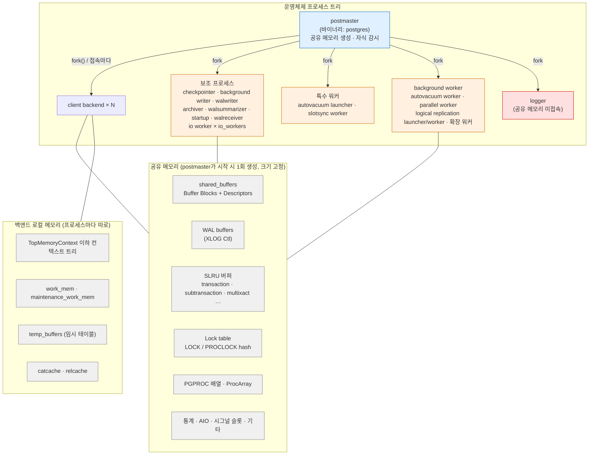
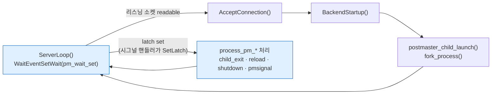
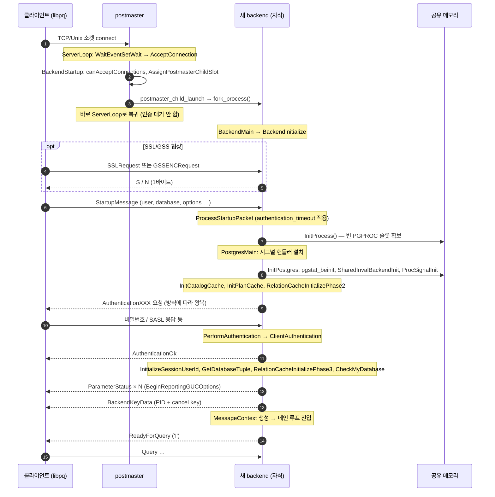
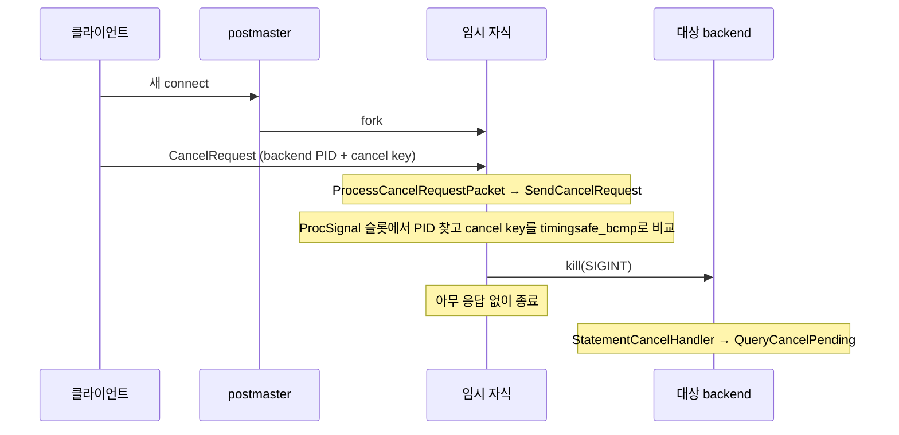
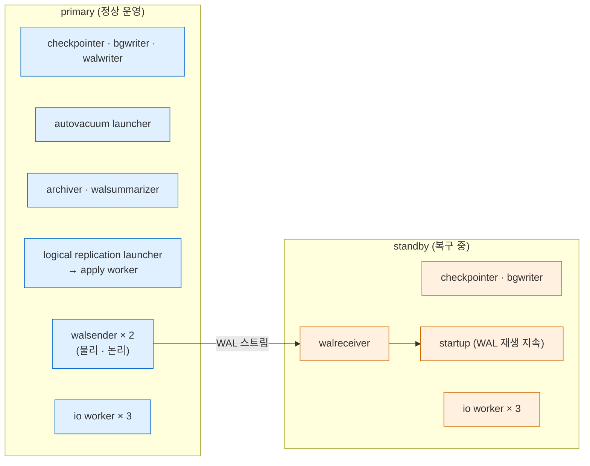
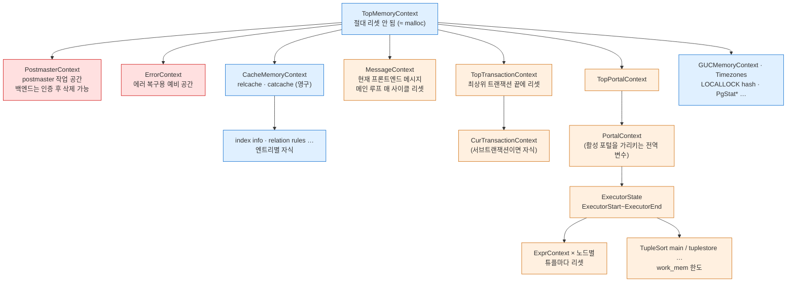
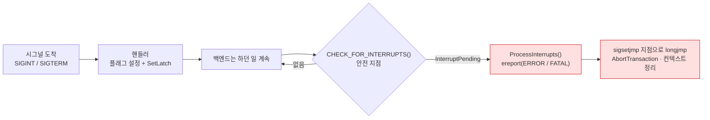
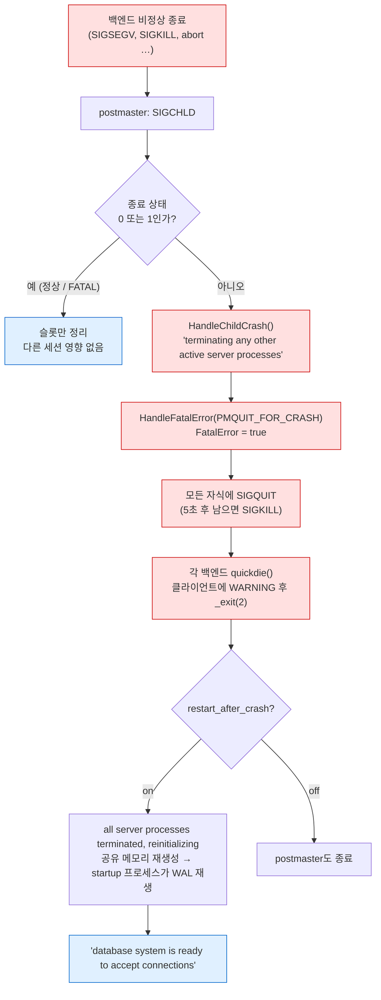

> **인덱스** [[PostgreSQL/INTERNALS/00-INDEX|내부 구조 분석서]]  ·  **이전** [[PostgreSQL/INTERNALS/01-ORIGIN-PHILOSOPHY|01. 기원·개발 언어·설계 교리]]  ·  **다음** [[PostgreSQL/INTERNALS/03-STORAGE|03. 물리 저장 구조]]

# 02. 프로세스·메모리 아키텍처

PostgreSQL 인스턴스는 **스레드가 아니라 프로세스의 집합**이다. 감독자 프로세스(postmaster) 하나가
공유 메모리를 만들고, 접속 하나마다 `fork()` 로 백엔드 프로세스를 하나씩 만들며, 체크포인트·WAL 기록·
autovacuum 같은 백그라운드 작업도 전부 별도 프로세스로 돌린다. 이 문서는 그 프로세스 트리와,
프로세스들이 나눠 쓰는 공유 메모리, 각 프로세스가 혼자 쓰는 로컬 메모리(MemoryContext 계층),
프로세스끼리 주고받는 시그널을 내부 구현 관점에서 정리한다.

근거는 로컬 PostgreSQL 18.4 임시 클러스터 실측(§12), 18.4 서버 헤더
(`$(pg_config --includedir-server)`), `REL_18_STABLE` 브랜치 소스다. 버전 의존 동작은 각 절에 명시한다.

## 0. 전체 지도



이 문서를 관통하는 설계 원칙은 세 가지다.

| 원칙 | 내용 | 결과 |
|---|---|---|
| **postmaster는 공유 메모리를 거의 만지지 않는다** | 만들기만 하고 락·PGPROC에 참여하지 않음 | 백엔드가 죽어도 postmaster는 살아남아 전체를 리셋할 수 있음 (§9.7) |
| **접속 = 프로세스** | accept 직후 곧바로 fork, 인증은 자식이 수행 | 격리는 강하지만 접속 수립 비용이 큼 → 커넥션 풀러 필요 (§11) |
| **메모리는 컨텍스트 단위로 일괄 해제** | `palloc` 한 메모리를 개별 `free` 대신 컨텍스트째 리셋 | 쿼리·트랜잭션 경계에서 누수 없이 회수 (§8) |

## 1. 용어와 기본 모델

| 용어 | 정의 | 근거 |
|---|---|---|
| postmaster | 인스턴스의 최초 프로세스. 보조 프로세스를 시작·관리하고 필요할 때 백엔드를 생성 | 공식 문서 Glossary "Postmaster (process)" |
| backend (client backend) | 클라이언트 세션 하나를 대신해 요청을 처리하는 프로세스 | Glossary "Backend (process)" |
| auxiliary process | 특정 백그라운드 작업 담당. PGPROC은 있으나 트랜잭션·heavyweight lock 불가 | `miscadmin.h` `BackendType` 주석 |
| background worker | 시스템/사용자 코드를 돌리는 범용 워커 프레임워크. 논리 복제·병렬 쿼리의 기반 | Glossary "Background worker (process)" |
| PGPROC | 프로세스마다 공유 메모리에 하나씩 있는 프로세스 기술 구조체 | `storage/proc.h` |
| `BackendType` | 프로세스 종류 열거형. `pg_stat_activity.backend_type` 의 원천 | `miscadmin.h` |

18.4 헤더의 `BackendType` 열거형은 프로세스 분류를 그대로 보여준다.

```c
/* $(pg_config --includedir-server)/miscadmin.h (18.4) 발췌 — 주석은 원문 축약 */
typedef enum BackendType
{
	B_INVALID = 0,
	/* Backends and other backend-like processes */
	B_BACKEND, B_DEAD_END_BACKEND, B_AUTOVAC_LAUNCHER, B_AUTOVAC_WORKER,
	B_BG_WORKER, B_WAL_SENDER, B_SLOTSYNC_WORKER,
	B_STANDALONE_BACKEND,
	/* Auxiliary processes. These have PGPROC entries, but they are not
	 * attached to any particular database, and cannot run transactions or
	 * even take heavyweight locks. ... except for IO workers. */
	B_ARCHIVER, B_BG_WRITER, B_CHECKPOINTER, B_IO_WORKER,
	B_STARTUP, B_WAL_RECEIVER, B_WAL_SUMMARIZER, B_WAL_WRITER,
	/* Logger is not connected to shared memory and does not have a PGPROC entry. */
	B_LOGGER,
} BackendType;
```

> **문서와 코드의 분류 차이.** 공식 Glossary는 autovacuum launcher와 logger를 "auxiliary process"에 넣지만,
> 코드(`BackendType`)에서 autovacuum launcher는 트랜잭션을 돌릴 수 있는 "backend-like" 쪽이고,
> logger는 공유 메모리에 붙지도 않는 별종이다. 이 문서는 **코드 기준 분류**를 따른다.

## 2. postmaster — 감독자 프로세스

### 2.1 이름: 바이너리는 `postgres`, 역할명은 postmaster

- 실행 파일은 `postgres` 하나다. 18.4 Homebrew 설치의 `bin/` 에는 `postmaster` 파일이 없다 (실측 V1).
- PG16에서 `postmaster` 심볼릭 링크가 제거됐다 — 16.0 릴리스 노트 "Remove symbolic links for the postmaster binary (Peter Eisentraut)".
- 그러나 **역할명으로서 postmaster**는 그대로다. 소스 파일 `src/backend/postmaster/postmaster.c`,
  Glossary 항목, 데이터 디렉토리의 `postmaster.pid`, `postmaster.opts` 모두 이 이름을 쓴다.
- 같은 `postgres` 바이너리가 인자에 따라 postmaster, 단독(single-user) 백엔드(`--single`), `-C` 파라미터 조회 등으로 동작한다.

`ps` 로 보면 postmaster만 원래 명령행을 유지하고, 자식들은 `postgres: <역할>` 로 프로세스 제목을 바꾼다.

```text
  PID  PPID COMMAND
34497     1 /opt/homebrew/Cellar/postgresql@18/18.4/bin/postgres -D $PGDATA -p 55402 -k $SOCKDIR -c listen_addresses=
34498 34497 postgres: logger
34499 34497 postgres: io worker 0
34502 34497 postgres: checkpointer
...   (전체 목록은 §5.2)
```

### 2.2 postmaster가 하는 일과 하지 않는 일

`postmaster.c` 머리 주석이 설계 의도를 직접 밝힌다 (REL_18_STABLE).

| 항목 | 소스 주석 요지 |
|---|---|
| 역할 | 프론트엔드 접속을 받아 백엔드를 fork. 시작·종료 같은 시스템 작업도 **직접 하지 않고 자식을 fork해서 시킴** |
| 공유 메모리 | 시작 시 공유 메모리와 세마포어 풀을 만들지만 "as a rule does not touch them itself" |
| PGPROC | postmaster는 PGPROC 배열의 멤버가 아니므로 lock manager 연산에 참여할 수 없음 |
| 이유 | 공유 메모리를 거의 안 건드려야 백엔드 크래시와 함께 죽지 않고, 공유 메모리 리셋으로 복구 가능 |
| 블로킹 금지 | 프론트엔드 메시지를 기다리며 블록되면 안 됨 (그래서 fork 후 인증을 자식이 함) |

즉 postmaster는 **"얇은 감독자"**다. 실제 일은 전부 자식이 하고, postmaster는 자식의 생사(SIGCHLD)만 본다.

### 2.3 메인 루프 — `ServerLoop()`

18 소스에서 postmaster 메인 루프는 `WaitEventSetWait()` 로 리스닝 소켓과 자기 latch를 함께 기다린다.



- 시그널 핸들러는 플래그만 세우고 `SetLatch(MyLatch)` 를 호출한다. 실제 처리는 루프 안의
  `process_pm_child_exit()`, `process_pm_reload_request()`, `process_pm_shutdown_request()`, `process_pm_pmsignal()` 이 한다.
  (§9.1)
- 접속 허용 상태가 바뀌면 `ConfigurePostmasterWaitSet(bool accept_connections)` 로 대기 집합을 재구성한다.

### 2.4 `postmaster.pid` — 인스턴스의 신분증

데이터 디렉토리의 `postmaster.pid` 는 줄 번호마다 의미가 고정돼 있다 (`utils/pidfile.h`).

| 줄 | 매크로 | 실측 값 |
|---|---|---|
| 1 | `LOCK_FILE_LINE_PID` | `25801` (postmaster PID) |
| 2 | `LOCK_FILE_LINE_DATA_DIR` | `$PGDATA` |
| 3 | `LOCK_FILE_LINE_START_TIME` | `1791210600` (epoch) |
| 4 | `LOCK_FILE_LINE_PORT` | `55402` |
| 5 | `LOCK_FILE_LINE_SOCKET_DIR` | `$SOCKDIR` |
| 6 | `LOCK_FILE_LINE_LISTEN_ADDR` | (빈 값 — `listen_addresses=''`) |
| 7 | `LOCK_FILE_LINE_SHMEM_KEY` | `43558125   1376256` (SysV 키·ID) |
| 8 | `LOCK_FILE_LINE_PM_STATUS` | `ready` (`PM_STATUS_READY`) |

7번 줄에 SysV 공유 메모리 키가 있는 이유는 §6.1 참고 — 메인 영역은 mmap이지만 "이미 떠 있는 postmaster가 있는지"
판별용으로 작은 SysV 세그먼트를 함께 쓴다.

### 2.5 실증 에피소드: "postmaster became multithreaded during startup"

이 문서용 클러스터를 처음 띄울 때 실제로 겪은 실패다.

```text
LOG:  listening on Unix socket "$SOCKDIR/.s.PGSQL.55402"
FATAL:  postmaster became multithreaded during startup
HINT:  Set the LC_ALL environment variable to a valid locale.
```

`postmaster.c` 의 해당 검사 주석 요지:

- macOS의 libintl은 `setlocale(..., "")` 호출 시 관련 환경변수가 모두 비어 있으면 `CFLocaleCopyCurrent()` 를 부르고, 이것이 **프로세스를 멀티스레드로 만든다**.
- postmaster는 `sigprocmask()` 를 쓰고 `exec()` 없이 `fork()` 하는데, 둘 다 멀티스레드 프로그램에서는 동작이 정의되지 않는다.
- 그래서 `pthread_is_threaded_np()` 로 검사해 멀티스레드면 FATAL로 멈춘다 (현재 이 함수가 있는 플랫폼은 macOS뿐이라고 주석에 명시).

`LC_ALL=C` 를 지정하자 정상 기동했다. **"fork without exec" 모델이 스레드와 공존할 수 없다**는
§10 논쟁의 핵심 제약이 실제로 드러난 사례다.

## 3. fork 기반 backend-per-connection

### 3.1 자식 하나가 태어나는 과정 — `postmaster_child_launch()`

모든 자식 프로세스(백엔드든 보조 프로세스든)는 `src/backend/postmaster/launch_backend.c` 의
`postmaster_child_launch()` 한 함수로 만들어진다. 비 `EXEC_BACKEND` 빌드(=Unix 기본)의 흐름:

```c
/* launch_backend.c (REL_18_STABLE) 발췌·축약 */
pid = fork_process();
if (pid == 0)				/* child */
{
	/* Close the postmaster's sockets */
	ClosePostmasterPorts(child_type == B_LOGGER);

	/* Detangle from postmaster */
	InitPostmasterChild();

	/* Detach shared memory if not needed. */
	if (!child_process_kinds[child_type].shmem_attach)
	{
		dsm_detach_all();
		PGSharedMemoryDetach();
	}

	MemoryContextSwitchTo(TopMemoryContext);
	...
	child_process_kinds[child_type].main_fn(startup_data, startup_data_len);
	pg_unreachable();		/* main_fn never returns */
}
```

| 단계 | 의미 |
|---|---|
| `fork_process()` | 부모의 주소 공간을 복제(copy-on-write). 공유 메모리 매핑·전역 변수·설정값이 그대로 상속됨 |
| `ClosePostmasterPorts()` | 리스닝 소켓 등 postmaster 전용 fd를 닫음 |
| `InitPostmasterChild()` | postmaster와 분리 — 시그널 초기화, postmaster 사망 감지 장치 설정 등 |
| shmem detach | `shmem_attach=false` 인 종류(logger 등)만 공유 메모리에서 떼어냄 |
| `main_fn` | 종류별 진입점으로 점프. 돌아오지 않음 |

종류별 진입점은 `child_process_kinds[]` 테이블에 있다.

| `BackendType` | 이름 | main_fn | shmem_attach |
|---|---|---|---|
| `B_BACKEND` | backend | `BackendMain` | true |
| `B_DEAD_END_BACKEND` | dead-end backend | `BackendMain` | true |
| `B_AUTOVAC_LAUNCHER` | autovacuum launcher | `AutoVacLauncherMain` | true |
| `B_AUTOVAC_WORKER` | autovacuum worker | `AutoVacWorkerMain` | true |
| `B_BG_WORKER` | bgworker | `BackgroundWorkerMain` | true |
| `B_WAL_SENDER` | wal sender | `NULL` (일반 백엔드로 태어나 전환) | true |
| `B_SLOTSYNC_WORKER` | slot sync worker | `ReplSlotSyncWorkerMain` | true |
| `B_ARCHIVER` | archiver | `PgArchiverMain` | true |
| `B_BG_WRITER` | bgwriter | `BackgroundWriterMain` | true |
| `B_CHECKPOINTER` | checkpointer | `CheckpointerMain` | true |
| `B_IO_WORKER` | io_worker | `IoWorkerMain` | true |
| `B_STARTUP` | startup | `StartupProcessMain` | true |
| `B_WAL_RECEIVER` | wal_receiver | `WalReceiverMain` | true |
| `B_WAL_SUMMARIZER` | wal_summarizer | `WalSummarizerMain` | true |
| `B_WAL_WRITER` | wal_writer | `WalWriterMain` | true |
| `B_LOGGER` | syslogger | `SysLoggerMain` | **false** |

walsender의 main_fn이 `NULL` 인 이유: 클라이언트는 일반 접속과 똑같이 들어오고, 시작 패킷의
`replication` 파라미터를 보고 나서야 walsender가 된다. `BackendStartup()` 소스에도
"Can change later to B_WAL_SENDER" 라는 주석이 있다.

### 3.2 fork가 주는 공짜 점심

`shmem.c` 머리 주석: Unix 환경에서는 백엔드가 공유 메모리 포인터를 **다시 설정할 필요가 없다** —
fork로 postmaster의 변수 값을 그대로 물려받기 때문이다. 공유 메모리 영역이 모든 프로세스에서
같은 가상 주소에 매핑되므로, 공유 메모리 안의 포인터를 그대로 쓸 수 있다.

### 3.3 `EXEC_BACKEND` — Windows의 사정

`launch_backend.c` 주석: Windows는 `fork()` 가 없으므로 `EXEC_BACKEND` 모드로 빌드되어
`CreateProcess()` 로 새 프로세스를 띄운다. 이 경우 상태를 상속받지 못하므로 자식이 공유 메모리에
**다시 붙고**, 전역 변수를 재초기화하고, 설정 파일을 다시 읽어서 "Unix에서 fork 직후와 같은 상태"를
인위적으로 재현한다. 다른 플랫폼에서도 테스트용으로 켤 수 있다.

### 3.4 왜 "fork 먼저, 인증은 나중에"인가

`postmaster.c` 머리 주석:

- 접속 요청을 받으면 **즉시 fork** 하고, 인증은 자식이 한다.
- 덕분에 인증 코드를 단순한 단일 스레드 스타일로 짤 수 있다 (예전의 "poor man's multitasking" 코드 불필요).
- 더 중요하게, SSL·PAM 같은 비멀티스레드 라이브러리가 블록돼도 **다른 클라이언트에 대한 서비스 거부가 생기지 않는다**.

실측(§4.3)에서도 `connection received` 로그를 찍는 PID가 이미 자식 PID다.

## 4. 접속 수립 시퀀스

### 4.1 전체 흐름



### 4.2 단계별 함수 지도 (REL_18_STABLE)

| 단계 | 함수 | 파일 | 비고 |
|---|---|---|---|
| accept | `AcceptConnection()` | `postmaster/postmaster.c` | ServerLoop 안 |
| 슬롯 확보 | `BackendStartup()` → `canAcceptConnections()`, `AssignPostmasterChildSlot()` | 같음 | 슬롯 부족 시 dead-end 자식 생성 (§4.5) |
| fork | `postmaster_child_launch()` | `postmaster/launch_backend.c` | fork 시작·종료 시각을 `conn_timing` 에 기록 |
| 시작 패킷 | `BackendMain()` → `BackendInitialize()` → `ProcessSSLStartup()`, `ProcessStartupPacket()` | `tcop/backend_startup.c` (PG18) | `STARTUP_PACKET_TIMEOUT = authentication_timeout` |
| PGPROC | `InitProcess()` | `storage/lmgr/proc.c` | 빈 슬롯 없으면 `sorry, too many clients already` |
| 메인 진입 | `PostgresMain()` | `tcop/postgres.c` | 시그널 핸들러 설치 후 `InitPostgres()` 호출 |
| 초기화 | `InitPostgres()` | `utils/init/postinit.c` | 아래 순서 |
| 인증 | `PerformAuthentication()` → `ClientAuthentication()` | `postinit.c`, `libpq/auth.c` | ps 제목이 `authentication` 으로 바뀜 |
| 키 전송 | `PqMsg_BackendKeyData` | `postgres.c` | PID + cancel key |
| 루프 | `for (;;)` → `ReadyForQuery()` → `ReadCommand()` | `postgres.c` | 매 사이클 `MemoryContextReset(MessageContext)` |

`InitPostgres()` 안의 호출 순서(소스 줄 순서 기준):
`pgstat_beinit` → `SharedInvalBackendInit` → `ProcSignalInit` → `InitCatalogCache` → `InitPlanCache`
→ `EnablePortalManager` → `RelationCacheInitializePhase2` → **`PerformAuthentication`** →
`InitializeSessionUserId` → `GetDatabaseTuple` → `RelationCacheInitializePhase3` → `CheckMyDatabase`.

즉 **카탈로그 캐시 골격은 인증 전에, DB별 relcache 완성은 인증 후에** 만들어진다.
공유 카탈로그(`pg_authid` 등)만으로 인증을 끝내고 나서야 접속 대상 DB의 카탈로그를 본다는 뜻이다
(공유 카탈로그 개념은 [[PostgreSQL/INTERNALS/06-CATALOG-OID|06. 시스템 카탈로그와 OID]]).

> REL_18_STABLE 소스 트리에서 시작 패킷 처리(`BackendMain`, `ProcessStartupPacket` 등)는
> `postmaster.c` 가 아니라 `src/backend/tcop/backend_startup.c` 에 있다. 예전 버전 문서·블로그에서
> `postmaster.c` 의 함수로 소개되는 경우가 있으나, 언제 분리됐는지는 (확인 필요).

### 4.3 실측: PG18 `log_connections` 의 단계별 소요 시간

PG18에서 `log_connections` 가 boolean에서 목록형으로 바뀌었고, `setup_durations` 옵션으로 단계별 시간을 찍을 수 있다
(18.0 릴리스 노트, Melanie Plageman).

```text
-- postgresql.conf
log_connections = 'receipt,authentication,authorization,setup_durations'

[36157] LOG:  connection received: host=[local]
[36157] LOG:  connection authenticated: user="postgres" method=trust ($PGDATA/pg_hba.conf:117)
[36157] LOG:  connection authorized: user=postgres database=postgres application_name=psql
[36157] LOG:  connection ready: setup total=7.712 ms, fork=0.331 ms, authentication=0.196 ms
[36157] LOG:  disconnection: session time: 0:00:00.016 user=postgres database=postgres host=[local]
```

- 모든 줄의 PID `36157` 은 자식(백엔드) PID다 → **`connection received` 시점에 이미 fork가 끝나 있다** (§3.4 확인).
- trust 인증이라 인증은 0.2 ms에 불과하지만, 재시작 직후 첫 접속의 setup total은 7.7 ms였다. 나머지 대부분은
  `InitPostgres()` 의 캐시 초기화 등으로 보인다 (단계 세분화 수치가 없어 추정).
- `log_connections`, `log_disconnections` 의 context는 `superuser-backend` (실측).

### 4.4 취소 요청(Cancel)은 새 접속으로 온다

쿼리 취소는 기존 연결이 아니라 **새 연결**로 `CancelRequest` 패킷을 보낸다.



- PG18에서 cancel key는 최대 256비트 (`procsignal.h` 의 `MAX_CANCEL_KEY_LENGTH 32` 바이트), 프로토콜 3.2를 양쪽이 지원할 때만 가능 (18.0 릴리스 노트).
- 패킷 처리 코드는 키 길이 0 또는 256바이트 초과를 프로토콜 위반으로 거절한다.
- 결국 `pg_cancel_backend()` 와 같은 SIGINT로 귀결된다 (§9.6).

### 4.5 dead-end backend — "too many clients" 를 알려주는 자식

`BackendStartup()` 에서 자식 슬롯이 모자라면(`CAC_TOOMANY`) postmaster는 거절 메시지를 **직접 보내지 않고**
`B_DEAD_END_BACKEND` 자식을 fork한다. 이 자식이 시작 패킷을 읽은 뒤
`FATAL: sorry, too many clients already` 를 보내고 끝난다 (`backend_startup.c`).
postmaster가 클라이언트와의 대화에서 블록되지 않는다는 원칙(§2.2)이 여기서도 지켜진다.
`InitProcess()` 에서 빈 PGPROC가 없을 때도 같은 문구의 FATAL이 난다 (`proc.c`).

## 5. 보조 프로세스 총람

### 5.1 프로세스 표

| ps 제목 / backend_type | 분류 | 역할 | 기동 조건 | 대기 이벤트 (유휴 시 실측) |
|---|---|---|---|---|
| checkpointer | aux | 체크포인트 수행, 공유 버퍼 dirty 페이지를 주기적으로 플러시 | 항상 (복구 중에도) | `CheckpointerMain` |
| background writer | aux | 체크포인트 사이에 dirty 버퍼를 미리 써서 백엔드의 직접 쓰기를 줄임 | 항상 | `BgwriterMain` |
| walwriter | aux | WAL 버퍼를 주기적으로 디스크에 기록 | 정상 운영 시 (startup 종료 후) | `WalWriterMain` |
| autovacuum launcher | special | DB를 돌며 autovacuum worker 기동 요청 | `autovacuum=on`, 정상 운영 시 | `AutovacuumMain` |
| autovacuum worker | bgworker류 | 실제 VACUUM/ANALYZE 수행. DB 하나에 접속 | launcher 요청 시 | — |
| archiver | aux | 완료된 WAL 세그먼트를 `archive_command`/`archive_library` 로 보관 | `archive_mode=on` | — |
| walsummarizer | aux | WAL 요약 파일 생성 (증분 백업용, PG17+) | `summarize_wal=on` | — |
| logical replication launcher | bgworker | 구독(subscription)별 apply worker 기동 | 정상 운영 시 | `LogicalLauncherMain` |
| logical replication apply worker | bgworker | 구독 측에서 변경 적용 | 활성 subscription 있을 때 | — |
| walsender | backend류 | 복제 클라이언트에게 WAL(물리) 또는 디코딩 결과(논리) 송신 | 복제 접속 시 | — |
| startup | aux | WAL 재생 — 크래시 복구, 아카이브 복구, standby의 지속 재생 | 기동 시 / standby 상시 | — |
| walreceiver | aux | standby에서 primary의 walsender로부터 WAL 수신 | standby + `primary_conninfo` | — |
| io worker | aux (복수) | 비동기 I/O 요청 대행 (PG18+) | `io_method=worker` (기본) | `IoWorkerMain` |
| parallel worker | bgworker | 병렬 쿼리의 작업자 | 병렬 플랜 실행 시 | — |
| slotsync worker | special | standby에서 failover 논리 슬롯 동기화 (PG17+) | `sync_replication_slots=on` | (미실측) |
| logger | 별종 | `logging_collector` 가 켜졌을 때 stderr를 받아 로그 파일에 기록 | `logging_collector=on` | pg_stat_activity에 안 나옴 |

역할 설명의 세부 내부 동작(체크포인트 알고리즘, WAL 기록, 복제 프로토콜)은
[[PostgreSQL/INTERNALS/04-MVCC-WAL|04. 트랜잭션·MVCC·WAL 내부]]에서 다룬다.
autovacuum 운용 관점은 [[PostgreSQL/14-TUNING|14. DB 튜닝 방법론]] 참고.

### 5.2 실측: 실행 상태별 프로세스 집합

primary에 `wal_level=logical`, `archive_mode=on`, `logging_collector=on`, `summarize_wal=on` 을 켜고,
같은 클러스터 안에서 논리 복제 구독을, `pg_basebackup` 으로 물리 standby를 붙인 상태의 `pg_stat_activity`:

```sql
SELECT pid, backend_type, datname, application_name
  FROM pg_stat_activity ORDER BY backend_type;
```

```text
  pid  |           backend_type           | datname  | application_name
-------+----------------------------------+----------+------------------
 34507 | archiver                         |          |
 34506 | autovacuum launcher              |          |
 34503 | background writer                |          |
 34502 | checkpointer                     |          |
 95907 | client backend                   | postgres | psql
 34500 | io worker                        |          |
 34499 | io worker                        |          |
 34501 | io worker                        |          |
 95561 | logical replication apply worker | subdb    |
 34509 | logical replication launcher     |          |
 93103 | walsender                        |          | walreceiver
 95564 | walsender                        | postgres | sub1
 34508 | walsummarizer                    |          |
 34505 | walwriter                        |          |
(14 rows)
```

같은 순간 standby 쪽 프로세스 트리:

```text
93017     1 postgres -D $PGDATA_STANDBY ...
93023 93017 postgres: io worker 0
93024 93017 postgres: io worker 1
93025 93017 postgres: io worker 2
93026 93017 postgres: checkpointer
93027 93017 postgres: background writer
93028 93017 postgres: startup waiting for 000000010000000000000004
93044 93017 postgres: walreceiver
```



관찰:

- standby에는 **walwriter, autovacuum launcher, logical replication launcher가 없다**. 복구 중에는 WAL을 생성하지도,
  VACUUM을 돌리지도 않기 때문이다. `proc.h` 주석도 "WAL writer is launched only after startup has exited" 라고 적는다.
- primary의 startup 프로세스는 기동 시 잠깐 존재하다 사라진다. 로그의 `database system was shut down at …` 를 찍은 PID(34504)가
  이후 ps 목록에 없는 것으로 확인했다.
- 공식 문서의 `backend_type` 가능 값 목록(18 `monitoring-stats`)에는 `io worker` 가 **나열돼 있지 않지만**
  18.4 실측에서는 나타난다. 문서 목록은 확장 bgworker가 추가 타입을 가질 수 있다고만 덧붙인다.

추가로 별도 시점에 포착한 프로세스:

```text
-- 병렬 쿼리 실행 중 (max_parallel_workers_per_gather=2)
 pid  | leader_pid |  backend_type
------+------------+-----------------
 4488 |            | client backend
 4491 |       4488 | parallel worker
 4493 |       4488 | parallel worker

 4491 34497 postgres: parallel worker for PID 4488
 4493 34497 postgres: parallel worker for PID 4488

-- autovacuum 동작 중
 9021 34497 postgres: autovacuum worker postgres
 9404 34497 postgres: autovacuum worker template1
 pid  |   backend_type    | query
 9021 | autovacuum worker | autovacuum: VACUUM ANALYZE public.pgbench_accounts
 9404 | autovacuum worker | autovacuum: VACUUM pg_catalog.pg_statistic
```

**parallel worker의 부모(PPID)는 리더 백엔드(4488)가 아니라 postmaster(34497)다.** 리더는 "워커를 띄워 달라"고
postmaster에 요청할 뿐이고, fork는 언제나 postmaster가 한다. autovacuum worker도 마찬가지로 launcher의 자식이 아니다.
→ "모든 프로세스는 postmaster의 직계 자식"이라는 평평한 트리 구조. 이 구조여야 postmaster가 SIGCHLD로
누구의 죽음이든 직접 감지할 수 있다 (§9.7).

### 5.3 PG18 io worker — 비동기 I/O 서브시스템

18.0 릴리스 노트: "Add an asynchronous I/O subsystem (Andres Freund, Thomas Munro, Nazir Bilal Yavuz, Melanie Plageman)".
백엔드가 여러 읽기 요청을 큐에 넣을 수 있게 되어 순차 스캔·비트맵 힙 스캔·VACUUM 등이 효율화됐다.

| 파라미터 | 값 (18 문서 / 실측) | context |
|---|---|---|
| `io_method` | `worker`(기본) / `io_uring`(`--with-liburing` 빌드 필요) / `sync` | postmaster (재시작 필요) |
| `io_workers` | 기본 3 | **sighup** (재시작 없이 증감) |
| `io_max_concurrency` | -1 → shared_buffers·최대 프로세스 수 기반 자동, 최대 64 (실측 64) | postmaster |
| `io_combine_limit` | 실측 128kB | — |

- 실측 macOS 빌드의 `io_method` enumvals는 `{sync,worker}` — io_uring은 Linux 전용이라 선택지에서 빠진다.
- `method_worker.c` 머리 주석: io worker는 **공유 메모리 제출 큐**에서 I/O를 꺼내 전통적인 동기 시스템 콜로 수행하고,
  완료 처리까지 즉시 한다. 제출자는 조건 변수로 기다린다. 깨우기는 "fan out" — 깨어난 워커가 다른 워커 둘을 더 깨운다.
  모든 OS·모든 빌드에서 쓸 수 있는 기본 방식.
- `proc.h`: `MAX_IO_WORKERS 32`, `NUM_AUXILIARY_PROCS (6 + MAX_IO_WORKERS)` — io worker용 PGPROC 슬롯 32개가 미리 예약된다.
- 실측: `io_workers` 를 3 → 5 → 2 로 바꾸고 `pg_reload_conf()` 만 했는데 프로세스가 실제로 늘고 줄었다 (V6).

```text
-- io_workers=5 후
19663 34497 postgres: io worker 0
19664 34497 postgres: io worker 2
19665 34497 postgres: io worker 1
46344 34497 postgres: io worker 3
46345 34497 postgres: io worker 4
-- io_workers=2 후
19663 34497 postgres: io worker 0
19664 34497 postgres: io worker 2
```

공유 메모리에도 AIO 영역이 상당하다: `AioHandleIOV` 2.8MB, `AioHandle` 1.6MB, `AioHandleData` 1.4MB (§6.3).
진행 중 I/O는 PG18 신규 뷰 `pg_aios` 로 볼 수 있다.

### 5.4 사라진 프로세스: 통계 수집기 (PG15)

15.0 릴리스 노트 "Store cumulative statistics system data in shared memory (Kyotaro Horiguchi, Andres Freund, Melanie Plageman)":
이전에는 통계를 **UDP 패킷으로 통계 수집기 프로세스에 보내고**, 다른 세션은 파일 시스템을 거쳐야만 읽을 수 있었다.
PG15부터 별도 수집기 프로세스가 없다. 같은 릴리스에서 `stats_temp_directory` 도 제거됐다.

현재 구조의 흔적은 실측에서 바로 보인다.

| 위치 | 이름 | 크기 (실측) |
|---|---|---|
| 공유 메모리 | `Shared Memory Stats` | 308 kB |
| 백엔드 로컬 컨텍스트 | `PgStat Shared Ref Hash`, `PgStat Shared Ref`, `PgStat Pending` | 각 수 kB~16 kB |

백엔드는 통계를 로컬(`PgStat Pending`)에 모았다가 공유 메모리로 반영한다. 그래서 다른 세션에서 곧바로 안 보일 수 있고,
`pg_stat_force_next_flush()` 로 다음 반영을 강제할 수 있다 (실측에서 사용).

### 5.5 pg_stat_activity에 안 보이는 프로세스

| 프로세스 | 보이지 않는 이유 |
|---|---|
| logger | PGPROC이 없음 (`BackendType` 주석: "not connected to shared memory") |
| postmaster | PGPROC 배열의 멤버가 아님 (§2.2) |
| `autoprewarm leader` (pg_prewarm) | `shared_preload_libraries='pg_prewarm'` 로 띄운 bgworker. ps에는 `postgres: autoprewarm leader` 로 보이나 pg_stat_activity에는 없었다 (V7). 정확한 원인(백엔드 상태 등록 여부)은 (확인 필요) |

→ **프로세스 전수 조사는 `pg_stat_activity` 가 아니라 `ps` 로 해야 한다.**

## 6. 공유 메모리

### 6.1 생성 방식

| 영역 | 방식 | 실측 설정 | 비고 |
|---|---|---|---|
| 메인 공유 메모리 | `shared_memory_type` = `mmap`(익명 mmap) / `sysv` | `mmap` | 시작 시 한 번 만들고 크기 고정 |
| SysV 인터록 | 작은 SysV 세그먼트 | `postmaster.pid` 7번 줄 | 18 문서(kernel-resources): 서버당 "a few bytes of System V shared memory (typically 48 bytes, on 64-bit platforms)" |
| 동적 공유 메모리(DSM) | `dynamic_shared_memory_type` = `posix`/`sysv`/`mmap` | `posix` | 병렬 쿼리 등이 실행 중에 만들고 없애는 영역 |
| huge pages | `huge_pages` = `off`/`on`/`try` | `try` | GUC 설명: "Use of huge pages on Linux or Windows". 실측 macOS는 `shared_memory_size_in_huge_pages = -1` |

`shmem.c` 머리 주석의 핵심 규칙:

- 공유 자료구조는 세 종류 — **고정 크기 구조체, 큐, 해시 테이블**. 각각 문자열 이름으로 식별.
- 각 모듈은 기동 시 "Shmem Index" 해시에서 자기 이름을 찾아, 없으면 할당·초기화하고 있으면 붙는다.
- **공유 메모리는 한 번 할당하면 해제할 수 없다.** 해시 테이블은 자체 free list로 버킷을 재사용할 뿐,
  한 테이블이 커졌다 줄어도 그 공간을 다른 테이블에 돌려주지 못한다.

→ 그래서 `shared_buffers`, `max_connections`, `max_locks_per_transaction` 등 공유 메모리 크기를 정하는 파라미터는
전부 context가 `postmaster` (재시작 필요)다.

### 6.2 크기 계산 — `CalculateShmemSize()`

`src/backend/storage/ipc/ipci.c` 의 `CalculateShmemSize()` 가 모듈별 크기 함수를 차례로 더한다 (REL_18_STABLE, 순서대로 발췌):

```c
size = add_size(size, BufferManagerShmemSize());
size = add_size(size, LockManagerShmemSize());
size = add_size(size, PredicateLockShmemSize());
size = add_size(size, ProcGlobalShmemSize());
size = add_size(size, XLOGShmemSize());
size = add_size(size, CLOGShmemSize());
/* ... CommitTs, SUBTRANS, TwoPhase, BackgroundWorker, MultiXact, LWLock,
       ProcArray, BackendStatus, SharedInval, PMSignal, ProcSignal,
       Checkpointer, AutoVacuum, ReplicationSlots, WalSnd, WalRcv,
       WalSummarizer, PgArch, ApplyLauncher, Stats, SlotSync ... */
size = add_size(size, AioShmemSize());
```

이 합계가 읽기 전용 GUC `shared_memory_size` 로 노출된다. 서버가 꺼진 상태에서도 `postgres -C` 로 계산할 수 있다.

```bash
$ postgres -D $PGDATA -C shared_memory_size
150
$ postgres -D $PGDATA -C shared_memory_size -c shared_buffers=1GB
1086
$ postgres -D $PGDATA -C shared_memory_size -c max_connections=1000
197
$ postgres -D $PGDATA -C num_os_semaphores
174
```

| 변경 | shared_memory_size (MB) | 증분 |
|---|---|---|
| 기준 (shared_buffers 128MB, max_connections 100) | 150 | — |
| shared_buffers 1GB | 1086 | +936 MB (버퍼 블록 + 디스크립터 등) |
| max_connections 1000 | 197 | +47 MB → **접속 슬롯 1개당 약 53 kB** (MB 반올림 값 기준 계산) |

`max_connections` 를 늘리면 실제 접속이 없어도 공유 메모리가 커진다. PGPROC, lock table 크기(`max_locks_per_transaction × MaxBackends` 기반),
백엔드 상태 배열 등이 슬롯 수에 비례해 미리 잡히기 때문이다 (§11).

### 6.3 실측: `pg_shmem_allocations` (PG13+)

13.0 릴리스 노트 "Add system view pg_shmem_allocations to display shared memory usage (Andres Freund, Robert Haas)".
기본 권한은 superuser와 `pg_read_all_stats` 롤 (실측 relacl `{postgres=arwdDxtm/postgres,pg_read_all_stats=r/postgres}`).

```sql
SELECT name, size, allocated_size, pg_size_pretty(allocated_size)
  FROM pg_shmem_allocations ORDER BY allocated_size DESC LIMIT 30;   -- 아래는 발췌
```

```text
             name              |   size    | allocated_size | pg_size_pretty
-------------------------------+-----------+----------------+----------------
 Buffer Blocks                 | 134221824 |      134221824 | 128 MB
 <anonymous>                   |   4726912 |        4726912 | 4616 kB
 XLOG Ctl                      |   4208200 |        4208256 | 4110 kB
 AioHandleIOV                  |   2850816 |        2850816 | 2784 kB
 (NULL)                        |   2276864 |        2276864 | 2224 kB
 AioHandle                     |   1603584 |        1603584 | 1566 kB
 AioHandleData                 |   1425408 |        1425408 | 1392 kB
 Buffer Descriptors            |   1048576 |        1048576 | 1024 kB
 transaction                   |    529568 |         529664 | 517 kB
 Checkpointer Data             |    524344 |         524416 | 512 kB
 Checkpoint BufferIds          |    327680 |         327680 | 320 kB
 RWConflictPool                |    326424 |         326528 | 319 kB
 Shared Memory Stats           |    315552 |         315648 | 308 kB
 subtransaction                |    267424 |         267520 | 261 kB
 Buffer IO Condition Variables |    262144 |         262144 | 256 kB
 PGPROC structures             |    145986 |         146048 | 143 kB
 ...  (이하 Backend Activity Buffer, multixact_*, notify, shmInvalBuffer,
       Fast-Path Lock Array, ProcSignal, LOCK hash 등 총 75행)
```

전체 75행, 합계 150 MB = `shared_memory_size` 150 MB와 일치 (V9).

**행 해석 규칙** (`shmem.c` 의 `pg_get_shmem_allocations()` 구현 확인):

| 행 | 의미 |
|---|---|
| 이름 있는 행 | Shmem Index에 등록된 구조체·해시 헤더 |
| `<anonymous>` | Shmem Index를 거치지 않고 `ShmemAlloc()` 으로 직접 할당된 합계 (`freeoffset - named_allocated`) |
| `name IS NULL` | 아직 쓰지 않은 여유 공간 (`totalsize - freeoffset`) |

### 6.4 구성 요소별 해부

| 구성 요소 | 행 이름 (실측) | 크기 근거 |
|---|---|---|
| **shared_buffers** | `Buffer Blocks` 128 MB | 16384 × 8 kB + 4096 (`PG_IO_ALIGN_SIZE 4096` 정렬 여유로 보임) |
| 버퍼 헤더 | `Buffer Descriptors` 1 MB | 16384 × 64 B (`BUFFERDESC_PAD_TO_SIZE` 64, 64비트) |
| 버퍼 I/O 대기 | `Buffer IO Condition Variables` 256 kB | 16384 × 16 B |
| 버퍼 해시 | `Shared Buffer Lookup Table` (헤더) | 엔트리는 `<anonymous>` 쪽 |
| **WAL buffers** | `XLOG Ctl` 4.1 MB | `wal_buffers` 기본 -1 → 512 × 8 kB = 4 MB (shared_buffers의 1/32) + 제어 구조 |
| **CLOG (pg_xact)** | `transaction` 517 kB | `transaction_buffers` 32 페이지 등 (PG17+ GUC) |
| subtransaction / multixact / commit_ts / notify / serializable | 같은 이름의 SLRU 행 | `*_buffers` GUC (실측: subtransaction 32, multixact_offset 16, multixact_member 32, notify 16, serializable 32, commit_timestamp 32) |
| **Lock table** | `LOCK hash`, `PROCLOCK hash`, `Fast-Path Lock Array`, `Fast Path Strong Relation Lock Data` | 해시 행은 2,944 B짜리 헤더뿐 |
| 직렬화(SSI) | `PREDICATELOCK*`, `RWConflictPool`, `PredXactList`, `SERIALIZABLEXID hash` | `max_pred_locks_per_transaction` |
| **PGPROC** | `PGPROC structures` 145,986 B | 아래 §6.5 |
| ProcArray | `Proc Array` 640 B, `KnownAssignedXids` (standby용) | |
| 통계 | `Shared Memory Stats`, `Backend Status Array`, `Backend Activity Buffer` | |
| 시그널 | `ProcSignal`, `PMSignalState` | §9 |
| AIO (PG18) | `AioHandle*`, `AioBackend`, `AioWorkerSubmissionQueue`, `AioWorkerControl` | §5.3 |

SLRU GUC는 17.0 릴리스 노트 "Allow the SLRU cache sizes to be configured (Andrey Borodin, Dilip Kumar, Alvaro Herrera)"로 도입됐다.

**lock table이 2,944 B밖에 안 되는 이유.** `shmem.c` 의 `ShmemInitHash()` 는 해시의 할당자를
`infoP->alloc = ShmemAllocNoError;` 로 지정한다. 즉 이름으로 등록되는 것은 해시 **헤더·디렉토리**뿐이고,
엔트리 공간은 `ShmemAlloc` 계열로 직접 잡혀 `<anonymous>` 에 합산된다. LWLock 배열도 `lwlock.c` 에서
`ShmemAlloc(spaceLocks)` 로 직접 할당한다. 그래서 `<anonymous>` 4.6 MB에는 LOCK/PROCLOCK 해시 엔트리, 버퍼 매핑 해시 엔트리,
LWLock 배열 등이 섞여 있다 (각각의 정확한 몫은 이 뷰로는 분리 불가).

### 6.5 PGPROC와 ProcArray

PGPROC은 프로세스 하나의 공유 메모리 신분증이다. 18.4 `storage/proc.h` 의 주요 필드:

| 필드 | 용도 |
|---|---|
| `sem` | 잠들 때 쓰는 세마포어 1개 (heavyweight lock 대기 등) |
| `procLatch` | 프로세스 범용 latch (§9.4) |
| `xid`, `xmin` | 현재 최상위 트랜잭션 XID, 스냅샷 xmin |
| `pid` | OS PID (prepared xact 더미면 0) |
| `pgxactoff` | ProcGlobal의 밀집 배열에서의 위치 |
| `databaseId`, `roleId`, `tempNamespaceId` | 접속 DB·롤·임시 스키마 |
| `lwWaiting`, `lwWaitMode` | LWLock 대기 상태 |
| `heldLocks`, `myProcLocks[NUM_LOCK_PARTITIONS]` | 보유 락 |
| `subxids` (`struct XidCache`) | 서브트랜잭션 XID 캐시 |
| `wait_event_info` | `pg_stat_activity.wait_event` 의 원천 |
| `fpInfoLock`, `fpRelId`, `fpVXIDLock` | fast-path 락 |
| `lockGroupMembers`, `lockGroupLink` | 병렬 쿼리 락 그룹 |

`PROC_HDR` (ProcGlobal) 는 `allProcs` 배열과 함께 `xids`, `subxidStates`, `statusFlags` 라는 **밀집(dense) 미러 배열**을 가진다.
헤더 주석: 많은 엔트리를 훑을 때(스냅샷 계산 등)는 밀집 배열을 보는 편이 간접 참조가 적고 프로세스 간 캐시 효율이 좋다.
PG14 릴리스 노트의 "Improve the speed of computing MVCC visibility snapshots on systems with many CPUs and high session counts
(Andres Freund)" … "This also improves performance when there are many idle sessions." 와 관련된 개선으로 보인다 (밀집 배열과의 직접 대응은 추정).

**슬롯 수 계산** (`postinit.c` `InitializeMaxBackends()`, `proc.c`, `proc.h`):

```text
MaxBackends = max_connections + autovacuum_worker_slots + max_worker_processes
            + max_wal_senders + NUM_SPECIAL_WORKER_PROCS
            = 100 + 16 + 8 + 10 + 2 = 136

TotalProcs  = MaxBackends + NUM_AUXILIARY_PROCS + max_prepared_transactions
            = 136 + (6 + MAX_IO_WORKERS=32) + 0 = 174

세마포어 수 = MaxBackends + NUM_AUXILIARY_PROCS = 174   ← num_os_semaphores 실측 174와 일치
```

- `NUM_SPECIAL_WORKER_PROCS 2` = autovacuum launcher + slotsync worker (`proc.h` 주석).
- `PGPROC structures` 145,986 B = 174 × 839 B 로 정확히 나눠진다. `PGProcShmemSize()` 가 `TotalProcs × (sizeof(PGPROC) + xids + subxidStates + statusFlags)` 를 더하므로, 839 B는 PGPROC 본체와 미러 배열 원소의 합이다.
- `autovacuum_worker_slots` (PG18, 기본 16)는 autovacuum worker 슬롯을 미리 잡아 두는 GUC로, 18.0 릴리스 노트에 따르면 이 상한 안에서 `autovacuum_max_workers` 를 재시작 없이 조정할 수 있게 해 준다.

### 6.6 공유 메모리 안의 동기화 수단

| 수단 | 성격 | 어디서 쓰나 |
|---|---|---|
| spinlock | 아주 짧은 임계 구역, busy-wait | 버퍼 헤더 상태 등 |
| LWLock | 공유/배타 모드 경량 락, 대기 시 세마포어로 잠듦 | 버퍼 매핑 파티션, ProcArrayLock, WALWriteLock 등 |
| heavyweight lock | SQL 수준 락(테이블·행 등), 교착 탐지 | LOCK/PROCLOCK 해시 |
| condition variable | 조건 대기 | 버퍼 I/O 완료 대기, AIO |
| latch | 프로세스 깨우기 | §9.4 |

heavyweight lock의 사용자 관점(락 모드, 교착)은 [[PostgreSQL/10-TRANSACTION|10. 트랜잭션]], 버퍼 매니저 내부는
[[PostgreSQL/INTERNALS/03-STORAGE|03. 물리 저장 구조]]에서 다룬다.

## 7. 로컬 메모리

### 7.1 로컬 메모리를 정하는 파라미터

| 파라미터 | 실측 기본값 | 단위 | 할당 주체 | 특징 |
|---|---|---|---|---|
| `work_mem` | 4 MB | **연산 노드 하나** | 정렬·해시·materialize 등 | 쿼리 하나가 여러 배를 쓸 수 있음 |
| `hash_mem_multiplier` | 2 | 배수 | 해시 연산 | 해시 한도 = `work_mem × hash_mem_multiplier` |
| `maintenance_work_mem` | 64 MB | 세션의 유지보수 작업 하나 | VACUUM, CREATE INDEX, ADD FOREIGN KEY | 세션당 동시 1개라 크게 잡아도 비교적 안전 |
| `autovacuum_work_mem` | -1 (= maintenance_work_mem) | autovacuum worker 하나 | | 워커 수만큼 곱해짐 |
| `logical_decoding_work_mem` | 64 MB | 논리 디코딩 | walsender | 넘으면 디스크로 spill |
| `temp_buffers` | 8 MB (1024 × 8 kB) | 세션 | 임시 테이블 전용 로컬 버퍼 | 세션에서 임시 테이블을 처음 쓰기 **전에만** 변경 가능 |

18 문서(runtime-config-resource)의 work_mem 경고 요지: 복잡한 쿼리는 여러 정렬·해시를 동시에 수행하고 각 연산이 work_mem까지 쓸 수 있으며,
여러 세션이 동시에 그럴 수 있으므로 **총 사용량은 work_mem의 몇 배도 될 수 있다.**

```text
최악의 로컬 메모리 ≈ 활성 세션 수 × 쿼리당 정렬·해시 노드 수 × work_mem (× hash_mem_multiplier)
                  + 병렬 워커도 각자 work_mem을 씀
```

이 값들은 PGPROC처럼 미리 잡히지 않는다. **필요할 때 `palloc` 으로 늘고**, 한도를 넘으면 임시 파일로 spill한다.
튜닝 관점은 [[PostgreSQL/14-TUNING|14. DB 튜닝 방법론]], 실행 계획 읽기는 [[PostgreSQL/11-PERFORMANCE|11. 성능]] 참고.

### 7.2 실측: work_mem 경계

```sql
SET work_mem = '1MB';
EXPLAIN (ANALYZE, COSTS OFF, TIMING OFF, SUMMARY OFF)
SELECT * FROM pgbench_accounts ORDER BY abalance, aid DESC;
```

```text
 Sort (actual rows=100000.00 loops=1)
   Sort Key: abalance, aid DESC
   Sort Method: external merge  Disk: 10488kB
   Buffers: shared hit=1640, temp read=2620 written=2634
```

```sql
SET work_mem = '64MB';   -- 같은 쿼리
```

```text
 Sort (actual rows=100000.00 loops=1)
   Sort Key: abalance, aid DESC
   Sort Method: quicksort  Memory: 14791kB
   Buffers: shared hit=1640
```

메모리 안에 다 들어가지 않으면 `external merge` + `temp read/written` 이 붙는다. 같은 데이터가 메모리에선 약 14.4 MB, 디스크에선 약 10.2 MB인 것은
디스크 포맷이 메모리 내 튜플 배열·포인터 오버헤드를 갖지 않기 때문으로 보인다 (추정).

### 7.3 실측: temp_buffers와 로컬 버퍼

```sql
CREATE TEMP TABLE t AS SELECT g, repeat('x',100) s FROM generate_series(1,20000) g;
EXPLAIN (ANALYZE, BUFFERS, COSTS OFF, TIMING OFF, SUMMARY OFF) SELECT count(*) FROM t;
```

```text
 Aggregate (actual rows=1.00 loops=1)
   Buffers: local hit=384
   ->  Seq Scan on t (actual rows=20000.00 loops=1)
         Buffers: local hit=384
```

```text
           name            | total_bytes | level
---------------------------+-------------+-------
 LocalBufferContext        |     4092144 |     2
 Local Buffer Lookup Table |       32768 |     2
```

임시 테이블은 shared_buffers가 아니라 **백엔드 로컬 버퍼**(`Buffers: local`)를 쓴다. 다른 세션이 볼 일이 없으니 공유 메모리·락이 필요 없다.
로컬 버퍼는 MemoryContext(`LocalBufferContext`) 안에 잡힌다.

### 7.4 catalog cache와 relcache

백엔드마다 시스템 카탈로그를 매번 읽지 않도록 **프로세스 로컬 캐시**를 둔다.

| 캐시 | 내용 | 컨텍스트 |
|---|---|---|
| catcache / syscache | 카탈로그 행 단위 캐시 (예: OID → pg_class 행) | `CacheMemoryContext` |
| relcache | 릴레이션 기술자 (`RelationData`: 튜플 디스크립터, 인덱스 정보, 규칙 등) | `CacheMemoryContext` + 엔트리별 자식 컨텍스트 |
| plancache | 준비된 문장 계획 | 문장별 컨텍스트 |

실측: 갓 접속한 psql 세션의 `CacheMemoryContext` 는 1 MB, 그 아래 `index info` 자식 컨텍스트가 88개
(`ident` 예: `pg_db_role_setting_databaseid_rol_index`, `pg_opclass_am_name_nsp_index`).
**캐시가 프로세스마다 따로**라는 점이 연결이 많을 때 메모리를 키우는 요인이고(§11), 다른 백엔드의 DDL을 알기 위해
공유 무효화 큐(`shmInvalBuffer`)가 필요한 이유다. 무효화 메커니즘은 [[PostgreSQL/INTERNALS/06-CATALOG-OID|06. 시스템 카탈로그와 OID]]에서 다룬다.

## 8. MemoryContext 계층

### 8.1 palloc/pfree와 CurrentMemoryContext

PostgreSQL 백엔드 코드는 `malloc`/`free` 대신 `palloc`/`pfree` 를 쓴다. `palloc` 은 **현재 메모리 컨텍스트**에서 할당한다.

```c
/* utils/palloc.h (18.4) 발췌 */
extern PGDLLIMPORT MemoryContext CurrentMemoryContext;

#define MCXT_ALLOC_HUGE			0x01	/* allow huge allocation (> 1 GB) */
#define MCXT_ALLOC_NO_OOM		0x02	/* no failure if out-of-memory */
#define MCXT_ALLOC_ZERO			0x04	/* zero allocated memory */

extern void *MemoryContextAlloc(MemoryContext context, Size size);
extern void *palloc(Size size);
extern void *palloc0(Size size);
extern void *palloc_extended(Size size, int flags);
pg_nodiscard extern void *repalloc(void *pointer, Size size);
extern void pfree(void *pointer);

static inline MemoryContext
MemoryContextSwitchTo(MemoryContext context)
{
	MemoryContext old = CurrentMemoryContext;

	CurrentMemoryContext = context;
	return old;
}
```

```c
/* utils/memutils.h (18.4) 발췌 */
#define MaxAllocSize	((Size) 0x3fffffff) /* 1 gigabyte - 1 */
#define MaxAllocHugeSize	(SIZE_MAX / 2)

#define ALLOCSET_DEFAULT_MINSIZE   0
#define ALLOCSET_DEFAULT_INITSIZE  (8 * 1024)
#define ALLOCSET_DEFAULT_MAXSIZE   (8 * 1024 * 1024)

extern void MemoryContextReset(MemoryContext context);
extern void MemoryContextDelete(MemoryContext context);
```

`src/backend/utils/mmgr/README` 가 정리한 palloc과 C 표준 malloc의 차이:

| 항목 | palloc | malloc |
|---|---|---|
| 메모리 부족 | `elog(ERROR)` 로 빠져나감. **NULL을 반환하지 않으므로 검사 불필요** (`MCXT_ALLOC_NO_OOM` 으로 변경 가능) | NULL 반환 |
| 크기 0 | 유효. NULL 아닌 청크 반환 | 구현 정의 |
| `pfree(NULL)`, `repalloc(NULL, …)` | **허용 안 함** (의도적) | `free(NULL)` 허용 |
| 상한 | `MaxAllocSize` = 1 GB − 1 (초과는 `MCXT_ALLOC_HUGE`) | 없음 |
| 해제 | 개별 `pfree` 도 되지만 **컨텍스트째 리셋**이 기본 | 개별 `free` 만 |

README의 요지: 컨텍스트의 장점은 **내용 전체를 한 번에 해제**할 수 있다는 것이다. 청크별 관리보다 빠르고 안전하며,
트랜잭션 끝에서 트랜잭션 수명 이하의 컨텍스트를 리셋해 일시 메모리를 전부 회수한다. 쿼리 끝, 튜플 하나 처리 후에도 같은 방식이다.

전형적인 사용 패턴 (설명용 예시 — 특정 소스 발췌 아님):

```c
#include "postgres.h"
#include "utils/memutils.h"

static void
process_many_rows(int nrows)
{
	MemoryContext tmpcxt;
	MemoryContext oldcxt;

	tmpcxt = AllocSetContextCreate(CurrentMemoryContext,
								   "my per-row context",
								   ALLOCSET_DEFAULT_SIZES);

	for (int i = 0; i < nrows; i++)
	{
		char	   *buf;

		oldcxt = MemoryContextSwitchTo(tmpcxt);

		buf = palloc(1024);				/* 행마다 임시 할당 */
		snprintf(buf, 1024, "row %d", i);
		/* ... buf 사용 ... */

		MemoryContextSwitchTo(oldcxt);
		MemoryContextReset(tmpcxt);		/* pfree 없이 한 번에 회수 */
	}

	MemoryContextDelete(tmpcxt);
}
```

ERROR가 나서 `longjmp` 로 빠져나가도, 이 컨텍스트는 부모 컨텍스트가 리셋될 때 함께 정리되므로 누수가 남지 않는다.
C 확장 함수 작성 시의 규칙은 [[PostgreSQL/INTERNALS/07-FUNCTION-MANAGER|07. 함수 실행 구조 (fmgr)]]에서 다룬다.

### 8.2 계층 구조



### 8.3 전역 컨텍스트 (README 기준)

`utils/memutils.h` 가 전역 변수로 노출하는 컨텍스트: `TopMemoryContext`, `ErrorContext`, `PostmasterContext`, `CacheMemoryContext`,
`MessageContext`, `TopTransactionContext`, `CurTransactionContext`, `PortalContext`.

| 컨텍스트 | 수명 | README 요지 |
|---|---|---|
| `TopMemoryContext` | 영구 | 트리의 최상위. 여기 할당은 사실상 malloc. 꼭 필요할 때만, 특히 `CurrentMemoryContext` 를 여기 둔 채 작업하지 말 것 |
| `PostmasterContext` | postmaster 수명 | 백엔드는 필요 없으면 삭제 가능. 단 비 EXEC_BACKEND 빌드에서는 postmaster가 읽어 둔 `pg_hba.conf`/`pg_ident.conf` 사본을 인증에 그대로 쓰므로 **인증 끝날 때까지 삭제 불가** |
| postmaster가 가진 것 | — | postmaster에는 `TopMemoryContext`, `PostmasterContext`, `ErrorContext` 만 있고 나머지 최상위 컨텍스트는 각 백엔드가 기동 중 만든다 |
| `CacheMemoryContext` | 영구 | relcache·catcache 등. Top과 구분할 필요는 없지만 디버깅을 위해 분리. 엔트리별 자식 컨텍스트로 규칙 파스트리 등을 쉽게 해제 |
| `MessageContext` | 메시지 하나 | 현재 명령 메시지와 그 파생물(simple Query면 파스·플랜 트리도). `PostgresMain` 외곽 루프 매 사이클 리셋 |
| `TopTransactionContext` | 최상위 트랜잭션 | 트랜잭션 종료 시 리셋. **에러 즉시가 아니라 COMMIT/ROLLBACK으로 블록을 빠져나갈 때** 정리 |
| `CurTransactionContext` | 현재 (서브)트랜잭션 | 서브트랜잭션 abort 시 버려지고, commit된 서브트랜잭션 것은 최상위 commit까지 유지 |
| `PortalContext` | 포털 실행 | 별도 컨텍스트가 아니라 **현재 활성 포털의 컨텍스트를 가리키는 전역 변수** |
| `ErrorContext` | 영구 | 에러 복구 중 전환해 쓰는 공간. 항상 수 KB를 비축해 **메모리 부족을 FATAL이 아닌 일반 ERROR로 처리**할 수 있게 함 |

실행기 쪽(README "Transient Contexts During Execution"):

- 실행기 최상위 컨텍스트(실측 이름 `ExecutorState`)는 `ExecutorStart` 에서 만들어 `ExecutorEnd` 에서 없앤다. 포털 컨텍스트의 자식.
- 각 `ExprContext` 는 전용 메모리 컨텍스트를 가지며, 보통 **튜플을 하나 꺼낼 때마다 리셋**한다. 중첩 조인에서 바깥 노드 결과를
  유지하면서 안쪽 노드가 더 자주 리셋할 수 있도록 노드마다 따로 둔다.

### 8.4 컨텍스트 구현 4종

| 구현 | 파일 | 용도 (README 요지) | 실측 개수 (유휴 세션) |
|---|---|---|---|
| `AllocSet` | `aset.c` | 기본 범용 할당기 | 139 |
| `Slab` | `slab.c` | 고정 크기 청크 전용. 꽉 찬 블록부터 채워 단편화를 줄임 | 0 |
| `Generation` | `generation.c` | 비슷한 수명의 청크 묶음 / FIFO. pfree된 공간 재사용 안 함, 블록이 비면 OS에 반환 | 1 (`tuplestore tuples`) |
| `Bump` | `bump.c` | 개별 pfree·repalloc 불가, **청크 헤더 없음** → 작은 할당이 많을 때 조밀. 리셋·삭제 때만 반환 | 1 |

### 8.5 실측: `pg_backend_memory_contexts` (PG14+)

14.0 릴리스 노트: "Add system view pg_backend_memory_contexts to report session memory usage (Atsushi Torikoshi, Fujii Masao)".
PG18에서 바뀐 점 (18.0 릴리스 노트):

- `level` 과 `pg_log_backend_memory_contexts()` 출력이 **1부터** 시작 (이전 0부터)
- `path` 컬럼 추가(부모 경로), `parent` 컬럼 제거
- `type` 컬럼 추가 (AllocSet 등)

```text
-- 18.4 컬럼
 name | ident | type | level | path (integer[]) | total_bytes | total_nblocks | free_bytes | free_chunks | used_bytes
```

```sql
SELECT level, repeat('  ', level-1) || name AS name, type, total_bytes, used_bytes
  FROM pg_backend_memory_contexts WHERE level <= 2 ORDER BY path;
```

```text
 level |                       name                       |   type   | total_bytes | used_bytes
-------+--------------------------------------------------+----------+-------------+------------
     1 | TopMemoryContext                                 | AllocSet |       99456 |      93656
     2 |   Type information cache                         | AllocSet |       24624 |      21952
     2 |   Operator lookup cache                          | AllocSet |       24576 |      13760
     2 |   MessageContext                                 | AllocSet |       65536 |      36552
     2 |   smgr relation table                            | AllocSet |       32768 |      15864
     2 |   PgStat Pending                                 | AllocSet |       16384 |      14392
     2 |   TopTransactionContext                          | AllocSet |        8192 |        416
     2 |   TransactionAbortContext                        | AllocSet |       32768 |        240
     2 |   TopPortalContext                               | AllocSet |        8192 |        504
     2 |   Relcache by OID                                | AllocSet |       16384 |      12776
     2 |   CacheMemoryContext                             | AllocSet |     1048576 |     632544
     2 |   LOCALLOCK hash                                 | AllocSet |       16384 |      11720
     2 |   WAL record construction                        | AllocSet |       50200 |      43800
     2 |   GUCMemoryContext                               | AllocSet |       65536 |      17304
     2 |   Timezones                                      | AllocSet |      104112 |     101440
     2 |   ErrorContext                                   | AllocSet |        8192 |        240
   ... (level 2 발췌 — 실제로는 Record information cache, search_path processing cache,
        RowDescriptionContext, Portal hash, PrivateRefCount, MdSmgr 등 더 있음)
```

```text
-- 요약
 count | pg_size_pretty
-------+----------------
   137 | 2138 kB
```

- 이 뷰는 **자기 세션**의 컨텍스트만 보여준다. 다른 백엔드는 다음 절의 함수로 로그에 찍게 한다.
- 유휴 psql 세션 하나의 컨텍스트 합계가 약 2.1 MB. 이 중 절반이 `CacheMemoryContext`(1 MB)다.
- 권한: 뷰는 superuser와 `pg_read_all_stats` 가 SELECT 가능 (실측 relacl).

### 8.6 실측: `pg_log_backend_memory_contexts()` 로 실행 중 백엔드 들여다보기

세션 A (`work_mem=64MB`):

```sql
SELECT pg_sleep(4)
  FROM (SELECT g FROM generate_series(1,500000) g ORDER BY g DESC) s
 LIMIT 1;
```

세션 B:

```sql
SELECT pg_log_backend_memory_contexts(pid)
  FROM pg_stat_activity WHERE application_name = 'memdemo';
```

세션 A의 서버 로그 (발췌, level 3 이상은 실행기 관련만):

```text
[86038] LOG:  logging memory contexts of PID 86038
[86038] LOG:  level: 1; TopMemoryContext: 99456 total in 5 blocks; 5936 free (9 chunks); 93520 used
[86038] LOG:  level: 2; MessageContext: 32768 total in 3 blocks; 3808 free (2 chunks); 28960 used
[86038] LOG:  level: 2; TopPortalContext: 8192 total in 1 blocks; 7688 free (0 chunks); 504 used
[86038] LOG:  level: 3; PortalContext: 1024 total in 1 blocks; 632 free (0 chunks); 392 used: <unnamed>
[86038] LOG:  level: 4; ExecutorState: 4210736 total in 3 blocks; 3680 free (3 chunks); 4207056 used
[86038] LOG:  level: 5; tuplestore tuples: 16777216 total in 12 blocks (500000 chunks); 776416 free (0 chunks); 16000800 used
[86038] LOG:  level: 5; TupleSort main: 32816 total in 2 blocks; 6832 free (8 chunks); 25984 used
[86038] LOG:  level: 6; TupleSort sort: 8192 total in 1 blocks; 7952 free (0 chunks); 240 used
[86038] LOG:  level: 7; Caller tuples: 8192 total in 1 blocks; 7952 free (0 chunks); 240 used
[86038] LOG:  level: 5; printtup: 8192 total in 1 blocks; 7952 free (0 chunks); 240 used
[86038] LOG:  level: 5; ExprContext: 8192 total in 1 blocks; 7952 free (0 chunks); 240 used
[86038] LOG:  level: 2; CacheMemoryContext: 524288 total in 7 blocks; 71088 free (0 chunks); 453200 used
[86038] LOG:  level: 2; ErrorContext: 8192 total in 1 blocks; 7952 free (5 chunks); 240 used
[86038] LOG:  Grand total: 22421192 bytes in 255 blocks; 1185648 free (301 chunks); 21235544 used
```

읽는 법:

- 경로 `TopPortalContext → PortalContext → ExecutorState → …` 가 §8.2 계층 그대로다.
- `tuplestore tuples` (Generation 컨텍스트, 16 MB, 500000 청크): `generate_series()` 의 Function Scan이 결과를 **tuplestore에 물질화**한 것.
  500000행 × 32 B ≈ 16 MB이고 work_mem(64 MB) 안이라 메모리에 남았다.
- 정렬은 `TupleSort main` 이 32 kB에 불과하다. `LIMIT 1` 때문에 top-N heapsort가 선택됐기 때문이다 — 같은 쿼리의 EXPLAIN:

```text
   ->  Sort (actual rows=1.00 loops=1)
         Sort Key: g DESC
         Sort Method: top-N heapsort  Memory: 25kB
         ->  Function Scan on generate_series g (actual rows=500000.00 loops=1)
```

- 이 함수는 대상 백엔드에 ProcSignal(`PROCSIG_LOG_MEMORY_CONTEXT`)을 보내고, 대상이 **다음 인터럽트 확인 시점에 스스로** 로그를 쓴다 (§9.5).
  그래서 결과가 호출자에게 돌아오지 않고 서버 로그에 남는다.
- 권한: 기본 superuser 전용 (실측 proacl `{postgres=X/postgres}`), GRANT로 위임 가능.

## 9. 시그널 처리

### 9.1 postmaster가 받는 시그널

`postmaster.c` 의 `pqsignal()` 설치부 (REL_18_STABLE):

| 시그널 | 핸들러 | 의미 |
|---|---|---|
| `SIGHUP` | `handle_pm_reload_request_signal` | 설정 다시 읽기 → 자식들에게도 SIGHUP 전달 (§9.6) |
| `SIGTERM` | `handle_pm_shutdown_request_signal` | **smart** shutdown |
| `SIGINT` | 같음 | **fast** shutdown |
| `SIGQUIT` | 같음 | **immediate** shutdown |
| `SIGUSR1` | `handle_pm_pmsignal_signal` | 자식이 보내는 요청(PMSignal: 워커 기동 요청 등) |
| `SIGUSR2` | `dummy_handler` | 미사용, 자식용 예약 |
| `SIGCHLD` | `handle_pm_child_exit_signal` | 자식 종료 → 정상/크래시 판정 (§9.7) |
| `SIGALRM`, `SIGPIPE` 등 | `SIG_IGN` | 무시 |

shutdown 3모드(18 문서 server-shutdown 요지):

| pg_ctl `-m` | postmaster가 받는 시그널 | 동작 |
|---|---|---|
| smart | SIGTERM | 새 접속 거부, **기존 세션이 스스로 끝날 때까지** 대기 |
| fast (기본) | SIGINT | 새 접속 거부, 모든 서버 프로세스에 SIGTERM → 트랜잭션 abort 후 종료 |
| immediate | SIGQUIT | 모든 자식에 SIGQUIT, 5초 내 안 죽으면 SIGKILL. 정상 종료 처리 없이 끝 → 다음 기동 때 WAL 재생 |

소스에서도 `SIGKILL_CHILDREN_AFTER_SECS 5` 로 확인된다. 문서는 **postmaster에 SIGKILL을 보내지 말라**고 한다 —
공유 메모리·세마포어를 반납하지 못하고, 자식에게 시그널을 전달하지도 못하기 때문이다.

### 9.2 일반 백엔드가 받는 시그널

`postgres.c` `PostgresMain()` 설치부 (postmaster 자식일 때):

| 시그널 | 핸들러 | 의미 | 보내는 쪽 예 |
|---|---|---|---|
| `SIGHUP` | `SignalHandlerForConfigReload` | 다음 유휴 시점에 설정 다시 읽기 | postmaster (reload 전파) |
| `SIGINT` | `StatementCancelHandler` | **현재 쿼리 취소** | `pg_cancel_backend()`, CancelRequest |
| `SIGTERM` | `die` | 현재 쿼리 취소 **후 세션 종료** | `pg_terminate_backend()`, fast shutdown |
| `SIGQUIT` | `quickdie` | 즉시 종료 (정리 없음) | postmaster (크래시 리셋 / immediate) |
| `SIGUSR1` | `procsignal_sigusr1_handler` | ProcSignal 다중화 (§9.5) | 다른 백엔드·보조 프로세스 |
| `SIGUSR2` | `SIG_IGN` | — | |
| `SIGPIPE` | `SIG_IGN` | 클라이언트 단절은 write 에러로 처리 | |
| `SIGFPE` | `FloatExceptionHandler` | 부동소수 예외 → ERROR | |

단독 백엔드(`--single`)에서는 `SIGQUIT` 도 `die` 로 처리한다 — 키보드로 SIGQUIT은 쉽게 나오지만 SIGTERM은 그렇지 않기 때문이라고 주석에 적혀 있다.

### 9.3 핸들러는 플래그만 세운다 — 인터럽트 지연 처리

```c
/* postgres.c die() / StatementCancelHandler() 의 핵심 (REL_18_STABLE 발췌·축약) */
InterruptPending = true;
ProcDiePending = true;        /* die() */
/* 또는 */
InterruptPending = true;
QueryCancelPending = true;    /* StatementCancelHandler() */

SetLatch(MyLatch);            /* 잠들어 있으면 깨움 */
```



- 시그널 핸들러 안에서 메모리 할당·락·ereport를 하면 위험하므로, **실제 처리는 코드 곳곳의 `CHECK_FOR_INTERRUPTS()` 안전 지점**에서 한다.
- 오래 도는 루프(정렬, 스캔, 함수 실행)가 `CHECK_FOR_INTERRUPTS()` 를 부르지 않으면 취소가 먹지 않는다. C 확장 작성 시 주의점이다.
- `PostgresMain` 은 `sigsetjmp(local_sigjmp_buf, 1)` 로 에러 복귀 지점을 잡는다. ERROR는 여기로 longjmp해 트랜잭션을 abort하고 메인 루프로 돌아간다 (§8의 컨텍스트 리셋이 메모리 정리를 담당).

### 9.4 latch — 잠든 프로세스를 깨우는 장치

`storage/latch.h` (18.4) 머리 주석 요지:

- latch는 "프로세스가 설정될 때까지 잠들 수 있는 boolean". 다른 프로세스나 같은 프로세스의 시그널 핸들러가 설정할 수 있다.
- 시그널을 받으면 플래그를 세우고 `pg_usleep()`/`select()` 로 기다리는 흔한 패턴은, 시그널이 잠들기 직전에 오면 놓치는 **경쟁 조건**이 있다.
  latch는 폴링 없이 이를 해결한다.
- 연산 3개: `SetLatch`, `ResetLatch`, `WaitLatch`. 올바른 패턴은 **Reset → 할 일 확인 → Wait** 순서.
- 공유 latch는 공유 메모리에 있고 `OwnLatch` 한 프로세스만 기다릴 수 있지만, 누구나 설정할 수 있다. 보조 프로세스 신호는 `PGPROC.procLatch` 를 쓰는 것이 권장.

```c
/* latch.h 주석의 권장 패턴 */
for (;;)
{
	ResetLatch();
	if (work to do)
		Do Stuff();
	WaitLatch();
}
```

깨우는 실제 수단 (`waiteventset.c`, `latch.c` REL_18_STABLE):

| 대기 구현 | 경쟁 조건 회피 방법 |
|---|---|
| epoll (Linux) | `SIGURG` 를 블록해 두고 `signalfd()` 로 소비 |
| kqueue (macOS·BSD) | `EVFILT_SIGNAL` 로 `SIGURG` 대기 |
| poll | self-pipe 트릭 — 핸들러가 파이프에 1바이트 씀 |
| Windows | 자식에게 상속되는 Windows event |

다른 프로세스의 latch를 설정하면 `SetLatch()` 가 소유자 PID를 보고 `WakeupOtherProc(owner_pid)` → `kill(pid, SIGURG)` 를 보낸다.
상대가 잠들어 있지 않으면(`maybe_sleeping` false) 시그널을 생략한다.

`WaitEventSet` (`storage/waiteventset.h`) 은 latch와 소켓 readable/writeable, `WL_POSTMASTER_DEATH`, 타임아웃을 함께 기다리는 상위 API다.
실측 유휴 보조 프로세스의 wait_event(`CheckpointerMain`, `WalWriterMain`, `IoWorkerMain` …)가 모두 `Activity` 타입인 것은
이들이 메인 루프에서 latch를 기다리며 자는 중이라는 뜻이다.

### 9.5 SIGUSR1 위의 다중화 — ProcSignal

시그널 번호는 한정돼 있으므로, 백엔드 간 요청은 대부분 **공유 메모리의 ProcSignal 슬롯에 사유 플래그를 세우고 SIGUSR1** 을 보낸다.
수신 측 `procsignal_sigusr1_handler` 가 어떤 사유가 세워졌는지 확인한다. 18.4 `storage/procsignal.h` 의 사유 목록:

| `ProcSignalReason` | 용도 |
|---|---|
| `PROCSIG_CATCHUP_INTERRUPT` | 공유 무효화 큐(sinval) 따라잡기 |
| `PROCSIG_NOTIFY_INTERRUPT` | LISTEN/NOTIFY |
| `PROCSIG_PARALLEL_MESSAGE` | 병렬 워커 메시지 |
| `PROCSIG_WALSND_INIT_STOPPING` | walsender 종료 준비 |
| `PROCSIG_BARRIER` | 전역 barrier (예: `PROCSIGNAL_BARRIER_SMGRRELEASE` — smgr 파일 닫기) |
| `PROCSIG_LOG_MEMORY_CONTEXT` | `pg_log_backend_memory_contexts()` (§8.6) |
| `PROCSIG_PARALLEL_APPLY_MESSAGE` | 논리 복제 병렬 apply |
| `PROCSIG_RECOVERY_CONFLICT_*` (7종) | standby 복구 충돌: DATABASE, TABLESPACE, LOCK, SNAPSHOT, LOGICALSLOT, BUFFERPIN, STARTUP_DEADLOCK |
| `PROCSIG_SLOTSYNC_MESSAGE` | slotsync 중지 요청 |

### 9.6 SQL 함수 → 시그널 매핑 (`signalfuncs.c`)

| SQL 함수 | 대상 | 시그널 | 실측 클라이언트 메시지 |
|---|---|---|---|
| `pg_cancel_backend(pid)` | 백엔드 | `SIGINT` | `ERROR:  canceling statement due to user request` |
| `pg_terminate_backend(pid [, timeout])` | 백엔드 | `SIGTERM` | `FATAL:  terminating connection due to administrator command` |
| `pg_reload_conf()` | **postmaster** (`PostmasterPid`) | `SIGHUP` | 로그 `received SIGHUP, reloading configuration files` |
| `pg_rotate_logfile()` | postmaster 경유 logger | `SendPostmasterSignal(PMSIGNAL_ROTATE_LOGFILE)` (SIGUSR1 계열 PMSignal) | `logging_collector` 꺼져 있으면 WARNING 후 false |

- `pg_signal_backend()` 는 `setsid()` 가 있는 빌드(`HAVE_SETSID`)에서 `kill(-pid, sig)` 로 **백엔드의 프로세스 그룹 전체**에 보내고, 없으면 `kill(pid, sig)` 를 쓴다.
- postmaster는 SIGHUP을 받으면 자기 설정을 다시 읽은 뒤 `SignalChildren(SIGHUP, btmask_all_except(B_DEAD_END_BACKEND))` 로 dead-end 자식을 뺀 모든 자식에게 전달한다.
- 권한: 같은 롤이거나 `pg_signal_backend` 롤 멤버. autovacuum worker 대상은 `pg_signal_autovacuum_worker` (`ROLE_PG_SIGNAL_AUTOVACUUM_WORKER`) 권한 검사가 따로 있다.
- `pg_cancel_backend` / `pg_terminate_backend` 의 proacl은 NULL(=PUBLIC 실행 가능)이고, 권한 검사는 함수 내부에서 한다 (실측).
- 시스템 함수 전반의 실행 경로는 [[PostgreSQL/INTERNALS/08-SYSTEM-FUNCTIONS|08. 기본 제공 시스템 함수와 실행 경로]]에서 다룬다.

### 9.7 백엔드 하나가 죽으면 왜 전체가 리셋되는가



**판정 규칙** (`postmaster.c` `CleanupBackend()` 주석): 백엔드가 "ugly way"로 죽으면 다른 모든 백엔드를 quickdie시킨다.
종료 상태가 0(정상) 또는 1(FATAL 종료)이면 정상으로 본다.

```c
#define EXIT_STATUS_0(st)  ((st) == 0)
#define EXIT_STATUS_1(st)  (WIFEXITED(st) && WEXITSTATUS(st) == 1)
...
if (!EXIT_STATUS_0(exitstatus) && !EXIT_STATUS_1(exitstatus))
	crashed = true;
```

**왜 전체 리셋인가.** 죽은 프로세스가 공유 메모리를 쓰던 도중이었다면 — 스핀락이나 LWLock을 쥔 채로, 버퍼 페이지를 반쯤 고친 채로,
ProcArray를 갱신하던 중에 — 공유 상태가 깨져 있을 수 있다. 그 상태를 검증할 방법이 없으므로
**모두 죽이고, 공유 메모리를 새로 만들고, 디스크의 WAL로부터 일관된 상태를 재구성**한다. `quickdie()` 의 주석이 이를 명시한다.

```c
/* postgres.c quickdie() 끝부분 (REL_18_STABLE) */
	/*
	 * We DO NOT want to run proc_exit() or atexit() callbacks -- we're here
	 * because shared memory may be corrupted, so we don't want to try to
	 * clean up our transaction.  Just nail the windows shut and get out of
	 * town.  The callbacks wouldn't be safe to run from a signal handler,
	 * anyway.
	 *
	 * Note we do _exit(2) not _exit(0).  This is to force the postmaster into
	 * a system reset cycle if someone sends a manual SIGQUIT to a random
	 * backend.  This is necessary precisely because we don't clean up our
	 * shared memory state.  ...
	 */
	_exit(2);
```

**실측** (V12): `pg_sleep(30)` 중인 백엔드 하나에 `kill -9`, 무관한 다른 세션도 `pg_sleep(30)` 중.

```text
[34497] LOG:  client backend (PID 19256) was terminated by signal 9: Killed: 9
[34497] DETAIL:  Failed process was running: select pg_sleep(30)
[34497] LOG:  terminating any other active server processes
[34497] LOG:  all server processes terminated; reinitializing
[19666] LOG:  database system was interrupted; last known up at 2026-10-05 23:32:47 KST
[19669] FATAL:  the database system is in recovery mode
[19666] LOG:  database system was not properly shut down; automatic recovery in progress
[19666] LOG:  redo starts at 0/3000028
[19666] LOG:  redo done at 0/70F42F8 system usage: CPU: user: 0.05 s, system: 0.01 s, elapsed: 0.07 s
[19667] LOG:  checkpoint starting: end-of-recovery immediate wait
[19667] LOG:  checkpoint complete: wrote 4901 buffers (29.9%), ...
[34497] LOG:  database system is ready to accept connections
[19715] LOG:  logical replication apply worker for subscription "sub1" has started
```

무관했던 세션이 받은 메시지:

```text
WARNING:  terminating connection because of crash of another server process
DETAIL:  The postmaster has commanded this server process to roll back the current transaction and exit,
         because another server process exited abnormally and possibly corrupted shared memory.
HINT:  In a moment you should be able to reconnect to the database and repeat your command.
server closed the connection unexpectedly
```

리셋 전후 프로세스 비교:

| 프로세스 | 크래시 전 PID | 크래시 후 PID |
|---|---|---|
| postmaster | 34497 | **34497 (유지)** |
| logger | 34498 | **34498 (유지)** — 공유 메모리 미접속이라 리셋 대상 아님 |
| checkpointer | 34502 | 19667 |
| background writer | 34503 | 19668 |
| walwriter | 34505 | 19710 |
| io worker 0~2 | 34499~34501 | 19663~19665 |
| logical replication apply worker | 95561 | 19715 |

- postmaster가 살아남아 리셋을 지휘할 수 있는 것이 §2.2 "공유 메모리를 만지지 않는다" 원칙의 보상이다.
- 리셋 직후 접속 시도(PID 19669)는 `the database system is in recovery mode` 로 거절됐다.
- `restart_after_crash` (기본 on, context sighup)를 off로 하면 재초기화하지 않고 종료한다. 외부 클러스터 관리 도구가 재기동·failover를 직접 판단하게 하려는 경우에 고려하는 설정이다.
- 반대로 **FATAL(종료 상태 1)이나 `pg_terminate_backend`** 는 리셋을 일으키지 않는다. 운영 중 세션을 끊을 때 `kill -9` 대신 반드시 SQL 함수나 `kill -TERM` 을 써야 하는 이유다.
- WAL 재생 내부는 [[PostgreSQL/INTERNALS/04-MVCC-WAL|04. 트랜잭션·MVCC·WAL 내부]] 참고.

## 10. 프로세스 vs 스레드

### 10.1 프로세스 모델이 주는 것과 치르는 것

| 측면 | 프로세스 모델의 이점 | 비용 |
|---|---|---|
| 격리 | 한 세션의 로컬 메모리 오염이 다른 세션에 직접 번지지 않음. OS가 주소 공간을 지켜줌 | — |
| 장애 처리 | 크래시 감지가 SIGCHLD로 명확. postmaster가 살아남아 재초기화 (§9.7) | 그래도 공유 메모리 오염 가능성 때문에 전체 리셋은 피할 수 없음 |
| 코드 단순성 | 전역 변수를 "세션 상태"로 자유롭게 사용, 인증 등을 단일 스레드 스타일로 작성 (§3.4) | 이후 스레드화를 어렵게 만드는 부채 |
| 라이브러리 | 스레드 안전하지 않은 라이브러리(`setlocale` 등)도 사용 가능 | macOS 멀티스레드 가드 같은 함정 (§2.5) |
| 연결 비용 | — | 접속마다 fork + 캐시 재구축 (§11) |
| 메모리 | — | catcache·relcache·plancache가 **프로세스마다 중복** (§7.4) |
| 공유 메모리 고정 | — | 시작 시 크기 확정, 동적 확장 불가 (§6.1) |

### 10.2 hackers의 멀티스레드 전환 논의 (확인된 범위)

| 시점 | 사건 | 출처 |
|---|---|---|
| 2023-06-05 | Heikki Linnakangas가 pgsql-hackers에 "Let's make PostgreSQL multi-threaded" 게시 | postgresql.org message-id `31cc6df9-53fe-3cd9-af5b-ac0d801163f4@iki.fi` |
| 2023 | PGConf.EU 2023 발표 "Multi-threaded PostgreSQL?" (Heikki Linnakangas) | 컨퍼런스 영상·wiki |
| 2024-05-30 | PGConf.dev 2024 발표 "Multi-threaded PostgreSQL?" (Heikki Linnakangas) | pgevents.ca 세션 페이지 |
| 지속 | PostgreSQL wiki "Multithreading" 페이지에서 과제·진행 상황 정리 | wiki.postgresql.org/wiki/Multithreading |

2023-06-05 메일의 요지 (메일 원문 기준 요약):

- PGCon 논의에서 멀티프로세스 → 단일 프로세스·멀티스레드 전환이 좋다는 상당한 합의가 있었고, 이를 명시적으로 확인하려는 글.
- 첫 단계는 **"one thread per connection"** — 백엔드 프로세스를 백엔드 스레드로 그대로 치환. 스레드 풀 등은 이후 과제.
- 한 릴리스에 끝낼 수 없으므로 **GUC로 프로세스/스레드 모델을 선택**하는 과도기를 두고, 확장은 control 파일에 스레드 안전 여부를 표시.
- 걸림돌로 제시된 것:

| 걸림돌 | 내용 | 이 문서와의 연결 |
|---|---|---|
| 전역 변수 | 전역·정적 변수 1666개(메일 시점 수치). 세션별 상태는 thread-local로 바꿔야 함 | §1 `MyProcPid`, `MyLatch`, `CurrentMemoryContext` 등 |
| 시그널 | latch의 SIGURG, procsignal의 SIGUSR1을 다른 신호 수단으로 재작성해야 함 | §9.4, §9.5 |
| PID 노출 | `pg_stat_activity.pid`, `pg_terminate_backend()` 등은 대체하거나 가짜 PID 부여 필요 | §9.6 |
| 크래시 처리 | 모든 것이 한 프로세스면 postmaster 재시작 메커니즘을 안전하게 하기 어려움 | §9.7 |
| 라이브러리 | `setlocale()` 대신 `uselocale()` 같은 스레드 안전 버전, PL/Python의 GIL 문제 | §2.5 |

**현재 상태에 대한 판단.** 이 문서가 확인한 사실은 다음까지다.

- PG18.4는 여전히 프로세스 모델이다 (실측 전체가 그 증거). 스레드 모드를 고르는 GUC는 18.4에 없다 (`pg_settings` 에 해당 파라미터 없음 — 이름이 정해진 적이 없으므로 "없다"는 관찰 수준의 확인).
- wiki에는 스레드 안전 함수로의 치환 등 준비 작업이 진행 중인 것으로 정리돼 있다. 개별 커밋 단위의 진척과 목표 릴리스는 (확인 필요).

## 11. 연결 비용과 커넥션 풀러

### 11.1 연결 하나의 비용 구성

| 비용 | 발생 시점 | 근거 |
|---|---|---|
| fork | 접속마다 | §3.1. 실측 `fork=0.331 ms` |
| 인증 | 접속마다 | 방식에 따라 다름. trust 0.196 ms, SCRAM이면 해시 반복 비용 추가 |
| `InitPostgres()` | 접속마다 | 공유 무효화·ProcSignal 등록, 카탈로그 캐시·relcache 초기화 (§4.2) |
| 캐시 워밍 | 접속 후 첫 쿼리들 | catcache·relcache·plancache가 비어 있어 카탈로그를 다시 읽음. 세션이 짧으면 매번 버림 |
| 로컬 메모리 | 세션 수명 | 유휴 세션도 컨텍스트 약 2 MB (§8.5) |
| 공유 메모리 슬롯 | **설정 시점(재시작)** | `max_connections` 1개당 약 53 kB가 실제 접속과 무관하게 선점 (§6.2) |
| 스냅샷 계산 | 매 스냅샷 | ProcArray를 훑음. PG14에서 개선됐으나 세션 수와 무관하지 않음 (§6.5) |

### 11.2 실측: 매 트랜잭션마다 재접속하면

`pgbench -S` (SELECT 1건), 클라이언트 4, 5초. `-C` 는 트랜잭션마다 새 연결 (log_connections 끈 상태, Apple M5 10코어, Unix 소켓).

```bash
pgbench -n -S -c 4 -j 2 -T 5 postgres        # 연결 유지
pgbench -n -S -c 4 -j 2 -T 5 -C postgres     # 매번 재접속
```

| 회차 | 연결 유지 TPS | `-C` TPS | `-C` 평균 연결 시간 | 배율 |
|---|---|---|---|---|
| 1 | 142,400 | 1,760 | 1.132 ms | 약 81배 |
| 2 | 152,479 | 1,736 | 1.147 ms | 약 88배 |

- 쿼리 자체(latency 0.026 ms)보다 **연결 수립(약 1.1 ms)이 40배 이상 비싸다**. 네트워크·TLS·SCRAM이 끼면 차이는 더 커질 것이다 (이 실측 범위 밖, 추정).
- `log_connections` 를 켠 상태에서는 `-C` TPS가 1,585로 더 낮았다 — 로그 기록도 연결 비용의 일부다.

### 11.3 그래서 풀러가 필요하다

클라이언트 연결 수천 개를 풀러가 받아 **서버 연결(=backend 프로세스) 수십 개**로 다중화하고,
`max_connections` 는 작게 유지하는 것이 기본 구도다. 풀러는 애플리케이션 내장 풀일 수도, PgBouncer 같은 외부 프록시일 수도 있다.

내부 구조와 연결해 정리하면:

| 내부 사실 | 풀러가 해결하는 것 |
|---|---|
| 접속 = fork + InitPostgres + 캐시 워밍 | 서버 연결을 재사용해 이 비용을 1회로 |
| 프로세스마다 캐시 중복 | 백엔드 수 자체를 줄임 |
| `max_connections` 가 공유 메모리·PGPROC·락 테이블 크기를 결정 | 서버 쪽 연결 수를 작게 유지 가능 |
| 활성 백엔드가 CPU 코어보다 많으면 LWLock 경합·컨텍스트 스위칭 증가 | 동시 실행 수를 제한 (일반론 — 이 문서에서 수치 실측 안 함) |

외부 풀러(대표적으로 PgBouncer)는 보통 세션 단위·트랜잭션 단위·문장 단위 풀링 모드를 제공한다. 트랜잭션 단위 풀링에서는 서버 연결이
트랜잭션마다 다른 클라이언트에 배정되므로, **세션 상태에 의존하는 기능**(SET으로 바꾼 GUC, 임시 테이블, 세션 advisory lock,
LISTEN, 서버 측 prepared statement 등)이 깨질 수 있다는 점에 주의한다 — 정확한 지원 범위는 풀러의 버전별 문서로 확인할 것.
PostgreSQL 18.4 코어에는 내장 커넥션 풀러가 없다 (설정 파라미터·프로세스 목록 어디에도 해당 구성 요소가 없음).

## 12. 실증 기록 (PostgreSQL 18.4)

로컬 Homebrew PostgreSQL 18.4 (aarch64-apple-darwin, Apple M5) 임시 클러스터, Unix 소켓 전용(`listen_addresses=''`).
`initdb --auth=trust -E UTF8 --locale=C`. standby는 같은 포트 번호·다른 소켓 디렉토리로 기동.

| # | 시나리오 | 결과 |
|---|---|---|
| V1 | `bin/` 디렉토리와 `ps -o pid,ppid,command` | `postmaster` 실행 파일 없음. postmaster는 원래 명령행, 자식은 모두 `postgres: <역할>`, PPID는 전부 postmaster |
| V2 | macOS에서 `LC_ALL` 없이 기동 | ❌ `FATAL: postmaster became multithreaded during startup` → `LC_ALL=C` 로 ✅ |
| V3 | PG18 `log_connections=...,setup_durations` | 모든 접속 로그가 자식 PID에서 출력. `setup total=7.712 ms, fork=0.331 ms, authentication=0.196 ms` |
| V4 | 기본 구성 프로세스 트리 | io worker ×3, checkpointer, background writer, walwriter, autovacuum launcher, logical replication launcher |
| V5 | archive·summarize_wal·logging_collector·논리복제·standby 추가 | logger, archiver, walsummarizer, apply worker, walsender ×2 추가. standby: startup·walreceiver 있고 walwriter·autovacuum launcher 없음 |
| V6 | `io_workers` 3→5→2 + `pg_reload_conf()` | ✅ 재시작 없이 io worker 프로세스 증감 |
| V7 | `shared_preload_libraries='pg_prewarm'` | ps에 `autoprewarm leader` 출현, pg_stat_activity에는 없음. logger도 없음 |
| V8 | 병렬 쿼리 / autovacuum 중 포착 | parallel worker·autovacuum worker의 PPID = postmaster. `leader_pid` 로 리더 확인 |
| V9 | `pg_shmem_allocations` | 75행 합계 150 MB = `shared_memory_size` 150 MB. 최대 `Buffer Blocks` 128 MB, `<anonymous>` 4.6 MB, 미사용(NULL) 2.2 MB |
| V10 | `postgres -C` 로 크기 계산 | 기준 150 MB / shared_buffers 1GB → 1086 MB / max_connections 1000 → 197 MB. `num_os_semaphores=174` = MaxBackends 136 + aux 38 |
| V11 | `pg_backend_memory_contexts` (유휴 세션) | 137개 컨텍스트, 합계 2138 kB. CacheMemoryContext 1 MB, 하위 `index info` 88개. 타입: AllocSet 139 / Generation 1 / Bump 1 |
| V12 | `pg_log_backend_memory_contexts(pid)` | 대상 로그에 `ExecutorState` 4 MB, `tuplestore tuples` 16 MB(Generation), `TupleSort main` 32 kB(top-N heapsort) |
| V13 | work_mem 1MB vs 64MB 정렬 | `external merge Disk: 10488kB` vs `quicksort Memory: 14791kB` |
| V14 | 임시 테이블 스캔 | `Buffers: local hit=384`, `LocalBufferContext` 4 MB |
| V15 | `pg_cancel_backend` / `pg_terminate_backend` / `pg_reload_conf` | `canceling statement due to user request` / `terminating connection due to administrator command` / postmaster 로그 `received SIGHUP` |
| V16 | 백엔드에 `kill -9` | 전체 리셋: `terminating any other active server processes` → `reinitializing` → WAL 재생 → ready. postmaster·logger PID만 유지, 무관 세션은 crash WARNING 수신 |
| V17 | `pgbench -S` 연결 유지 vs `-C` | 142k~152k TPS vs 1.7k TPS (약 81~88배), 평균 연결 시간 약 1.13~1.15 ms |
| V18 | 권한 확인 | `pg_shmem_allocations`·`pg_backend_memory_contexts` SELECT: superuser + `pg_read_all_stats`. `pg_log_backend_memory_contexts`: superuser만 (proacl) |

소스·헤더 근거 (실증 보조):

| 확인 대상 | 위치 |
|---|---|
| `BackendType`, `MyProcPid`, `MyLatch`, `MaxBackends` | `$(pg_config --includedir-server)/miscadmin.h` (18.4) |
| `NUM_AUXILIARY_PROCS`, `MAX_IO_WORKERS`, `NUM_SPECIAL_WORKER_PROCS`, PGPROC 필드 | `storage/proc.h` (18.4) |
| `ProcSignalReason`, `MAX_CANCEL_KEY_LENGTH` | `storage/procsignal.h` (18.4) |
| latch 설계 주석, `WL_*` | `storage/latch.h`, `storage/waiteventset.h` (18.4) |
| `palloc`, `MemoryContextSwitchTo`, `MaxAllocSize`, 전역 컨텍스트 | `utils/palloc.h`, `utils/memutils.h` (18.4) |
| `postmaster.pid` 줄 의미 | `utils/pidfile.h` (18.4) |
| postmaster 설계 주석, 시그널 설치, 크래시 판정 | `src/backend/postmaster/postmaster.c` (REL_18_STABLE) |
| fork 경로, `child_process_kinds[]` | `src/backend/postmaster/launch_backend.c` |
| 시작 패킷, 취소 요청, dead-end | `src/backend/tcop/backend_startup.c` |
| 백엔드 시그널, `quickdie`, 메인 루프 | `src/backend/tcop/postgres.c` |
| `InitPostgres` 순서, `MaxBackends` 계산 | `src/backend/utils/init/postinit.c` |
| 공유 메모리 규칙, `<anonymous>` 정의 | `src/backend/storage/ipc/shmem.c`, `ipci.c` |
| 컨텍스트 설계 | `src/backend/utils/mmgr/README` |
| SQL 함수 → 시그널 | `src/backend/storage/ipc/signalfuncs.c` |

확인 못 한 항목:

- 시작 패킷 처리가 `postmaster.c` 에서 `backend_startup.c` 로 옮겨진 정확한 버전 (확인 필요)
- `autoprewarm leader` 가 pg_stat_activity에 안 나오는 정확한 원인 (확인 필요)
- 멀티스레드 전환의 개별 커밋 진척과 목표 릴리스 (확인 필요)
- slotsync worker는 이번 실측에서 기동하지 않음 (헤더·문서 근거만)

## 관련 문서

- [[PostgreSQL/INTERNALS/00-INDEX|내부 구조 분석서 인덱스]]
- [[PostgreSQL/INTERNALS/01-ORIGIN-PHILOSOPHY|01. 기원·개발 언어·설계 교리]] — 왜 C, 왜 프로세스 모델이 굳어졌는가의 배경
- [[PostgreSQL/INTERNALS/03-STORAGE|03. 물리 저장 구조]] — shared_buffers 안의 버퍼 매니저(clock sweep), smgr
- [[PostgreSQL/INTERNALS/04-MVCC-WAL|04. 트랜잭션·MVCC·WAL 내부]] — checkpointer·walwriter·startup·walsender의 실제 일, 크래시 복구
- [[PostgreSQL/INTERNALS/05-QUERY-PIPELINE|05. 쿼리 처리 파이프라인]] — 메인 루프가 받은 메시지가 실행기까지 가는 길, 병렬 쿼리
- [[PostgreSQL/INTERNALS/06-CATALOG-OID|06. 시스템 카탈로그와 OID]] — catcache·relcache 무효화, 공유 카탈로그
- [[PostgreSQL/INTERNALS/07-FUNCTION-MANAGER|07. 함수 실행 구조 (fmgr)]] — C 함수 안의 palloc·CHECK_FOR_INTERRUPTS
- [[PostgreSQL/INTERNALS/08-SYSTEM-FUNCTIONS|08. 기본 제공 시스템 함수와 실행 경로]] — `pg_cancel_backend` 등 서버 시그널 함수
- [[PostgreSQL/INTERNALS/09-FEATURES-EXTENSIBILITY|09. 지원 기능 총람과 확장성 아키텍처]] — background worker·shared_preload_libraries·훅
- [[PostgreSQL/10-TRANSACTION|10. 트랜잭션]] — 락 모드와 교착 (heavyweight lock의 사용자 관점)
- [[PostgreSQL/14-TUNING|14. DB 튜닝 방법론]] — work_mem·shared_buffers·autovacuum 운용
- [[PostgreSQL/15-AUTHORITY|15. 권한 체계]] — `pg_signal_backend`, `pg_read_all_stats` 같은 기본 롤
