> **인덱스** [[PostgreSQL/INTERNALS/00-INDEX|내부 구조 분석서]]  ·  **이전** [[PostgreSQL/INTERNALS/02-PROCESS-MEMORY|02. 프로세스·메모리 아키텍처]]  ·  **다음** [[PostgreSQL/INTERNALS/04-MVCC-WAL|04. 트랜잭션·MVCC·WAL 내부]]

# 03. 물리 저장 구조

테이블의 행 하나가 디스크의 어느 파일, 어느 8KB 블록, 어느 바이트에 놓이는지를
위에서 아래로 따라간다. PGDATA 디렉토리, relfilenode와 fork, 1GB 세그먼트, 슬롯 페이지,
튜플 헤더, TOAST, FSM·VM, 버퍼 매니저, smgr 계층 순서다.

구조체·상수는 로컬 PostgreSQL 18.4 서버 헤더(`$(pg_config --includedir-server)`)와
REL_18_STABLE 소스에서 확인한 것만 인용했고, 동작은 임시 클러스터에서 실증했다 (§13).
MVCC 가시성 판정·WAL·VACUUM 내부는 [[PostgreSQL/INTERNALS/04-MVCC-WAL|04편]]에서 다룬다.
여기서는 그 동작이 **어떤 바이트를 읽고 쓰는지**까지만 다룬다.

## 0. 전체 지도

SQL이 다루는 "행"은 아래 층을 차례로 거쳐 OS 파일의 바이트가 된다. 위쪽 세 층은 논리 주소,
아래쪽은 물리 주소다. 각 층은 바로 아래 층의 주소 체계만 알면 된다.

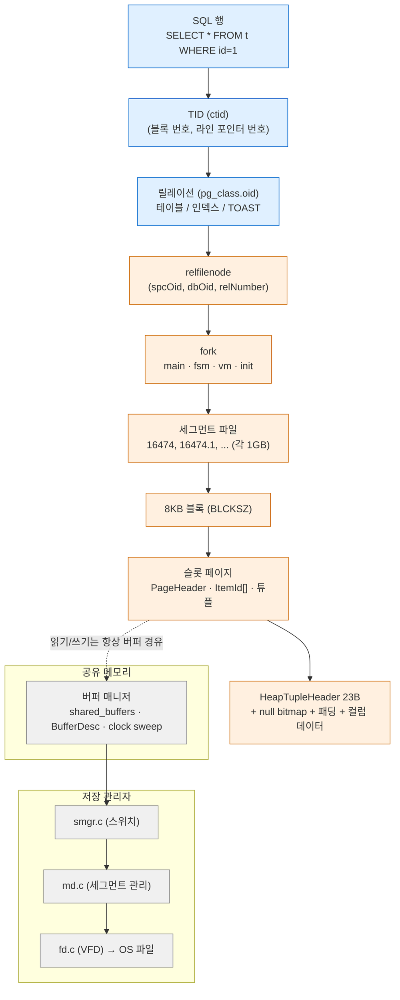

| 층위 | 식별자 | 정의 위치 (18.4) | 이 문서 |
|---|---|---|---|
| 클러스터 | `$PGDATA` | — | §1 |
| 릴레이션 → 파일 | `RelFileLocator` (spcOid, dbOid, relNumber) | `storage/relfilelocator.h` | §2 |
| fork | `ForkNumber` (MAIN/FSM/VM/INIT) | `common/relpath.h` | §2.5 |
| 세그먼트 | `RELSEG_SIZE` = 131072 블록 | `pg_config.h` | §2.6 |
| 페이지 | `PageHeaderData`, `ItemIdData` | `storage/bufpage.h`, `storage/itemid.h` | §3 |
| 튜플 | `HeapTupleHeaderData` | `access/htup_details.h` | §4 |
| 큰 값 | TOAST 포인터 `varatt_external` | `varatt.h`, `access/heaptoast.h` | §6 |
| 메모리 캐시 | `BufferDesc`, `BufferTag` | `storage/buf_internals.h` | §9 |
| I/O 디스패치 | `f_smgr` 함수 테이블 | `storage/smgr/smgr.c` | §10 |

핵심은 **간접 참조가 두 번** 있다는 점이다.

1. 릴레이션 OID → relfilenode: OID는 그대로 두고 파일만 바꿔 끼울 수 있다 (TRUNCATE, VACUUM FULL).
2. TID의 라인 포인터 번호 → 페이지 안의 바이트 오프셋: 인덱스가 가리키는 주소를 그대로 둔 채
   페이지 안에서 튜플을 옮길 수 있다 (페이지 조각 모음).

---

## 1. PGDATA 디렉토리

### 1-1. 실제 구성 (initdb 직후 + 기동 중)

`initdb -D $PGDATA -U postgres --auth=trust -E UTF8 --locale=C` 후 서버를 띄운 상태의 `ls -la`.

```text
디렉토리 (drwx------): base  global  pg_commit_ts  pg_dynshmem  pg_logical  pg_multixact
                      pg_notify  pg_replslot  pg_serial  pg_snapshots  pg_stat  pg_stat_tmp
                      pg_subtrans  pg_tblspc  pg_twophase  pg_wal  pg_xact
파일   (-rw-------): PG_VERSION  pg_hba.conf  pg_ident.conf  postgresql.auto.conf
                      postgresql.conf  postmaster.opts  postmaster.pid
```

전부 소유자 전용 권한(`0700`/`0600`)이다. `SHOW data_directory_mode` 결과도 `0700`.
`current_logfiles`는 `logging_collector=on`일 때만 생기므로 이 클러스터에는 없다.

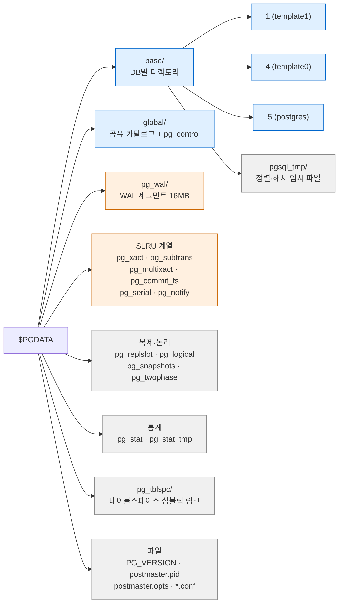

### 1-2. 항목 전체 표

설명은 공식 문서 "Database File Layout"(Table 66.1)을 기준으로 하고, 실측 내용과 내부 구현
관점을 덧붙였다.

| 항목 | 종류 | 공식 설명 (요약) | 실측 내용 / 내부 관점 |
|---|---|---|---|
| `PG_VERSION` | 파일 | 메이저 버전 번호 | 내용 `18`. 각 `base/<dboid>/`에도 같은 파일이 있다 |
| `base/` | 디렉토리 | DB별 하위 디렉토리 | `1`(template1), `4`(template0), `5`(postgres). 새 DB는 `16388`처럼 OID 이름 |
| `global/` | 디렉토리 | 클러스터 공용 테이블(`pg_database` 등) | `pg_control`(8192B), `pg_filenode.map`(524B), `pg_internal.init`, 공유 카탈로그 파일들 |
| `pg_wal/` | 디렉토리 | WAL 파일 | `000000010000000000000001`(16777216B), `archive_status/`, `summaries/` |
| `pg_xact/` | 디렉토리 | 트랜잭션 커밋 상태 | `0000`(8192B). CLOG SLRU — [[PostgreSQL/INTERNALS/04-MVCC-WAL\|04편]] |
| `pg_subtrans/` | 디렉토리 | 서브트랜잭션 상태 | `0000`. 부모 XID 매핑 SLRU |
| `pg_multixact/` | 디렉토리 | 멀티트랜잭션 상태(공유 행 잠금) | `offsets/0000`, `members/0000` |
| `pg_commit_ts/` | 디렉토리 | 커밋 타임스탬프 | `track_commit_timestamp=off`라 비어 있음 |
| `pg_serial/` | 디렉토리 | 커밋된 SERIALIZABLE 트랜잭션 정보 | 비어 있음 |
| `pg_notify/` | 디렉토리 | LISTEN/NOTIFY 상태 | 비어 있음 |
| `pg_twophase/` | 디렉토리 | PREPARE된 트랜잭션 상태 파일 | `max_prepared_transactions=0`이라 비어 있음 |
| `pg_logical/` | 디렉토리 | 논리 디코딩 상태 | `mappings/`, `snapshots/`, `replorigin_checkpoint`(8B) |
| `pg_replslot/` | 디렉토리 | 복제 슬롯 데이터 | 슬롯마다 하위 디렉토리. 현재 비어 있음 |
| `pg_snapshots/` | 디렉토리 | `pg_export_snapshot()`으로 내보낸 스냅샷 | 비어 있음 |
| `pg_stat/` | 디렉토리 | 통계 서브시스템 영구 파일 | 기동 중 비어 있음 → 정상 종료 후 `pgstat.stat`(158432B) 생성 |
| `pg_stat_tmp/` | 디렉토리 | 통계 서브시스템 임시 파일 | initdb가 만들지만 PG15 이후 통계가 공유 메모리로 옮겨가 비어 있음 (이 클러스터 실측: 비어 있음) |
| `pg_tblspc/` | 디렉토리 | 테이블스페이스 심볼릭 링크 | §11 |
| `pg_dynshmem/` | 디렉토리 | 동적 공유 메모리 파일 | `dynamic_shared_memory_type=mmap`일 때 사용. 기본(posix)에서는 비어 있음 |
| `postgresql.conf` | 파일 | 주 설정 파일 | — |
| `postgresql.auto.conf` | 파일 | `ALTER SYSTEM` 저장 파일 | "Do not edit this file manually!" 헤더 |
| `pg_hba.conf`, `pg_ident.conf` | 파일 | 클라이언트 인증, 사용자명 매핑 | 위치는 GUC로 바꿀 수 있어 PGDATA 밖에 둘 수도 있다 |
| `postmaster.opts` | 파일 | 마지막 기동 명령행 옵션 | 아래 1-4 |
| `postmaster.pid` | 파일 | 잠금 파일 (PID, 경로, 시작 시각, 포트, 소켓 경로, listen 주소, 공유 메모리 ID) | 아래 1-4. **정지 후 사라짐** (실측) |

> `pg_wal/summaries/`는 PG17에서 생긴 WAL summarizer(`summarize_wal`, 증분 백업용)가
> `*.summary` 파일을 두는 곳이다 (`src/backend/backup/walsummary.c`의 `XLOGDIR "/summaries"`).
> `archive_status/`에는 아카이빙 대기·완료 표시 파일(`.ready`/`.done`)이 생긴다.

### 1-3. global/ 과 pg_control

`global/`에는 공유 카탈로그(모든 DB가 공유: `pg_database`, `pg_authid`, `pg_tablespace` 등)의
파일과 함께 숫자 이름이 아닌 파일 3개가 있다.

| 파일 | 크기(실측) | 역할 | 근거 |
|---|---|---|---|
| `pg_control` | 8192 | 클러스터 제어 파일. 체크포인트 위치, 블록 크기 등 컴파일 상수 | `pg_controldata` |
| `pg_filenode.map` | 524 | 매핑 카탈로그의 OID→relfilenode 표 (§2-4) | `relmapper.c` |
| `pg_internal.init` | 가변 | relcache 초기화 파일 (시작 시 카탈로그 디스크 읽기를 줄이는 캐시) | `utils/relcache.h`의 `RELCACHE_INIT_FILENAME` |

`pg_controldata` 출력 중 저장 구조와 관련된 줄(실측, `LC_ALL=C`):

```text
pg_control version number:            1800
Catalog version number:               202506291
Database block size:                  8192
Blocks per segment of large relation: 131072
WAL block size:                       8192
Bytes per WAL segment:                16777216
Maximum data alignment:               8
Maximum size of a TOAST chunk:        1996
Size of a large-object chunk:         2048
Data page checksum version:           1
```

`Data page checksum version: 1`은 **`-k` 없이 initdb했는데도** 체크섬이 켜졌다는 뜻이다.
PG18 initdb는 체크섬이 기본값이고, 끄려면 `--no-data-checksums`를 준다(`initdb --help`에서 확인).
`SHOW data_checksums` = `on`.

블록 크기·세그먼트 크기·TOAST 청크 크기는 **컴파일 시점 상수**라 pg_control에 기록해 둔다.
다른 값으로 컴파일된 바이너리는 기동 시 이 값이 맞지 않으면 클러스터를 거부한다.

### 1-4. postmaster.pid / postmaster.opts

```text
26767                        ← 1: postmaster PID
$PGDATA                      ← 2: 데이터 디렉토리
1791210604                   ← 3: 시작 시각 (epoch)
55403                        ← 4: 포트
                             ← 5: 유닉스 소켓 디렉토리 (unix_socket_directories='' 로 비움)
localhost                    ← 6: 첫 번째 listen_addresses
 43563624     65541          ← 7: 공유 메모리 키, ID
ready                        ← 8: 상태
```

`postmaster.opts`에는 `postgres "-D" "$PGDATA" "-p" "55403" "-c" ...`처럼 마지막 기동 명령행이
그대로 남는다. `pg_ctl restart`가 옵션 없이 재기동할 수 있는 근거가 이 파일이다.

### 1-5. DB 디렉토리 안

```text
$PGDATA/base/16388/      (CREATE DATABASE lab 직후, 358개 항목)
  PG_VERSION
  pg_filenode.map        ← DB 로컬 매핑 카탈로그 표
  pg_internal.init       ← DB 로컬 relcache 초기화 파일
  1247  1249  1255  1259 ← pg_type, pg_attribute, pg_proc, pg_class
  16474  16474_fsm  16474_vm ...
```

새 DB는 template1을 복제해 만들기 때문에 카탈로그 파일 수백 개가 처음부터 들어 있다.

---

## 2. 릴레이션 → 파일: relfilenode, fork, 세그먼트

### 2-1. 경로 규칙

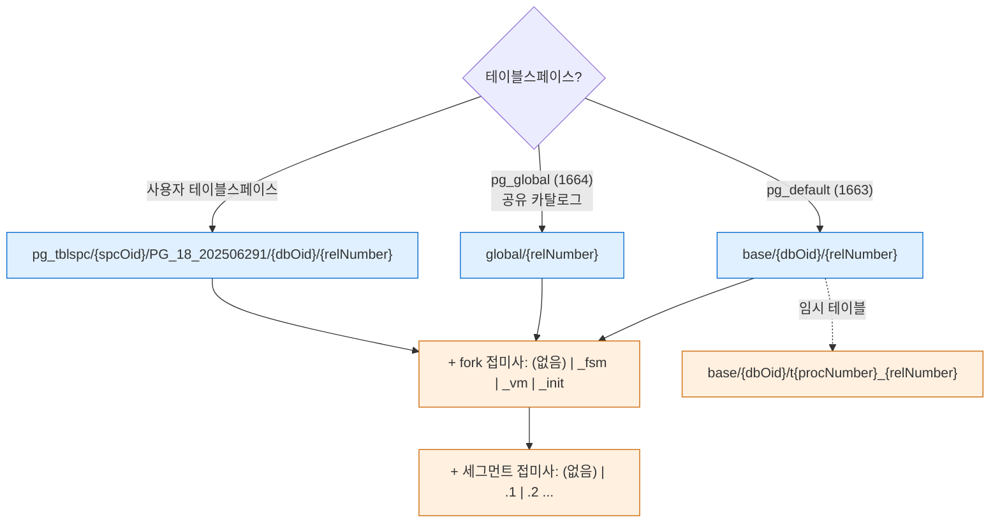

`PG_18_202506291`은 `common/relpath.h`의 `TABLESPACE_VERSION_DIRECTORY`
(`"PG_" PG_MAJORVERSION "_" CATALOG_VERSION_NO`)로 만든다. 카탈로그 버전 `202506291`은
pg_controldata 값과 같다.

버퍼 매니저가 페이지를 식별하는 키(`BufferTag`)도 이 경로 구성 요소와 똑같다.

```c
/* storage/buf_internals.h (18.4) */
typedef struct buftag
{
	Oid			spcOid;			/* tablespace oid */
	Oid			dbOid;			/* database oid */
	RelFileNumber relNumber;	/* relation file number */
	ForkNumber	forkNum;		/* fork number */
	BlockNumber blockNum;		/* blknum relative to begin of reln */
} BufferTag;
```

즉 **"(테이블스페이스, DB, 파일번호, fork, 블록번호)" 다섯 개가 클러스터 전체에서 페이지 하나를
유일하게 지목한다.** 릴레이션 OID는 이 키에 들어가지 않는다.

### 2-2. OID 와 relfilenode

```sql
CREATE TABLE t1(id int, name text);
SELECT oid, relfilenode, pg_relation_filenode('t1') fn, pg_relation_filepath('t1')
  FROM pg_class WHERE relname = 't1';
```

```text
  oid  | relfilenode |  fn   | pg_relation_filepath
-------+-------------+-------+----------------------
 16474 |       16474 | 16474 | base/16388/16474
```

처음에는 OID와 relfilenode가 같다. 둘 다 같은 OID 카운터에서 받기 때문이다.
하지만 **같아야 할 이유는 없고**, 파일을 새로 만드는 연산마다 relfilenode만 바뀐다.

| 함수 | 입력 → 출력 | 용도 |
|---|---|---|
| `pg_relation_filenode(regclass)` | 릴레이션 → 실제 파일 번호 | 매핑 카탈로그도 정확히 반환 |
| `pg_relation_filepath(regclass)` | 릴레이션 → `$PGDATA` 기준 상대 경로 | fork·세그먼트 접미사는 붙지 않음 |
| `pg_filenode_relation(spcOid, filenode)` | 파일 번호 → 릴레이션 | 디스크 파일 이름에서 역추적 (테이블스페이스 0 = 기본) |

함수 자체의 실행 경로는 [[PostgreSQL/INTERNALS/08-SYSTEM-FUNCTIONS|08편]]에서 다룬다.

### 2-3. relfilenode가 바뀌는 연산 (실증)

```text
        step         |  oid  | relfilenode
---------------------+-------+-------------
 initial             | 16474 |       16474
 after TRUNCATE      | 16474 |       16479
 after VACUUM FULL   | 16474 |       16482
 after CLUSTER       | 16474 |       16488
 after plain VACUUM  | 16474 |       16488   ← 그대로
 in-tx TRUNCATE      |       |       16494   ← 트랜잭션 안에서 새 파일
 after ROLLBACK      | 16474 |       16488   ← 롤백하면 원래 파일로
```

| 연산 | relfilenode | 이유 |
|---|---|---|
| `TRUNCATE` | 바뀜 | 빈 새 파일을 만들고 pg_class를 새 번호로 갱신. 옛 파일은 커밋 후 정리 |
| `VACUUM FULL`, `CLUSTER` | 바뀜 | 새 파일에 살아 있는 튜플만 다시 쓴 뒤 교체 |
| `REINDEX` | (인덱스) 바뀜 | 공식 문서 명시 |
| 일부 `ALTER TABLE` (컬럼 타입 변경 등 재작성) | 바뀜 | 공식 문서 "some forms of ALTER TABLE" |
| 일반 `VACUUM` | 그대로 | 제자리(in-place)에서 정리 |

TRUNCATE가 **트랜잭션 안전**한 이유가 이 구조에 있다. 옛 파일을 지우지 않고 새 파일 번호를
pg_class에 기록할 뿐이므로, 롤백하면 pg_class 변경이 무효가 되어 옛 번호(16488)로 돌아간다.
OID가 고정이므로 이 테이블을 참조하는 뷰·FK·권한은 전혀 영향받지 않는다.

**옛 파일이 실제로 사라지는 시점** (실측):

```text
188416 $PGDATA/base/16388/16498        ← TRUNCATE 전
 24576 $PGDATA/base/16388/16498_fsm
-- TRUNCATE 직후 (체크포인트 전)
     0 $PGDATA/base/16388/16498        ← 0바이트로 남음, _fsm 은 삭제
-- CHECKPOINT 후
(파일 없음)
```

main fork의 첫 세그먼트는 바로 지우지 않고 0바이트로 잘라 둔 뒤, 다음 체크포인트가 끝나면 unlink한다.
`md.c mdunlink()` 주석이 이유를 설명한다.

1. 릴레이션을 지우고 커밋해 파일까지 실제로 삭제했다.
2. OID가 한 바퀴 돌아 새 릴레이션이 **우연히 같은 relfilenumber**를 받았다.
3. 다음 체크포인트 전에 크래시가 났다.

WAL 재생은 옛 파일 삭제를 재생한 뒤 새 파일을 다시 만든다. 새 파일 내용이 WAL로 복원되면 문제없지만,
`wal_level=minimal`처럼 WAL 없이 fsync만으로 채운 파일이었다면 내용이 영영 사라진다. 빈 파일을
남겨 두면 relfilenumber 할당이 "이미 있는 파일 번호는 건너뛰므로" 체크포인트 전까지 재사용 자체가 막힌다.
추가 세그먼트(`.1` 이후)와 다른 fork(`_fsm`, `_vm`)는 재사용 방지에 필요 없어서 즉시 지운다.
실측에서 `_fsm`이 바로 사라진 것과 맞는다. 임시 릴레이션은 WAL을 남기지 않고 파일 이름 형식도
달라서 이 과정을 거치지 않는다.

### 2-4. 매핑 카탈로그와 pg_filenode.map

일부 카탈로그는 `pg_class.relfilenode`가 **0**이다.

```text
   relname    | oid  | relfilenode | real_fn | pg_relation_filepath | relisshared
--------------+------+-------------+---------+----------------------+-------------
 pg_attribute | 1249 |           0 |    1249 | base/16388/1249      | f
 pg_authid    | 1260 |           0 |    1260 | global/1260          | t
 pg_class     | 1259 |           0 |    1259 | base/16388/1259      | f
 pg_database  | 1262 |           0 |    1262 | global/1262          | t
 pg_proc      | 1255 |           0 |    1255 | base/16388/1255      | f
 pg_type      | 1247 |           0 |    1247 | base/16388/1247      | f
```

닭과 달걀 문제다. pg_class의 파일 위치를 pg_class 안에 적어 두면, pg_class를 읽으려면 먼저
pg_class를 읽어야 한다. 그래서 이 카탈로그들은 위치를 **별도의 작은 파일**
`pg_filenode.map`(DB 로컬은 `base/<dboid>/`, 공유는 `global/`)에 둔다.

```c
/* src/backend/utils/cache/relmapper.c (REL_18_STABLE) */
#define RELMAPPER_FILENAME		"pg_filenode.map"
#define RELMAPPER_FILEMAGIC		0x592717	/* version ID value */
#define MAX_MAPPINGS			64

typedef struct RelMapFile
{
	int32		magic;			/* always RELMAPPER_FILEMAGIC */
	int32		num_mappings;	/* number of valid RelMapping entries */
	RelMapping	mappings[MAX_MAPPINGS];
	pg_crc32c	crc;			/* CRC of all above */
} RelMapFile;
```

크기는 4 + 4 + 64×8 + 4 = **524바이트**로, 실측 파일 크기와 같다.
`VACUUM FULL pg_class` 후 파일을 `od`로 읽으면:

```text
-- VACUUM FULL pg_class 전: pg_relation_filenode('pg_class') = 1259
-- VACUUM FULL pg_class 후: relfilenode = 0 그대로, pg_relation_filenode = 16502
$ od -A d -t x4 base/16388/pg_filenode.map
0000000  00592717  00000011  000004eb  00004076
         magic     17개      oid 1259  → 16502
```

pg_class.relfilenode는 0 그대로이고, 실제 파일 번호는 맵 파일에서 바뀌었다. 그래서
매핑 카탈로그의 파일 위치를 알려면 반드시 `pg_relation_filenode()`를 써야 한다.
카탈로그 부트스트랩 전반은 [[PostgreSQL/INTERNALS/06-CATALOG-OID|06편]] 참고.

### 2-5. fork 4종

```c
/* common/relpath.h (18.4) */
typedef enum ForkNumber
{
	InvalidForkNumber = -1,
	MAIN_FORKNUM = 0,
	FSM_FORKNUM,
	VISIBILITYMAP_FORKNUM,
	INIT_FORKNUM,
	...
} ForkNumber;
#define FORKNAMECHARS	4		/* max chars for a fork name */
```

| ForkNumber | 접미사 | 내용 | 생기는 대상 | 생성 시점 (실측) |
|---|---|---|---|---|
| `MAIN_FORKNUM` (0) | 없음 | 실제 데이터 페이지 | 모든 릴레이션 | CREATE 시 (0바이트) |
| `FSM_FORKNUM` (1) | `_fsm` | 페이지별 여유 공간 (§7) | 테이블, 인덱스 | INSERT로 페이지가 늘어나는 중 (이미 생김) |
| `VISIBILITYMAP_FORKNUM` (2) | `_vm` | 페이지별 all-visible/all-frozen 비트 (§8) | 테이블만 | 첫 VACUUM |
| `INIT_FORKNUM` (3) | `_init` | 빈 초기 상태 | UNLOGGED 릴레이션만 | CREATE UNLOGGED 시 |

INSERT 1000행 → `16474`(49152B), `16474_fsm`(24576B). VACUUM 후 `16474_vm`(8192B)이 추가됐다.
FSM이 VACUUM 전에 생긴 이유는 힙 삽입 코드(`hio.c`)가 직접 FSM을 갱신하기 때문이다. 확장할 때
한꺼번에 여러 페이지를 늘리면 남는 페이지를 `RecordPageWithFreeSpace()`로 기록하고, 대상
페이지에 자리가 없으면 `RecordAndGetPageWithFreeSpace()`로 현재 페이지 값을 기록한 뒤 다른 페이지를 받는다.

```text
 main  |  fsm  |  vm  | init |  tbl  | total
-------+-------+------+------+-------+-------
 49152 | 24576 | 8192 |    0 | 90112 | 90112
```

`pg_table_size` 90112 = main 49152 + fsm 24576 + vm 8192 + TOAST 인덱스 메타페이지 8192.
`pg_relation_size(rel, 'fsm')`처럼 fork 이름을 두 번째 인자로 준다.

`_init` fork: UNLOGGED 테이블은 WAL을 남기지 않으므로 크래시 후 내용을 믿을 수 없다. 크래시
복구가 끝나면 main fork를 `_init`(빈 상태) 복사본으로 덮어써서 "비어 있는" 상태로 되돌린다.
실측에서 unlogged 힙 테이블의 `_init`은 0바이트였다.

### 2-6. 1GB 세그먼트

```c
/* pg_config.h (18.4, Homebrew 빌드) */
#define BLCKSZ 8192
#define RELSEG_SIZE 131072
#define XLOG_BLCKSZ 8192
```

```sql
SHOW block_size;    -- 8192
SHOW segment_size;  -- 1GB   (= 131072 블록 × 8192)
```

131072 × 8192 = 1,073,741,824바이트 = 1GiB. 이 값을 넘는 릴레이션은 파일을 나눈다.
`md.c` 머리 주석이 그 이유와 규칙을 설명한다(요약):

- OS의 파일 크기 제한(흔히 2GB)보다 큰 릴레이션을 지원하려고 세그먼트로 나눈다.
- 디스크 상태는 "꽉 찬 세그먼트 0개 이상(정확히 RELSEG_SIZE 블록) → 부분 세그먼트 정확히 1개
  → (truncate로 비활성화된) 0블록 세그먼트 0개 이상" 순서여야 한다.
- truncate된 세그먼트를 unlink하지 않고 0블록으로 남기는 이유: 다른 백엔드나 checkpointer가
  그 파일을 열어 두고 있을 수 있어서다.

**실증** — UNLOGGED 테이블(WAL 생략)에 1800바이트 `plain` 행 56만 개:

```sql
CREATE UNLOGGED TABLE seg(id int, pad text STORAGE PLAIN) WITH (autovacuum_enabled=off);
INSERT INTO seg SELECT g, repeat('s',1800) FROM generate_series(1,560000) g;
-- 1094 MB, 140000 pages
```

```text
1073741824 $PGDATA/base/16388/16584       ← 정확히 131072 블록
  73138176 $PGDATA/base/16388/16584.1     ← 8928 블록 (131072 + 8928 = 140000)
    303104 $PGDATA/base/16388/16584_fsm
         0 $PGDATA/base/16388/16584_init
```

블록 번호와 세그먼트 번호의 관계는 `seg_no = blkno / RELSEG_SIZE`,
세그먼트 안 오프셋은 `(blkno % RELSEG_SIZE) × BLCKSZ`다.

```text
  blk   | seg_no      (ctid 의 블록 번호 / 131072)
--------+--------
      0 |      0
 131071 |      0      ← 첫 세그먼트의 마지막 블록
 139999 |      1
```

> 상위 계층(버퍼 매니저, 실행기)은 세그먼트를 모른다. 블록 번호는 0부터 연속이고,
> 세그먼트 계산은 `md.c`만 한다. 이 분리가 §10의 smgr 추상화다.

### 2-7. 임시 릴레이션과 임시 파일

```text
 pg_relation_filepath | pg_backend_pid | relpersistence
----------------------+----------------+----------------
 base/16388/t32_16593 |          44692 | t
```

임시 테이블 파일 이름은 `t<BBB>_<FFF>` 형식이다. 공식 문서는 BBB를 "파일을 만든 백엔드의
**process number**"라고 한다. 실측에서도 PID(44692)가 아니라 프로세스 번호(32)가 붙었다.
임시 테이블은 공유 버퍼가 아닌 **백엔드 로컬 버퍼**(`temp_buffers`)를 쓰고 WAL도 남기지 않는다.

정렬·해시가 `work_mem`을 넘으면 쓰는 임시 파일은 `base/pgsql_tmp/`
(`common/file_utils.h`의 `PG_TEMP_FILES_DIR "pgsql_tmp"`)에 생긴다. `work_mem=64kB`로
30만 행을 정렬했을 때 서버 로그(`log_temp_files=0`):

```text
LOG:  temporary file: path "base/pgsql_tmp/pgsql_tmp44692.0.fileset/1.0", size 3670016
LOG:  temporary file: path "base/pgsql_tmp/pgsql_tmp44692.0.fileset/0.0", size 4358144
```

이쪽 이름에는 PID(44692)가 들어간다. 공식 문서는 기본 형식을 `pgsql_tmpPPP.NNN`으로 설명한다.
위처럼 `.fileset/` 하위 디렉토리가 생기는 것은 fileset 기반 임시 파일 API를 쓰는 경우의 실측 모양이다.

---

## 3. 페이지 레이아웃 — 8KB 슬롯 페이지

### 3-1. bufpage.h 의 도식

모든 릴레이션 파일은 BLCKSZ(8192) 크기 블록의 배열이다. 액세스 메서드가 쓰는 블록은 모두
같은 **슬롯 페이지(slotted page)** 형식을 따른다. 18.4 헤더 주석의 도식을 그대로 옮긴다.

```text
/* storage/bufpage.h (18.4) */
 * +----------------+---------------------------------+
 * | PageHeaderData | linp1 linp2 linp3 ...           |
 * +-----------+----+---------------------------------+
 * | ... linpN |                                      |
 * +-----------+--------------------------------------+
 * |           ^ pd_lower                             |
 * |                                                  |
 * |             v pd_upper                           |
 * +-------------+------------------------------------+
 * |             | tupleN ...                         |
 * +-------------+------------------+-----------------+
 * |       ... tuple3 tuple2 tuple1 | "special space" |
 * +--------------------------------+-----------------+
 *                                  ^ pd_special
```

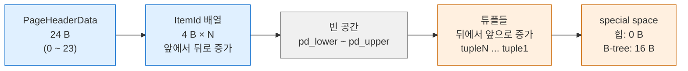

헤더 주석의 요점:

- 라인 포인터(linp, `ItemId`)는 앞에서 뒤로, 튜플은 **뒤에서 앞으로**("backwards") 쌓인다.
  둘이 가운데서 만나면(`pd_lower`와 `pd_upper` 사이에 넣을 수 없으면) 페이지가 꽉 찬 것이다.
- `ItemPointer`(TID)는 바이트 오프셋이 아니라 **라인 포인터 번호**를 가리킨다. 그래서 필요할 때
  페이지 안에서 튜플을 물리적으로 섞어도(shuffle) 바깥 참조가 깨지지 않는다.
- OffsetNumber는 관례상 **1부터** 시작한다.
- AM별 페이지 정보는 끝의 special space에 둔다(B-tree의 `BTPageOpaqueData` 등).

### 3-2. PageHeaderData

```c
/* storage/bufpage.h (18.4) */
typedef struct PageHeaderData
{
	/* XXX LSN is member of *any* block, not only page-organized ones */
	PageXLogRecPtr pd_lsn;		/* LSN: next byte after last byte of xlog
								 * record for last change to this page */
	uint16		pd_checksum;	/* checksum */
	uint16		pd_flags;		/* flag bits, see below */
	LocationIndex pd_lower;		/* offset to start of free space */
	LocationIndex pd_upper;		/* offset to end of free space */
	LocationIndex pd_special;	/* offset to start of special space */
	uint16		pd_pagesize_version;
	TransactionId pd_prune_xid; /* oldest prunable XID, or zero if none */
	ItemIdData	pd_linp[FLEXIBLE_ARRAY_MEMBER]; /* line pointer array */
} PageHeaderData;

#define SizeOfPageHeaderData (offsetof(PageHeaderData, pd_linp))
```

| 오프셋 | 필드 | 크기 | 의미 | 내부 사용처 |
|---|---|---|---|---|
| 0 | `pd_lsn` | 8 | 이 페이지를 마지막으로 바꾼 WAL 레코드의 끝 다음 바이트 | 버퍼 매니저가 "WAL 먼저" 규칙 강제: 이 LSN까지 WAL을 flush하기 전엔 페이지를 디스크에 못 씀 |
| 8 | `pd_checksum` | 2 | 페이지 체크섬 | 디스크 쓰기 직전 계산, 읽을 때 검증 (3-6) |
| 10 | `pd_flags` | 2 | 플래그 비트 (3-3) | 힌트 성격 |
| 12 | `pd_lower` | 2 | 빈 공간 시작 = 라인 포인터 배열 끝 | `24 + 4 × 라인 포인터 수` |
| 14 | `pd_upper` | 2 | 빈 공간 끝 = 가장 앞쪽 튜플 시작 | 튜플 추가 시 감소 |
| 16 | `pd_special` | 2 | special space 시작 | 힙 = 8192 (special 없음) |
| 18 | `pd_pagesize_version` | 2 | 페이지 크기와 레이아웃 버전을 합친 값 | 크기는 256의 배수 → 하위 8비트에 버전 |
| 20 | `pd_prune_xid` | 4 | 페이지에서 prune 가능한 가장 오래된 XID (없으면 0) | 힌트. 인덱스 페이지에서는 미사용 |

합계 **24바이트**(`SizeOfPageHeaderData`). `PageXLogRecPtr`는 64비트 LSN을 32비트 두 개
(`xlogid`, `xrecoff`)로 나눠 저장하는 역사적 형식이다.

`PG_PAGE_LAYOUT_VERSION`은 **4**이고 헤더 주석에 이력이 있다: 7.3 이전 0, 7.3/7.4 = 1,
8.0 = 2, 8.1 = 3, 8.3 = 4(`pd_flags`와 `pd_prune_xid` 추가). 9.3부터는 체크섬 버전도 함께 본다.
`lp_off`/`lp_len`이 15비트라서 페이지는 최대 32KB까지만 가능하다.

### 3-3. pd_flags

```c
#define PD_HAS_FREE_LINES	0x0001	/* are there any unused line pointers? */
#define PD_PAGE_FULL		0x0002	/* not enough free space for new tuple? */
#define PD_ALL_VISIBLE		0x0004	/* all tuples on page are visible to
									 * everyone */
#define PD_VALID_FLAG_BITS	0x0007	/* OR of all valid pd_flags bits */
```

| 비트 | 켜지는 조건 | 성격 |
|---|---|---|
| `PD_HAS_FREE_LINES` | `pd_lower` 앞쪽에 LP_UNUSED 라인 포인터가 있음 | 힌트 (WAL 기록 안 함) |
| `PD_PAGE_FULL` | UPDATE가 새 버전을 이 페이지에 못 넣음 → prune 필요 신호 | 힌트 |
| `PD_ALL_VISIBLE` | 페이지의 모든 튜플이 모든 트랜잭션에 보임 | VM 비트와 짝 (§8) |

실측: VACUUM 직후 힙 페이지 `flags = 4`(ALL_VISIBLE). prune 후 빈 라인 포인터가 생긴 페이지는
`flags = 5`(HAS_FREE_LINES | ALL_VISIBLE).

### 3-4. ItemIdData (라인 포인터)

```c
/* storage/itemid.h (18.4) */
typedef struct ItemIdData
{
	unsigned	lp_off:15,		/* offset to tuple (from start of page) */
				lp_flags:2,		/* state of line pointer, see below */
				lp_len:15;		/* byte length of tuple */
} ItemIdData;

#define LP_UNUSED		0		/* unused (should always have lp_len=0) */
#define LP_NORMAL		1		/* used (should always have lp_len>0) */
#define LP_REDIRECT		2		/* HOT redirect (should have lp_len=0) */
#define LP_DEAD			3		/* dead, may or may not have storage */
```

32비트 하나에 오프셋 15비트 + 상태 2비트 + 길이 15비트가 들어간다.

| lp_flags | 이름 | lp_off 의미 | 저장 공간 | 재사용 |
|---|---|---|---|---|
| 0 | `LP_UNUSED` | — | 없음 (lp_len=0) | 즉시 재사용 가능 |
| 1 | `LP_NORMAL` | 튜플 바이트 오프셋 | 있음 | — |
| 2 | `LP_REDIRECT` | **다른 라인 포인터 번호** (HOT 체인 시작) | 없음 | 체인이 정리될 때까지 유지 |
| 3 | `LP_DEAD` | — | 있을 수도 없을 수도 | 인덱스 정리 후 UNUSED로 |

TID는 6바이트 `ItemPointerData`(블록 번호 4바이트를 16비트 두 개로 나눈 `BlockIdData` + 오프셋
번호 2바이트)다. 헤더 주석에 따르면 컴파일러가 8바이트로 패딩하지 않도록 packed/aligned(2)
속성을 준다.

### 3-5. 실증 — 튜플이 뒤에서 앞으로 쌓이는 모습

```sql
CREATE TABLE pg1(id int, v text);
INSERT INTO pg1 VALUES (1,'aaa'), (2,'bbbbbb'), (3,NULL);
SELECT * FROM page_header(get_raw_page('pg1',0));
```

```text
    lsn    | checksum | flags | lower | upper | special | pagesize | version | prune_xid
-----------+----------+-------+-------+-------+---------+----------+---------+-----------
 0/1DB1B10 |        0 |     0 |    36 |  8088 |    8192 |     8192 |       4 |         0
```

- `lower = 36` = 헤더 24 + 라인 포인터 3개 × 4.
- `special = 8192` = 힙 페이지에는 special space가 없다.
- `version = 4` = `PG_PAGE_LAYOUT_VERSION`.

```sql
SELECT lp, lp_off, lp_flags, lp_len, t_xmin, t_xmax, t_ctid, t_infomask2, t_infomask, t_hoff, t_bits, t_data
  FROM heap_page_items(get_raw_page('pg1',0));
```

```text
 lp | lp_off | lp_flags | lp_len | t_xmin | t_xmax | t_ctid | t_infomask2 | t_infomask | t_hoff |  t_bits  |          t_data
----+--------+----------+--------+--------+--------+--------+-------------+------------+--------+----------+--------------------------
  1 |   8160 |        1 |     32 |    784 |      0 | (0,1)  |           2 |       2050 |     24 |          | \x0100000009616161
  2 |   8120 |        1 |     35 |    784 |      0 | (0,2)  |           2 |       2050 |     24 |          | \x020000000f626262626262
  3 |   8088 |        1 |     28 |    784 |      0 | (0,3)  |           2 |       2049 |     24 | 10000000 | \x03000000
```

오프셋을 손으로 계산하면 정렬 규칙이 보인다.

| lp | 길이 | 바로 붙이면 | 실제 lp_off | 설명 |
|---|---|---|---|---|
| 1 | 32 | 8192 − 32 = 8160 | 8160 | 이미 8의 배수 |
| 2 | 35 | 8160 − 35 = 8125 | **8120** | MAXALIGN(8)에 맞춰 아래로 내림 → 5바이트 패딩 |
| 3 | 28 | 8120 − 28 = 8092 | **8088** | 4바이트 패딩 |

튜플 시작 주소는 항상 MAXALIGN(8바이트) 경계다. `lp_len`은 패딩을 뺀 실제 길이다.

`t_data` 해석 (리틀엔디언):

- lp1 `01000000` = int4 `1`, `09 616161` = 1바이트 varlena 헤더 `0x09` + `"aaa"`.
  `0x09 = 0b00001001` → 최하위 비트 1 = 1바이트 헤더, 길이 = `0x09 >> 1` = 4(헤더 포함).
- lp2 `0f 626262626262` → 길이 `0x0f >> 1` = 7 = 1 + 6.
- lp3 `03000000`만 있고 v는 NULL이라 데이터가 없다. 대신 `t_bits = 10000000`(첫 컬럼만 not null).

### 3-6. 페이지 정리(prune/defrag)와 라인 포인터 재사용

위 페이지에서 `UPDATE ... WHERE id=1`(HOT), `DELETE ... WHERE id=2` 후 VACUUM:

```text
 lp | lp_off | lp_flags | lp_len | t_xmin | t_xmax | t_ctid
----+--------+----------+--------+--------+--------+--------
  1 |      4 |        2 |      0 |        |        |          ← LP_REDIRECT → lp 4
  2 |      0 |        0 |      0 |        |        |          ← LP_UNUSED
  3 |   8160 |        1 |     28 |    784 |      0 | (0,3)    ← 8088 → 8160 으로 이동
  4 |   8128 |        1 |     32 |    785 |      0 | (0,4)    ← 8056 → 8128 으로 이동

 lower | upper | flags | prune_xid
-------+-------+-------+-----------
    40 |  8128 |     5 |         0
```

- 죽은 튜플을 지운 뒤 살아 있는 튜플을 페이지 끝쪽으로 **모아 붙였다**(lp3: 8088→8160, lp4: 8056→8128).
  라인 포인터 번호는 그대로이므로 인덱스 엔트리 `(0,3)`, `(0,4)`는 여전히 유효하다.
- lp1은 HOT 체인의 시작이라 인덱스가 `(0,1)`을 가리키고 있다. 그래서 지우지 않고
  `LP_REDIRECT`로 바꿔 `lp_off`에 다음 라인 포인터 번호 4를 담았다.
- `lower`는 40 그대로다. 라인 포인터 배열은 줄지 않는다(끝쪽 미사용 포인터만 잘라낼 수 있음).

이어서 `INSERT (5,'new')`를 하면 새 라인 포인터를 만들지 않고 **UNUSED였던 lp2를 재사용**한다.

```text
  2 |   8096 |        1 |     32 | (0,2)
```

HOT 체인·prune의 판정 로직은 [[PostgreSQL/INTERNALS/04-MVCC-WAL|04편]]에서 다룬다.

### 3-7. 페이지 관련 한계 상수

| 상수 | 정의 (18.4) | 8KB 기준 값 | 실측 |
|---|---|---|---|
| `SizeOfPageHeaderData` | `offsetof(PageHeaderData, pd_linp)` | 24 | 빈 FSM 페이지 `lower=24` |
| `MaxHeapTupleSize` | `BLCKSZ - MAXALIGN(SizeOfPageHeaderData + sizeof(ItemIdData))` | 8192 − 32 = **8160** | `ERROR: row is too big: size 9032, maximum size 8160` |
| `MaxHeapTuplesPerPage` | `(BLCKSZ - 24) / (MAXALIGN(23) + 4)` | 8168 / 28 = **291** | (계산값) |
| `MaxHeapAttributeNumber` | 1600 | 테이블 최대 컬럼 수 | (헤더 값) |
| `MaxTupleAttributeNumber` | 1664 | 결과 튜플 최대 컬럼 수 | (헤더 값) |

### 3-8. 페이지 체크섬은 디스크 쓰기 시점에 붙는다

방금 INSERT한 페이지를 `page_header`로 보면 `checksum = 0`이었다. 체크섬은 **공유 버퍼에서
디스크로 내보낼 때** 계산해 그 사본에 쓰기 때문이다(`bufpage.h`에 `PageSetChecksumCopy()` 선언).
버퍼를 강제로 내보낸 뒤 다시 읽으면 디스크 값이 보인다.

```sql
CHECKPOINT;
SELECT pg_buffercache_evict(bufferid) FROM pg_buffercache
 WHERE relfilenode = pg_relation_filenode('pg1');           -- (t,f)
SELECT checksum, page_checksum(get_raw_page('pg1',0), 0) AS computed
  FROM page_header(get_raw_page('pg1',0));
```

```text
 checksum | computed
----------+----------
   -10725 |   -10725
```

`bufpage.h` 주석에 따르면 페이지 안에는 "체크섬이 유효한지" 표시하는 플래그가 **일부러 없다**.
페이지 내용을 보고 검증 여부를 정하면 손상된 페이지가 검증을 피해 갈 수 있기 때문이다.
검증 여부는 클러스터 단위 설정(`pg_control`의 checksum version)으로만 정한다.

---

## 4. 힙 튜플 헤더 — HeapTupleHeaderData

### 4-1. 구조체

```c
/* access/htup_details.h (18.4) */
typedef struct HeapTupleFields
{
	TransactionId t_xmin;		/* inserting xact ID */
	TransactionId t_xmax;		/* deleting or locking xact ID */

	union
	{
		CommandId	t_cid;		/* inserting or deleting command ID, or both */
		TransactionId t_xvac;	/* old-style VACUUM FULL xact ID */
	}			t_field3;
} HeapTupleFields;

struct HeapTupleHeaderData
{
	union
	{
		HeapTupleFields t_heap;
		DatumTupleFields t_datum;
	}			t_choice;

	ItemPointerData t_ctid;		/* current TID of this or newer tuple (or a
								 * speculative insertion token) */

	/* Fields below here must match MinimalTupleData! */
	uint16		t_infomask2;	/* number of attributes + various flags */
	uint16		t_infomask;		/* various flag bits, see below */
	uint8		t_hoff;			/* sizeof header incl. bitmap, padding */

	/* ^ - 23 bytes - ^ */

	bits8		t_bits[FLEXIBLE_ARRAY_MEMBER];	/* bitmap of NULLs */

	/* MORE DATA FOLLOWS AT END OF STRUCT */
};
```

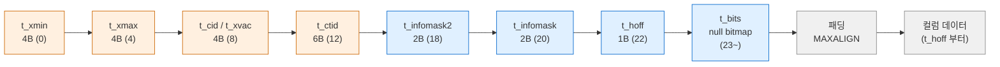

| 오프셋 | 필드 | 크기 | 의미 |
|---|---|---|---|
| 0 | `t_xmin` | 4 | 이 버전을 만든 트랜잭션 ID |
| 4 | `t_xmax` | 4 | 이 버전을 지운(또는 잠근) 트랜잭션 ID. 0이면 없음 |
| 8 | `t_cid` / `t_xvac` | 4 | 명령 ID(cmin·cmax 겸용, 필요하면 combo CID) / 9.0 이전 VACUUM FULL용 |
| 12 | `t_ctid` | 6 | 자기 자신 또는 더 새 버전의 TID |
| 18 | `t_infomask2` | 2 | 하위 11비트 = 컬럼 수, 상위 비트 = HOT 등 플래그 |
| 20 | `t_infomask` | 2 | 가시성·형태 플래그 |
| 22 | `t_hoff` | 1 | 사용자 데이터 시작 오프셋 (헤더 + 비트맵 + 패딩), MAXALIGN 배수 |
| 23 | `t_bits[]` | 가변 | NULL 비트맵. `HEAP_HASNULL`일 때만 존재 |

고정부 23바이트에 MAXALIGN을 적용하면 사실상 **24바이트**가 튜플마다 붙는 비용이다.

헤더 주석이 강조하는 설계 포인트:

- **가상 필드 5개(Xmin, Cmin, Xmax, Cmax, Xvac)를 물리 필드 3개에 담는다.** Cmin은 삽입한
  트랜잭션 안에서만, Cmax는 삭제한 트랜잭션 안에서만 의미가 있어 한 칸을 공유한다. 같은
  트랜잭션이 삽입하고 삭제하면 "combo command id"를 쓰고, 실제 cmin/cmax 매핑은 그 백엔드의
  로컬 상태에만 있다(`combocid.c`).
- **t_ctid**: 저장할 때 자기 TID로 초기화하고, UPDATE되면 새 버전을 가리킨다. 파티션 키 UPDATE로
  다른 파티션으로 옮겨간 경우엔 특수값을 넣는다. VACUUM이 새 버전을 먼저 지울 수 있으므로,
  t_ctid를 따라갈 때는 대상 튜플의 XMIN이 원래 튜플의 XMAX와 같은지 확인해야 한다.
- `t_ctid`는 INSERT ... ON CONFLICT의 **speculative insertion token**을 임시로 담기도 한다.

### 4-2. t_infomask 비트

`access/htup_details.h`(18.4)의 `#define` 값을 그대로 옮긴 표다.

| 비트 | 이름 | 분류 | 의미 |
|---|---|---|---|
| 0x0001 | `HEAP_HASNULL` | 형태 | NULL 비트맵 있음 |
| 0x0002 | `HEAP_HASVARWIDTH` | 형태 | 가변 길이 컬럼 있음 |
| 0x0004 | `HEAP_HASEXTERNAL` | 형태 | TOAST 외부 저장 컬럼 있음 |
| 0x0008 | `HEAP_HASOID_OLD` | 형태 | (구) WITH OIDS. 이제 만들지 않음 |
| 0x0010 | `HEAP_XMAX_KEYSHR_LOCK` | 잠금 | xmax가 FOR KEY SHARE 잠금 |
| 0x0020 | `HEAP_COMBOCID` | 명령 ID | t_cid가 combo CID |
| 0x0040 | `HEAP_XMAX_EXCL_LOCK` | 잠금 | xmax가 배타 잠금 (KEYSHR와 함께면 FOR SHARE) |
| 0x0080 | `HEAP_XMAX_LOCK_ONLY` | 잠금 | xmax는 삭제가 아니라 잠금만 |
| 0x0100 | `HEAP_XMIN_COMMITTED` | 힌트 비트 | xmin 커밋 확인됨 |
| 0x0200 | `HEAP_XMIN_INVALID` | 힌트 비트 | xmin 무효/롤백 |
| 0x0300 | `HEAP_XMIN_FROZEN` | 동결 | 위 두 비트를 동시에 켜면 "동결" |
| 0x0400 | `HEAP_XMAX_COMMITTED` | 힌트 비트 | xmax 커밋 확인됨 |
| 0x0800 | `HEAP_XMAX_INVALID` | 힌트 비트 | xmax 무효/롤백 (또는 없음) |
| 0x1000 | `HEAP_XMAX_IS_MULTI` | 잠금 | xmax가 MultiXactId |
| 0x2000 | `HEAP_UPDATED` | 버전 | UPDATE로 생긴 새 버전 |
| 0x4000/0x8000 | `HEAP_MOVED_OFF/IN` | 레거시 | 9.0 이전 VACUUM FULL 흔적 |

### 4-3. t_infomask2 비트

```c
#define HEAP_NATTS_MASK			0x07FF	/* 11 bits for number of attributes */
#define HEAP_KEYS_UPDATED		0x2000	/* tuple was updated and key cols modified, or tuple deleted */
#define HEAP_HOT_UPDATED		0x4000	/* tuple was HOT-updated */
#define HEAP_ONLY_TUPLE			0x8000	/* this is heap-only tuple */
#define HEAP2_XACT_MASK			0xE000	/* visibility-related bits */
```

컬럼 수 필드가 11비트(최대 2047)라 `MaxHeapAttributeNumber`(1600)를 담기에 충분하다.
`ALTER TABLE ADD COLUMN` 후에도 기존 튜플은 다시 쓰지 않으므로 튜플마다 컬럼 수가 다를 수 있다.
튜플에 없는 뒤쪽 컬럼은 NULL(또는 `attmissingval`의 기본값)로 읽는다.

### 4-4. 실증 — INSERT / UPDATE / DELETE 후 플래그

`heap_tuple_infomask_flags()`(pageinspect)로 비트를 이름으로 풀었다.

```text
-- INSERT 직후
 lp | t_ctid |              raw_flags
----+--------+--------------------------------------
  1 | (0,1)  | {HEAP_HASVARWIDTH,HEAP_XMAX_INVALID}
  2 | (0,2)  | {HEAP_HASVARWIDTH,HEAP_XMAX_INVALID}
  3 | (0,3)  | {HEAP_HASNULL,HEAP_XMAX_INVALID}
```

```text
-- UPDATE id=1 (HOT), DELETE id=2 후
 lp | t_xmin | t_xmax | t_ctid | t_infomask2 | t_infomask | raw_flags
----+--------+--------+--------+-------------+------------+-------------------------------------------------------------
  1 |    784 |    785 | (0,4)  |       16386 |       1282 | {HASVARWIDTH,XMIN_COMMITTED,XMAX_COMMITTED,HOT_UPDATED}
  2 |    784 |    786 | (0,2)  |        8194 |        258 | {HASVARWIDTH,XMIN_COMMITTED,KEYS_UPDATED}
  3 |    784 |      0 | (0,3)  |           2 |       2305 | {HASNULL,XMIN_COMMITTED,XMAX_INVALID}
  4 |    785 |      0 | (0,4)  |       32770 |      10498 | {HASVARWIDTH,XMIN_COMMITTED,XMAX_INVALID,UPDATED,HEAP_ONLY_TUPLE}
```

(`raw_flags`의 `HEAP_` 접두사는 줄였다.)

| lp | 해석 |
|---|---|
| 1 | 옛 버전. `t_xmax=785`, `t_ctid=(0,4)`로 새 버전을 가리킴. `16386 = 0x4002` = HOT_UPDATED + 컬럼 2개 |
| 2 | 삭제됨. `t_ctid`는 자기 자신 (0,2). `8194 = 0x2002` = KEYS_UPDATED(삭제도 이 비트를 켬) + 컬럼 2개 |
| 3 | 변화 없음. 다른 명령이 페이지를 읽으며 XMIN_COMMITTED **힌트 비트**를 켜 둠 |
| 4 | 새 버전. `32770 = 0x8002` = HEAP_ONLY_TUPLE (인덱스 엔트리 없이 lp1의 체인으로만 도달) |

VACUUM (FREEZE) 후에는 `{XMIN_COMMITTED, XMIN_INVALID, ...}`가 함께 켜진다. 이것이
`HEAP_XMIN_FROZEN`(0x0300)이고, `t_xmin` 값 자체(817)는 그대로 남는다. 동결을 xmin 덮어쓰기 대신
비트로 표시하는 이 방식과 힌트 비트를 쓰는 이유는 [[PostgreSQL/INTERNALS/04-MVCC-WAL|04편]]에서 다룬다.

### 4-5. NULL 비트맵과 t_hoff

비트맵 크기는 `BITMAPLEN(NATTS) = (NATTS + 7) / 8`바이트이고, **NULL이 하나라도 있을 때만** 붙는다.

```text
-- 9개 int 컬럼, 두 번째 행은 c2만 NULL
 lp | lp_len | t_hoff |      t_bits
----+--------+--------+------------------
  1 |     60 |     24 |                     ← 24 + 9×4
  2 |     64 |     32 | 1011111110000000    ← 23 + 2(비트맵) = 25 → MAXALIGN 32, + 8×4
```

- 컬럼이 8개 이하면 비트맵 1바이트가 고정부 23바이트 바로 뒤 **패딩 자리**에 들어가 `t_hoff`가
  24 그대로다(§3-5의 lp3: 컬럼 2개, NULL 포함인데 `t_hoff=24`).
- 9개부터는 비트맵이 2바이트가 되어 헤더가 32바이트로 뛴다.
- 비트맵에서 1 = 값 있음, 0 = NULL. NULL 컬럼은 데이터 영역에서 **공간을 전혀 차지하지 않는다.**

### 4-6. varlena 헤더 — 가변 길이 값의 첫 바이트

```text
/* varatt.h (18.4) — 리틀엔디언 */
 * xxxxxx00 4-byte length word, aligned, uncompressed data (up to 1G)
 * xxxxxx10 4-byte length word, aligned, *compressed* data (up to 1G)
 * 00000001 1-byte length word, unaligned, TOAST pointer
 * xxxxxxx1 1-byte length word, unaligned, uncompressed data (up to 126b)
```

| 첫 바이트 하위 비트 | 형태 | 정렬 | 최대 |
|---|---|---|---|
| `...00` | 4바이트 헤더, 비압축 | 필요 (typalign) | 1GB |
| `...10` | 4바이트 헤더, **압축됨** (인라인) | 필요 | 1GB |
| `00000001` | 1바이트 헤더 + tag → **TOAST 포인터** | 불필요 | — |
| `...1` | 1바이트 헤더 (short varlena) | **불필요** | 126바이트 |

126바이트 이하 값은 디스크에서 1바이트 헤더로 줄이고 정렬도 하지 않는다. 그래서 같은 값이라도
메모리 계산과 디스크 크기가 다르다.

```sql
SELECT pg_column_size('abc'::text);          -- 7   (메모리상 4바이트 헤더 + 3)
SELECT pg_column_size(v) FROM pg1 WHERE id=1; -- 4  (디스크의 short varlena 1 + 3)
```

헤더 주석에 따르면 1바이트 길이 워드는 0이 될 수 없다. 그래서 패딩 바이트(0)와 짧은 datum의
시작을 구별할 수 있고, 이 구별이 동작하도록 **패딩 바이트를 반드시 0으로 채운다.**

---

## 5. 정렬(alignment)과 패딩

컬럼 순서 튜닝의 실무 지침("Column Tetris")은 [[PostgreSQL/14-TUNING|14. DB 튜닝 방법론]] §4-1에
있다. 여기서는 바이트 단위로 왜 그렇게 되는지만 확인한다.

### 5-1. 타입별 typlen / typalign

```text
   typname   | typlen | typalign | typstorage
-------------+--------+----------+------------
 bytea       |     -1 | i        | x
 jsonb       |     -1 | i        | x
 numeric     |     -1 | i        | m
 text        |     -1 | i        | x
 bool        |      1 | c        | p
 char        |      1 | c        | p
 int2        |      2 | s        | p
 int4        |      4 | i        | p
 float8      |      8 | d        | p
 int8        |      8 | d        | p
 timestamptz |      8 | d        | p
 uuid        |     16 | c        | p
 name        |     64 | c        | p
```

| typalign | 경계 | 근거 (`pg_config.h` 18.4) |
|---|---|---|
| `c` | 1 | char |
| `s` | 2 | `ALIGNOF_SHORT 2` |
| `i` | 4 | `ALIGNOF_INT 4` |
| `d` | 8 | `ALIGNOF_DOUBLE 8` |
| (튜플 시작, t_hoff) | 8 | `MAXIMUM_ALIGNOF 8` |

`typlen = -1`은 varlena다. `uuid`가 16바이트인데 정렬은 `c`(1)라는 점도 눈여겨볼 만하다.

### 5-2. 실증 — 같은 데이터, 다른 순서

```sql
CREATE TABLE bad (a bool, b int8, c bool, d int8, e bool, f int8);
CREATE TABLE good(b int8, d int8, f int8, a bool, c bool, e bool);
```

```text
  t   | lp_len | t_hoff
------+--------+--------
 bad  |     72 |     24
 good |     51 |     24
```

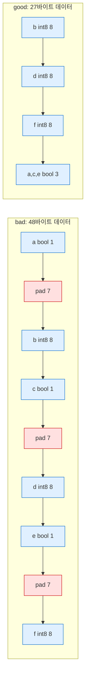

- bad: 24 + (1+7+8) × 3 = 72. 패딩만 21바이트.
- good: 24 + 24 + 3 = 51. 페이지에 놓일 때는 다음 튜플이 MAXALIGN 경계에서 시작하므로 실제
  점유는 56바이트다.

10만 행씩 넣은 결과:

```text
 bad_size | good_size | bad_pages | good_pages
----------+-----------+-----------+------------
 7480 kB  | 5888 kB   |       935 |        736
```

페이지당 튜플 수로 검산하면 bad (72+4) → 8168/76 = 107개/페이지 → 100001/107 ≈ 935페이지.
good (56+4) → 8168/60 = 136개/페이지 → ≈ 736페이지. 실측과 같다.

### 5-3. 정렬 규칙 정리

1. 튜플 시작과 `t_hoff`는 항상 8바이트 경계.
2. 각 컬럼은 자기 `typalign` 경계에서 시작. 앞 컬럼 끝과 사이가 뜨면 0으로 채운다.
3. 1바이트 헤더 varlena(126B 이하)는 정렬하지 않는다. 4바이트 헤더 varlena는 `typalign`(text는 `i`)을 따른다.
4. NULL은 공간 0. 비트맵만 생긴다.
5. 따라서 **고정 길이 8 → 4 → 2 → 1 → 가변 길이** 순서가 패딩을 최소화한다.

---

## 6. TOAST — 큰 값의 바깥 저장

### 6-1. 임계값의 출처

```c
/* access/heaptoast.h (18.4) */
#define MaximumBytesPerTuple(tuplesPerPage) \
	MAXALIGN_DOWN((BLCKSZ - \
				   MAXALIGN(SizeOfPageHeaderData + (tuplesPerPage) * sizeof(ItemIdData))) \
				  / (tuplesPerPage))

#define TOAST_TUPLES_PER_PAGE	4
#define TOAST_TUPLE_THRESHOLD	MaximumBytesPerTuple(TOAST_TUPLES_PER_PAGE)
#define TOAST_TUPLE_TARGET		TOAST_TUPLE_THRESHOLD

#define TOAST_TUPLES_PER_PAGE_MAIN	1
#define TOAST_TUPLE_TARGET_MAIN MaximumBytesPerTuple(TOAST_TUPLES_PER_PAGE_MAIN)

#define EXTERN_TUPLES_PER_PAGE	4	/* tweak only this */
#define EXTERN_TUPLE_MAX_SIZE	MaximumBytesPerTuple(EXTERN_TUPLES_PER_PAGE)
#define TOAST_MAX_CHUNK_SIZE	\
	(EXTERN_TUPLE_MAX_SIZE -							\
	 MAXALIGN(SizeofHeapTupleHeader) -					\
	 sizeof(Oid) -										\
	 sizeof(int32) -									\
	 VARHDRSZ)
```

"2KB"라고 흔히 말하는 값의 실제 계산 (BLCKSZ=8192):

| 상수 | 계산 | 값 |
|---|---|---|
| `TOAST_TUPLE_THRESHOLD` | MAXALIGN_DOWN((8192 − MAXALIGN(24 + 4×4)) / 4) = MAXALIGN_DOWN(8152 / 4 = 2038) | **2032** |
| `TOAST_TUPLE_TARGET` | = THRESHOLD (테이블 옵션 `toast_tuple_target`으로 조정 가능) | 2032 |
| `TOAST_TUPLE_TARGET_MAIN` | MAXALIGN_DOWN(8192 − MAXALIGN(24 + 4)) | 8160 |
| `TOAST_MAX_CHUNK_SIZE` | 2032 − 24 − 4(chunk_id) − 4(chunk_seq) − 4(varlena 헤더) | **1996** |

`TOAST_MAX_CHUNK_SIZE = 1996`은 pg_controldata의 "Maximum size of a TOAST chunk: 1996"과 일치한다.
"한 페이지에 튜플 4개"가 들어가게 하겠다는 설계 목표가 2032라는 숫자의 정체다.

**발동 조건**: `heapam.c`에서 튜플에 외부 값이 있거나 `tup->t_len > TOAST_TUPLE_THRESHOLD`이면
toaster(`heap_toast_insert_or_update`)를 호출한다.

### 6-2. 4단계 처리 (heaptoast.c)

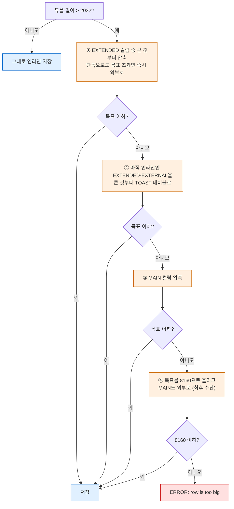

소스 주석 그대로의 순서다. "Look for attributes with attstorage EXTENDED to compress" →
"Second we look for attributes of attstorage EXTENDED or EXTERNAL that are still inline" →
"Round 3 - ... MAIN into compression" → "Finally we store attributes of type MAIN externally".
각 단계는 **가장 큰 컬럼부터** 처리하고 목표를 맞추는 즉시 멈춘다.

### 6-3. 저장 전략 4종

```c
/* catalog/pg_type.h (18.4) */
#define  TYPSTORAGE_PLAIN		'p' /* type not prepared for toasting */
#define  TYPSTORAGE_EXTERNAL	'e' /* toastable, don't try to compress */
#define  TYPSTORAGE_EXTENDED	'x' /* fully toastable */
#define  TYPSTORAGE_MAIN		'm' /* like 'x' but try to store inline */
```

| 전략 | 압축 | 외부 저장 | 기본 사용 타입 | 컬럼 단위 변경 |
|---|---|---|---|---|
| `PLAIN` (p) | ✗ | ✗ | 고정 길이 타입 전부 | `ALTER TABLE ... ALTER COLUMN c SET STORAGE PLAIN` |
| `MAIN` (m) | ✓ | 최후 수단(④)에만 | `numeric` | `SET STORAGE MAIN` |
| `EXTERNAL` (e) | ✗ | ✓ | — | `SET STORAGE EXTERNAL` |
| `EXTENDED` (x) | ✓ | ✓ | `text`, `bytea`, `jsonb` 등 | 기본값 |

**실증** — 같은 값 `repeat('a', 5000)`을 전략만 바꿔 저장:

```text
      s       | pg_column_size | pg_column_compression | lp_len | toast_bytes
--------------+----------------+-----------------------+--------+-------------
 plain        |           5004 |                       |   5028 |   (TOAST 테이블 없음)
 main         |             69 | pglz                  |     93 |           0
 external     |           5000 |                       |     42 |        8192
 extended     |             69 | pglz                  |     93 |           0
 extended+lz4 |             38 | lz4                   |     62 |           0
```

- **plain**: 5028바이트 튜플이 그대로 들어갔다. 9000바이트를 넣자
  `ERROR: row is too big: size 9032, maximum size 8160`.
- **main / extended**: 같은 결과. 반복 문자열은 압축이 잘 되므로 ①(또는 ③)에서 끝나고 TOAST
  테이블은 0바이트. 두 전략의 차이는 압축 후에도 2032를 넘을 때 나타난다(extended는 ②에서 외부로,
  main은 8160까지 인라인 유지).
- **external**: 압축하지 않고 바로 외부로. 힙 튜플은 42바이트(헤더 24 + TOAST 포인터 18).
  압축하지 않으므로 `substr()` 같은 부분 읽기가 필요한 청크만 가져올 수 있다(공식 문서 설명).
- **lz4**: 같은 데이터에서 pglz(69)보다 작은 38바이트.

TOAST 테이블은 **필요할 때만** 만든다. 모든 컬럼이 plain인 `ts_p`와 고정 길이 컬럼만 있는
`notoast(a int, b int8, c timestamptz)`는 `reltoastrelid = 0`이었다.

### 6-4. 압축 방식

```sql
SHOW default_toast_compression;   -- pglz (18.4 기본값)
```

| 방식 | ID (`toast_compression.h`) | 비고 |
|---|---|---|
| `pglz` | `TOAST_PGLZ_COMPRESSION_ID = 0` | 내장 구현. 기본값 |
| `lz4` | `TOAST_LZ4_COMPRESSION_ID = 1` | PG14+. 빌드 시 `--with-lz4` 필요. 이 빌드는 `pg_config.h`에 `USE_LZ4 1` |

컬럼별로 `CREATE TABLE t(v text COMPRESSION lz4)` 또는 `ALTER COLUMN v SET COMPRESSION lz4`로
지정한다. 바꿔도 **기존 값은 다시 압축하지 않는다**(새로 쓰는 값부터 적용). 값마다 어떤 방식으로
압축됐는지는 `pg_column_compression(v)`로 본다. 압축 방식 ID는 `va_extinfo`의 상위 비트(외부 저장 시)
또는 압축 데이터 헤더에 함께 저장된다(`toast_internals.h`의 `TOAST_COMPRESS_METHOD`).

압축해도 이득이 없으면 비압축으로 둔다. 실측에서 md5 16진 문자열 2100자는 `pg_column_compression`
= NULL, `pg_column_size` = 2100으로 압축 없이 외부 저장됐다.

### 6-5. TOAST 테이블과 TOAST 포인터

```text
TOAST table "pg_toast.pg_toast_16525"
   Column   |  Type
------------+---------
 chunk_id   | oid
 chunk_seq  | integer
 chunk_data | bytea
Owning table: "public.tt"
Indexes:
    "pg_toast_16525_index" PRIMARY KEY, btree (chunk_id, chunk_seq)
```

- 이름은 `pg_toast.pg_toast_<원본 테이블 OID>`. **relfilenode가 아니라 OID**다.
  실측에서 원본 OID 16525, TOAST 테이블의 relfilenode는 16528이었다.
- 값 하나 = `chunk_id`(OID) 하나. 1996바이트씩 잘라 `chunk_seq` 0, 1, 2…로 저장한다.
- `(chunk_id, chunk_seq)` 인덱스로 청크를 순서대로 찾는다.

```text
-- 2100바이트(비압축)와 100000바이트(비압축) 값 저장 결과
 chunk_id | chunks | min | max | bytes  | max_chunk
----------+--------+-----+-----+--------+-----------
    16531 |      2 |   0 |   1 |   2100 |      1996
    16532 |     51 |   0 |  50 | 100000 |      1996
```

100000 / 1996 = 50.1 → 청크 51개. 힙 쪽에 남는 것은 18바이트 TOAST 포인터다.

```c
/* varatt.h (18.4) */
typedef struct varatt_external
{
	int32		va_rawsize;		/* Original data size (includes header) */
	uint32		va_extinfo;		/* External saved size (without header) and
								 * compression method */
	Oid			va_valueid;		/* Unique ID of value within TOAST table */
	Oid			va_toastrelid;	/* RelID of TOAST table containing it */
}			varatt_external;
```

`varattrib_1b_e` 헤더(`va_header` 1바이트 + `va_tag` 1바이트, `VARTAG_ONDISK = 18`) +
`varatt_external` 16바이트 = **18바이트**(`detoast.h`의 `TOAST_POINTER_SIZE`).
실측의 `lp_len = 46`(id int 포함 행) = 24 + 4 + 18, `lp_len = 42`(text 컬럼만) = 24 + 18과 정확히 맞는다.
포인터에 TOAST 테이블 OID(`va_toastrelid`)와 값 ID(`va_valueid`)가 함께 있어서 값만 보고
바로 청크를 찾아갈 수 있다.

### 6-6. 실증 — 2032바이트 경계

비압축 랜덤 문자열을 단일 컬럼 테이블에 넣었다. 튜플 길이 = 24(헤더) + 4(varlena 헤더) + n.

```text
 length | pg_column_size | lp_len | 결과
--------+----------------+--------+---------------
   1990 |           1994 |   2018 | 인라인
   2000 |           2004 |   2028 | 인라인  (2028 ≤ 2032)
   2010 |           2010 |     42 | TOAST    (2038 > 2032)
   2020 |           2020 |     42 | TOAST
   2030 |           2030 |     42 | TOAST
```

2028바이트 튜플은 인라인으로 남고 2038바이트부터 외부로 나갔다. 헤더의 계산값 2032와 정확히 맞는다.

---

## 7. FSM (Free Space Map)

### 7-1. 1바이트 = 1페이지

README(`src/backend/storage/freespace/README`)의 설계 요지:

- 목적: INSERT할 때 "X바이트 이상 비어 있는 페이지"를 빨리 찾거나, 그런 페이지가 없다는 것을
  빨리 판정해 릴레이션을 늘리기 위해.
- 8.4부터 릴레이션마다 별도 fork로 둔다(이전에는 고정 크기 공유 메모리 FSM).
- 정확한 바이트가 아니라 **페이지당 1바이트**에 "여유 공간 / (BLCKSZ/256)"을 내림해 저장한다.

```c
/* src/backend/storage/freespace/freespace.c */
#define FSM_CATEGORIES	256
#define FSM_CAT_STEP	(BLCKSZ / FSM_CATEGORIES)     /* 8192/256 = 32 바이트 */
#define FSM_TREE_DEPTH	((SlotsPerFSMPage >= 1626) ? 3 : 4)
```

| 값 | 의미 |
|---|---|
| 0 | 여유 0~31바이트 |
| 124 | 124 × 32 = 3968바이트 이상 |
| 255 | 최대 범주 |

### 7-2. 이중 트리 구조

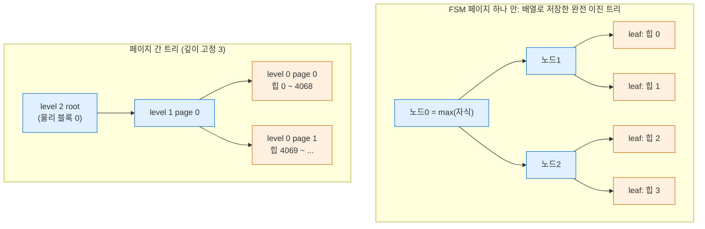

- **페이지 안**: leaf = 힙 페이지 하나의 값, 내부 노드 = 두 자식의 max. "X 이상인 페이지 찾기"는
  `n ≥ X`인 쪽으로만 내려가면 되고, root만 보면 "없음"을 즉시 판정할 수 있다.
- 갱신은 leaf를 고치고 부모로 올라가며 max를 다시 계산한다(값이 안 바뀌는 지점에서 멈춤).
- **페이지 간**: 상위 FSM 페이지의 leaf가 하위 FSM 페이지 하나를 대표한다. 깊이는 항상 같다
  (8KB 기준 3단. README: "4000^3 > 2^32").
- `fp_next_slot`: 다음 검색 시작 위치 힌트. 동시에 INSERT하는 백엔드들이 서로 다른 페이지를
  받게 분산하면서도 순차적으로 채우게 한다.

페이지 하나에 들어가는 노드 수 (`storage/fsm_internals.h` 18.4):

```c
#define NodesPerPage (BLCKSZ - MAXALIGN(SizeOfPageHeaderData) - \
					  offsetof(FSMPageData, fp_nodes))       /* 8192 - 24 - 4 = 8164 */
#define NonLeafNodesPerPage (BLCKSZ / 2 - 1)                   /* 4095 */
#define LeafNodesPerPage (NodesPerPage - NonLeafNodesPerPage)  /* 4069 */
#define SlotsPerFSMPage LeafNodesPerPage
```

FSM은 **WAL을 직접 남기지 않는다**. README "Recovery" 절: 값이 틀어지면 검색 중 스스로 고치는
방식(self-correcting)으로 대처하고, 정확성이 아니라 힌트로만 쓴다.

### 7-3. 실증

```sql
CREATE TABLE fv(id int, pad text) WITH (autovacuum_enabled=off);
INSERT INTO fv SELECT g, repeat('x',100) FROM generate_series(1,2000) g;   -- 35 페이지
```

```text
-- INSERT 직후: 꽉 찬 페이지들이 이미 기록됨 (hio.c 경로)
 blkno | avail
-------+-------
     0 |    32
     1 |    32
-- id 짝수 300행 DELETE + VACUUM 후
 blkno | avail
-------+-------
     0 |  3968      ← 124 × 32
     1 |  3968
```

```text
 fsm_bytes | vm_bytes | heap_pages
-----------+----------+------------
     24576 |     8192 |         35
```

힙이 35페이지뿐인데 FSM이 3페이지(24576B)인 것은 **깊이 고정 3단** 때문이다
(root / level1 / level0 각 1페이지). 600만 페이지짜리 테이블도 깊이는 같다.

level-0 FSM 페이지(물리 블록 2) 내부를 `fsm_page_contents()`로 보면:

```text
 0: 132        ← root = 페이지 안 최대값
 1: 132
 ...
 4095: 124     ← 첫 leaf = 힙 블록 0 (NonLeafNodesPerPage = 4095)
 4096: 124     ← 힙 블록 1
 ...
 4105: 43
 4106: 1
```

leaf가 배열 인덱스 4095부터 시작하는 것이 `NonLeafNodesPerPage = 4095` 정의와 맞는다.

### 7-4. FSM을 갱신하는 경로

| 경로 | 함수 | 시점 |
|---|---|---|
| 힙 INSERT/UPDATE (`hio.c`) | `RecordAndGetPageWithFreeSpace()` | 대상 페이지에 자리가 없을 때 그 페이지 값을 기록하고 다음 후보를 받음 |
| 릴레이션 확장 (`hio.c` `RelationAddBlocks`) | `RecordPageWithFreeSpace()` | 여러 페이지를 한 번에 늘릴 때 남는 페이지를 기록 (`MAX_BUFFERS_TO_EXTEND_BY 64`) |
| VACUUM | 페이지 정리 후 값 기록 + 상위 노드 갱신 | — |

`fillfactor`(힙 기본 `HEAP_DEFAULT_FILLFACTOR 100`, 최소 10 — `utils/rel.h`)를 낮추면 INSERT가
페이지를 덜 채우고 남긴다(`RelationGetTargetPageFreeSpace`). 이 공간이 HOT UPDATE 자리가 된다.

---

## 8. VM (Visibility Map)

### 8-1. 페이지당 2비트

```c
/* access/visibilitymapdefs.h (18.4) */
#define BITS_PER_HEAPBLOCK 2
#define VISIBILITYMAP_ALL_VISIBLE	0x01
#define VISIBILITYMAP_ALL_FROZEN	0x02

/* src/backend/access/heap/visibilitymap.c */
#define MAPSIZE (BLCKSZ - MAXALIGN(SizeOfPageHeaderData))        /* 8168 */
#define HEAPBLOCKS_PER_BYTE (BITS_PER_BYTE / BITS_PER_HEAPBLOCK) /* 4 */
#define HEAPBLOCKS_PER_PAGE (MAPSIZE * HEAPBLOCKS_PER_BYTE)      /* 32672 */
```

VM 페이지 하나가 힙 32672페이지(약 255MB)를 덮는다.

| 비트 | 의미 | 쓰는 쪽 |
|---|---|---|
| ALL_VISIBLE | 이 페이지의 모든 튜플이 모든 트랜잭션에 보임 | index-only scan(힙 방문 생략), VACUUM(페이지 건너뛰기) |
| ALL_FROZEN | 모든 튜플이 동결됨. ALL_VISIBLE일 때만 켤 수 있음 | anti-wraparound VACUUM도 건너뛸 수 있음 |

`visibilitymap.c` 머리 주석의 핵심:

- VM은 **보수적**이다. 비트가 켜져 있으면 반드시 참이지만, 꺼져 있다고 거짓은 아니다.
- 비트를 **끄는** 일은 따로 WAL을 남기지 않는다. 힙 페이지를 바꾸는 WAL 레코드를 재생할 때
  같이 꺼지게 되어 있다.
- 비트를 **켜는** 일은 WAL을 남긴다. 힙 페이지의 `PD_ALL_VISIBLE`과 VM 비트가 짝이라서, 크래시 후
  한쪽만 디스크에 남으면 index-only scan이 틀린 결과를 낼 수 있기 때문이다.
- 비트를 켜는 것은 현재 VACUUM뿐이다.

### 8-2. 실증

```text
-- INSERT 직후
 all_visible | all_frozen
-------------+------------
           0 |          0
-- VACUUM
          35 |          0
 blkno | all_visible | all_frozen | pd_all_visible
-------+-------------+------------+----------------
     0 | t           | f          | t           ← VM 비트와 페이지 플래그가 짝
-- DELETE (id ≤ 600 짝수)
          24 |          0                ← 수정된 11페이지의 비트가 즉시 꺼짐
     0 | f           | f          | f
-- VACUUM
          35 |          0
-- VACUUM (FREEZE)
          35 |         35
```

DELETE가 건드린 페이지는 VM 비트와 `PD_ALL_VISIBLE`이 **동시에** 꺼졌다. VACUUM이 다시 켜고,
FREEZE까지 하면 ALL_FROZEN도 켜진다. VM 비트가 VACUUM 비용과 index-only scan에 어떻게 쓰이는지는
[[PostgreSQL/INTERNALS/04-MVCC-WAL|04편]]과 [[PostgreSQL/14-TUNING|14. 튜닝]] §7을 참고.

---

## 9. 버퍼 매니저

모든 페이지 읽기·쓰기는 공유 버퍼(`shared_buffers`)를 거친다. 공유 메모리 안에서의 배치는
[[PostgreSQL/INTERNALS/02-PROCESS-MEMORY|02편]]에서 다루고, 여기서는 페이지 하나를 찾아 고정하고
쫓아내는 알고리즘을 본다.

### 9-1. 구성 요소

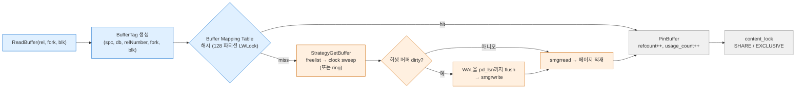

| 구성 요소 | 정의 (18.4) | 크기·개수 |
|---|---|---|
| 버퍼 풀 | `BufferBlocks` 배열 | `shared_buffers` / 8KB 개 (실측 16384 = 128MB) |
| 버퍼 디스크립터 | `BufferDesc` (+ 캐시 라인 패딩 `BufferDescPadded`) | 버퍼당 1개, 64바이트 (`BUFFERDESC_PAD_TO_SIZE`, 64비트 환경) |
| 버퍼 매핑 테이블 | BufferTag → buf_id 해시 | 파티션 `NUM_BUFFER_PARTITIONS 128` (`storage/lwlock.h`) |
| 전략 제어 | `StrategyControl` (freelist 머리, `nextVictimBuffer`) | 1개, `buffer_strategy_lock` 스핀락 |

### 9-2. BufferDesc 와 상태 워드

```c
/* storage/buf_internals.h (18.4) */
typedef struct BufferDesc
{
	BufferTag	tag;			/* ID of page contained in buffer */
	int			buf_id;			/* buffer's index number (from 0) */

	/* state of the tag, containing flags, refcount and usagecount */
	pg_atomic_uint32 state;

	int			wait_backend_pgprocno;	/* backend of pin-count waiter */
	int			freeNext;		/* link in freelist chain */

	PgAioWaitRef io_wref;		/* set iff AIO is in progress */
	LWLock		content_lock;	/* to lock access to buffer contents */
} BufferDesc;
```

`state` 32비트 하나에 세 값을 합쳐 두고 CAS로 한 번에 바꾼다.

```c
#define BUF_REFCOUNT_BITS 18      /* 비트 0~17  : pin 개수 */
#define BUF_USAGECOUNT_BITS 4     /* 비트 18~21 : usage_count */
#define BUF_FLAG_BITS 10          /* 비트 22~31 : 플래그 */
#define BM_MAX_USAGE_COUNT	5
```

| 플래그 | 비트 | 의미 |
|---|---|---|
| `BM_LOCKED` | 1<<22 | 버퍼 **헤더** 스핀락 (내용 잠금 아님) |
| `BM_DIRTY` | 1<<23 | 디스크에 써야 함 |
| `BM_VALID` | 1<<24 | 내용 유효 |
| `BM_TAG_VALID` | 1<<25 | tag 할당됨 |
| `BM_IO_IN_PROGRESS` | 1<<26 | 읽기/쓰기 진행 중 |
| `BM_IO_ERROR` | 1<<27 | 직전 I/O 실패 |
| `BM_JUST_DIRTIED` | 1<<28 | 쓰기 시작 후 다시 dirty |
| `BM_PIN_COUNT_WAITER` | 1<<29 | 단독 pin을 기다리는 백엔드 있음 (cleanup lock) |
| `BM_CHECKPOINT_NEEDED` | 1<<30 | 이번 체크포인트에 써야 함 |
| `BM_PERMANENT` | 1<<31 | 영구 릴레이션 버퍼 (unlogged·임시가 아님) |

헤더 주석: 구조체를 64바이트(가장 흔한 CPU 캐시 라인) 밑으로 유지하는 것이 성능상 중요하다.
PG18에서는 AIO 대기 참조(`io_wref`)가 추가됐다.

### 9-3. pin 과 content lock

`src/backend/storage/buffer/README`의 두 가지 접근 통제:

| 장치 | 무엇을 막나 | 보유 기간 | 구현 |
|---|---|---|---|
| **pin** (참조 카운트) | 버퍼가 다른 페이지로 교체되는 것 | 길어도 됨 (스캔 동안) | `state`의 refcount + 백엔드 로컬 `PrivateRefCount` |
| **content lock** (SHARE/EXCLUSIVE) | 페이지 내용을 동시에 읽고 쓰는 것 | 짧게 | `content_lock` LWLock |

- pin 없이는 아무것도 할 수 없다. lock을 걸기 전에 먼저 pin을 잡는다.
- 튜플을 읽을 때는 pin + SHARE lock, 고칠 때는 pin + EXCLUSIVE lock.
- 힌트 비트(`HEAP_XMIN_COMMITTED` 등)는 SHARE lock만으로 켤 수 있다(README "Buffer access rules").
- 페이지에서 튜플을 물리적으로 지우려면(VACUUM prune) **cleanup lock** = EXCLUSIVE lock +
  "나 말고 pin이 없음"이 필요하다. 다른 pin이 있으면 `BM_PIN_COUNT_WAITER`를 켜고 기다린다.

### 9-4. clock sweep

README "Normal Buffer Replacement Strategy"와 `freelist.c StrategyGetBuffer()`의 동작:

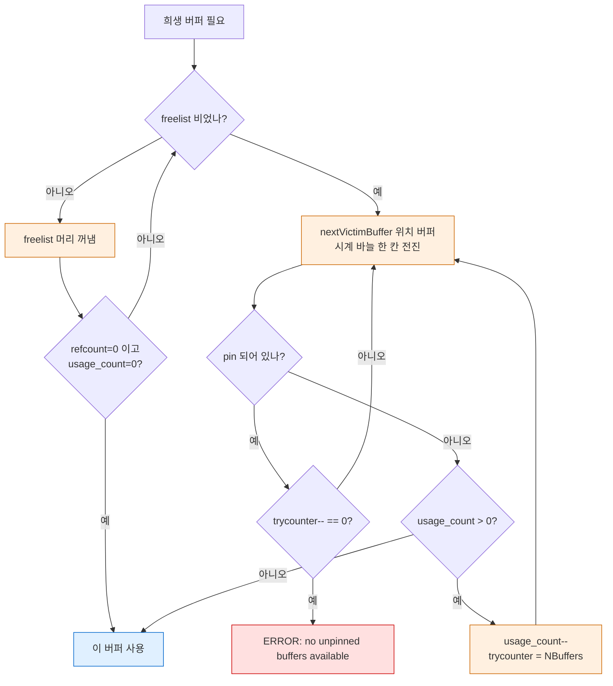

```c
/* src/backend/storage/buffer/freelist.c (REL_18_STABLE) — clock sweep 본체 발췌 */
	trycounter = NBuffers;
	for (;;)
	{
		buf = GetBufferDescriptor(ClockSweepTick());
		local_buf_state = LockBufHdr(buf);

		if (BUF_STATE_GET_REFCOUNT(local_buf_state) == 0)
		{
			if (BUF_STATE_GET_USAGECOUNT(local_buf_state) != 0)
			{
				local_buf_state -= BUF_USAGECOUNT_ONE;
				trycounter = NBuffers;
			}
			else
			{
				/* Found a usable buffer */
				...
				return buf;
			}
		}
		else if (--trycounter == 0)
		{ ... elog(ERROR, "no unpinned buffers available"); }
		...
```

- **usage_count 증가**: pin할 때마다 1씩, 최대 `BM_MAX_USAGE_COUNT`(5)까지 (`bufmgr.c` PinBuffer).
- **감소**: 시계 바늘이 지나갈 때 1씩.
- 즉 자주 쓰인 버퍼는 최대 5바퀴를 버틴다. `buf_internals.h` 주석은 이 상한을 키우면 LRU에
  가까워지지만 빈 버퍼를 찾는 데 최대 `BM_MAX_USAGE_COUNT + 1`바퀴가 걸릴 수 있어 작게 둔다고 설명한다.
- freelist에는 "유효한 페이지가 없는" 버퍼만 들어간다(README: 현재 알고리즘은 그 외 버퍼를
  freelist에 넣지 않는다). 기동 직후나 DROP 후에만 의미가 있다.

### 9-5. ring buffer (BufferAccessStrategy)

한 번만 훑는 대량 작업이 버퍼 캐시 전체를 밀어내지 않도록 작은 **고리(ring)** 안에서 버퍼를 돌려 쓴다.

```c
/* storage/bufmgr.h (18.4) */
typedef enum BufferAccessStrategyType
{
	BAS_NORMAL,		/* Normal random access */
	BAS_BULKREAD,	/* Large read-only scan (hint bit updates are ok) */
	BAS_BULKWRITE,	/* Large multi-block write (e.g. COPY IN) */
	BAS_VACUUM,		/* VACUUM */
} BufferAccessStrategyType;
```

| 전략 | 적용 대상 | 링 크기 (`GetAccessStrategy`, REL_18_STABLE) | dirty 버퍼 처리 |
|---|---|---|---|
| `BAS_NORMAL` | 일반 접근 | 링 없음 (NULL) | — |
| `BAS_BULKREAD` | 순차 스캔 (릴레이션 > `NBuffers / 4`일 때, `heapam.c initscan`) | 256kB + BLCKSZ × `io_combine_limit` × `effective_io_concurrency`, 백엔드 pin 한도(`GetPinLimit()`)로 상한 | 링에서 빼고 일반 clock sweep으로 대체 |
| `BAS_BULKWRITE` | `COPY FROM`, `CREATE TABLE AS` | 16MB (README: shared_buffers의 1/8 이하) | — |
| `BAS_VACUUM` | VACUUM, ANALYZE | 2048kB 기본, `vacuum_buffer_usage_limit` GUC로 조정 (실측 `SHOW` = 2048kB) | 링에 유지, 필요하면 WAL flush 후 재사용 |

링 안에서 재사용할 버퍼는 `refcount = 0`이고 `usage_count ≤ 1`이어야 한다. 다른 백엔드가 그 사이
그 버퍼를 써서 usage_count가 오르면 링에서 빼고 새 버퍼로 바꾼다(`GetBufferFromRing()`).
링으로 읽은 버퍼는 usage_count를 1보다 올리지 않는다("Ring buffers shouldn't evict others from pool").

### 9-6. 실증 — pg_buffercache

`shared_buffers = 128MB`(16384 버퍼) → 링 적용 임계 `NBuffers / 4` = 4096 페이지(32MB).

```text
-- big: 92MB, 11765 페이지 (> 4096) → BAS_BULKREAD 링
SELECT * FROM pg_buffercache_evict_relation('big');   -- 11771 evicted
SELECT count(*) FROM big;
 buffers_in_cache | pg_size_pretty
------------------+----------------
              282 | 2256 kB          ← 92MB를 읽고도 캐시에 남은 건 약 2.2MB
```

282개는 계산식 256kB + 8kB × 16 × 16 = 2304kB(288 버퍼)에 가까운 값이다. 다만 그 사이 pin 한도
상한, 링에서 빠졌다 바뀐 버퍼 같은 요인이 있어 정확한 분해는 확인 필요. 한 번 더 스캔하면 564개로
늘었다. 앞 링의 버퍼가 캐시에 남은 상태에서 새 링이 다시 clock sweep으로 버퍼를 받았기 때문으로 보인다(추정).

```text
-- small: 589 페이지 (< 4096) → 링 없음, 전부 캐시
 buffers_in_cache | max(usagecount)
------------------+-----
              589 |   1               ← 첫 스캔: 모두 usage_count 1
-- 같은 스캔 3번 더
 usagecount | count
------------+-------
          4 |   589                   ← pin 할 때마다 +1
```

`pg_buffercache_usage_counts()`로 전체 분포를 볼 수 있다.

```text
 usage_count | buffers | dirty | pinned
-------------+---------+-------+--------
           0 |   12740 |     0 |      0
           1 |     650 |     7 |      0
           ...
           4 |    2841 |  2430 |      0
           5 |      43 |     5 |      0
```

PG18의 pg_buffercache 1.6에는 `pg_buffercache_evict()`(PG17+), `pg_buffercache_evict_relation()`,
`pg_buffercache_evict_all()`, `pg_buffercache_numa_pages()`가 있다(`\df pg_buffercache*` 실측).

### 9-7. 쓰기 경로와 WAL 규칙

- dirty 버퍼를 디스크에 쓰기 전에 **WAL을 그 페이지의 `pd_lsn`까지 flush**한다
  (`bufpage.h` 주석: "thou shalt write xlog before data").
- 쓰는 주체는 셋이다: checkpointer(체크포인트마다 `BM_CHECKPOINT_NEEDED` 전부),
  background writer(시계 바늘 앞쪽을 미리), 백엔드 자신(희생 버퍼가 dirty일 때).
  프로세스 구성은 [[PostgreSQL/INTERNALS/02-PROCESS-MEMORY|02편]], 체크포인트·full page write는
  [[PostgreSQL/INTERNALS/04-MVCC-WAL|04편]].
- 쓸 때 체크섬을 사본에 계산해 넣는다(§3-8).

---

## 10. smgr / md 계층

### 10-1. 계층 구조

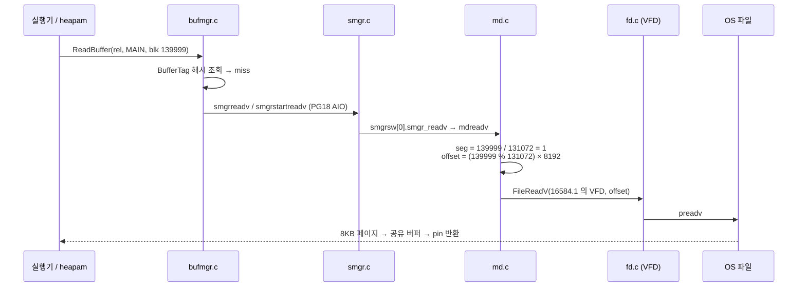

`smgr.c` 머리 주석: "All file system operations on relations dispatch through these routines."
`smgropen()`이 돌려주는 `SMgrRelation`은 백엔드 로컬 해시에 캐시되고, 같은 rel locator로 두 번 열면
같은 객체를 받는다. fork별 마지막으로 알려진 크기(`smgr_cached_nblocks`)도 여기 둔다.

### 10-2. f_smgr 디스패치 테이블

```c
/* src/backend/storage/smgr/smgr.c (REL_18_STABLE) */
static const f_smgr smgrsw[] = {
	/* magnetic disk */
	{
		.smgr_init = mdinit,
		.smgr_shutdown = NULL,
		.smgr_open = mdopen,
		.smgr_close = mdclose,
		.smgr_create = mdcreate,
		.smgr_exists = mdexists,
		.smgr_unlink = mdunlink,
		.smgr_extend = mdextend,
		.smgr_zeroextend = mdzeroextend,
		.smgr_prefetch = mdprefetch,
		.smgr_maxcombine = mdmaxcombine,
		.smgr_readv = mdreadv,
		.smgr_startreadv = mdstartreadv,
		.smgr_writev = mdwritev,
		.smgr_writeback = mdwriteback,
		.smgr_nblocks = mdnblocks,
		.smgr_truncate = mdtruncate,
		.smgr_immedsync = mdimmedsync,
		.smgr_registersync = mdregistersync,
		.smgr_fd = mdfd,
	}
};
```

구현체는 **md("magnetic disk") 하나뿐**이다. 함수 포인터 테이블 구조는 다른 저장 관리자를 끼울
여지로 남아 있는 역사적 흔적이다(SMgrRelationData의 `smgr_which`가 선택자).

| 연산 | 하는 일 | 대표 호출자 |
|---|---|---|
| `mdcreate` / `mdunlink` | fork 파일 생성 / 삭제 (main은 체크포인트 후 unlink, §2-3) | CREATE, TRUNCATE, DROP |
| `mdextend` / `mdzeroextend` | 블록 추가 | 힙 확장 (`hio.c`) |
| `mdreadv` / `mdstartreadv` | 여러 블록 동기 / 비동기 읽기 | 버퍼 매니저, read stream |
| `mdwritev` / `mdwriteback` | 쓰기 / OS에 writeback 힌트 | 버퍼 flush |
| `mdnblocks` | 세그먼트를 차례로 열어 전체 블록 수 계산 | 스캔 계획, 힙 확장 (`pg_relation_size`는 이 경로가 아니라 세그먼트 파일을 직접 `stat()` — [[PostgreSQL/INTERNALS/08-SYSTEM-FUNCTIONS\|08]] §5.7) |
| `mdtruncate` | 뒤쪽 세그먼트는 0블록으로 비활성화 | VACUUM 끝 잘라내기, TRUNCATE |
| `mdregistersync` / `mdimmedsync` | fsync 요청을 checkpointer에 등록 / 즉시 fsync | 체크포인트, WAL 생략 쓰기 |

### 10-3. PG18의 비동기 I/O 진입점

PG18 `f_smgr`에는 `smgr_startreadv`와 `smgr_maxcombine`이 있고, md 쪽에는
`aio_md_readv_cb`(`storage/md.h`의 `PgAioHandleCallbacks`)가 선언되어 있다. 이 클러스터의 실측값:

```text
 io_method                 | worker
 io_combine_limit          | 16      (× 8kB = 128kB)
 effective_io_concurrency  | 16
```

`io_method = worker`는 I/O를 별도 io worker 프로세스에 맡긴다는 뜻이다(프로세스 구조는
[[PostgreSQL/INTERNALS/02-PROCESS-MEMORY|02편]]). `io_combine_limit`는 인접 블록을 한 번의 readv로
묶는 최대 개수이고, `mdmaxcombine`은 세그먼트 경계를 넘지 않도록 그 값을 제한하는 역할이다
(함수 이름과 시그니처에서 확인. 세부 구현은 확인 필요).

---

## 11. 테이블스페이스

```sql
CREATE TABLESPACE ts1 LOCATION '$SCRATCH/ts1';
CREATE TABLE in_ts(a int) TABLESPACE ts1;
SELECT pg_relation_filepath('in_ts');
-- pg_tblspc/16587/PG_18_202506291/16388/16588
```

```text
$PGDATA/pg_tblspc/16587 -> $SCRATCH/ts1          ← 심볼릭 링크, 이름 = 테이블스페이스 OID
$SCRATCH/ts1/PG_18_202506291/                     ← 버전별 하위 디렉토리
$SCRATCH/ts1/PG_18_202506291/16388/               ← DB OID
$SCRATCH/ts1/PG_18_202506291/16388/16588          ← relfilenode
```

| OID | 이름 | 실제 위치 |
|---|---|---|
| 1663 | `pg_default` | `$PGDATA/base/` |
| 1664 | `pg_global` | `$PGDATA/global/` (공유 카탈로그 전용) |
| 16587 | `ts1` | `pg_tblspc/16587` 링크가 가리키는 곳 |

- 버전별 하위 디렉토리(`PG_18_202506291`) 덕분에 같은 위치를 서로 다른 메이저 버전 클러스터가
  함께 써도 충돌하지 않는다(pg_upgrade 중 공존).
- DB 단위 하위 디렉토리는 그 테이블스페이스에 객체가 있는 DB에만 생긴다.
- 서버는 경로를 `pg_class.reltablespace` → `pg_tblspc/<oid>` 링크 순서로 찾는다. 카탈로그에는
  절대 경로가 없고(`pg_tablespace_location()`은 링크를 읽어 돌려준다), 실제 위치는 링크에만 있다.
  서버를 멈추고 링크를 바꿔 위치를 옮기는 방식이 공식 지원 절차인지는 확인 필요.
- `temp_tablespaces`를 지정하면 임시 파일도 그 테이블스페이스의 `pgsql_tmp/`에 생긴다(공식 문서).

---

## 12. 인덱스 페이지 — B-tree 한 장만

인덱스도 같은 슬롯 페이지 형식이고, **special space**에 AM 전용 정보를 둔다는 점만 다르다.

```c
/* access/nbtree.h (18.4) */
typedef struct BTPageOpaqueData
{
	BlockNumber btpo_prev;		/* left sibling, or P_NONE if leftmost */
	BlockNumber btpo_next;		/* right sibling, or P_NONE if rightmost */
	uint32		btpo_level;		/* tree level --- zero for leaf pages */
	uint16		btpo_flags;		/* flag bits, see below */
	BTCycleId	btpo_cycleid;	/* vacuum cycle ID of latest split */
} BTPageOpaqueData;              /* 4+4+4+2+2 = 16 바이트 */

#define BTREE_METAPAGE	0		/* first page is meta */
#define BTREE_MAGIC		0x053162	/* magic number in metapage */
#define BTREE_VERSION	4		/* current version number */
```

```text
-- big(id) 인덱스, 40만 행
SELECT * FROM bt_metap('big_id');
 magic  | version | root | level | fastroot | fastlevel | ... | allequalimage
--------+---------+------+-------+----------+-----------+-----+---------------
 340322 |       4 |  290 |     2 |      290 |         2 | ... | t
```

- `magic = 340322` = `0x053162` = `BTREE_MAGIC`. 블록 0은 항상 메타페이지.
- root는 블록 290, 트리 높이(level) 2. `allequalimage = t`는 중복 제거(deduplication) 가능 여부.

```text
SELECT * FROM page_header(get_raw_page('big_id',1));
 lower | upper | special | ...
-------+-------+---------+
  1492 |  2304 |    8176 |          ← 8192 - 16 = BTPageOpaqueData 자리

SELECT * FROM bt_page_stats('big_id', 1);
 blkno | type | live_items | avg_item_size | free_size | btpo_prev | btpo_next | btpo_level
-------+------+------------+---------------+-----------+-----------+-----------+------------
     1 | l    |        367 |            16 |       808 |         0 |         2 |          0
```

- 힙 페이지는 `special = 8192`(없음), B-tree 페이지는 `8176`이다.
- leaf 항목은 16바이트(IndexTuple 헤더 8 + int4 키 4 + 정렬 패딩 4)이고, `ctid`로 힙 TID를 가리킨다.
- leaf 페이지의 첫 항목(offset 1)은 **high key**다(실측 `ctid (10,1)`, 데이터 0x16f = 367).
  오른쪽 형제의 최소 키 경계를 담는다.

B-tree 알고리즘(Lehman-Yao, 분할, 중복 제거, 페이지 삭제)은 이 시리즈 범위 밖이다.
인덱스 사용 측면은 [[PostgreSQL/11-PERFORMANCE|11. 성능]]을 참고.

---

## 13. 실증 기록 (PostgreSQL 18.4)

로컬 Homebrew PostgreSQL 18.4(`aarch64-apple-darwin`) 전용 임시 클러스터에서 검증.
`initdb -U postgres --auth=trust -E UTF8 --locale=C`, `shared_buffers=128MB`(기본값),
확장 `pageinspect 1.13`, `pg_buffercache 1.6`, `pg_visibility 1.2`, `pg_freespacemap 1.3`.

| # | 시나리오 | 결과 |
|---|---|---|
| V1 | initdb 직후 PGDATA `ls` | 표 1-2의 디렉토리 17개 + 파일 7개. `current_logfiles` 없음 (`logging_collector=off`) |
| V2 | `pg_controldata` | block 8192, segment 131072 블록, WAL seg 16MB, TOAST chunk 1996, **checksum version 1 (initdb 기본)** |
| V3 | `postmaster.pid` 8줄 / 서버 정지 후 | 정지하면 파일 사라짐. `pg_stat/pgstat.stat`(158432B)은 정지 후 생성 |
| V4 | `SHOW block_size / segment_size` 와 `pg_config.h` | 8192 / 1GB ↔ `BLCKSZ 8192`, `RELSEG_SIZE 131072` |
| V5 | 새 테이블 OID vs relfilenode | 16474 = 16474, 경로 `base/16388/16474` |
| V6 | TRUNCATE / VACUUM FULL / CLUSTER / VACUUM / 트랜잭션 안 TRUNCATE 후 ROLLBACK | 16479 / 16482 / 16488 / 변화 없음 / 원래 번호 복귀 |
| V7 | TRUNCATE 직후 옛 파일 | main 0바이트로 남고 `_fsm`은 삭제 → CHECKPOINT 후 main도 삭제 |
| V8 | 매핑 카탈로그 `relfilenode` | pg_class 등 6개 모두 0. `VACUUM FULL pg_class` 후 `pg_relation_filenode` 1259 → 16502 |
| V9 | `pg_filenode.map` 구조 | 524바이트, magic `0x592717`, 17개 매핑, `1259 → 16502` 확인 |
| V10 | fork 생성 시점 | INSERT 후 main+fsm, VACUUM 후 vm, UNLOGGED는 `_init`(0B) |
| V11 | 1GB 세그먼트 (unlogged 1094MB) | `16584` = 1073741824B, `16584.1` = 8928 블록 |
| V12 | 임시 테이블 / 임시 파일 이름 | `t32_16593`(프로세스 번호) / `pgsql_tmp44692.0.fileset/…`(PID) |
| V13 | `page_header` 3행 삽입 | lower 36, upper 8088, special 8192, version 4 |
| V14 | `heap_page_items` lp_off | 8160 → 8120 → 8088 (MAXALIGN 내림 패딩 확인) |
| V15 | short varlena | `'aaa'` 디스크 4바이트(헤더 `0x09`), 리터럴 `pg_column_size` 7 |
| V16 | 체크섬 | 버퍼 안 페이지 checksum 0 → evict 후 재적재 시 −10725 = `page_checksum()` 계산값 |
| V17 | infomask: INSERT / HOT UPDATE / DELETE | HOT_UPDATED·HEAP_ONLY_TUPLE·KEYS_UPDATED 확인 (표 4-4) |
| V18 | VACUUM 후 라인 포인터 | lp1 REDIRECT(→4), lp2 UNUSED, 튜플 끝쪽 재배치, 새 INSERT가 lp2 재사용 |
| V19 | VACUUM FREEZE 후 | `XMIN_COMMITTED + XMIN_INVALID` (= FROZEN), t_xmin 값은 보존 |
| V20 | NULL 비트맵 9컬럼 | t_hoff 24 → 32, lp_len 60 → 64 |
| V21 | 컬럼 순서 bad/good | 튜플 72 vs 51바이트, 10만 행 935 vs 736 페이지 |
| V22 | `row is too big` | `size 9032, maximum size 8160` = `MaxHeapTupleSize` |
| V23 | TOAST 전략 4종 + lz4 | 표 6-3 (plain 5028 / main·extended 93 / external 42 / lz4 62) |
| V24 | TOAST 테이블 생성 조건 | 전부 plain·고정 길이 컬럼이면 `reltoastrelid = 0` |
| V25 | TOAST 청크 | 2100B → 2청크, 100000B → 51청크, 최대 청크 1996 |
| V26 | TOAST 경계 | 튜플 2028B 인라인, 2038B 외부 → 임계값 2032 확인 |
| V27 | FSM | 힙 35페이지에 FSM 3페이지(깊이 3), leaf 시작 인덱스 4095, 값 124 = 3968B |
| V28 | VM | VACUUM → 35/0, DELETE → 24/0 (VM·PD_ALL_VISIBLE 동시 해제), FREEZE → 35/35 |
| V29 | ring buffer (92MB 순차 스캔) | 캐시 잔류 282 버퍼(2256kB). 589페이지 테이블은 전부 캐시 |
| V30 | usage_count | 첫 스캔 1 → 3회 더 스캔 후 4 |
| V31 | 테이블스페이스 | `pg_tblspc/16587` 심볼릭 링크 → `PG_18_202506291/16388/16588` |
| V32 | B-tree 메타페이지 | magic 340322(0x053162), version 4, special 8176 |

**확인 필요로 남긴 항목**

- §11: 서버 정지 후 심볼릭 링크를 바꿔 테이블스페이스를 옮기는 방식이 공식 지원 절차인지.
- §9-6: 링 버퍼 잔류 개수 282의 정확한 분해(pin 한도 상한, 링 슬롯 교체 영향), 두 번째 스캔에서 564로 늘어난 이유.
- §10-3: `mdmaxcombine`의 세그먼트 경계 처리 세부.

---

## 관련 문서

- [[PostgreSQL/INTERNALS/00-INDEX|내부 구조 분석서 인덱스]]
- [[PostgreSQL/INTERNALS/02-PROCESS-MEMORY|02. 프로세스·메모리 아키텍처]]: 공유 버퍼가 놓이는 공유 메모리, checkpointer·bgwriter·io worker
- [[PostgreSQL/INTERNALS/04-MVCC-WAL|04. 트랜잭션·MVCC·WAL 내부]]: 튜플 헤더 xmin/xmax로 하는 가시성 판정, 힌트 비트, HOT, VACUUM·freeze, pd_lsn과 WAL
- [[PostgreSQL/INTERNALS/06-CATALOG-OID|06. 시스템 카탈로그와 OID]]: OID 할당, 매핑 카탈로그와 bootstrap, relcache
- [[PostgreSQL/INTERNALS/08-SYSTEM-FUNCTIONS|08. 기본 제공 시스템 함수와 실행 경로]]: `pg_relation_size` → 세그먼트 파일 `stat()`, `pg_relation_filepath` 등 크기·위치 함수
- [[PostgreSQL/INTERNALS/09-FEATURES-EXTENSIBILITY|09. 지원 기능 총람과 확장성 아키텍처]]: table AM / index AM API
- [[PostgreSQL/14-TUNING|14. DB 튜닝 방법론]]: 컬럼 정렬(Column Tetris), fillfactor·HOT, bloat 진단
- [[PostgreSQL/11-PERFORMANCE|11. 성능]]: 인덱스 설계, 캐시 히트율, shared_buffers
- [[PostgreSQL/02-DDL|02. DDL]]: CREATE TABLE·TABLESPACE 문법
