> **인덱스** [[PostgreSQL/INTERNALS/00-INDEX|내부 구조 분석서]]  ·  **이전** [[PostgreSQL/INTERNALS/03-STORAGE|03. 물리 저장 구조]]  ·  **다음** [[PostgreSQL/INTERNALS/05-QUERY-PIPELINE|05. 쿼리 처리 파이프라인]]

# 04. 트랜잭션·MVCC·WAL 내부

PostgreSQL의 동시성과 내구성은 두 축으로 나뉜다. **MVCC**는 "누가 어떤 행 버전을
보는가"를 XID·스냅샷·CLOG·튜플 헤더로 결정하고, **WAL**은 "커밋된 것은 반드시
살아남는다"를 로그 선기록·체크포인트·redo로 보장한다. 두 축은 커밋 레코드와
힌트 비트, VACUUM·freeze에서 서로 맞물린다.

격리 수준 문법, 락 모드, SAVEPOINT 사용법 같은 **사용법**은
[[PostgreSQL/10-TRANSACTION|10. 트랜잭션, 격리 수준, 락]]에 있고, 이 문서는 그 밑의
**구현**만 다룬다. 튜플 헤더·페이지 레이아웃·VM/FSM의 물리 형식은
[[PostgreSQL/INTERNALS/03-STORAGE|03. 물리 저장 구조]]를 전제로 한다.
본문의 동작은 전부 로컬 PostgreSQL 18.4 임시 클러스터에서 실증했고(§11),
구조체·상수는 18.4 서버 헤더와 `REL_18_STABLE` 소스에서 확인한 것만 인용한다.

## 0. 전체 지도

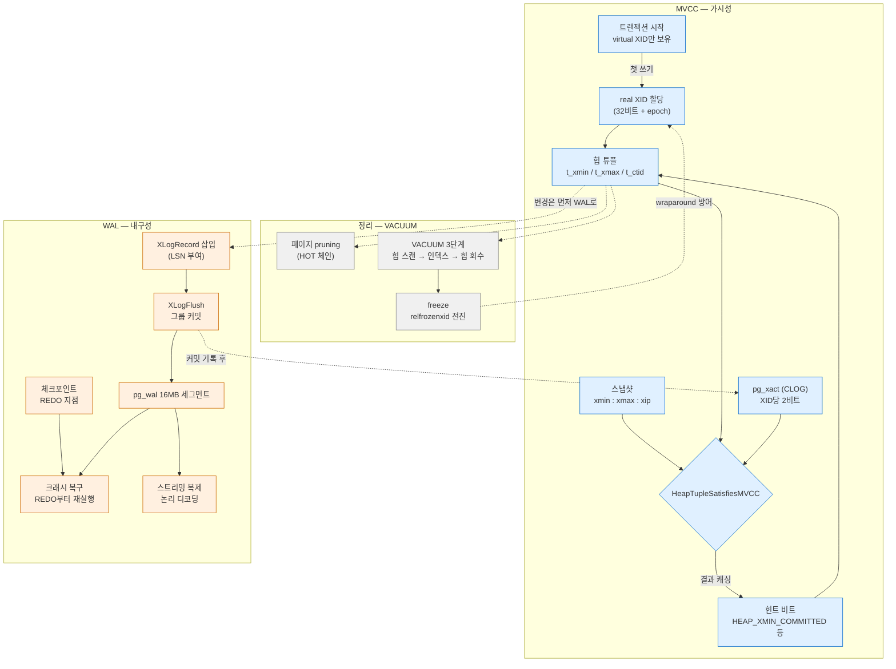

| 축 | 핵심 질문 | 주요 자료구조 | 소스 위치 |
|---|---|---|---|
| 트랜잭션 ID | 이 변경은 누가 했나 | `TransactionId`, `FullTransactionId`, `PGPROC` | `access/transam/xact.c`, `varsup.c` |
| 스냅샷 | 지금 누가 실행 중인가 | `SnapshotData` | `storage/ipc/procarray.c` |
| 가시성 | 이 튜플을 내가 보나 | 튜플 헤더 infomask, CLOG | `access/heap/heapam_visibility.c`, `access/transam/clog.c` |
| 정리 | 아무도 안 보는 버전은 언제 지우나 | VM, TID store | `access/heap/pruneheap.c`, `vacuumlazy.c` |
| WAL | 크래시 후 무엇을 다시 하나 | `XLogRecord`, LSN | `access/transam/xlog.c`, `xloginsert.c` |
| 복제 | WAL을 어떻게 남에게 보내나 | 복제 슬롯, walsender | `replication/` |

---

## 1. 트랜잭션 ID (XID)

### 1.1 virtual XID와 real XID — 지연 할당

모든 트랜잭션은 시작하자마자 **virtual XID**를 받는다. 형식은 `procNumber/lxid` 로,
PGPROC 슬롯 번호와 그 백엔드 안에서만 증가하는 로컬 카운터의 조합이다
(`storage/proc.h` 의 `PGPROC.vxid { ProcNumber procNumber; LocalTransactionId lxid; }`).
공유 카운터를 건드리지 않으므로 비용이 거의 없다.

**real XID**(영구 XID)는 트랜잭션이 처음으로 무언가를 **쓰려는 순간**에야
`AssignTransactionId()` 가 할당한다. `xact.c` 주석이 이를 명시한다.

```c
/* src/backend/access/transam/xact.c (REL_18_STABLE) */
 * Assigns a new permanent FullTransactionId to the given TransactionState.
 * We do not assign XIDs to transactions until/unless this is called.
 * Also, any parent TransactionStates that don't yet have XIDs are assigned
 * one; this maintains the invariant that a child transaction has an XID
 * following its parent's.
```

실증 V1 — `BEGIN` 직후와 `SELECT` 후에는 XID가 없고, `INSERT` 순간 생긴다.

```sql
BEGIN;
SELECT pg_current_xact_id_if_assigned();   -- NULL   (virtualxid 2/3 만 존재)
SELECT 1 FROM t;
SELECT pg_current_xact_id_if_assigned();   -- NULL   (읽기는 XID를 만들지 않음)
INSERT INTO t VALUES (1,'a');
SELECT pg_current_xact_id_if_assigned();   -- 754
SELECT locktype, virtualxid, transactionid, mode
FROM pg_locks WHERE pid = pg_backend_pid()
  AND locktype IN ('virtualxid','transactionid');
```

```text
   locktype    | virtualxid | transactionid |     mode
---------------+------------+---------------+---------------
 virtualxid    | 2/3        |               | ExclusiveLock
 transactionid |            |           754 | ExclusiveLock
```

XID가 생기면 그 트랜잭션은 자기 XID에 대한 `ExclusiveLock` 을 잡는다. 다른 세션이
"이 행을 수정 중인 트랜잭션이 끝날 때까지" 기다리는 행 락 대기는 실제로는 이
`transactionid` 락을 `ShareLock` 으로 요청하는 것이다.

> **`pg_current_xact_id()` 는 부작용이 있다.** XID가 없으면 새로 할당한다.
> 읽기 전용 트랜잭션을 관찰할 때는 `pg_current_xact_id_if_assigned()` 를 쓴다
> (공식 문서도 같은 권고). 함수별 내부 경로는
> [[PostgreSQL/INTERNALS/08-SYSTEM-FUNCTIONS|08. 기본 제공 시스템 함수]] 참고.

| 작업 | real XID 할당 | 근거 |
|---|---|---|
| `BEGIN`, `SELECT` | ✗ | V1 |
| `INSERT` / `UPDATE` / `DELETE` | ✓ | V1 |
| `SELECT ... FOR SHARE` 등 행 락 | ✓ — 락 정보를 `t_xmax` 에 기록하기 때문 | V11 (`t_xmax = 940` = 락 건 트랜잭션 XID) |
| `pg_current_xact_id()` 호출 | ✓ | V1 |
| SAVEPOINT 안에서 첫 쓰기 | 부모(최상위) XID와 subxid 둘 다 | V10 |

지연 할당 덕분에 읽기 전용 트랜잭션은 XID를 소모하지 않고, 따라서
wraparound(§6.5)도 앞당기지 않는다. 또 CLOG에 아무것도 기록하지 않는다.

### 1.2 32비트 XID와 특수 값

`TransactionId` 는 32비트 부호 없는 정수다. 처음 세 값은 예약돼 있다.

```c
/* access/transam.h (18.4 서버 헤더) */
#define InvalidTransactionId		((TransactionId) 0)
#define BootstrapTransactionId		((TransactionId) 1)
#define FrozenTransactionId			((TransactionId) 2)
#define FirstNormalTransactionId	((TransactionId) 3)
#define MaxTransactionId			((TransactionId) 0xFFFFFFFF)
```

| 값 | 이름 | 의미 |
|---|---|---|
| 0 | `InvalidTransactionId` | "XID 없음". `t_xmax = 0` 은 삭제·락 없음 |
| 1 | `BootstrapTransactionId` | initdb 부트스트랩 모드가 만든 카탈로그 행 |
| 2 | `FrozenTransactionId` | 과거 버전의 freeze 표기(현재는 infomask 비트로 표시, §6.3) |
| 3~ | 일반 XID | 순환(wrap)하며 재사용 |

실증에서 `pg_xact_status('1')`, `pg_xact_status('2')` 는 모두 `committed` 를 반환했다
(V5). 특수 XID는 CLOG를 조회하지 않고 "항상 커밋됨"으로 취급되기 때문이다.

**비교는 모듈러 2³² 연산이다.** 일반 XID끼리는 차이를 `int32` 로 캐스팅해 부호로
선후를 판정한다. 즉 어떤 XID 기준으로 약 21억 개 앞은 "과거", 21억 개 뒤는
"미래"다.

```c
/* src/backend/access/transam/transam.c (REL_18_STABLE) */
bool
TransactionIdPrecedes(TransactionId id1, TransactionId id2)
{
	/*
	 * If either ID is a permanent XID then we can just do unsigned
	 * comparison.  If both are normal, do a modulo-2^32 comparison.
	 */
	int32		diff;

	if (!TransactionIdIsNormal(id1) || !TransactionIdIsNormal(id2))
		return (id1 < id2);

	diff = (int32) (id1 - id2);
	return (diff < 0);
}
```

이 원형(circular) 비교가 wraparound 문제의 근원이다. 아주 오래된 커밋 XID가
21억 개 이상 뒤처지면 갑자기 "미래 XID"로 해석돼 행이 사라진 것처럼 보인다.
그래서 오래된 XID는 반드시 freeze(§6.3)해 비교 대상에서 빼야 한다.

### 1.3 epoch와 64비트 FullTransactionId (`xid8`)

내부적으로 다음 XID 카운터는 64비트 `FullTransactionId` 다. 상위 32비트가
**epoch**(wrap 횟수), 하위 32비트가 튜플에 실제로 기록되는 XID다.

```c
/* access/transam.h */
#define EpochFromFullTransactionId(x)	((uint32) ((x).value >> 32))
#define XidFromFullTransactionId(x)		((uint32) (x).value)

typedef struct FullTransactionId
{
	uint64		value;
} FullTransactionId;
```

튜플 헤더에는 공간 절약을 위해 32비트만 저장하고, 64비트 값은 공유 메모리의
카운터·`pg_control`·SQL 함수(`xid8` 타입)에만 존재한다. 공식 문서는 `xid8` 이
"설치 수명 동안 wrap되지 않는다"고 설명한다.

실증 V2 — 정지한 스크래치 클러스터에서 `pg_resetwal -e 5` 로 epoch를 5로 바꾼 뒤:

```text
Latest checkpoint's NextXID:          5:964        ← pg_controldata (epoch:xid)

    xid8     | xid32 | epoch | low32
-------------+-------+-------+-------
 21474837444 |   964 |     5 |   964
```

`5 × 2³² + 964 = 21474837444` 로 정확히 일치한다.
(`pg_resetwal` 은 복구 불가능한 손상 대응용 도구다. 운영 클러스터에서 실험하지 않는다.)

---

## 2. 스냅샷

### 2.1 SnapshotData 핵심 필드

```c
/* utils/snapshot.h (18.4) — 발췌 */
	SnapshotType snapshot_type; /* type of snapshot */
	TransactionId xmin;			/* all XID < xmin are visible to me */
	TransactionId xmax;			/* all XID >= xmax are invisible to me */
	TransactionId *xip;
	uint32		xcnt;			/* # of xact ids in xip[] */
	TransactionId *subxip;
	int32		subxcnt;		/* # of xact ids in subxip[] */
	bool		suboverflowed;	/* has the subxip array overflowed? */
	bool		takenDuringRecovery;	/* recovery-shaped snapshot? */
	bool		copied;			/* false if it's a static snapshot */
	CommandId	curcid;			/* in my xact, CID < curcid are visible */
```

| 필드 | 의미 | 판정 규칙 |
|---|---|---|
| `xmin` | 스냅샷 시점에 실행 중이던 가장 작은 XID | `XID < xmin` → 이미 끝남(커밋/롤백은 CLOG로) |
| `xmax` | 마지막으로 **완료된** XID + 1 | `XID >= xmax` → 무조건 안 보임 |
| `xip[]` | `xmin <= XID < xmax` 중 실행 중인 최상위 XID | 목록에 있으면 안 보임 |
| `subxip[]` | 실행 중인 subxid (캐시 범위 안에서만) | 넘치면 `suboverflowed=true` (§5.2) |
| `curcid` | 자기 트랜잭션 내 명령 번호 | 자기 변경 중 `cmin < curcid` 만 보임 |

`xmax` 계산은 `GetSnapshotData()` 에 그대로 쓰여 있다.

```c
/* src/backend/storage/ipc/procarray.c (REL_18_STABLE) */
	/* xmax is always latestCompletedXid + 1 */
	xmax = XidFromFullTransactionId(latest_completed);
	TransactionIdAdvance(xmax);
```

즉 `xmax` 는 "할당된 최대 XID + 1"이 **아니라** "완료된 최대 XID + 1"이다.
그래서 실행 중인 XID가 `xmax` 이상이면 `xip` 에 넣을 필요조차 없다.

### 2.2 실증 — xip가 비어 있는 경우와 채워지는 경우 (V3)

세션 A(XID 758)와 B(759)를 열어 둔 채 제3 세션에서 `pg_current_snapshot()` 을 본다.
텍스트 표현은 `xmin:xmax:xip_list` 다.

```text
S1 both running : 758:758:            ← 둘 다 xmax(758) 이상 → xip 불필요
S2 B committed  : 758:760:758  xip={758}
```

| 시점 | latestCompletedXid | xmin | xmax | xip | 해석 |
|---|---|---|---|---|---|
| A·B 실행 중 | 757 | 758 | 758 | ∅ | 758, 759 모두 `>= xmax` 이므로 자동 비가시 |
| B만 커밋 | 759 | 758 | 760 | {758} | 759는 완료(보임), 758은 구간 안에서 실행 중 |

자기 트랜잭션 안에서 본 스냅샷도 같은 규칙이다. V1의 XID 754 트랜잭션 안에서
`pg_current_snapshot()` 은 `754:754:` 였다. 자기 XID는 `xip` 가 아니라
`TransactionIdIsCurrentTransactionId()` 와 `curcid` 로 따로 처리한다(§3.2).

### 2.3 격리 수준별 스냅샷 취득 시점

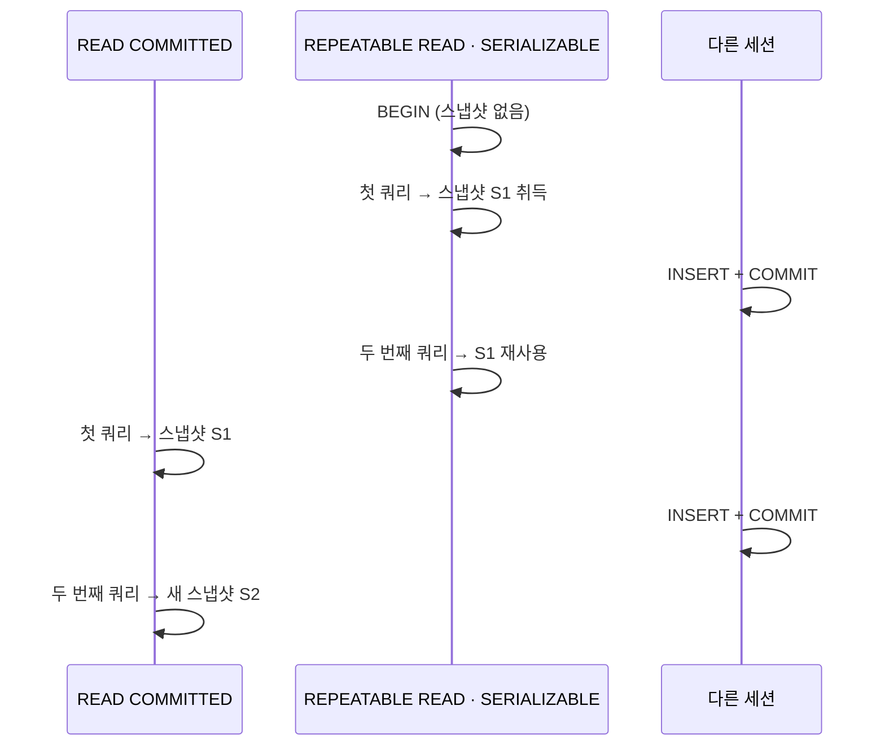

실증 V4 — 같은 세션 C에서 RR 트랜잭션과 RC 트랜잭션을 차례로 실행:

```text
  ?column?   | pg_current_snapshot | count
-------------+---------------------+-------
 C-RR first  | 758:760:758         |     1
 C-RR second | 758:760:758         |     1     ← 중간에 INSERT 커밋됐지만 동일 스냅샷
 C-RC first  | 758:761:758         |     2
 C-RC second | 758:762:758         |     3     ← 문장마다 xmax 전진
```

| 격리 수준 | 스냅샷 취득 | 내부 구현 |
|---|---|---|
| READ COMMITTED | **문장마다** 새로 | `GetTransactionSnapshot()` 이 매번 `GetSnapshotData()` |
| REPEATABLE READ | 트랜잭션의 **첫 문장**에서 한 번 | 이후 같은 스냅샷 재사용 |
| SERIALIZABLE | RR과 동일 + SSI 술어 락 | 충돌 감지는 `storage/lmgr/predicate.c` |

`BEGIN ISOLATION LEVEL REPEATABLE READ` 자체는 스냅샷을 잡지 않는다. "트랜잭션
시작 시점"이라는 흔한 설명은 정확히는 "첫 문장 시작 시점"이다(V4에서 RR 첫
쿼리의 스냅샷이 BEGIN 이후 상태를 반영). 동시 UPDATE 충돌 시 RC의 재평가
(EvalPlanQual)와 RR의 `40001` 에러는 사용법 문서
[[PostgreSQL/10-TRANSACTION|10. 트랜잭션]] §3에 있다.

### 2.4 스냅샷 종류

`snapshot_type` 은 MVCC 스냅샷 외에도 여러 용도가 있다(`utils/snapshot.h` 의
`SnapshotType` 열거형).

| 타입 | 용도 |
|---|---|
| `SNAPSHOT_MVCC` | 일반 쿼리. 이 문서의 기본 대상 |
| `SNAPSHOT_SELF` | 자기 트랜잭션의 현재 명령 변경까지 보임 |
| `SNAPSHOT_ANY` | 모든 튜플(가시성 무시) |
| `SNAPSHOT_TOAST` | TOAST 값 조회 |
| `SNAPSHOT_DIRTY` | 실행 중 트랜잭션 변경도 보임(유니크 검사 등) |
| `SNAPSHOT_HISTORIC_MVCC` | 논리 디코딩이 과거 카탈로그를 읽을 때 (§10.2) |
| `SNAPSHOT_NON_VACUUMABLE` | "VACUUM이 아직 못 지우는" 튜플까지 보임 |

---

## 3. 가시성 판정

### 3.1 판정 재료

튜플 헤더의 `t_xmin`(삽입 XID), `t_xmax`(삭제·락 XID), `t_cid`(cmin/cmax 또는
combo CID), `t_infomask`, `t_ctid` 가 재료다. 바이트 배치는
[[PostgreSQL/INTERNALS/03-STORAGE|03. 물리 저장 구조]], 시스템 컬럼으로서의 노출은
[[PostgreSQL/INTERNALS/06-CATALOG-OID|06. 시스템 카탈로그와 OID]] 참고.
여기서는 가시성과 직결되는 `t_infomask` 비트만 정리한다.

```c
/* access/htup_details.h (18.4) */
#define HEAP_XMAX_KEYSHR_LOCK	0x0010	/* xmax is a key-shared locker */
#define HEAP_COMBOCID			0x0020	/* t_cid is a combo CID */
#define HEAP_XMAX_EXCL_LOCK		0x0040	/* xmax is exclusive locker */
#define HEAP_XMAX_LOCK_ONLY		0x0080	/* xmax, if valid, is only a locker */
#define HEAP_XMIN_COMMITTED		0x0100	/* t_xmin committed */
#define HEAP_XMIN_INVALID		0x0200	/* t_xmin invalid/aborted */
#define HEAP_XMIN_FROZEN		(HEAP_XMIN_COMMITTED|HEAP_XMIN_INVALID)
#define HEAP_XMAX_COMMITTED		0x0400	/* t_xmax committed */
#define HEAP_XMAX_INVALID		0x0800	/* t_xmax invalid/aborted */
#define HEAP_XMAX_IS_MULTI		0x1000	/* t_xmax is a MultiXactId */
#define HEAP_UPDATED			0x2000	/* this is UPDATEd version of row */
/* t_infomask2 */
#define HEAP_KEYS_UPDATED		0x2000
#define HEAP_HOT_UPDATED		0x4000	/* tuple was HOT-updated */
#define HEAP_ONLY_TUPLE			0x8000	/* this is heap-only tuple */
```

### 3.2 HeapTupleSatisfiesMVCC 흐름

`heapam_visibility.c` 의 `HeapTupleSatisfiesMVCC()` 를 xmin 판정 → xmax 판정 두 단계로
요약하면 다음과 같다(pre-9.0 `HEAP_MOVED_*` 분기 생략).

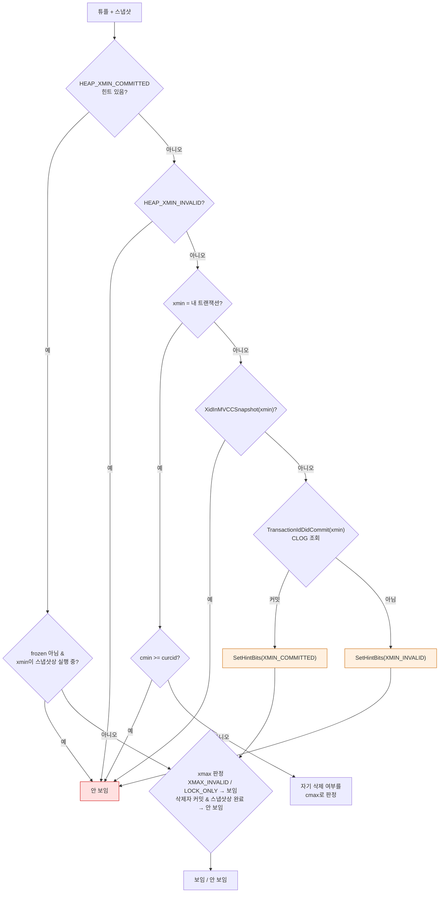

xmax 쪽도 대칭 구조다. `HEAP_XMAX_INVALID` 이거나 `HEAP_XMAX_LOCK_ONLY`(락만 걸린
상태)면 삭제되지 않은 것으로 보고, 삭제자가 자기 자신이면 `cmax` 로, 남이면
스냅샷 → CLOG 순으로 판정하며 결과를 `HEAP_XMAX_COMMITTED` / `HEAP_XMAX_INVALID`
힌트로 남긴다. `HEAP_XMAX_IS_MULTI` 면 MultiXact 멤버 중 실제 갱신자 XID를 꺼내
판정한다(§5.3).

### 3.3 "스냅샷 먼저, CLOG 나중" 순서의 이유

같은 파일 머리 주석이 이 순서를 강제하는 이유를 설명한다.

```c
/* src/backend/access/heap/heapam_visibility.c — 머리 주석 발췌 */
 * NOTE: When using a non-MVCC snapshot, we must check
 * TransactionIdIsInProgress (which looks in the PGPROC array) before
 * TransactionIdDidCommit (which look in pg_xact).  Otherwise we have a race
 * condition: we might decide that a just-committed transaction crashed,
 * because none of the tests succeed.  xact.c is careful to record
 * commit/abort in pg_xact before it unsets MyProc->xid in the PGPROC array.
 ...
 * When using an MVCC snapshot, we rely on XidInMVCCSnapshot rather than
 * TransactionIdIsInProgress, but the logic is otherwise the same: do not
 * check pg_xact until after deciding that the xact is no longer in progress.
```

정리하면:

- 커밋 경로는 **CLOG 기록 → PGPROC에서 XID 제거** 순서다(§8.1에서 소스로 확인).
- 그래서 "CLOG엔 커밋인데 ProcArray엔 아직 실행 중"인 창이 존재한다.
- CLOG만 보면 다른 세션의 다음 스냅샷과 판단이 어긋날 수 있으므로, 항상 "아직
  실행 중인가"를 먼저 묻고 아니라고 확정된 뒤에 CLOG를 본다.
- 롤백 판정도 `TransactionIdDidAbort` 를 쓰지 않는다. 크래시로 중단된 트랜잭션은
  CLOG에 abort가 기록되지 않으므로 "실행 중도 아니고 커밋도 아니면 abort"라는
  소거법을 쓴다(같은 주석).

### 3.4 CLOG (`pg_xact`) — XID당 2비트

CLOG는 XID별 최종 상태를 담는 SLRU(Simple LRU) 저장소다.

```c
/* access/clog.h (18.4) */
#define TRANSACTION_STATUS_IN_PROGRESS		0x00
#define TRANSACTION_STATUS_COMMITTED		0x01
#define TRANSACTION_STATUS_ABORTED			0x02
#define TRANSACTION_STATUS_SUB_COMMITTED	0x03

/* src/backend/access/transam/clog.c */
#define CLOG_BITS_PER_XACT	2
#define CLOG_XACTS_PER_BYTE 4
#define CLOG_XACTS_PER_PAGE (BLCKSZ * CLOG_XACTS_PER_BYTE)

/* access/slru.h */
#define SLRU_PAGES_PER_SEGMENT	32
```

| 항목 | 값 | 계산 |
|---|---|---|
| XID당 비트 | 2 | 상태 4가지 |
| 페이지(8KB)당 XID | 32,768 | 8192 × 4 |
| 세그먼트 파일당 XID | 1,048,576 | 32,768 × 32 페이지 |
| 세그먼트 파일 크기(최대) | 256KB | 8KB × 32 |
| 공유 메모리 캐시 | `transaction_buffers` (V5에서 `256kB`) | PG17+ GUC |

`SUB_COMMITTED` 는 subtransaction 커밋 시 부모가 아직 끝나지 않았음을 뜻하는
중간 상태다. 부모 커밋 시 하위 XID들이 원자적으로 `COMMITTED` 로 바뀐다.

실증 V5 — `pg_xact` 디렉토리와 상태 조회:

```text
$PGDATA/pg_xact:      0000          ← 실증 범위(XID < 1,048,576)는 파일 하나
$PGDATA/pg_subtrans:  0000
$PGDATA/pg_multixact/offsets: 0000   members: 0000

  x  | pg_xact_status
-----+----------------
 949 | committed
 957 | aborted          ← ROLLBACK한 트랜잭션
   1 | committed        ← Bootstrap
   2 | committed        ← Frozen
 961 | in progress      ← 자기 자신
```

`pg_xact_status('3')` 은 `NULL` 이었다. 이 클러스터의 `oldest_xid` 는 744였고,
공식 문서는 "충분히 오래돼 커밋 상태 정보가 폐기된 경우 NULL"이라고 설명한다.
CLOG는 `datfrozenxid` 보다 오래된 구간을 잘라내도 되도록(truncate) 설계돼 있다.
freeze가 끝난 튜플은 CLOG를 더 이상 참조하지 않기 때문이다.

### 3.5 힌트 비트 — SELECT가 쓰기를 유발하는 이유

CLOG 조회는 SLRU 버퍼 탐색과 락을 수반한다. 같은 튜플을 볼 때마다 반복하지 않도록,
처음 판정한 백엔드가 결과를 튜플의 `t_infomask` 에 **캐싱**한다. 이것이 힌트 비트다.
읽기만 하는 SELECT도 버퍼 페이지를 수정하게 되는 이유가 여기 있다.

실증 V6 — 커밋 후 `CHECKPOINT` 로 버퍼를 깨끗하게 만든 뒤 일반 SELECT 1회:

```text
--- raw after insert+checkpoint
 lp | t_xmin | t_xmax | infomask | xmin_committed | xmax_invalid
  1 |    764 |      0 | 802      | f              | t
 isdirty = f

--- raw after plain SELECT
  1 |    764 |      0 | 902      | t              | t      ← 0x0100 추가
 isdirty = t                                               ← 버퍼가 dirty
```

`0x802 → 0x902` 로 `HEAP_XMIN_COMMITTED(0x0100)` 이 켜졌고 `pg_buffercache.isdirty`
가 `f → t` 로 바뀌었다. 롤백된 행은 반대로 `HEAP_XMIN_INVALID(0x0200)` 가 켜진다
(같은 실증에서 `0x802 → 0xa02`).

`HEAP_XMAX_INVALID(0x0800)` 는 INSERT 시점부터 이미 켜져 있다. 삭제자가 없음을
삽입자가 알고 있으니 처음부터 기록한다.

#### 힌트 비트를 아무 때나 세울 수 없는 이유

```c
/* heapam_visibility.c — SetHintBits() */
	if (TransactionIdIsValid(xid))
	{
		/* NB: xid must be known committed here! */
		XLogRecPtr	commitLSN = TransactionIdGetCommitLSN(xid);

		if (BufferIsPermanent(buffer) && XLogNeedsFlush(commitLSN) &&
			BufferGetLSNAtomic(buffer) < commitLSN)
		{
			/* not flushed and no LSN interlock, so don't set hint */
			return;
		}
	}

	tuple->t_infomask |= infomask;
	MarkBufferDirtyHint(buffer, true);
```

비동기 커밋(§8.3)에서는 커밋이 CLOG엔 반영됐지만 커밋 WAL은 아직 디스크에 없을 수
있다. 이때 "커밋됨" 힌트가 붙은 페이지가 먼저 디스크에 내려가고 크래시가 나면,
복구 후 그 트랜잭션은 커밋되지 않았는데 힌트만 남는다. 그래서 **커밋 WAL이
플러시되기 전에는 COMMITTED 힌트를 세우지 않는다**. ABORTED 힌트는 언제든 세워도
된다(같은 함수 주석).

또 `HeapTupleSatisfiesMVCC` 머리 주석에 따르면, 스냅샷상 "아직 실행 중"인 XID에
대해서는 실제로 끝났더라도 힌트를 세우지 않는다. 실제 상태를 확인하려면
ProcArray 같은 경합이 심한 공유 구조를 봐야 하는데, 그래 봐야 이번 판정 결과는
바뀌지 않기 때문이다. 힌트는 "충분히 새 스냅샷을 가진 첫 방문자"가 세운다.

#### 체크섬이 켜져 있으면 힌트도 WAL을 만든다 (PG18 기본)

PG18부터 `initdb` 가 **데이터 체크섬을 기본으로 켠다**(PG18 릴리스 노트, 비활성화는
`--no-data-checksums`). 이 실증 클러스터도 옵션 없이 만들었는데
`SHOW data_checksums` = `on`, `pg_controldata` 의 `Data page checksum version: 1` 이었다.

체크섬은 페이지 전체에 대한 값이므로, 힌트 비트 1비트만 바뀌어도 체크섬이 달라진다.
디스크에 반쯤 쓰인 페이지(torn page)는 체크섬 불일치로 읽기 에러가 되므로,
체크포인트 후 첫 힌트 변경 시에는 **페이지 전체 이미지를 WAL에 남긴다**.

실증 V7 — CHECKPOINT 직후 SELECT 1회가 만든 WAL:

```text
 start_lsn | rmgr | record_type  | len | fpi | block_ref
-----------+------+--------------+-----+-----+-------------------------------------------------
 0/18A53C8 | XLOG | FPI_FOR_HINT | 109 |  60 | blkref #0: rel 1663/5/16479 fork main blk 0 (FPW);
                                              |   hole: offset: 28, length: 8132
```

`XLOG_FPI_FOR_HINT`(`catalog/pg_control.h` 의 `0xA0`) 레코드 하나가 생겼다. 페이지에
튜플이 하나뿐이라 빈 구간(hole) 8132바이트를 빼고 60바이트만 저장됐다. 큰 테이블을
처음 풀 스캔하면 페이지마다 이런 레코드가 생겨 **읽기 쿼리가 WAL을 대량 생성**할 수 있다.

공식 문서(`wal_log_hints`): "If data checksums are enabled, hint bit updates are always
WAL-logged and this setting is ignored." `wal_log_hints=on` 은 체크섬이 꺼진 클러스터에서
같은 동작을 강제하는 옵션이다(`pg_rewind` 요건).

---

## 4. UPDATE·DELETE와 HOT

### 4.1 UPDATE = 새 튜플 + 옛 튜플의 xmax

PostgreSQL의 UPDATE는 제자리 수정이 아니다.

1. 옛 버전의 `t_xmax` 에 자기 XID를 쓰고, `t_ctid` 를 새 버전 위치로 바꾼다.
2. 새 버전을 (가능하면 같은 페이지에) 삽입한다. `t_xmin` = 자기 XID, `HEAP_UPDATED` 플래그.
3. DELETE는 1번만 한다. `t_ctid` 는 자기 자신을 가리킨 채로 남는다.

`t_ctid` 가 이어진 고리가 **업데이트 체인**이다. 최신 버전은 `t_ctid` 가 자기 자신을
가리킨다. READ COMMITTED의 EvalPlanQual은 이 체인을 따라가 최신 버전을 찾는다.

### 4.2 HOT (Heap-Only Tuple)

일반 UPDATE는 새 튜플 위치(TID)가 바뀌므로 **모든 인덱스에 새 엔트리**를 넣어야 한다.
HOT는 아래 조건을 만족하면 인덱스를 건드리지 않는다.

- 인덱스가 걸린 컬럼 값이 하나도 바뀌지 않음
- 새 버전이 **같은 힙 페이지**에 들어갈 공간이 있음

이때 옛 버전에 `HEAP_HOT_UPDATED`, 새 버전에 `HEAP_ONLY_TUPLE` 이 켜진다.
인덱스는 체인의 **루트**(최초 버전)만 가리키고, 인덱스 스캔은 루트에서 체인을 따라가
보이는 버전을 찾는다.

실증 V8 — `u(id pk, k 인덱스, v)` 에서 비인덱스 컬럼 `v` 를 두 번, 인덱스 컬럼 `k` 를
한 번 수정:

```text
 lp | t_xmin | t_xmax | t_ctid | flags
----+--------+--------+--------+-------------------------------------------------
  1 |    773 |    774 | (0,2)  | {HEAP_HOT_UPDATED}
  2 |    774 |    775 | (0,3)  | {HEAP_UPDATED,HEAP_HOT_UPDATED,HEAP_ONLY_TUPLE}
  3 |    775 |    776 | (0,4)  | {HEAP_UPDATED,HEAP_ONLY_TUPLE}
  4 |    776 |      0 | (0,4)  | {HEAP_UPDATED}                ← k 변경: HOT 아님

 n_tup_upd | n_tup_hot_upd
-----------+---------------
         3 |             2

-- u_k_idx 리프 엔트리
 itemoffset | ctid  | data
          1 | (0,1) | 0a 00 00 00 ...    ← k=10, HOT 체인 루트 lp1
          2 | (0,4) | 0b 00 00 00 ...    ← k=11, 새 엔트리
```

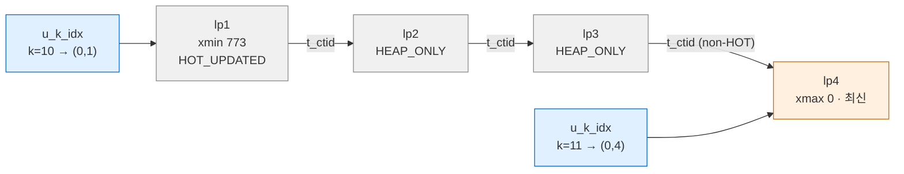

WAL에서도 구분된다(V17). 같은 실증 테이블의 HOT 갱신은 `Heap / HOT_UPDATE` 레코드
하나뿐이었고 Btree 레코드가 없었다.

### 4.3 페이지 내 pruning — VACUUM 없이 공간 회수

HOT 체인의 중간 버전들은 인덱스가 가리키지 않으므로, 아무 스냅샷도 볼 수 없게 되면
**VACUUM을 기다리지 않고** 그 페이지를 읽는 백엔드가 즉시 정리할 수 있다
(`heap_page_prune_opt()`, `pruneheap.c`). 발동 조건:

```c
/* src/backend/access/heap/pruneheap.c */
	minfree = RelationGetTargetPageFreeSpace(relation,
											 HEAP_DEFAULT_FILLFACTOR);
	minfree = Max(minfree, BLCKSZ / 10);

	if (PageIsFull(page) || PageGetHeapFreeSpace(page) < minfree)
```

즉 페이지 여유 공간이 fillfactor 목표치와 `BLCKSZ/10`(819바이트) 중 큰 값보다 작아지면
pruning을 시도한다.

실증 V9 — 700바이트 행 하나를 14번 UPDATE(각각 autocommit):

```text
 lp | lp_flags | lp_off | t_xmin | t_xmax | t_ctid
----+----------+--------+--------+--------+--------
  1 |        2 |     10 |        |        |          ← LP_REDIRECT → lp 10
  2 |        1 |   6720 |    788 |    789 | (0,3)
  ...
  6 |        1 |   3776 |    792 |      0 | (0,6)    ← 최신
  7 |        0 |      0 |        |        |          ← LP_UNUSED (재사용 가능)
  8 |        0 |      0 |        |        |
  9 |        0 |      0 |        |        |
 10 |        1 |   7456 |    787 |    788 | (0,2)
 pg_relation_size = 8192        ← 14번 갱신했지만 여전히 1페이지
```

| `lp_flags` | 이름 | 의미 |
|---|---|---|
| 0 | `LP_UNUSED` | 비어 있음. 새 튜플이 재사용 |
| 1 | `LP_NORMAL` | 튜플 있음 |
| 2 | `LP_REDIRECT` | 루트 라인 포인터를 남기고 체인의 다른 lp로 연결 (`lp_off` = 대상 lp 번호) |
| 3 | `LP_DEAD` | 죽은 튜플, 저장 공간은 회수했으나 인덱스가 아직 가리킬 수 있음 |

루트 lp1은 인덱스가 가리키고 있으므로 지울 수 없다. 대신 튜플 본체를 지우고
**리다이렉트 포인터**로 바꿔 살아 있는 체인 시작점(lp10)을 가리킨다(`README.HOT`).
비-HOT 튜플은 인덱스 엔트리가 있으므로 pruning으로는 `LP_DEAD` 까지만 가고,
`LP_UNUSED` 로 돌리는 것은 인덱스를 정리하는 VACUUM의 몫이다(§6.1).

pruning도 WAL을 남긴다. V17의 카탈로그 페이지에서 `Heap2 / PRUNE_ON_ACCESS` 레코드
(`ndead: 1`)가 관찰됐다. PG18의 레코드 이름이며, 이전 버전은 이름이 다르다(확인 필요).

---

## 5. Subtransaction과 MultiXact

### 5.1 subxid와 `pg_subtrans`

`SAVEPOINT`, PL/pgSQL `EXCEPTION` 블록은 subtransaction을 연다. subtransaction도
첫 쓰기 시점에 자기 XID(subxid)를 받으며, 부모가 XID가 없으면 부모 것부터 할당해
"자식 XID > 부모 XID" 불변식을 지킨다(§1.1의 `AssignTransactionId` 주석).

`pg_subtrans` 는 subxid → 부모 XID 매핑을 담는 SLRU다.

```c
/* src/backend/access/transam/subtrans.c — 머리 주석 */
 * The pg_subtrans manager is a pg_xact-like manager that stores the parent
 * transaction Id for each transaction.
 ...
 * pg_subtrans information for currently-open transactions.  Thus, there is
 * no need to preserve data over a crash and restart.
 *
 * There are no XLOG interactions since we do not care about preserving
 * data across crashes.  During database startup, we simply force the
 * currently-active page of SUBTRANS to zeroes.
```

CLOG와 달리 **실행 중인 트랜잭션에 대해서만** 의미가 있으므로 WAL을 남기지 않고
재기동 시 0으로 초기화한다.

### 5.2 PGPROC의 64개 subxid 캐시와 오버플로

각 백엔드는 자기 subxid를 PGPROC에 최대 64개까지 광고한다.

```c
/* storage/proc.h (18.4) */
#define PGPROC_MAX_CACHED_SUBXIDS 64	/* XXX guessed-at value */
	/* number of cached subxids, never more than PGPROC_MAX_CACHED_SUBXIDS */
	TransactionId xids[PGPROC_MAX_CACHED_SUBXIDS];
```

`GetSnapshotData()` 는 이 캐시를 `subxip[]` 로 복사한다. 어느 백엔드든 65번째 subxid를
만들면 캐시가 넘쳐(overflowed) 스냅샷의 `suboverflowed = true` 가 된다. 이후 그 스냅샷을
쓰는 판정은 `subxip` 를 믿을 수 없으므로 `pg_subtrans` 를 따라 최상위 XID를 찾아야
한다(`procarray.c` 의 `SubTransGetTopmostTransaction()` 호출부). 이 SLRU 접근이
대량 동시 접속에서 경합 지점이 될 수 있다.

실증 V10 — 한 트랜잭션에서 `SAVEPOINT + INSERT` 를 64회, 65회 반복하고
`pg_stat_get_backend_subxact()`(PG16+)로 확인:

```text
    t     | subxact_count | subxact_overflowed
----------+---------------+--------------------
 after 64 |            64 | f
 after 65 |            64 | t        ← 캐시는 64에서 멈추고 overflow 표시

-- 커밋 후 행들의 xmin
 distinct_xmin | min | max
---------------+-----+-----
            65 | 874 | 938       ← 최상위 XID 873이 아니라 subxid 65개가 xmin
```

같은 실증에서 `pg_stat_slru` 의 `subtransaction` 행 `blks_hit` 가 65로 늘었다.
SAVEPOINT 안에서 `pg_current_xact_id_if_assigned()` 를 부르면 subxid가 아니라
**최상위 XID**가 나온다(공식 문서 명시, V10에서 806 확인).

> **관찰 함정**: `pg_stat_*` 함수 결과는 트랜잭션 안에서 캐시된다
> (`stats_fetch_consistency = cache` 기본). 같은 트랜잭션에서 값 변화를 보려면 조회 전에
> `pg_stat_clear_snapshot()` 을 호출해야 한다. 이를 빠뜨리면 64개를 만들어도 1로 보인다.

PL/pgSQL 루프 안의 `EXCEPTION` 블록은 반복마다 subtransaction을 만든다. 그 블록 안에서
쓰기를 하면 반복마다 subxid를 소모하므로, 긴 루프는 쉽게 64개를 넘긴다.

### 5.3 MultiXact — 여러 트랜잭션이 한 행을 잠글 때

행 락은 `t_xmax` 에 락 건 XID를 쓰고 `HEAP_XMAX_LOCK_ONLY` 를 켜는 방식이다.
그런데 `t_xmax` 칸은 하나뿐이다. 둘 이상이 공유 락을 걸면 **MultiXactId** 라는
별도 ID를 만들어 `t_xmax` 에 넣고 `HEAP_XMAX_IS_MULTI` 를 켠다. 멤버 목록은
`pg_multixact/offsets` 와 `pg_multixact/members` SLRU에 저장된다.

실증 V11 — A가 `FOR SHARE`, B가 `FOR KEY SHARE`:

```text
     s       | t_xmax | raw_flags
-------------+--------+--------------------------------------------------------------
 one locker  |    940 | {HEAP_XMAX_KEYSHR_LOCK,HEAP_XMAX_EXCL_LOCK,HEAP_XMAX_LOCK_ONLY,...}
 two lockers |      1 | {...,HEAP_XMAX_LOCK_ONLY,HEAP_XMIN_COMMITTED,HEAP_XMAX_IS_MULTI}

SELECT * FROM pg_get_multixact_members('1');
 xid | mode
-----+-------
 940 | sh
 941 | keysh
```

`FOR SHARE` 는 `KEYSHR_LOCK|EXCL_LOCK` 조합(= `HEAP_XMAX_SHR_LOCK`)으로 표현된다.
두 번째 락이 들어오자 `t_xmax` 가 XID 940에서 MultiXactId 1로 바뀌었다.

```c
/* access/multixact.h (18.4) */
	MultiXactStatusForKeyShare = 0x00,
	MultiXactStatusForShare = 0x01,
	MultiXactStatusForNoKeyUpdate = 0x02,
	MultiXactStatusForUpdate = 0x03,
	MultiXactStatusNoKeyUpdate = 0x04,
	MultiXactStatusUpdate = 0x05,
```

| 상태 | SQL |
|---|---|
| `ForKeyShare` | `FOR KEY SHARE` (FK 검사) |
| `ForShare` | `FOR SHARE` |
| `ForNoKeyUpdate` | `FOR NO KEY UPDATE` |
| `ForUpdate` | `FOR UPDATE` |
| `NoKeyUpdate` | 키 아닌 컬럼 UPDATE |
| `Update` | 키 컬럼 UPDATE / DELETE |

`NoKeyUpdate` / `Update` 가 있다는 것은, 락커들과 **실제 갱신자 하나**가 같은 MultiXact에
공존할 수 있다는 뜻이다. FK 자식 행 INSERT(`KEY SHARE`)가 부모의 비키 컬럼 UPDATE를
막지 않는 것이 이 구조 덕분이다. MultiXactId도 32비트이며(`MaxMultiXactId = 0xFFFFFFFF`)
XID처럼 freeze 대상이다(`relminmxid`, `mxid_age()`, §6.5).

---

## 6. VACUUM 내부

### 6.1 세 단계

`vacuumlazy.c` 머리 주석의 정의:

```c
/* src/backend/access/heap/vacuumlazy.c */
 * Heap relations are vacuumed in three main phases. In phase I, vacuum scans
 * relation pages, pruning and freezing tuples and saving dead tuples' TIDs in
 * a TID store. If that TID store fills up or vacuum finishes scanning the
 * relation, it progresses to phase II: index vacuuming. Index vacuuming
 * deletes the dead index entries referenced in the TID store. In phase III,
 * vacuum scans the blocks of the relation referred to by the TIDs in the TID
 * store and reaps the corresponding dead items, freeing that space for future
 * tuples.
```

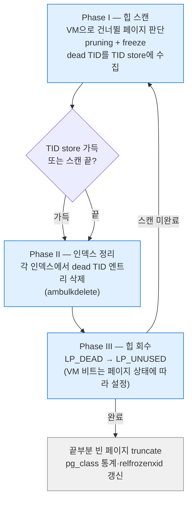

순서가 중요하다. 힙의 라인 포인터를 `LP_UNUSED` 로 돌리기 **전에** 인덱스 엔트리를
지워야 한다. 그렇지 않으면 재사용된 lp를 인덱스의 옛 엔트리가 가리키게 된다.
TID store 용량은 `maintenance_work_mem`(기본 `64MB`, autovacuum은
`autovacuum_work_mem = -1` 이면 이를 따름)으로 제한되며, 넘치면 Phase II·III를
여러 번 반복한다.

실증 V12 — 20,000행 중 5,000행 DELETE 후 `VACUUM (VERBOSE)`:

```text
INFO:  finished vacuuming "postgres.public.vt": index scans: 1
pages: 0 removed, 167 remain, 167 scanned (100.00% of total), 0 eagerly scanned
tuples: 5000 removed, 15000 remain, 0 are dead but not yet removable
removable cutoff: 947, which was 0 XIDs old when operation ended
new relfrozenxid: 945, which is 1 XIDs ahead of previous value
visibility map: 167 pages set all-visible, 0 pages set all-frozen (0 were all-visible)
index scan needed: 167 pages from table (100.00% of total) had 5000 dead item identifiers removed
index "vt_pkey": pages: 57 in total, 0 newly deleted, 0 currently deleted, 0 reusable
WAL usage: 561 records, 4 full page images, 93456 bytes, 0 buffers full
```

| 출력 | 의미 |
|---|---|
| `index scans: 1` | Phase II를 1회 실행(TID store가 한 번에 충분) |
| `removable cutoff: 947` | 이 XID보다 오래된 삭제만 회수 가능 — VACUUM horizon |
| `dead but not yet removable` | horizon 때문에 못 지운 튜플 수 (§6.6) |
| `visibility map: 167 pages set all-visible` | Phase III 후 VM 비트 설정 |

VACUUM 후 페이지 0의 4번 lp(id=4, 삭제됨)는 `lp_flags = 0`(`LP_UNUSED`)이었다.

### 6.2 VM 갱신

VM은 힙 페이지당 2비트(`all-visible`, `all-frozen`)다(물리 형식은
[[PostgreSQL/INTERNALS/03-STORAGE|03]]). 실증 V12에서 `pg_visibility_map('vt')` 집계는
VACUUM 전 `0/0/167` → VACUUM 후 `167/0/167` → FREEZE 후 `167/167` 이었다.

- **all-visible**: 페이지의 모든 튜플이 모든 트랜잭션에 보임 → 인덱스 전용 스캔이 힙을
  방문하지 않고, 다음 일반 VACUUM이 그 페이지를 건너뜀
- **all-frozen**: 모든 튜플이 freeze됨 → aggressive VACUUM도 건너뜀
- 페이지에 INSERT/UPDATE/DELETE가 일어나면 두 비트가 지워진다

### 6.3 Freeze

freeze는 "이 튜플의 xmin은 모든 미래 트랜잭션에 과거다"라고 확정하는 작업이다.
현재는 `t_xmin` 을 2(`FrozenTransactionId`)로 덮어쓰지 않고
`HEAP_XMIN_FROZEN = HEAP_XMIN_COMMITTED | HEAP_XMIN_INVALID` 두 비트를 동시에 켠다.
원래 xmin 값은 포렌식용으로 남는다(9.4 릴리스 노트: "Improve the way tuples are frozen
to preserve forensic information").

실증 V13 — `VACUUM (FREEZE, VERBOSE)` 전후:

```text
-- 전
 lp | t_xmin | to_hex
  1 |    945 | 902        ← XMIN_COMMITTED | XMAX_INVALID | HASVARWIDTH
-- 후
 lp | t_xmin | to_hex | combined_flags
  1 |    945 | b02    | {HEAP_XMIN_FROZEN}     ← xmin 945 그대로, 0x0200 비트 추가

INFO:  aggressively vacuuming "postgres.public.vt"
frozen: 167 pages from table (100.00% of total) had 15000 tuples frozen
visibility map: 0 pages set all-visible, 167 pages set all-frozen (167 were all-visible)
new relfrozenxid: 947, which is 2 XIDs ahead of previous value
```

`HeapTupleSatisfiesMVCC` 는 `HeapTupleHeaderXminFrozen()` 이면 xmin을 스냅샷과 비교하지
않는다(§3.2 흐름의 첫 분기). 따라서 frozen 튜플은 XID가 아무리 순환해도 안전하다.

### 6.4 relfrozenxid와 aggressive VACUUM

- `pg_class.relfrozenxid`: 이 테이블에서 freeze되지 않은 xmin 중 최소값의 하한.
  이보다 오래된 XID는 테이블에 없음이 보장된다.
- `pg_database.datfrozenxid`: DB 안 모든 테이블 `relfrozenxid` 의 최솟값.
- `age(xid)`: 현재 XID와의 거리.

일반 VACUUM은 VM의 all-visible 페이지를 건너뛰므로 relfrozenxid를 크게 전진시키지 못할
수 있다. 테이블 나이가 `vacuum_freeze_table_age` 를 넘으면 **aggressive** VACUUM이 되어
all-frozen이 아닌 모든 페이지를 스캔한다(V13의 `aggressively vacuuming`).

**PG18 eager freezing**: 일반 VACUUM도 all-visible이지만 all-frozen이 아닌 페이지 일부를
선제적으로 스캔해 freeze한다. 실패 허용률은 `vacuum_max_eager_freeze_failure_rate`
(기본 `0.03`)로 조절한다(PG18 릴리스 노트). VERBOSE 출력의 `0 eagerly scanned` 가
이 카운터다.

### 6.5 Wraparound 방어 계단

`varsup.c` 의 `SetTransactionIdLimit()` 은 가장 오래된 `datfrozenxid` 를 기준으로
네 개의 한계를 계산한다.

```c
/* src/backend/access/transam/varsup.c (REL_18_STABLE) */
	xidWrapLimit = oldest_datfrozenxid + (MaxTransactionId >> 1);
	...
	xidStopLimit = xidWrapLimit - 3000000;
	...
	xidWarnLimit = xidWrapLimit - 40000000;
	...
	xidVacLimit = oldest_datfrozenxid + autovacuum_freeze_max_age;
```

실증 V14 — 기본값(`pg_settings`):

| 파라미터 | 기본값 | 역할 |
|---|---|---|
| `vacuum_freeze_min_age` | 50,000,000 | 이보다 오래된 xmin은 VACUUM 중 freeze |
| `vacuum_freeze_table_age` | 150,000,000 | 넘으면 aggressive VACUUM |
| `autovacuum_freeze_max_age` | 200,000,000 | 넘으면 autovacuum 꺼져 있어도 강제 실행(`xidVacLimit`) |
| `vacuum_failsafe_age` | 1,600,000,000 | 넘으면 failsafe: 비용 지연·인덱스 정리 생략하고 freeze만 |
| `vacuum_multixact_freeze_min_age` | 5,000,000 | MultiXact 버전 |
| `vacuum_multixact_freeze_table_age` | 150,000,000 | 〃 |
| `autovacuum_multixact_freeze_max_age` | 400,000,000 | 〃 |
| `vacuum_multixact_failsafe_age` | 1,600,000,000 | 〃 |

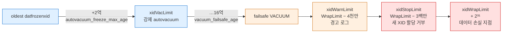

`xidStopLimit` 에 도달하면 XID를 할당하는 명령이 다음 에러로 거부된다(`varsup.c`).

```text
ERROR: database is not accepting commands that assign new transaction IDs to avoid
       wraparound data loss in database "..."
HINT:  Execute a database-wide VACUUM in that database.
```

XID가 필요 없는 읽기는 계속 가능하다(§1.1 지연 할당의 효과). 그 전 단계에서는
`database "..." must be vacuumed within N transactions` 경고가 나온다.

실증 클러스터는 갓 만든 것이라 `age(datfrozenxid)` 가 12였다(V1). wraparound 자체는
재현하지 않았다.

### 6.6 VACUUM horizon을 붙잡는 것들

`removable cutoff` 는 "아직 누군가 볼 수 있는 가장 오래된 XID"다. 다음이 이를 붙잡는다.

| 원인 | 확인 위치 |
|---|---|
| 오래 열린 트랜잭션·스냅샷 | `pg_stat_activity.backend_xmin` |
| 방치된 prepared transaction | `pg_prepared_xacts` |
| 복제 슬롯의 `xmin` / `catalog_xmin` | `pg_replication_slots` (V23에서 `catalog_xmin = 954`) |
| 스탠바이의 `hot_standby_feedback` | `pg_stat_replication.backend_xmin` |

운영 관점의 진단 쿼리는 [[PostgreSQL/10-TRANSACTION|10. 트랜잭션]] §5,
[[PostgreSQL/14-TUNING|14. DB 튜닝 방법론]]에 있다.

---

## 7. WAL 구조

### 7.1 WAL-before-data 원칙

데이터 페이지를 디스크에 쓰기 **전에**, 그 페이지를 바꾼 WAL 레코드가 먼저 디스크에
있어야 한다. 구현은 다음과 같다.

1. 페이지를 수정한 백엔드는 WAL 레코드를 삽입하고 받은 **LSN을 페이지 헤더
   `pd_lsn`** 에 기록한다.
2. 버퍼 매니저는 dirty 페이지를 내보내기 전에 `XLogFlush(pd_lsn)` 를 호출해 그 지점까지
   WAL을 플러시한다.

덕분에 데이터 파일 쓰기는 지연·비순차로 해도 되고, 커밋 시점에는 **WAL만 순차
fsync** 하면 된다. 이것이 WAL이 성능 기법이기도 한 이유다.

### 7.2 레코드 구조

```c
/* access/xlogrecord.h (18.4) */
 * The overall layout of an XLOG record is:
 *		Fixed-size header (XLogRecord struct)
 *		XLogRecordBlockHeader struct
 *		XLogRecordBlockHeader struct
 *		...
 *		XLogRecordDataHeader[Short|Long] struct
 *		block data
 *		block data
 *		...
 *		main data

typedef struct XLogRecord
{
	uint32		xl_tot_len;		/* total len of entire record */
	TransactionId xl_xid;		/* xact id */
	XLogRecPtr	xl_prev;		/* ptr to previous record in log */
	uint8		xl_info;		/* flag bits, see below */
	RmgrId		xl_rmid;		/* resource manager for this record */
	/* 2 bytes of padding here, initialize to zero */
	pg_crc32c	xl_crc;			/* CRC for this record */
} XLogRecord;

#define SizeOfXLogRecord	(offsetof(XLogRecord, xl_crc) + sizeof(pg_crc32c))
```

| 필드 | 크기 | 역할 |
|---|---|---|
| `xl_tot_len` | 4 | 레코드 전체 길이 |
| `xl_xid` | 4 | 레코드를 만든 XID (없으면 0 — V17의 `FPI_FOR_HINT` 는 xid 0) |
| `xl_prev` | 8 | 직전 레코드 LSN. 역방향 연결로 무결성 검사 |
| `xl_info` | 1 | 하위 4비트 공용 플래그, 상위 4비트 rmgr별 레코드 타입 |
| `xl_rmid` | 1 | 리소스 매니저 ID (§7.4) |
| (padding) | 2 | |
| `xl_crc` | 4 | CRC-32C |

고정 헤더는 **24바이트**다. V21 크래시 복구 로그의 `invalid record length at 0/1DCDAD0:
expected at least 24, got 0` 이 바로 이 크기를 검사하다 WAL 끝을 만난 것이다.

블록 참조는 레코드당 최대 33개(`XLR_MAX_BLOCK_ID = 32`, 0부터)이며, 블록 헤더에
`BKPBLOCK_HAS_IMAGE` 가 켜져 있으면 full page image가 따라온다. 이미지 압축은
`BKPIMAGE_COMPRESS_PGLZ/LZ4/ZSTD` 로 표시된다(`wal_compression`, 기본 `off`).
`id` 바이트 255/254/253/252는 각각 짧은 main data, 긴 main data, 복제 origin,
최상위 XID용으로 예약돼 있다.

### 7.3 LSN과 세그먼트 파일

`XLogRecPtr` 는 `uint64` 다(`access/xlogdefs.h`). **WAL 스트림 전체에서의 바이트 위치**이며,
텍스트로는 상위·하위 32비트를 `X/Y` 16진수로 쓴다.

```sql
SELECT pg_current_wal_insert_lsn();               -- 0/1D12538
SELECT pg_walfile_name('0/1D12538');               -- 000000010000000000000001
SELECT (pg_walfile_name_offset('0/1D12538')).file_offset;  -- 13706552
```

| 구성 | 값 | 근거 |
|---|---|---|
| 세그먼트 크기 | 16MB (`DEFAULT_XLOG_SEG_SIZE = 16*1024*1024`) | `pg_config_manual.h`, `SHOW wal_segment_size` = 16777216 |
| WAL 페이지 | 8KB (`XLOG_BLCKSZ = 8192`) | `pg_config.h` |
| 파일명 | 타임라인(8) + 상위 LSN(8) + 세그먼트 번호(8), 16진 | `00000001 00000000 00000001` |

`0x1D12538` 을 16MB(`0x1000000`)로 나누면 몫 1(세그먼트 번호), 나머지 `0xD12538` =
13,706,552(파일 내 오프셋)로 함수 결과와 일치한다. 세그먼트 크기는 `initdb --wal-segsize`
로만 바꿀 수 있다.

LSN 함수 세 개는 서로 다른 지점을 가리킨다.

| 함수 | 지점 |
|---|---|
| `pg_current_wal_insert_lsn()` | WAL 버퍼에 삽입된 끝 |
| `pg_current_wal_lsn()` | OS에 write된 끝 |
| `pg_current_wal_flush_lsn()` | fsync까지 끝난 지점 |

V6에서 `pg_current_wal_lsn()` 차이가 0으로 나왔지만 `pg_current_wal_insert_lsn()` 으로는
112바이트(V7)였다. 방금 생긴 레코드는 아직 write 전이라 write 위치가 움직이지 않았던
것이다. **WAL 생성량 측정에는 insert LSN을 쓴다.**

### 7.4 리소스 매니저 (rmgr)

WAL 레코드의 해석·재실행은 리소스 매니저별 콜백(`rm_redo`, `rm_desc` 등)이 맡는다.
목록은 `access/rmgrlist.h` 의 `PG_RMGR(...)` 매크로에 정의된다.

실증 V16 — `pg_get_wal_resource_managers()`:

| id | rmgr | 주요 레코드 |
|---|---|---|
| 0 | XLOG | `CHECKPOINT_*`, `FPI_FOR_HINT`, `SWITCH` |
| 1 | Transaction | `COMMIT`, `ABORT`, `ASSIGNMENT` |
| 2 | Storage | 파일 생성·truncate |
| 3 | CLOG | CLOG 페이지 zero·truncate |
| 4 | Database | `CREATE/DROP DATABASE` |
| 5 | Tablespace | |
| 6 | MultiXact | |
| 7 | RelMap | 매핑 카탈로그 |
| 8 | Standby | `RUNNING_XACTS`, 락 정보 |
| 9 | Heap2 | prune, freeze, visible, multi-insert |
| 10 | Heap | `INSERT`, `UPDATE`, `HOT_UPDATE`, `DELETE`, `LOCK` |
| 11~17 | Btree, Hash, Gin, Gist, Sequence, SPGist, BRIN | 인덱스 AM·시퀀스 |
| 18 | CommitTs | |
| 19 | ReplicationOrigin | |
| 20 | Generic | 확장용 generic WAL |
| 21 | LogicalMessage | `pg_logical_emit_message()` |

22개 모두 `rm_builtin = t` 였다. 확장은 custom rmgr를 등록할 수 있다(PG15+, 릴리스 노트
"Allow extensions to define custom WAL resource managers").
확장성 관점은 [[PostgreSQL/INTERNALS/09-FEATURES-EXTENSIBILITY|09. 지원 기능 총람과 확장성 아키텍처]] 참고.

### 7.5 트랜잭션 하나의 WAL 레코드 (V17)

```sql
CREATE TABLE w(id int primary key, v text);
CHECKPOINT;
BEGIN;
INSERT INTO w VALUES (1,'one');
INSERT INTO w VALUES (2,'two');
UPDATE w SET v='uno' WHERE id=1;
DELETE FROM w WHERE id=2;
COMMIT;
SELECT * FROM pg_get_wal_records_info(:'l0', :'l1');
```

```text
 start_lsn | xid |    rmgr     | record_type     | len  | fpi  | description
-----------+-----+-------------+-----------------+------+------+--------------------------------------------
 0/1D12538 |   0 | XLOG        | FPI_FOR_HINT    | 8209 | 8160 |  (rel 1259 = pg_class 카탈로그 페이지)
 0/1D14568 |   0 | Heap2       | PRUNE_ON_ACCESS |   52 |    0 | isCatalogRel: T, ndead: 1, dead: [6]
 ... (FPI_FOR_HINT 5건 더: pg_class 인덱스, pg_attribute 등)
 0/1D1ADE8 | 949 | Heap        | INSERT+INIT     |   63 |    0 | off: 1, flags: 0x08
 0/1D1AE28 | 949 | Btree       | NEWROOT         |   90 |    0 | level: 0
 0/1D1AE88 | 949 | Btree       | INSERT_LEAF     |   64 |    0 | off: 1
 0/1D1AEC8 | 949 | Heap        | INSERT          |   63 |    0 | off: 2, flags: 0x08
 0/1D1AF08 | 949 | Btree       | INSERT_LEAF     |   64 |    0 | off: 2
 0/1D1AF48 | 949 | Heap        | HOT_UPDATE      |   74 |    0 | old_xmax: 949, old_off: 1, new_off: 3
 0/1D1AF98 | 949 | Heap        | DELETE          |   64 |    0 | xmax: 949, off: 2, infobits: [KEYS_UPDATED]
 0/1D1AFD8 | 949 | Transaction | COMMIT          |   46 |    0 | 2026-10-05 23:33:12.248291+09
```

관찰 포인트:

- 각 레코드의 `prev_lsn` 이 직전 `start_lsn` 과 이어진다(`xl_prev`).
- 쿼리 계획 중 카탈로그를 읽으며 생긴 **힌트 비트 FPI가 35,536바이트 중 34,456바이트**를
  차지했다(`pg_get_wal_stats`). 실제 DML 레코드는 수백 바이트뿐이다. §3.5의 효과다.
- 새 페이지 첫 삽입은 `INSERT+INIT` 이라 이미지가 필요 없다(페이지를 초기화하고 시작).
- HOT 갱신은 Btree 레코드가 없다(§4.2).
- `COMMIT` 은 트랜잭션의 마지막 레코드이며 커밋 시각을 담는다.

### 7.6 Full page write — torn page 대책

공식 문서(`full_page_writes`):

> 이 파라미터가 on이면 체크포인트 후 각 페이지의 **첫 수정 시** 페이지 전체를 WAL에 쓴다.
> OS 크래시 중 진행되던 페이지 쓰기는 일부만 완료될 수 있어, 디스크 페이지에 옛 데이터와
> 새 데이터가 섞인다. WAL에 보통 저장하는 행 단위 변경만으로는 이런 페이지를 복구할 수
> 없다. (요지)

PostgreSQL 페이지는 8KB인데 파일시스템·디스크의 원자적 쓰기 단위는 그보다 작을 수 있다
(일반적으로 4KB 또는 512B, 환경 의존). 반쯤 쓰인 페이지에 "off 3의 튜플을 바꿔라" 같은
델타를 적용하면 손상이 커진다. 그래서 체크포인트 이후 첫 변경에는 **페이지 원본 전체**를
남기고, 복구는 그 이미지로 페이지를 통째로 덮은 뒤 이후 델타를 적용한다.

실증 V18 — 체크포인트 직후 같은 페이지를 두 번 UPDATE:

```text
 start_lsn | xid |    rmgr     | record_type | len | fpi | block_ref
-----------+-----+-------------+-------------+-----+-----+--------------------------------------------
 0/1D1B110 | 950 | Heap        | HOT_UPDATE  | 276 | 184 | blk 0 (FPW); hole: offset: 40, length: 8008
 0/1D1B228 | 950 | Transaction | COMMIT      |  46 |   0 |
 0/1D1B258 | 951 | Heap        | HOT_UPDATE  |  77 |   0 | blk 0                    ← 두 번째는 델타만
 0/1D1B2A8 | 951 | Transaction | COMMIT      |  46 |   0 |
```

"이 페이지가 체크포인트 이후 처음 바뀌는가"는 `pd_lsn` 이 현재 REDO 지점보다 앞서는지로
판정한다. **체크포인트 간격이 짧을수록 FPW가 늘어** WAL이 커지는 이유가 이것이다.
`hole` 은 `pd_lower`~`pd_upper` 사이 빈 공간으로, 이미지에서 제외된다.

---

## 8. 커밋 경로와 내구성

### 8.1 커밋 순서 (소스 확인)

`xact.c` 의 `CommitTransaction()` → `RecordTransactionCommit()` 호출 순서를 줄 번호로
확인한 결과(REL_18_STABLE):

| 순서 | 호출 | xact.c 위치 | 의미 |
|---|---|---|---|
| ① | `XactLogCommitRecord()` | 1446행 | 커밋 WAL 레코드 삽입 |
| ② | `XLogFlush(XactLastRecEnd)` | 1506행 | 동기 커밋: 그 LSN까지 fsync |
| ②' | `XLogSetAsyncXactLSN()` | 1533행 | 비동기 커밋: 플러시 없이 WAL writer에 알림 |
| ③ | `TransactionIdCommitTree()` / `TransactionIdAsyncCommitTree()` | 1518 / 1541행 | CLOG에 커밋 기록(하위 XID 포함) |
| ④ | `SyncRepWaitForLSN()` | 1567행 | 동기 복제면 스탠바이 응답 대기 |
| ⑤ | `ProcArrayEndTransaction()` | 2399행 | PGPROC에서 XID 제거 → 이제 다른 스냅샷이 "완료"로 봄 |

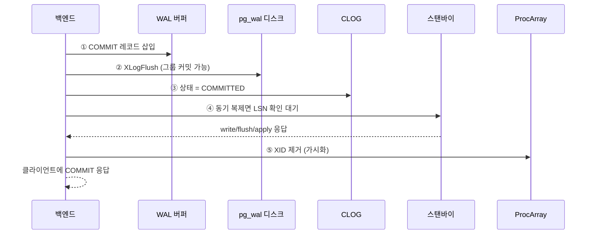

③과 ⑤ 사이에 "CLOG엔 커밋, ProcArray엔 실행 중"인 창이 있고, §3.3의 판정 순서가 이를
전제로 설계돼 있다. ④가 ⑤보다 앞서므로, 동기 복제 대기 중인 트랜잭션은 로컬에서는
커밋됐지만 다른 세션에는 아직 보이지 않는다.

비동기 커밋의 ③은 CLOG에 커밋 LSN을 함께 넘긴다(`TransactionIdAsyncCommitTree(...,
XactLastRecEnd)`). §3.5의 `SetHintBits` 가 `TransactionIdGetCommitLSN()` 으로 이 LSN을 읽어
"아직 플러시 전이면 힌트 보류"를 판단한다.

### 8.2 그룹 커밋

`XLogFlush()` 는 여러 백엔드의 fsync를 한 번으로 합친다.

```c
/* src/backend/access/transam/xlog.c — XLogFlush() 발췌 */
	 * Since fsync is usually a horribly expensive operation, we try to
	 * piggyback as much data as we can on each fsync: if we see any more data
	 * entered into the xlog buffer, we'll write and fsync that too, so that
	 * the final value of LogwrtResult.Flush is as large as possible.
	 ...
		 * Try to get the write lock. If we can't get it immediately, wait
		 * until it's released, and recheck if we still need to do the flush
		 * or if the backend that held the lock did it for us already. This
		 * helps to maintain a good rate of group committing when the system
		 * is bottlenecked by the speed of fsyncing.
		 */
		if (!LWLockAcquireOrWait(WALWriteLock, LW_EXCLUSIVE))
```

동작 요약:

1. `WALWriteLock` 을 잡은 백엔드(리더)는 자기 LSN만이 아니라 **그때까지 삽입된 WAL 전부**를
   write + fsync 한다.
2. 락을 기다리던 백엔드(팔로워)는 락이 풀리면 `LogwrtResult.Flush` 를 다시 보고, 자기 LSN이
   이미 플러시됐으면 fsync 없이 끝난다(`LWLockAcquireOrWait` 가 이를 위한 락 모드).
3. `commit_delay`(기본 0, μs) > 0 이고 활성 트랜잭션이 `commit_siblings`(기본 5) 이상이면
   리더가 fsync 직전에 잠깐 자서 팔로워를 더 모은다.

공식 문서는 `commit_delay` 를 "비동기 커밋과 비슷해 보이지만 실제로는 동기 커밋 기법"이라고
구분한다. 비동기 커밋에서는 무시된다.

CLOG 갱신과 ProcArray XID 제거에도 같은 발상의 그룹 처리가 있다
(`clog.c` 의 `TransactionGroupUpdateXidStatus()`, `procarray.c` 의 `ProcArrayGroupClearXid()`).
락 경합 시 한 백엔드가 대기자들의 갱신을 대신 처리한다.

### 8.3 `synchronous_commit` 단계

| 설정 | 로컬 플러시 대기 | 스탠바이 | 보장 범위 (공식 문서 표 19.1 요약) |
|---|---|---|---|
| `off` | ✗ | ✗ | 크래시 시 최근 커밋 유실 가능, **일관성은 유지** |
| `local` | ✓ | ✗ | 로컬 내구성만 |
| `remote_write` | ✓ | OS에 write 확인 | 스탠바이 PG 크래시까지 견딤, OS 크래시는 아님 |
| `on` (기본) | ✓ | flush 확인 | 스탠바이 OS 크래시까지 견딤 |
| `remote_apply` | ✓ | replay 확인 | 커밋 직후 스탠바이 조회에도 보임 |

스탠바이 열은 `synchronous_standby_names` 가 설정된 경우에만 의미가 있다. 설정이 없으면
`on`/`remote_*` 는 로컬 플러시만 기다린다.

`off` 의 유실 창은 공식 문서상 **최대 `wal_writer_delay` 의 3배**(기본 200ms → 최대 약 600ms)다.
공식 문서는 이것이 "데이터 손실 위험이지 손상 위험이 아니다"라고 강조한다. WAL은 순서대로
재실행되므로 B가 A에 의존하는데 A만 사라지는 일은 없다.

실증 V19:

```text
off   : insert=0/1E58D70 flush=0/1E56CD8     ← COMMIT 응답 후에도 플러시 전
off+1s: insert=0/1E58D70 flush=0/1E58D70     ← WAL writer가 따라잡음
on    : insert=0/1E58DE0 flush=0/1E58DE0     ← 응답 시점에 이미 플러시
```

`synchronous_commit` 은 세션·트랜잭션 단위로 바꿀 수 있다. 중요도 낮은 로그성 INSERT만
`SET LOCAL synchronous_commit = off` 로 처리하는 것이 전형적인 용법이다.

---

## 9. 체크포인트와 크래시 복구

### 9.1 체크포인트가 하는 일

체크포인트는 "이 LSN 이전의 변경은 모두 데이터 파일에 반영됐다"는 지점(REDO 지점)을 만든다.

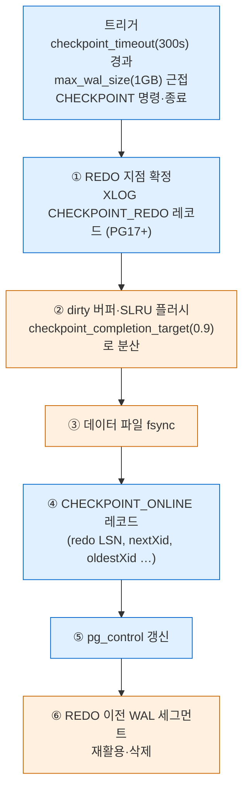

체크포인트는 시작 시점의 REDO 지점을 기록하고 버퍼를 천천히 쓰는 동안에도 다른 트랜잭션이
계속 WAL을 만든다. 그래서 **체크포인트 레코드 LSN > REDO LSN** 이다.

실증 V20 — `pg_control_checkpoint()` 와 해당 구간 WAL:

```text
checkpoint_lsn       | 0/1D1B098
redo_lsn             | 0/1D1B040
redo_wal_file        | 000000010000000000000001
full_page_writes     | t
next_xid             | 0:950
next_multixact_id    | 2
oldest_xid           | 744
oldest_active_xid    | 950

 start_lsn | resource_manager |    record_type    | description
-----------+------------------+-------------------+--------------------------------------------------
 0/1D1B040 | XLOG             | CHECKPOINT_REDO   | wal_level logical
 0/1D1B060 | Standby          | RUNNING_XACTS     | nextXid 950 latestCompletedXid 949 oldestRunningXid 950
 0/1D1B098 | XLOG             | CHECKPOINT_ONLINE | redo 0/1D1B040; tli 1; ... xid 0:950; ... online
```

`XLOG_CHECKPOINT_REDO`(`pg_control.h` 의 `0xE0`)가 정확히 `redo_lsn` 에 있고,
`CHECKPOINT_ONLINE` 이 `checkpoint_lsn` 에 있다. 사이의 `RUNNING_XACTS` 는 스탠바이가
복구 중 스냅샷을 만들 수 있도록 실행 중 트랜잭션 목록을 남긴 것이다.
(`CHECKPOINT_REDO` 레코드 도입 버전은 PG17로 알고 있으나 릴리스 노트 대조는 하지 않았다 — 확인 필요.)

| 파라미터 | 기본값 (V14) |
|---|---|
| `checkpoint_timeout` | 300s |
| `max_wal_size` | 1024MB (soft limit) |
| `min_wal_size` | 80MB |
| `checkpoint_completion_target` | 0.9 |
| `full_page_writes` | on |

### 9.2 크래시 복구 = REDO 지점부터 재실행

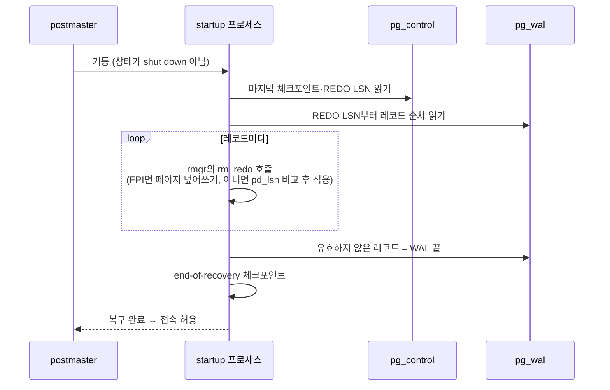

redo는 **멱등**이어야 한다. 각 페이지의 `pd_lsn` 이 레코드 LSN 이상이면 이미 반영된 것으로
보고 건너뛴다. 커밋 레코드가 WAL에 없는 트랜잭션은 CLOG가 `IN_PROGRESS` 로 남고, 복구 후
아무 PGPROC에도 없으므로 §3.3의 소거법에 의해 **abort로 판정**된다. 별도의 undo 단계가 없다.
이는 PostgreSQL이 옛 버전을 힙에 그대로 두는 MVCC 설계의 직접적 이점이다.

실증 V21 — 10,000행 커밋 + 미커밋 INSERT 1건을 열어 둔 채 `pg_ctl stop -m immediate`:

```text
LOG:  database system was interrupted; last known up at 2026-10-05 23:33:45 KST
LOG:  database system was not properly shut down; automatic recovery in progress
LOG:  redo starts at 0/1D1BB28                         ← 직전 CHECKPOINT의 redo_lsn과 일치
LOG:  invalid record length at 0/1DCDAD0: expected at least 24, got 0
LOG:  redo done at 0/1DCDAA0 system usage: CPU: user: 0.00 s, system: 0.00 s, elapsed: 0.00 s
LOG:  checkpoint starting: end-of-recovery immediate wait
LOG:  checkpoint complete: wrote 62 buffers (0.4%), wrote 2 SLRU buffers; ...
      distance=711 kB, estimate=711 kB; lsn=0/1DCDAD0, redo lsn=0/1DCDAD0
LOG:  database system is ready to accept connections

SELECT count(*), min(id) FROM crash;   -- 10000 | 1   (미커밋 -1 행 없음)
```

| 관찰 | 해석 |
|---|---|
| `redo starts at 0/1D1BB28` | 크래시 직전 실행한 `CHECKPOINT` 의 `redo_lsn` 과 동일 |
| `invalid record length ... got 0` | 0으로 채워진 영역 = 기록된 WAL의 끝 |
| `redo done at 0/1DCDAA0` | 크래시 전 insert LSN은 `0/1DCDB10` 이었음 → 미커밋 INSERT 레코드는 WAL 버퍼에만 있다가 소실 |
| end-of-recovery 체크포인트 | 복구 결과를 확정하고 새 REDO 지점 생성 |
| `min(id) = 1` | 미커밋 행(-1)은 없음 |

---

## 10. 복제 원리

### 10.1 스트리밍 복제 — 물리 WAL 전송

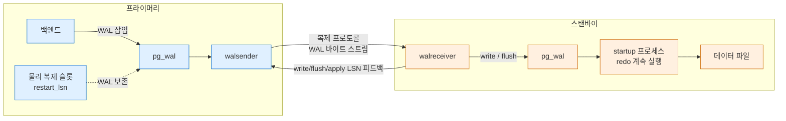

스탠바이는 §9.2의 크래시 복구를 **끝내지 않고 계속하는** 서버다. 프라이머리의 WAL 바이트를
그대로 받아 같은 rmgr redo 함수로 적용하므로, 결과는 블록 단위로 동일한 복제본이다.
그래서 같은 메이저 버전·같은 아키텍처여야 한다.

- `walsender`: 프라이머리 쪽 보조 백엔드. 복제 프로토콜로 접속한 클라이언트마다 하나
  (프로세스 구조는 [[PostgreSQL/INTERNALS/02-PROCESS-MEMORY|02. 프로세스·메모리 아키텍처]]).
- 스탠바이가 보내는 write/flush/apply LSN이 `pg_stat_replication` 과 §8.3의 동기 복제
  판정에 쓰인다.
- **복제 슬롯**은 소비자가 아직 받지 않은 WAL을 프라이머리가 지우지 못하게 `restart_lsn`
  을 고정한다. 소비자가 사라지면 `pg_wal` 이 무한히 커질 수 있다. PG18은
  `idle_replication_slot_timeout` 으로 유휴 슬롯을 자동 무효화할 수 있다(PG18 릴리스 노트).

실증 V22 — 포트 제약으로 별도 스탠바이 인스턴스는 띄우지 않고, 같은 복제 프로토콜을 쓰는
`pg_receivewal` 을 물리 슬롯에 붙였다.

```text
pg_receivewal: starting log streaming at 0/1000000 (timeline 1)

-- pg_stat_replication
pid              | 24412
application_name | pg_receivewal
state            | streaming
sent_lsn         | 0/1E56BC8
write_lsn        | 0/1E56BC8
flush_lsn        | 0/1E56BC8
replay_lsn       |                     ← 재실행하지 않는 클라이언트라 비어 있음
sync_state       | async

-- pg_stat_activity: backend_type = walsender (pid 24412)
-- pg_replication_slots: s_phys | physical | active=t | restart_lsn 0/1E56BC8

$DIR/recvwal: 000000010000000000000001.partial  (16777216 bytes)
```

수신 측에는 프라이머리와 같은 이름의 16MB 세그먼트가 만들어지고, 완성되지 않은 세그먼트는
`.partial` 로 남는다. 실제 스탠바이 구성(`primary_conninfo`, `standby.signal`, hot standby
쿼리 충돌 등)은 이 문서에서 실증하지 않았다.

### 10.2 논리 디코딩 — WAL을 행 변경으로 되돌리기

물리 WAL은 "블록 X의 오프셋 Y를 바꿔라"라서 다른 버전·다른 스키마로는 적용할 수 없다.
논리 디코딩은 WAL을 읽어 **"테이블 T에 이 행이 INSERT됐다"** 같은 논리 변경으로 복원한다.

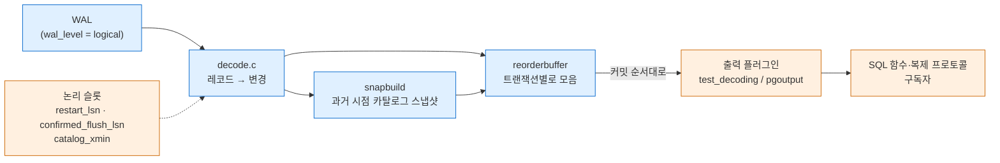

- `decode.c` 머리 주석: WAL 레코드를 해석해 실제 변경은 reorderbuffer로, 카탈로그 스냅샷
  구성 정보는 snapbuild로 넘긴다.
- **reorderbuffer**: WAL에는 여러 트랜잭션 레코드가 섞여 있으므로 트랜잭션별로 모았다가
  **커밋 시점에 커밋 순서대로** 내보낸다. 롤백된 트랜잭션은 버린다.
- **historic snapshot**(`SNAPSHOT_HISTORIC_MVCC`, §2.4): 변경 당시 테이블 정의로 튜플을
  해석해야 하므로 과거 카탈로그를 본다. 그래서 슬롯은 `catalog_xmin` 을 잡아 카탈로그의
  옛 버전이 VACUUM되지 않게 한다(§6.6).
- `wal_level = logical` 이 필요하다. `replica`(기본)보다 추가 정보를 기록한다(공식 문서).
  §5.1에서 본 `AssignTransactionId` 의 `xact_assignment` 기록 분기도 이 모드 전용이다.
- 내장 논리 복제(`PUBLICATION` / `SUBSCRIPTION`)는 `pgoutput` 플러그인을 쓴다.

실증 V23 — `test_decoding` 슬롯:

```sql
SELECT * FROM pg_create_logical_replication_slot('s_td', 'test_decoding');
CREATE TABLE ld(id int primary key, v text);
INSERT INTO ld VALUES (1,'a'),(2,'b');
BEGIN; UPDATE ld SET v='A' WHERE id=1; DELETE FROM ld WHERE id=2; COMMIT;
BEGIN; INSERT INTO ld VALUES (9,'rolled'); ROLLBACK;
SELECT lsn, xid, data FROM pg_logical_slot_peek_changes('s_td', NULL, NULL);
```

```text
    lsn    | xid |                        data
-----------+-----+----------------------------------------------------
 0/1E30A08 | 954 | BEGIN 954                 ← CREATE TABLE: DDL은 행 변경으로 안 나옴
 0/1E525D8 | 954 | COMMIT 954
 0/1E525D8 | 955 | BEGIN 955
 0/1E525D8 | 955 | table public.ld: INSERT: id[integer]:1 v[text]:'a'
 0/1E526B8 | 955 | table public.ld: INSERT: id[integer]:2 v[text]:'b'
 0/1E52768 | 955 | COMMIT 955
 0/1E52768 | 956 | BEGIN 956
 0/1E52768 | 956 | table public.ld: UPDATE: id[integer]:1 v[text]:'A'
 0/1E527B0 | 956 | table public.ld: DELETE: id[integer]:2
 0/1E52820 | 956 | COMMIT 956
                                              ← 롤백한 트랜잭션은 아예 없음

 slot_name |    plugin     | slot_type | restart_lsn | confirmed_flush_lsn | catalog_xmin | wal_status
-----------+---------------+-----------+-------------+---------------------+--------------+-----------
 s_td      | test_decoding | logical   | 0/1E309B0   | 0/1E309E8           |          954 | reserved

-- REPLICA IDENTITY FULL 이후 UPDATE
 table public.ld: UPDATE: old-key: id[integer]:1 v[text]:'A' new-tuple: id[integer]:1 v[text]:'AA'
```

| 관찰 | 해석 |
|---|---|
| DELETE는 키(`id`)만 | 기본 `REPLICA IDENTITY DEFAULT` 는 PK만 WAL에 남김 |
| `FULL` 후 `old-key` 에 전체 컬럼 | 옛 튜플 전체를 WAL에 기록 → WAL 증가(공식 문서 경고) |
| `peek` vs `get` | `peek` 은 슬롯을 전진시키지 않음, `get` 은 `confirmed_flush_lsn` 전진 |
| `catalog_xmin = 954` | 슬롯 생성 시점 이후의 카탈로그 버전을 보존 |

> **관찰 함정**: `SELECT ... FROM pg_logical_slot_get_changes(...) LIMIT 3` 은 3행만 보여 주고도
> 슬롯을 **끝까지** 소비했다(직후 `peek` 결과 0행, `confirmed_flush_lsn = 0/1E52820`).
> 집합 반환 함수가 결과를 다 만든 뒤 LIMIT이 적용되기 때문이다. 개수를 제한하려면 함수
> 인자 `upto_nchanges` 를 쓴다.

### 10.3 물리 vs 논리 복제 비교

| 항목 | 스트리밍(물리) | 논리 |
|---|---|---|
| 전송 단위 | WAL 바이트 | 행 변경(플러그인 형식) |
| 필요 `wal_level` | `replica` 이상 | `logical` |
| 대상 | 클러스터 전체 | 테이블 단위(publication) |
| 버전·플랫폼 | 동일해야 함 | 달라도 됨 |
| 수신 측 쓰기 | 불가(읽기 전용 hot standby) | 가능 |
| DDL | 자동 복제 | 복제 안 됨(V23의 빈 트랜잭션 954) |
| 슬롯이 잡는 것 | `restart_lsn`(+ feedback 시 `xmin`) | `restart_lsn`, `catalog_xmin` |
| 진행 중 트랜잭션 | 레코드 생성 즉시 전송 | SQL 인터페이스(V23)는 커밋된 것만 커밋 순서대로. 구독은 큰 트랜잭션을 커밋 전에 스트리밍할 수 있음 — PG18에서 `CREATE SUBSCRIPTION` 의 `streaming` 기본값이 `off` → `parallel` 로 바뀜(PG18 릴리스 노트) |

---

## 11. 실증 기록 (PostgreSQL 18.4)

로컬 Homebrew PostgreSQL 18.4 전용 임시 클러스터(`initdb --locale=C`, 기본 옵션 →
데이터 체크섬 on)에서 검증했다. `wal_level = logical` 만 추가 설정했다. contrib
`pageinspect`, `pg_walinspect`, `pg_visibility`, `pg_buffercache`, `test_decoding` 사용.
동시 세션은 백그라운드 psql 여러 개로 재현했다.

| # | 시나리오 | 결과 |
|---|---|---|
| V1 | `BEGIN` → `SELECT` → `INSERT` 중 `pg_current_xact_id_if_assigned()` | NULL → NULL → 754. `virtualxid 2/3` + `transactionid 754` 락 |
| V2 | `pg_resetwal -e 5` 후 `pg_current_xact_id()` | `21474837444` = 5×2³² + 964 |
| V3 | 동시 트랜잭션 2개의 스냅샷 | 둘 다 실행 중 `758:758:` / 뒤쪽만 커밋 `758:760:758` |
| V4 | RR vs RC에서 문장 간 스냅샷 | RR 고정 `758:760:758` (count 1→1) / RC 전진 761→762 (count 2→3) |
| V5 | `pg_xact_status` 와 SLRU 디렉토리 | 949 committed, 957 aborted, 1·2 committed, 자기 자신 in progress, `pg_xact/0000` |
| V6 | 커밋 후 CHECKPOINT → 일반 SELECT | infomask `0x802 → 0x902`, `isdirty f → t`. 롤백 행 `0x802 → 0xa02` |
| V7 | 위 SELECT가 만든 WAL | `XLOG / FPI_FOR_HINT` 1건(len 109, fpi 60). `data_checksums = on` |
| V8 | 비인덱스 컬럼 2회 + 인덱스 컬럼 1회 UPDATE | HOT 체인 lp1→2→3, lp4 비-HOT. `n_tup_hot_upd = 2/3`, 인덱스 엔트리 (0,1)·(0,4) |
| V9 | 700B 행 14회 UPDATE | 자동 pruning: lp1 `LP_REDIRECT`→lp10, lp7~9 `LP_UNUSED`, 크기 8192B 유지 |
| V10 | SAVEPOINT+INSERT 64회/65회 | `subxact_count 64, overflowed f` → `64, t`. 행 xmin은 subxid 65개 |
| V11 | `FOR SHARE` + `FOR KEY SHARE` | `t_xmax` 940 → MultiXactId 1 + `HEAP_XMAX_IS_MULTI`, 멤버 `940 sh / 941 keysh` |
| V12 | 5,000행 DELETE 후 `VACUUM VERBOSE` | `index scans: 1`, 5000 removed, VM all-visible 0→167, dead lp → `LP_UNUSED` |
| V13 | `VACUUM (FREEZE)` | infomask `0x902 → 0xb02`(`HEAP_XMIN_FROZEN`), xmin 945 보존, all-frozen 167 |
| V14 | freeze·WAL·체크포인트 파라미터 기본값 | §6.5·§9.1 표 (`autovacuum_freeze_max_age` 2억, `vacuum_failsafe_age` 16억 등) |
| V15 | LSN → 세그먼트 파일명·오프셋 | `0/1D12538` → `000000010000000000000001`, offset 13706552 |
| V16 | `pg_get_wal_resource_managers()` | 내장 rmgr 22개 (id 0 XLOG ~ 21 LogicalMessage) |
| V17 | INSERT×2·UPDATE·DELETE 트랜잭션의 WAL | `INSERT+INIT`, `Btree NEWROOT`, `HOT_UPDATE`, `DELETE`, `COMMIT` + 카탈로그 힌트 FPI가 전체 바이트의 약 97% |
| V18 | 체크포인트 직후 같은 페이지 UPDATE 2회 | 첫 번째만 FPW(fpi 184), 두 번째는 델타(len 77) |
| V19 | `synchronous_commit` off / on | off: 응답 후 flush < insert, 1초 뒤 일치 / on: 응답 시점 일치 |
| V20 | `pg_control_checkpoint()` + 해당 WAL | `CHECKPOINT_REDO`@redo_lsn, `RUNNING_XACTS`, `CHECKPOINT_ONLINE`@checkpoint_lsn |
| V21 | 커밋 1만 행 + 미커밋 1행 → `stop -m immediate` → 재기동 | `redo starts at` = 직전 redo_lsn, WAL 끝에서 종료, 커밋 행만 존재 |
| V22 | `pg_receivewal` + 물리 슬롯 | `walsender` 프로세스, `state = streaming`, `.partial` 16MB 세그먼트 |
| V23 | `test_decoding` 슬롯 | 커밋 순 BEGIN/변경/COMMIT, 롤백 미출력, DDL 빈 트랜잭션, `REPLICA IDENTITY FULL` 시 old-key 전체 |

**실증하지 않은 것**: 실제 XID wraparound 도달(§6.5), 별도 스탠바이 인스턴스의 hot standby·
동기 복제(§8.3·§10.1), 그룹 커밋의 처리량 효과(§8.2), SSI 충돌 감지 내부.
이들은 소스·공식 문서 근거로만 서술했다.

**환경 메모**: 스크래치 경로가 길어 Unix 소켓 경로 한도(103바이트)를 넘었으므로 소켓 없이
`listen_addresses = 127.0.0.1` 로 기동했다. macOS에서는 `LC_ALL` 이 없으면
`postmaster became multithreaded during startup` 으로 기동이 실패해 `LC_ALL=C` 를 지정했다.

## 관련 문서

- [[PostgreSQL/INTERNALS/00-INDEX|내부 구조 분석서]] — 시리즈 인덱스
- [[PostgreSQL/INTERNALS/02-PROCESS-MEMORY|02. 프로세스·메모리 아키텍처]] — walwriter·checkpointer·walsender·autovacuum 프로세스, PGPROC 공유 메모리
- [[PostgreSQL/INTERNALS/03-STORAGE|03. 물리 저장 구조]] — 튜플 헤더·페이지 레이아웃·VM/FSM 형식·버퍼 매니저
- [[PostgreSQL/INTERNALS/05-QUERY-PIPELINE|05. 쿼리 처리 파이프라인]] — 실행기가 스냅샷을 들고 스캔하는 경로
- [[PostgreSQL/INTERNALS/06-CATALOG-OID|06. 시스템 카탈로그와 OID]] — 시스템 컬럼 xmin/xmax/cmin/cmax/ctid
- [[PostgreSQL/INTERNALS/08-SYSTEM-FUNCTIONS|08. 기본 제공 시스템 함수]] — `pg_current_xact_id()`, WAL·복제 함수의 내부 경로
- [[PostgreSQL/INTERNALS/09-FEATURES-EXTENSIBILITY|09. 지원 기능 총람과 확장성 아키텍처]] — custom rmgr, 논리 디코딩 플러그인
- [[PostgreSQL/10-TRANSACTION|10. 트랜잭션, 격리 수준, 락]] — 격리 수준·락·SAVEPOINT 사용법
- [[PostgreSQL/14-TUNING|14. DB 튜닝 방법론]] — VACUUM·체크포인트 튜닝
