> **인덱스** [[PostgreSQL/INTERNALS/00-INDEX|내부 구조 분석서]]  ·  **이전** [[PostgreSQL/INTERNALS/04-MVCC-WAL|04. 트랜잭션·MVCC·WAL 내부]]  ·  **다음** [[PostgreSQL/INTERNALS/06-CATALOG-OID|06. 시스템 카탈로그와 OID]]

# 05. 쿼리 처리 파이프라인

클라이언트가 보낸 SQL 문자열 한 줄이 소켓을 타고 백엔드에 도착해 결과 행으로 돌아가기까지의
전 구간을 내부 구현 관점에서 추적한다. 와이어 프로토콜 → tcop → parser → analyzer → rewriter →
planner → executor 순서이며, 각 단계의 **산출물(노드 트리)을 실제로 덤프**해서 확인했다.

EXPLAIN 읽는 법·인덱스 설계 같은 **사용법**은 [[PostgreSQL/11-PERFORMANCE|11. 성능]]과
[[PostgreSQL/14-TUNING|14. DB 튜닝 방법론]]에 있다. 이 문서는 그 뒤에서 무슨 일이 일어나는지를 다룬다.
소스 파일명·함수명은 GitHub `REL_18_STABLE` 브랜치와 로컬 18.4 서버 헤더에서 확인했고,
동작은 로컬 PostgreSQL 18.4 임시 클러스터에서 실증했다(§12).

## 0. 전체 지도

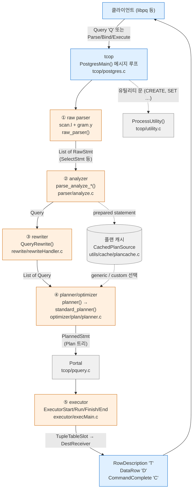

단계별로 입력과 출력의 **노드 타입**이 정해져 있다는 점이 핵심이다. 각 단계는 앞 단계의 트리를 받아
새 트리를 만들고, 다음 단계는 그 트리만 본다.

| 단계 | 진입 함수 (소스) | 입력 | 출력 노드 | 카탈로그 접근 |
|---|---|---|---|---|
| ① raw parse | `pg_parse_query` → `raw_parser` (`parser/parser.c`, `scan.l`, `gram.y`) | `const char *` | `List` of `RawStmt` (안에 `SelectStmt` 등) | **없음** |
| ② analyze | `parse_analyze_fixedparams` / `_varparams` / `_withcb` (`parser/analyze.c`) | `RawStmt` | `Query` | 있음 (이름 해석·타입 결정) |
| ③ rewrite | `pg_rewrite_query` → `QueryRewrite` (`rewrite/rewriteHandler.c`) | `Query` | `List` of `Query` (0개 이상) | 있음 (`pg_rewrite` 룰) |
| ④ plan | `pg_plan_query` → `planner` (`optimizer/plan/planner.c`) | `Query` | `PlannedStmt` (`planTree` = `Plan` 트리) | 있음 (통계·인덱스) |
| ⑤ execute | `ExecutorStart/Run/Finish/End` (`executor/execMain.c`) | `QueryDesc`(`PlannedStmt` 포함) | 튜플 → `DestReceiver` | 있음 (실제 데이터) |

tcop 은 "traffic cop"의 약자다. `postgres.c` 파일 머리 주석이 이 파일을 백엔드의 main 모듈이자
"traffic cop"의 main 모듈이라고 부른다.

---

## 1. 프론트엔드/백엔드 프로토콜 v3

### 1.1 메시지 형식

모든 메시지(StartupMessage·CancelRequest 같은 초기 패킷 제외)는 같은 틀이다.

```text
Byte1   메시지 타입 ('Q', 'P', 'D' …)
Int32   길이 — 자기 자신(4바이트)은 포함, 타입 바이트는 제외
Byte[n] 본문
```

공식 문서도 같은 내용을 쓰며, 서버·클라이언트 모두 길이만큼 버퍼에 먼저 다 읽은 뒤 처리하는 것이
일반적이라고 설명한다. 그래서 `Sync`는 본문이 없어 `Int32(4)`, `ReadyForQuery`는 상태 1바이트가 붙어 `Int32(5)`다.

### 1.2 메시지 타입 코드

PG17부터 서버 헤더에 `libpq/protocol.h`가 생겨 코드가 `PqMsg_*` 매크로로 정리돼 있다(REL_16_STABLE에는 이 파일이 없음). 18.4 헤더 원문 일부.

```c
/* These are the request codes sent by the frontend. */
#define PqMsg_Bind					'B'
#define PqMsg_Describe				'D'
#define PqMsg_Execute				'E'
#define PqMsg_Parse					'P'
#define PqMsg_Query					'Q'
#define PqMsg_Sync					'S'
...
/* These are the response codes sent by the backend. */
#define PqMsg_ParseComplete			'1'
#define PqMsg_BindComplete			'2'
#define PqMsg_CommandComplete		'C'
#define PqMsg_DataRow				'D'
#define PqMsg_ErrorResponse			'E'
#define PqMsg_ReadyForQuery			'Z'
#define PqMsg_PortalSuspended		's'
#define PqMsg_NegotiateProtocolVersion 'v'
...
```

같은 글자가 방향에 따라 뜻이 다르다는 점에 주의한다. 클라이언트가 보내는 `'D'`는 Describe,
서버가 보내는 `'D'`는 DataRow이고, `'E'`(Execute ↔ ErrorResponse), `'S'`(Sync ↔ ParameterStatus),
`'C'`(Close ↔ CommandComplete)도 마찬가지다.

| 방향 | 코드 | 이름 | 용도 |
|---|---|---|---|
| F→B | `Q` | Query | simple query. SQL 문자열 하나(세미콜론으로 여러 문장 가능) |
| F→B | `P` | Parse | 문장 이름 + SQL + 파라미터 타입 OID 배열 |
| F→B | `B` | Bind | 포털 이름 + 문장 이름 + 파라미터 값 + 결과 포맷 코드 |
| F→B | `D` | Describe | `'S'`(문장) 또는 `'P'`(포털)의 결과 형태 질의 |
| F→B | `E` | Execute | 포털 이름 + 최대 행 수(0 = 무제한) |
| F→B | `S` | Sync | 확장 쿼리의 동기화 지점. 암묵 트랜잭션 종료 |
| F→B | `H` | Flush | 버퍼된 응답을 지금 보내 달라 (응답 없음) |
| F→B | `C` | Close | 문장/포털 해제 |
| B→F | `T` | RowDescription | 컬럼 이름·테이블 OID·컬럼 번호·타입 OID·typmod·포맷 |
| B→F | `D` | DataRow | 한 행. 컬럼별 길이(-1 = NULL) + 값 |
| B→F | `C` | CommandComplete | 명령 태그 (`SELECT 5`, `INSERT 0 1` …) |
| B→F | `Z` | ReadyForQuery | 다음 명령 수락 가능. 상태 `I`(idle) / `T`(트랜잭션 블록) / `E`(실패한 블록) |
| B→F | `E` | ErrorResponse | 필드 코드(S, C, M, …) + 문자열의 나열 |
| B→F | `K` | BackendKeyData | 취소 요청용 PID + 비밀 키 |

### 1.3 접속 수립 (Start-up)

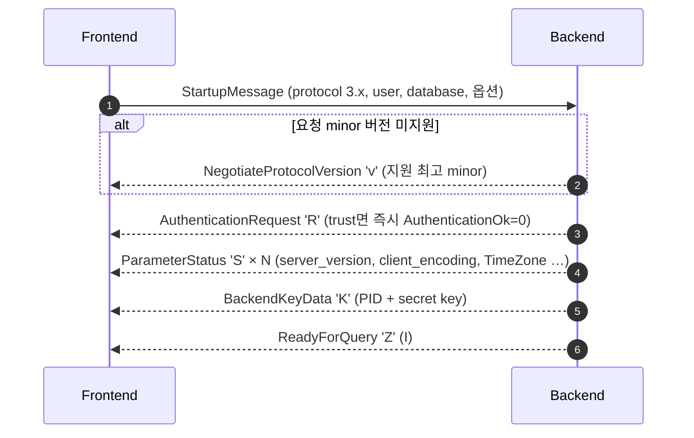

인증·fork 과정은 [[PostgreSQL/INTERNALS/02-PROCESS-MEMORY|02. 프로세스·메모리 아키텍처]]에서 다룬다.
여기서는 인증 이후 백엔드가 `BackendMain()`(`tcop/backend_startup.c`)에서 `PostgresMain()`을 호출해
메시지 루프에 진입한다는 점만 짚는다.

### 1.4 프로토콜 3.2 (PG18 신규)

공식 문서(Protocol Overview)와 PG18 릴리스 노트에서 확인한 사실.

| 버전 | 지원 | 비고 |
|---|---|---|
| 3.0 | PostgreSQL 7.4 이상 | libpq는 하위 호환을 위해 **여전히 기본값으로 3.0을 요청** |
| 3.1 | 사용된 적 없음 | 구버전 pgbouncer가 프로토콜 협상 버그로 3.1 지원을 잘못 주장해서 건너뜀 |
| 3.2 | **PostgreSQL 18 이상** | 취소용 비밀 키가 4바이트 고정에서 **가변 길이**로 확장. BackendKeyData·CancelRequest 형식 변경 |

- 메시지 형식 문서 기준 키 길이는 최소 4바이트, 최대 256바이트다. 서버는 32바이트까지만 보내고,
  남는 여유는 미들웨어(커넥션 풀러 등)가 키에 정보를 덧붙일 수 있게 남겨 둔 것이다. 릴리스 노트 표현은
  "Make cancel request keys 256 bits"이며, 32바이트가 곧 256비트다.
- 서버 헤더 `libpq/pqcomm.h`: `PG_PROTOCOL_EARLIEST = PG_PROTOCOL(3,0)`, `PG_PROTOCOL_LATEST = PG_PROTOCOL(3,2)`.
- libpq 18에 접속 파라미터 `min_protocol_version` / `max_protocol_version`이 생겼다(허용값 `3.0`, `3.2`, `latest`).
  `max_protocol_version` 기본값은 3.0이며, 접속 문자열이 더 높은 버전을 요구하는 기능을 지정하면 최신 버전을 쓴다.
  협상된 버전은 `PQfullProtocolVersion()`으로 확인한다.

실증(V2, V5): 소켓에 직접 StartupMessage를 보내서 버전별 `BackendKeyData` 길이를 비교했다.

```text
[startup 3.0]   <- K(12) pid=94072 keylen=4      -- 길이 12 = 4(len) + 4(pid) + 4(key)
[startup 3.2]   <- K(40) pid=94074 keylen=32     -- 32바이트 = 256비트 키
[startup 3.3]   <- v(12) newest_minor=196610     -- 0x00030002 = 3.2 로 다운그레이드 통보
                <- ... K(40) keylen=32
```

psql 18에서는 `\conninfo` 표에 `Protocol Version` 행이 있다. 기본 접속은 `3.0`,
`max_protocol_version=latest`를 붙이면 `3.2`가 찍힌다.

### 1.5 Simple Query 흐름

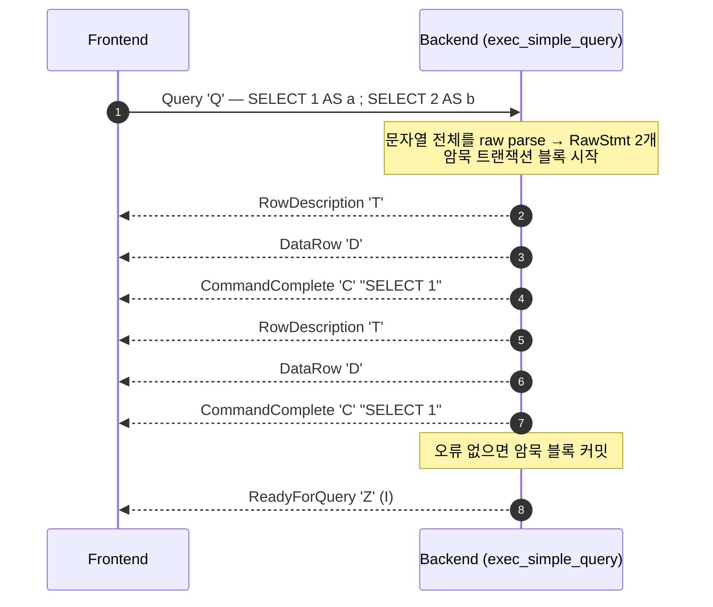

- 한 `Query` 메시지에 여러 문장이 있으면 명시적 트랜잭션 제어가 없는 한 **하나의 트랜잭션**으로 실행된다
  (공식 문서의 implicit transaction block). 오류가 나면 그 지점에서 처리를 멈추고 남은 문장은 실행하지 않는다.
- 빈 문자열이면 `EmptyQueryResponse 'I'` 후 `Z`.
- 결과 포맷은 항상 텍스트다. 바이너리 결과와 파라미터 바인딩은 extended query에서만 가능하다.

실증(V3).

```text
[Q: SELECT 1; SELECT 2]          T D C(SELECT 1) T D C(SELECT 1) Z(I)
[Q: empty]                       I Z(I)
[Q: BEGIN; SELECT 1/0; SELECT 3] C(BEGIN) E(22012 division by zero) Z(E)   ← SELECT 3 실행 안 됨
[Q: ROLLBACK]                    C(ROLLBACK) Z(I)
```

`Z(E)`는 "실패한 트랜잭션 블록 안"이라는 뜻이다. 이 상태에서는 ROLLBACK/COMMIT 외의 문장을 거부한다.
`exec_simple_query`가 이 검사를 **raw parse 직후, 분석 전에** 하는 이유는 §2.2에서 다룬다.

### 1.6 Extended Query 흐름

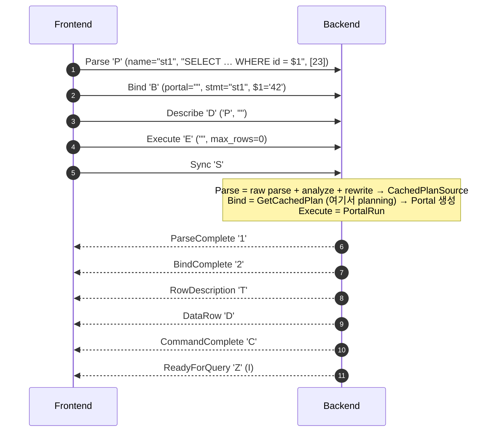

| 단계 | 백엔드 함수 (`tcop/postgres.c`) | 내부에서 하는 일 |
|---|---|---|
| Parse | `exec_parse_message` | `pg_parse_query` → `CreateCachedPlan` → `pg_analyze_and_rewrite_varparams` → `CompleteCachedPlan`. 이름 있으면 `StorePreparedStatement`, 없으면 `unnamed_stmt_psrc`에 보관 |
| Bind | `exec_bind_message` | 파라미터 디코딩 → `CreatePortal` → **`GetCachedPlan`(플랜 확보)** → `PortalDefineQuery` → `PortalStart` |
| Describe | `exec_describe_statement_message` / `exec_describe_portal_message` | `ParameterDescription 't'` + `RowDescription` 또는 `NoData` |
| Execute | `exec_execute_message` | `PortalRun(portal, max_rows)`. 다 못 끝내면 `PortalSuspended 's'` |
| Sync | `PostgresMain`의 `case PqMsg_Sync` | `finish_xact_command()` 후 `ReadyForQuery` |

**planning이 Bind 시점에 일어난다**는 사실은 서버 로그로 확인했다(V18). `log_min_duration_statement = 0`이면
단계별 소요 시간이 따로 찍힌다.

```text
LOG:  duration: 0.127 ms  parse s2: SELECT name FROM emp WHERE id = $1
LOG:  duration: 0.218 ms  bind s2: SELECT name FROM emp WHERE id = $1      ← 플랜 생성 포함
LOG:  duration: 0.009 ms  execute s2: SELECT name FROM emp WHERE id = $1
```

수명 규칙(공식 문서 Message Flow).

| 객체 | 이름 없음(`""`) | 이름 있음 |
|---|---|---|
| prepared statement | 다음 unnamed Parse가 오면 파기 | 세션 끝까지 (Close 또는 `DEALLOCATE`로 해제) |
| portal | 트랜잭션 종료 또는 다음 unnamed Bind 때 파기 | 트랜잭션 끝까지 |

`Execute`의 최대 행 수와 `PortalSuspended`는 커서처럼 결과를 끊어 받는 장치다. 실증(V4)에서는
`generate_series(1,5)`를 `max_rows = 2`로 세 번 Execute했다.

```text
[P/B(pt)/E max2 x3/S]   1 2 D D s D D s D C(SELECT 1) Z(T)
```

이름 있는 포털은 트랜잭션이 끝나면 사라지므로 이 실험은 `BEGIN` 안에서 했다.

### 1.7 오류와 파이프라이닝

Extended query는 응답을 기다리지 않고 여러 메시지를 연달아 보내는 **파이프라이닝**이 가능하다.
그 대가로 오류 규칙이 엄격하다. 공식 문서는 확장 쿼리 메시지 처리 중 오류가 나면 서버가 ErrorResponse를 보낸 뒤
**Sync가 나올 때까지 이후 메시지를 읽고 버린다**고 규정한다.

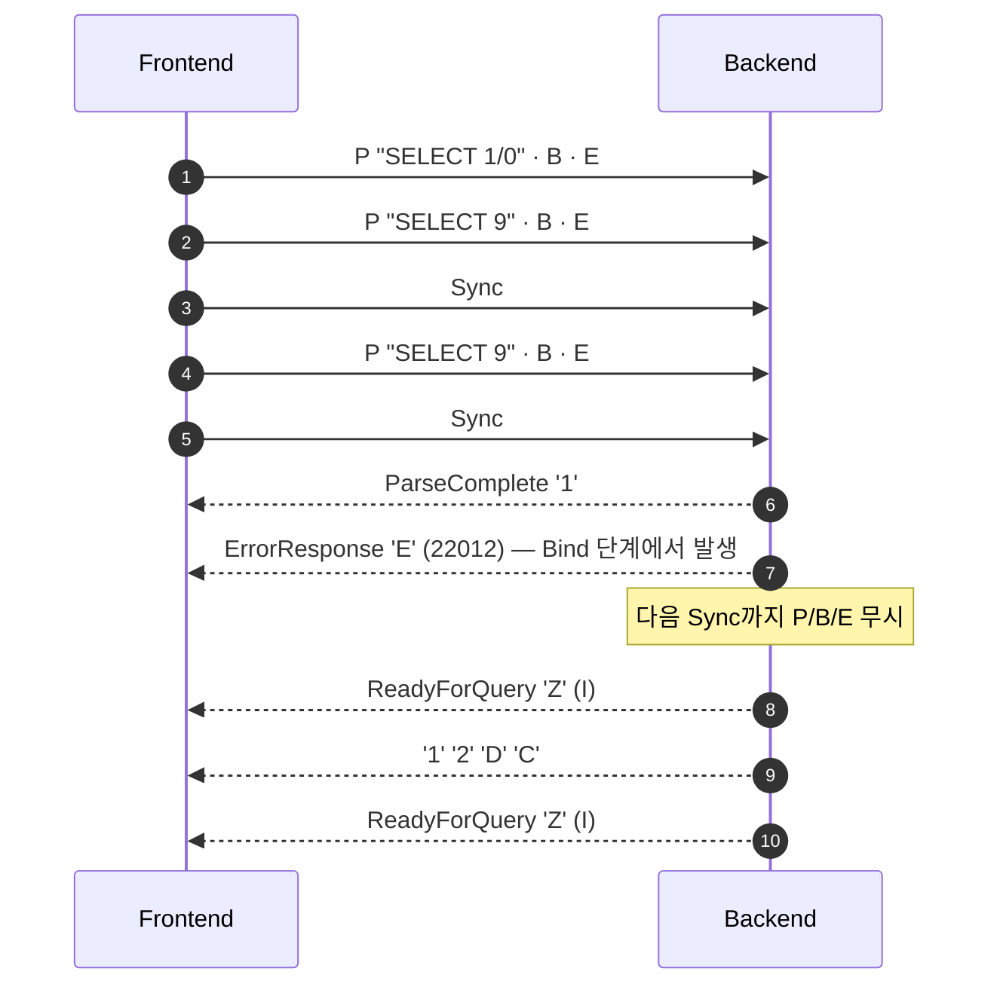

실증(V4)에서 눈여겨볼 점: `SELECT 1/0`의 오류는 Execute가 아니라 **Bind**에서 났다(`1` 다음 바로 `E`, `2` 없음).
Bind에서 planning을 하고, 플래너의 상수 폴딩(`eval_const_expressions`, `optimizer/util/clauses.c`)이
`1/0`을 미리 계산하려다 `int4div`가 오류를 던진 것이다. 파라미터 없는 상수식은 실행 전에 이미 평가된다는 증거다.

psql 18은 확장 프로토콜을 직접 다루는 메타 명령을 추가했다(`\parse`, `\bind_named`, `\close_prepared`,
`\startpipeline`, `\syncpipeline`, `\endpipeline` 등. PG18 릴리스 노트).

```sql
SELECT name FROM emp WHERE id = $1 \parse s1
\bind_named s1 10 \g
\bind_named s1 11 \g
SELECT name, from_sql, generic_plans, custom_plans FROM pg_prepared_statements;
--  s1 | f | 0 | 2         ← from_sql=f: 프로토콜 Parse로 만든 문장
\close_prepared s1
```

---

## 2. tcop — 메시지 루프와 exec_simple_query

### 2.1 PostgresMain

`PostgresMain(const char *dbname, const char *username)`(`tcop/postgres.c`)은 반환하지 않는 무한 루프다
(헤더 선언에 `pg_noreturn`). 루프 한 바퀴는 다음과 같다.

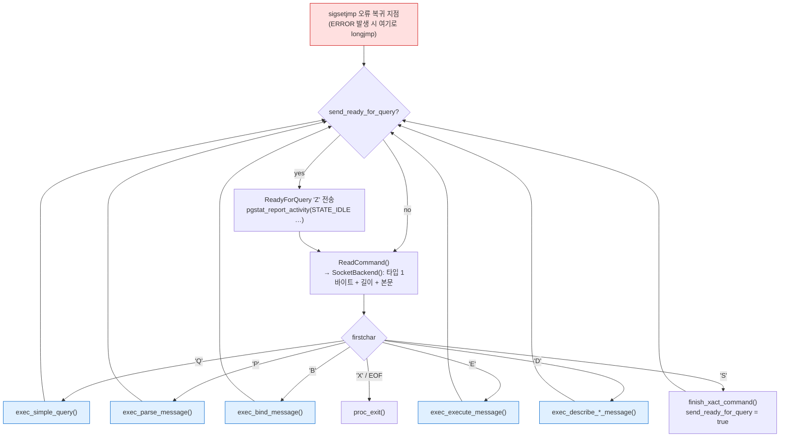

`SocketBackend()`의 `switch`와 `PostgresMain()`의 `switch` 모두 §1.2의 `PqMsg_*` 상수로 분기한다.
오류가 나면 `ereport(ERROR)`가 `longjmp`로 루프 상단에 돌아오고, 트랜잭션을 abort한 뒤 다음 메시지를 읽는다.
확장 쿼리 모드라면 이때 "Sync까지 무시" 상태가 켜진다.

### 2.2 exec_simple_query 단계

`exec_simple_query(const char *query_string)`의 뼈대(REL_18_STABLE에서 호출 순서만 발췌).

```c
start_xact_command();
drop_unnamed_stmt();                         /* simple 모드도 unnamed 문장을 쓰는 것처럼 취급 */
oldcontext = MemoryContextSwitchTo(MessageContext);
parsetree_list = pg_parse_query(query_string);       /* ① raw parse: 문자열 전체 */
...
foreach(parsetree_item, parsetree_list)
{
    commandTag = CreateCommandTag(parsetree->stmt);
    BeginCommand(commandTag, dest);
    if (IsAbortedTransactionBlockState() && !IsTransactionExitStmt(parsetree->stmt))
        ereport(ERROR, ... "current transaction is aborted, ...");
    start_xact_command();
    querytree_list = pg_analyze_and_rewrite_fixedparams(parsetree, query_string, ...); /* ②③ */
    plantree_list  = pg_plan_queries(querytree_list, query_string, ...);              /* ④ */
    portal = CreatePortal("", true, true);                                           /* unnamed portal */
    PortalDefineQuery(portal, ...);
    PortalStart(portal, NULL, 0, InvalidSnapshot);
    receiver = CreateDestReceiver(dest);
    (void) PortalRun(portal, FETCH_ALL, true, receiver, receiver, &qc);              /* ⑤ */
    PortalDrop(portal, false);
    ... finish_xact_command() / EndCommand()
}
```

중요한 설계 포인트 세 가지.

1. **raw parse는 문자열 전체를 한 번에** 한다. 나머지 단계는 문장 하나씩 돈다.
   `gram.y` 머리 주석은 문법 규칙에서 DB 접근이나 SET 변수 의존을 금지하면서,
   `SET constraint_exclusion TO off; SELECT * FROM foo;` 같은 다중 문장은 SET이 실행되기 전에
   gram.y가 문자열 전체를 파싱한다는 점을 이유로 든다. 상태에 의존하는 일은 전부 parse analysis로 미룬다.
2. **aborted 트랜잭션 검사는 raw parse 직후, 분석 전에** 한다. 소스 주석 그대로 옮기면
   parse analysis·rewrite·planning은 "all those phases try to do database accesses, which may fail in abort state".
   raw parser는 카탈로그를 보지 않으므로 실패한 트랜잭션 안에서도 ROLLBACK을 알아볼 수 있다.
3. 파스·플랜 트리는 `MessageContext`에서 할당되고 메시지 하나가 끝나면 통째로 리셋된다
   (MemoryContext 계층은 [[PostgreSQL/INTERNALS/02-PROCESS-MEMORY|02]] 참고).

단계별 자원 사용은 `log_parser_stats` / `log_planner_stats` / `log_executor_stats`로 볼 수 있다(V11).
`pg_parse_query`·`pg_analyze_and_rewrite_*`·`pg_rewrite_query`·`pg_plan_query` 안에서 `ShowUsage()`를
부르는 위치가 곧 단계 경계다.

```text
LOG:  PARSER STATISTICS
LOG:  PARSE ANALYSIS STATISTICS
LOG:  REWRITER STATISTICS
LOG:  PLANNER STATISTICS
DETAIL:  ! system usage stats:
!	0.000078 s user, 0.000095 s system, 0.000183 s elapsed
...
LOG:  EXECUTOR STATISTICS
```

### 2.3 오류 위치로 단계 구분하기

`\set VERBOSITY verbose`를 켜면 오류를 던진 **소스 파일:줄**이 나온다. 파이프라인 어느 단계에서 실패했는지가 그대로 보인다(V10).

| 입력 | SQLSTATE | LOCATION | 단계 |
|---|---|---|---|
| `SELECT name FORM emp` | 42601 syntax error | `scanner_yyerror, scan.l:1240` | ① raw parse |
| `SELECT nocol FROM emp` | 42703 | `errorMissingColumn, parse_relation.c:3827` | ② analyze |
| `SELECT name FROM nosuchtable` | 42P01 | `parserOpenTable, parse_relation.c:1469` | ② analyze |
| `SELECT 1 + 'abc'::int` | 22P02 | `pg_strtoint32_safe, numutils.c:618` | ② analyze (리터럴 강제 변환) |
| `SELECT 1/0` (extended) | 22012 | (`int4div`) — Bind 시점 | ④ plan (상수 폴딩) |

"테이블이 없다"는 오류가 parser 디렉토리에서 난다는 점이 parse analysis가 카탈로그 접근 단계라는 증거다.

---

## 3. Node 시스템 — 모든 트리의 공통 기반

### 3.1 NodeTag와 "첫 필드 규칙"

PostgreSQL의 파스 트리·플랜 트리·실행 상태 트리는 전부 **태그된 구조체**다. C에는 상속이 없으므로
"모든 노드 구조체의 첫 필드는 `NodeTag type`"이라는 규칙으로 다형성을 흉내 낸다. `nodes/nodes.h`(18.4) 원문.

```c
/*
 * The first field of every node is NodeTag. Each node created (with makeNode)
 * will have one of the following tags as the value of its first field.
 ...
 */
typedef enum NodeTag
{
	T_Invalid = 0,

#include "nodes/nodetags.h"
} NodeTag;

typedef struct Node
{
	NodeTag		type;
} Node;

#define nodeTag(nodeptr)		(((const Node*)(nodeptr))->type)
#define makeNode(_type_)		((_type_ *) newNode(sizeof(_type_),T_##_type_))
#define IsA(nodeptr,_type_)		(nodeTag(nodeptr) == T_##_type_)
```

`newNode()`는 `palloc0(size)` 후 `result->type = tag`를 넣는 인라인 함수다. 즉 노드는 언제나 현재
MemoryContext에 0으로 초기화되어 할당된다. 어떤 포인터든 `(Node *)`로 캐스팅해 `nodeTag()`를 읽으면
실제 타입을 알 수 있고, `IsA()`·`castNode()`(assert 빌드에서 태그 검사)로 안전하게 다운캐스트한다.

"상속"은 **첫 필드에 부모 구조체를 통째로 넣는** 방식이다(`plannodes.h`).

```c
typedef struct Plan
{
	pg_node_attr(abstract, no_equal, no_query_jumble)
	NodeTag		type;
	int			disabled_nodes;
	Cost		startup_cost;
	Cost		total_cost;
	Cardinality plan_rows;
	int			plan_width;
	bool		parallel_aware;
	bool		parallel_safe;
	bool		async_capable;
	int			plan_node_id;
	List	   *targetlist;
	List	   *qual;
	struct Plan *lefttree;
	struct Plan *righttree;
	List	   *initPlan;
	Bitmapset  *extParam;
	Bitmapset  *allParam;
} Plan;

typedef struct Scan
{
	pg_node_attr(abstract)
	Plan		plan;
	Index		scanrelid;		/* relid is index into the range table */
} Scan;

typedef struct SeqScan
{
	Scan		scan;
} SeqScan;
```

(주석 일부 생략.) `SeqScan *`의 메모리 첫 바이트는 `Scan`이고 그 첫 바이트는 `Plan`이며 그 첫 필드가 `NodeTag`다.
그래서 `(Plan *) seqscan`이 성립한다. §5의 `debug_print_plan` 출력에 `:scan.plan.startup_cost`처럼
점으로 이어진 필드명이 나오는 이유가 이 중첩 구조다.

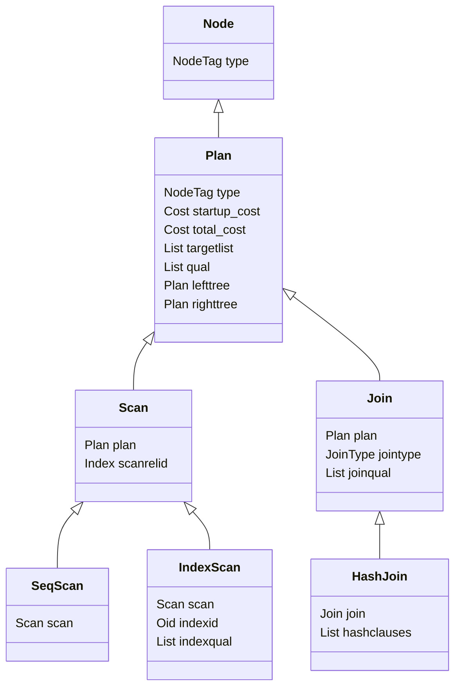

### 3.2 nodetags.h는 생성 파일

`nodes/nodetags.h` 머리에 "DO NOT EDIT THIS FILE! … GENERATED by src/backend/nodes/gen_node_support.pl"이라고 적혀 있다.
PG16부터 노드 구조체 정의 헤더를 스크립트가 읽어 태그 목록과 `copyObject`/`equal`/`outfuncs`/`readfuncs` 코드를
자동 생성하며, 헤더의 `pg_node_attr(...)` 주석 매크로가 생성 규칙을 조정한다
(예: `Query.queryId`의 `equal_ignore, query_jumble_ignore, read_write_ignore`).
18.4 헤더에서 확인한 태그 번호 예시.

| 태그 | 값 | 비고 |
|---|---|---|
| `T_List` | 1 | 첫 태그 |
| `T_Query` | 67 | |
| `T_RangeTblEntry` | 101 | |
| `T_SelectStmt` | 141 | raw parse 결과 |
| `T_PlannedStmt` | 330 | |
| `T_SeqScan` | 339 | |
| `T_IndexScan` | 341 | |
| `T_WindowObjectData` | 479 | 마지막 태그 |

`nodes.h` 주석은 태그 번호가 디스크에 저장되지 않으므로 개발 중에는 바뀌어도 되지만, 릴리스 브랜치에서
바꾸면 확장 모듈 ABI가 깨진다고 경고한다. 그래서 번호는 메이저 버전마다 달라지며, 위 값은 18.4 기준이다.

### 3.3 노드 직렬화 — `nodeToString` / `stringToNode`

`nodes.h`에 `nodeToString()` / `stringToNode()`가 선언돼 있고, 노드 트리를 `{QUERY :commandType 1 …}` 같은
텍스트로 바꾸거나 되돌린다. 이 형식이 쓰이는 곳은 세 군데다.

| 용도 | 예 |
|---|---|
| 디버그 출력 | `debug_print_parse/rewritten/plan` (§4~5) |
| 카탈로그 저장 | 뷰 정의 `pg_rewrite.ev_action`, 기본값 `pg_attrdef.adbin` 등 — 타입 `pg_node_tree` |
| 병렬 쿼리 | 리더가 `PlannedStmt`를 `nodeToString`해 DSM에 넣고 워커가 복원 (`ExecSerializePlan`, §9) |

```sql
SELECT pg_typeof(ev_action), left(ev_action::text, 60) FROM pg_rewrite WHERE ev_class = 'rich'::regclass;
--  pg_node_tree | ({QUERY :commandType 1 :querySource 0 :canSetTag true :utilit…
```

뷰는 **SQL 텍스트가 아니라 분석이 끝난 Query 트리**로 저장된다. `pg_get_viewdef()`는 그 트리를 다시 SQL로 역파싱한 결과다.

---

## 4. Parser → Analyzer → Rewriter

### 4.1 raw parser — flex + bison

| 파일 | 역할 |
|---|---|
| `parser/parser.c` | 진입점 `raw_parser(const char *str, RawParseMode mode)`. `scanner_init` → `base_yyparse` |
| `parser/scan.l` | flex 렉서 (REL_18_STABLE 기준 1,487줄). 키워드·식별자·리터럴 토큰화 |
| `parser/gram.y` | bison 문법 (REL_18_STABLE 기준 19,728줄). 토큰 → raw parse tree |
| `parser/parser.c`의 `base_yylex` | 렉서와 문법 사이 필터. 일부 키워드 조합의 lookahead 처리 |

산출물은 `List` of `RawStmt`이고, `RawStmt.stmt`에 문장 종류별 노드가 들어 있다(`parsenodes.h`).

```c
typedef struct RawStmt
{
	pg_node_attr(no_query_jumble)
	NodeTag		type;
	Node	   *stmt;			/* raw parse tree */
	ParseLoc	stmt_location;	/* start location, or -1 if unknown */
	ParseLoc	stmt_len;		/* length in bytes; 0 means "rest of string" */
} RawStmt;

typedef struct SelectStmt
{
	NodeTag		type;
	List	   *distinctClause;
	IntoClause *intoClause;
	List	   *targetList;		/* the target list (of ResTarget) */
	List	   *fromClause;		/* the FROM clause */
	Node	   *whereClause;	/* WHERE qualification */
	List	   *groupClause;
	...
```

raw tree는 **이름 문자열만 담는다**. `FROM rich`는 아직 `RangeVar`(스키마명·이름 문자열)이고 OID가 아니다.
`a = 1`도 연산자 OID가 아닌 `A_Expr`(연산자 이름 `"="`)이다. 18.4에는 raw parse tree를 출력하는 GUC가 없다
(`pg_settings`에 `debug_print_parse` / `debug_print_rewritten` / `debug_print_plan`만 있음).

### 4.2 analyzer — RawStmt → Query

`parse_analyze_fixedparams()`(파라미터 타입이 정해진 경우), `parse_analyze_varparams()`(Parse 메시지처럼
`$n` 타입을 추론해야 하는 경우), `parse_analyze_withcb()`(SQL 함수·PL처럼 콜백으로 파라미터를 해석) 세 갈래가 있고,
모두 `transformTopLevelStmt` → `transformStmt` → 문장별 `transformSelectStmt` 등으로 내려간다.
`parser/README`에 나오는 담당 파일 일부.

| 파일 | 담당 |
|---|---|
| `analyze.c` | 최상위. `transformStmt` 분기 |
| `parse_clause.c` | FROM / WHERE / ORDER BY / GROUP BY |
| `parse_expr.c` | 식 (`col`, `col + 3`, `x = 3 OR x = 4`) |
| `parse_relation.c` | 테이블·컬럼 이름 해석, RTE 생성 |
| `parse_oper.c` / `parse_func.c` | 연산자·함수 해석 (오버로드 선택) |
| `parse_coerce.c` | 암묵 형변환 |
| `parse_target.c` | SELECT 목록 |
| `parse_utilcmd.c` | 유틸리티 명령의 분석 (실행 시점에 수행) |

analyzer가 하는 일은 결국 **이름을 OID로, 문법 구조를 의미 구조로** 바꾸는 것이다.

| raw tree | Query |
|---|---|
| `RangeVar "rich"` | `RangeTblEntry {relid 16400, relkind 'v', rtekind RTE_RELATION}` + `RTEPermissionInfo` |
| `A_Expr "=" (ColumnRef id, A_Const 7)` | `OpExpr {opno 96, opfuncid 65, args (Var 1.1, Const int4)}` |
| `ResTarget name` | `TargetEntry {expr Var(1,2), resname "name"}` |

`Query` 구조체(`parsenodes.h`) 주요 필드.

```c
typedef struct Query
{
	NodeTag		type;
	CmdType		commandType;	/* select|insert|update|delete|merge|utility */
	QuerySource querySource pg_node_attr(query_jumble_ignore);
	int64		queryId pg_node_attr(equal_ignore, query_jumble_ignore, read_write_ignore, read_as(0));
	bool		canSetTag pg_node_attr(query_jumble_ignore);
	Node	   *utilityStmt;	/* non-null if commandType == CMD_UTILITY */
	int			resultRelation pg_node_attr(query_jumble_ignore);
	bool		hasAggs ...;
	...
	List	   *cteList;		/* WITH list (of CommonTableExpr's) */
	List	   *rtable;			/* list of range table entries */
	List	   *rteperminfos ...;
	FromExpr   *jointree;		/* table join tree (FROM and WHERE clauses); */
	...
	List	   *targetList;		/* target list (of TargetEntry) */
	...
```

`CmdType` 열거값은 `CMD_UNKNOWN=0, CMD_SELECT=1, CMD_UPDATE=2, CMD_INSERT=3, CMD_DELETE=4, CMD_MERGE=5,
CMD_UTILITY=6, CMD_NOTHING=7`이다(`nodes.h` 정의 순서). 유틸리티 문(CREATE, SET …)은 analyzer가 거의 손대지 않고
`commandType = CMD_UTILITY`, `utilityStmt = 원래 raw 노드`로 감싸기만 한다. 실제 분석은 실행 시점에
`ProcessUtility`(`tcop/utility.c`) 쪽에서 한다.

`post_parse_analyze_hook`은 `parse_analyze_*` 끝에서 호출된다(`pg_stat_statements`가 쓰는 훅 중 하나).
훅 전반은 [[PostgreSQL/INTERNALS/09-FEATURES-EXTENSIBILITY|09. 확장성 아키텍처]]에서 다룬다.

#### 실증: debug_print_parse (V6)

```sql
CREATE TABLE emp(id int PRIMARY KEY, dept int, name text, sal int);   -- oid 16384
CREATE VIEW rich AS SELECT id, name, sal FROM emp WHERE sal > 4000;  -- oid 16400
SET client_min_messages = log;      -- LOG 레벨 메시지를 클라이언트로
SET debug_print_parse = on;         -- debug_pretty_print 기본값 on → 들여쓰기 출력
SELECT name FROM rich WHERE id = 7;
```

출력 발췌(149줄 중).

```text
LOG:  parse tree:
DETAIL:     {QUERY
   :commandType 1                      ← CMD_SELECT
   :querySource 0                      ← QSRC_ORIGINAL
   :rtable (
      {RANGETBLENTRY
      :eref {ALIAS :aliasname rich :colnames ("id" "name" "sal")}
      :rtekind 0                       ← RTE_RELATION (아직 뷰 그대로)
      :relid 16400
      :relkind v                       ← view
      :rellockmode 1                   ← AccessShareLock
      ...
   :rteperminfos (
      {RTEPERMISSIONINFO :relid 16400 :requiredPerms 2 :checkAsUser 0
       :selectedCols (b 8 9) ...}      ← 권한 검사용 컬럼 집합
   :jointree
      {FROMEXPR :fromlist ({RANGETBLREF :rtindex 1})
      :quals
         {OPEXPR :opno 96 :opfuncid 65 :opresulttype 16
         :args ({VAR :varno 1 :varattno 1 :vartype 23 ...}
                {CONST :consttype 23 :constlen 4 :constbyval true
                 :constvalue 4 [ 7 0 0 0 0 0 0 0 ]})
   :targetList (
      {TARGETENTRY :expr {VAR :varno 1 :varattno 2 :vartype 25 :varcollid 100}
       :resno 1 :resname name :resorigtbl 16400 :resorigcol 2}
```

읽는 법.

- `opno 96`, `opfuncid 65`: `pg_operator`에서 96은 `int4 = int4`, 그 구현 함수 `oprcode`는 `int4eq`(oid 65).
  `=` 문자열이 정확히 하나의 연산자 OID로 해석됐다. 연산자 → 함수 호출 경로는 [[PostgreSQL/INTERNALS/07-FUNCTION-MANAGER|07. fmgr]].
- `VAR :varno 1 :varattno 2`: "range table 1번 항목의 2번 컬럼". 이름이 아니라 **위치**로 참조한다.
- `vartype 23`은 int4, `25`는 text, `varcollid 100`은 default 콜레이션 OID.
- `constvalue 4 [ 7 0 0 0 … ]`: Datum 바이트(리틀엔디언). by-value 4바이트 정수 7.
- `selectedCols (b 8 9)`: Bitmapset. 컬럼 번호에서 `FirstLowInvalidHeapAttributeNumber`(18.4에서 -7)를 뺀 값을 비트로 쓴다.
  8 = 1번(id), 9 = 2번(name). 시스템 컬럼(음수 attno)도 같은 집합에 담기 위한 오프셋이다
  (시스템 컬럼은 [[PostgreSQL/INTERNALS/06-CATALOG-OID|06]] 참고).
- `RTEKind` 순서(`parsenodes.h`): `RTE_RELATION=0, RTE_SUBQUERY=1, RTE_JOIN=2, RTE_FUNCTION=3, …, RTE_GROUP`.

### 4.3 rewriter — 룰 시스템과 뷰 확장

rewriter의 입력은 Query 1개, 출력은 Query **리스트**다. 룰에 따라 0개(INSTEAD NOTHING)가 되기도 하고 여러 개가 되기도 한다.
진입은 `QueryRewrite()`(`rewrite/rewriteHandler.c`)이고 두 단계로 나뉜다.


**뷰는 `_RETURN`이라는 ON SELECT DO INSTEAD 룰**이다. 뷰를 만들면 `pg_rewrite`에 행이 하나 생긴다.

```sql
SELECT rulename, ev_type, is_instead FROM pg_rewrite WHERE ev_class = 'rich'::regclass;
--  _RETURN | 1 | t          (ev_type '1' = SELECT)
```

`fireRIRrules`가 RTE의 relation에 `_RETURN` 룰이 있으면 `ApplyRetrieveRule()`을 부른다.
이 함수는 해당 RTE를 **`rte->rtekind = RTE_SUBQUERY`로 바꾸고** 뷰 정의 Query를 `subquery`에 꽂는다.

#### 실증: debug_print_rewritten (V7)

같은 질의(`WHERE id = 110`)에서 `debug_print_rewritten`을 켠 출력 발췌(338줄).

```text
LOG:  rewritten parse tree:
DETAIL:  (                                     ← 리스트 (Query 1개)
   {QUERY
   :commandType 1
   :rtable (
      {RANGETBLENTRY
      :eref {ALIAS :aliasname rich ...}
      :rtekind 1                               ← RTE_SUBQUERY 로 변신
      :subquery
         {QUERY                                ← 뷰 정의가 통째로 삽입
         :rtable (
            {RANGETBLENTRY :aliasname emp :rtekind 0 :relid 16384 :relkind r ...})
         :rteperminfos (
            {RTEPERMISSIONINFO :relid 16384 :checkAsUser 10 :selectedCols (b 8 10 11)})
         :jointree {FROMEXPR ...
            :quals {OPEXPR :opno 521 :opfuncid 147 ...      ← int4 > int4 (int4gt)
                    :args ({VAR :varattno 4 ...}
                           {CONST :constvalue 4 [ -96 15 0 0 0 0 0 0 ]})}}   ← 0x0FA0 = 4000
         :targetList ( id, name, sal ) ...}
      :relid 16400 :inh false :relkind v ...}
   )
   :jointree ... :quals {OPEXPR :opno 96 ... :constvalue 4 [ 110 0 0 0 0 0 0 0 ]}
```

- 바깥 Query는 거의 그대로이고 RTE 하나가 서브쿼리로 바뀌었을 뿐이다.
- 안쪽 `RTEPERMISSIONINFO`의 `checkAsUser 10`: 뷰 기반 테이블 권한은 **뷰 소유자**(OID 10 = 부트스트랩 슈퍼유저) 기준으로
  검사된다는 표시다. 바깥(뷰 자체)은 `checkAsUser 0` = 현재 사용자. 뷰를 통한 접근 권한 위임의 내부 구현이 이것이다
  (권한 모델은 [[PostgreSQL/15-AUTHORITY|15. 권한 체계]]).
- 상수 `[-96 15 …]`는 부호 있는 바이트 출력이다. `-96` = 0xA0, `15` = 0x0F → 0x0FA0 = 4000.

#### 실증: DO ALSO 룰이 Query를 늘린다 (V9)

```sql
CREATE TABLE audit(msg text);
CREATE RULE emp_ins_audit AS ON INSERT TO dept
    DO ALSO INSERT INTO audit VALUES ('dept insert ' || NEW.id);
SET debug_print_rewritten = on;
INSERT INTO dept VALUES (100, 'd100');
```

```text
LOG:  rewritten parse tree:
DETAIL:  (
   {QUERY :commandType 3 :querySource 0 :canSetTag true  :resultRelation 1 ...}   ← 원래 INSERT
   {QUERY :commandType 3 :querySource 4 :canSetTag false :resultRelation 4 ...}   ← 룰이 만든 INSERT
)
```

`querySource 4` = `QSRC_NON_INSTEAD_RULE`(`parsenodes.h`의 `QuerySource` 열거 순서), `canSetTag false`는
명령 태그(`INSERT 0 1`)를 원래 문장만 정한다는 뜻이다. 이어지는 `SET`도 rewritten 출력에
`commandType 6`(CMD_UTILITY)인 Query 하나로 찍혀서, 유틸리티 문이 Query 래퍼로 감싸진다는 점을 보여 준다.

> 실무에서 룰은 거의 쓰지 않는다(트리거가 대체). 하지만 **뷰 확장과 RLS 주입이 이 단계에서 일어난다**는 점은
> 알아 둘 필요가 있다. 뷰를 겹겹이 쌓아도 플래너가 평평하게 펴는 이유가 여기와 §5.2에 있다.

---

## 5. Planner / Optimizer

### 5.1 호출 구조

`planner()`(`optimizer/plan/planner.c`)는 `planner_hook`이 있으면 그것을, 없으면 `standard_planner()`를 부른다.
`optimizer/README`의 "Optimizer Functions" 절과 REL_18_STABLE 소스에서 확인한 호출 트리.

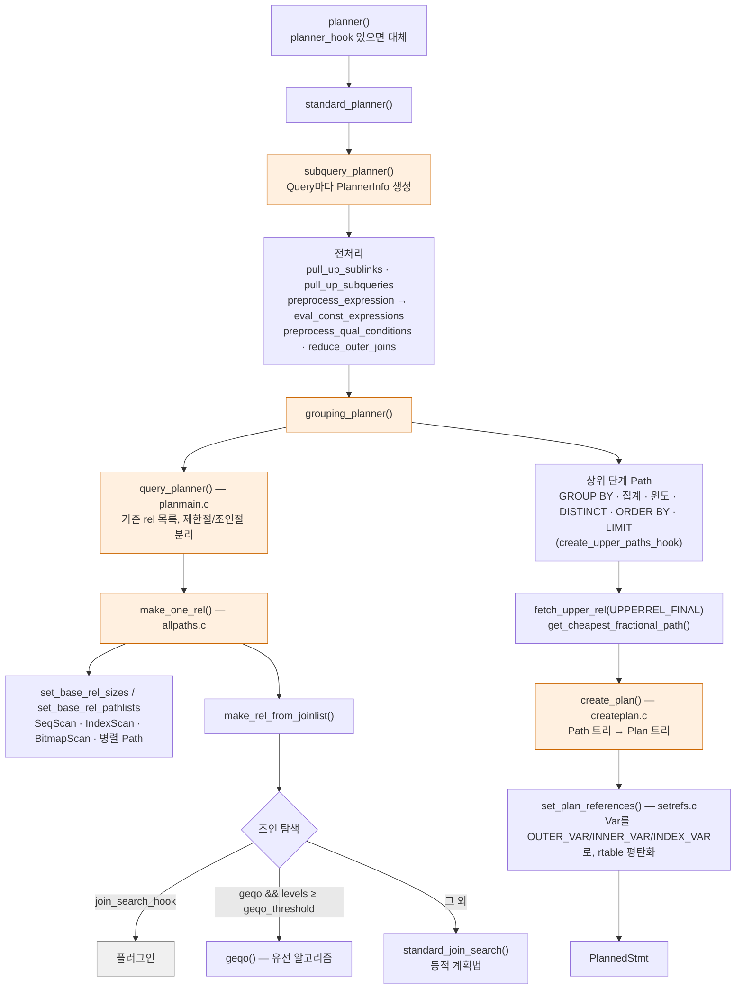

설계의 핵심은 **Path와 Plan의 분리**다.

| 개념 | 구조체 (헤더) | 의미 |
|---|---|---|
| `PlannerInfo` | `nodes/pathnodes.h` | Query 하나를 계획하는 동안의 작업 상태. 서브쿼리마다 별도 |
| `RelOptInfo` | `pathnodes.h` | 기준 테이블 하나 또는 조인된 테이블 집합 |
| `RestrictInfo` | `pathnodes.h` | WHERE 절 조각 (`x = 3`, `y = z`). 선택도 캐시 포함 |
| `Path` | `pathnodes.h` | RelOptInfo를 **만드는 방법 한 가지**와 그 비용 추정 |
| `Plan` | `nodes/plannodes.h` | 선택된 Path를 실행 가능한 형태로 확정한 것 |

`Path` 구조체(18.4 `pathnodes.h`, 주석 제거).

```c
typedef struct Path
{
	pg_node_attr(no_copy_equal, no_read, no_query_jumble)
	NodeTag		type;
	NodeTag		pathtype;
	RelOptInfo *parent ...;
	PathTarget *pathtarget ...;
	ParamPathInfo *param_info ...;
	bool		parallel_aware;
	bool		parallel_safe;
	int			parallel_workers;
	Cardinality rows;			/* estimated number of result tuples */
	int			disabled_nodes; /* count of disabled nodes */
	Cost		startup_cost;	/* cost expended before fetching any tuples */
	Cost		total_cost;		/* total cost (assuming all tuples fetched) */
	...
```

Path는 가볍다. 실행에 필요한 세부(타깃 리스트 전체, 식 변환)를 다 갖추지 않고 **비교에 필요한 정보만** 담는다.
수많은 후보를 만들고 버려야 하므로 그래야 한다. 이긴 Path만 `create_plan()`이 Plan으로 바꾼다.

### 5.2 Path 경쟁 규칙 — add_path

`add_path()`(`optimizer/util/pathnode.c`) 주석이 경쟁 규칙의 정의다. 새 Path는 다음 중 하나라도 기존 Path보다 나으면 살아남는다.

- 더 나은 정렬 순서(pathkeys) — 위쪽에서 ORDER BY·Merge Join이 정렬을 아낄 수 있으므로
- 더 싼 **total_cost** 또는 더 싼 **startup_cost** (한쪽씩 이기면 둘 다 유지 — LIMIT·커서 때문)
- 더 적은 행 수, 더 작은 매개변수화 요구, 병렬 안전성

PG18 소스 주석에 따르면 `enable_seqscan=false` 같은 비활성화는 이제 비용에 큰 수를 더하는 방식이 아니라
**`disabled_nodes` 개수를 비용보다 상위 비교 키로** 쓴다. 비활성화 노드를 더 적게 쓰는 Path가 비용과 관계없이 이긴다.
`Plan`/`Path` 구조체에 `disabled_nodes` 필드가 있고, PG18 릴리스 노트에 "Indicate disabled nodes in EXPLAIN ANALYZE output"이 있다.

마지막에 `set_cheapest()`가 RelOptInfo마다 `cheapest_startup_path`, `cheapest_total_path`, 매개변수화된 최저 Path들을 고른다.

#### 실증: debug_print_plan — 뷰가 사라진 플랜 (V8)

```text
LOG:  plan:
DETAIL:     {PLANNEDSTMT
   :commandType 1
   :parallelModeNeeded false
   :jitFlags 0                                   ← jit_above_cost(100000) 미달
   :planTree
      {INDEXSCAN                                 ← 뷰 서브쿼리가 끌어올려져 emp 직접 스캔
      :scan.plan.disabled_nodes 0
      :scan.plan.startup_cost 0.2925
      :scan.plan.total_cost 8.3125
      :scan.plan.plan_rows 1
      :scan.plan.targetlist ({TARGETENTRY :expr {VAR :varno 2 :varattno 3 ...} :resname name})
      :scan.plan.qual ({OPEXPR :opno 521 ... 4000})        ← 뷰의 WHERE 는 Filter 로
      :scan.scanrelid 2
      :indexid 16390                                       ← emp_pkey
      :indexqual ({OPEXPR :opno 96 :args ({VAR :varno -3 :varattno 1 ...} {CONST 110})})
      :indexqualorig ({OPEXPR :opno 96 :args ({VAR :varno 2 :varattno 1 ...} {CONST 110})})
      :indexorderdir 1}
   :rtable (
      {RANGETBLENTRY :aliasname rich :rtekind 1 :subquery <> ...}   ← 껍데기만 남음
      {RANGETBLENTRY :aliasname emp :rtekind 0 :relid 16384 ...})
   :permInfos ( {… :relid 16400 …} {… :relid 16384 :checkAsUser 10 …} )
   :relationOids (o 16400 16384)                 ← 플랜 캐시 무효화 대상
```

```text
-- 같은 질의의 EXPLAIN VERBOSE
Index Scan using emp_pkey on public.emp  (cost=0.29..8.31 rows=1 width=6)
  Output: emp.name
  Index Cond: (emp.id = 110)
  Filter: (emp.sal > 4000)
```

관찰.

1. `subquery_planner`의 `pull_up_subqueries()`가 뷰 서브쿼리를 바깥 질의에 **병합**했다. 플랜에 SubqueryScan이 없다.
   rtable에는 뷰 RTE가 `:subquery <>`인 채 남는데, 권한 검사(`permInfos`)와 의존성 추적(`relationOids`)을 위해서다.
2. `indexqual`의 `varno -3`은 `INDEX_VAR`(`primnodes.h`: `INNER_VAR=-1, OUTER_VAR=-2, INDEX_VAR=-3, ROWID_VAR=-4`)다.
   `set_plan_references()`가 "인덱스의 1번 컬럼"으로 바꿔 둔 것이다. 사람이 읽는 원본은 `indexqualorig`에 따로 보관한다.
3. `relationOids (o 16400 16384)`: 이 플랜은 뷰와 emp 둘 다에 의존한다. 둘 중 하나라도 relcache 무효화가 오면
   캐시된 플랜이 무효가 된다(§8.3).

### 5.3 비용 모델

비용은 **임의 단위**이며, "순차 페이지 1개 읽기 = 1.0"을 기준으로 다른 연산을 상대 가중치로 표현한다.
기본값은 `optimizer/cost.h`의 매크로로 정의되며, 실제 `SHOW` 값과 같다(V1).

| GUC | `cost.h` 매크로 | 18.4 기본값 | 의미 |
|---|---|---|---|
| `seq_page_cost` | `DEFAULT_SEQ_PAGE_COST` | 1.0 | 순차 페이지 1개 |
| `random_page_cost` | `DEFAULT_RANDOM_PAGE_COST` | 4.0 | 랜덤 페이지 1개 |
| `cpu_tuple_cost` | `DEFAULT_CPU_TUPLE_COST` | 0.01 | 튜플 1개 처리 |
| `cpu_index_tuple_cost` | `DEFAULT_CPU_INDEX_TUPLE_COST` | 0.005 | 인덱스 엔트리 1개 |
| `cpu_operator_cost` | `DEFAULT_CPU_OPERATOR_COST` | 0.0025 | 연산자·함수 호출 1회 |
| `parallel_setup_cost` | `DEFAULT_PARALLEL_SETUP_COST` | 1000 | 병렬 워커 기동 |
| `parallel_tuple_cost` | `DEFAULT_PARALLEL_TUPLE_COST` | 0.1 | 워커→리더 튜플 1개 전송 |
| `effective_cache_size` | `DEFAULT_EFFECTIVE_CACHE_SIZE` | 524288 (8kB 페이지 = 4GB) | 캐시 크기 가정 (할당 아님) |

`cost_seqscan()`(`optimizer/path/costsize.c`)의 핵심식.

```c
disk_run_cost = spc_seq_page_cost * baserel->pages;
...
cpu_per_tuple = cpu_tuple_cost + qpqual_cost.per_tuple;
cpu_run_cost  = cpu_per_tuple * baserel->tuples;
```

즉 `total = pages × seq_page_cost + tuples × (cpu_tuple_cost + 조건식당 cpu_operator_cost …)`.
실증(V12): `emp`는 `relpages = 637`, `reltuples = 100000`.

| 질의 | 계산 | EXPLAIN total_cost |
|---|---|---|
| `SELECT * FROM emp` | 637 × 1.0 + 100000 × 0.01 | **1637.00** |
| `… WHERE sal > 4000` | 637 + 100000 × (0.01 + 0.0025) | **1887.00** |
| `… WHERE sal > 4000 AND dept = 3` | 637 + 100000 × (0.01 + 0.0025 × 2) | **2137.00** |

계산과 출력이 소수점까지 일치한다. 조건 하나가 `cpu_operator_cost` 1회로 계산되는 것은 연산자 함수가
`pg_proc.procost = 1`이기 때문이다(함수 비용은 [[PostgreSQL/INTERNALS/07-FUNCTION-MANAGER|07]] 참고).
SSD에서 `random_page_cost`를 낮추라는 권고([[PostgreSQL/11-PERFORMANCE|11]] §8)는 이 표에서 인덱스 스캔의
랜덤 I/O 가중치를 바꾸는 일이다.

### 5.4 통계와 선택도 추정

행 수 추정(`rows`)은 `pg_statistic`(사람이 읽기 쉬운 뷰는 `pg_stats`)을 근거로 한다.
`pg_statistic`은 컬럼마다 슬롯 5개(`STATISTIC_NUM_SLOTS 5`)를 두고, 슬롯 종류는 `stakindN`으로 표시한다
(`catalog/pg_statistic.h`).

| `stakind` | 매크로 | 내용 |
|---|---|---|
| 1 | `STATISTIC_KIND_MCV` | 최빈값과 빈도 |
| 2 | `STATISTIC_KIND_HISTOGRAM` | MCV 제외 값의 등빈도 히스토그램 경계 |
| 3 | `STATISTIC_KIND_CORRELATION` | 물리 순서와 값 순서의 상관 |
| 4 | `STATISTIC_KIND_MCELEM` | 배열·tsvector 원소 최빈값 |
| 5 | `STATISTIC_KIND_DECHIST` | 원소 개수 히스토그램 |
| 6 / 7 | `RANGE_LENGTH_HISTOGRAM` / `BOUNDS_HISTOGRAM` | 범위 타입 |

선택도 함수는 **연산자에 붙어 있다**. `pg_operator.oprrest`(제한절)와 `oprjoin`(조인절)이 그 함수다.

```sql
SELECT oprname, oprleft::regtype, oprrest, oprjoin FROM pg_operator WHERE oid IN (96, 521);
--  =  | integer | eqsel       | eqjoinsel
--  >  | integer | scalargtsel | scalargtjoinsel
```

`eqsel`·`scalargtsel` 등은 `utils/adt/selfuncs.c`에 있다. 사용자 정의 연산자도 선택도 함수를 지정할 수 있으며,
이것이 PostgreSQL 확장성의 한 축이다.

실증(V13). `emp.dept`는 0~9 균등, `emp.sal`은 `(g*37) % 5000`.

| 조건 | 근거 통계 | 추정 rows | 실제 |
|---|---|---|---|
| `dept = 3` | MCV에서 3의 빈도 0.10213333 | 10213 | — |
| `sal > 4000` | 히스토그램 경계 101개 (`…{3944,3994,4044}…`) 보간 | 19874 | 19980 |
| `sal > 4000 AND dept = 3` | 두 선택도의 **곱** (독립 가정) | 2030 | — |

`sal > 4000 AND dept = 3`의 2030 ≈ 19874 × 0.1021이다. 컬럼 간 상관을 모르는 기본 모델의 한계가 이 독립 가정이고,
`CREATE STATISTICS`(확장 통계)가 이를 보완한다([[PostgreSQL/11-PERFORMANCE|11]] §4).

**통계가 아예 없으면** 하드코딩된 기본 선택도를 쓴다(`utils/selfuncs.h`).

```c
#define DEFAULT_EQ_SEL	0.005
#define DEFAULT_INEQ_SEL  0.3333333333333333
#define DEFAULT_NUM_DISTINCT  200
```

`autovacuum_enabled=false`로 만들고 ANALYZE를 하지 않은 `nostat` 테이블(1만 행, `reltuples = -1`)에서는
플래너가 파일 크기로 튜플 수를 어림한 뒤 다음처럼 추정했다(추정 rows를 기본 선택도로 역산하면 약 11475행으로 본 것이다).

```text
WHERE x > 5  → rows=3825   (≈ 11475 × 0.3333)
WHERE x = 5  → rows=57     (≈ 11475 × 0.005)
```

대량 적재 직후 ANALYZE를 하지 않으면 1/3과 0.5%라는 근거 없는 값으로 플랜이 정해진다는 뜻이다.

### 5.5 조인 탐색 — 동적 계획법 vs GEQO

`make_rel_from_joinlist()`(`allpaths.c`)의 분기 원문.

```c
if (join_search_hook)
	return (*join_search_hook) (root, levels_needed, initial_rels);
else if (enable_geqo && levels_needed >= geqo_threshold)
	return geqo(root, levels_needed, initial_rels);
else
	return standard_join_search(root, levels_needed, initial_rels);
```

- `standard_join_search()`: 소스 주석이 직접 "simple 'dynamic programming' algorithm"이라고 부른다.
  `join_rel_level[1]` = 기준 테이블들 → 2개 조합 → 3개 조합 → … 식으로 레벨을 올리며, 레벨마다
  `set_cheapest()`로 최저 Path만 남긴다. 조인절이 있는 쌍을 우선 고려하고(`make_rels_by_clause_joins`),
  낮은 레벨끼리의 "bushy" 조합도 만든다.
- `geqo()`(`optimizer/geqo/geqo_main.c`): 조인 순서를 유전자로 보는 유전 알고리즘. 최적을 보장하지 않는다.

관련 GUC(18.4 기본값, V1).

| GUC | 기본값 | 의미 |
|---|---|---|
| `geqo` | on | GEQO 사용 여부 |
| `geqo_threshold` | 12 | FROM 항목이 이 수 **이상**이면 GEQO |
| `geqo_effort` | 5 | 1~10. 세대 수·풀 크기 기본값 결정 |
| `geqo_pool_size`, `geqo_generations` | 0 | 0이면 effort로 자동 결정 |
| `from_collapse_limit` | 8 | 서브쿼리를 상위 FROM으로 병합할 최대 항목 수 |
| `join_collapse_limit` | 8 | 명시적 `JOIN` 구문을 평탄화해 순서를 재배치할 최대 항목 수 |

실증(V14): 테이블 `j1…jN`을 `j1.id = j2.id AND j2.id = j3.id …`로 연결했다. 등호가 하나의 동치 클래스로 묶여
**모든 쌍이 조인 가능**해지므로 동적 계획법 탐색 공간이 가장 큰 형태다(`join_collapse_limit`·`from_collapse_limit`은 20).

| N | `geqo=off` (DP) 계획 시간 | `geqo=on` 계획 시간 | 비고 |
|---|---|---|---|
| 10 | 30.5 / 36.9 ms | 29.8 / 30.3 ms | 10 < 12 → 둘 다 DP |
| 12 | 281.8 / 267.4 ms | 20.7 / 22.3 ms | GEQO 발동 |
| 14 | **2697 / 2486 ms** | **29.7 / 25.8 ms** | DP는 2초 이상 |

같은 형태를 사슬(`j1.nxt = j2.id`, 인접 쌍만 조인 가능)로 바꾸면 14개에서도 DP가 0.6 ms였고 GEQO가 오히려 8.9 ms였다.
DP 비용은 테이블 수보다 **조인 그래프 모양**(조인 가능한 쌍의 수)에 좌우된다. 이번 측정에서는 비용 추정치가
두 방식 모두 같았지만(예: N=14 `cost=88.03`), GEQO는 무작위 탐색이라 일반적으로는 최적이 보장되지 않는다.

**join_collapse_limit**는 명시적 JOIN 순서를 플래너가 얼마나 존중하는지를 정한다(V15).

```sql
EXPLAIN (COSTS OFF) SELECT count(*) FROM emp e
  JOIN ord o ON o.id = e.id JOIN dept d ON d.id = e.dept WHERE d.dname = 'd3';
-- 기본(8): (emp ⋈ dept) 를 먼저 만들어 Hash 로 → ord 와 조인
SET join_collapse_limit = 1;
-- 1: 쓴 순서 그대로 (emp ⋈ ord) 먼저 → dept 는 나중
```

`join_collapse_limit = 1`은 사실상 "작성한 JOIN 순서를 그대로 쓰라"는 수동 힌트다. PostgreSQL은 옵티마이저 힌트 구문을
제공하지 않는 정책을 유지하는데([[PostgreSQL/INTERNALS/01-ORIGIN-PHILOSOPHY|01]]), 이 GUC가 그나마 가까운 공식 수단이다.

### 5.6 PG18 플래너 변화 (릴리스 노트 기준)

| 항목 | GUC | 비고 |
|---|---|---|
| 불필요한 self-join 자동 제거 | `enable_self_join_elimination` (기본 on, V1 확인) | |
| `OR` 절을 배열(`= ANY`)로 변환해 인덱스 처리 | — | |
| `IN (VALUES …)` 일부를 `= ANY`로 변환 | — | |
| B-tree 다중 컬럼 인덱스 **skip scan** | — | [[PostgreSQL/11-PERFORMANCE|11]] §2의 "복합 인덱스 좌측 미사용" 항목이 PG18부터 일부 완화됨 |
| `SELECT DISTINCT` 키 순서 재배치 | `enable_distinct_reordering` (기본 on) | |
| 함수 종속인 `GROUP BY` 컬럼 무시 | — | |

EXPLAIN 쪽 변화도 이번 실증에서 관찰됐다. `EXPLAIN ANALYZE`가 BUFFERS를 기본 포함(`Buffers: shared hit=637`),
행 수를 소수로 표시(`rows=19980.00`), 인덱스 스캔에 `Index Searches: 1` 표시. 모두 PG18 릴리스 노트 항목이다.

---

## 6. Executor

### 6.1 네 단계 API

`executor/executor.h`(18.4) 선언.

```c
extern void ExecutorStart(QueryDesc *queryDesc, int eflags);
extern void ExecutorRun(QueryDesc *queryDesc, ScanDirection direction, uint64 count);
extern void ExecutorFinish(QueryDesc *queryDesc);
extern void ExecutorEnd(QueryDesc *queryDesc);
```

각각 `ExecutorStart_hook` 등 훅이 있으면 그것을, 없으면 `standard_Executor*`를 부른다.
(`auto_explain`과 `pg_stat_statements`가 이 훅을 쓴다. 훅 목록은 [[PostgreSQL/INTERNALS/09-FEATURES-EXTENSIBILITY|09]].)

| 단계 | 하는 일 |
|---|---|
| `ExecutorStart` | `EState` 생성, 권한 검사(`ExecCheckPermissions`), `InitPlan` → **`ExecInitNode`를 재귀 호출해 Plan 트리와 같은 모양의 PlanState 트리** 생성 |
| `ExecutorRun` | `ExecutePlan`: 최상위 PlanState에 `ExecProcNode`를 반복 호출하고, 받은 슬롯을 `DestReceiver`로 보냄. `count`만큼만 가져오고 멈출 수 있음 |
| `ExecutorFinish` | AFTER 트리거 발화, 수정형 CTE 마무리 |
| `ExecutorEnd` | `ExecEndNode` 재귀 → 자원 해제, `EState` 메모리 컨텍스트 해제 |

`eflags` 비트(`executor.h`): `EXEC_FLAG_EXPLAIN_ONLY 0x0001`, `EXEC_FLAG_EXPLAIN_GENERIC 0x0002`,
`EXEC_FLAG_REWIND 0x0004`, `EXEC_FLAG_BACKWARD 0x0008`, `EXEC_FLAG_MARK 0x0010`,
`EXEC_FLAG_SKIP_TRIGGERS 0x0020`, `EXEC_FLAG_WITH_NO_DATA 0x0040`. 플랜 EXPLAIN만 할 때도 `ExecutorStart`는 돌아
PlanState 트리를 만들되(그래야 EXPLAIN이 트리를 순회할 수 있다) Run은 하지 않는다.

`QueryDesc`(`executor/execdesc.h`)는 실행 한 번의 묶음이다. `plannedstmt`, `sourceText`, `snapshot`, `dest`, `params`와
Start가 채우는 `tupDesc`, `estate`, `planstate`로 이뤄진다. 스냅샷이 여기 들어간다는 점이 MVCC와의 연결 지점이다
([[PostgreSQL/INTERNALS/04-MVCC-WAL|04]]).

### 6.2 Volcano / iterator 모델

PostgreSQL 실행기는 **수요 주도(pull) 반복자** 모델이다. 부모 노드가 자식에게 "다음 튜플 하나"를 요구하고,
자식은 필요할 때만 자기 자식에게 요구한다. `executor.h`의 인라인 함수 원문.

```c
static inline TupleTableSlot *
ExecProcNode(PlanState *node)
{
	if (node->chgParam != NULL) /* something changed? */
		ExecReScan(node);		/* let ReScan handle this */

	return node->ExecProcNode(node);
}
```

`PlanState`(`nodes/execnodes.h`) 앞부분.

```c
typedef TupleTableSlot *(*ExecProcNodeMtd) (struct PlanState *pstate);

typedef struct PlanState
{
	pg_node_attr(abstract)
	NodeTag		type;
	Plan	   *plan;			/* associated Plan node */
	EState	   *state;			/* ... one EState for the whole top-level plan */
	ExecProcNodeMtd ExecProcNode;	/* function to return next tuple */
	ExecProcNodeMtd ExecProcNodeReal;	/* actual function, if above is a wrapper */
	Instrumentation *instrument;	/* Optional runtime stats for this node */
	...
	ExprState  *qual;			/* boolean qual condition */
	struct PlanState *lefttree; /* input plan tree(s) */
	struct PlanState *righttree;
```

- 노드 종류별 분기를 `switch`가 아니라 **함수 포인터**로 한다. `ExecInitNode()`가 노드 타입별 `ExecInit*`를 부르고,
  각 Init이 자기 `ExecProcNode`를 정한다.
- 처음 호출은 `ExecProcNodeFirst()`(`execProcnode.c`)를 거친다. 첫 호출에서만 `check_stack_depth()`를 하고,
  계측이 필요하면 포인터를 `ExecProcNodeInstr`로, 아니면 실제 함수로 바꿔치기한다.
  "EXPLAIN ANALYZE를 안 하면 계측 오버헤드가 0"인 이유가 이 포인터 교체다.
- PG18의 `nodeSeqscan.c`는 `ExecSeqScan` / `ExecSeqScanWithQual` / `ExecSeqScanWithProject` / `ExecSeqScanWithQualProject`
  네 변형을 두고, `ExecInitSeqScan`이 qual·projection 유무에 따라 하나를 골라 꽂는다. 공통 루프는 `executor/execScan.h`의
  `pg_attribute_always_inline` 함수 `ExecScanExtended`이며, 인라인으로 특수화해 분기를 줄이는 구조다.
- 실제 테이블 읽기는 `SeqNext()` → `table_scan_getnextslot()`, 즉 table AM API를 거친다(힙 구현은 [[PostgreSQL/INTERNALS/03-STORAGE|03]]).

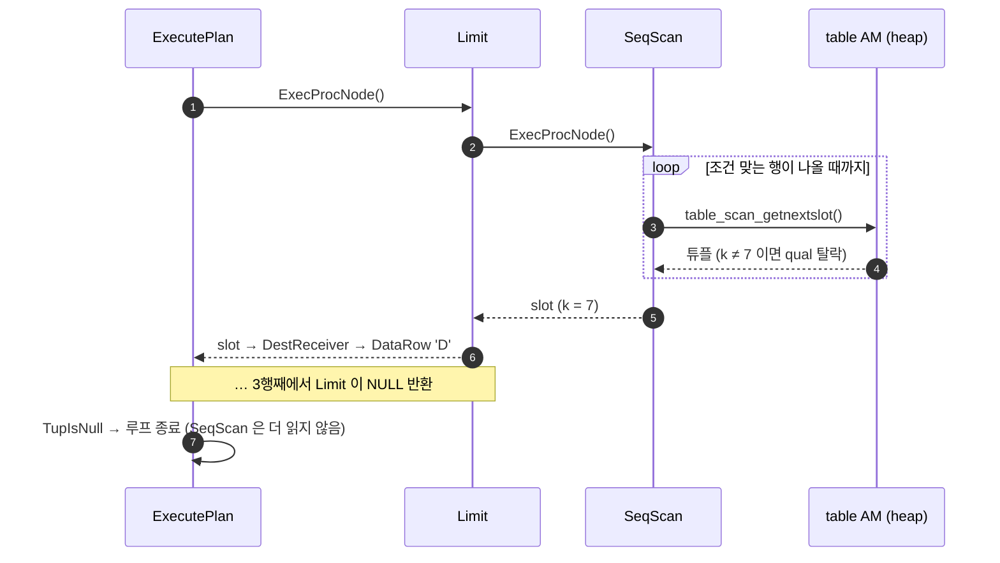

실증(V16) — pull 모델이라 LIMIT이 아래쪽 스캔을 **조기에 멈춘다**.

```text
EXPLAIN (ANALYZE, BUFFERS, COSTS OFF, TIMING OFF) SELECT * FROM big WHERE k = 7 LIMIT 3;
 Limit (actual rows=3.00 loops=1)
   Buffers: shared read=47
   ->  Seq Scan on big (actual rows=3.00 loops=1)
         Filter: (k = 7)
         Rows Removed by Filter: 2004
         Buffers: shared read=47
```

`big`은 300만 행, 28096페이지인데 Seq Scan은 2007행·47페이지만 읽고 끝났다. 반대로 **블로킹 노드**는 첫 행을 내기 전에
입력을 다 소비해야 한다.

```text
EXPLAIN (ANALYZE, COSTS OFF, TIMING OFF, BUFFERS OFF) SELECT * FROM emp ORDER BY sal LIMIT 2;
 Limit (actual rows=2.00 loops=1)
   ->  Sort (actual rows=2.00 loops=1)
         Sort Method: top-N heapsort  Memory: 25kB
         ->  Seq Scan on emp (actual rows=100000.00 loops=1)     ← 전부 읽음
```

Sort는 LIMIT을 알고 top-N 힙 정렬로 메모리는 아꼈지만(상위 노드가 `ExecSetTupleBound`로 필요한 수를 알려 줌)
입력 10만 행은 다 읽었다. `startup_cost`와 `total_cost`를 따로 두는 이유가 이것이다. 블로킹 노드는 startup이 크다.

### 6.3 노드 유형 표

`ExecInitNode()`(`execProcnode.c`)는 소스 주석으로 노드를 네 묶음으로 나눈다. 18.4 기준 전체 목록.

| 분류 | 노드 | 비고 |
|---|---|---|
| control | `Result`, `ProjectSet`, `ModifyTable`, `Append`, `MergeAppend`, `RecursiveUnion`, `BitmapAnd`, `BitmapOr` | `ModifyTable`이 INSERT/UPDATE/DELETE/MERGE의 최상위 |
| scan | `SeqScan`, `SampleScan`, `IndexScan`, `IndexOnlyScan`, `BitmapIndexScan`, `BitmapHeapScan`, `TidScan`, `TidRangeScan`, `SubqueryScan`, `FunctionScan`, `TableFuncScan`, `ValuesScan`, `CteScan`, `NamedTuplestoreScan`, `WorkTableScan`, `ForeignScan`, `CustomScan` | `ForeignScan`=FDW, `CustomScan`=확장 |
| join | `NestLoop`, `MergeJoin`, `HashJoin` | 알고리즘별 특성은 [[PostgreSQL/04-JOIN-SUBQUERY|04. JOIN]] |
| materialization | `Material`, `Sort`, `IncrementalSort`, `Memoize`, `Group`, `Agg`, `WindowAgg`, `Unique`, `Gather`, `GatherMerge`, `Hash`, `SetOp`, `LockRows`, `Limit` | 대체로 블로킹 또는 상태 보유 |

`Hash`, `BitmapIndexScan`, `BitmapAnd`, `BitmapOr`는 튜플을 한 개씩 내지 않고 해시 테이블·비트맵을 통째로 넘기므로
`ExecProcNode` 대신 `MultiExecProcNode()`로 호출된다(`execProcnode.c`의 `MultiExecProcNode` switch에 이 넷만 있음). 순수 반복자 모델에서 의도적으로 벗어난 예외다.

### 6.4 식 평가 — ExprState와 인터프리터

WHERE·타깃 리스트의 식은 실행 시 트리를 직접 순회하지 않는다. `ExecInitExpr`/`ExecInitQual`(`execExpr.c`)이
식 트리를 **평평한 단계(step) 배열**인 `ExprState`로 컴파일하고, `ExecInterpExpr()`(`execExprInterp.c`)가 실행한다.
`execExprInterp.c` 머리 주석에 따르면 gcc·clang 계열에서는 computed goto를 쓰는 "direct threaded" 방식,
그 외 컴파일러에서는 `switch` 방식으로 디스패치한다(`EEO_USE_COMPUTED_GOTO`). 이 단계 배열이 §10 JIT의 입력이다.
연산자 단계는 결국 `FunctionCallInfo`를 채워 fmgr로 함수를 호출한다([[PostgreSQL/INTERNALS/07-FUNCTION-MANAGER|07]]).

---

## 7. Portal — 실행의 컨테이너

Portal은 "실행 중이거나 실행 대기 중인 질의"를 감싸는 객체다(`utils/portal.h`, `utils/mmgr/portalmem.c`, `tcop/pquery.c`).
simple query는 이름 없는 포털 `""`를 만들어 한 번에 끝까지 돌리고, extended query의 Bind와 SQL `DECLARE CURSOR`가
이름 있는 포털을 만든다.

```c
typedef enum PortalStrategy
{
	PORTAL_ONE_SELECT,
	PORTAL_ONE_RETURNING,
	PORTAL_ONE_MOD_WITH,
	PORTAL_UTIL_SELECT,
	PORTAL_MULTI_QUERY,
} PortalStrategy;

typedef enum PortalStatus
{
	PORTAL_NEW,					/* freshly created */
	PORTAL_DEFINED,				/* PortalDefineQuery done */
	PORTAL_READY,				/* PortalStart complete, can run it */
	PORTAL_ACTIVE,				/* portal is running (can't delete it) */
	PORTAL_DONE,				/* portal is finished (don't re-run it) */
	PORTAL_FAILED,				/* portal got error (can't re-run it) */
} PortalStatus;
```

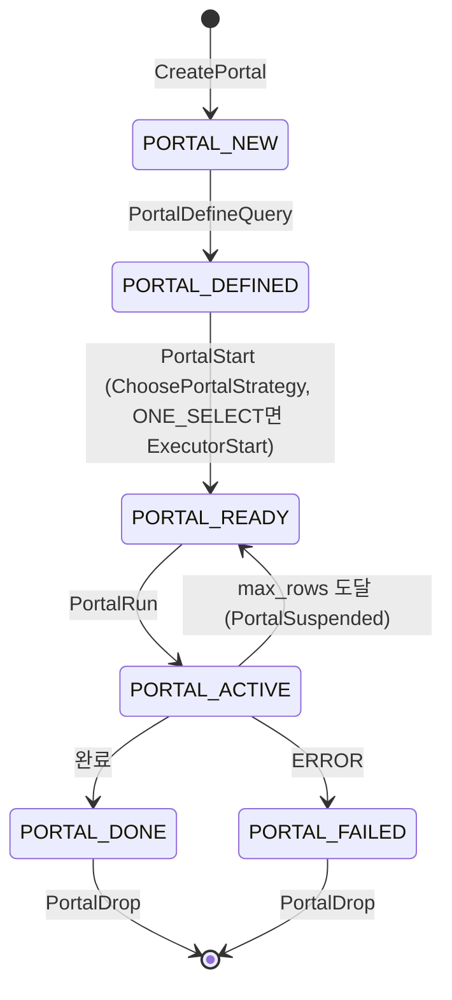

| 전략 | 언제 | 실행 방식 |
|---|---|---|
| `PORTAL_ONE_SELECT` | SELECT 하나 (커서 가능) | `PortalStart`에서 `ExecutorStart`, `PortalRunSelect`가 요청된 수만큼 `ExecutorRun(count)` — **중단·재개 가능** |
| `PORTAL_ONE_RETURNING` / `PORTAL_ONE_MOD_WITH` | `INSERT … RETURNING`, 수정형 CTE | 첫 요청 때 끝까지 실행해 결과를 tuplestore에 담고 거기서 꺼냄 |
| `PORTAL_UTIL_SELECT` | 결과를 내는 유틸리티 (`SHOW`, `EXPLAIN` 등) | 유틸리티 실행 결과를 tuplestore로 |
| `PORTAL_MULTI_QUERY` | 그 외 (룰로 여러 문장이 된 경우 포함) | `PortalRunMulti` → 문장마다 `ProcessQuery`(Start/Run/Finish/End 한 번에) |

`ONE_SELECT`만 진짜로 반쯤 실행한 상태로 멈출 수 있다. §1.6의 `PortalSuspended` 실험과 SQL 커서가 이 경로다(V22).

```sql
BEGIN;
DECLARE c1 CURSOR FOR SELECT id FROM emp ORDER BY id;
FETCH 2 FROM c1;     -- 1, 2
SELECT name, statement, is_holdable, is_scrollable FROM pg_cursors;
--  c1 | DECLARE c1 CURSOR FOR SELECT id FROM emp ORDER BY id; | f | t
FETCH 2 FROM c1;     -- 3, 4  ← 같은 실행 상태에서 이어서
COMMIT;              -- 트랜잭션 종료와 함께 포털 소멸 (pg_cursors 0건)
```

---

## 8. 플랜 캐시 — generic vs custom

### 8.1 구조

prepared statement(SQL `PREPARE` 또는 프로토콜 Parse), PL/pgSQL 내부 SQL, SPI가 플랜 캐시를 쓴다.
핵심 구조체는 `CachedPlanSource`(`utils/plancache.h`)다.

| 필드 | 의미 |
|---|---|
| `raw_parse_tree` | raw parser 출력 (재분석용으로 보관) |
| `query_list` | 분석·재작성 결과 Query 리스트 (무효화되면 NIL) |
| `gplan` | generic plan (`CachedPlan`), 없으면 NULL |
| `generic_cost` | generic plan 비용, 모르면 -1 |
| `total_custom_cost`, `num_custom_plans` | 지금까지 만든 custom plan의 비용 합과 횟수 |
| `num_generic_plans` | generic plan 사용 횟수 |
| `is_oneshot`, `is_valid` | 일회용 여부, 유효 여부 |

- **custom plan**: 이번 파라미터 값을 상수처럼 넣고 매번 새로 짠 플랜. 정확하지만 매번 planning 비용이 든다.
- **generic plan**: `$1`을 모르는 값으로 두고 한 번 짜서 재사용하는 플랜. 싸지만 값 분포가 치우치면 나쁠 수 있다.

### 8.2 "5회 규칙" — choose_custom_plan

`utils/cache/plancache.c`의 `choose_custom_plan()` 원문(REL_18_STABLE).

```c
	/* Let settings force the decision */
	if (plan_cache_mode == PLAN_CACHE_MODE_FORCE_GENERIC_PLAN)
		return false;
	if (plan_cache_mode == PLAN_CACHE_MODE_FORCE_CUSTOM_PLAN)
		return true;
	...
	/* Generate custom plans until we have done at least 5 (arbitrary) */
	if (plansource->num_custom_plans < 5)
		return true;

	avg_custom_cost = plansource->total_custom_cost / plansource->num_custom_plans;

	/*
	 * Prefer generic plan if it's less expensive than the average custom
	 * plan.  (Because we include a charge for cost of planning in the
	 * custom-plan costs, ...)
	 */
	if (plansource->generic_cost < avg_custom_cost)
		return false;

	return true;
```

custom plan 비용에는 planning 비용이 가산된다. `cached_plan_cost()`의 식은 `total_cost + 1000 × cpu_operator_cost × (rtable 길이 + 1)`이다.
소스 주석도 "very crude estimate"라고 인정한다. 기본값에서는 테이블 하나짜리 질의에 2.5 × 2 = 5.0이 더해진다.

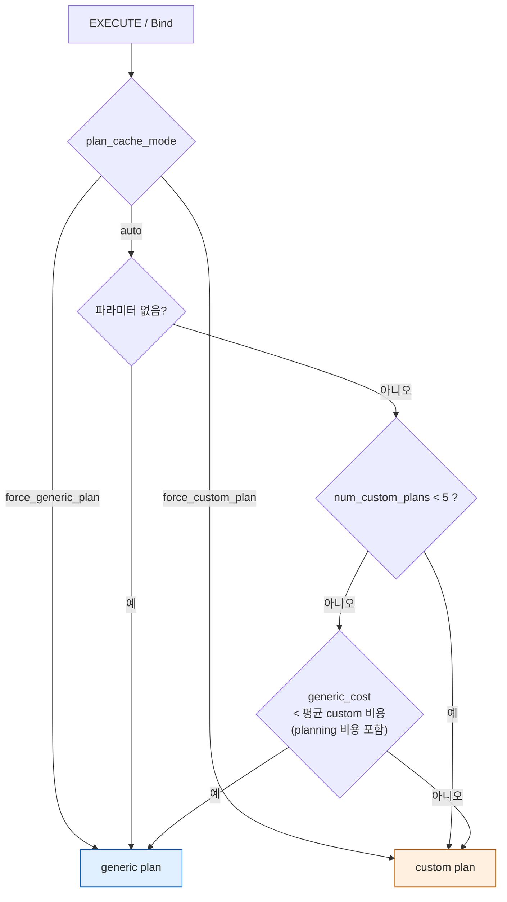

### 8.3 실증 (V17)

**균등 분포 — 6번째에 generic으로 전환.**

```sql
PREPARE p_emp(int) AS SELECT name FROM emp WHERE id = $1;
EXECUTE p_emp(1); … EXECUTE p_emp(5);
SELECT name, generic_plans, custom_plans FROM pg_prepared_statements;
--  p_emp | 0 | 5
EXPLAIN EXECUTE p_emp(6);
--  Index Scan using emp_pkey on emp  (cost=0.29..8.31 rows=1 width=6)
--    Index Cond: (id = $1)                         ← $1 그대로 = generic
--  p_emp | 1 | 5
EXECUTE p_emp(7);
--  p_emp | 2 | 5
```

custom 평균 = 8.31 + 5.0 = 13.31, generic = 8.31 → generic이 싸므로 6번째부터 generic이다.

**치우친 분포 — custom 유지.** `ord.status`는 `'done'` 99%, `'new'` 1%(20만 행).

```sql
PREPARE p_ord(text) AS SELECT max(id) FROM ord WHERE status = $1;
EXECUTE p_ord('new');  -- × 8
--  p_ord | generic_plans 0 | custom_plans 8      ← 8번째까지도 custom
EXPLAIN EXECUTE p_ord('new');
--  Aggregate  (cost=264.78..264.79 ...)  ->  Index Scan … rows=1860   Index Cond: (status = 'new'::text)
EXPLAIN EXECUTE p_ord('done');
--  Finalize Aggregate (cost=5035.19..) -> Gather -> Parallel Seq Scan …    ← 값에 따라 다른 플랜
SET plan_cache_mode = force_generic_plan;
EXPLAIN EXECUTE p_ord('new');
--  Aggregate  (cost=3778.29..3778.30 ...)  ->  Index Scan … rows=100000  Index Cond: (status = $1)
```

generic plan은 `$1`을 모르므로 `1/n_distinct`(값 2개 → 50%)로 10만 행을 추정해 3778을 냈다. custom 평균(≈ 264.79 + 5)보다
훨씬 비싸서 auto 모드가 custom을 유지한 것이다. 반대로 분포가 치우쳤는데 **처음 5번이 우연히 흔한 값**이었다면 generic이 이겨 버릴 수 있다.
"prepared statement가 6번째부터 갑자기 느려진다"는 현상의 내부 원인이 이 규칙이며, 처방은 `plan_cache_mode = force_custom_plan`
(세션·함수·롤 단위 설정)이다. `force_custom_plan`으로 `p_emp`를 8번 실행하면 `generic_plans 0 / custom_plans 8`이었다.

`EXPLAIN (GENERIC_PLAN)`(PG16+)은 PREPARE 없이 `$1`이 든 SQL의 generic plan을 바로 보여 준다.

### 8.4 무효화

`plancache.c` 머리 주석의 요약. 무효화는 sinval 이벤트로 일어난다. 플랜이 의존하는 relation(`PlannedStmt.relationOids`),
사용자 정의 함수, 도메인을 추적하다가 해당 relcache 또는 `pg_proc`/`pg_type` syscache 무효화가 오면 그 플랜만 무효로 표시한다.
`search_path`가 바뀌어도 재분석·재계획하며, RLS가 관련되면 사용자나 RLS 환경이 바뀔 때도 그렇다.
무효화된 `CachedPlanSource`는 다음 사용 시 `raw_parse_tree`부터 다시 분석한다. 그래서 `SELECT *`를 prepare한 뒤
컬럼을 추가하면 결과 형태가 바뀔 수 있다. 캐시 무효화 메커니즘 자체는 [[PostgreSQL/INTERNALS/06-CATALOG-OID|06]]에서 다룬다.

---

## 9. 병렬 쿼리

### 9.1 구조

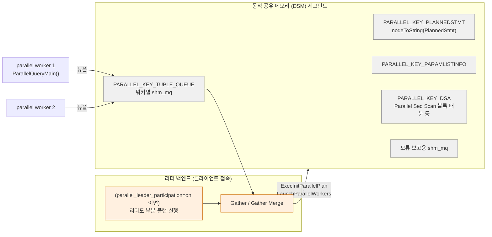

- `access/transam/README.parallel`에 따르면 리더는 병렬 작업 기간 동안 유지되는 DSM 세그먼트를 만들고, 거기에
  (1) 오류·메시지 전달용 `shm_mq`, (2) 리더 상태의 직렬화본(스냅샷, GUC, 트랜잭션 상태 등), (3) 용도별 데이터를 담은 뒤
  postmaster에 워커 기동을 요청한다.
- 실행기 쪽(`executor/execParallel.c`)은 `CreateParallelContext("postgres", "ParallelQueryMain", nworkers)`로 컨텍스트를 만들고
  `PARALLEL_KEY_*` 키로 DSM 목차(`shm_toc`)에 플랜·파라미터·버퍼 사용량·튜플 큐·계측·DSA·쿼리 문자열·JIT 계측·WAL 사용량을 넣는다.
  플랜은 `ExecSerializePlan()`이 **`nodeToString(pstmt)`으로 텍스트화**한다(§3.3).
- `Gather`(`nodeGather.c`)는 워커의 튜플 큐와 (켜져 있으면) 자기 로컬 실행을 번갈아 읽는다. `Gather Merge`는 정렬된 스트림을 병합한다.
- 워커는 프로세스다(백그라운드 워커 인프라). 리더와 워커는 `max_worker_processes`(8) 풀을 공유하며,
  `max_parallel_workers`(8)와 `max_parallel_workers_per_gather`(2)가 상한이다.

### 9.2 워커 수 결정

`compute_parallel_worker()`(`allpaths.c`)의 규칙: 테이블이 `min_parallel_table_scan_size`(기본 1024페이지 = 8MB)보다 작으면 0,
그 이상이면 1에서 시작해 크기가 **3배 될 때마다 1씩** 늘린다. 마지막으로 `max_parallel_workers_per_gather`로 자른다.
테이블 저장 옵션 `parallel_workers`가 있으면 이 계산을 대체한다.

| `big` 페이지 수 | 경계 | 계산 워커 |
|---|---|---|
| 28096 | 1024 → 3072 → 9216 → 27648 | 4 |

실증(V19).

```text
SET max_parallel_workers_per_gather = 8;
EXPLAIN (COSTS OFF) SELECT count(*) FROM big;
 Finalize Aggregate -> Gather  Workers Planned: 4 -> Partial Aggregate -> Parallel Seq Scan on big
ALTER TABLE big SET (parallel_workers = 6);
 … Workers Planned: 6
```

기본 설정(per_gather = 2)에서는 `Workers Planned: 2 / Workers Launched: 2`. `ord`(2273페이지)는 1024 이상 3072 미만이라
`Workers Planned: 1`이었다(§8.3 `'done'` 플랜). 집계는 **Partial Aggregate(워커) → Finalize Aggregate(리더)** 두 단계로 쪼개진다.

실행 중 `pg_stat_activity`에서 워커 프로세스를 직접 잡았다.

```text
  pid  | leader_pid |  backend_type
-------+------------+-----------------
 54999 |            | client backend
 55001 |      54999 | parallel worker
 55003 |      54999 | parallel worker
 55002 |      54999 | parallel worker
```

`EXPLAIN (ANALYZE, VERBOSE)`는 워커별 실적을 따로 보여 준다(`Worker 0: actual … rows=991034.00`, `Worker 1: … rows=948489.00`,
노드 전체 `rows=1000000.00 loops=3` = 리더 + 워커 2). `loops=3`의 3이 "리더도 참여했다"는 표시다.

병렬 플랜을 쓸 수 없는 경우(병렬 위험 함수 `PARALLEL UNSAFE` 호출, 쓰기 질의의 일부, 커서 등)의 판정은
함수의 parallel 속성에 달려 있고, 그 속성은 [[PostgreSQL/INTERNALS/07-FUNCTION-MANAGER|07]]에서 다룬다.

---

## 10. JIT 컴파일 (LLVM)

### 10.1 결정 로직

`standard_planner()` 끝부분 원문(REL_18_STABLE).

```c
	result->jitFlags = PGJIT_NONE;
	if (jit_enabled && jit_above_cost >= 0 &&
		top_plan->total_cost > jit_above_cost)
	{
		result->jitFlags |= PGJIT_PERFORM;
		if (jit_optimize_above_cost >= 0 &&
			top_plan->total_cost > jit_optimize_above_cost)
			result->jitFlags |= PGJIT_OPT3;
		if (jit_inline_above_cost >= 0 &&
			top_plan->total_cost > jit_inline_above_cost)
			result->jitFlags |= PGJIT_INLINE;
		if (jit_expressions)
			result->jitFlags |= PGJIT_EXPR;
		if (jit_tuple_deforming)
			result->jitFlags |= PGJIT_DEFORM;
	}
```

`jit/jit.h`: `PGJIT_PERFORM 1`, `PGJIT_OPT3 2`, `PGJIT_INLINE 4`, `PGJIT_EXPR 8`, `PGJIT_DEFORM 16`.

| GUC | 18.4 기본값 | 의미 |
|---|---|---|
| `jit` | on | 사용 여부 |
| `jit_provider` | `llvmjit` | 로드할 공유 라이브러리 이름 |
| `jit_above_cost` | 100000 | 플랜 총비용이 이를 넘으면 JIT |
| `jit_optimize_above_cost` | 500000 | LLVM 최적화(-O3 상당) |
| `jit_inline_above_cost` | 500000 | 연산자·함수 본문 인라이닝 |

- 판단 기준은 **플랜 전체 총비용 하나**다. 노드별로 판단하지 않는다.
- JIT 대상은 §6.4의 **식 평가 단계 배열**과 **튜플 디포밍**(heap 튜플을 컬럼 값으로 푸는 작업)이다(`src/backend/jit/README`).
- 인라이닝은 서버·확장 함수를 LLVM bitcode로 미리 만들어 `$pkglibdir/bitcode/` 아래 설치해 두고 쓰는 방식이다(같은 README).
- provider는 처음 필요할 때 `provider_init()`(`jit/jit.c`)가 `$pkglibdir/llvmjit.so` 류를 로드한다. 실패하면
  `provider_failed_loading`을 세팅하고 **오류 없이** JIT 없이 진행한다.

### 10.2 로컬 빌드 확인 — 실증 불가

```bash
pg_config --configure | tr ' ' '\n' | grep -i llvm      # 출력 없음 → --with-llvm 아님
ls $(pg_config --pkglibdir)/bitcode                     # No such file or directory
```

```sql
SELECT pg_jit_available();     -- f
SHOW jit;                      -- on  (설정은 켜져 있지만 provider가 없음)
```

이 Homebrew 18.4는 **`--with-llvm` 없이 빌드**됐다. 그래서 실제 JIT 컴파일은 실증할 수 없었다.
대신 "플래너는 JIT을 결정하지만 실행기가 provider 로드에 실패해 조용히 넘어간다"는 경로를 확인했다(V20).

```text
SET jit_above_cost = 0; SET jit_inline_above_cost = 0; SET jit_optimize_above_cost = 0;
SET debug_print_plan = on;
SELECT sum(id) FROM emp;
   :jitFlags 31            ← 1+2+4+8+16, 플래너는 모든 JIT 플래그를 켬

EXPLAIN (ANALYZE, BUFFERS OFF) SELECT sum(id) FROM emp;
 Aggregate  (cost=1887.00..1887.01 rows=1 width=8) (actual time=4.259..4.259 rows=1.00 loops=1)
   ->  Seq Scan on emp  (cost=0.00..1637.00 rows=100000 width=4) (actual …)
 Planning Time: 0.029 ms
 Execution Time: 4.269 ms
                           ← "JIT:" 섹션 없음 (provider 미설치)
```

LLVM 빌드에서는 EXPLAIN ANALYZE 끝에 `JIT:` 섹션이 붙는다. 공식 문서(JIT 사용 결정 절, `jit_above_cost = 10` 예시)의 출력 형식은 다음과 같다.

```text
 JIT:
   Functions: 3
   Options: Inlining false, Optimization false, Expressions true, Deforming true
   Timing: Generation 1.259 ms (Deform 0.000 ms), Inlining 0.000 ms, Optimization 0.797 ms, Emission 5.048 ms, Total 7.104 ms
```

이 출력은 문서 예시를 옮긴 것이며 로컬에서 재현하지 못했다(**확인 필요**: LLVM 빌드 환경에서 직접 재검증).
실무에서는 OLTP 단건 질의가 비용 추정 오차로 10만을 넘겨 **컴파일 시간이 실행 시간보다 커지는** 일이 생길 수 있어,
`jit`을 끄거나 `jit_above_cost`를 높이는 튜닝이 흔하다. 다만 이것은 일반론이고 이 환경에서 측정한 것은 아니다.

---

## 11. 훅 포인트 (이름만)

파이프라인 각 단계에는 확장 모듈이 끼어들 수 있는 함수 포인터 훅이 있다. 18.4 헤더에서 `extern PGDLLIMPORT`로 선언된 것을 확인했다.
세부 사용법은 [[PostgreSQL/INTERNALS/09-FEATURES-EXTENSIBILITY|09. 확장성 아키텍처]]에서 다룬다.

| 단계 | 훅 | 헤더 |
|---|---|---|
| analyze | `post_parse_analyze_hook` | `parser/analyze.h` |
| plan | `planner_hook`, `create_upper_paths_hook` | `optimizer/planner.h` |
| plan | `set_rel_pathlist_hook`, `set_join_pathlist_hook`, `join_search_hook` | `optimizer/paths.h` |
| plan | `get_relation_info_hook` | `optimizer/plancat.h` |
| execute | `ExecutorStart_hook`, `ExecutorRun_hook`, `ExecutorFinish_hook`, `ExecutorEnd_hook`, `ExecutorCheckPerms_hook` | `executor/executor.h` |
| utility | `ProcessUtility_hook` | `tcop/utility.h` |

---

## 12. 실증 기록 (PostgreSQL 18.4)

로컬 임시 클러스터(`initdb --locale=C -E UTF8`, 포트 55405, 유닉스 소켓 전용)에서 검증했다.
테이블은 `emp`(10만 행, PK `id`), `dept`(10행), 뷰 `rich`(`sal > 4000`), `ord`(20만 행, `status` 99:1 치우침 + 인덱스),
`big`(300만 행, 28096페이지), `nostat`(ANALYZE 안 함), `j1…j14`(조인 탐색용)를 썼다.
프로토콜 실험(V2~V4)은 Python 표준 라이브러리 `socket`으로 유닉스 소켓에 메시지를 직접 써서 응답 타입 바이트를 기록했다.

| # | 시나리오 | 결과 |
|---|---|---|
| V1 | 비용·GEQO·JIT·병렬 GUC 기본값 `pg_settings` | `seq_page_cost 1`, `random_page_cost 4`, `cpu_tuple_cost 0.01`, `cpu_index_tuple_cost 0.005`, `cpu_operator_cost 0.0025`, `geqo_threshold 12`, `join/from_collapse_limit 8`, `plan_cache_mode auto`, `jit_above_cost 100000`, `debug_pretty_print on` |
| V2 | StartupMessage 3.0 / 3.2 / 3.3 | `K` 키 길이 4 / **32** / 32. 3.3 요청은 `NegotiateProtocolVersion`(newest minor = 3.2) |
| V3 | simple query: 2문장, 빈 문자열, `BEGIN; 1/0; SELECT 3` | `T D C T D C Z(I)` / `I Z` / `C E Z(E)`, 오류 후 문장 미실행 |
| V4 | extended: P/B/D/E/S, Describe S, max_rows=2, 오류 파이프라인 | `1 2 T D C Z` / `t T Z` / `D D s D D s D C` / `1 E Z` 후 다음 Sync 묶음 정상, 1/0 오류는 **Bind**에서 |
| V5 | psql `\conninfo` 기본 vs `max_protocol_version=latest` | Protocol Version 3.0 / 3.2 |
| V6 | `debug_print_parse` (뷰 질의) | RTE `rtekind 0`, `relkind v`, `opno 96`(int4eq), `selectedCols (b 8 9)` |
| V7 | `debug_print_rewritten` (뷰 질의) | RTE가 `rtekind 1`(SUBQUERY)로 바뀌고 뷰 Query 삽입, 기반 테이블 `checkAsUser 10` |
| V8 | `debug_print_plan` (뷰 질의) | `INDEXSCAN` 단독(뷰 병합), `indexqual`의 `varno -3`(INDEX_VAR), `relationOids (o 16400 16384)` |
| V9 | `DO ALSO` 룰 + rewritten | Query 2개, 두 번째 `querySource 4`, `canSetTag false` |
| V10 | `VERBOSITY verbose` 오류 LOCATION | `scan.l` / `parse_relation.c` ×2 / `numutils.c` — 단계 식별 가능 |
| V11 | `log_parser/planner/executor_stats` | PARSER → PARSE ANALYSIS → REWRITER → PLANNER → EXECUTOR STATISTICS 순 |
| V12 | Seq Scan 비용 수작업 계산 | 1637.00 / 1887.00 / 2137.00 — EXPLAIN과 완전 일치 |
| V13 | 선택도 추정 (MCV / 히스토그램 / 독립 가정 / 통계 없음) | 10213 / 19874(실제 19980) / 2030 / 기본값 0.3333·0.005 → 3825·57 |
| V14 | 동치 클래스 조인 N=10/12/14, `geqo` off vs on | DP 30 / 270 / **2500+ ms**, GEQO 30 / 21 / **26 ms** |
| V15 | `join_collapse_limit` 8 vs 1 | 조인 순서가 작성 순서로 고정됨 |
| V16 | LIMIT 3 + Seq Scan / ORDER BY LIMIT 2 | 300만 행 중 2007행·47버퍼만 읽고 중단 / Sort는 10만 행 전부 소비 |
| V17 | prepared 균등(`p_emp`) / 치우침(`p_ord`) / force 모드 | 6번째부터 generic(0/5 → 1/5) / 8회 모두 custom, generic 비용 3778 vs custom 265 / force_custom 시 generic 0 |
| V18 | `log_min_duration_statement=0` + psql `\parse`/`\bind_named` | `parse` · `bind` · `execute` 별도 기록, bind가 가장 김(planning) |
| V19 | 병렬 워커 수 / `parallel_workers` 옵션 / `pg_stat_activity` | 28096페이지 → 4, 옵션 6 → 6, 실행 중 `parallel worker` 3개 + `leader_pid` |
| V20 | JIT: `pg_config --configure`, `pg_jit_available()`, 임계값 0 | `--with-llvm` 없음, `f`, `jitFlags 31`인데 EXPLAIN에 JIT 섹션 없음 |
| V21 | `pg_rewrite.ev_action` | 타입 `pg_node_tree`, `({QUERY :commandType 1 …` 텍스트 |
| V22 | `DECLARE CURSOR` + `FETCH` + `pg_cursors` | 포털이 실행 상태를 유지하고 이어서 FETCH, COMMIT 후 소멸 |

## 관련 문서

- [[PostgreSQL/INTERNALS/00-INDEX|내부 구조 분석서]] — 시리즈 인덱스
- [[PostgreSQL/INTERNALS/02-PROCESS-MEMORY|02. 프로세스·메모리 아키텍처]] — 백엔드 fork, `MessageContext` 등 메모리 컨텍스트, 병렬 워커 프로세스
- [[PostgreSQL/INTERNALS/03-STORAGE|03. 물리 저장 구조]] — Seq Scan이 읽는 페이지, 버퍼 매니저
- [[PostgreSQL/INTERNALS/04-MVCC-WAL|04. 트랜잭션·MVCC·WAL 내부]] — `QueryDesc.snapshot`과 가시성 판정
- [[PostgreSQL/INTERNALS/06-CATALOG-OID|06. 시스템 카탈로그와 OID]] — analyzer의 이름 해석, relcache/syscache 무효화와 플랜 캐시
- [[PostgreSQL/INTERNALS/07-FUNCTION-MANAGER|07. 함수 실행 구조 (fmgr)]] — `opfuncid`가 실제 C 함수로 호출되는 경로, procost·parallel 속성
- [[PostgreSQL/INTERNALS/09-FEATURES-EXTENSIBILITY|09. 지원 기능 총람과 확장성 아키텍처]] — 플래너·실행기 훅, custom scan
- [[PostgreSQL/11-PERFORMANCE|11. 성능 — EXPLAIN, 인덱스 전략, 통계]] — EXPLAIN 읽는 법(사용자 관점)
- [[PostgreSQL/14-TUNING|14. DB 튜닝 방법론]] — 비용 파라미터를 언제 손대는가
- [[PostgreSQL/04-JOIN-SUBQUERY|04. JOIN, 서브쿼리, CTE]] — 조인 알고리즘 특성
- [[PostgreSQL/10-TRANSACTION|10. 트랜잭션, 격리 수준, 락]] — 암묵 트랜잭션과 명시 블록
- [[PostgreSQL/15-AUTHORITY|15. 권한 체계]] — 뷰를 통한 권한 검사(`checkAsUser`)
