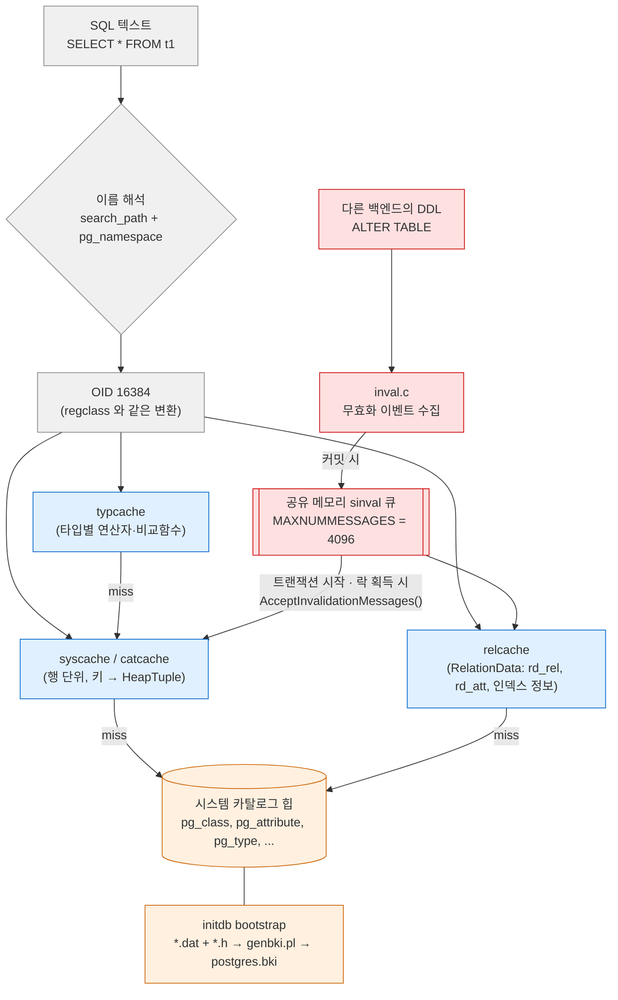
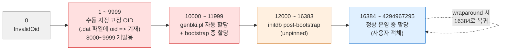
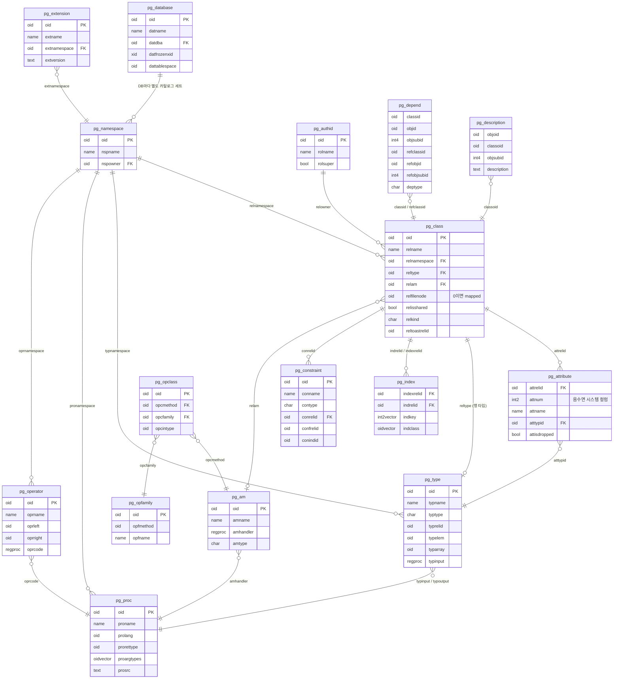
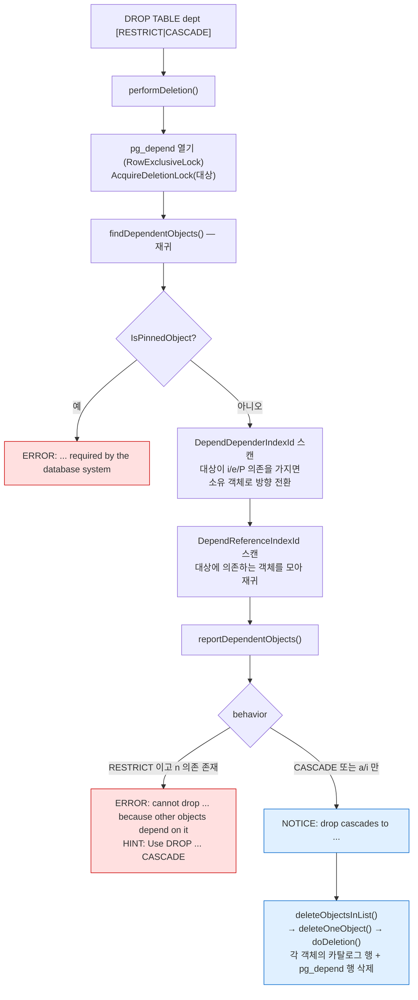
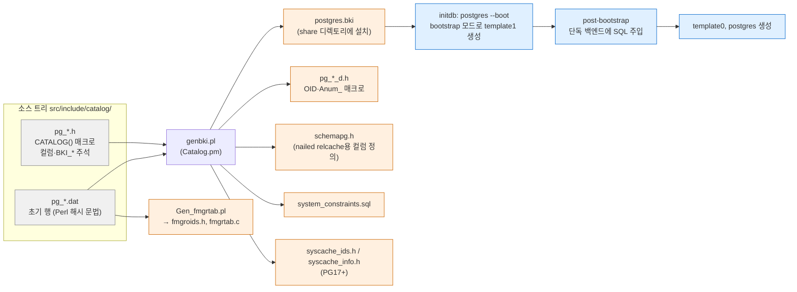
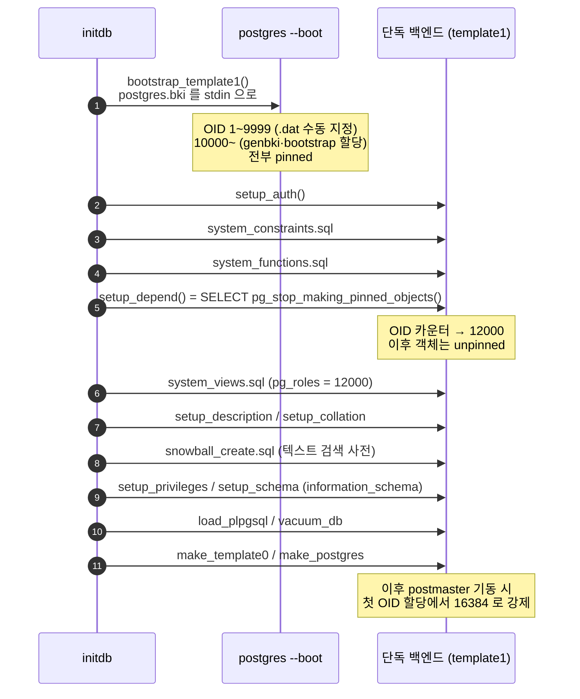
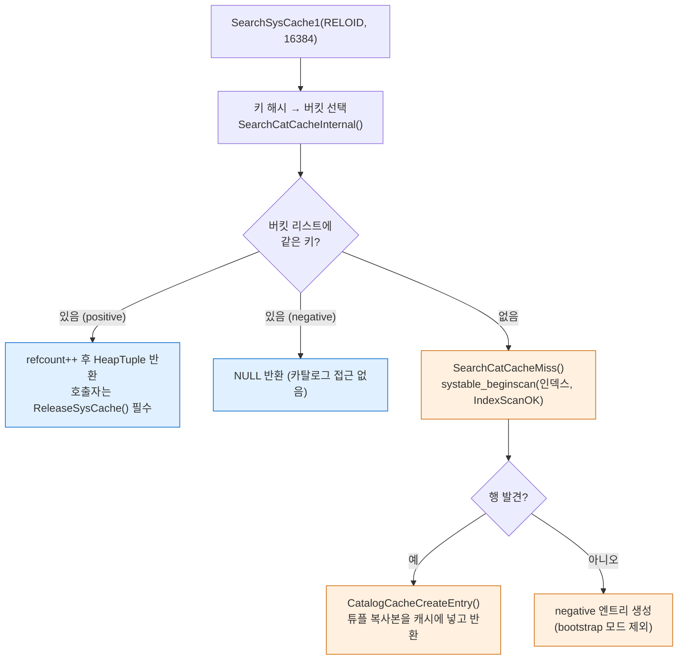
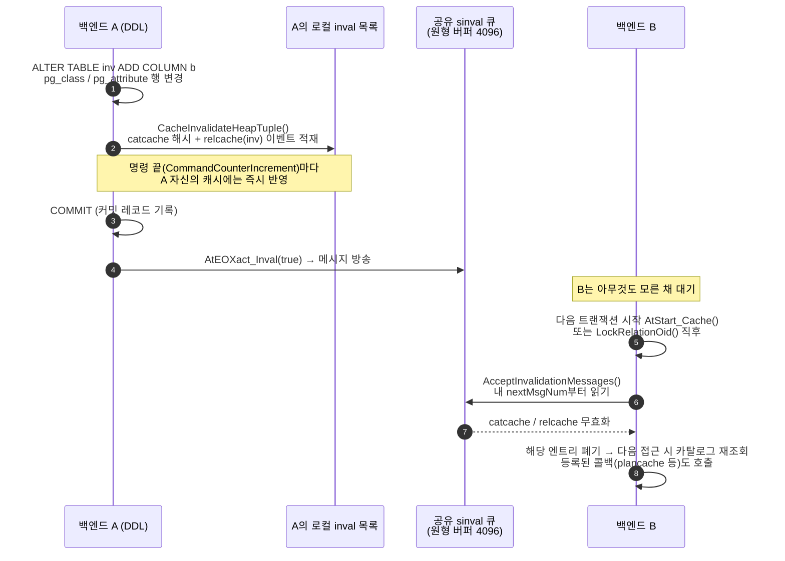

> **인덱스** [[PostgreSQL/INTERNALS/00-INDEX|내부 구조 분석서]]  ·  **이전** [[PostgreSQL/INTERNALS/05-QUERY-PIPELINE|05. 쿼리 처리 파이프라인]]  ·  **다음** [[PostgreSQL/INTERNALS/07-FUNCTION-MANAGER|07. 함수 실행 구조 (fmgr)]]

# 06. 시스템 카탈로그와 OID

PostgreSQL은 테이블·타입·함수·연산자·인덱스 방식까지 **모든 메타데이터를 평범한 힙 테이블(시스템 카탈로그)에 저장**하고,
각 행을 32비트 정수 **OID**로 식별한다. 이 문서는 카탈로그가 자기 자신을 기술하는 구조, OID의 정의·할당 구간·wraparound,
reg* 별칭 타입, 시스템 컬럼, `pg_depend` 기반 의존성 추적, `.dat` → `postgres.bki` → initdb로 이어지는 bootstrap,
그리고 매 쿼리마다 카탈로그를 디스크에서 읽지 않게 해 주는 syscache·relcache·무효화(sinval) 계층을 **내부 구현** 관점에서 다룬다.

근거는 로컬 PostgreSQL 18.4 서버 헤더(`$(pg_config --includedir-server)`), REL_18_STABLE 소스, 임시 클러스터 실증(§10)이다.
권한 관련 카탈로그(`pg_authid`, `pg_auth_members`, ACL 컬럼)는 [[PostgreSQL/15-AUTHORITY|15. 권한 체계]] §2에서 다루므로 여기서는 링크만 둔다.

## 0. 전체 지도

SQL에 쓴 이름은 파서·분석기 단계에서 OID로 바뀌고, 이후 모든 내부 처리는 OID로 진행된다. 그 OID로 카탈로그 행을 찾을 때는
힙을 직접 스캔하지 않고 백엔드 로컬 캐시를 먼저 본다. 캐시는 다른 백엔드의 DDL을 공유 무효화 큐로 통보받아 버린다.



| 층위 | 핵심 구성요소 | 소스 위치 | 이 문서 절 |
|---|---|---|---|
| 데이터 | 시스템 카탈로그 64개 (PG18.4 `CATALOG()` 선언 수) | `src/include/catalog/pg_*.h` | §1, §3 |
| 식별자 | OID (`typedef unsigned int Oid`) | `postgres_ext.h`, `access/transam.h` | §2 |
| 이름↔OID | reg* 별칭 타입, `namespace.c` | `utils/adt/regproc.c` | §4 |
| 행 메타 | 시스템 컬럼 (attnum < 0) | `access/sysattr.h` | §5 |
| 관계 | `pg_depend`, `pg_shdepend` | `catalog/dependency.c` | §6 |
| 생성 | `.dat` → `postgres.bki` → bootstrap 모드 | `genbki.pl`, `bootparse.y`, `initdb.c` | §7 |
| 캐시 | catcache/syscache, relcache, typcache, sinval | `utils/cache/*.c`, `storage/ipc/sinvaladt.c` | §8 |

---

## 1. 카탈로그도 테이블이다 — 자기 기술적(self-describing) 설계

### 1.1 pg_class가 pg_class를 기술한다

PostgreSQL은 **카탈로그를 사용자 테이블과 같은 방식으로 저장하고 SQL로 질의**한다.
그래서 "테이블 목록을 담는 테이블"(`pg_class`)이 자기 자신에 대한 행을 갖고, "컬럼 목록을 담는 테이블"(`pg_attribute`)이
자기 자신의 컬럼까지 기술한다. (이 설계가 POSTGRES 초기 설계 문서에서 어떻게 정당화되었는지는 이번에 원전을 확인하지 않았다 — 역사는 [[PostgreSQL/INTERNALS/01-ORIGIN-PHILOSOPHY|01]] 참고)

```sql
SELECT oid, relname, relnamespace::regnamespace, relkind, relisshared,
       relfilenode, pg_relation_filepath(oid)
  FROM pg_class
 WHERE relname IN ('pg_class','pg_attribute','pg_type','pg_proc',
                   'pg_database','pg_authid','pg_namespace')
 ORDER BY oid;
```

```text
 oid  |   relname    | relnamespace | relkind | relisshared | relfilenode | pg_relation_filepath
------+--------------+--------------+---------+-------------+-------------+----------------------
 1247 | pg_type      | pg_catalog   | r       | f           |           0 | base/5/1247
 1249 | pg_attribute | pg_catalog   | r       | f           |           0 | base/5/1249
 1255 | pg_proc      | pg_catalog   | r       | f           |           0 | base/5/1255
 1259 | pg_class     | pg_catalog   | r       | f           |           0 | base/5/1259
 1260 | pg_authid    | pg_catalog   | r       | t           |           0 | global/1260
 1262 | pg_database  | pg_catalog   | r       | t           |           0 | global/1262
 2615 | pg_namespace | pg_catalog   | r       | f           |        2615 | base/5/2615
```

- `pg_class`의 OID는 **1259** — `pg_class` 안의 한 행이 `pg_class` 자신이다.
- `relkind = 'r'` — 카탈로그도 일반 테이블과 같은 relkind를 갖는다.
- 파일 경로도 일반 테이블과 동일한 `base/<dboid>/<filenode>` 규칙([[PostgreSQL/INTERNALS/03-STORAGE|03. 물리 저장 구조]]).

`pg_attribute`에서 `pg_class`의 컬럼을 조회하면 시스템 컬럼(음수 attnum)과 일반 컬럼 `oid`, `relname`…이 나온다.

```text
 attrelid | attnum |   attname    | atttypid
----------+--------+--------------+----------
 pg_class |     -6 | tableoid     | oid
 pg_class |     -5 | cmax         | cid
 pg_class |     -4 | xmax         | xid
 pg_class |     -3 | cmin         | cid
 pg_class |     -2 | xmin         | xid
 pg_class |     -1 | ctid         | tid
 pg_class |      1 | oid          | oid
 pg_class |      2 | relname      | name
 pg_class |      3 | relnamespace | oid
 pg_class |      4 | reltype      | oid
```

`pg_class` 행 하나하나가 복합 타입이기도 하다. `pg_type`에 `typname = 'pg_class'`, `oid = 83`, `typrelid = pg_class`인
행이 있다(실증 V1). 이 83이 아래 `CATALOG()` 매크로의 `BKI_ROWTYPE_OID(83, …)` 값이다.

### 1.2 C 구조체와 카탈로그 행은 같은 정의에서 나온다

카탈로그 스키마의 정본은 `src/include/catalog/pg_*.h` 헤더다. 18.4 `catalog/pg_class.h` 발췌:

```c
CATALOG(pg_class,1259,RelationRelationId) BKI_BOOTSTRAP BKI_ROWTYPE_OID(83,RelationRelation_Rowtype_Id) BKI_SCHEMA_MACRO
{
	/* oid */
	Oid			oid;

	/* class name */
	NameData	relname;

	/* OID of namespace containing this class */
	Oid			relnamespace BKI_DEFAULT(pg_catalog) BKI_LOOKUP(pg_namespace);
	...
	/* identifier of physical storage file */
	/* relfilenode == 0 means it is a "mapped" relation, see relmapper.c */
	Oid			relfilenode BKI_DEFAULT(0);
```

`catalog/genbki.h`가 이 매크로들을 C 컴파일러용으로 정의한다.

```c
#define CATALOG(name,oid,oidmacro)	typedef struct CppConcat(FormData_,name)
#define BKI_BOOTSTRAP
#define BKI_SHARED_RELATION
#define BKI_ROWTYPE_OID(oid,oidmacro)
#define BKI_DEFAULT(value)
#define BKI_LOOKUP(catalog)
```

같은 헤더를 두 갈래로 읽는다.

| 읽는 주체 | 해석 결과 | 용도 |
|---|---|---|
| C 컴파일러 | `typedef struct FormData_pg_class {...}`, `Form_pg_class` 포인터 타입. `BKI_*`는 빈 매크로 | 백엔드 코드가 `HeapTuple`을 `(Form_pg_class) GETSTRUCT(tup)`로 캐스팅해 필드 접근 |
| `genbki.pl` (Perl, `Catalog.pm`) | 카탈로그 이름·OID·컬럼·기본값·조회 규칙(`BKI_LOOKUP`) | `postgres.bki`, `pg_*_d.h`, `schemapg.h`, `syscache_ids.h` 등 생성 (§7) |

즉 **디스크의 카탈로그 행 레이아웃 = C 구조체 레이아웃**이다. 그래서 고정 길이 컬럼은 구조체 필드로 바로 읽고,
가변 길이 컬럼(`relacl`, `reloptions` 등)은 `#ifdef CATALOG_VARLEN` 뒤에 두어 C 구조체에서 제외한다.

### 1.3 닭과 달걀 — bootstrap 카탈로그 4개와 mapped relation

`pg_class`를 읽으려면 `pg_class`의 relcache 항목(파일 위치, 튜플 디스크립터)이 있어야 하는데, 그 정보는 `pg_class`·`pg_attribute`에 있다.
이 순환을 끊는 장치가 세 겹 있다.

| 장치 | 내용 | 근거 |
|---|---|---|
| `BKI_BOOTSTRAP` 카탈로그 | `pg_type`(1247), `pg_attribute`(1249), `pg_proc`(1255), `pg_class`(1259) 4개. `pg_class.dat`에는 이 4개 행만 있다 | `pg_*.h`의 `CATALOG(...) BKI_BOOTSTRAP` grep 결과, `pg_class.dat` 주석 |
| relcache 하드코딩(nailed) | `relcache.c`의 `formrdesc()`가 공유 5개(`pg_database`, `pg_authid`, `pg_auth_members`, `pg_shseclabel`, `pg_subscription`)와 DB별 4개(`pg_class`, `pg_attribute`, `pg_proc`, `pg_type`)의 relcache 항목을 카탈로그 조회 없이 만든다. `rd_isnailed = true` | `relcache.c` `formrdesc(` 호출부 |
| relmapper | `pg_class` 자신의 `relfilenode`를 `pg_class`에 기록할 수 없으므로 **`relfilenode = 0`** 으로 두고, 실제 파일 번호는 `pg_filenode.map` 파일에 기록 | `relmapper.c` 헤더 주석, `#define RELMAPPER_FILENAME "pg_filenode.map"`, `MAX_MAPPINGS 64` |

`relmapper.c` 주석 요지 — `pg_class` 및 다른 "nailed" 카탈로그, 그리고 공유 카탈로그(다른 DB의 `pg_class`를 갱신할 방법이 없음)는
"mapped catalog"이며, DB별 맵 파일과 공유 맵 파일이 따로 있다. mapped 카탈로그의 재배치는 맵 파일 갱신이 곧 커밋이므로
`VACUUM FULL`·`CLUSTER`처럼 트랜잭션적으로 의미 있는 변경이 없는 작업만 허용된다.

실증(V3): `VACUUM FULL`을 하면 일반 카탈로그 `pg_namespace`는 `relfilenode` 컬럼이 바뀌지만, mapped인 `pg_class`는 `0`으로 남고
`pg_relation_filenode()`(맵 파일을 따라감)만 바뀐다.

```text
   relname    | relfilenode | pg_relation_filenode | pg_relation_filepath
--------------+-------------+----------------------+----------------------
 pg_class     |           0 |                16454 | base/5/16454
 pg_namespace |       16460 |                16460 | base/5/16460
```

`PGDATA/global/`과 `PGDATA/base/<db>/` 양쪽에 `pg_filenode.map`과 `pg_internal.init`(relcache 초기화 파일, §8.3)이 있는 것도 확인했다.
mapped 관계 수는 이 클러스터의 `postgres` DB에서 `relfilenode = 0`인 r/i/t가 63개였다.

---

## 2. OID — 정의·할당·범위·wraparound

### 2.1 정의

`postgres_ext.h` (클라이언트 libpq에도 공개되는 헤더):

```c
/*
 * Object ID is a fundamental type in Postgres.
 */
typedef unsigned int Oid;

#ifdef __cplusplus
#define InvalidOid		(Oid(0))
#else
#define InvalidOid		((Oid) 0)
#endif

#define OID_MAX  UINT_MAX
```

- **부호 없는 32비트**(현 플랫폼의 `unsigned int`). 최댓값 `OID_MAX = UINT_MAX` = 4294967295 — 실증 V5에서 실제로 이 값까지 할당됨.
- `0`은 `InvalidOid` — "없음"을 뜻하는 센티널. `pg_class.reltoastrelid = 0`(TOAST 없음), `0::regclass`가 `-`로 출력되는 것이 이 값이다.
- SQL 타입 `oid`는 이 C 타입을 그대로 노출한다. `pg_type.dat`에서 `{ oid => '26', array_type_oid => '1028', descr => 'object identifier(oid), maximum 4 billion', typname => 'oid', typlen => '4', typbyval => 't', ... }` —
  타입 `oid` 자신의 OID가 26이다. 공식 문서는 "unsigned four-byte integer"이며 큰 DB에서 DB 전역 유일성을 제공하기엔 부족하다고 명시한다.

### 2.2 할당 구간 — `access/transam.h`

18.4 헤더 원문(핵심부):

```c
/* ----------
 *		Object ID (OID) zero is InvalidOid.
 *
 *		OIDs 1-9999 are reserved for manual assignment (see .dat files in
 *		src/include/catalog/).  Of these, 8000-9999 are reserved for
 *		development purposes (such as in-progress patches and forks);
 *		they should not appear in released versions.
 *
 *		OIDs 10000-11999 are reserved for assignment by genbki.pl, for use
 *		when the .dat files in src/include/catalog/ do not specify an OID
 *		for a catalog entry that requires one.  Note that genbki.pl assigns
 *		these OIDs independently in each catalog, so they're not guaranteed
 *		to be globally unique.  ...
 *
 *		OIDs 12000-16383 are reserved for unpinned objects created by initdb's
 *		post-bootstrap processing.  initdb forces the OID generator up to
 *		12000 as soon as it's made the pinned objects it's responsible for.
 *
 *		OIDs beginning at 16384 are assigned from the OID generator
 *		during normal multiuser operation.  (We force the generator up to
 *		16384 as soon as we are in normal operation.)
 * ...
 * NOTE: if the OID generator wraps around, we skip over OIDs 0-16383
 * and resume with 16384.
 * ----------
 */
#define FirstGenbkiObjectId		10000
#define FirstUnpinnedObjectId	12000
#define FirstNormalObjectId		16384
```



| 구간 | 상수 경계 | 누가 할당 | pinned 여부 | 18.4 실증에서 본 예 |
|---|---|---|---|---|
| 0 | `InvalidOid` | — | — | `0::regclass` → `-` |
| 1–9999 | `< FirstGenbkiObjectId` | 개발자가 `.dat`에 직접 기재 | pinned | `pg_class` 1259, `int4` 23, `now()` 1299, `pg_catalog` 11, `public` 2200 |
| 10000–11999 | `FirstGenbkiObjectId` ~ | `genbki.pl`(카탈로그별 독립 카운터), bootstrap 백엔드 | pinned | `pg_type`의 `_pg_attrdef`(10000), `pg_attrdef`(10001) 등 카탈로그 rowtype·배열 타입 115개 |
| 12000–16383 | `FirstUnpinnedObjectId` ~ | initdb post-bootstrap 단계(SQL 스크립트 실행) | **unpinned** | `pg_roles` 뷰 12000, `pg_stat_activity` 12226, `information_schema` 스키마 13699, 콜레이션 1279개 |
| 16384– | `FirstNormalObjectId` ~ | 정상 운영 OID 생성기 | unpinned | 첫 사용자 테이블 `t1` = 16384 |

PG14까지는 12000 경계 상수 이름이 `FirstBootstrapObjectId`였고, PG15에서 `FirstUnpinnedObjectId`로 바뀌었다
(REL_14_STABLE / REL_15_STABLE `transam.h` 비교로 확인). 이름 변경은 §2.8의 "pinned 판정을 OID 범위로 대체"와 같은 맥락이다.

실증(V2) — 신규 클러스터의 OID 구간별 분포:

```text
                  band                  | pg_class | pg_proc | pg_type | pg_namespace
----------------------------------------+----------+---------+---------+--------------
 1: 0-9999 (manual)                     |      258 |    3397 |     198 |            3
 2: 10000-11999 (genbki)                |        0 |       0 |     115 |            0
 3: 12000-16383 (initdb post-bootstrap) |      157 |      16 |     308 |            1
 4: >=16384 (normal)                    |        4 |       0 |       2 |            0
```

내장 함수 3397개가 전부 수동 지정 구간에 있다는 점이 중요하다. `fmgroids.h`의 `F_*` 상수가 컴파일 타임에 고정되는 근거이며,
[[PostgreSQL/INTERNALS/07-FUNCTION-MANAGER|07. 함수 실행 구조]]의 `fmgr_builtins` 테이블이 OID로 C 함수를 바로 찾는 것도 이 덕분이다.

### 2.3 OID 생성기 — `GetNewObjectId()`와 8192개 선할당

OID 카운터 상태는 공유 메모리 `TransamVariablesData`(XID 카운터와 같은 구조체)에 있다 (`access/transam.h`):

```c
typedef struct TransamVariablesData
{
	/*
	 * These fields are protected by OidGenLock.
	 */
	Oid			nextOid;		/* next OID to assign */
	uint32		oidCount;		/* OIDs available before must do XLOG work */
	...
```

`src/backend/access/transam/varsup.c`의 `GetNewObjectId()` 흐름(REL_18_STABLE 원문 요약):

```c
#define VAR_OID_PREFETCH		8192

Oid
GetNewObjectId(void)
{
	if (RecoveryInProgress())
		elog(ERROR, "cannot assign OIDs during recovery");

	LWLockAcquire(OidGenLock, LW_EXCLUSIVE);

	if (TransamVariables->nextOid < ((Oid) FirstNormalObjectId))
	{
		if (IsPostmasterEnvironment)
		{
			/* wraparound, or first post-initdb assignment, in normal mode */
			TransamVariables->nextOid = FirstNormalObjectId;
			TransamVariables->oidCount = 0;
		}
		else { /* bootstrap/단독 모드: FirstGenbkiObjectId 미만일 때만 보정 */ }
	}

	/* If we run out of logged for use oids then we must log more */
	if (TransamVariables->oidCount == 0)
	{
		XLogPutNextOid(TransamVariables->nextOid + VAR_OID_PREFETCH);
		TransamVariables->oidCount = VAR_OID_PREFETCH;
	}

	result = TransamVariables->nextOid;
	(TransamVariables->nextOid)++;
	(TransamVariables->oidCount)--;

	LWLockRelease(OidGenLock);
	return result;
}
```

| 포인트 | 의미 |
|---|---|
| `OidGenLock` | 클러스터 전체에서 하나뿐인 LWLock으로 직렬화. OID 할당은 매우 짧은 임계구역 |
| `RecoveryInProgress()` 검사 | 핫 스탠바이에서는 OID를 만들 수 없음 → 스탠바이에서 DDL 불가의 한 이유 |
| `nextOid < 16384`이면 16384로 | initdb 후 첫 할당과 wraparound를 **같은 코드**가 처리 |
| `VAR_OID_PREFETCH = 8192` | 8192개마다 한 번만 `XLOG_NEXTOID` WAL 레코드를 쓴다. 매 OID마다 WAL을 쓰지 않기 위한 배치 |

`xlog.c`의 체크포인트 생성 코드는 `checkPoint.nextOid = nextOid; if (!shutdown) checkPoint.nextOid += oidCount;` 이다.
즉 온라인 체크포인트는 "이미 WAL로 예약해 둔 끝"을 기록한다. 실증(V2):

```text
-- initdb 직후 (마지막 체크포인트는 initdb 종료 시점)
 next_oid
----------
    14062
-- 첫 테이블 t1 생성 → OID 16384 (14062가 아니라 16384로 강제 상승)
-- CHECKPOINT 후
 next_oid
----------
    24576            ← 16384 + 8192
```

`pg_controldata`의 `Latest checkpoint's NextOID: 24576`도 같은 값이다. 이 구조에서 유도되는 결과: 크래시 후 복구된 카운터는
WAL에 예약된 끝 값부터 시작하므로, 크래시 직전 예약했으나 쓰지 않은 OID(최대 8192개)는 건너뛰게 된다(코드에서 유도한 추론).

`CREATE TABLE t1(id int primary key, v text)` 한 문장이 소비한 OID (V2):

```text
      cat      |  oid  |         name
---------------+-------+----------------------
 pg_class      | 16384 | t1
 pg_type       | 16385 | _t1               ← 배열 타입
 pg_type       | 16386 | t1                ← 행(복합) 타입
 pg_constraint | 16387 | t1_id_not_null    ← PG18: NOT NULL도 pg_constraint 행
 pg_class      | 16388 | pg_toast_16384
 pg_class      | 16389 | pg_toast_16384_index
 pg_class      | 16390 | t1_pkey
 pg_constraint | 16391 | t1_pkey
```

PG18 릴리스 노트: "Store column NOT NULL specifications in pg_constraint" — 그래서 `t1_id_not_null`이 OID를 하나 더 쓴다.

### 2.4 카운터는 클러스터 전역 하나

`TransamVariables`는 공유 메모리에 하나뿐이므로 **모든 DB가 같은 OID 카운터를 나눠 쓴다**. 실증(V4):

```text
postgres DB  : CREATE DATABASE d2         → d2.oid      = 16444
d2 DB        : CREATE TABLE only_in_d2    → oid         = 16445
postgres DB  : CREATE TABLE after_d2      → oid         = 16448
d2 DB        : CREATE TABLE d2_second     → oid         = 16451
```

DB가 달라도 번호가 이어진다. 다만 "전역 카운터"가 "전역 유일"을 뜻하지는 않는다 — 유일성은 각 카탈로그의 OID 유니크 인덱스가 보장하며,
wraparound 이후에는 카탈로그가 다르면 같은 OID가 공존한다(§2.5).

### 2.5 wraparound — `GetNewOidWithIndex()`로 충돌 회피

32비트 카운터는 언젠가 한 바퀴 돈다. PostgreSQL의 전략은 "다시 16384부터 돌되, **넣으려는 카탈로그에 이미 그 OID가 있으면 다음 값**"이다.
`src/backend/catalog/catalog.c`:

```c
Oid
GetNewOidWithIndex(Relation relation, Oid indexId, AttrNumber oidcolumn)
{
	...
	/* In bootstrap mode, we don't have any indexes to use */
	if (IsBootstrapProcessingMode())
		return GetNewObjectId();
	...
	/* Generate new OIDs until we find one not in the table */
	do
	{
		CHECK_FOR_INTERRUPTS();

		newOid = GetNewObjectId();

		ScanKeyInit(&key, oidcolumn, BTEqualStrategyNumber, F_OIDEQ,
					ObjectIdGetDatum(newOid));

		/* see notes above about using SnapshotAny */
		scan = systable_beginscan(relation, indexId, true,
								  SnapshotAny, 1, &key);

		collides = HeapTupleIsValid(systable_getnext(scan));
		systable_endscan(scan);
		...
	} while (collides);
```

| 설계 결정 | 이유 (소스 주석 요지) |
|---|---|
| 유니크 인덱스 탐침 | 카탈로그 행 수가 2^32보다 훨씬 작고 연속 점유 구간이 길지 않다고 가정 → 평균 몇 번이면 빈 값 발견 |
| `SnapshotAny` | 커밋 전·최근 삭제 행도 "점유"로 본다. 예전엔 SnapshotDirty였으나 최근 삭제 행을 놓쳐 일시 충돌 위험이 있었음 |
| 경쟁 조건 허용 | 탐침과 삽입 사이에 누군가 2^32개를 돌아 같은 값을 만들 확률은 무시 |
| 로그 | `GETNEWOID_LOG_THRESHOLD 1000000`회 재시도마다 `still searching for an unused OID in relation ...` LOG (간격은 지수 증가, 상한 `GETNEWOID_LOG_MAX_INTERVAL 128000000`). PG14부터 있는 코드 (REL_13/REL_14 비교) |

**relation OID는 한 번 더 검사한다.** `GetNewRelFileNumber()`는 `pg_class`에서의 유일성(`GetNewOidWithIndex(pg_class, ClassOidIndexId, ...)`)뿐 아니라
같은 이름의 **물리 파일이 이미 있는지** `access(rpath, F_OK)`로 확인한다. 새 relation의 OID가 곧 초기 relfilenode이기 때문이다.

**실증(V5) — 실제 wraparound 재현.** 전용 임시 클러스터를 내리고 `pg_resetwal -o 4294967290`으로 NextOID를 끝 근처로 옮긴 뒤 테이블 3개 생성:

```text
   cat    |    oid     | relname
----------+------------+---------
 pg_class | 4294967290 | w1
 pg_type  | 4294967291 | _w1
 pg_type  | 4294967292 | w1
 pg_class | 4294967293 | w2
 pg_type  | 4294967294 | _w2
 pg_type  | 4294967295 | w2         ← OID_MAX
 pg_class |      16385 | w3         ← 16384는 pg_class에 t1이 있어 건너뜀
 pg_type  |      16387 | _w3        ← 16386은 pg_type에 t1 행타입이 있어 건너뜀
 pg_type  |      16388 | w3
```

16384~16400 구간을 카탈로그별로 보면 같은 숫자가 여러 카탈로그에 공존한다.

```text
  oid  |      cat      |       relname
-------+---------------+----------------------
 16385 | pg_type       | _t1
 16385 | pg_class      | w3
 16387 | pg_constraint | t1_id_not_null
 16387 | pg_type       | _w3
 16388 | pg_class      | pg_toast_16384
 16388 | pg_type       | w3
```

결론: **OID는 "카탈로그 안에서" 유일**하다. 객체를 전역적으로 식별하려면 `(classid, objid)` 쌍이 필요하고,
그래서 `pg_depend`·`pg_description`·`pg_identify_object()`가 모두 카탈로그 OID와 객체 OID를 함께 받는다(§6).

> 이 실증은 반드시 버려도 되는 클러스터에서만 한다. `pg_resetwal`은 운영 클러스터에 쓰는 도구가 아니다.

### 2.6 OID를 쓰는 비카탈로그 소비자 — TOAST

`src/backend/access/common/toast_internals.c`도 `GetNewOidWithIndex(toastrel, ...)`를 호출한다. TOAST로 밀려난 값마다
`chunk_id`로 OID를 하나씩 받기 때문이다([[PostgreSQL/INTERNALS/03-STORAGE|03. 물리 저장 구조]]의 TOAST 절).
카운터는 클러스터 공유이므로, TOAST 값이 매우 많은 워크로드는 카탈로그 OID 소비 속도를 끌어올리고, 한 TOAST 테이블에 OID가 조밀하게 차면
위 재시도 루프가 길어진다. 앞 절의 `still searching for an unused OID` 로그가 그 신호다. (TOAST 테이블당 2^32 값 한계와 그 실측 영향은 이번에 실증하지 않음 — 확인 필요)

### 2.7 사용자 테이블의 OID 컬럼 — PG12에서 제거

옛 PostgreSQL은 `CREATE TABLE ... WITH OIDS`로 사용자 테이블 행마다 숨은 `oid` 시스템 컬럼을 붙일 수 있었다.
PG12 릴리스 노트: "Remove the special behavior of oid columns" — `WITH OIDS` 지정 기능이 제거되었고,
숨은 `oid` 컬럼을 가졌던 시스템 카탈로그는 **일반 `oid` 컬럼**을 갖게 되어 `SELECT *`에도 나온다.

- 튜플 헤더에는 흔적만 남았다: `access/htup_details.h`의 `#define HEAP_HASOID_OLD 0x0008`.
- 18.4 실증(V13): `WITH OIDS` → `syntax error at or near "oids"`, `WITH (oids=false)`는 허용(호환용), 사용자가 `oid`라는 이름의 일반 컬럼을 만드는 것도 허용(attnum 1).
- 카탈로그의 `oid`는 attnum 1인 평범한 컬럼이고, 각 카탈로그가 `xxx_oid_index` 유니크 인덱스(18.4에서는 `system_constraints.sql`이 PRIMARY KEY로 승격)를 갖는다.

### 2.8 pinned 객체 — OID 범위로 판정 (PG15+)

`DROP TYPE int4`가 거부되는 이유는 "시스템이 의존한다(pinned)"이기 때문이다. PG14까지는 `pg_depend`에 `deptype = 'p'`(DEPENDENCY_PIN) 행을
initdb가 수천 개 넣어 표시했다(PG14 문서). PG15부터는 이 행이 없고 `catalog.c`의 `IsPinnedObject()`가 OID 범위로 판정한다.

```c
bool
IsPinnedObject(Oid classId, Oid objectId)
{
	/*
	 * Objects with OIDs above FirstUnpinnedObjectId are never pinned.  Since
	 * the OID generator skips this range when wrapping around, this check
	 * guarantees that user-defined objects are never considered pinned.
	 */
	if (objectId >= FirstUnpinnedObjectId)
		return false;

	/* Large objects are never pinned. ... */
	if (classId == LargeObjectRelationId)
		return false;

	/* the public namespace is not pinned */
	if (classId == NamespaceRelationId &&
		objectId == PG_PUBLIC_NAMESPACE)
		return false;

	/* Databases are never pinned. ... template0 and template1 can be rebuilt
	 * from each other ... */
	if (classId == DatabaseRelationId)
		return false;
	...
	return true;
}
```

wraparound가 0~16383을 건너뛰는 이유가 여기서 완성된다 — 사용자 객체가 12000 미만 OID를 받으면 pinned로 오판된다.

initdb는 pinned 객체를 다 만든 뒤 `SELECT pg_stop_making_pinned_objects();`(→ `StopGeneratingPinnedObjectIds()` → `SetNextObjectId(FirstUnpinnedObjectId)`)로
카운터를 12000으로 올린다. 그 다음 실행되는 `system_views.sql`의 첫 뷰 `pg_roles`가 정확히 **OID 12000**이다(V2).

실증(V6):

```text
DROP TYPE int4;                       → ERROR: cannot drop type integer because it is required by the database system
DROP FUNCTION pg_catalog.now();       → ERROR: cannot drop function now() because it is required by the database system
DROP TABLE pg_catalog.pg_class;       → ERROR: permission denied: "pg_class" is a system catalog
BEGIN; DROP VIEW pg_catalog.pg_roles; → DROP VIEW  (OID 12000, unpinned → 슈퍼유저는 삭제 가능) ; ROLLBACK
BEGIN; DROP SCHEMA information_schema CASCADE; → NOTICE: drop cascades to 85 other objects ; ROLLBACK
SELECT count(*) FROM pg_depend WHERE deptype = 'p';  → 0
SELECT pg_stop_making_pinned_objects();  → ERROR: cannot advance OID counter anymore
```

`pg_class` 삭제 거부는 pinned 검사가 아니라 `tablecmds.c`의 `if (... !allowSystemTableMods && IsSystemClass(relOid, classform))` 검사에서 나온 메시지다
(GUC `allow_system_table_mods`).

---

## 3. 주요 카탈로그 지도

### 3.1 관계도

컬럼명은 18.4 `pg_attribute` 조회 결과에서 발췌했다(전체 컬럼이 아니라 관계 이해에 필요한 것만).



### 3.2 요약표

| 카탈로그 | OID | 공유 | 담는 것 | 내부적으로 중요한 점 |
|---|---|---|---|---|
| `pg_database` | 1262 | ✅ | DB 목록 | `datfrozenxid`(XID wraparound 추적, [[PostgreSQL/INTERNALS/04-MVCC-WAL|04]]). nailed relcache |
| `pg_authid` | 1260 | ✅ | 롤 | [[PostgreSQL/15-AUTHORITY|15. 권한 체계]] §2 |
| `pg_tablespace` | 1213 | ✅ | 테이블스페이스 | |
| `pg_shdepend` | 1214 | ✅ | 공유 객체(롤·테이블스페이스)에 대한 의존 | §6.3 |
| `pg_namespace` | 2615 | | 스키마 | `pg_catalog` 11, `pg_toast` 99, `public` 2200 고정 |
| `pg_class` | 1259 | | relation(테이블·인덱스·뷰·시퀀스·TOAST·복합타입·FDW 테이블·파티션 부모) | bootstrap, mapped |
| `pg_attribute` | 1249 | | 컬럼(시스템 컬럼 포함) | bootstrap, mapped. 테이블당 행 수 = 일반 컬럼 + 6 |
| `pg_type` | 1247 | | 타입 | bootstrap. 테이블마다 행 타입·배열 타입 2행 생성 |
| `pg_proc` | 1255 | | 함수·프로시저·집계 | bootstrap. [[PostgreSQL/INTERNALS/07-FUNCTION-MANAGER|07]]의 출발점 |
| `pg_index` | — | | 인덱스 부가 정보 | `pg_class`에도 relkind `i` 행이 있고, 여기엔 키 컬럼·opclass·상태 플래그 |
| `pg_constraint` | — | | PK/UK/FK/CHECK/EXCLUDE/**NOT NULL**(PG18+) | |
| `pg_depend` | 2608 | | 객체 간 의존 | §6 |
| `pg_description` | — | | `COMMENT ON` | 키 = `(objoid, classoid, objsubid)` |
| `pg_am` | — | | 접근 방식(heap, btree, hash, gist, gin, spgist, brin …) | `amhandler`가 C 핸들러 함수를 가리킴 |
| `pg_operator` / `pg_opclass` / `pg_opfamily` / `pg_amop` / `pg_amproc` | — | | 연산자와 인덱스 지원 체계 | [[PostgreSQL/INTERNALS/09-FEATURES-EXTENSIBILITY|09]] 확장성 |
| `pg_extension` | — | | 설치된 확장 | 확장 멤버는 `pg_depend`에 `deptype = 'e'` |

`—`는 이번에 OID를 직접 조회하지 않은 항목이다. 18.4에서 `CATALOG()` 매크로로 선언된 카탈로그는 64개, `postgres.bki`의 `create` 문도 64개였다.

### 3.3 공유 카탈로그 vs DB별 카탈로그

`CATALOG(...) BKI_SHARED_RELATION`으로 선언된 카탈로그는 클러스터에 **한 벌만** 존재하고 `PGDATA/global/` 아래에 저장된다.
18.4 헤더 grep 결과 11개이며, `catalog.c`의 `IsSharedRelation()`에 하드코딩된 목록과 같다(인덱스·TOAST까지 함께 나열됨).

실증(V7):

```text
 oid  |        relname        | pg_relation_filepath
------+-----------------------+----------------------
 1213 | pg_tablespace         | global/1213
 1214 | pg_shdepend           | global/1214
 1260 | pg_authid             | global/1260
 1261 | pg_auth_members       | global/1261
 1262 | pg_database           | global/1262
 2396 | pg_shdescription      | global/2396
 2964 | pg_db_role_setting    | global/2964
 3592 | pg_shseclabel         | global/3592
 6000 | pg_replication_origin | global/6000
 6100 | pg_subscription       | global/6100
 6243 | pg_parameter_acl      | global/6243

relkind별 relisshared: r 11, i 28, t 7
pg_catalog 스키마의 r: shared 11 / per-DB 53
```

| 구분 | 공유 카탈로그 | DB별 카탈로그 |
|---|---|---|
| 저장 위치 | `PGDATA/global/` | `PGDATA/base/<db oid>/` |
| `pg_class.relisshared` | `t` | `f` |
| 담는 객체 | DB를 넘나드는 객체: DB, 롤, 테이블스페이스, 구독, 복제 원점, 파라미터 ACL | 스키마 안의 모든 객체 |
| 다른 DB에서 보이나 | 어느 DB에 접속해도 같은 내용 (`d2`에서 본 `pg_database`도 4행 동일) | 접속한 DB 것만 (`d2`에서 `t1` 조회 0행) |
| 의존 기록 | `pg_shdepend` (DB OID 컬럼 `dbid` 포함) | `pg_depend` |
| 주석 | `pg_shdescription` | `pg_description` |
| sinval 메시지 | `dbId = 0` | `dbId = 해당 DB` |

`pg_class` 자체는 DB별이라 **공유 카탈로그의 `pg_class` 행이 DB마다 복제**되어 있다. 공유 카탈로그 파일을 옮길 때 모든 DB의 `pg_class`를 고칠 수 없으므로
공유 카탈로그는 전부 mapped(`global/pg_filenode.map`)다 — §1.3의 relmapper 주석 그대로.

### 3.4 카탈로그 간 FK는 "선언만" 있다

카탈로그에는 실제 FK 제약이 걸려 있지 않다(bootstrap 순서와 성능 때문). 대신 헤더의 `BKI_LOOKUP(...)`, `DECLARE_FOREIGN_KEY(...)` 선언을
genbki가 모아 `pg_get_catalog_foreign_keys()`로 노출한다. 18.4 결과(V8): 219개 관계, 배열 FK 19, 0 허용(`is_opt`) 83.

```text
 fktable  |     fkcols      |    pktable    | is_opt
----------+-----------------+---------------+--------
 pg_class | {relam}         | pg_am         | t
 pg_class | {relnamespace}  | pg_namespace  | f
 pg_class | {reloftype}     | pg_type       | t
 pg_class | {relowner}      | pg_authid     | f
 pg_class | {reltoastrelid} | pg_class      | t
 pg_class | {reltype}       | pg_type       | t
 ...
```

`is_opt = t`는 "0(InvalidOid)이면 참조 없음"을 허용한다는 뜻이며 헤더의 `BKI_LOOKUP_OPT`와 대응한다.

---

## 4. reg* 별칭 타입 — 이름과 OID 사이의 번역기

### 4.1 목록

reg* 타입은 저장 형태가 `oid`(4바이트)와 같고, **입출력 함수만 이름↔OID 변환**을 한다. 18.4 `pg_type` 조회(V9):

| 타입 | pg_type OID | 참조 카탈로그 | 입력 예 | 도입 |
|---|---|---|---|---|
| `regproc` | 24 | `pg_proc` | `now` (이름만, 오버로드 있으면 에러) | 초기부터 |
| `regprocedure` | 2202 | `pg_proc` | `abs(int4)` | |
| `regoper` | 2203 | `pg_operator` | `+` (오버로드 있으면 에러) | |
| `regoperator` | 2204 | `pg_operator` | `+(int4,int4)` | |
| `regclass` | 2205 | `pg_class` | `s1.t1` | |
| `regtype` | 2206 | `pg_type` | `integer`, `int4` | |
| `regconfig` | 3734 | `pg_ts_config` | `english` | |
| `regdictionary` | 3769 | `pg_ts_dict` | `simple` | |
| `regnamespace` | 4089 | `pg_namespace` | `pg_catalog` | PG9.5 (REL9_5 `pg_type.h`에 존재, REL9_4에 없음) |
| `regrole` | 4096 | `pg_authid` | `postgres` | PG9.5 (동일) |
| `regcollation` | 4191 | `pg_collation` | `"C"` | PG13 (REL_12 `pg_type.dat`에 없음, REL_13에 있음) |

`regprocedure`·`regoper` 등 "도입" 칸이 빈 것은 이번에 버전을 확인하지 않은 항목이다.

```sql
SELECT 'pg_class'::regclass::oid, 1259::regclass, 'int4'::regtype::oid, 'integer'::regtype,
       'now'::regproc, 'abs(int4)'::regprocedure::oid, '+(int4,int4)'::regoperator,
       'postgres'::regrole::oid, 'pg_catalog'::regnamespace::oid, 'english'::regconfig,
       '"C"'::regcollation::oid;
```

```text
 1259 | pg_class | 23 | integer | now | 1397 | +(integer,integer) | 10 | 11 | english | 950
```

`'pg_class'::regclass`는 문자열 → OID(1259), `1259::regclass`는 OID → 문자열. 내부적으로 `regclassin` / `regclassout` 함수 호출이다.

### 4.2 내부 구현 — `regclassin` / `regclassout`

`src/backend/utils/adt/regproc.c` (REL_18_STABLE):

```c
/* regclassin 핵심 흐름 */
	/* Handle "-" or numeric OID */
	if (parseDashOrOid(class_name_or_oid, &result, escontext))
		PG_RETURN_OID(result);
	...
	names = stringToQualifiedNameList(class_name_or_oid, escontext);
	...
	result = RangeVarGetRelid(makeRangeVarFromNameList(names), NoLock, true);
	if (!OidIsValid(result))
		ereturn(escontext, (Datum) 0, ... "relation \"%s\" does not exist" ...);
```

- 숫자나 `-`면 그대로 OID로 (`'-'` = 0).
- 아니면 식별자 규칙대로 파싱(따옴표 처리, `schema.name` 분리) → `RangeVarGetRelid()` — **일반 SQL에서 테이블 이름을 해석하는 바로 그 함수**다.
  따라서 스키마를 생략하면 `search_path`를 따른다.
- 출력 `regclassout`은 `SearchSysCache1(RELOID, ...)`로 행을 얻고 `RelationIsVisible(classid)`가 참이면 이름만, 거짓이면 `quote_qualified_identifier(nspname, classname)`로 스키마를 붙인다.

### 4.3 search_path에 따라 결과가 바뀐다 (V10)

`public.t1`(OID 16384)과 `s1.t1`(OID 16393)이 공존하는 상태:

```text
-- search_path = "$user", public
 t1_default | s1_t1 | s1_t1_text |  regclass
------------+-------+------------+------------
      16384 | 16393 | s1.t1      | s1.only_s1

-- SET search_path = s1, public
 t1_with_s1_first | public_t1_text | regclass
------------------+----------------+----------
            16393 | public.t1      | only_s1
```

- **입력**: 같은 문자열 `'t1'`이 search_path에 따라 16384 또는 16393.
- **출력**: 같은 OID 16393이 search_path에 보이면 `only_s1`, 안 보이면 `s1.only_s1`. 공식 문서도 "현재 search_path에서 한정 없이 찾을 수 없으면 스키마 한정 이름을 출력한다"고 명시한다.

그래서 DDL 스크립트나 SECURITY DEFINER 함수 안에서 `'name'::regclass`를 쓸 때는 스키마를 한정하거나 search_path를 고정해야 한다
([[PostgreSQL/15-AUTHORITY|15. 권한 체계]] §6의 search_path 탈취와 같은 원리, [[PostgreSQL/01-BASICS|01. 기본 문법]] §8).

### 4.4 캐스트 vs `to_reg*()` — 에러냐 NULL이냐 (V11)

```text
SELECT 'nosuch'::regclass;   → ERROR:  relation "nosuch" does not exist
SELECT 'abs'::regproc;       → ERROR:  more than one function named "abs"
SELECT to_regclass('nosuch') IS NULL;   → t
SELECT to_regproc('abs');               → (NULL)
SELECT to_regtype('int4');              → integer
SELECT to_regtypemod('varchar(10)');    → 14     -- PG17+ (REL_16 pg_proc.dat에 없음, REL_17에 있음)
SELECT 99999::regclass, 0::regclass;    → 99999 | -
```

18.4의 `to_regclass()` 구현은 별도 로직이 아니라 같은 `regclassin`을 **soft error 모드**로 호출하는 래퍼다:

```c
Datum
to_regclass(PG_FUNCTION_ARGS)
{
	char	   *class_name = text_to_cstring(PG_GETARG_TEXT_PP(0));
	Datum		result;
	ErrorSaveContext escontext = {T_ErrorSaveContext};

	if (!DirectInputFunctionCallSafe(regclassin, class_name,
									 InvalidOid, -1,
									 (Node *) &escontext,
									 &result))
		PG_RETURN_NULL();
	PG_RETURN_DATUM(result);
}
```

`ereturn(escontext, ...)`은 escontext가 주어지면 예외를 던지지 않고 실패를 돌려준다. 존재 확인용으로는 `to_regclass()`가 트랜잭션을 깨지 않아 안전하다
([[PostgreSQL/05-FUNCTIONS|05. 내장 함수]], [[PostgreSQL/14-TUNING|14. DB 튜닝]]의 `to_regclass` 사용 예).
또 `99999::regclass`처럼 **존재하지 않는 숫자 OID는 검증 없이 통과**하고 출력도 숫자 그대로라는 점에 주의.

### 4.5 저장된 표현식 안의 reg* 상수는 의존성이 된다 (V12)

뷰나 DEFAULT 표현식에 reg* 상수가 들어가면 **OID로 저장**되고 `pg_depend`에 의존이 기록된다(`dependency.c` `find_expr_references_walker()`의 `case REGCLASSOID:` 등).

```sql
CREATE VIEW v_reg AS SELECT 's1.only_s1'::regclass AS r, 's1.only_s1'::text AS t;
ALTER TABLE s1.only_s1 RENAME TO renamed;
SELECT r, r::oid, t FROM v_reg;
```

```text
     r      |   r   |     t
------------+-------+------------
 s1.renamed | 16396 | s1.only_s1       ← regclass는 rename을 따라가고, text는 옛 이름 그대로
```

```text
pg_get_viewdef('v_reg'):  SELECT 's1.renamed'::regclass AS r, 's1.only_s1'::text AS t;
DROP TABLE s1.renamed;  → ERROR: cannot drop table s1.renamed because other objects depend on it
                           DETAIL: view v_reg depends on table s1.renamed
```

`nextval('seq'::regclass)` DEFAULT는 시퀀스에 `n` 의존을 만들지만 `nextval('seq'::text)`는 만들지 않는다.
실증에서 `seqdemo.id`(regclass)만 `pg_depend`에 나타났다.

**예외 — `regrole`**: 롤은 공유 객체인데 `pg_depend`는 DB별이므로, `dependency.c`는 저장 표현식 안의 `regrole` 상수를 거부한다.

```text
CREATE VIEW v_role AS SELECT 'lowpriv'::regrole r;
ERROR:  constant of the type regrole cannot be used here
```

---

## 5. 시스템 컬럼

### 5.1 attnum 음수 — `access/sysattr.h`

```c
#define SelfItemPointerAttributeNumber			(-1)
#define MinTransactionIdAttributeNumber			(-2)
#define MinCommandIdAttributeNumber				(-3)
#define MaxTransactionIdAttributeNumber			(-4)
#define MaxCommandIdAttributeNumber				(-5)
#define TableOidAttributeNumber					(-6)
#define FirstLowInvalidHeapAttributeNumber		(-7)
```

모든 테이블의 `pg_attribute`에 이 6행이 일반 컬럼과 함께 들어 있다(V13, `t1`):

```text
 attnum | attname  | atttypid | attlen
--------+----------+----------+--------
     -6 | tableoid | oid      |      4
     -5 | cmax     | cid      |      4
     -4 | xmax     | xid      |      4
     -3 | cmin     | cid      |      4
     -2 | xmin     | xid      |      4
     -1 | ctid     | tid      |      6
      1 | id       | integer  |      4
      2 | v        | text     |     -1
```

| 컬럼 | attnum | 타입 | 실제 출처 | 의미 |
|---|---|---|---|---|
| `ctid` | -1 | `tid` (6바이트) | 튜플 헤더 `t_ctid` / 스캔 위치 | (블록 번호, 라인 포인터 번호). UPDATE 시 새 버전 위치로 바뀜 |
| `xmin` | -2 | `xid` | 헤더 `t_xmin` | 이 버전을 만든 트랜잭션 |
| `cmin` | -3 | `cid` | 헤더 `t_cid` | 삽입한 트랜잭션 안의 명령 번호 |
| `xmax` | -4 | `xid` | 헤더 `t_xmax` | 삭제·갱신·**행 락** 트랜잭션. 0이면 없음 |
| `cmax` | -5 | `cid` | 헤더 `t_cid` (cmin과 **같은 필드**) | 삭제 명령 번호 |
| `tableoid` | -6 | `oid` | 디스크에 없음 — 스캔 중인 relation의 OID | 파티션·상속 조회 시 어느 자식에서 왔는지 |

헤더 구조와 가시성 판정은 [[PostgreSQL/INTERNALS/03-STORAGE|03. 물리 저장 구조]]와 [[PostgreSQL/INTERNALS/04-MVCC-WAL|04. 트랜잭션·MVCC·WAL]]에서 다룬다.
여기서는 "왜 컬럼처럼 보이는가"만 짚는다 — 실행기가 음수 attnum을 요청받으면 `heap_getsysattr()` 계열이 튜플 헤더나 슬롯 정보를 Datum으로 만들어 준다.
즉 **카탈로그는 이 컬럼들을 메타데이터로만 기술하고, 값은 헤더에서 계산**된다.

### 5.2 실증 (V14)

한 트랜잭션에서 INSERT 3번 → 명령 번호(cmin)가 0, 1, 2. cmin과 cmax가 같이 움직이는 것은 둘이 `t_cid` 한 필드를 공유하기 때문이다
(`htup_details.h`: `CommandId t_cid; /* inserting or deleting command ID, or both */`, 같은 트랜잭션이 넣고 지우면 `HEAP_COMBOCID` 0x0020과 combo CID 사용).

```text
 ctid  | xmin | cmin | xmax | cmax | x
-------+------+------+------+------+---
 (0,1) |  772 |    0 |    0 |    0 | 1
 (0,2) |  772 |    1 |    0 |    1 | 2
 (0,3) |  772 |    2 |    0 |    2 | 3
```

다른 세션이 `SELECT ... FOR UPDATE`로 행을 잡고 있을 때 바깥에서 보면 **삭제되지 않았는데 xmax가 채워져 있다** — xmax는 락 표시로도 쓰인다:

```text
 ctid  | xmin | xmax | x
-------+------+------+---
 (0,2) |  772 |  773 | 2      ← 773 트랜잭션이 FOR UPDATE 보유 중
 (0,3) |  772 |    0 | 3
```

UPDATE 후에는 `ctid`가 `(0,2)` → `(0,3)`처럼 새 위치로 바뀌었다(`t1` 실증). `ctid`를 행 식별자로 오래 들고 있으면 안 되는 이유다.

시스템 컬럼 이름은 예약된다:

```text
CREATE TABLE t5(ctid int);  → ERROR: column name "ctid" conflicts with a system column name
CREATE TABLE t4(oid int, x int);  → 성공 (PG12+에서 oid는 더 이상 시스템 컬럼이 아님)
```

---

## 6. pg_depend — 의존성 추적과 DROP CASCADE

### 6.1 구조

`catalog/pg_depend.h`:

```c
CATALOG(pg_depend,2608,DependRelationId)
{
	Oid			classid BKI_LOOKUP(pg_class);	/* OID of table containing object */
	Oid			objid;			/* OID of object itself */
	int32		objsubid;		/* column number, or 0 if not used */

	Oid			refclassid BKI_LOOKUP(pg_class);
	Oid			refobjid;
	int32		refobjsubid;

	char		deptype;		/* see codes in dependency.h */
} FormData_pg_depend;

DECLARE_INDEX(pg_depend_depender_index, 2673, DependDependerIndexId, pg_depend,
              btree(classid oid_ops, objid oid_ops, objsubid int4_ops));
DECLARE_INDEX(pg_depend_reference_index, 2674, DependReferenceIndexId, pg_depend,
              btree(refclassid oid_ops, refobjid oid_ops, refobjsubid int4_ops));
```

- 객체 주소 = **(카탈로그 OID, 객체 OID, 하위 번호)** 3중 쌍. §2.5에서 본 대로 OID만으로는 객체를 특정할 수 없기 때문이다. `objsubid`는 컬럼 번호(컬럼 단위 의존).
- 행에 자체 OID가 없다(유니크 인덱스도 없음). 인덱스는 "나는 누구에 의존하나"(depender)와 "누가 나에 의존하나"(reference) 양방향.
- pinned 객체(§2.8)를 참조하는 의존은 기록하지 않는다. `numeric` 컬럼이 `numeric` 타입에 의존하는 행이 없는 이유(공식 문서).

### 6.2 deptype 문자

18.4 `catalog/dependency.h`:

```c
typedef enum DependencyType
{
	DEPENDENCY_NORMAL = 'n',
	DEPENDENCY_AUTO = 'a',
	DEPENDENCY_INTERNAL = 'i',
	DEPENDENCY_PARTITION_PRI = 'P',
	DEPENDENCY_PARTITION_SEC = 'S',
	DEPENDENCY_EXTENSION = 'e',
	DEPENDENCY_AUTO_EXTENSION = 'x',
} DependencyType;
```

| 문자 | 이름 | 참조 객체를 DROP하면 | 의존 객체를 직접 DROP하면 | 예 (실증 V15) |
|---|---|---|---|---|
| `n` | NORMAL | RESTRICT면 에러, CASCADE면 함께 삭제 | 가능 | 뷰 `_RETURN` 룰 → 원본 테이블 컬럼, 테이블 → 스키마, FK 제약 → 참조 테이블 컬럼 |
| `a` | AUTO | RESTRICT여도 **자동 삭제** | 가능 | 인덱스·제약·DEFAULT·소유 시퀀스 → 컬럼 |
| `i` | INTERNAL | 자동 삭제 | **불가** (소유 객체를 DROP하라고 안내) | TOAST 테이블 → 테이블, 행 타입 → 테이블 |
| `P` / `S` | PARTITION_PRI / SEC | 파티션 측 참조 중 하나라도 삭제되면 함께 삭제 | 불가 | 파티션 인덱스 → 부모 인덱스 / 파티션 테이블 |
| `e` | EXTENSION | — | 불가, `DROP EXTENSION`으로만 | 확장 멤버 → 확장 |
| `x` | AUTO_EXTENSION | 확장 삭제 시 자동 삭제 | 가능 | 확장에 의존하지만 멤버는 아닌 객체 |
| ~~`p`~~ | ~~PIN~~ | PG14까지 존재, **PG15에서 제거** | — | §2.8 |

의미 설명은 18 공식 문서 `catalog-pg-depend` 요약. `P`/`S` 예시는 이번에 실증하지 않았다(확인 필요).

실증(V15) — `emp(id pk, dept_id fk → dept, name default, n serial)`, 인덱스, 뷰 생성 후:

```text
                 dependent                  |         referenced          | deptype
--------------------------------------------+-----------------------------+---------
 constraint emp_dept_id_fkey on table emp   | column dept_id of table emp | a
 constraint emp_id_not_null on table emp    | column id of table emp      | a
 constraint emp_pkey on table emp           | column id of table emp      | a
 default value for column name of table emp | column name of table emp    | a
 index emp_name_idx                         | column name of table emp    | a
 sequence emp_n_seq                         | column n of table emp       | a
 toast table pg_toast.pg_toast_16410        | table emp                   | i
 type emp                                   | table emp                   | i
 constraint emp_dept_id_fkey on table emp   | column id of table dept     | n
 rule _RETURN on view v_emp                 | column id of table emp      | n
 rule _RETURN on view v_emp                 | column name of table emp    | n
 table emp                                  | schema public               | n
```

- **뷰는 테이블이 아니라 `_RETURN` 룰이 의존**한다. 뷰의 실체가 `pg_rewrite` 룰이기 때문([[PostgreSQL/INTERNALS/05-QUERY-PIPELINE|05]] rewriter).
- 뷰가 컬럼 단위(`refobjsubid`)로 의존하므로, 뷰가 쓰지 않는 컬럼은 `DROP COLUMN`할 수 있고 쓰는 컬럼은 막힌다.
- `pg_describe_object(classid, objid, objsubid)`가 3중 주소를 사람이 읽는 문자열로 바꾼다.

### 6.3 pg_shdepend — 공유 객체에 대한 의존

롤과 테이블스페이스는 공유 객체라 DB별 `pg_depend`에 담을 수 없다. `pg_shdepend`(공유 카탈로그)가 `dbid` 컬럼을 더 갖고 이를 맡는다.
`SharedDependencyType`: `o`(OWNER), `a`(ACL), `i`(INITACL), `r`(POLICY), `t`(TABLESPACE).

```text
 dbid | classid  |    objid     | refclassid | refobjid | deptype
------+----------+--------------+------------+----------+---------
    5 | pg_class | owned_by_low | pg_authid  | lowpriv  | o

DROP ROLE lowpriv;
ERROR:  role "lowpriv" cannot be dropped because some objects depend on it
DETAIL:  owner of table owned_by_low
```

다른 DB에 소유 객체가 있어도 롤 삭제가 막히는 것은 이 카탈로그가 클러스터 공유이기 때문이다. 처리 절차(`REASSIGN OWNED` / `DROP OWNED`)는 [[PostgreSQL/15-AUTHORITY|15. 권한 체계]] 참고.

### 6.4 DROP의 내부 흐름 — `performDeletion()`

`src/backend/catalog/dependency.c`:



- 순환 의존은 스택 검사(`stack_address_present_add_flags`)로 끊는다. 소스 주석에 따르면 INTERNAL 의존 처리 덕분에 루프를 INTERNAL 지점에서 끊지 않도록 보장한다.
- 의존 관계 **기록**은 `pg_depend.c`의 `recordDependencyOn()` / `recordMultipleDependencies()`, 표현식은 `recordDependencyOnExpr()`가 표현식 트리를 걸어(`find_expr_references_walker`) 참조 객체를 수집한다 — reg* 상수 처리(§4.5)가 여기 있다.

실증(V16):

```text
DROP TABLE dept;
ERROR:  cannot drop table dept because other objects depend on it
DETAIL:  constraint emp_dept_id_fkey on table emp depends on table dept
HINT:  Use DROP ... CASCADE to drop the dependent objects too.

BEGIN; DROP TABLE dept CASCADE;
NOTICE:  drop cascades to constraint emp_dept_id_fkey on table emp   ← emp 테이블이 아니라 FK 제약만 삭제
ROLLBACK;

DROP TABLE emp;
ERROR:  ... DETAIL:  view v_emp depends on table emp
BEGIN; DROP TABLE emp CASCADE;  → NOTICE:  drop cascades to view v_emp ; ROLLBACK;
```

CASCADE가 "참조하는 테이블까지 지운다"는 오해가 많은데, 실제로는 **의존 그래프에서 의존 측만** 따라간다. `dept`를 CASCADE로 지워도 `emp`는 남고 FK 제약만 사라진다.

---

## 7. Bootstrap — `.dat`/`.h` → `postgres.bki` → initdb

### 7.1 전체 흐름



- `.dat` 형식은 PG11에서 도입(REL_10_STABLE에는 `pg_type.dat`가 404, REL_11_STABLE에는 존재). 그 전에는 헤더에 `DATA(insert OID = 4096 ( regrole ... ))` 줄을 직접 썼다(REL9_5 `pg_type.h` 확인).
- `.dat`는 소스 트리에만 있고 설치본 헤더 디렉토리에는 없다. 설치본에는 결과물(`*_d.h`, `postgres.bki`)만 있다.
- `syscache_ids.h`가 genbki 산출물이 된 것은 PG17부터다(REL_16 `syscache.h`에는 `enum SysCacheIdentifier`가 직접 있고, REL_17은 `#include "catalog/syscache_ids.h"`).
- `fmgroids.h`는 genbki가 아니라 `src/backend/utils/Gen_fmgrtab.pl`이 만든다. 스크립트 머리 주석: "generates fmgroids.h, fmgrprotos.h, and fmgrtab.c" (→ [[PostgreSQL/INTERNALS/07-FUNCTION-MANAGER|07]]).

### 7.2 같은 행의 세 가지 모습

`pg_namespace.dat` (소스):

```perl
{ oid => '11', oid_symbol => 'PG_CATALOG_NAMESPACE',
  descr => 'system catalog schema',
  nspname => 'pg_catalog', nspacl => '_null_' },
{ oid => '99', oid_symbol => 'PG_TOAST_NAMESPACE',
  descr => 'reserved schema for TOAST tables',
  nspname => 'pg_toast', nspacl => '_null_' },
# update dumpNamespace() if changing this descr
{ oid => '2200', oid_symbol => 'PG_PUBLIC_NAMESPACE',
  descr => 'standard public schema',
  nspname => 'public', nspowner => 'pg_database_owner', nspacl => '_null_' },
```

설치된 `$(pg_config --sharedir)/postgres.bki` (실제 파일 11870줄, 첫 줄 `# PostgreSQL 18`):

```text
create pg_namespace 2615
 ( ... )
open pg_namespace
insert ( 11 pg_catalog 10 _null_ )
insert ( 99 pg_toast 10 _null_ )
insert ( 2200 public 6171 _null_ )
close pg_namespace
```

- `nspowner` 기본값(`BKI_DEFAULT(POSTGRES)`)은 부트스트랩 슈퍼유저 OID **10**으로, `'pg_database_owner'` 심볼은 `BKI_LOOKUP(pg_authid)`에 따라 OID **6171**로 genbki가 치환했다.
  PG15 릴리스 노트의 "public 스키마 소유자를 `pg_database_owner`로 변경"이 이 한 줄이다.
- `oid_symbol => 'PG_PUBLIC_NAMESPACE'`는 `pg_namespace_d.h`의 C 매크로가 되어 `IsPinnedObject()`(§2.8)에서 쓰인다.
- `descr`도 genbki가 `pg_description`(공유 카탈로그 행이면 `pg_shdescription`) 행으로 바꿔 BKI에 넣는다. 설치본 `postgres.bki`에 `open pg_description` 블록과
  `insert ( 1299 1255 0 'current transaction time' )`가 있다(1255 = `pg_proc`). post-bootstrap의 `setup_description()`은 연산자 구현 함수의 기본 설명(`implementation of ... operator`)만 추가한다.

함수 한 개도 같다. `pg_proc.dat`:

```perl
{ oid => '1299', descr => 'current transaction time',
  proname => 'now', provolatile => 's', prorettype => 'timestamptz',
  proargtypes => '', prosrc => 'now' },
```

`postgres.bki`:

```text
insert ( 1299 now 11 10 12 1 0 0 0 f f f t f s s 0 0 1184 '' _null_ _null_ _null_ _null_ _null_ now _null_ _null_ _null_ _null_ )
```

`prolang = 12`(internal), `prorettype = 1184`(timestamptz)처럼 이름이 OID로 바뀌었고, 생략한 컬럼은 헤더의 `BKI_DEFAULT`로 채워졌다.
`obj_description(1299, 'pg_proc')` → `current transaction time` 으로 descr도 확인(V17).

### 7.3 `postgres.bki` 구성 (18.4 실측)

```bash
grep -E '^(create|open|close|insert|declare|build)' $(pg_config --sharedir)/postgres.bki \
  | awk '{print $1}' | sort | uniq -c
```

```text
   1 build
  64 close
  64 create
 159 declare
10792 insert
  60 open
```

| 명령 | 개수 | 의미 (`bootparse.y` 토큰) |
|---|---|---|
| `create <name> <oid> [bootstrap] [shared_relation] [rowtype_oid N]` | 64 | 카탈로그 생성. `bootstrap` 4개는 생성과 동시에 열림 → `open`이 4개 적은 60 |
| `open` / `close` | 60 / 64 | 이후 `insert` 대상 지정 |
| `insert ( ... )` | 10792 | 초기 행. 컬럼 순서대로 공백 구분, `_null_`은 NULL |
| `declare [unique] index ... / declare toast ...` | 159 | 인덱스·TOAST 선언(아직 빌드 안 함) |
| `build indices` | 1 | 파일 맨 끝에서 선언된 인덱스 일괄 빌드 |

`create pg_class 1259 bootstrap rowtype_oid 83`, `create pg_database 1262 shared_relation rowtype_oid 1248`, `create pg_authid 1260 shared_relation rowtype_oid 2842` 같은 줄이 있다.
문법은 `src/backend/bootstrap/bootparse.y`의 `Boot_CreateStmt`, `Boot_InsertStmt`, `Boot_DeclareIndexStmt`, `Boot_DeclareUniqueIndexStmt`, `Boot_DeclareToastStmt`, `Boot_BuildIndsStmt`.

bootstrap 모드에서는 인덱스가 아직 없으므로 `GetNewOidWithIndex()`가 충돌 검사 없이 `GetNewObjectId()`만 호출하고(§2.5 코드), syscache는 negative 항목을 만들지 않는다(`catcache.c` 주석).

### 7.4 initdb 순서와 OID 구간

`src/bin/initdb/initdb.c` 의 실행 순서(REL_18_STABLE):



initdb 소스 주석: "Note that no objects created after setup_depend() will be "pinned". They are all droppable at the whim of the DBA."
§2.2 분포표의 12000~16383 구간(뷰 145개, 콜레이션 1279개, `information_schema` 13699, TS 설정 등)이 이 단계 산출물이다.

---

## 8. 캐시 — catcache/syscache, relcache, typcache, 공유 무효화

카탈로그를 매번 힙 스캔하면 쿼리 하나에 수십~수백 번의 인덱스 탐색이 생긴다. 그래서 백엔드마다 **프로세스 로컬** 캐시를 둔다.
모두 `CacheMemoryContext` 아래 산다([[PostgreSQL/INTERNALS/02-PROCESS-MEMORY|02. 프로세스·메모리]]의 MemoryContext 계층).

| 캐시 | 단위 | 키 | 주요 API | 소스 |
|---|---|---|---|---|
| catcache (= syscache) | 카탈로그 **행** (HeapTuple) | 카탈로그의 유니크 인덱스 키 1~4개 | `SearchSysCache1(RELOID, oid)`, `ReleaseSysCache()`, `lsyscache.h`의 `get_rel_name()` 등 | `utils/cache/catcache.c`, `syscache.c` |
| relcache | **relation** 하나의 조립된 기술자 `RelationData` | relation OID | `RelationIdGetRelation()`, `table_open()`/`relation_open()` | `utils/cache/relcache.c` |
| typcache | **타입** 하나의 파생 정보 | 타입 OID | `lookup_type_cache(typid, TYPECACHE_EQ_OPR \| ...)` | `utils/cache/typcache.c` |
| 그 외 | plancache, partcache, evtcache, attoptcache, spccache, funccache … | | | 18.4 `utils/` 헤더 목록 |

### 8.1 syscache / catcache

PG17+에서는 각 카탈로그 헤더가 캐시를 선언하고 genbki가 목록을 생성한다.

```c
/* catalog/pg_class.h */
MAKE_SYSCACHE(RELOID, pg_class_oid_index, 128);
MAKE_SYSCACHE(RELNAMENSP, pg_class_relname_nsp_index, 128);

/* catalog/pg_type.h */
MAKE_SYSCACHE(TYPEOID, pg_type_oid_index, 64);
MAKE_SYSCACHE(TYPENAMENSP, pg_type_typname_nsp_index, 64);
```

생성물 `catalog/syscache_ids.h`(18.4 설치본) 발췌 — `enum SysCacheIdentifier`에 **85개** 항목:

```c
enum SysCacheIdentifier
{
	AGGFNOID,
	AMNAME,
	AMOID,
	AMOPOPID,
	AMOPSTRATEGY,
	AMPROCNUM,
	ATTNAME,
	ATTNUM,
	AUTHMEMMEMROLE,
	AUTHMEMROLEMEM,
	AUTHNAME,
	AUTHOID,
	...
	TYPEOID,
	USERMAPPINGOID,
	USERMAPPINGUSERSERVER,
};
#define SysCacheSize (USERMAPPINGUSERSERVER + 1)
```

`catalog/syscache_info.h`의 대응 항목:

```c
	[RELOID] = {
		RelationRelationId,
		ClassOidIndexId,
		KEY(Anum_pg_class_oid),
		128
	},
```

즉 "RELOID 캐시 = `pg_class`를 `pg_class_oid_index`로, 키 `oid` 하나, 버킷 128개".



- **negative 캐시**: "없다"는 결과도 캐시한다(`ct->negative`). search_path에 스키마가 여럿이면 앞 스키마에서 이름을 못 찾는 조회가 반복되는데, 이를 매번 인덱스 스캔하지 않기 위함이다. 그래서 무효화는 삭제·갱신뿐 아니라 **삽입**에도 필요하다(새 행이 negative 엔트리를 무효로 만듦) — `inval.c` 주석이 이 점을 명시한다.
- `CatCache` 구조체(`utils/catcache.h`)에 `cc_reloid`, `cc_indexoid`, `cc_relisshared`, `cc_nkeys`, `cc_bucket` 등이 있고, `CATCACHE_STATS` 빌드 시 `cc_hits`, `cc_neg_hits`도 센다.
- 이름이 같은 함수 여러 개처럼 키 일부로 여러 행을 찾을 때는 `SearchSysCacheList()`(CatCList)를 쓴다.

### 8.2 relcache

`utils/rel.h`의 `RelationData`는 relation을 다루는 데 필요한 모든 것을 한데 모은 구조체다(18.4 헤더 필드 발췌):

| 필드 | 내용 |
|---|---|
| `rd_locator` | 물리 위치 (spcOid, dbOid, relNumber) — smgr가 파일을 찾는 키 |
| `rd_refcnt` | 참조 카운트 |
| `rd_isvalid` | 무효화 플래그 |
| `rd_rel` | `Form_pg_class` — `pg_class` 행 복사본 |
| `rd_att` | `TupleDesc` — `pg_attribute`에서 조립한 컬럼 기술자 |
| `rd_id` | relation OID |

relcache 항목 하나를 만들려면 `pg_class`, `pg_attribute`, `pg_index`, `pg_constraint`, `pg_rewrite`, `pg_trigger` 등 여러 카탈로그를 읽어야 한다.
그래서 백엔드 시작 비용을 줄이려고 **초기화 파일**을 둔다:

```c
/* utils/relcache.h */
#define RELCACHE_INIT_FILENAME	"pg_internal.init"
```

`global/pg_internal.init`(공유 카탈로그용)과 `base/<db>/pg_internal.init`(DB별)이 실증 클러스터에 존재했다. 새 백엔드는 이 파일에서 핵심 카탈로그들의 relcache를 한 번에 읽어 들인다.
`inval.c` 주석: init 파일에 미리 실린 시스템 relation에 relcache flush가 발생하면 init 파일을 삭제해 다음 백엔드 시작 때 재생성하게 한다.

실증(V18) — 한 세션에서 `information_schema` 뷰 65개를 한 번씩 열기 전후 `CacheMemoryContext` 크기:

```text
 CacheMemoryContext |  524288     ← 세션 시작 직후
 CacheMemoryContext | 2117512     ← 뷰 65개 조회 후
```

자식 컨텍스트 중 `index info`가 87개(약 210KB)였다 — relcache가 인덱스마다 별도 컨텍스트를 둔다. 커넥션 하나가 수만 개 테이블·파티션을 건드리면
이 캐시가 수백 MB까지 커질 수 있고(크기는 추정, 이번에 실측하지 않음), 이것이 파티션 수천 개 + 장수 커넥션 풀 조합에서 메모리가 불어나는 원인 중 하나다.
(PG18에서 `pg_backend_memory_contexts.parent` 컬럼이 제거되고 `path`로 대체되었다 — 릴리스 노트. 위 집계는 `path`로 했다.)

### 8.3 typcache

`utils/typcache.h`의 `TypeCacheEntry`는 `pg_type` 행 일부(`typlen`, `typbyval`, `typalign`, `typstorage`, `typtype`, `typrelid`, `typelem`, `typarray`, `typcollation` …)에
**opfamily를 뒤져 찾아낸 기본 연산자·지원 함수**(`TYPECACHE_EQ_OPR 0x00001`, `TYPECACHE_LT_OPR`, `TYPECACHE_CMP_PROC`, `TYPECACHE_HASH_PROC` … 플래그로 요청)를 덧붙인 것이다.
정렬·해시 조인·배열 비교·레코드 비교가 "이 타입의 `=`와 `<`는 무엇인가"를 매번 `pg_amop`에서 찾지 않게 해 준다. 복합 타입이면 TupleDesc도 캐시한다.

### 8.4 무효화 — inval.c와 sinval 큐

캐시가 프로세스 로컬이므로 **다른 백엔드의 DDL을 알 방법**이 필요하다. 방식은 "변경을 직접 전파"가 아니라 "무효화 메시지를 방송하고 각자 버린 뒤 다시 읽기"다.

**① 메시지 종류** — 18.4 `storage/sinval.h`:

| id 값 | 메시지 | 내용 | 트랜잭션성 |
|---|---|---|---|
| ≥ 0 | `SharedInvalCatcacheMsg` | catcache ID(=id 값), `dbId`, 키 `hashValue` | 커밋 시 전송 |
| -1 `SHAREDINVALCATALOG_ID` | `SharedInvalCatalogMsg` | 한 카탈로그의 catcache 전부 | 커밋 시 |
| -2 `SHAREDINVALRELCACHE_ID` | `SharedInvalRelcacheMsg` | relation 하나(`relId`) 또는 전체(0) | 커밋 시 |
| -3 `SHAREDINVALSMGR_ID` | `SharedInvalSmgrMsg` | 물리 파일(`RelFileLocator`) | **즉시** |
| -4 `SHAREDINVALRELMAP_ID` | `SharedInvalRelmapMsg` | DB의 relmap 파일 | **즉시** |
| -5 `SHAREDINVALSNAPSHOT_ID` | `SharedInvalSnapshotMsg` | 카탈로그 스냅샷 | 커밋 시 |
| -6 `SHAREDINVALRELSYNC_ID` | `SharedInvalRelSyncMsg` | 논리 복제 `RelationSyncCache` 항목 | 커밋 시 (PG18 신규 — REL_17 `sinval.h`에 없음) |

catcache 메시지는 **키의 해시값만** 보낸다 — 우연한 해시 일치로 불필요한 무효화가 생길 수 있음을 주석이 인정한다. 공유 relation이면 `dbId = 0`.

**② 흐름**



근거:
- `inval.c` 주석: 갱신·삭제 튜플은 같은 명령 안에서는 여전히 유효하므로 즉시 flush하지 않고 **명령 경계에서** 처리, 트랜잭션이 성공하면 SI 큐로 방송하되 "커밋을 기록한 뒤에" 보내야 한다. 서브트랜잭션 abort 시엔 그 이벤트를 버리고, commit 시엔 부모에 합친다.
- `xact.c`: `AtStart_Cache(void) { AcceptInvalidationMessages(); }`, 명령 경계 `AtCCI_LocalCache()` → `CommandEndInvalidationMessages()`, 커밋 시 `AtEOXact_Inval(true)`.
- `lmgr.c` `LockRelationOid()`: 락을 새로 얻으면(`res != LOCKACQUIRE_ALREADY_CLEAR`) `AcceptInvalidationMessages()` 호출. DDL은 강한 락을 잡으므로, 락을 얻은 뒤 메시지를 읽으면 그 relation에 대한 최신 상태가 보장된다.

**③ 큐 크기와 overflow** — `sinvaladt.c`:

```c
#define MAXNUMMESSAGES 4096
#define MSGNUMWRAPAROUND (MAXNUMMESSAGES * 262144)
#define CLEANUP_MIN (MAXNUMMESSAGES / 2)
#define CLEANUP_QUANTUM (MAXNUMMESSAGES / 16)
#define SIG_THRESHOLD (MAXNUMMESSAGES / 2)
#define WRITE_QUANTUM 64
```

- 개념상 무한 배열, 실제로는 4096칸 원형 버퍼. 각 백엔드는 자기 `nextMsgNum`을 가진다.
- 너무 뒤처진 백엔드에는 `PROCSIG_CATCHUP_INTERRUPT`를 보낸다(`SIG_THRESHOLD` = 2048개 이상 뒤처지면). 한 번에 하나씩 연쇄적으로.
- 그래도 버퍼가 넘치면 그 백엔드에 **reset 플래그** → 나중에 메시지를 읽을 때 무엇을 놓쳤는지 모르므로 **캐시 전체를 버린다**(`ResetCatalogCaches()` 등). 오래 idle인 커넥션이 많고 DDL이 폭주하면 일어날 수 있다.
- 잠금: 읽기 `SInvalReadLock`(공유), 쓰기 `SInvalWriteLock`(배타), `maxMsgNum` 읽기/쓰기에는 메모리 배리어 목적의 스핀락.

**④ 실증(V19)** — 세션 A가 `PREPARE` 해 둔 뒤 세션 B가 컬럼을 추가:

```text
[A] PREPARE p1 AS SELECT * FROM inv;   PREPARE p2 AS SELECT a FROM inv;
[A] EXECUTE p1;                        → a=1
[B] ALTER TABLE inv ADD COLUMN b int DEFAULT 7;   (별도 세션, 커밋)
[A] EXECUTE p2;                        → a=1    (재계획되지만 결과 형태 동일)
[A] EXECUTE p1;                        → ERROR:  cached plan must not change result type
```

A는 B의 DDL을 직접 본 적이 없다. `EXECUTE`가 `inv`에 락을 잡는 순간 sinval 메시지를 받아 relcache를 버렸고, relcache 무효화 콜백이 plancache 항목을 무효로 표시했다.
재분석 결과 `SELECT *`의 열 목록이 달라져 에러가 났다. 플랜 캐시 자체는 [[PostgreSQL/INTERNALS/05-QUERY-PIPELINE|05. 쿼리 처리 파이프라인]] 참고.

---

## 9. information_schema vs pg_catalog

| 항목 | `pg_catalog` | `information_schema` |
|---|---|---|
| 정체 | 실제 카탈로그 테이블(+ 시스템 뷰) | SQL 표준이 정의한 **뷰** 모음. `pg_catalog` 위에 얹힘 |
| 생성 시점 | bootstrap(테이블) / post-bootstrap(뷰) | initdb `setup_schema()` → `information_schema.sql` 실행 |
| OID 구간 | 대부분 < 12000, pinned | 스키마 OID 13699 등 12000~16383, **unpinned** — `DROP SCHEMA information_schema CASCADE` 가능(85개 객체 동반 삭제, V6) |
| 이식성 | PostgreSQL 전용 | 표준 — 다른 DBMS와 같은 쿼리 가능 (단, 벤더별 구현 차이 있음) |
| 범위 | 인덱스·TOAST·연산자 클래스·AM·의존성 등 전부 | 표준에 있는 개념만 (예: 인덱스 뷰 없음) |
| 권한 필터 | 없음 — 메타데이터는 대부분 누구나 조회 | **현재 롤이 권한을 가진 객체만** 보여줌 |
| 타입 | `name`, `oid`, `"char"` 등 | `sql_identifier`, `cardinal_number`, `yes_or_no` 같은 도메인 |
| 성능 | 인덱스 직접 사용 | 다층 조인 + 권한 함수 호출 |

실증(V20):

```text
SET ROLE lowpriv;   -- 아무 권한 없는 롤
SELECT count(*) FROM information_schema.tables WHERE table_schema='public';  → 0
SELECT count(*) FROM pg_class WHERE relnamespace='public'::regnamespace AND relkind IN ('r','v');  → 10
RESET ROLE;
SELECT count(*) FROM information_schema.tables WHERE table_schema='public';  → 10

SELECT pg_typeof(table_name) FROM information_schema.tables LIMIT 1;
→ information_schema.sql_identifier
```

`EXPLAIN SELECT * FROM information_schema.tables WHERE table_name='t1'`의 실제 필터(발췌):

```text
Index Scan using pg_class_relname_nsp_index on pg_class c
  Index Cond: (relname = 't1'::name)
  Filter: ((relkind = ANY ('{r,v,f,p}'::"char"[])) AND (pg_has_role(relowner, 'USAGE'::text)
          OR has_table_privilege(oid, 'SELECT, INSERT, UPDATE, DELETE, TRUNCATE, REFERENCES, TRIGGER'::text)
          OR has_any_column_privilege(oid, 'SELECT, INSERT, UPDATE, REFERENCES'::text)))
```

`information_schema.tables`는 결국 `pg_class`·`pg_namespace`·`pg_type` 조인에 권한 함수를 건 뷰다. 그래서

- **진단·운영 스크립트**는 `pg_catalog`를 직접 본다 — 모든 객체가 보이고, 인덱스 같은 비표준 객체도 다룬다([[PostgreSQL/15-AUTHORITY|15. 권한 체계]] §2도 같은 결론).
- **이식성이 필요한 애플리케이션 메타 조회**는 `information_schema`가 낫다. 다만 "안 보인다 = 없다"가 아니라 "권한이 없다"일 수 있다.
- 사용법 수준의 카탈로그 조회 예시는 [[PostgreSQL/09-POSTGRES-ONLY|09. PostgreSQL 고유 기능]] §11.

---

## 10. 실증 기록 (PostgreSQL 18.4)

전용 임시 클러스터(`initdb -E UTF8 --locale=C`, 포트 55406)에서 검증. 소켓 경로 길이 제한(macOS 103바이트) 때문에 Unix 소켓을 끄고
`listen_addresses=127.0.0.1`로 띄웠으며, 작업 후 `pg_ctl stop -m fast`로 정지했다. 경로는 `$PGDATA`로 표기.

| # | 시나리오 | 결과 |
|---|---|---|
| V1 | `pg_class`에서 `pg_class` 조회, `pg_attribute`에서 `pg_class` 컬럼 조회, `pg_type`의 `pg_class` 행 | OID **1259**, relkind `r`, attnum -6~-1 시스템 컬럼 + 1 `oid`, 행 타입 OID 83 |
| V2 | OID 구간별 분포, 첫 테이블 OID, `pg_control_checkpoint().next_oid` | 수동 구간 `pg_proc` 3397개, genbki 구간 `pg_type` 115개, `pg_roles` = 12000, `t1` = **16384**, next_oid 14062 → CHECKPOINT 후 **24576**(=16384+8192) |
| V3 | `VACUUM FULL pg_class` / `pg_namespace` | mapped `pg_class`: relfilenode 0 유지, 실제 filenode 16454 / `pg_namespace`: relfilenode 16460으로 변경 |
| V4 | DB 두 개에서 번갈아 객체 생성 | 16444(d2) → 16445(d2 테이블) → 16448(postgres) → 16451(d2) — 카운터 클러스터 공유 |
| V5 | `pg_resetwal -o 4294967290` 후 테이블 3개 생성 | 4294967290~4294967295 사용 후 16384로 복귀, `pg_class` 16384 점유로 `w3` = 16385. 16385·16387·16388이 서로 다른 카탈로그에 중복 존재 |
| V6 | pinned/unpinned 객체 DROP | `int4`·`now()` "required by the database system", `pg_class` "is a system catalog", `pg_roles`·`information_schema` 삭제 가능(롤백), `deptype='p'` 0행, `pg_stop_making_pinned_objects()` "cannot advance OID counter anymore" |
| V7 | `relisshared` 카탈로그 목록과 경로 | 공유 테이블 11개(인덱스 28, TOAST 7) 모두 `global/`, 다른 DB에서도 `pg_database` 동일 |
| V8 | `pg_get_catalog_foreign_keys()` | 219개(배열 19, opt 83), `pg_class` 관련 8개 |
| V9 | reg* 타입 목록과 변환 | 11종, `'pg_class'::regclass` = 1259, `'abs(int4)'::regprocedure` = 1397, `'postgres'::regrole` = 10 |
| V10 | `public.t1` / `s1.t1` 공존 + search_path 변경 | 입력 `'t1'`이 16384 ↔ 16393, 출력이 `only_s1` ↔ `s1.only_s1` |
| V11 | 캐스트 vs `to_reg*` | 캐스트는 ERROR, `to_regclass`/`to_regproc`(모호)는 NULL, `to_regtypemod('varchar(10)')` = 14, `99999::regclass`는 검증 없이 통과 |
| V12 | 뷰의 regclass 상수 + RENAME, DEFAULT의 regclass vs text, regrole 상수 | regclass는 새 이름을 따라가고 DROP 차단, text는 옛 이름. regrole은 `cannot be used here` |
| V13 | 시스템 컬럼 attnum, `WITH OIDS`, `oid`/`ctid` 이름 컬럼 | attnum -6~-1, `WITH OIDS` 구문 에러, `WITH (oids=false)` 허용, `oid` 컬럼 허용, `ctid` 컬럼 거부 |
| V14 | 한 트랜잭션 내 INSERT 3회, 다른 세션 FOR UPDATE | cmin=cmax 0/1/2, 락 보유 중 xmax=773, UPDATE 후 ctid (0,2)→(0,3) |
| V15 | 테이블·FK·인덱스·serial·뷰의 `pg_depend` | 제약·인덱스·DEFAULT·시퀀스 `a`, TOAST·행타입 `i`, 뷰 `_RETURN` 룰·스키마·FK→참조컬럼 `n` |
| V16 | DROP RESTRICT / CASCADE | `dept` CASCADE는 FK 제약만, `emp` CASCADE는 뷰만 동반 삭제 |
| V17 | `pg_description`, `pg_shdepend`, `pg_identify_object` | 컬럼 주석은 `objsubid=2`, `now()` 설명 "current transaction time", 소유 롤 삭제 차단(`deptype o`) |
| V18 | `information_schema` 뷰 65개 접근 전후 `CacheMemoryContext` | 524288 → 2117512 바이트, `index info` 자식 87개 |
| V19 | 세션 B의 `ALTER TABLE ADD COLUMN` 후 세션 A의 prepared statement | `SELECT a` 정상, `SELECT *` → `cached plan must not change result type` |
| V20 | 무권한 롤로 `information_schema.tables` vs `pg_class` | 0행 vs 10행, 컬럼 타입 `sql_identifier` |

정적 근거(실행이 아닌 파일 확인):

| # | 대상 | 확인 내용 |
|---|---|---|
| S1 | `postgres_ext.h` | `typedef unsigned int Oid`, `InvalidOid`, `OID_MAX UINT_MAX` |
| S2 | `access/transam.h` | 구간 주석, `FirstGenbkiObjectId 10000`, `FirstUnpinnedObjectId 12000`, `FirstNormalObjectId 16384`, `TransamVariablesData.nextOid/oidCount` |
| S3 | `varsup.c`, `catalog.c`, `xlog.c` (REL_18_STABLE) | `VAR_OID_PREFETCH 8192`, `GetNewObjectId`, `GetNewOidWithIndex`, `GetNewRelFileNumber`, `IsPinnedObject`, 체크포인트 nextOid 계산 |
| S4 | `catalog/dependency.h`, `pg_depend.h`, `dependency.c` | deptype 7종, SharedDependencyType 5종, `performDeletion` 흐름, regrole 거부 |
| S5 | `postgres.bki` (설치본) | 11870줄, create 64 / open 60 / close 64 / insert 10792 / declare 159 / build 1 |
| S6 | `syscache_ids.h`, `syscache_info.h`, `sinval.h`, `sinvaladt.c`, `inval.c`, `lmgr.c`, `xact.c` | syscache 85개, sinval 메시지 7종, `MAXNUMMESSAGES 4096`, AcceptInvalidationMessages 호출 지점 |
| S7 | 버전 이력 | REL 브랜치 비교: `.dat` PG11, `regnamespace/regrole` PG9.5, `regcollation` PG13, OID 재시도 로그 PG14, `FirstUnpinnedObjectId` 이름·pin 제거 PG15, `syscache_ids.h`·`to_regtypemod` PG17, `RELSYNC` 메시지 PG18. 릴리스 노트: WITH OIDS 제거 PG12, public 소유자 변경 PG15, NOT NULL → pg_constraint PG18 |

확인하지 못해 본문에 "(확인 필요)"/"추정"으로 남긴 항목: `P`/`S` deptype 실례, TOAST 테이블당 OID 한계의 실측 영향, 대규모 relcache 메모리 수치, 일부 reg* 타입 도입 버전.

## 관련 문서

- [[PostgreSQL/INTERNALS/00-INDEX|내부 구조 분석서 인덱스]]
- [[PostgreSQL/INTERNALS/02-PROCESS-MEMORY|02. 프로세스·메모리 아키텍처]] — 공유 메모리(TransamVariables, sinval 큐), CacheMemoryContext
- [[PostgreSQL/INTERNALS/03-STORAGE|03. 물리 저장 구조]] — relfilenode, `global/`·`base/`, 튜플 헤더, TOAST
- [[PostgreSQL/INTERNALS/04-MVCC-WAL|04. 트랜잭션·MVCC·WAL 내부]] — xmin/xmax 가시성, `XLOG_NEXTOID`, 체크포인트
- [[PostgreSQL/INTERNALS/05-QUERY-PIPELINE|05. 쿼리 처리 파이프라인]] — 이름 해석, rewriter(뷰 = `_RETURN` 룰), 플랜 캐시 무효화
- [[PostgreSQL/INTERNALS/07-FUNCTION-MANAGER|07. 함수 실행 구조 (fmgr)]] — `pg_proc` 행에서 C 함수까지, `fmgroids.h`
- [[PostgreSQL/INTERNALS/08-SYSTEM-FUNCTIONS|08. 기본 제공 시스템 함수]] — `pg_get_*`, `pg_describe_object`, 객체 크기·위치 함수
- [[PostgreSQL/INTERNALS/09-FEATURES-EXTENSIBILITY|09. 지원 기능 총람과 확장성]] — `pg_am`·연산자 클래스, `CREATE EXTENSION`과 `deptype 'e'`
- [[PostgreSQL/15-AUTHORITY|15. 권한 체계]] — §2 권한 카탈로그(`pg_authid`, `pg_auth_members`, ACL)
- [[PostgreSQL/01-BASICS|01. 기본 문법]] — §8 스키마와 search_path
- [[PostgreSQL/09-POSTGRES-ONLY|09. PostgreSQL 고유 기능]] — §11 시스템 카탈로그 조회
- [[PostgreSQL/02-DDL|02. DDL]] — 제약조건·인덱스·DROP 문법
