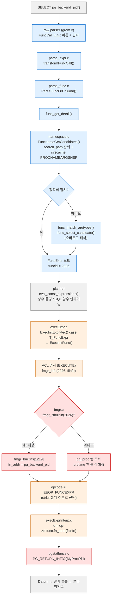
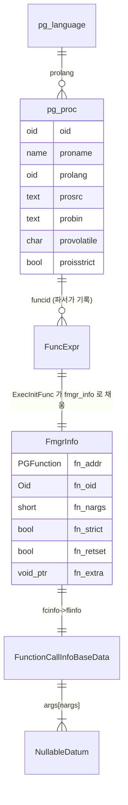
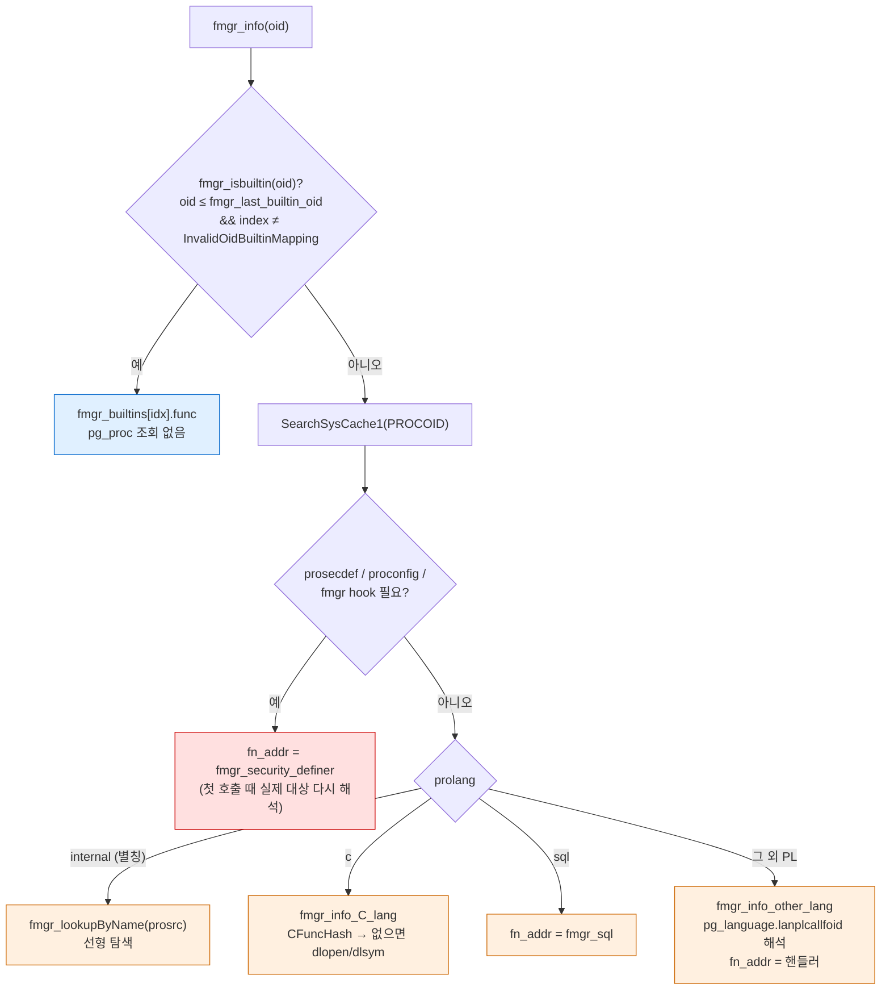
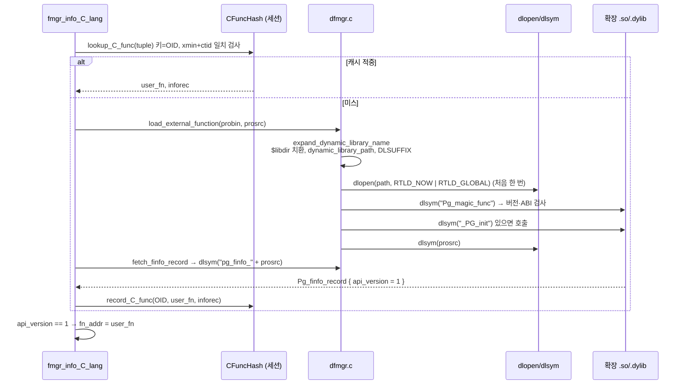
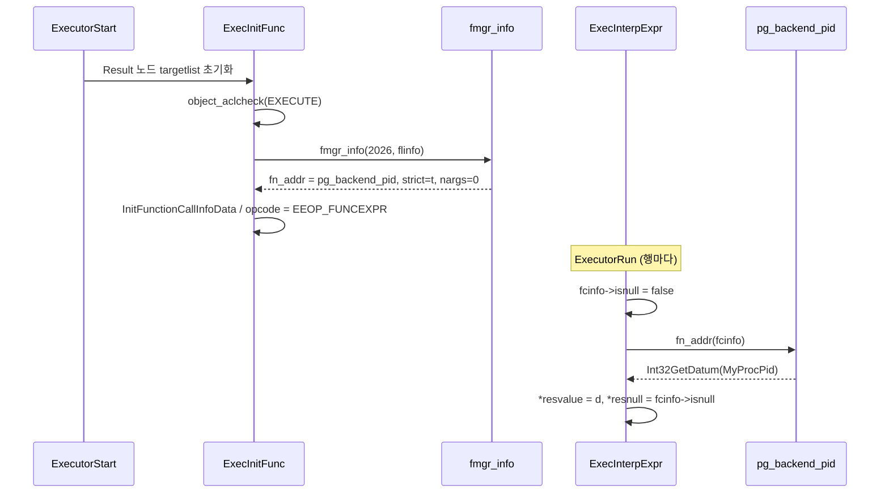
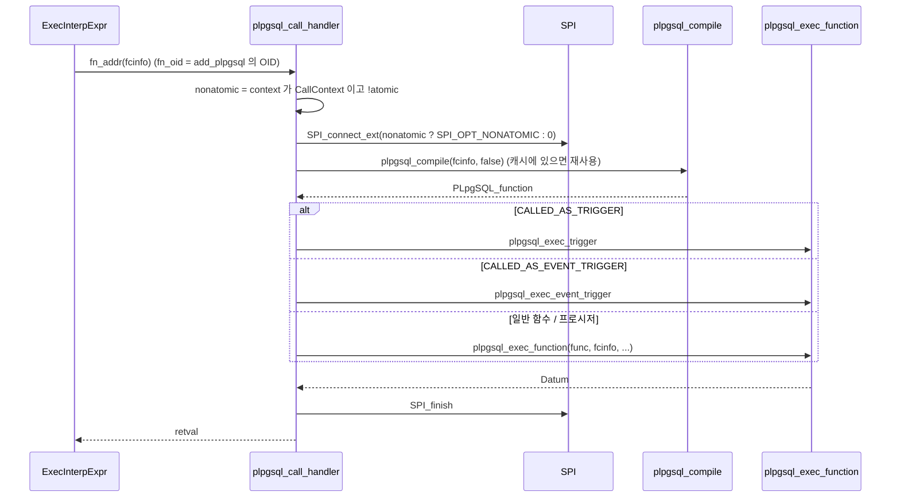

> **인덱스** [[PostgreSQL/INTERNALS/00-INDEX|내부 구조 분석서]]  ·  **이전** [[PostgreSQL/INTERNALS/06-CATALOG-OID|06. 시스템 카탈로그와 OID]]  ·  **다음** [[PostgreSQL/INTERNALS/08-SYSTEM-FUNCTIONS|08. 기본 제공 시스템 함수와 실행 경로]]

# 07. 함수 실행 구조 — fmgr (Function Manager)

`SELECT pg_backend_pid()` 한 줄이 실행되면 파서는 이름을 OID로 바꾸고, 실행기는 그 OID로
`pg_proc` 행을 해석해 **C 함수 포인터 하나**를 얻은 뒤 `fcinfo` 구조체 하나를 넘겨 호출한다.
이 문서는 그 사이에 있는 함수 관리자(fmgr)를 다룬다. 이름 해석, `pg_proc` 실행 컬럼, 언어별 디스패치,
V1 호출 규약과 Datum, 속성(strict·volatility·parallel·leakproof·cost)이 플래너·실행기에 주는 효과,
SRF 프로토콜, 언어 핸들러, 그리고 **C 확장 함수를 직접 빌드·로드한 실증**까지 이어진다.

함수 **작성·호출 문법**은 사용법 문서 [[PostgreSQL/07-PLPGSQL|07. FUNCTION / PROCEDURE 작성]],
[[PostgreSQL/08-CALLING|08. 프로시저 / 함수 호출 방법]]에 있다. 여기서는 반복하지 않고 내부 구현만 본다.
소스 인용은 GitHub `REL_18_STABLE` 브랜치, 헤더 인용은 로컬 18.4 서버 헤더
(`pg_config --includedir-server`) 기준이다. 동작은 로컬 PostgreSQL 18.4 임시 클러스터에서 실증했다 (§13).

## 0. 전체 지도



| 단계 | 소스 파일 (REL_18_STABLE) | 핵심 함수 | 산출물 |
|---|---|---|---|
| 이름 해석 | `src/backend/parser/parse_expr.c`, `parse_func.c` | `transformFuncCall` → `ParseFuncOrColumn` → `func_get_detail` | `FuncExpr{funcid}` |
| 후보 수집 | `src/backend/catalog/namespace.c` | `FuncnameGetCandidates` | `FuncCandidateList` |
| 계획 | `src/backend/optimizer/util/clauses.c` | `eval_const_expressions` → `simplify_function` → `evaluate_function` / `inline_function` | 상수, 인라인 식, 또는 FuncExpr 그대로 |
| 실행 준비 | `src/backend/executor/execExpr.c` | `ExecInitFunc` | `ExprEvalStep` (opcode + `FmgrInfo` + `fcinfo`) |
| 함수 해석 | `src/backend/utils/fmgr/fmgr.c`, `dfmgr.c` | `fmgr_info_cxt_security`, `load_external_function` | `FmgrInfo.fn_addr` |
| 호출 | `src/backend/executor/execExprInterp.c` | `EEO_CASE(EEOP_FUNCEXPR...)` | `Datum` + `isnull` |
| 함수 본체 | `src/backend/utils/adt/pgstatfuncs.c` | `pg_backend_pid` | `Int32GetDatum(MyProcPid)` |

이 문서에서 가장 중요한 구분은 둘이다.

1. **파서는 이름 → OID**, **실행기(fmgr)는 OID → 함수 포인터**. 둘은 서로 다른 카탈로그 접근 경로를 쓴다.
2. 모든 SQL 호출 가능 함수는 언어와 무관하게 **같은 C 시그니처** `Datum f(FunctionCallInfo)` 하나로 호출된다.
   언어 차이는 `fn_addr` 에 무엇을 넣는지(본체, `fmgr_sql`, 언어 핸들러, `fmgr_security_definer`)로만 드러난다.

## 1. 핵심 자료구조 한눈에

| 이름 | 위치 | 역할 | 수명 |
|---|---|---|---|
| `pg_proc` 행 | 카탈로그 | 함수의 정적 정의 (언어·본문·속성) | 영속 |
| `pg_language` 행 | 카탈로그 | 언어별 call/inline/validator 핸들러 | 영속 |
| `FuncExpr` | `nodes/primnodes.h` | 파스·플랜 트리 속 "함수 호출" 노드. `funcid` 보유 | 쿼리 |
| `FmgrInfo` | `fmgr.h` | OID를 해석한 **호출 준비 정보** (`fn_addr`, `fn_strict`, `fn_extra`…) | 호출 지점(call site)마다 1개 |
| `FunctionCallInfoBaseData` | `fmgr.h` | 실제 인자를 담아 넘기는 구조체 (`fcinfo`) | 호출 지점마다 1개, 재사용 |
| `Datum` | `postgres.h` | 모든 SQL 값의 공용 운반형 (`uintptr_t`) | 값 |
| `PGFunction` | `fmgr.h` | `Datum (*)(FunctionCallInfo)` — 유일한 호출 시그니처 | — |
| `fmgr_builtins[]` | `utils/fmgrtab.h` (빌드 시 생성) | 내장 함수 OID → C 주소 표 | 바이너리 |
| `CFuncHash` | `fmgr.c` static | C 확장 함수 주소 캐시 (OID 키) | 백엔드 세션 |



## 2. 파서 단계 — 이름에서 OID로

### 2.1 호출 사슬

raw parser가 만든 `FuncCall` 노드(이름 리스트 + 인자 식)는 `transformExprRecurse()` 의
`case T_FuncCall` 에서 `transformFuncCall()` 로 간다. 인자를 먼저 변환하고 `ParseFuncOrColumn()` 에
넘긴다. 이 함수가 `func_get_detail()` 을 불러 실제 `pg_proc` OID를 확정한다.

`func_get_detail()` (parse_func.c) 의 골격:

```c
/* Get list of possible candidates from namespace search */
raw_candidates = FuncnameGetCandidates(funcname, nargs, fargnames,
                                       expand_variadic, expand_defaults,
                                       include_out_arguments, false);

/*
 * Quickly check if there is an exact match to the input datatypes (there
 * can be only one)
 */
for (best_candidate = raw_candidates; best_candidate != NULL;
     best_candidate = best_candidate->next)
{
    if (nargs == 0 ||
        memcmp(argtypes, best_candidate->args, nargs * sizeof(Oid)) == 0)
        break;
}
```

- **후보 수집**: `FuncnameGetCandidates()` 는 `SearchSysCacheList1(PROCNAMEARGSNSP, 이름)` 으로
  같은 이름의 `pg_proc` 행을 전부 모은 뒤, 스키마 한정이 없으면 search_path 순서로 거른다.
  소스 주석: "entries in earlier namespaces to mask identical entries in later namespaces".
- **정확 일치**: 인자 타입 OID 배열을 `memcmp` 로 비교. 0인자 함수는 그대로 통과.
- **실패 시** 순서대로: ① 타입 강제변환 요청(`int4(x)` 같은 함수형 캐스트)인지 검사 →
  ② `func_match_argtypes()` 로 암묵 변환 가능한 후보만 남김 → ③ 둘 이상이면
  `func_select_candidate()` 로 휴리스틱 선택, 못 고르면 `FUNCDETAIL_MULTIPLE` (모호 에러).
- 확정 후 `ParseFuncOrColumn()` 이 `makeNode(FuncExpr)` 로 노드를 만들고
  `funcid`, `funcresulttype`, `funcretset`, `args` 를 채운다. 인자에는 `make_fn_arguments()` 가
  필요한 캐스트 노드를 끼워 넣는다.

후보 리스트 원소 (`catalog/namespace.h`):

```c
typedef struct _FuncCandidateList
{
    struct _FuncCandidateList *next;
    int         pathpos;        /* for internal use of namespace lookup */
    Oid         oid;            /* the function or operator's OID */
    int         nominalnargs;   /* either pronargs or length(proallargtypes) */
    int         nargs;          /* number of arg types returned */
    int         nvargs;         /* number of args to become variadic array */
    int         ndargs;         /* number of defaulted args */
    int        *argnumbers;     /* args' positional indexes, if named call */
    Oid         args[FLEXIBLE_ARRAY_MEMBER];    /* arg types */
}          *FuncCandidateList;
```

### 2.2 search_path 와 pg_catalog 의 암묵 선두

`pg_catalog` 는 search_path 에 적지 않아도 **맨 앞에 암묵 삽입**된다. 그래서 같은 이름·같은 시그니처의
함수를 `public` 에 만들어도 기본 설정에서는 내장 함수가 이긴다. `pg_catalog` 를 명시적으로 뒤에 두면 순서가 바뀐다.

```sql
CREATE FUNCTION public.pg_backend_pid() RETURNS int LANGUAGE sql AS 'SELECT -1';
SHOW search_path;                       -- "$user", public
SELECT pg_backend_pid();                -- 48981   (pg_catalog 판이 선택)
SET search_path = public, pg_catalog;
SELECT pg_backend_pid();                -- -1      (public 판이 선택)
RESET search_path;
SELECT current_schemas(true);           -- {pg_catalog,public}
```

이 순서 규칙이 SECURITY DEFINER 함수의 search_path 탈취 공격의 근거다.
권한 측면은 [[PostgreSQL/15-AUTHORITY|15. 권한 체계]] §6 참고.

### 2.3 오버로드 해석 — 같은 이름, 다른 OID

`random` 은 이름 하나에 OID 4개다. 파서 출력(`debug_print_parse`)으로 각각 다른 `funcid` 가 박히는 것을 확인했다.

| 호출 | 선택된 시그니처 | funcid | 결과 타입 |
|---|---|---|---|
| `random()` | `random()` | 1598 | `double precision` (701) |
| `random(1, 10)` | `random(integer,integer)` | 6339 | `integer` (23) |
| `random(1::bigint, 10)` | `random(bigint,bigint)` | 6340 | `bigint` |
| `random(1.5, 2.5)` | `random(numeric,numeric)` | 6341 | `numeric` (1700) |

정확 일치가 없을 때의 선택은 "선호 타입(preferred type)" 규칙에 크게 기댄다.
`f(int)`, `f(bigint)`, `f(numeric)` 세 개만 있을 때 `f(1::smallint)` 는 셋 다 암묵 변환 가능해서 **모호 에러**,
같은 범주(N)의 선호 타입인 `float8` 판을 추가하면 그쪽이 선택됐다.

```sql
SELECT f(1::smallint);
-- ERROR:  function f(smallint) is not unique
-- HINT:  Could not choose a best candidate function. You might need to add explicit type casts.
CREATE FUNCTION f(float8) RETURNS text LANGUAGE sql AS $$ SELECT 'float8' $$;
SELECT f(1::smallint) AS smallint_arg, f('7') AS unknown_arg;
--  smallint_arg | unknown_arg
-- --------------+-------------
--  float8       | float8
```

```text
 typname | typcategory | typispreferred
---------+-------------+----------------
 float8  | N           | t
 int2    | N           | f
 int4    | N           | f
 int8    | N           | f
 numeric | N           | f
 text    | S           | t
```

해석 단계의 전체 규칙은 공식 문서 "Type Conversion — Functions" 절에 있다. 사용자 관점 요약은
[[PostgreSQL/08-CALLING|08. 호출 방법]] §9.

### 2.4 FuncExpr — 파서가 남기는 것

`nodes/primnodes.h` (18.4):

```c
typedef struct FuncExpr
{
    Expr        xpr;
    /* PG_PROC OID of the function */
    Oid         funcid;
    /* PG_TYPE OID of result value */
    Oid         funcresulttype pg_node_attr(query_jumble_ignore);
    /* true if function returns set */
    bool        funcretset pg_node_attr(query_jumble_ignore);
    /* true if variadic arguments have been combined into an array last argument */
    bool        funcvariadic pg_node_attr(query_jumble_ignore);
    /* how to display this function call */
    CoercionForm funcformat pg_node_attr(query_jumble_ignore);
    /* OID of collation of result */
    Oid         funccollid pg_node_attr(query_jumble_ignore);
    /* OID of collation that function should use */
    Oid         inputcollid pg_node_attr(query_jumble_ignore);
    /* arguments to the function */
    List       *args;
    /* token location, or -1 if unknown */
    ParseLoc    location;
} FuncExpr;
```

`SET debug_print_parse = on` 출력 발췌:

```text
   :targetList (
      {TARGETENTRY
      :expr
         {FUNCEXPR
         :funcid 2026
         :funcresulttype 23
         :funcretset false
         :funcvariadic false
         :funcformat 0
         :funccollid 0
         :inputcollid 0
         :args <>
         :location 7
         }
      :resname pg_backend_pid
```

이후 단계는 이름을 다시 보지 않는다. **함수 이름은 파서에서 끝나고, 나머지는 OID 2026 하나로 굴러간다.**
같은 이유로 연산자 `a + b` 도 `OpExpr{opfuncid}` 가 되어 같은 fmgr 경로를 탄다
(`int4 + int4` → `oprcode = int4pl`, OID 177). `ExecInitExprRec()` 는 `T_FuncExpr` 와 `T_OpExpr` 둘 다
`ExecInitFunc()` 로 보낸다.

## 3. pg_proc — 실행에 쓰이는 컬럼

### 3.1 컬럼별 의미와 소비자

| 컬럼 | 타입 | 의미 | 주로 읽는 곳 |
|---|---|---|---|
| `prolang` | oid | 구현 언어 (`pg_language.oid`) | `fmgr_info_cxt_security` 의 `switch` |
| `prosrc` | text | internal: C 심볼명 / c: 링크 심볼명 / sql·PL: 본문 소스 | `fmgr_lookupByName`, `fmgr_info_C_lang`, `inline_function`, PL 컴파일러 |
| `probin` | text | c: 공유 라이브러리 경로 (`$libdir/...`) / 그 외 NULL | `fmgr_info_C_lang` → `load_external_function` |
| `prosqlbody` | pg_node_tree | SQL 표준 본문(`BEGIN ATOMIC` / `RETURN`)의 미리 분석된 트리 | `inline_function`, `fmgr_sql` |
| `provolatile` | char | `i` IMMUTABLE / `s` STABLE / `v` VOLATILE | `evaluate_function`, `contain_*_functions`, SQL 함수의 `readonly_func` |
| `proisstrict` | bool | NULL 입력이면 호출 생략 | `FmgrInfo.fn_strict` → opcode 선택, `evaluate_function` |
| `proparallel` | char | `s` SAFE / `r` RESTRICTED / `u` UNSAFE | 플래너 병렬 안전성 판정 |
| `proleakproof` | bool | 인자 정보를 부작용으로 흘리지 않음 | security barrier / RLS 의 qual 순서 결정 |
| `procost` | float4 | 호출 1회 비용 (`cpu_operator_cost` 배수) | `add_function_cost` (plancat.c) |
| `prorows` | float4 | SRF 예상 반환 행 수 | `get_function_rows` (plancat.c) |
| `proretset` | bool | 집합 반환 함수 여부 | `FmgrInfo.fn_retset`, SRF 실행 노드 선택 |
| `prokind` | char | `f` 함수 / `p` 프로시저 / `a` 집계 / `w` 윈도우 | 파서(CALL vs SELECT), `inline_function` |
| `prosupport` | regproc | 플래너 지원 함수 | `simplify_function`, `add_function_cost`, `get_function_rows` 등 (§12) |
| `prosecdef` | bool | SECURITY DEFINER | `fmgr_security_definer` 경유 여부 |
| `proconfig` | text[] | `SET guc = ...` 절 | `fmgr_security_definer` 경유 여부 |

상수 정의 (`catalog/pg_proc.h`):

```c
#define PROKIND_FUNCTION 'f'
#define PROKIND_AGGREGATE 'a'
#define PROKIND_WINDOW 'w'
#define PROKIND_PROCEDURE 'p'

#define PROVOLATILE_IMMUTABLE   'i' /* never changes for given input */
#define PROVOLATILE_STABLE      's' /* does not change within a scan */
#define PROVOLATILE_VOLATILE    'v' /* can change even within a scan */

#define PROPARALLEL_SAFE        's' /* can run in worker or leader */
#define PROPARALLEL_RESTRICTED  'r' /* can run in parallel leader only */
#define PROPARALLEL_UNSAFE      'u' /* banned while in parallel mode */
```

### 3.2 기본값은 두 종류다

`pg_proc.h` 의 `BKI_DEFAULT` 는 **initdb 부트스트랩용 `.dat` 파일의 기본값**이고,
`CREATE FUNCTION` 의 기본값과 다르다. 내장 함수와 사용자 함수의 속성 분포가 다른 이유다.

| 속성 | BKI 기본값 (내장 함수 정의용) | `CREATE FUNCTION` 기본값 (실증) |
|---|---|---|
| `prolang` | `internal` | (필수 지정) |
| `provolatile` | `i` | `v` |
| `proisstrict` | `t` | `f` (CALLED ON NULL INPUT) |
| `proparallel` | `s` | `u` |
| `procost` | 1 | C·internal 1, sql·plpgsql 100 |
| `prorows` | 0 | SRF면 1000, 아니면 0 |

`CREATE FUNCTION` 기본값은 `demo_countdown`(c, SETOF), `add_sql`(sql), `add_plpgsql`, `my_backend_pid`(internal)
를 속성 지정 없이 만들어 확인했다.

### 3.3 실증 — 대표 함수 5종의 행

```sql
SELECT oid, proname, prolang, prosrc, probin, provolatile vol, proisstrict strict,
       proparallel par, proleakproof leak, procost, prorows, proretset retset, prokind, prosupport
FROM pg_proc WHERE proname IN ('pg_backend_pid','now','random','pg_sleep','generate_series')
ORDER BY proname, oid;
```

```text
 oid  |     proname     | prolang |           prosrc            | probin | vol | strict | par | leak | procost | prorows | retset | prokind |            prosupport
------+-----------------+---------+-----------------------------+--------+-----+--------+-----+------+---------+---------+--------+---------+-----------------------------------
  938 | generate_series |      12 | generate_series_timestamp   |        | i   | t      | s   | f    |       1 |    1000 | t      | f       | generate_series_timestamp_support
  939 | generate_series |      12 | generate_series_timestamptz |        | s   | t      | s   | f    |       1 |    1000 | t      | f       | generate_series_timestamp_support
 1066 | generate_series |      12 | generate_series_step_int4   |        | i   | t      | s   | f    |       1 |    1000 | t      | f       | generate_series_int4_support
 1067 | generate_series |      12 | generate_series_int4        |        | i   | t      | s   | f    |       1 |    1000 | t      | f       | generate_series_int4_support
 ...  (int8·numeric·timestamptz_at_zone 판 생략)
 1299 | now             |      12 | now                         |        | s   | t      | s   | f    |       1 |       0 | f      | f       | -
 2026 | pg_backend_pid  |      12 | pg_backend_pid              |        | s   | t      | r   | f    |       1 |       0 | f      | f       | -
 2626 | pg_sleep        |      12 | pg_sleep                    |        | v   | t      | s   | f    |       1 |       0 | f      | f       | -
 1598 | random          |      12 | drandom                     |        | v   | t      | r   | f    |       1 |       0 | f      | f       | -
 6339 | random          |      12 | int4random                  |        | v   | t      | r   | f    |       1 |       0 | f      | f       | -
```

읽는 법:

- 전부 `prolang = 12` (internal), `probin` NULL. 실행 코드는 postgres 바이너리 안에 있다.
- `random()` 의 `prosrc` 는 `drandom`. **SQL 이름과 C 심볼 이름은 달라도 된다.**
- `pg_backend_pid` 는 STABLE + PARALLEL **RESTRICTED**. 워커에서 부르면 워커 PID가 나오기 때문이다 (§7.3에서 실증).
- `now()` 는 STABLE. 트랜잭션 시작 시각을 돌려주므로 문장 안에서 불변이다.
  본체는 `PG_RETURN_TIMESTAMPTZ(GetCurrentTransactionStartTimestamp())` (timestamp.c).
- `random` 계열은 VOLATILE + RESTRICTED. `pg_sleep` 은 VOLATILE 이지만 PARALLEL SAFE.
- `generate_series` 는 `proretset = t`, 기본 `prorows = 1000`, 그리고 `prosupport` 가 붙어 있다.
  timestamptz 판(939)만 STABLE 인 것은 타임존 설정에 따라 결과가 달라지기 때문으로 보인다(추정).

카탈로그 전체 분포 (18.4, `postgres` DB, initdb 직후 + 실험 객체 제외 `oid < 16384`):

| 항목 | 수 |
|---|---|
| `pg_proc` 전체 | 3413 |
| `prolang = internal` | 3263 (그중 집계 `a` 161, 함수 `f` 3087, 윈도우 `w` 15) |
| `prolang = c` | 89 (전부 인코딩 변환 함수, `$libdir/cyrillic_and_mic` 등) |
| `prolang = sql` | 61 |
| `prosupport` 가 있는 함수 | 53 |
| LEAKPROOF / PARALLEL UNSAFE / RESTRICTED / VOLATILE | 345 / 94 / 202 / 283 |

## 4. 언어와 디스패치

### 4.1 pg_language

```sql
SELECT oid, lanname, lanispl, lanpltrusted, lanplcallfoid::regproc,
       laninline::regproc, lanvalidator::regproc FROM pg_language ORDER BY oid;
```

```text
  oid  | lanname  | lanispl | lanpltrusted |    lanplcallfoid     |       laninline        |      lanvalidator
-------+----------+---------+--------------+----------------------+------------------------+-------------------------
    12 | internal | f       | f            | -                    | -                      | fmgr_internal_validator
    13 | c        | f       | f            | -                    | -                      | fmgr_c_validator
    14 | sql      | f       | t            | -                    | -                      | fmgr_sql_validator
 14053 | plpgsql  | t       | t            | plpgsql_call_handler | plpgsql_inline_handler | plpgsql_validator
```

- `internal`(12), `c`(13), `sql`(14)는 고정 OID. **call handler 가 없다** — fmgr가 직접 처리한다.
- `plpgsql` 은 initdb 과정에서 확장(`pg_extension`: plpgsql 1.0)으로 설치되어, 고정 OID가 아닌 initdb 시 할당 OID(14053)를 받는다. call handler 자체가
  `$libdir/plpgsql` 에 든 **C 언어 함수**다:

```text
  oid  |        proname         | prolang |         prosrc         |     probin
-------+------------------------+---------+------------------------+-----------------
 14050 | plpgsql_call_handler   |      13 | plpgsql_call_handler   | $libdir/plpgsql
 14051 | plpgsql_inline_handler |      13 | plpgsql_inline_handler | $libdir/plpgsql
 14052 | plpgsql_validator      |      13 | plpgsql_validator      | $libdir/plpgsql
```

- `lanpltrusted = f` 인 internal·c 로는 superuser 만 함수를 만들 수 있다.
  일반 롤로 시도하면 `ERROR: permission denied for language c` / `... language internal`.
  C 함수는 백엔드 주소 공간에서 아무 일이나 할 수 있으니 당연하다.
- validator 는 `CREATE FUNCTION` 시점에 호출된다. 그래서 C 함수의 심볼 누락은 **생성 시점**에 에러가 난다 (§11.5).

### 4.2 fmgr_info — OID를 함수 포인터로

`fmgr_info(oid, finfo)` 는 `fmgr_info_cxt_security(oid, finfo, CurrentMemoryContext, false)` 의 얇은 래퍼다.
실제 분기 (fmgr.c, 요약 없이 핵심만 발췌):

```c
if ((fbp = fmgr_isbuiltin(functionId)) != NULL)
{
    /*
     * Fast path for builtin functions: don't bother consulting pg_proc
     */
    finfo->fn_nargs = fbp->nargs;
    finfo->fn_strict = fbp->strict;
    finfo->fn_retset = fbp->retset;
    finfo->fn_stats = TRACK_FUNC_ALL;   /* ie, never track */
    finfo->fn_addr = fbp->func;
    finfo->fn_oid = functionId;
    return;
}

/* Otherwise we need the pg_proc entry */
procedureTuple = SearchSysCache1(PROCOID, ObjectIdGetDatum(functionId));
...
if (!ignore_security &&
    (procedureStruct->prosecdef ||
     !heap_attisnull(procedureTuple, Anum_pg_proc_proconfig, NULL) ||
     FmgrHookIsNeeded(functionId)))
{
    finfo->fn_addr = fmgr_security_definer;
    ...
    return;
}

switch (procedureStruct->prolang)
{
    case INTERNALlanguageId:   /* alias of a builtin: look up by prosrc name */
        ...
        fbp = fmgr_lookupByName(prosrc);
        finfo->fn_addr = fbp->func;
        finfo->fn_stats = TRACK_FUNC_ALL;   /* ie, never track */
        break;
    case ClanguageId:
        fmgr_info_C_lang(functionId, finfo, procedureTuple);
        finfo->fn_stats = TRACK_FUNC_PL;    /* ie, track if ALL */
        break;
    case SQLlanguageId:
        finfo->fn_addr = fmgr_sql;
        finfo->fn_stats = TRACK_FUNC_PL;    /* ie, track if ALL */
        break;
    default:
        fmgr_info_other_lang(functionId, finfo, procedureTuple);
        finfo->fn_stats = TRACK_FUNC_OFF;   /* ie, track if not OFF */
        break;
}
finfo->fn_oid = functionId;
```



핵심 관찰:

- **내장 함수는 pg_proc을 보지 않는다.** `fmgr_builtin_oid_index[oid]` 배열 인덱싱 한 번으로 끝난다.
  `nargs/strict/retset` 도 카탈로그가 아니라 빌드 시 박힌 표에서 가져온다.
- PL 함수의 `fn_oid` 는 **핸들러가 아니라 함수 자신의 OID**다 (헤더 주석: "OID of function (NOT of handler, if any)").
  핸들러는 `fcinfo->flinfo->fn_oid` 로 자기가 무슨 함수를 실행해야 하는지 알아낸다.
- `fn_stats` 정책 때문에 **내장 함수는 `track_functions` 로 절대 집계되지 않는다** (§7.6에서 실증).

### 4.3 internal — fmgr_builtins[] 표

`utils/fmgrtab.h` (18.4):

```c
typedef struct
{
    Oid         foid;           /* OID of the function */
    short       nargs;          /* 0..FUNC_MAX_ARGS, or -1 if variable count */
    bool        strict;         /* T if function is "strict" */
    bool        retset;         /* T if function returns a set */
    const char *funcName;       /* C name of the function */
    PGFunction  func;           /* pointer to compiled function */
} FmgrBuiltin;

extern PGDLLIMPORT const FmgrBuiltin fmgr_builtins[];
extern PGDLLIMPORT const int fmgr_nbuiltins;    /* number of entries in table */
extern PGDLLIMPORT const Oid fmgr_last_builtin_oid; /* highest function OID in table */

#define InvalidOidBuiltinMapping PG_UINT16_MAX
extern PGDLLIMPORT const uint16 fmgr_builtin_oid_index[];
```

이 표와 두 헤더는 빌드 때 `src/backend/utils/Gen_fmgrtab.pl` 이 `pg_proc.dat` 에서 생성한다
(스크립트 주석: "generates fmgroids.h, fmgrprotos.h, and fmgrtab.c from pg_proc.dat").
생성 규칙 발췌:

```perl
foreach my $s (sort { $a->{oid} <=> $b->{oid} } @fmgr)
{
	next if $s->{lang} ne 'internal';
	# We do not need entries for aggregate functions
	next if $s->{kind} eq 'a';
	print $tfh
	  "  { $s->{oid}, $s->{nargs}, $bmap{$s->{strict}}, $bmap{$s->{retset}}, \"$s->{prosrc}\", $s->{prosrc} }";
	$fmgr_builtin_oid_index[ $s->{oid} ] = $fmgr_count++;
	$last_builtin_oid = $s->{oid};
}
```

생성물 세 가지:

| 파일 | 내용 | 18.4 실측 |
|---|---|---|
| `utils/fmgroids.h` | `#define F_<PRONAME>[_<ARGTYPES>] <oid>` — C 코드에서 카탈로그 조회 없이 함수 OID 참조 | `#define F_` 3397개 |
| `utils/fmgrprotos.h` | `extern Datum <prosrc>(PG_FUNCTION_ARGS);` — prosrc 중복 제거 | `extern Datum` 2957개 |
| `fmgrtab.c` | `fmgr_builtins[]`, `fmgr_builtin_oid_index[]` | 런타임 `fmgr_nbuiltins = 3102` |

```bash
$ grep -n 'F_PG_BACKEND_PID\|F_NOW \|F_RANDOM_ \|F_PG_SLEEP \|F_GENERATE_SERIES_INT4_INT4 ' utils/fmgroids.h
639:#define F_GENERATE_SERIES_INT4_INT4 1067
778:#define F_NOW 1299
982:#define F_RANDOM_ 1598
1282:#define F_PG_BACKEND_PID 2026
1747:#define F_PG_SLEEP 2626
$ grep -n 'pg_backend_pid\|extern Datum now(\|extern Datum drandom\|extern Datum pg_sleep\|generate_series_int4(' utils/fmgrprotos.h
621:extern Datum generate_series_int4(PG_FUNCTION_ARGS);
753:extern Datum now(PG_FUNCTION_ARGS);
896:extern Datum drandom(PG_FUNCTION_ARGS);
1159:extern Datum pg_backend_pid(PG_FUNCTION_ARGS);
1522:extern Datum pg_sleep(PG_FUNCTION_ARGS);
```

`F_RANDOM_` 의 끝 밑줄은 "이름이 중복되면 인자 타입을 붙인다"는 규칙에서 인자가 0개인 경우다.

숫자 대조: `fmgr_nbuiltins = 3102` 는 internal 언어 중 집계를 뺀 행 수(함수 3087 + 윈도우 15)와 정확히 같다.
`extern` 2957개는 그 3102행의 **서로 다른 prosrc 수**(2957)와 같다. 즉 C 함수 하나가 여러 SQL 함수(별칭)의 본체가 된다.
`prolang = internal AND proname <> prosrc` 인 행이 978개 있다 (`int4` → `chartoi4`, `version` → `pgsql_version` 등).

내장 표 조회는 확장에서 직접 해 볼 수 있다 (`fmgr_builtins` 등은 `PGDLLIMPORT` 로 노출됨, §11.6의 `fmgr_probe`):

```text
fmgr_builtins_info(2026) → nbuiltins=3102 last_builtin_oid=6430 : [1219] foid=2026 funcName=pg_backend_pid nargs=0 strict=t retset=f
fmgr_builtins_info(1598) → nbuiltins=3102 last_builtin_oid=6430 : [929]  foid=1598 funcName=drandom nargs=0 strict=t retset=f
```

**사용자가 만든 internal 별칭**은 OID가 `fmgr_last_builtin_oid` 를 넘으므로 고속 경로를 타지 못하고,
`prosrc` 문자열로 `fmgr_lookupByName()` 의 **선형 탐색**을 탄다.

```sql
CREATE FUNCTION my_backend_pid() RETURNS int LANGUAGE internal STABLE AS 'pg_backend_pid';
SELECT my_backend_pid() = pg_backend_pid();   -- t
CREATE FUNCTION bogus() RETURNS int LANGUAGE internal AS 'no_such_builtin';
-- ERROR:  there is no built-in function named "no_such_builtin"
```

### 4.4 c — 동적 로딩 경로



- `PG_MODULE_MAGIC` 이 없으면 `incompatible library "...": missing magic block`, 메이저 버전·ABI가 다르면
  `version mismatch` / `ABI mismatch` 에러 (dfmgr.c 메시지). 검사 항목은 `Pg_abi_values`
  (메이저 버전, `FUNC_MAX_ARGS`, `INDEX_MAX_KEYS`, `NAMEDATALEN`, `FLOAT8PASSBYVAL`, `abi_extra`).
- `pg_finfo_<함수명>` 이 없으면 `could not find function information for function "..."` +
  힌트 `SQL-callable functions need an accompanying PG_FUNCTION_INFO_V1(funcname).`
- V1 외의 `api_version` 은 에러. **V0 호출 규약은 PG10에서 제거**됐다 (릴리스 노트: "Remove support for version-0 function calling conventions").
- `CFuncHash` 엔트리는 `pg_proc` 행의 xmin과 ctid로 유효성을 확인한다. `CREATE OR REPLACE` 로 행이 바뀌면 다시 해석한다.
- 라이브러리는 **백엔드마다 따로** `dlopen` 된다. `_PG_init` 은 각 백엔드에서 처음 로드할 때 한 번 돈다 (§11.4에서 실증).

### 4.5 sql — fmgr_sql

SQL 함수는 `fn_addr = fmgr_sql` (executor/functions.c). 호출되면 본문을 파싱·계획해 실행기로 돌린다.
PG18 릴리스 노트에 "Improve SQL-language function plan caching" 항목이 있고, 18의 functions.c 는
`utils/funccache.h` 의 `cached_function_compile()` 과 `CachedPlanSource` 목록을 쓴다.
단, 단순한 SQL 함수는 대부분 **플래너가 인라이닝**해서 `fmgr_sql` 까지 오지도 않는다 (§8).

### 4.6 그 외 PL — 언어 핸들러로 위임

```c
static void
fmgr_info_other_lang(Oid functionId, FmgrInfo *finfo, HeapTuple procedureTuple)
{
    ...
    languageTuple = SearchSysCache1(LANGOID, ObjectIdGetDatum(language));
    ...
    fmgr_info_cxt_security(languageStruct->lanplcallfoid, &plfinfo,
                           CurrentMemoryContext, true);
    finfo->fn_addr = plfinfo.fn_addr;
    ...
}
```

`fn_addr` 에 핸들러(예: `plpgsql_call_handler`) 주소를 넣고, `fn_oid` 는 원래 함수 OID로 둔다.
핸들러 내부는 §10.

### 4.7 fmgr_security_definer — 감싸는 핸들러

`prosecdef`, `proconfig`(`SET` 절), fmgr hook 중 하나라도 해당하면 실제 함수 대신
`fmgr_security_definer` 가 `fn_addr` 에 들어간다. 첫 호출 때 대상 함수를 `ignore_security = true` 로 다시 해석해
`fn_extra` 에 캐시하고, 매 호출마다:

1. `GetUserIdAndSecContext()` 로 현재 사용자 저장
2. `proconfig` 가 있으면 `NewGUCNestLevel()` 후 `set_config_with_handle()` 로 GUC 적용
3. `prosecdef` 면 `SetUserIdAndSecContext(proowner, ... | SECURITY_LOCAL_USERID_CHANGE)`
4. `fmgr_hook(FHET_START, ...)` (있으면)
5. `fcinfo->flinfo` 를 캐시된 것으로 바꿔 `FunctionCallInvoke(fcinfo)`
6. 복귀 시 원상 복구, 에러 시 `PG_CATCH` 에서 `fmgr_hook(FHET_ABORT, ...)`

이 래퍼가 끼면 SQL 함수 **인라이닝도 막힌다** (§8). `SET search_path` 를 붙인 함수가 인라인되지 않는 이유다.

### 4.8 실증 — 함수마다 fn_addr 에 무엇이 들어가는가

확장 함수 `fmgr_probe(regprocedure)` 를 만들어 `fmgr_info()` 를 직접 호출하고, 채워진 `fn_addr` 를
`dladdr()` 로 심볼 이름으로 되돌렸다 (소스 §11.6).

```text
               func               |                               fmgr_probe
----------------------------------+------------------------------------------------------------------------
 pg_backend_pid()                 | fn_addr=pg_backend_pid (postgres) nargs=0 strict=t retset=f
 random()                         | fn_addr=drandom (postgres) nargs=0 strict=t retset=f
 generate_series(integer,integer) | fn_addr=generate_series_int4 (postgres) nargs=2 strict=t retset=t
 my_backend_pid()                 | fn_addr=pg_backend_pid (postgres) nargs=0 strict=f retset=f
 demo_add(integer,integer)        | fn_addr=demo_add (fmgr_demo.dylib) nargs=2 strict=t retset=f
 add_sql(integer,integer)         | fn_addr=fmgr_sql (postgres) nargs=2 strict=f retset=f
 add_sql_secdef(integer,integer)  | fn_addr=fmgr_security_definer (postgres) nargs=2 strict=f retset=f
 add_sql_set(integer,integer)     | fn_addr=fmgr_security_definer (postgres) nargs=2 strict=f retset=f
 add_plpgsql(integer,integer)     | fn_addr=plpgsql_call_handler (plpgsql.dylib) nargs=2 strict=f retset=f
 plpgsql_call_handler()           | fn_addr=plpgsql_call_handler (plpgsql.dylib) nargs=0 strict=f retset=f
```

§4.2의 분기가 그대로 보인다. `my_backend_pid` 는 같은 C 함수를 가리키지만 `strict=f` 다.
별칭 경로는 strict를 `pg_proc` 에서 가져오고(`CREATE FUNCTION` 기본값 f), 내장 고속 경로는 표에서 가져오기 때문이다.

## 5. V1 호출 규약 — fmgr.h 해부

### 5.1 호출 시그니처와 두 구조체

```c
typedef struct FunctionCallInfoBaseData *FunctionCallInfo;

typedef Datum (*PGFunction) (FunctionCallInfo fcinfo);

typedef struct FmgrInfo
{
    PGFunction  fn_addr;        /* pointer to function or handler to be called */
    Oid         fn_oid;         /* OID of function (NOT of handler, if any) */
    short       fn_nargs;       /* number of input args (0..FUNC_MAX_ARGS) */
    bool        fn_strict;      /* function is "strict" (NULL in => NULL out) */
    bool        fn_retset;      /* function returns a set */
    unsigned char fn_stats;     /* collect stats if track_functions > this */
    void       *fn_extra;       /* extra space for use by handler */
    MemoryContext fn_mcxt;      /* memory context to store fn_extra in */
    fmNodePtr   fn_expr;        /* expression parse tree for call, or NULL */
} FmgrInfo;

typedef struct FunctionCallInfoBaseData
{
    FmgrInfo   *flinfo;         /* ptr to lookup info used for this call */
    fmNodePtr   context;        /* pass info about context of call */
    fmNodePtr   resultinfo;     /* pass or return extra info about result */
    Oid         fncollation;    /* collation for function to use */
#define FIELDNO_FUNCTIONCALLINFODATA_ISNULL 4
    bool        isnull;         /* function must set true if result is NULL */
    short       nargs;          /* # arguments actually passed */
#define FIELDNO_FUNCTIONCALLINFODATA_ARGS 6
    NullableDatum args[FLEXIBLE_ARRAY_MEMBER];
} FunctionCallInfoBaseData;
```

`NullableDatum` (postgres.h)은 값과 NULL 플래그를 한 쌍으로 둔다:

```c
typedef struct NullableDatum
{
#define FIELDNO_NULLABLE_DATUM_DATUM 0
    Datum       value;
#define FIELDNO_NULLABLE_DATUM_ISNULL 1
    bool        isnull;
    /* due to alignment padding this could be used for flags for free */
} NullableDatum;
```

| 필드 | 누가 채우나 | 쓰임 |
|---|---|---|
| `flinfo` | 호출자 | `fn_extra` 캐시, `fn_expr` 로 인자 타입 조회(`get_fn_expr_argtype`) |
| `context` | 호출자 | 트리거(`TriggerData`), 이벤트 트리거, `CALL` 의 `CallContext`, 집계 `AggState` 등 |
| `resultinfo` | 호출자 / 함수 | SRF의 `ReturnSetInfo` (§9) |
| `fncollation` | 호출자 | 문자열 비교 함수가 쓸 collation |
| `isnull` | **함수** | 결과가 NULL이면 true |
| `args[i]` | 호출자 | 인자 값 + NULL 여부 |

`FIELDNO_*` 상수는 JIT(LLVM)가 구조체 필드 오프셋을 코드로 생성할 때 쓴다.
헤더 주석에 이 구조체를 `*BaseData` 로 이름 붙인 이유가 "to break pre v12 code" 라고 적혀 있다.
즉 PG12에서 가변 길이 `args[]` 형태로 바뀌었고, 크기는 `SizeForFunctionCallInfo(nargs)` 로 계산한다.
스택에 잡을 때는 `LOCAL_FCINFO(name, nargs)` 매크로를 쓴다.

```c
#define SizeForFunctionCallInfo(nargs) \
    (offsetof(FunctionCallInfoBaseData, args) + \
     sizeof(NullableDatum) * (nargs))

#define FunctionCallInvoke(fcinfo)  ((* (fcinfo)->flinfo->fn_addr) (fcinfo))
```

### 5.2 함수 쪽 매크로

| 매크로 | 정의 (fmgr.h 18.4) | 의미 |
|---|---|---|
| `PG_FUNCTION_ARGS` | `FunctionCallInfo fcinfo` | 모든 V1 함수의 파라미터 |
| `PG_NARGS()` | `(fcinfo->nargs)` | 실제 인자 수 (같은 C 함수를 인자 수 다른 SQL 함수가 공유할 때) |
| `PG_ARGISNULL(n)` | `(fcinfo->args[n].isnull)` | 비STRICT 함수는 반드시 먼저 검사 |
| `PG_GETARG_DATUM(n)` | `(fcinfo->args[n].value)` | 원시 Datum |
| `PG_GETARG_INT32(n)` | `DatumGetInt32(PG_GETARG_DATUM(n))` | 타입별 꺼내기 |
| `PG_GETARG_TEXT_PP(n)` | `DatumGetTextPP(PG_GETARG_DATUM(n))` | varlena: 필요하면 detoast, 짧은 헤더 허용 |
| `PG_RETURN_INT32(x)` | `return Int32GetDatum(x)` | 타입별 반환 |
| `PG_RETURN_DATUM(x)` | `return (x)` | 원시 반환 |
| `PG_RETURN_NULL()` | `do { fcinfo->isnull = true; return (Datum) 0; } while (0)` | NULL 반환 |
| `PG_RETURN_VOID()` | `return (Datum) 0` | void (NULL과 다름) |

`PG_RETURN_NULL()` 정의가 보여 주듯 **NULL은 반환값이 아니라 `fcinfo->isnull` 플래그**다.
실행기는 호출 전 `fcinfo->isnull = false` 로 초기화하고, 호출 후 그 플래그를 결과 NULL 여부로 쓴다 (§6.3).

### 5.3 PG_FUNCTION_INFO_V1 과 PG_MODULE_MAGIC

```c
#define PG_FUNCTION_INFO_V1(funcname) \
extern PGDLLEXPORT Datum funcname(PG_FUNCTION_ARGS); \
extern PGDLLEXPORT const Pg_finfo_record * CppConcat(pg_finfo_,funcname)(void); \
const Pg_finfo_record * \
CppConcat(pg_finfo_,funcname) (void) \
{ \
    static const Pg_finfo_record my_finfo = { 1 }; \
    return &my_finfo; \
} \
extern int no_such_variable
```

- 함수 본체를 `PGDLLEXPORT` 로 선언하고, `pg_finfo_<이름>()` 정보 함수를 하나 더 만든다.
  `fetch_finfo_record()` 가 dlsym으로 찾는 것이 이 정보 함수이고, 돌려주는 `api_version = 1` 을 보고 V1로 호출한다.
- `PGDLLEXPORT` 는 macOS/Linux에서 `__attribute__((visibility("default")))` (c.h). PGXS는
  `-fvisibility=hidden` 으로 빌드하므로 **매크로를 빼먹으면 심볼 자체가 숨겨진다** (§11.5에서 실증).
- `PG_MODULE_MAGIC` 은 `Pg_magic_func()` 를 정의해 `Pg_magic_struct` (길이 + ABI 값)를 돌려준다.
  **PG18 신규 `PG_MODULE_MAGIC_EXT(.name = ..., .version = ...)`** 는 모듈 이름·버전을 덧붙이고,
  역시 PG18 신규 `pg_get_loaded_modules()` 로 조회된다 (PG18 릴리스 노트). plpgsql도 18에서
  `PG_MODULE_MAGIC_EXT(.name = "plpgsql", .version = PG_VERSION)` 를 쓴다 (pl_handler.c).

### 5.4 Datum — 값 전달과 참조 전달

```c
typedef uintptr_t Datum;              /* postgres.h */
#define SIZEOF_DATUM SIZEOF_VOID_P    /* 이 빌드: 8 */

static inline int32  DatumGetInt32(Datum X)   { return (int32) X; }
static inline Datum  Int32GetDatum(int32 X)   { return (Datum) X; }
static inline Datum  PointerGetDatum(const void *X) { return (Datum) X; }

#ifdef USE_FLOAT8_BYVAL                /* pg_config_manual.h: SIZEOF_VOID_P >= 8 이면 정의 */
static inline Datum Int64GetDatum(int64 X) { return (Datum) X; }
#else
extern Datum Int64GetDatum(int64 X);   /* palloc 한 공간의 포인터를 돌려줌 */
#endif
```

`Datum` 은 포인터 크기 정수 하나다. 타입마다 둘 중 하나로 실린다.

- **값 전달(by value)**: 값 자체가 Datum 비트에 들어간다. `pg_type.typbyval = t`.
- **참조 전달(by reference)**: Datum은 palloc된 메모리의 포인터다. 고정 길이(`uuid` 16바이트)와
  가변 길이(`typlen = -1`, varlena)가 있다.

```text
   typname   | typlen | typbyval | typstorage
-------------+--------+----------+------------
 float8      |      8 | t        | p
 int8        |      8 | t        | p
 timestamptz |      8 | t        | p
 int4        |      4 | t        | p
 oid         |      4 | t        | p
 int2        |      2 | t        | p
 bool        |      1 | t        | p
 uuid        |     16 | f        | p
 text        |     -1 | f        | x
 numeric     |     -1 | f        | m
 jsonb       |     -1 | f        | x
```

64비트 빌드에서는 `USE_FLOAT8_BYVAL` 이 켜져 `int8`, `float8`, `timestamptz` 도 값 전달이다.
`Pg_abi_values.float8byval` 이 매직 블록 검사 항목에 들어 있는 이유가 이것이다 — 이 값이 다른 빌드의
확장을 로드하면 8바이트 타입의 해석이 어긋난다.

### 5.5 varlena

```c
struct varlena                 /* c.h */
{
    char        vl_len_[4];     /* Do not touch this field directly! */
    char        vl_dat[FLEXIBLE_ARRAY_MEMBER];  /* Data content is here */
};
#define VARHDRSZ        ((int32) sizeof(int32))
```

가변 길이 값은 길이 헤더 + 데이터다. 디스크에서는 1바이트 짧은 헤더, 압축, out-of-line(TOAST) 형태일 수 있으므로
함수는 매크로로 다룬다: `PG_GETARG_TEXT_PP` (필요 시 `pg_detoast_datum_packed` 로 펼침) →
`VARSIZE_ANY_EXHDR` (헤더 제외 길이) → `VARDATA_ANY` (데이터 시작). 반환값은 `palloc(VARHDRSZ + len)` 후
`SET_VARSIZE`. TOAST 저장 구조는 [[PostgreSQL/INTERNALS/03-STORAGE|03. 물리 저장 구조]].
§11의 `demo_reverse` 가 이 패턴이며, 6000바이트 문자열로도 내장 `reverse()` 와 결과가 같았다.

### 5.6 fn_extra — 호출 지점별 상태

`FmgrInfo` 는 **식 트리의 호출 지점마다 하나**씩 만들어진다. 함수는 `fn_extra` 에 아무 포인터나 매달아
호출 사이에 상태를 유지할 수 있고, 메모리는 `fn_mcxt` (FmgrInfo 와 같은 수명)에서 잡아야 한다.
PL 핸들러가 컴파일된 함수를, SRF가 `FuncCallContext` 를, `fmgr_security_definer` 가 대상 정보를 여기 둔다.

```sql
SELECT demo_site_count() AS a, demo_site_count() AS b FROM generate_series(1,3);
--  a | b
-- ---+---
--  1 | 1
--  2 | 2
--  3 | 3
```

같은 함수를 한 문장에서 두 번 썼지만 카운터가 따로 돈다. 호출 지점 두 곳이 각자 `FmgrInfo` 를 가졌기 때문이다.
반면 모듈의 `static` 변수(`n_calls`)는 백엔드 전역이라 모든 호출 지점이 공유한다.

## 6. 실행기 — ExecInitFunc 와 EEOP_FUNCEXPR

### 6.1 ExecInitFunc — 초기화 때 하는 일

식 평가는 PG10에서 재작성된 opcode 방식(execExpr.c 에서 단계 배열을 만들고 execExprInterp.c 가 해석)이다
(PG10 릴리스 노트 "Reduce expression evaluation overhead"). 그래서 `ExecEvalFunc` 같은 함수는 18에 없고,
`ExecInitFunc()` 가 만든 `ExprEvalStep` 을 인터프리터가 실행한다.

`ExecInitFunc()` (execExpr.c) 발췌:

```c
/* Check permission to call function */
aclresult = object_aclcheck(ProcedureRelationId, funcid, GetUserId(), ACL_EXECUTE);
if (aclresult != ACLCHECK_OK)
    aclcheck_error(aclresult, OBJECT_FUNCTION, get_func_name(funcid));
InvokeFunctionExecuteHook(funcid);
...
/* Allocate function lookup data and parameter workspace for this call */
scratch->d.func.finfo = palloc0(sizeof(FmgrInfo));
scratch->d.func.fcinfo_data = palloc0(SizeForFunctionCallInfo(nargs));
...
/* Set up the primary fmgr lookup information */
fmgr_info(funcid, flinfo);
fmgr_info_set_expr((Node *) node, flinfo);

/* Initialize function call parameter structure too */
InitFunctionCallInfoData(*fcinfo, flinfo, nargs, inputcollid, NULL, NULL);

/* Keep extra copies of this info to save an indirection at runtime */
scratch->d.func.fn_addr = flinfo->fn_addr;
scratch->d.func.nargs = nargs;
...
foreach(lc, args)
{
    if (IsA(arg, Const))
    {
        /* Don't evaluate const arguments every round */
        fcinfo->args[argno].value = con->constvalue;
        fcinfo->args[argno].isnull = con->constisnull;
    }
    else
        ExecInitExprRec(arg, state, &fcinfo->args[argno].value, &fcinfo->args[argno].isnull);
    argno++;
}
```

정리하면 초기화 시점에 다음이 한 번만 일어난다.

1. **EXECUTE 권한 검사** — 권한 에러는 실행 시작 시점에 난다.
2. **`fmgr_info()`** — 함수 포인터 확정. 행마다 카탈로그를 보지 않는다.
3. **상수 인자는 `fcinfo->args[]` 에 미리 박는다.** 비상수 인자는 그 하위 식이 결과를 `args[i]` 에 직접 쓰도록 배선.
4. `fn_retset` 이면 여기서 에러(`set-valued function called in context that cannot accept a set`).
   SRF는 별도 노드(ProjectSet / FunctionScan)가 처리한다 (§9).

### 6.2 opcode 선택

```c
if (pgstat_track_functions <= flinfo->fn_stats)
{
    if (flinfo->fn_strict && nargs > 0)
    {
        if (nargs == 1)      scratch->opcode = EEOP_FUNCEXPR_STRICT_1;
        else if (nargs == 2) scratch->opcode = EEOP_FUNCEXPR_STRICT_2;
        else                 scratch->opcode = EEOP_FUNCEXPR_STRICT;
    }
    else
        scratch->opcode = EEOP_FUNCEXPR;
}
else
{
    if (flinfo->fn_strict && nargs > 0)
        scratch->opcode = EEOP_FUNCEXPR_STRICT_FUSAGE;
    else
        scratch->opcode = EEOP_FUNCEXPR_FUSAGE;
}
```

| opcode | 조건 | 동작 |
|---|---|---|
| `EEOP_FUNCEXPR` | 비STRICT 또는 0인자 | 바로 호출 |
| `EEOP_FUNCEXPR_STRICT_1` / `_2` | STRICT, 인자 1·2개 | 인자 NULL 검사 펼친 판 |
| `EEOP_FUNCEXPR_STRICT` | STRICT, 인자 3개 이상 | 루프로 NULL 검사 |
| `EEOP_FUNCEXPR_FUSAGE` / `_STRICT_FUSAGE` | `track_functions` 가 이 함수를 집계해야 할 때 | `pgstat_init/end_function_usage` 로 감쌈 |

### 6.3 인터프리터 — 실제 호출

```c
EEO_CASE(EEOP_FUNCEXPR)
{
    FunctionCallInfo fcinfo = op->d.func.fcinfo_data;
    Datum       d;

    fcinfo->isnull = false;
    d = op->d.func.fn_addr(fcinfo);
    *op->resvalue = d;
    *op->resnull = fcinfo->isnull;

    EEO_NEXT();
}

/* strict function call with one argument */
EEO_CASE(EEOP_FUNCEXPR_STRICT_1)
{
    ...
    /* strict function, so check for NULL args */
    if (args[0].isnull)
        *op->resnull = true;
    else
    {
        fcinfo->isnull = false;
        d = op->d.func.fn_addr(fcinfo);
        *op->resvalue = d;
        *op->resnull = fcinfo->isnull;
    }
    EEO_NEXT();
}
```

`SELECT pg_backend_pid()` 의 경우 0인자이므로 `EEOP_FUNCEXPR`, `fn_addr = pg_backend_pid`, 본체는
(pgstatfuncs.c):

```c
Datum
pg_backend_pid(PG_FUNCTION_ARGS)
{
    PG_RETURN_INT32(MyProcPid);
}
```

`MyProcPid` 가 무엇이고 언제 정해지는지는 [[PostgreSQL/INTERNALS/08-SYSTEM-FUNCTIONS|08. 시스템 함수]]와
[[PostgreSQL/INTERNALS/02-PROCESS-MEMORY|02. 프로세스·메모리]]에서 다룬다.



`debug_print_plan` 으로 본 플랜은 `RESULT` 노드 하나, `total_cost 0.0125`
(= `cpu_tuple_cost` 0.01 + `procost` 1 × `cpu_operator_cost` 0.0025).

## 7. 함수 속성이 플래너·실행기에 미치는 영향

사용법 수준의 설명은 [[PostgreSQL/07-PLPGSQL|07. PL/pgSQL]] §3에 있다. 여기서는 각 속성이 **소스의 어느 분기**를
바꾸는지와 그 결과를 실측으로 본다. 아래 실험의 `demo_*` 는 §11의 C 확장 함수다.
`demo_calls()` 는 모듈 안 함수가 **실제로 호출된 횟수**를 돌려준다.

### 7.1 STRICT — 두 겹의 생략

1. **플래너**: `evaluate_function()` — "If the function is strict and has a constant-NULL input, it will never
   be called at all, so we can replace the call by a NULL constant". 함수가 IMMUTABLE이 아니어도 적용된다.
2. **실행기**: `EEOP_FUNCEXPR_STRICT*` 가 인자 NULL을 보면 호출 없이 결과 NULL.

같은 C 심볼 `demo_add` 를 STRICT 판과 CALLED ON NULL INPUT 판으로 두 번 등록하고, NULL이 섞인 4행에 적용했다.

```sql
CREATE FUNCTION demo_add(int, int) RETURNS int AS '$EXT/fmgr_demo', 'demo_add' LANGUAGE C STRICT IMMUTABLE PARALLEL SAFE;
CREATE FUNCTION demo_add_lax(int, int) RETURNS int AS '$EXT/fmgr_demo', 'demo_add' LANGUAGE C CALLED ON NULL INPUT IMMUTABLE;
-- nums: (1,2),(3,NULL),(NULL,4),(5,6)
```

| 단계 | `demo_calls()` | 증가분 |
|---|---|---|
| 시작 | 0 | |
| `SELECT demo_add(a,b) FROM nums` | 2 | **2** — NULL 행 2개는 호출 생략 |
| `SELECT demo_add_lax(a,b) FROM nums` | 6 | **4** — 전부 호출, 함수가 `PG_ARGISNULL` 로 직접 처리 |

```text
EXPLAIN (VERBOSE, COSTS OFF) SELECT demo_add(a, NULL) FROM nums;
   Output: NULL::integer                    ← 플래너가 호출 자체를 지움
EXPLAIN (VERBOSE, COSTS OFF) SELECT demo_add_lax(a, NULL) FROM nums;
   Output: demo_add_lax(a, NULL::integer)   ← 비STRICT는 남음
EXPLAIN (VERBOSE, COSTS OFF) SELECT demo_add(1, 2), demo_add(a, 2) FROM nums;
   Output: 3, demo_add(a, 2)                ← IMMUTABLE + 상수 인자 → 계획 시 실행
```

STRICT가 아닌 C 함수가 `PG_ARGISNULL` 을 검사하지 않으면 NULL 자리의 `args[n].value` 를 값으로 읽게 된다.
이 값은 의미 있는 데이터가 아니며, 참조 전달 타입이면 잘못된 포인터 역참조로 백엔드가 죽을 수 있다.
STRICT로 선언하면 이 검사를 실행기가 대신한다.

### 7.2 Volatility — 몇 번 부르고, 어떤 스냅샷을 보나

플래너 쪽 규칙 (`evaluate_function`, clauses.c):

```c
if (funcform->provolatile == PROVOLATILE_IMMUTABLE)
     /* okay */ ;
else if (context->estimate && funcform->provolatile == PROVOLATILE_STABLE)
     /* okay */ ;
else
    return NULL;
```

- IMMUTABLE + 전부 상수 인자 → **계획 시점에 실행해서 상수로 바꾼다.**
- STABLE → 실행 계획용으로는 접지 않지만, **선택도 추정(estimate 모드)용으로는 계획 시점에 실행할 수 있다.**
- VOLATILE → 절대 미리 실행하지 않는다.

같은 C 심볼 `demo_tick` (호출마다 카운터 +1 후 반환)을 VOLATILE·STABLE·IMMUTABLE 세 판으로 등록해 실측했다.

```sql
SELECT g, demo_tick() v, demo_tick_s() s, demo_tick_i() i FROM generate_series(1,3) g;
```

```text
 g | v | s | i
---+---+---+---
 1 | 2 | 3 | 1
 2 | 4 | 5 | 1
 3 | 6 | 7 | 1
```

- IMMUTABLE(`i`)은 계획 때 **1회** 실행되어 상수 1이 됐다.
- **STABLE(`s`)도 VOLATILE(`v`)과 똑같이 행마다 호출됐다.** STABLE은 "같은 결과를 돌려준다고 믿어도 된다"는
  허가일 뿐, 실행기가 결과를 캐시하지는 않는다.
- `EXPLAIN VERBOSE` 만 해도 IMMUTABLE 판은 실행된다: `Output: g, demo_tick(), demo_tick_s(), '8'::bigint`.

STABLE의 이득은 **인덱스 조건**에서 나온다. 인덱스 스캔은 비교 값을 스캔 시작 시 한 번 계산하기 때문이다
(공식 문서: "an index scan will evaluate the comparison value only once, not once at each row").

| 질의 (`big`: 1만 행, `id` 인덱스) | 플랜 | 호출 증가 |
|---|---|---|
| `WHERE id < demo_tick_s()` | `Index Only Scan ... Index Cond: (big.id < demo_tick_s())` | **2** (추정용 1 + 실행 1) |
| 위 질의의 `EXPLAIN` 만 | 같음 | **1** (추정용) |
| `WHERE id < demo_tick()` | `Seq Scan ... Filter: (big.id < demo_tick())` | **10000** |

VOLATILE은 인덱스 조건이 될 수 없어 Seq Scan + 행마다 호출이 됐다.

**스냅샷**: 공식 문서는 "STABLE and IMMUTABLE functions use a snapshot established as of the start of the
calling query, whereas VOLATILE functions obtain a fresh snapshot at the start of each query they execute" 라고 한다.
SQL 함수 구현(functions.c)에서는 `readonly_func = (provolatile != PROVOLATILE_VOLATILE)` 이고,
읽기 전용이 아니면 문장마다 `CommandCounterIncrement()` 후 새 스냅샷을 잡는다.

```sql
CREATE FUNCTION ins_log() RETURNS int LANGUAGE sql VOLATILE AS $$ INSERT INTO log VALUES (1) RETURNING 1 $$;
CREATE FUNCTION cnt_v() RETURNS bigint LANGUAGE sql VOLATILE AS $$ SELECT count(*) FROM log $$;
CREATE FUNCTION cnt_s() RETURNS bigint LANGUAGE sql STABLE   AS $$ SELECT count(*) FROM log $$;
SELECT g, ins_log(), cnt_v() AS volatile_sees, cnt_s() AS stable_sees FROM generate_series(1,3) g;
```

```text
 g | ins_log | volatile_sees | stable_sees
---+---------+---------------+-------------
 1 |       1 |             1 |           0
 2 |       1 |             2 |           0
 3 |       1 |             3 |           0
```

같은 문장 안에서 VOLATILE 함수는 방금 들어간 행을 보고, STABLE 함수는 바깥 문장 시작 시점 스냅샷에 머문다.
읽기 전용 모드라서 STABLE SQL 함수 안의 쓰기는 거부된다:

```text
ERROR:  INSERT is not allowed in a non-volatile function
CONTEXT:  SQL function "bad_s" statement 1
```

MVCC 스냅샷 자체는 [[PostgreSQL/INTERNALS/04-MVCC-WAL|04. 트랜잭션·MVCC·WAL]].

### 7.3 PARALLEL SAFE / RESTRICTED / UNSAFE

`parallel_setup_cost = 0`, `parallel_tuple_cost = 0`, `min_parallel_table_scan_size = 0` 으로 병렬을 유도하고
PL/pgSQL 함수(인라인 안 되는 것)를 필터에 넣었다.

| 필터 함수 속성 | 플랜 |
|---|---|
| PARALLEL SAFE | `Gather → Partial Aggregate → Parallel Seq Scan, Filter: p_safe_pl(id)` (워커에서 평가) |
| PARALLEL RESTRICTED | `Aggregate → Seq Scan, Filter: p_restr(id)` (이 질의에서는 병렬 포기) |
| PARALLEL UNSAFE | `Aggregate → Seq Scan, Filter: p_unsafe(id)` (병렬 금지) |

RESTRICTED는 "리더에서만 실행 가능"이므로 Gather **위**에 둘 수 있으면 병렬 플랜이 유지된다.
`pg_backend_pid()` (RESTRICTED)를 SELECT 목록에 둔 경우:

```text
 Gather
   Output: id, pg_backend_pid()          ← 리더(Gather)에서 평가
   Workers Planned: 2
   ->  Parallel Seq Scan on public.pt
         Output: id
         Filter: (pt.id < 4)
```

실행 결과 3행 모두 리더 PID(51705)가 나왔다. 사용자 정의 C 함수 `demo_pid()` 는 기본값 UNSAFE라서
같은 질의가 병렬 플랜 자체를 포기했다(`Seq Scan`). 병렬 실행 구조는 [[PostgreSQL/INTERNALS/05-QUERY-PIPELINE|05. 쿼리 처리 파이프라인]].

### 7.4 LEAKPROOF — 보안 장벽 아래로 내려갈 수 있는가

security barrier 뷰나 RLS가 있으면 플래너(`order_qual_clauses`, createplan.c)는 qual을 보안 수준 순으로 세운다.
소스 주석: "Quals of lower security_level must go before quals of higher security_level, except that we can grant
exceptions to move up quals that are leakproof. When security level doesn't force the decision, we prefer to
order clauses by estimated execution cost, cheapest first."

`RAISE NOTICE` 로 인자를 출력하는 함수 두 개(`peek` 일반, `peek_lp` LEAKPROOF, 둘 다 COST 0.0001)를
`id % 2 = 0` 인 행만 보여 주는 security_barrier 뷰에 걸고 일반 롤 `alice` 로 실행했다.

| 대상 | 플랜 | NOTICE로 새어 나온 값 |
|---|---|---|
| `sb_view WHERE peek(val)` | `Subquery Scan` 위 `Filter: peek(...)`, 아래 `Filter: ((id % 2) = 0)` | v2, v4, v6 (보이는 행만) |
| `sb_view WHERE peek_lp(val)` | `Seq Scan, Filter: (peek_lp(val) AND ((id % 2) = 0))` | **v1~v6 전부** |
| `plain_view WHERE peek(val)` (장벽 없음) | 비용 순 정렬 | **v1~v6 전부** |

LEAKPROOF로 표시된 함수는 장벽 아래로 내려가 숨겨야 할 행에도 호출된다. 그 함수가 실제로 정보를 흘리면 보안이 뚫린다.
그래서 LEAKPROOF 지정은 superuser 전용이다: 일반 롤은 `ERROR: only superuser can define a leakproof function`.
내장 함수 중에서는 `int4eq`, `int4lt`, `texteq` 가 `proleakproof = t`, `textlike` 는 `f` 였다.
RLS 쪽 동작은 [[PostgreSQL/15-AUTHORITY|15. 권한 체계]] §7.

### 7.5 COST 와 ROWS

- 비용: `add_function_cost()` (plancat.c)는 지원 함수가 `SupportRequestCost` 에 답하지 않으면
  `cost->per_tuple += procform->procost * cpu_operator_cost;`
- qual 순서: 위 `order_qual_clauses` 가 같은 보안 수준 안에서 **비용이 싼 qual을 먼저** 평가한다.

```text
WHERE pricey_nl(a) AND b = 2     (pricey_nl: COST 10000)
   Filter: ((nums.b = 2) AND pricey_nl(nums.a))     ← 쓴 순서와 반대로 재배열, cost=0.00..56538.25
WHERE b = 2 AND cheap_nl(a)      (cheap_nl: COST 0.001)
   Filter: (cheap_nl(nums.a) AND (nums.b = 2))      ← 싼 함수가 앞으로
```

- 행 수: `get_function_rows()` 는 지원 함수의 `SupportRequestRows` 를 먼저 묻고, 없으면 `prorows` 를 쓴다.

| 질의 | 추정 rows |
|---|---|
| `SELECT * FROM demo_countdown(3)` (기본 ROWS 1000) | 1000 |
| 같은 함수에 `ALTER FUNCTION ... ROWS 3` | 3 |
| `generate_series(1, 10)` (지원 함수 있음) | **10** |
| `generate_series(1, 10, 3)` | **4** |

### 7.6 track_functions 와 fn_stats

§4.2의 `fn_stats` 정책이 `pg_stat_user_functions` 에 그대로 나타난다.

| `track_functions` | 집계된 함수 (호출 수) |
|---|---|
| `pl` | `add_plpgsql` 4 |
| `all` | `add_plpgsql` 8(누적), `add_sql_secdef` 4, `demo_add` 3 |
| 어느 값이든 | `pg_backend_pid` 등 **내장 함수는 없음** |

- 내장(`TRACK_FUNC_ALL` = 집계 안 함), C·SQL(`TRACK_FUNC_PL` = `all` 일 때만), 그 외 PL(`TRACK_FUNC_OFF` = `pl` 이상이면).
- `demo_add` 가 3인 것은 STRICT라 NULL 행 하나에서 호출이 생략됐기 때문이다. 통계는 **실제 호출**을 센다.
- `add_sql_secdef` 는 SQL 함수지만 `fmgr_security_definer` 를 거치며, 래퍼가 내부 flinfo의 `fn_stats` 로 집계한다.
  인라인된 `add_sql` 은 호출 자체가 사라졌으므로 목록에 없다.

## 8. SQL 함수 인라이닝

### 8.1 스칼라 함수 — inline_function

`simplify_function()` 은 세 전략을 순서대로 시도한다 (소스 주석: "execute the function to deliver a constant
result, use a transform function to generate a substitute node tree, or expand in-line the body").
마지막 전략 `inline_function()` 의 거부 조건:

| 분류 | 조건 (하나라도 해당하면 인라인 안 함) |
|---|---|
| 함수 정의 | `prolang != sql`, `prokind != f`, `prosecdef`, `proretset`, `prorettype = record`, `proconfig` 있음 |
| 환경 | 재귀 중(`active_fns`), EXECUTE 권한 없음, fmgr hook 필요 |
| 본문 모양 | 단일 `SELECT 식` 이 아님 — 집계·윈도우·SRF·서브링크·CTE·FROM·WHERE·GROUP·HAVING·ORDER·LIMIT·집합연산 중 하나라도 있으면 실패, 타깃 1개 |
| 변동성 | IMMUTABLE 선언인데 본문에 mutable 함수 / STABLE 선언인데 본문에 volatile 함수 |
| STRICT | STRICT 선언인데 본문에 비strict 구성 요소, 또는 쓰지 않는 파라미터 |
| 파라미터 | 두 번 이상 쓰는 파라미터 자리에 volatile 식이나 비싼 식(서브플랜, 연산자 10개 초과)이 들어옴 |

실측:

| 함수 | EXPLAIN VERBOSE Output | 판정 |
|---|---|---|
| `add_sql` (`SELECT $1 + $2`, IMMUTABLE) | `(a + b)` | 인라인 |
| `add_sql_body` (`RETURN a + b`, SQL 표준 본문) | `(a + b)` | 인라인 (`prosqlbody` 경로) |
| `add_sql_secdef` (SECURITY DEFINER) | `add_sql_secdef(a, b)` | 거부 |
| `add_sql_set` (`SET search_path`) | `add_sql_set(a, b)` | 거부 |
| `add_sql_from` (`... FROM nums LIMIT 1`) | `add_sql_from(a, b)` | 거부 |
| `add_sql_lie` (IMMUTABLE 선언, 본문 `$1 + random()`) | `add_sql_lie(a)` | 거부 (변동성 위반) |
| `add_sql_twice(a)` (`$1 + $1`) | `(a + a)` | 인라인 |
| `add_sql_twice(demo_tick()::int)` | `add_sql_twice((demo_tick())::integer)` | 거부 (volatile 인자 중복 사용) |
| `add_plpgsql` | `add_plpgsql(a, b)` | 거부 (언어) |

인라인되면 함수 호출이 아예 사라지므로 `fmgr_sql` 실행 비용, `track_functions` 집계, 함수 단위 권한 검사 시점이 모두 바뀐다.

### 8.2 집합 반환 SQL 함수 — inline_set_returning_function

`FROM` 절의 SQL SRF도 서브쿼리로 펼쳐진다. 조건에 `provolatile == PROVOLATILE_VOLATILE` 이면 거부가 들어 있다
(그 밖에 `WITH ORDINALITY`, 함수 여러 개인 `ROWS FROM`, SECURITY DEFINER, `proconfig` 등).

```text
-- nums_over(int) RETURNS SETOF nums LANGUAGE sql STABLE AS 'SELECT * FROM nums WHERE a > $1'
EXPLAIN (VERBOSE, COSTS OFF) SELECT * FROM nums_over(2);
 Seq Scan on public.nums
   Output: nums.a, nums.b
   Filter: (nums.a > 2)                ← 함수가 사라지고 테이블 스캔이 됨

-- 같은 본문, VOLATILE
EXPLAIN (VERBOSE, COSTS OFF) SELECT * FROM nums_over_v(2);
 Function Scan on public.nums_over_v
   Function Call: nums_over_v(2)
```

### 8.3 PL/pgSQL 은 인라인되지 않지만 접힐 수는 있다

`add_plpgsql` 은 인라인 대상이 아니지만 IMMUTABLE + 상수 인자면 `evaluate_function()` 이 계획 시점에
**PL/pgSQL 핸들러를 실제로 호출**해 상수로 바꾼다:

```text
EXPLAIN (VERBOSE, COSTS OFF) SELECT add_sql(1, 2), add_plpgsql(1, 2);
 Result
   Output: 3, 3
```

## 9. 집합 반환 함수(SRF) 프로토콜

### 9.1 주고받는 구조체

SRF는 일반 함수와 같은 시그니처를 쓰고, `fcinfo->resultinfo` 로 `ReturnSetInfo` 를 받아 반환 방식을 협상한다
(`nodes/execnodes.h`):

```c
typedef enum
{
    SFRM_ValuePerCall = 0x01,   /* one value returned per call */
    SFRM_Materialize = 0x02,    /* result set instantiated in Tuplestore */
    SFRM_Materialize_Random = 0x04, /* Tuplestore needs randomAccess */
    SFRM_Materialize_Preferred = 0x08,  /* caller prefers Tuplestore */
} SetFunctionReturnMode;

typedef struct ReturnSetInfo
{
    NodeTag     type;
    /* values set by caller: */
    ExprContext *econtext;      /* context function is being called in */
    TupleDesc   expectedDesc;   /* tuple descriptor expected by caller */
    int         allowedModes;   /* bitmask: return modes caller can handle */
    /* result status from function (but pre-initialized by caller): */
    SetFunctionReturnMode returnMode;   /* actual return mode */
    ExprDoneCond isDone;        /* status for ValuePerCall mode */
    /* fields filled by function in Materialize return mode: */
    Tuplestorestate *setResult; /* holds the complete returned tuple set */
    TupleDesc   setDesc;        /* actual descriptor for returned tuples */
} ReturnSetInfo;
```

| 모드 | 함수가 하는 일 | 호출 횟수 |
|---|---|---|
| ValuePerCall | 호출당 1행 반환, `isDone = ExprMultipleResult`, 끝나면 `ExprEndResult` | 행 수 + 1 |
| Materialize | 1회 호출에 `tuplestore` 를 다 채워 `setResult` 에 넣음 | 1 |

### 9.2 ValuePerCall — funcapi.h 매크로

```c
#define SRF_IS_FIRSTCALL() (fcinfo->flinfo->fn_extra == NULL)
#define SRF_FIRSTCALL_INIT() init_MultiFuncCall(fcinfo)
#define SRF_PERCALL_SETUP() per_MultiFuncCall(fcinfo)

#define SRF_RETURN_NEXT(_funcctx, _result) \
    do { \
        ReturnSetInfo      *rsi; \
        (_funcctx)->call_cntr++; \
        rsi = (ReturnSetInfo *) fcinfo->resultinfo; \
        rsi->isDone = ExprMultipleResult; \
        PG_RETURN_DATUM(_result); \
    } while (0)

#define  SRF_RETURN_DONE(_funcctx) \
    do { \
        ReturnSetInfo      *rsi; \
        end_MultiFuncCall(fcinfo, _funcctx); \
        rsi = (ReturnSetInfo *) fcinfo->resultinfo; \
        rsi->isDone = ExprEndResult; \
        PG_RETURN_NULL(); \
    } while (0)
```

호출 사이 상태는 `FuncCallContext` 에 둔다. 주요 필드: `call_cntr`, `max_calls`, `user_fctx`,
`attinmeta`, `multi_call_memory_ctx`, `tuple_desc`. `SRF_IS_FIRSTCALL()` 정의가 보여 주듯
이 컨텍스트는 `fn_extra` 에 매달린다 (§5.6).

내장 `generate_series_step_int4` (int.c)가 정석이다: 첫 호출에 `multi_call_memory_ctx` 로 전환해 상태
(`current`, `finish`, `step`)를 palloc하고 `user_fctx` 에 저장, 매 호출 `SRF_PERCALL_SETUP()` 후
범위 안이면 `SRF_RETURN_NEXT(funcctx, Int32GetDatum(result))`, 아니면 `SRF_RETURN_DONE(funcctx)`.

**매크로 함정 (실증)**: `SRF_RETURN_NEXT` 는 `call_cntr++` 를 **먼저** 하고 나서 `_result` 식을 평가한다.
`SRF_RETURN_NEXT(funcctx, Int32GetDatum(max_calls - call_cntr))` 처럼 인자 안에서 `call_cntr` 를 읽으면
값이 하나씩 밀린다. 첫 빌드의 `demo_countdown(3)` 이 3,2,1 대신 **2,1,0** 을 돌려줬고, 값을 지역 변수에
먼저 계산하도록 고쳐서 해결했다. 내장 코드도 `result` 를 먼저 구한 뒤 매크로에 넘긴다.

### 9.3 Materialize — InitMaterializedSRF

18.4 `funcapi.h` 에 선언된 헬퍼 `InitMaterializedSRF(fcinfo, flags)` (funcapi.c)가 다음을 대신한다:
`allowedModes & SFRM_Materialize` 검사 → per-query 메모리에서 tupledesc 결정(`MAT_SRF_USE_EXPECTED_DESC` 면
호출자의 `expectedDesc` 복사, 아니면 `get_call_result_type()` 이 composite여야 함) →
`tuplestore_begin_heap(random_access, false, work_mem)` → `returnMode = SFRM_Materialize`, `setResult`, `setDesc` 설정.

(이 헬퍼가 처음 들어온 버전과 이전 이름은 확인 필요.)

플래그 0으로 스칼라 `SETOF int` 를 반환하려 하면 `ERROR: return type must be a row type` 이 난다.
스칼라 SRF는 `MAT_SRF_USE_EXPECTED_DESC` 를 써야 했다 (§11 첫 빌드에서 겪음).

### 9.4 호출자 두 종류 — FunctionScan 과 ProjectSet

| 위치 | 실행 노드 | 진입 함수 (execSRF.c) | 허용 모드 |
|---|---|---|---|
| `FROM f(...)` | FunctionScan (nodeFunctionscan.c) | `ExecMakeTableFunctionResult` | ValuePerCall \| Materialize \| Materialize_Preferred (+Random) |
| `SELECT f(...)` | ProjectSet (nodeProjectSet.c) | `ExecMakeFunctionResultSet` | ValuePerCall \| Materialize |

`ExecMakeTableFunctionResult` 의 주석은 "Evaluate a table function, producing a materialized result in a
Tuplestore object" 다. **FROM 절의 SRF는 ValuePerCall로 짜여 있어도 결국 전부 tuplestore로 모인다.**
SELECT 목록의 SRF는 ProjectSet이 한 행씩 당겨 간다. PG10에서 SELECT 목록 SRF 구현이 이 방식으로 바뀌었다
(PG10 릴리스 노트 "Change the implementation of set-returning functions appearing in a query's SELECT list").

### 9.5 실증 — 호출 횟수와 LIMIT

| 질의 | 모드 | 모듈 내 호출 수 |
|---|---|---|
| `SELECT * FROM demo_countdown(3)` | ValuePerCall, FunctionScan | 4 (3행 + 종료 1) |
| `SELECT demo_countdown(3)` | ValuePerCall, ProjectSet | 4 |
| `SELECT * FROM demo_countdown_mat(3)` | Materialize, FunctionScan | 1 |
| `SELECT demo_countdown_mat(3)` | Materialize, ProjectSet | 1 |
| `SELECT * FROM demo_countdown(1000000) LIMIT 2` | ValuePerCall, **FunctionScan** | **1000001** |
| `SELECT demo_countdown(1000000) LIMIT 2` | ValuePerCall, **ProjectSet** | **2** |

`LIMIT 2` 라도 FROM 절에서는 100만 행을 다 만든 뒤 2행만 읽었다. 무한하거나 비싼 생성기를
SELECT 목록에서 쓰면 지연 평가 이득을 볼 수 있다는 뜻이다. 플랜 모양:

```text
EXPLAIN SELECT * FROM demo_countdown(3);
 Function Scan on demo_countdown  (cost=0.00..10.00 rows=1000 width=4)
EXPLAIN SELECT demo_countdown(3);
 ProjectSet  (cost=0.00..5.02 rows=1000 width=4)
   ->  Result  (cost=0.00..0.01 rows=1 width=0)
```

## 10. 언어 핸들러 — PL/pgSQL



`plpgsql_call_handler` (pl_handler.c) 발췌:

```c
PG_FUNCTION_INFO_V1(plpgsql_call_handler);

Datum
plpgsql_call_handler(PG_FUNCTION_ARGS)
{
    ...
    nonatomic = fcinfo->context &&
        IsA(fcinfo->context, CallContext) &&
        !castNode(CallContext, fcinfo->context)->atomic;

    /*
     * Connect to SPI manager
     */
    SPI_connect_ext(nonatomic ? SPI_OPT_NONATOMIC : 0);

    /* Find or compile the function */
    func = plpgsql_compile(fcinfo, false);
    ...
        if (CALLED_AS_TRIGGER(fcinfo))
            retval = PointerGetDatum(plpgsql_exec_trigger(func,
                                     (TriggerData *) fcinfo->context));
        else if (CALLED_AS_EVENT_TRIGGER(fcinfo))
            plpgsql_exec_event_trigger(func, (EventTriggerData *) fcinfo->context);
        else
            retval = plpgsql_exec_function(func, fcinfo, NULL, NULL,
                                           procedure_resowner, !nonatomic);
```

관찰:

- 핸들러 자신도 **평범한 V1 C 함수**다. fmgr 입장에서 PL은 "fn_addr가 핸들러인 함수"일 뿐이다.
- 함수와 트리거 구분은 `fcinfo->context` 노드 타입으로 한다. 같은 핸들러가 둘 다 처리한다.
- 프로시저의 트랜잭션 제어 가능 여부(nonatomic)도 `context` 의 `CallContext` 로 전달된다.
  사용자 관점 제약은 [[PostgreSQL/08-CALLING|08. 호출 방법]] §5.
- `DO` 블록은 `laninline` = `plpgsql_inline_handler`, `CREATE FUNCTION` 의 본문 검사는
  `lanvalidator` = `plpgsql_validator`.

라이브러리는 필요할 때 로드된다. 새 세션에서:

```sql
SELECT count(*) AS loaded_before FROM pg_get_loaded_modules();   -- 0
SELECT add_plpgsql(a, 1) FROM nums LIMIT 1;
SELECT * FROM pg_get_loaded_modules();
--  module_name |     version     |   file_name
-- -------------+-----------------+---------------
--  plpgsql     | 18.4 (Homebrew) | plpgsql.dylib
```

`CREATE FUNCTION ... LANGUAGE plpgsql` 도 validator 호출 때문에 같은 세션에서 plpgsql을 로드한다.

## 11. 실증 — C 확장 함수 빌드·로드

### 11.1 소스 `fmgr_demo.c`

정수 더하기, 자기 PID, 호출 카운터, 호출 지점별 카운터, varlena, SRF 두 모드, 그리고 일부러 잘못 만든 함수 두 개.

```c
/*
 * fmgr_demo.c -- V1 호출 규약 실증용 최소 C 확장
 */
#include "postgres.h"

#include "fmgr.h"
#include "funcapi.h"
#include "miscadmin.h"          /* MyProcPid */
#include "utils/builtins.h"     /* text 관련 헬퍼 */
#include "varatt.h"

PG_MODULE_MAGIC_EXT(.name = "fmgr_demo", .version = "0.1");

/* 이 백엔드에서 모듈 내 함수가 실제로 호출된 횟수 (세션 로컬 static) */
static int64 n_calls = 0;

void
_PG_init(void)
{
    elog(NOTICE, "fmgr_demo: _PG_init in pid %d", MyProcPid);
}

/* (1) 두 정수 더하기: NULL 처리를 스스로 함 (STRICT/비STRICT 양쪽 선언 실험용) */
PG_FUNCTION_INFO_V1(demo_add);
Datum
demo_add(PG_FUNCTION_ARGS)
{
    int32       a, b;

    n_calls++;
    if (PG_ARGISNULL(0) || PG_ARGISNULL(1))
        PG_RETURN_NULL();
    a = PG_GETARG_INT32(0);
    b = PG_GETARG_INT32(1);
    PG_RETURN_INT32(a + b);
}

/* (2) 자기 PID 반환: pg_backend_pid()와 같은 일을 확장에서 */
PG_FUNCTION_INFO_V1(demo_pid);
Datum
demo_pid(PG_FUNCTION_ARGS)
{
    n_calls++;
    PG_RETURN_INT32(MyProcPid);
}

/* (3) 호출할 때마다 카운터 증가 후 반환 (volatility 실험용) */
PG_FUNCTION_INFO_V1(demo_tick);
Datum
demo_tick(PG_FUNCTION_ARGS)
{
    n_calls++;
    PG_RETURN_INT64(n_calls);
}

/* (4) 카운터 조회만 (증가 안 함) */
PG_FUNCTION_INFO_V1(demo_calls);
Datum
demo_calls(PG_FUNCTION_ARGS)
{
    PG_RETURN_INT64(n_calls);
}

/* (5) 호출 지점(FmgrInfo)별 카운터: fn_extra 에 상태를 매단다 */
PG_FUNCTION_INFO_V1(demo_site_count);
Datum
demo_site_count(PG_FUNCTION_ARGS)
{
    int64      *cnt = (int64 *) fcinfo->flinfo->fn_extra;

    if (cnt == NULL)
    {
        cnt = MemoryContextAllocZero(fcinfo->flinfo->fn_mcxt, sizeof(int64));
        fcinfo->flinfo->fn_extra = cnt;
    }
    (*cnt)++;
    PG_RETURN_INT64(*cnt);
}

/* (6) 참조 전달 타입(varlena): text 뒤집기 */
PG_FUNCTION_INFO_V1(demo_reverse);
Datum
demo_reverse(PG_FUNCTION_ARGS)
{
    text       *in = PG_GETARG_TEXT_PP(0);  /* 필요 시 detoast */
    int         len = VARSIZE_ANY_EXHDR(in);
    const char *src = VARDATA_ANY(in);
    text       *out = (text *) palloc(VARHDRSZ + len);

    SET_VARSIZE(out, VARHDRSZ + len);
    for (int i = 0; i < len; i++)
        VARDATA(out)[i] = src[len - 1 - i];     /* 바이트 단위 (ASCII 가정) */
    PG_RETURN_TEXT_P(out);
}

/* (7) SRF — ValuePerCall 프로토콜: n, n-1, ..., 1 */
PG_FUNCTION_INFO_V1(demo_countdown);
Datum
demo_countdown(PG_FUNCTION_ARGS)
{
    FuncCallContext *funcctx;

    if (SRF_IS_FIRSTCALL())
    {
        funcctx = SRF_FIRSTCALL_INIT();
        funcctx->max_calls = PG_GETARG_INT32(0);
        elog(NOTICE, "demo_countdown: first call");
    }
    funcctx = SRF_PERCALL_SETUP();
    n_calls++;
    if (funcctx->call_cntr < funcctx->max_calls)
    {
        /* SRF_RETURN_NEXT 는 call_cntr++ 후 값을 평가하므로 먼저 계산해 둔다 */
        int32       v = (int32) (funcctx->max_calls - funcctx->call_cntr);

        SRF_RETURN_NEXT(funcctx, Int32GetDatum(v));
    }
    else
        SRF_RETURN_DONE(funcctx);
}

/* (8) SRF — Materialize 프로토콜: 한 번 호출에 tuplestore 를 다 채운다 */
PG_FUNCTION_INFO_V1(demo_countdown_mat);
Datum
demo_countdown_mat(PG_FUNCTION_ARGS)
{
    ReturnSetInfo *rsinfo = (ReturnSetInfo *) fcinfo->resultinfo;
    int32       n = PG_GETARG_INT32(0);

    n_calls++;
    InitMaterializedSRF(fcinfo, MAT_SRF_USE_EXPECTED_DESC);
    for (int32 i = n; i >= 1; i--)
    {
        Datum       values[1] = {Int32GetDatum(i)};
        bool        nulls[1] = {false};

        tuplestore_putvalues(rsinfo->setResult, rsinfo->setDesc, values, nulls);
    }
    return (Datum) 0;
}

/* (9) PG_FUNCTION_INFO_V1 을 일부러 빠뜨린 함수 */
Datum       demo_no_info(PG_FUNCTION_ARGS);
Datum
demo_no_info(PG_FUNCTION_ARGS)
{
    PG_RETURN_INT32(42);
}

/* (10) 심볼은 export 하지만 PG_FUNCTION_INFO_V1 이 없는 함수 */
extern PGDLLEXPORT Datum demo_no_info2(PG_FUNCTION_ARGS);
Datum
demo_no_info2(PG_FUNCTION_ARGS)
{
    PG_RETURN_INT32(42);
}
```

### 11.2 PGXS 빌드 (macOS, Homebrew 18.4)

```makefile
MODULES = fmgr_demo fmgr_probe
PG_CONFIG = pg_config
PGXS := $(shell $(PG_CONFIG) --pgxs)
include $(PGXS)
```

`pg_config --pgxs` 는 `/opt/homebrew/lib/postgresql@18/pgxs/src/makefiles/pgxs.mk`. `make` 출력 요약
(인클루드·라이브러리 경로 다수 생략):

```bash
$ make
clang -Wall -Wmissing-prototypes ... -O2 -fvisibility=hidden \
      -I. -I./ -I/opt/homebrew/include/postgresql@18/server -I/opt/homebrew/include/postgresql@18/internal \
      -isysroot .../MacOSX26.sdk ... -c -o fmgr_demo.o fmgr_demo.c
clang ... -O2 -fvisibility=hidden fmgr_demo.o -L/opt/homebrew/lib/postgresql@18 ... \
      -Wl,-dead_strip_dylibs -fvisibility=hidden \
      -bundle -bundle_loader /opt/homebrew/Cellar/postgresql@18/18.4/bin/postgres -o fmgr_demo.dylib
$ file fmgr_demo.dylib
fmgr_demo.dylib: Mach-O 64-bit bundle arm64
```

macOS 특유의 점:

| 항목 | 내용 |
|---|---|
| 산출물 | `.so` 가 아니라 `.dylib` (`DLSUFFIX`). SQL의 라이브러리 이름에서 확장자는 생략 가능 — `expand_dynamic_library_name()` 이 붙여 본다 |
| 링크 | `-bundle -bundle_loader <postgres 실행 파일>`. 확장이 참조하는 `MyProcPid`, `palloc` 같은 백엔드 심볼을 링크 시점에 postgres 바이너리에 대해 해석 |
| 가시성 | `-fvisibility=hidden` 기본. `PGDLLEXPORT` (= `visibility("default")`) 붙은 심볼만 노출 |
| 경고 | 경고·에러 없이 빌드됨 |

내보낸 심볼 (`nm -gU`):

```text
T _Pg_magic_func
T __PG_init
T _demo_add            T _pg_finfo_demo_add
T _demo_calls          T _pg_finfo_demo_calls
T _demo_countdown      T _pg_finfo_demo_countdown
T _demo_countdown_mat  T _pg_finfo_demo_countdown_mat
T _demo_pid            T _pg_finfo_demo_pid
T _demo_reverse        T _pg_finfo_demo_reverse
T _demo_site_count     T _pg_finfo_demo_site_count
T _demo_tick           T _pg_finfo_demo_tick
```

`nm -m` 으로 보면 `demo_no_info` 는 `non-external (was a private external)`, `n_calls` 는 `non-external`.
함수마다 `pg_finfo_*` 짝이 하나씩 생긴 것이 `PG_FUNCTION_INFO_V1` 의 흔적이다.

### 11.3 로드와 호출

라이브러리 경로는 `$libdir` 에 설치하지 않고 **절대경로**로 줬다 (아래 `$EXT` 는 빌드 디렉토리 치환 표기).

```sql
CREATE FUNCTION demo_add(int, int) RETURNS int AS '$EXT/fmgr_demo', 'demo_add' LANGUAGE C STRICT IMMUTABLE PARALLEL SAFE;
-- NOTICE:  fmgr_demo: _PG_init in pid 28727      ← validator(fmgr_c_validator)가 생성 시점에 로드
CREATE FUNCTION demo_pid() RETURNS int AS '$EXT/fmgr_demo', 'demo_pid' LANGUAGE C STABLE;
CREATE FUNCTION demo_tick() RETURNS bigint AS '$EXT/fmgr_demo', 'demo_tick' LANGUAGE C VOLATILE;
CREATE FUNCTION demo_tick_s() RETURNS bigint AS '$EXT/fmgr_demo', 'demo_tick' LANGUAGE C STABLE;
CREATE FUNCTION demo_tick_i() RETURNS bigint AS '$EXT/fmgr_demo', 'demo_tick' LANGUAGE C IMMUTABLE;
CREATE FUNCTION demo_countdown(int) RETURNS SETOF int AS '$EXT/fmgr_demo', 'demo_countdown' LANGUAGE C STRICT;
-- ... (demo_add_lax, demo_calls, demo_site_count, demo_reverse, demo_countdown_mat 동일 방식)
```

```text
  oid  |      proname       | prolang |       prosrc       |     probin     | provolatile | proisstrict | proparallel | procost | prorows
-------+--------------------+---------+--------------------+----------------+-------------+-------------+-------------+---------+---------
 16388 | demo_add           |      13 | demo_add           | $EXT/fmgr_demo | i           | t           | s           |       1 |       0
 16389 | demo_add_lax       |      13 | demo_add           | $EXT/fmgr_demo | i           | f           | u           |       1 |       0
 16390 | demo_pid           |      13 | demo_pid           | $EXT/fmgr_demo | s           | f           | u           |       1 |       0
 16391 | demo_tick          |      13 | demo_tick          | $EXT/fmgr_demo | v           | f           | u           |       1 |       0
 16392 | demo_tick_s        |      13 | demo_tick          | $EXT/fmgr_demo | s           | f           | u           |       1 |       0
 16393 | demo_tick_i        |      13 | demo_tick          | $EXT/fmgr_demo | i           | f           | u           |       1 |       0
 ...
 16397 | demo_countdown     |      13 | demo_countdown     | $EXT/fmgr_demo | v           | t           | u           |       1 |    1000
```

- `probin` 에는 쓴 문자열이 그대로(확장자 없이) 저장된다. 확장자 보완은 로드 시점에 한다.
- **C 심볼 하나(`demo_tick`)를 SQL 함수 세 개가 공유**한다. 속성은 `pg_proc` 행마다 다르고, C 코드는 그 사실을 모른다.

새 세션에서 호출:

```sql
SELECT demo_add(2, 3), demo_pid(), pg_backend_pid(), demo_pid() = pg_backend_pid() AS same;
-- NOTICE:  fmgr_demo: _PG_init in pid 29312
--  demo_add | demo_pid | pg_backend_pid | same
-- ----------+----------+----------------+------
--         5 |    29312 |          29312 | t
SELECT * FROM pg_get_loaded_modules();
--  module_name | version |    file_name
-- -------------+---------+-----------------
--  fmgr_demo   | 0.1     | fmgr_demo.dylib
SELECT demo_calls();          -- 3   (demo_add 1 + demo_pid 2)
SELECT demo_reverse('PostgreSQL');                                         -- LQSergtsoP
SELECT demo_reverse(repeat('ab', 3000)) = reverse(repeat('ab', 3000));     -- t
```

`demo_pid()` 와 `pg_backend_pid()` 는 같은 전역 변수 `MyProcPid` 를 읽으므로 같다. 차이는 경로뿐이다:
내장판은 `fmgr_builtins[]` 에서, 확장판은 `CFuncHash` → `dlsym` 에서 `fn_addr` 를 얻는다.

### 11.4 백엔드마다 따로 로드된다

`_PG_init` 의 NOTICE는 PID 28727(생성 세션), 29312, 45722, 48049, 53129 … 처럼 **새 세션마다** 다시 찍혔다.
postmaster는 이 라이브러리를 로드한 적이 없고(`shared_preload_libraries` 아님), 각 백엔드가 첫 사용 때 `dlopen` 한다.
`static int64 n_calls` 도 백엔드마다 따로다 — 세션 A에서 센 값은 세션 B에서 보이지 않는다.
여러 세션이 공유하는 상태가 필요하면 공유 메모리와 `shared_preload_libraries` 가 필요하다
([[PostgreSQL/INTERNALS/02-PROCESS-MEMORY|02. 프로세스·메모리]]).

`internal_load_library()` (dfmgr.c)는 이미 로드한 목록을 **파일 경로 문자열**로 먼저 찾고, 있으면 다시 `dlopen` 하지 않는다.
C 함수 주소도 `CFuncHash` 에 캐시된다. 그래서 라이브러리를 다시 빌드한 뒤에는 새 세션에서 확인했다.

### 11.5 실패 사례

```text
CREATE FUNCTION demo_no_info() RETURNS int AS '$EXT/fmgr_demo', 'demo_no_info' LANGUAGE C;
ERROR:  could not find function "demo_no_info" in file "$EXT/fmgr_demo.dylib"

CREATE FUNCTION demo_nope() RETURNS int AS '$EXT/fmgr_demo', 'does_not_exist' LANGUAGE C;
ERROR:  could not find function "does_not_exist" in file "$EXT/fmgr_demo.dylib"

CREATE FUNCTION demo_no_info2() RETURNS int AS '$EXT/fmgr_demo', 'demo_no_info2' LANGUAGE C;
ERROR:  could not find function information for function "demo_no_info2"
HINT:  SQL-callable functions need an accompanying PG_FUNCTION_INFO_V1(funcname).
```

| 경우 | 실패 지점 | 원인 |
|---|---|---|
| `demo_no_info` | `load_external_function` 의 `dlsym` | `PG_FUNCTION_INFO_V1` 이 없어 `PGDLLEXPORT` 도 없음 → `-fvisibility=hidden` 으로 숨겨짐 |
| `does_not_exist` | 같음 | 심볼 없음 |
| `demo_no_info2` | `fetch_finfo_record` | 본체는 export했지만 `pg_finfo_demo_no_info2` 가 없음 |

세 에러 모두 `CREATE FUNCTION` 시점에 났다. `fmgr_c_validator` (pg_proc.c)가 `load_external_function()` 과
`fetch_finfo_record()` 를 미리 호출하기 때문이다.

### 11.6 보조 확장 `fmgr_probe.c`

§4.3, §4.8의 관찰에 쓴 함수 두 개. 같은 Makefile(`MODULES = fmgr_demo fmgr_probe`)로 빌드했다.
`fmgr_probe` 는 `fmgr_info()` 를 직접 불러 `fn_addr` 를 `dladdr()` 로 심볼 이름으로 되돌리고,
`fmgr_builtins_info` 는 18.4 헤더 `utils/fmgrtab.h` 를 포함해 내장 표를 직접 읽는다. 핵심부:

```c
#include <dlfcn.h>
#include "utils/fmgrtab.h"

/* fmgr_probe(regprocedure) */
    fmgr_info(fnoid, &finfo);
    if (dladdr((void *) finfo.fn_addr, &dli) != 0)
        sym = dli.dli_sname;            /* 예: "fmgr_sql", "plpgsql_call_handler" */
    /* → psprintf("fn_addr=%s (%s) nargs=%d strict=%s retset=%s", ...) */

/* fmgr_builtins_info(oid) */
    if (fnoid <= fmgr_last_builtin_oid)
        idx = fmgr_builtin_oid_index[fnoid];
    if (idx != InvalidOidBuiltinMapping)
        fb = &fmgr_builtins[idx];       /* foid, funcName, nargs, strict, retset */
```

```sql
CREATE FUNCTION fmgr_probe(regprocedure) RETURNS text AS '$EXT/fmgr_probe', 'fmgr_probe' LANGUAGE C STRICT;
CREATE FUNCTION fmgr_builtins_info(oid) RETURNS text AS '$EXT/fmgr_probe', 'fmgr_builtins_info' LANGUAGE C STRICT;
SELECT fmgr_builtins_info('my_backend_pid'::regproc);
-- nbuiltins=3102 last_builtin_oid=6430 : oid 16426 not in table
```

postgres 바이너리 자체에도 해당 심볼이 있다 (`nm`): `_fmgr_builtins`, `_fmgr_builtin_oid_index`,
`_fmgr_nbuiltins`, `_fmgr_last_builtin_oid` (S, 데이터), `_pg_backend_pid`, `_drandom`, `_fmgr_info`,
`_fmgr_sql`, `_fmgr_security_definer` (T, 코드), `_needs_fmgr_hook`, `_fmgr_hook` (S).

## 12. prosupport 와 fmgr hook

### 12.1 플래너 지원 함수 (PG12+)

`prosupport` 에 등록된 함수는 `internal` 인자 하나(요청 노드 포인터)를 받아 요청 종류에 따라 답하고,
모르는 요청이면 NULL을 돌려준다. PG12 릴리스 노트: "Add planner support function interfaces to improve
optimizer estimates, inlining, and indexing for functions". 18.4 `nodes/supportnodes.h` 의 요청 8종:

| 요청 노드 | 묻는 곳 | 용도 |
|---|---|---|
| `SupportRequestSimplify` | `simplify_function` | 호출을 더 단순한 식으로 치환 |
| `SupportRequestSelectivity` | 선택도 추정 | 불리언 함수 조건의 선택도 |
| `SupportRequestCost` | `add_function_cost` | 인자에 따른 비용 |
| `SupportRequestRows` | `get_function_rows` | SRF 반환 행 수 |
| `SupportRequestIndexCondition` | 인덱스 경로 생성 | 함수 조건에서 인덱스 조건 유도 (예: `textlike_support`) |
| `SupportRequestWFuncMonotonic` | 윈도우 최적화 | 윈도우 함수의 단조성 |
| `SupportRequestOptimizeWindowClause` | 윈도우 최적화 | 프레임 절 최적화 |
| `SupportRequestModifyInPlace` | (18 헤더에 존재) | 값 제자리 수정 가능 여부 — 세부 용도는 확인 필요 |

`generate_series_int4_support` (int.c)의 `SupportRequestRows` 처리 핵심:

```c
if (IsA(rawreq, SupportRequestRows))
{
    ...
    arg1 = estimate_expression_value(req->root, linitial(args));
    arg2 = estimate_expression_value(req->root, lsecond(args));
    ...
    /* This equation works for either sign of step */
    if (step != 0)
    {
        req->rows = floor((finish - start + step) / step);
        ret = (Node *) req;
    }
}
PG_RETURN_POINTER(ret);
```

§7.5의 `generate_series(1,10)` → rows=10, `(1,10,3)` → rows=4 가 이 식의 결과다
(floor((10-1+3)/3) = 4). 18.4에서 `prosupport` 가 있는 함수는 53개이며, 앞부분은
`textregexeq_support`, `array_append_support`, `varchar_support`, `textlike_support`,
`network_subset_support`, `generate_series_*_support` 등이다.

### 12.2 fmgr hook

`fmgr.h` (18.4):

```c
typedef enum FmgrHookEventType
{
    FHET_START,
    FHET_END,
    FHET_ABORT,
} FmgrHookEventType;

typedef bool (*needs_fmgr_hook_type) (Oid fn_oid);
typedef void (*fmgr_hook_type) (FmgrHookEventType event, FmgrInfo *flinfo, Datum *arg);

extern PGDLLIMPORT needs_fmgr_hook_type needs_fmgr_hook;
extern PGDLLIMPORT fmgr_hook_type fmgr_hook;

#define FmgrHookIsNeeded(fn_oid)                            \
    (!needs_fmgr_hook ? false : (*needs_fmgr_hook)(fn_oid))
```

- 확장이 `needs_fmgr_hook` 에서 true를 돌려준 함수는 `fmgr_info` 가 `fmgr_security_definer` 로 감싸고 (§4.7),
  호출 시작·끝·중단에 `fmgr_hook` 이 불린다.
- 대가: 훅이 필요하다고 답한 SQL 함수는 인라이닝(`inline_function`, `inline_set_returning_function`)에서 빠진다
  (`if (FmgrHookIsNeeded(funcid)) return NULL;`).
- 내장 함수는 `fmgr_isbuiltin` 고속 경로가 훅 검사보다 먼저 `return` 하므로, `fmgr_info` 경로에서는 감싸지지 않는다
  (§4.2 코드 순서 기준).
- 대표 사용처: `contrib/sepgsql` (hooks.c/label.c 에서 `needs_fmgr_hook = sepgsql_needs_fmgr_hook;`,
  `fmgr_hook = sepgsql_fmgr_hook;`). 훅 전반은 [[PostgreSQL/INTERNALS/09-FEATURES-EXTENSIBILITY|09. 확장성 아키텍처]].

## 13. 실증 기록 (PostgreSQL 18.4)

로컬 Homebrew 18.4 임시 클러스터(포트 55407, `initdb --locale=C -E UTF8`)에서 검증.
`demo_*` 는 §11 확장, `fmgr_probe` 는 §11.6 확장.

| # | 시나리오 | 결과 |
|---|---|---|
| V1 | `pg_language` 조회 | internal 12 / c 13 / sql 14 / plpgsql 14053(`plpgsql_call_handler`) |
| V2 | 대표 함수 `pg_proc` 행 | 전부 prolang 12, `random()`→prosrc `drandom`, `pg_backend_pid` STABLE·RESTRICTED, `generate_series` prorows 1000 + prosupport |
| V3 | `debug_print_parse` | `SELECT pg_backend_pid()` → `FUNCEXPR :funcid 2026 :funcresulttype 23` |
| V4 | 오버로드 해석 | `random()`/`(int,int)`/`(numeric,numeric)` → funcid 1598/6339/6341 |
| V5 | 모호성과 선호 타입 | `f(smallint)` 모호 에러 → `f(float8)` 추가 후 `float8` 선택 |
| V6 | search_path 가림 | 기본: 내장 PID / `SET search_path = public, pg_catalog` 후: -1 |
| V7 | 내장 표 수치 | `fmgr_nbuiltins` 3102 = internal 함수 3087 + 윈도우 15, extern 2957 = 고유 prosrc 수 |
| V8 | `fmgr_probe` 로 fn_addr 확인 | 내장=본체, sql=`fmgr_sql`, SECDEF·SET=`fmgr_security_definer`, plpgsql=`plpgsql_call_handler` |
| V9 | internal 별칭 생성 | `AS 'pg_backend_pid'` ✅ (strict=f), 없는 이름 ❌ `there is no built-in function named` |
| V10 | 비신뢰 언어 권한 | 일반 롤 C/internal 함수 생성 ❌ `permission denied for language c` |
| V11 | C 확장 PGXS 빌드 (macOS) | ✅ `.dylib`, `-bundle -bundle_loader`, `-fvisibility=hidden` |
| V12 | C 함수 로드·호출 | `demo_add(2,3)=5`, `demo_pid() = pg_backend_pid()` ✅, `pg_get_loaded_modules` = fmgr_demo 0.1 |
| V13 | `_PG_init` 실행 시점 | CREATE FUNCTION(validator) 및 새 세션 첫 호출마다 1회 |
| V14 | 심볼 누락 / finfo 누락 | ❌ `could not find function` / ❌ `could not find function information` (생성 시점) |
| V15 | STRICT 실행기 생략 | NULL 2행 포함 4행: STRICT 판 2회 호출, 비STRICT 판 4회 호출 |
| V16 | STRICT 플래너 폴딩 | `demo_add(a, NULL)` → `Output: NULL::integer` |
| V17 | volatility 호출 횟수 | 3행: IMMUTABLE 계획 시 1회(상수), STABLE·VOLATILE 각 3회 |
| V18 | 인덱스 조건의 STABLE | 1만 행에 2회(추정 1 + 실행 1) / VOLATILE은 Seq Scan 1만 회 |
| V19 | 스냅샷 | 같은 문장에서 VOLATILE 함수는 1,2,3 / STABLE 함수는 0,0,0 |
| V20 | STABLE SQL 함수의 쓰기 | ❌ `INSERT is not allowed in a non-volatile function` |
| V21 | 병렬 안전성 | SAFE: 워커 필터 / RESTRICTED·UNSAFE: 비병렬 / `pg_backend_pid()` 는 Gather 출력에서 리더 PID |
| V22 | LEAKPROOF + security_barrier | 비LEAKPROOF: 보이는 3행만 노출 / LEAKPROOF: 6행 전부 NOTICE로 노출 |
| V23 | LEAKPROOF 권한 | 일반 롤 ❌ `only superuser can define a leakproof function` |
| V24 | COST 와 qual 순서 | COST 10000 함수는 뒤로, COST 0.001 함수는 앞으로 재배열 |
| V25 | ROWS / 지원 함수 | 기본 1000 → `ROWS 3` 후 3, `generate_series(1,10)` 10, `(1,10,3)` 4 |
| V26 | `track_functions` | `pl`: plpgsql만 / `all`: +C·SQL(secdef) / 내장은 항상 제외, STRICT 생략분 미집계 |
| V27 | SQL 함수 인라이닝 | 단순 SELECT·`RETURN` 본문 ✅, SECDEF·SET·FROM·변동성 위반·volatile 인자 중복 ❌ |
| V28 | SQL SRF 인라이닝 | STABLE → `Seq Scan ... Filter`, VOLATILE → `Function Scan` |
| V29 | PL/pgSQL 계획 시 실행 | IMMUTABLE + 상수 인자 → `Output: 3` |
| V30 | SRF 모드별 호출 수 | ValuePerCall 4회(3행) / Materialize 1회 |
| V31 | SRF + LIMIT 2 | FROM 절: 1000001회 / SELECT 목록: 2회 |
| V32 | `SRF_RETURN_NEXT` 매크로 함정 | 인자 안에서 `call_cntr` 사용 시 2,1,0 → 지역 변수로 고친 뒤 3,2,1 |
| V33 | `InitMaterializedSRF(…, 0)` 스칼라 SRF | ❌ `return type must be a row type` → `MAT_SRF_USE_EXPECTED_DESC` ✅ |
| V34 | `fn_extra` 호출 지점별 상태 | 한 문장의 두 호출 지점이 각각 1,2,3 |
| V35 | PL/pgSQL 지연 로드 | 새 세션 로드 모듈 0개 → plpgsql 함수 1회 호출 후 `plpgsql` 등장 |

실증 환경 메모 (재현 시 참고):

- 소켓 디렉토리 경로가 길면 `Unix-domain socket path "..." is too long (maximum 103 bytes)` 로 기동 실패.
  `unix_socket_directories=''` + `listen_addresses=127.0.0.1` (TCP)로 우회했다.
- 이 macOS 환경에서는 `LC_ALL` 미설정 시 `FATAL: postmaster became multithreaded during startup`
  (힌트: `Set the LC_ALL environment variable to a valid locale.`) 이 나서 `LC_ALL=C` 로 기동했다.

## 관련 문서

- [[PostgreSQL/INTERNALS/00-INDEX|내부 구조 분석서 인덱스]]
- [[PostgreSQL/INTERNALS/05-QUERY-PIPELINE|05. 쿼리 처리 파이프라인]] — 파서·플래너·실행기 전체 흐름, 병렬 쿼리, JIT
- [[PostgreSQL/INTERNALS/06-CATALOG-OID|06. 시스템 카탈로그와 OID]] — `pg_proc` 부트스트랩(.dat → .bki), syscache, reg* 타입
- [[PostgreSQL/INTERNALS/08-SYSTEM-FUNCTIONS|08. 기본 제공 시스템 함수와 실행 경로]] — `pg_backend_pid()` 이후의 개별 함수 내부
- [[PostgreSQL/INTERNALS/09-FEATURES-EXTENSIBILITY|09. 지원 기능 총람과 확장성 아키텍처]] — CREATE EXTENSION, 훅, 사용자 정의 타입
- [[PostgreSQL/INTERNALS/02-PROCESS-MEMORY|02. 프로세스·메모리 아키텍처]] — 백엔드별 라이브러리 로드, MemoryContext
- [[PostgreSQL/INTERNALS/04-MVCC-WAL|04. 트랜잭션·MVCC·WAL 내부]] — 스냅샷
- [[PostgreSQL/07-PLPGSQL|07. FUNCTION / PROCEDURE 작성 (PL/pgSQL)]] — 함수 속성 문법
- [[PostgreSQL/08-CALLING|08. 프로시저 / 함수 호출 방법]] — 호출 문법, 시그니처 해석 규칙
- [[PostgreSQL/15-AUTHORITY|15. 권한 체계]] — SECURITY DEFINER, search_path, RLS
- 공식 문서: C-Language Functions (`xfunc-c`), Function Volatility Categories (`xfunc-volatility`),
  Type Conversion — Functions (`typeconv-func`), Function Optimization Information (`xfunc-optimization`)
