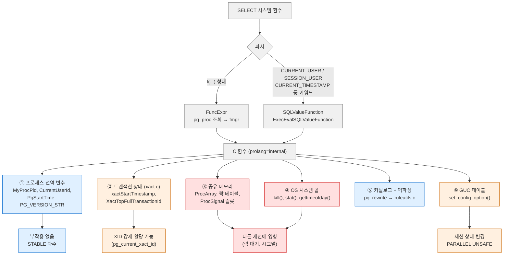
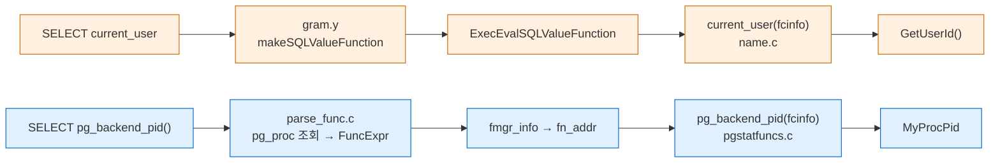
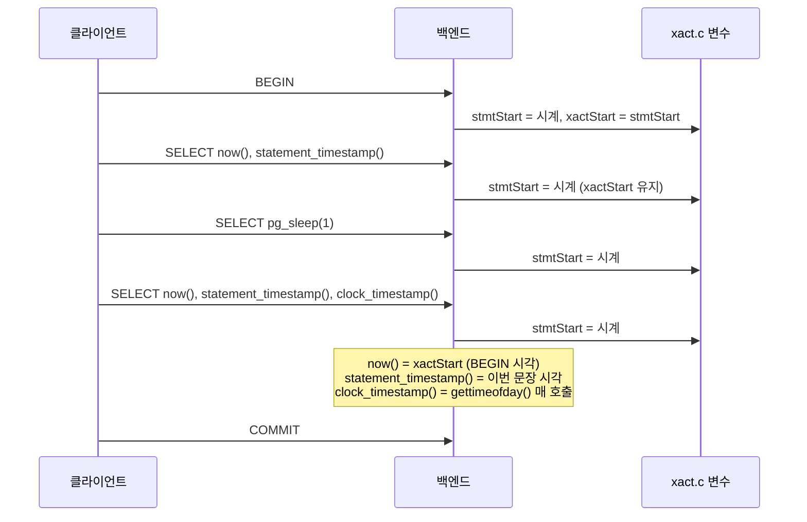
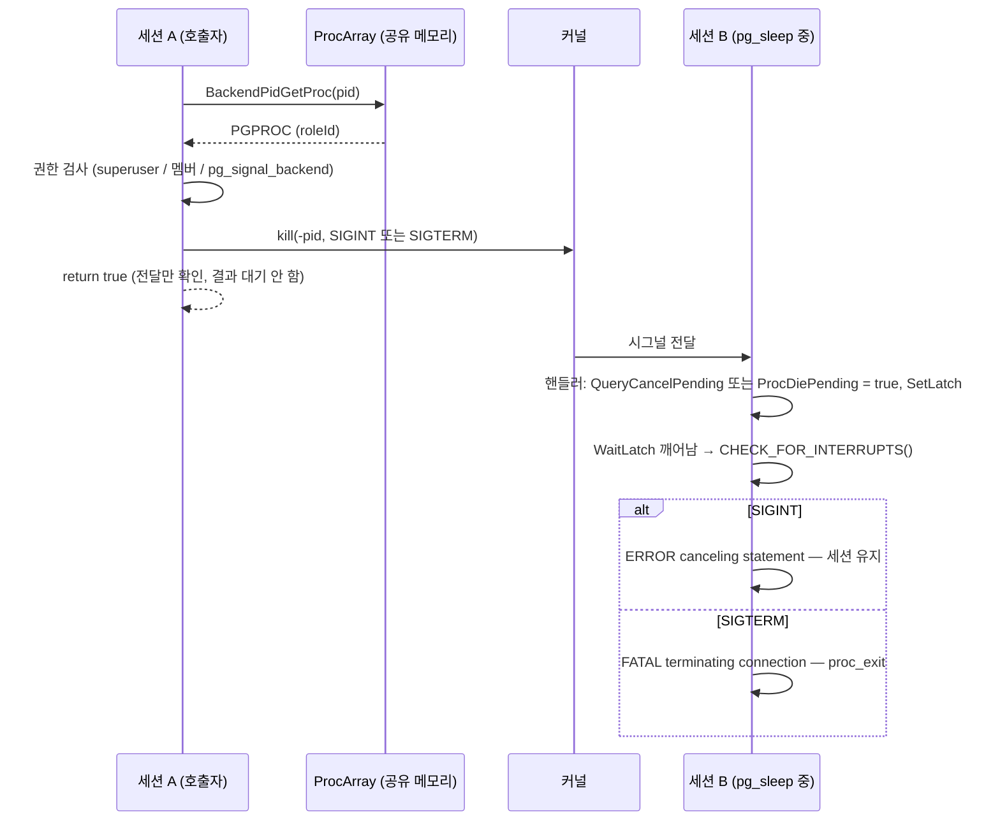
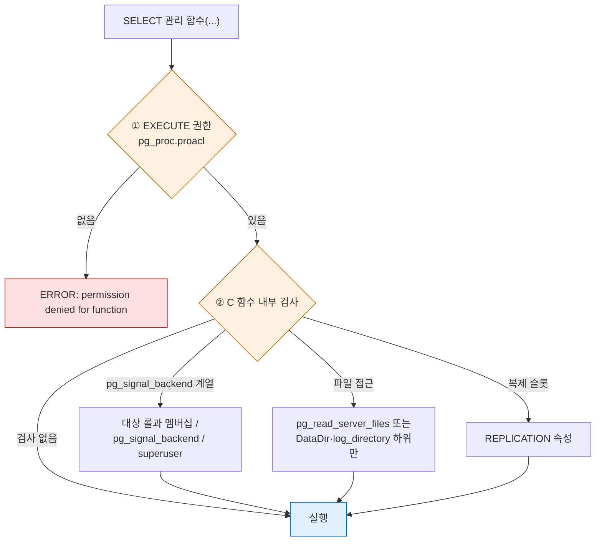

> **인덱스** [[PostgreSQL/INTERNALS/00-INDEX|내부 구조 분석서]]  ·  **이전** [[PostgreSQL/INTERNALS/07-FUNCTION-MANAGER|07. 함수 실행 구조 (fmgr)]]  ·  **다음** [[PostgreSQL/INTERNALS/09-FEATURES-EXTENSIBILITY|09. 지원 기능 총람과 확장성 아키텍처]]

# 08. 기본 제공 시스템 함수와 실행 경로

PostgreSQL이 기본 제공하는 **시스템 정보·관리 함수**를 분류별로 훑고, 대표 함수 15개가
SQL 호출에서 C 함수, 그리고 백엔드 전역 변수·트랜잭션 상태·락 매니저·OS 시스템 콜까지
어떻게 닿는지 소스(REL_18_STABLE)와 실증으로 따라간다.
문자열·날짜 같은 일반 내장 함수의 **사용법**은 [[PostgreSQL/05-FUNCTIONS|05. 내장 함수]]가 다룬다.
이 문서는 그 §7 "시스템 정보 함수"의 한 줄짜리 목록 **뒤에서 실제로 무슨 일이 일어나는가**에 집중한다.

모든 실증은 로컬 PostgreSQL 18.4 임시 클러스터에서 수행했다 (§10).
fmgr 호출 규약(`PG_FUNCTION_ARGS`, `Datum`, `FmgrInfo`) 자체는
[[PostgreSQL/INTERNALS/07-FUNCTION-MANAGER|07. 함수 실행 구조]]에서 설명했으므로 여기서는 반복하지 않는다.

## 0. 전체 지도

시스템 함수는 겉보기엔 평범한 함수지만, **값을 어디서 읽어 오는가**로 나누면 성격이 확연히 갈린다.
같은 `SELECT f()` 라도 어떤 것은 프로세스 전역 변수 하나를 돌려주고, 어떤 것은 다른 프로세스에
시그널을 쏘고, 어떤 것은 디스크 파일을 `stat()` 한다.



| 데이터 출처 | 대표 함수 | 다른 세션에 영향 | 전형적 분류 |
|---|---|---|---|
| ① 프로세스 전역 변수 | `pg_backend_pid`, `version`, `pg_postmaster_start_time` | 없음 | STABLE |
| ② 트랜잭션 상태 | `now`, `pg_current_xact_id`, `age` | XID 할당 시 간접 영향 | STABLE |
| ③ 공유 메모리 | `pg_blocking_pids`, `pg_advisory_lock` | 있음 (락 대기 유발) | VOLATILE |
| ④ OS 시스템 콜 | `pg_cancel_backend`, `pg_relation_size`, `clock_timestamp` | `kill()` 은 있음 | VOLATILE |
| ⑤ 카탈로그 역파싱 | `pg_get_viewdef`, `pg_get_functiondef` | 없음 | STABLE |
| ⑥ GUC | `current_setting`, `set_config` | 없음 (자기 세션만) | STABLE / VOLATILE |

## 1. 범위 — 05-FUNCTIONS 와의 경계

| 주제 | 05. 내장 함수 | 이 문서 |
|---|---|---|
| `now()` vs `clock_timestamp()` | 한 줄 설명 | 값이 저장되는 변수, 갱신 시점, 프로시저 COMMIT 시 동작 |
| `pg_backend_pid()` | 함수 이름만 | `MyProcPid` 대입 위치(fork 직후), PARALLEL RESTRICTED 의 이유 |
| `pg_size_pretty(pg_relation_size(...))` | 사용 예 | 파일 `stat()` 루프, 단위 전환 경계값 |
| `current_setting` / `set_config` | 사용 예 | GUC 컨텍스트(PGC_SUSET/USERSET), 트랜잭션 롤백 시 복원 |
| 시그널·권고 락·WAL·백업·파일 접근 | 없음 | 분류 총람 + 내부 경로 + 권한 모델 |

## 2. 분류 총람

공식 문서 [9.27 System Information Functions](https://www.postgresql.org/docs/18/functions-info.html),
[9.28 System Administration Functions](https://www.postgresql.org/docs/18/functions-admin.html),
통계 함수는 [27.2 Cumulative Statistics System](https://www.postgresql.org/docs/18/monitoring-stats.html) 기준.
함수 목록은 PG18 문서 HTML에서 함수명을 추출해 대조했고, 이 표는 그중 실무에서 자주 쓰는 것을 골랐다.
"내부 출처"는 §0의 ①~⑥.

### 2.1 세션 정보 (9.27.1)

| 함수 | 반환 | 내부 출처 | 비고 |
|---|---|---|---|
| `current_user` / `current_role` / `user` | name | ① `GetUserId()` | 괄호 없는 SQL 키워드 (§4) |
| `session_user` | name | ① `GetSessionUserId()` | `SET ROLE`·DEFINER 영향 없음 |
| `system_user` | text | ① 인증 방식:식별자 | PG16+ |
| `current_database()` / `current_catalog` | name | ① `MyDatabaseId` | |
| `current_schema` / `current_schemas(bool)` | name / name[] | 검색 경로 재계산 | **임시 스키마를 만들 수 있음** (§6.4) |
| `inet_client_addr/port()`, `inet_server_addr/port()` | inet / int | `MyProcPort` | Unix 소켓 접속이면 NULL |
| `pg_backend_pid()` | int | ① `MyProcPid` | §5.1 |
| `pg_blocking_pids(int)` | int[] | ③ 락 테이블 | §5.13 |
| `pg_safe_snapshot_blocking_pids(int)` | int[] | ③ | SERIALIZABLE READ ONLY DEFERRABLE 대기 |
| `pg_conf_load_time()` / `pg_postmaster_start_time()` | timestamptz | ① | 리로드 시 전자만 갱신 (V18) |
| `pg_current_logfile()` | text | 파일 | logging_collector 사용 시 |
| `pg_jit_available()` | bool | JIT 프로바이더 로드 가능 여부 | 이 빌드에서는 `f` |
| `pg_numa_available()` | bool | | **PG18 신규** |
| `pg_get_loaded_modules()` | setof record | | **PG18 신규** (`PG_MODULE_MAGIC_EXT`) |
| `pg_my_temp_schema()`, `pg_is_other_temp_schema(oid)` | oid / bool | | |
| `pg_listening_channels()`, `pg_notification_queue_usage()` | | LISTEN/NOTIFY | |
| `pg_trigger_depth()` | int | | 트리거 중첩 깊이 |
| `current_query()` | text | | 클라이언트가 보낸 현재 쿼리 문자열 |

### 2.2 접근 권한 조회 (9.27.2)

| 함수 | 용도 |
|---|---|
| `has_table_privilege(role, table, priv)` 외 `has_{any_column,column,database,foreign_data_wrapper,function,language,parameter,schema,sequence,server,tablespace,type}_privilege` | ACL 검사 결과를 bool로 |
| `has_largeobject_privilege` | **PG18 신규** |
| `pg_has_role(role, role, 'MEMBER'/'USAGE'/'SET')` | 롤 멤버십 |
| `row_security_active(table)` | RLS 적용 여부 |
| `acldefault`, `aclexplode`, `makeaclitem` | ACL 배열 해석·생성 |

이름으로 넘기면 없는 객체에서 에러, **OID로 넘기면 NULL** 이 돌아온다 (V20).
권한 체계 자체는 [[PostgreSQL/15-AUTHORITY|15. 권한 체계]] 참고.

### 2.3 스키마 가시성 (9.27.3)

`pg_table_is_visible`, `pg_type_is_visible`, `pg_function_is_visible`, `pg_operator_is_visible`,
`pg_opclass_is_visible`, `pg_opfamily_is_visible`, `pg_collation_is_visible`, `pg_conversion_is_visible`,
`pg_statistics_obj_is_visible`, `pg_ts_{config,dict,parser,template}_is_visible`.

"이 객체를 **스키마 한정 없이 이름만으로** 찾으면 이 객체가 나오는가"를 판정한다.
같은 이름이 검색 경로 앞쪽 스키마에 있으면 가려진다(V20: `search_path = s2, public` 이후 `public.big` 은 `f`).
psql `\dt` 가 기본으로 보이는 객체만 나열하는 것이 이 함수 덕분이다.

### 2.4 카탈로그 정보·객체 주소 (9.27.4~9.27.6)

| 함수 | 용도 | 내부 |
|---|---|---|
| `pg_get_viewdef`, `pg_get_ruledef` | 뷰·룰 SQL 복원 | `pg_rewrite.ev_action` 파스 트리 → `ruleutils.c` 역파싱 (§5.15) |
| `pg_get_functiondef`, `pg_get_function_arguments`, `pg_get_function_identity_arguments`, `pg_get_function_result` | 함수 정의 복원 | `pg_proc` |
| `pg_get_indexdef`, `pg_get_constraintdef`, `pg_get_triggerdef`, `pg_get_partkeydef`, `pg_get_statisticsobjdef`, `pg_get_expr` | 각 객체 DDL 복원 | 각 카탈로그의 노드 트리 |
| `pg_get_userbyid(oid)` | OID → 롤 이름 | 없는 OID면 `unknown (OID=0)` (V14) |
| `pg_get_serial_sequence`, `pg_get_owned_sequence` | 컬럼 소유 시퀀스 | `pg_depend` |
| `pg_typeof(any)`, `pg_basetype(regtype)`, `format_type(oid, typmod)` | 타입 정보 | §5.10 |
| `to_regclass`, `to_regproc`, `to_regtype`, `to_regrole` … | 이름 → OID, 없으면 NULL | |
| `pg_get_keywords()` | 파서 키워드 표 | `current_user` 는 `R`(reserved) |
| `pg_identify_object`, `pg_identify_object_as_address`, `pg_get_object_address`, `pg_describe_object` | (classid, objid, objsubid) ↔ 사람이 읽는 이름 | 이벤트 트리거·`pg_depend` 해석에 사용 |
| `pg_get_acl(classid, objid, objsubid)` | 객체 ACL 조회 | **PG18 신규** |
| `obj_description`, `col_description`, `shobj_description` | COMMENT 조회 | SQL 언어 래퍼 (`pg_description` SELECT) |
| `pg_input_is_valid`, `pg_input_error_info` | 입력 유효성 | PG16+, 05 문서 §8 |

PG18에서 NOT NULL 제약이 `pg_constraint` 에 저장되도록 바뀌어(공식 릴리스 노트),
`pg_get_constraintdef` 가 PK 외에 `NOT NULL id` 행도 돌려주는 것을 확인했다 (V14).

### 2.5 트랜잭션 ID·스냅샷 (9.27.8~9.27.9)

| 함수 | 반환 | 부작용 |
|---|---|---|
| `pg_current_xact_id()` | xid8 | **XID 미할당이면 할당** (§5.4) |
| `pg_current_xact_id_if_assigned()` | xid8 | 없음, 미할당이면 NULL |
| `pg_xact_status(xid8)` | text | `in progress` / `committed` / `aborted` |
| `pg_current_snapshot()`, `pg_snapshot_xmin/xmax/xip`, `pg_visible_in_snapshot` | pg_snapshot | |
| `age(xid)`, `mxid_age(xid)` | int | 기준점이 트랜잭션 내 고정 (§6.2) |
| `pg_get_multixact_members(xid)` | setof record | |
| `pg_xact_commit_timestamp`, `pg_last_committed_xact` | | `track_commit_timestamp=on` 필요 |
| `txid_current()` 등 `txid_*` | int8 | 구 API. 같은 C 함수 (`prosrc = pg_current_xact_id`) |

`txid_current` 와 `pg_current_xact_id` 는 `pg_proc.prosrc` 가 같다 — 반환 타입 선언만 `int8` / `xid8` 로 다르다 (V1).

### 2.6 객체 크기·위치 (9.28.7)

| 함수 | 포함 범위 |
|---|---|
| `pg_relation_size(rel [, fork])` | 한 포크(main/fsm/vm/init)의 파일 크기 합 |
| `pg_table_size(rel)` | main + fsm + vm + TOAST(인덱스 포함), 인덱스 제외 |
| `pg_indexes_size(rel)` | 테이블에 붙은 모든 인덱스 |
| `pg_total_relation_size(rel)` | `pg_table_size + pg_indexes_size` |
| `pg_database_size`, `pg_tablespace_size` | 디렉토리 전체 |
| `pg_column_size`, `pg_column_compression`, `pg_column_toast_chunk_id` | 값 하나 |
| `pg_size_pretty`, `pg_size_bytes` | 단위 변환 |
| `pg_relation_filenode`, `pg_relation_filepath`, `pg_filenode_relation` | 파일 ↔ 릴레이션 |
| `pg_partition_tree`, `pg_partition_ancestors`, `pg_partition_root` | 파티션 계층 |

V7에서 `pg_table_size = main+fsm+vm+toast`, `pg_total_relation_size = table+indexes` 가 등식으로 성립함을 확인했다.
파일 배치는 [[PostgreSQL/INTERNALS/03-STORAGE|03. 물리 저장 구조]] 참고.

### 2.7 설정 (9.28.1)

`current_setting(name [, missing_ok])`, `set_config(name, value, is_local)`. 내부는 §5.11.

### 2.8 서버 시그널 (9.28.2)

| 함수 | 보내는 것 | 대상 | 기본 EXECUTE |
|---|---|---|---|
| `pg_cancel_backend(pid)` | `SIGINT` | 백엔드 (프로세스 그룹) | PUBLIC (내부 검사 있음) |
| `pg_terminate_backend(pid, timeout)` | `SIGTERM` | 백엔드 (프로세스 그룹) | PUBLIC (내부 검사 있음) |
| `pg_reload_conf()` | `SIGHUP` | postmaster | superuser만 |
| `pg_rotate_logfile()` | `PMSIGNAL_ROTATE_LOGFILE` | postmaster → syslogger | superuser만 |
| `pg_log_backend_memory_contexts(pid)` | `PROCSIG_LOG_MEMORY_CONTEXT` (ProcSignal) | 백엔드·보조 프로세스 | superuser만 |

PG18 변경: `pg_log_backend_memory_contexts()` 출력의 level이 **1부터** 시작하도록 바뀌었다(릴리스 노트, V18 로그에서 `level: 1; TopMemoryContext` 확인).
PG18 신규 사전 정의 롤 `pg_signal_autovacuum_worker` 로 autovacuum 워커에 시그널을 보낼 수 있게 되었다 (§5.5 소스에 분기 있음).

### 2.9 WAL·백업·복구 (9.28.3~9.28.4)

| 함수 | 용도 |
|---|---|
| `pg_current_wal_lsn()`, `pg_current_wal_insert_lsn()`, `pg_current_wal_flush_lsn()` | 쓰기/삽입/플러시 위치 |
| `pg_walfile_name(lsn)`, `pg_walfile_name_offset(lsn)`, `pg_split_walfile_name(text)` | LSN ↔ 세그먼트 파일명 |
| `pg_wal_lsn_diff(lsn, lsn)` | 바이트 차이 |
| `pg_switch_wal()` | 현재 세그먼트 강제 종료 |
| `pg_create_restore_point(name)` | PITR 목표 지점 기록 |
| `pg_backup_start(label, fast)` / `pg_backup_stop(wait)` | 비배타적 백업 (PG15+ 이름) |
| `pg_is_in_recovery()`, `pg_last_wal_receive_lsn()`, `pg_last_wal_replay_lsn()`, `pg_last_xact_replay_timestamp()` | 스탠바이 상태 |
| `pg_wal_replay_pause/resume()`, `pg_get_wal_replay_pause_state()`, `pg_promote()` | 복구 제어 |
| `pg_control_checkpoint()`, `pg_control_system()`, `pg_control_init()`, `pg_control_recovery()` | `pg_control` 파일 내용 |
| `pg_available_wal_summaries()`, `pg_wal_summary_contents()`, `pg_get_wal_summarizer_state()` | WAL 요약 (증분 백업, PG17+) |
| `pg_export_snapshot()`, `pg_log_standby_snapshot()` | 스냅샷 공유 |

`pg_backup_start` 는 **호출한 세션에 묶인다**. 세션을 끊고 다른 세션에서 `pg_backup_stop` 을 부르면
`backup is not in progress` 에러 (V19). WAL 구조는 [[PostgreSQL/INTERNALS/04-MVCC-WAL|04. 트랜잭션·MVCC·WAL 내부]].

### 2.10 복제 슬롯·복제 원점 (9.28.6)

`pg_create_physical_replication_slot`, `pg_create_logical_replication_slot`, `pg_drop_replication_slot`,
`pg_copy_*_replication_slot`, `pg_replication_slot_advance`, `pg_logical_slot_{get,peek}_[binary_]changes`,
`pg_replication_origin_*`, `pg_logical_emit_message`, `pg_sync_replication_slots`.

슬롯 생성 함수는 EXECUTE가 PUBLIC이지만 C 함수 안에서 REPLICATION 속성을 다시 검사한다 —
일반 롤로 호출하면 `permission denied to use replication slots` (V21).

### 2.11 권고 락 (9.28.10)

| 함수 | 범위 | 대기 | 모드 |
|---|---|---|---|
| `pg_advisory_lock(key)` / `(k1, k2)` | 세션 | 대기 | Exclusive |
| `pg_advisory_lock_shared` | 세션 | 대기 | Share |
| `pg_try_advisory_lock[_shared]` | 세션 | 즉시 bool | |
| `pg_advisory_xact_lock[_shared]` | 트랜잭션 | 대기 | |
| `pg_try_advisory_xact_lock[_shared]` | 트랜잭션 | 즉시 bool | |
| `pg_advisory_unlock[_shared]`, `pg_advisory_unlock_all()` | 세션 락 해제 | | |

내부는 §5.12. PG18 문서에서 이 절이 9.28.10으로 관리 함수 장 안에 있다.

### 2.12 통계 (27.2)

| 함수 | 용도 | 기본 EXECUTE |
|---|---|---|
| `pg_stat_reset()`, `pg_stat_reset_shared(text)`, `pg_stat_reset_single_table_counters(oid)`, `pg_stat_reset_single_function_counters(oid)`, `pg_stat_reset_slru`, `pg_stat_reset_replication_slot`, `pg_stat_reset_subscription_stats` | 누적 통계 초기화 | superuser만 |
| `pg_stat_reset_backend_stats(pid)` | 백엔드별 통계 초기화 | superuser만, **PG18 신규** |
| `pg_stat_get_backend_io(pid)`, `pg_stat_get_backend_wal(pid)` | 백엔드별 I/O·WAL 통계 | **PG18 신규** |
| `pg_stat_clear_snapshot()` | 트랜잭션 내 통계 캐시 폐기 | |
| `pg_stat_get_activity(pid)`, `pg_stat_get_backend_*` | `pg_stat_activity` 의 원천 | |

`pg_stat_activity` 는 트랜잭션 안에서 **처음 읽을 때의 내용이 끝까지 유지**된다 — 공식 문서 27.2는 이를 버그가 아닌 의도된 기능으로 설명한다(여러 통계를 같은 시점 기준으로 맞춰 보기 위함).
V5에서 같은 트랜잭션에서 XID를 할당한 뒤에도 `backend_xid` 가 비어 보이다가 `pg_stat_clear_snapshot()` 뒤에야 보이는 것을 확인했다.

### 2.13 파일 접근 (9.28.9)

`pg_ls_dir`, `pg_ls_logdir`, `pg_ls_waldir`, `pg_ls_tmpdir`, `pg_ls_archive_statusdir`, `pg_ls_logicalmapdir`,
`pg_ls_logicalsnapdir`, `pg_ls_replslotdir`, `pg_ls_summariesdir`(**PG18 신규**), `pg_read_file`, `pg_read_binary_file`, `pg_stat_file`.

**2단 권한**: EXECUTE ACL(기본 superuser만, `pg_ls_waldir/logdir` 은 `pg_monitor` 에도 부여) → 통과해도
`convert_and_check_filename()` 이 경로를 검사한다. 자세히는 §7.

### 2.14 PG18 신규·변경 함수 요약 (공식 릴리스 노트 확인분)

| 구분 | 함수 |
|---|---|
| 신규 | `pg_get_acl()`, `has_largeobject_privilege()`, `pg_ls_summariesdir()`, `pg_get_loaded_modules()`, `pg_numa_available()`, `pg_stat_get_backend_io()`, `pg_stat_get_backend_wal()`, `pg_stat_reset_backend_stats()`, `pg_restore_relation_stats()` / `pg_restore_attribute_stats()` / `pg_clear_relation_stats()` / `pg_clear_attribute_stats()` |
| 변경 | `pg_log_backend_memory_contexts()` level 1부터 시작, `pg_backend_memory_contexts` 뷰에 `type`·`path` 추가·`parent` 제거 |
| 관련 롤 | `pg_signal_autovacuum_worker` 신규 |
| (일반 함수, 참고) | `uuidv7()`, `uuidv4()`, `casefold()`, `array_sort()`, `array_reverse()`, `crc32()`, `crc32c()`, `gamma()`, `lgamma()` — 이 문서 범위 밖 |

## 3. pg_proc 에서 본 시스템 함수

### 3.1 숫자로 본 pg_catalog 함수

18.4 initdb 직후 `pg_catalog` 의 함수 분포 (V1).

| 언어 | 개수 |
|---|---|
| internal (백엔드에 정적 링크된 C 함수) | 3263 |
| c (`$libdir/*` 공유 라이브러리, 예: `cyrillic_and_mic` 인코딩 변환) | 89 |
| sql | 50 |
| 합계 | 3402 (`pg_` 접두 447) |

| provolatile | proparallel | 개수 |
|---|---|---|
| i (IMMUTABLE) | s | 2455 |
| s (STABLE) | s | 524 |
| s | r (RESTRICTED) | 134 |
| s | u (UNSAFE) | 6 |
| v (VOLATILE) | s | 128 |
| v | r | 68 |
| v | u | 87 |

IMMUTABLE 은 전부 PARALLEL SAFE. 시스템 함수는 대부분 **STABLE/VOLATILE 이면서 RESTRICTED/UNSAFE** 쪽에 몰려 있다.

### 3.2 대표 함수의 pg_proc 행 (V1)

```sql
SELECT oid, proname, prosrc, provolatile v, proparallel p, proisstrict s, prolang
FROM pg_proc WHERE proname IN (...) ORDER BY proname;
```

| oid | proname | prosrc (C 심볼) | v | p | strict | lang |
|---|---|---|---|---|---|---|
| 2026 | pg_backend_pid | `pg_backend_pid` | s | r | t | internal |
| 745 | current_user | `current_user` | s | s | t | internal |
| 746 | session_user | `session_user` | s | s | t | internal |
| 1299 | now | `now` | s | s | t | internal |
| 2647 | transaction_timestamp | `now` | s | s | t | internal |
| 2648 | statement_timestamp | `statement_timestamp` | s | s | t | internal |
| 2649 | clock_timestamp | `clock_timestamp` | **v** | s | t | internal |
| 5059 | pg_current_xact_id | `pg_current_xact_id` | s | **u** | t | internal |
| 5060 | pg_current_xact_id_if_assigned | `pg_current_xact_id_if_assigned` | s | u | t | internal |
| 2943 | txid_current | `pg_current_xact_id` | s | u | t | internal |
| 2171 | pg_cancel_backend | `pg_cancel_backend` | v | s | t | internal |
| 2096 | pg_terminate_backend(pid, timeout) | `pg_terminate_backend` | v | s | t | internal |
| 2325 | pg_relation_size(regclass) | *(빈 문자열, SQL 본문)* | v | s | t | **sql** |
| 2332 | pg_relation_size(regclass, text) | `pg_relation_size` | v | s | t | internal |
| 2288 | pg_size_pretty(bigint) | `pg_size_pretty` | **i** | s | t | internal |
| 89 | version | `pgsql_version` | s | s | t | internal |
| 1619 | pg_typeof("any") | `pg_typeof` | s | s | **f** | internal |
| 2077 | current_setting(text) | `show_config_by_name` | s | s | t | internal |
| 3294 | current_setting(text, bool) | `show_config_by_name_missing_ok` | s | s | t | internal |
| 2078 | set_config | `set_config_by_name` | v | **u** | **f** | internal |
| 2880 | pg_advisory_lock(bigint) | `pg_advisory_lock_int8` | v | r | t | internal |
| 2886 | pg_advisory_lock(int, int) | `pg_advisory_lock_int4` | v | r | t | internal |
| 2561 | pg_blocking_pids | `pg_blocking_pids` | v | s | t | internal |
| 2626 | pg_sleep | `pg_sleep` | v | s | t | internal |
| 1641 | pg_get_viewdef(oid) | `pg_get_viewdef` | s | r | t | internal |
| 1402 | current_schema | `current_schema` | s | **u** | t | internal |

관찰 포인트:

- **`proname` ≠ `prosrc`** 인 경우가 많다. `version` → `pgsql_version`, `current_setting` → `show_config_by_name`,
  `transaction_timestamp` 와 `now` 는 같은 C 함수 `now`. 오버로드는 `_int8`/`_int4`, `_ext`, `_name` 접미사로 C 심볼을 구분한다.
- `pg_relation_size(regclass)` 는 `prolang = sql` 이고 `prosrc` 가 비어 있다. 본문은 `prosqlbody` 에 있으며
  정의는 `src/backend/catalog/system_functions.sql`:

```sql
CREATE OR REPLACE FUNCTION pg_relation_size(regclass)
 RETURNS bigint
 LANGUAGE sql
 PARALLEL SAFE STRICT COST 1
RETURN pg_relation_size($1, 'main');
```

  플래너가 이 SQL 함수를 **인라인**하므로 `EXPLAIN VERBOSE` 에는 2인자 버전이 그대로 보인다 (V7: `Output: pg_relation_size('big'::regclass, 'main'::text)`).
- `pg_terminate_backend` 의 `timeout DEFAULT 0` 도 같은 파일에서 `CREATE OR REPLACE FUNCTION ... LANGUAGE INTERNAL` 로 덮어써 붙인 것이다
  (`pg_proc.dat` 만으로는 기본값을 표현하기 번거롭기 때문으로 보인다 — 추정).
- C 심볼은 헤더에 그대로 있다: `utils/fmgroids.h` 의 `#define F_PG_BACKEND_PID 2026`, `utils/fmgrprotos.h` 의
  `extern Datum pg_backend_pid(PG_FUNCTION_ARGS);`. 이 OID→함수포인터 매핑이 `fmgr_builtins[]` 이다
  ([[PostgreSQL/INTERNALS/07-FUNCTION-MANAGER|07]] 참고).

## 4. 실행 경로의 두 갈래 — FuncExpr 와 SQLValueFunction

`current_user` 에는 괄호를 붙일 수 없다.

```sql
SELECT current_user();
-- ERROR:  syntax error at or near "("
```

`CURRENT_USER`, `SESSION_USER`, `CURRENT_ROLE`, `USER`, `CURRENT_CATALOG`, `CURRENT_SCHEMA`,
`CURRENT_DATE/TIME/TIMESTAMP`, `LOCALTIME/LOCALTIMESTAMP` 는 SQL 표준 **키워드**이고, 문법(`gram.y`)이
함수 호출이 아니라 `SQLValueFunction` 노드를 만든다.

```c
/* src/backend/parser/gram.y (REL_18_STABLE) */
			| CURRENT_USER
				{
					$$ = makeSQLValueFunction(SVFOP_CURRENT_USER, -1, @1);
				}
			| SESSION_USER
				{
					$$ = makeSQLValueFunction(SVFOP_SESSION_USER, -1, @1);
				}
			| SYSTEM_USER
				{
					$$ = (Node *) makeFuncCall(SystemFuncName("system_user"),
											   NIL,
											   COERCE_SQL_SYNTAX,
```

`SYSTEM_USER`(PG16+)는 같은 키워드 계열이지만 일반 `FuncCall` 로 바뀌어 `pg_proc` 을 경유한다.
`SQLValueFunction` 은 실행기에서 `ExecEvalSQLValueFunction()` 이 **C 함수를 직접 호출**한다 — `pg_proc` 조회도, `FmgrInfo` 도 없다.

```c
/* src/backend/executor/execExprInterp.c */
		case SVFOP_CURRENT_ROLE:
		case SVFOP_CURRENT_USER:
		case SVFOP_USER:
			InitFunctionCallInfoData(*fcinfo, NULL, 0, InvalidOid, NULL, NULL);
			*op->resvalue = current_user(fcinfo);
			*op->resnull = fcinfo->isnull;
			break;
		case SVFOP_SESSION_USER:
			InitFunctionCallInfoData(*fcinfo, NULL, 0, InvalidOid, NULL, NULL);
			*op->resvalue = session_user(fcinfo);
			...
		case SVFOP_CURRENT_TIMESTAMP:
		case SVFOP_CURRENT_TIMESTAMP_N:
			*op->resvalue = TimestampTzGetDatum(GetSQLCurrentTimestamp(svf->typmod));
			break;
```

`EXPLAIN VERBOSE` 에서 두 경로가 구분된다 (V3).

```text
Output: CURRENT_USER, SESSION_USER, CURRENT_SCHEMA, "current_schema"(), now(), CURRENT_TIMESTAMP
```

대문자 `CURRENT_SCHEMA` 는 키워드 경로, `"current_schema"()` 는 괄호를 붙여 `pg_proc` 의 함수(oid 1402)를 부른 경로다.
결과 값은 같다 — 두 경로 모두 끝에서 같은 C 함수 `current_schema()` 에 도달한다.



## 5. 대표 함수별 내부 실행 경로

각 절은 **pg_proc 행 → C 함수·소스 파일 → 핵심 로직 → 관찰 가능한 부작용 → 분류의 이유** 순서.
소스 인용은 github.com/postgres/postgres `REL_18_STABLE` 브랜치.

### 5.1 `pg_backend_pid()` — 전역 변수 하나

| 항목 | 값 |
|---|---|
| pg_proc | oid 2026, `s` / `r` / strict |
| C 함수 | `pg_backend_pid` — `src/backend/utils/adt/pgstatfuncs.c` |
| 읽는 값 | 전역 `int MyProcPid` (`src/backend/utils/init/globals.c`, 헤더 `miscadmin.h`) |

```c
/* src/backend/utils/adt/pgstatfuncs.c */
Datum
pg_backend_pid(PG_FUNCTION_ARGS)
{
	PG_RETURN_INT32(MyProcPid);
}
```

`MyProcPid` 는 postmaster가 자식을 만드는 `fork_process()` 에서 **fork 직후 자식 쪽에서** 대입된다.

```c
/* src/backend/postmaster/fork_process.c */
	sigprocmask(SIG_SETMASK, &BlockSig, &save_mask);
	result = fork();
	if (result == 0)
	{
		/* fork succeeded, in child */
		MyProcPid = getpid();
```

즉 이 함수가 돌려주는 값은 **OS 프로세스 ID 그 자체**다. 프로세스-당-연결 모델이므로
PID = 세션 식별자로 쓸 수 있다 ([[PostgreSQL/INTERNALS/02-PROCESS-MEMORY|02. 프로세스·메모리 아키텍처]]).

**실증 (V2)** — 세션 하나가 `pg_sleep(2)` 하는 동안 `ps` 로 확인:

```text
backend_pid=16549                                  ← SELECT pg_backend_pid()
16549 26625 postgres: postgres postgres 127.0.0.1(54691) SELECT   ← ps: PID, PPID(postmaster)
16549|client backend|Timeout|PgSleep|active|select pg_sleep(2)    ← pg_stat_activity
```

PPID 26625 는 `$PGDATA/postmaster.pid` 첫 줄의 postmaster PID와 일치했다.

**분류의 이유**

- **STABLE**: 한 세션 안에서는 바뀌지 않지만, 세션마다 다르다. IMMUTABLE 로 두면 뷰·인덱스 식·플랜 캐시에 상수로 접혀 다른 세션에서 틀린 값이 된다.
- **PARALLEL RESTRICTED**: 병렬 워커는 별도 프로세스라 각자의 `MyProcPid` 를 가진다. 공식 문서(15.4.1)는 "backend-local state that the system cannot synchronize across workers" 에 접근하는 함수를 RESTRICTED 로 표시하라고 한다.
  실제로 같은 본문을 **PARALLEL SAFE 로 거짓 선언**한 함수를 병렬 스캔에 넣으면 세 개의 서로 다른 PID가 나온다 (V16).

```sql
CREATE FUNCTION pid_lying() RETURNS int LANGUAGE plpgsql VOLATILE PARALLEL SAFE
AS $$ BEGIN RETURN pg_backend_pid(); END $$;

SELECT pid_lying() p, count(*) FROM big GROUP BY 1;   -- 병렬 강제 설정 하
```

```text
   p   | count
-------+-------
 56700 | 40630     ← 리더
 56703 | 29688     ← 워커 0
 56704 | 29682     ← 워커 1
```

정직한 `pg_backend_pid()` 를 쓰면 같은 쿼리가 리더 PID 하나(100000건)만 돌려준다.

### 5.2 `current_user` vs `session_user` — 세 개의 사용자 ID

| 항목 | 값 |
|---|---|
| pg_proc | 745 / 746, `s` / `s` |
| C 함수 | `current_user`, `session_user` — `src/backend/utils/adt/name.c` |
| 읽는 값 | `CurrentUserId` / `SessionUserId` (`src/backend/utils/init/miscinit.c`) |

```c
/* src/backend/utils/adt/name.c */
Datum
current_user(PG_FUNCTION_ARGS)
{
	PG_RETURN_DATUM(DirectFunctionCall1(namein, CStringGetDatum(GetUserNameFromId(GetUserId(), false))));
}

Datum
session_user(PG_FUNCTION_ARGS)
{
	PG_RETURN_DATUM(DirectFunctionCall1(namein, CStringGetDatum(GetUserNameFromId(GetSessionUserId(), false))));
}
```

```c
/* src/backend/utils/init/miscinit.c */
Oid
GetUserId(void)
{
	Assert(OidIsValid(CurrentUserId));
	return CurrentUserId;
}
...
Oid
GetSessionUserId(void)
{
	Assert(OidIsValid(SessionUserId));
	return SessionUserId;
}
```

`miscinit.c` 에는 세 번째로 `OuterUserId`(`GetOuterUserId`) 도 있다. 바뀌는 시점:

| 사건 | `SessionUserId` | `OuterUserId` | `CurrentUserId` |
|---|---|---|---|
| 접속 (인증) | 접속 롤 | 접속 롤 | 접속 롤 |
| `SET SESSION AUTHORIZATION x` (최초 세션 사용자가 superuser일 때) | x | x | x |
| `SET ROLE y` | 유지 | y | y |
| SECURITY DEFINER 함수 진입 | 유지 | 유지 | 함수 소유자 |

`SET ROLE` 은 `SetCurrentRoleId()` → `SetOuterUserId()` 를 부르고, 이 함수가 두 변수를 함께 바꾼다
(`SET SESSION AUTHORIZATION` 의 `SetSessionAuthorization()` 도 내부에서 `SetOuterUserId()` 를 호출):

```c
/* src/backend/utils/init/miscinit.c */
static void
SetOuterUserId(Oid userid, bool is_superuser)
{
	...
	OuterUserId = userid;

	/* We force the effective user ID to match, too */
	CurrentUserId = userid;
```

DEFINER 함수 진입은 `SetUserIdAndSecContext()` 로 `CurrentUserId` 만 바꾸므로 함수가 끝나면 `OuterUserId` 로 되돌아갈 수 있다.

**실증 (V3)**

```text
alice 접속, DEFINER 함수(소유자 bob) 호출:
 current_user | session_user | current_role | user  | who_definer
 alice        | alice        | alice        | alice | bob / alice

postgres 접속 후 SET ROLE bob:
 current_user | session_user | current_role
 bob          | postgres     | bob

SET SESSION AUTHORIZATION alice:
 current_user | session_user
 alice        | alice
```

권한 검사는 언제나 `GetUserId()`(= current_user) 기준이다. 감사 로그에 "누가 접속했는가"를 남기려면 `session_user` 를 써야 하는 이유가 여기 있다.
DEFINER 문맥 전환은 [[PostgreSQL/15-AUTHORITY|15. 권한 체계]] §6.2.

**분류의 이유**: 한 문장 실행 중에는 바뀌지 않지만 `SET ROLE` 로 문장 사이에 바뀌므로 STABLE.
값은 프로세스 로컬이지만 병렬 워커가 시작할 때 리더의 사용자 ID 3종을 그대로 복원하므로 SAFE 로 둘 수 있다:

```c
/* src/backend/access/transam/parallel.c — ParallelWorkerMain() */
	SetAuthenticatedUserId(fps->authenticated_user_id);
	SetSessionAuthorization(fps->session_user_id,
							fps->session_user_is_superuser);
	SetCurrentRoleId(fps->outer_user_id, fps->role_is_superuser);
	...
	SetUserIdAndSecContext(fps->current_user_id, fps->sec_context);
```

`pg_backend_pid` 와 대조된다 — PID 는 "복원"할 수 없는 값이라 RESTRICTED 다.

### 5.3 `now()` / `transaction_timestamp()` / `statement_timestamp()` / `clock_timestamp()`

| 함수 | C 함수 | 읽는 값 | 갱신 시점 | volatility |
|---|---|---|---|---|
| `now()`, `transaction_timestamp()`, `CURRENT_TIMESTAMP` | `now` / `GetSQLCurrentTimestamp` | `xactStartTimestamp` (xact.c static) | 트랜잭션 시작 | STABLE |
| `statement_timestamp()` | `statement_timestamp` | `stmtStartTimestamp` | 클라이언트 명령 메시지 수신 | STABLE |
| `clock_timestamp()` | `clock_timestamp` | `gettimeofday()` | 호출할 때마다 | VOLATILE |

```c
/* src/backend/utils/adt/timestamp.c */
Datum
now(PG_FUNCTION_ARGS)
{
	PG_RETURN_TIMESTAMPTZ(GetCurrentTransactionStartTimestamp());
}

Datum
statement_timestamp(PG_FUNCTION_ARGS)
{
	PG_RETURN_TIMESTAMPTZ(GetCurrentStatementStartTimestamp());
}

Datum
clock_timestamp(PG_FUNCTION_ARGS)
{
	PG_RETURN_TIMESTAMPTZ(GetCurrentTimestamp());
}
...
TimestampTz
GetCurrentTimestamp(void)
{
	TimestampTz result;
	struct timeval tp;

	gettimeofday(&tp, NULL);
```

`xactStartTimestamp` 는 트랜잭션 시작(`StartTransaction`) 때 **새로 시계를 읽지 않고** 첫 문장의 `stmtStartTimestamp` 를 복사한다.
예외가 프로시저 안에서 COMMIT 으로 시작된 새 트랜잭션(nonatomic SPI)이다.

```c
/* src/backend/access/transam/xact.c — StartTransaction() */
	/*
	 * set transaction_timestamp() (a/k/a now()).  Normally, we want this to
	 * be the same as the first command's statement_timestamp(), so don't do a
	 * fresh GetCurrentTimestamp() call (which'd be expensive anyway).  But
	 * for transactions started inside procedures (i.e., nonatomic SPI
	 * contexts), we do need to advance the timestamp.  ...
	 */
	if (!IsParallelWorker())
	{
		if (!SPI_inside_nonatomic_context())
			xactStartTimestamp = stmtStartTimestamp;
		else
			xactStartTimestamp = GetCurrentTimestamp();
	}
```

`stmtStartTimestamp` 는 `SetCurrentStatementStartTimestamp()` 가 `GetCurrentTimestamp()` 로 채운다(병렬 워커 제외).



**실증 (V4)** — 한 트랜잭션 안 `pg_sleep` 전후, 그리고 한 문장 안에서 `pg_sleep(0.5)` 전후:

```text
   s   |     now_     |     xact     |     stmt     |    clock
 stmt1 | 23:33:51.409 | 23:33:51.409 | 23:33:51.409 | 23:33:51.416

   s   |     now_     |     stmt     |   clock_a    | pg_sleep |   clock_b
 stmt3 | 23:33:51.409 | 23:33:52.417 | 23:33:52.417 |          | 23:33:52.918
```

- `now()` 는 1.5초가 흘러도 그대로, `statement_timestamp()` 는 문장마다 전진, `clock_timestamp()` 는 **같은 행 안에서도** 0.5초 차이.
- 10만 행 한 문장에서 `count(distinct ...)`: `now()` 1개, `statement_timestamp()` 1개, `clock_timestamp()` 2624개.
- 프로시저 안 `COMMIT` 후: `now 전진=t / statement_timestamp 전진=f` — 위 `SPI_inside_nonatomic_context()` 분기 그대로 (V4b).
  `statement_timestamp()` 는 "클라이언트의 최신 명령 메시지 수신 시각"(공식 문서 9.9.5)이라 `CALL` 하나 동안 바뀌지 않는다.

**분류의 이유와 플래너 영향 (V15)** — STABLE 은 "한 문장 안에서 같은 인자면 같은 결과"이므로 플래너가
**인덱스 조건의 비교값**으로 쓸 수 있다. VOLATILE 은 행마다 다를 수 있으니 필터로만 쓴다.

```text
WHERE ts > now() - interval '5 min'
 Index Only Scan using ev_ts_idx on ev
   Index Cond: (ts > (now() - '00:05:00'::interval))

WHERE ts > clock_timestamp() - interval '5 min'
 Gather
   ->  Parallel Seq Scan on ev
         Filter: (ts > (clock_timestamp() - '00:05:00'::interval))
```

둘 다 IMMUTABLE 이 아니므로 인덱스 식에는 쓸 수 없다: `CREATE INDEX ON big ((now()))` →
`functions in index expression must be marked IMMUTABLE`.

### 5.4 `pg_current_xact_id()` — 읽기 함수가 XID 를 만든다

| 항목 | 값 |
|---|---|
| pg_proc | 5059, `s` / **`u`** / strict, 반환 `xid8` |
| C 함수 | `pg_current_xact_id` — `src/backend/utils/adt/xid8funcs.c` |
| 핵심 | `GetTopFullTransactionId()` → 미할당이면 `AssignTransactionId()` |

```c
/* src/backend/utils/adt/xid8funcs.c */
Datum
pg_current_xact_id(PG_FUNCTION_ARGS)
{
	/*
	 * Must prevent during recovery because if an xid is not assigned we try
	 * to assign one, which would fail. Programs already rely on this function
	 * to always return a valid current xid, so we should not change this to
	 * return NULL or similar invalid xid.
	 */
	PreventCommandDuringRecovery("pg_current_xact_id()");

	PG_RETURN_FULLTRANSACTIONID(GetTopFullTransactionId());
}

Datum
pg_current_xact_id_if_assigned(PG_FUNCTION_ARGS)
{
	FullTransactionId topfxid = GetTopFullTransactionIdIfAny();

	if (!FullTransactionIdIsValid(topfxid))
		PG_RETURN_NULL();

	PG_RETURN_FULLTRANSACTIONID(topfxid);
}
```

```c
/* src/backend/access/transam/xact.c */
FullTransactionId
GetTopFullTransactionId(void)
{
	if (!FullTransactionIdIsValid(XactTopFullTransactionId))
		AssignTransactionId(&TopTransactionStateData);
	return XactTopFullTransactionId;
}
```

PostgreSQL은 **XID 를 지연 할당**한다 — 읽기만 하는 트랜잭션은 가상 XID(vxid)만 갖고, 첫 쓰기에서야 실제 XID를 받는다
([[PostgreSQL/INTERNALS/04-MVCC-WAL|04]]). `pg_current_xact_id()` 는 이 지연을 깨고 즉시 할당시킨다.

**실증 (V5)**

```text
BEGIN;
 before | xidlock          ← pg_current_xact_id_if_assigned(), pg_locks transactionid 건수
        |       0
SELECT pg_current_xact_id();   → 770
 after | xidlock |     st
   770 |       1 | in progress   ← XID 할당과 동시에 자기 XID에 대한 transactionid 락 획득
ROLLBACK;

-- 읽기 전용 트랜잭션도 XID 를 소비한다
pg_snapshot_xmax(pg_current_snapshot())  772 → BEGIN READ ONLY; SELECT pg_current_xact_id(); COMMIT; → 773
```

부작용 정리:

| 부작용 | 영향 |
|---|---|
| XID 1개 소비 | wraparound 까지의 여유를 갉아먹음 (모니터링 쿼리에서 남발 금지) |
| 자기 XID 에 대한 `transactionid` ExclusiveLock | 다른 세션이 이 트랜잭션 종료를 기다릴 수 있는 대상이 됨 |
| 스냅샷의 xmin 계산 대상 | 오래 열어 두면 VACUUM 정리 지연 |
| 스탠바이에서 에러 | `PreventCommandDuringRecovery` (소스 확인, 스탠바이 실증은 안 함) |

**분류의 이유**: 한 트랜잭션 안에서 값이 고정이므로 STABLE. 그러나 XID 할당은 트랜잭션 상태 변경이라
병렬 모드에서 금지되어 있다 — `AssignTransactionId()` 첫머리:

```c
	if (IsInParallelMode() || IsParallelWorker())
		ereport(ERROR,
				(errcode(ERRCODE_INVALID_TRANSACTION_STATE),
				 errmsg("cannot assign transaction IDs during a parallel operation")));
```

그래서 PARALLEL UNSAFE 이고, 쿼리 어디에든 들어가면 **병렬 계획 자체가 꺼진다** (V15: 타겟 리스트에만 있어도 `Gather` 없음).
`_if_assigned` 도 UNSAFE 로 표시되어 있다(pg_proc.dat) — 부작용은 없지만 병렬 워커에서는 리더의 XID 상태를 볼 수 없기 때문으로 보인다 (추정).

### 5.5 `pg_cancel_backend` / `pg_terminate_backend` — 시그널 한 발

| 항목 | 값 |
|---|---|
| pg_proc | 2171 / 2096, `v` / `s` |
| C 함수 | `pg_cancel_backend`, `pg_terminate_backend` → 공통 `static int pg_signal_backend(int pid, int sig)` |
| 소스 | `src/backend/storage/ipc/signalfuncs.c` |
| 시그널 | cancel = `SIGINT`, terminate = `SIGTERM` |

```c
/* src/backend/storage/ipc/signalfuncs.c */
static int
pg_signal_backend(int pid, int sig)
{
	PGPROC	   *proc = BackendPidGetProc(pid);
	...		/* NULL 이면 WARNING "PID %d is not a PostgreSQL backend process" */

	if (!OidIsValid(proc->roleId) || superuser_arg(proc->roleId))
	{
		ProcNumber	procNumber = GetNumberFromPGProc(proc);
		BackendType backendType = pgstat_get_backend_type_by_proc_number(procNumber);

		if (backendType == B_AUTOVAC_WORKER)
		{
			if (!has_privs_of_role(GetUserId(), ROLE_PG_SIGNAL_AUTOVACUUM_WORKER))
				return SIGNAL_BACKEND_NOAUTOVAC;
		}
		else if (!superuser())
			return SIGNAL_BACKEND_NOSUPERUSER;
	}
	else if (!has_privs_of_role(GetUserId(), proc->roleId) &&
			 !has_privs_of_role(GetUserId(), ROLE_PG_SIGNAL_BACKEND))
		return SIGNAL_BACKEND_NOPERMISSION;

	/* If we have setsid(), signal the backend's whole process group */
#ifdef HAVE_SETSID
	if (kill(-pid, sig))
#else
	if (kill(pid, sig))
#endif
```

두 SQL 함수는 이 공통 함수를 각각 `pg_signal_backend(pid, SIGINT)`, `pg_signal_backend(pid, SIGTERM)` 으로 부르고,
반환 코드(`SIGNAL_BACKEND_NOSUPERUSER` / `_NOAUTOVAC` / `_NOPERMISSION`)를 각자의 에러 문구로 바꿀 뿐이다.

권한 판정 요약:

| 대상 백엔드 | 호출자 조건 |
|---|---|
| superuser 소유 또는 롤 없음(보조 프로세스 등) | superuser |
| autovacuum 워커 | `pg_signal_autovacuum_worker` 권한 (PG18+) |
| 일반 롤 소유 | 그 롤의 권한을 가짐(멤버) **또는** `pg_signal_backend` |
| `BackendPidGetProc()` 가 못 찾는 PID (postmaster, 보조 프로세스) | 무조건 WARNING + `false` |

수신 측 — 백엔드 `PostgresMain()` 이 설치한 핸들러 (`src/backend/tcop/postgres.c`):

```c
		pqsignal(SIGHUP, SignalHandlerForConfigReload);
		pqsignal(SIGINT, StatementCancelHandler);	/* cancel current query */
		pqsignal(SIGTERM, die); /* cancel current query and exit */
		...
		pqsignal(SIGUSR1, procsignal_sigusr1_handler);
```

```c
void
StatementCancelHandler(SIGNAL_ARGS)
{
	if (!proc_exit_inprogress)
	{
		InterruptPending = true;
		QueryCancelPending = true;
	}
	/* If we're still here, waken anything waiting on the process latch */
	SetLatch(MyLatch);
}
```

`die()` 는 같은 구조로 `ProcDiePending = true` 를 세운다. 핸들러는 **플래그만 세우고 래치를 깨운다**.
실제 에러는 실행 중인 코드가 다음 `CHECK_FOR_INTERRUPTS()` 에 도달했을 때 `ProcessInterrupts()` 에서 던진다
(`ERROR: canceling statement due to user request` / `FATAL: terminating connection due to administrator command`).



`pg_terminate_backend(pid, timeout)` 에 timeout(ms)을 주면 `pg_wait_until_termination()` 이 `kill(pid, 0)` 으로
존재 확인 → 없으면(`ESRCH`) true, 있으면 `WaitLatch(..., 100ms)` 를 반복한다. 넘기면 WARNING 과 `false`.

psql 의 Ctrl+C 는 이 함수를 쓰지 않는다. 클라이언트가 **새 연결**로 취소 요청 패킷(PID + 취소 키)을 보내면,
그 연결을 받은 프로세스가 `backend_startup.c` 에서 `SendCancelRequest()` 를 호출하고, 여기서 키를 `timingsafe_bcmp` 로 대조한 뒤
`kill(-backendPID, SIGINT)` 한다(`src/backend/storage/ipc/procsignal.c`). 도착점은 같은 `StatementCancelHandler` 다.
PG18에서 취소 키가 256비트로 커졌다(프로토콜 3.2, 릴리스 노트).

**실증 (V6)**

```text
-- superuser 세션의 pg_sleep(30) 을 alice 가 취소 시도
ERROR:  permission denied to cancel query
DETAIL:  Only roles with the SUPERUSER attribute may cancel queries of roles with the SUPERUSER attribute.
-- postgres 가 취소 → t, 피해 세션:
ERROR:  canceling statement due to user request

-- alice 세션을 bob 이 종료 시도 → 거부
ERROR:  permission denied to terminate process
DETAIL:  Only roles with privileges of the role whose process is being terminated or with privileges of the "pg_signal_backend" role may terminate this process.
-- GRANT pg_signal_backend TO bob; 후 pg_terminate_backend(pid, 2000) → t, 피해 세션:
FATAL:  terminating connection due to administrator command
-- 직후 pg_stat_activity 에서 해당 pid 0건 (timeout 대기 덕분에 즉시 사라짐 확인)

-- cancel 은 세션을 살려 둔다: 다음 명령 'still alive after cancel' 정상 출력
-- 백엔드가 아닌 PID
SELECT pg_cancel_backend(1);                      → WARNING: PID 1 is not a PostgreSQL backend process / f
SELECT pg_terminate_backend(<checkpointer pid>);  → WARNING: PID 26631 is not a PostgreSQL backend process / f
```

**분류의 이유**: 외부 세계(다른 프로세스)에 영향을 주므로 VOLATILE. 병렬 워커에서 실행해도 `kill()` 은 똑같이 동작하므로 SAFE.

### 5.6 `pg_reload_conf()` / `pg_log_backend_memory_contexts()`

```c
/* src/backend/storage/ipc/signalfuncs.c */
Datum
pg_reload_conf(PG_FUNCTION_ARGS)
{
	if (kill(PostmasterPid, SIGHUP))
	{
		ereport(WARNING,
				(errmsg("failed to send signal to postmaster: %m")));
		PG_RETURN_BOOL(false);
	}

	PG_RETURN_BOOL(true);
}
```

postmaster 에만 `SIGHUP` 을 보내고 바로 반환한다. 설정 파일을 다시 읽는 것은 postmaster 와 (전파받은) 자식들이 각자 한다.
그래서 `true` 는 "시그널을 보냈다"는 뜻일 뿐 **설정 파일 문법이 맞다는 뜻이 아니다** — 결과는 서버 로그와 `pg_file_settings.error` 로 확인한다.
V18: 호출 후 로그에 `received SIGHUP, reloading configuration files`, `pg_conf_load_time()` 은 전진, `pg_postmaster_start_time()` 은 불변.

`pg_log_backend_memory_contexts(pid)` 는 `kill()` 이 아니라 **ProcSignal** 경로(`SendProcSignal(pid, PROCSIG_LOG_MEMORY_CONTEXT, procNumber)`,
`src/backend/utils/adt/mcxtfuncs.c`)를 쓴다. 대상 프로세스의 공유 메모리 슬롯에 플래그를 세우고 `SIGUSR1` 로 깨우는 방식이다.
`BackendPidGetProc()` 에 이어 `AuxiliaryPidGetProc()` 도 찾으므로 보조 프로세스에도 쓸 수 있다. 결과는 **대상 프로세스의 서버 로그**로 나간다 (V18).

### 5.7 `pg_relation_size()` 계열 — smgr 가 아니라 `stat()`

| 항목 | 값 |
|---|---|
| pg_proc | 2325(sql 래퍼) → 2332, `v` / `s` |
| C 함수 | `pg_relation_size` → `calculate_relation_size` — `src/backend/utils/adt/dbsize.c` |
| 핵심 | 릴레이션을 `AccessShareLock` 으로 열고, 경로를 계산해 **세그먼트 파일을 하나씩 `stat()`** |

```c
/* src/backend/utils/adt/dbsize.c */
static int64
calculate_relation_size(RelFileLocator *rfn, ProcNumber backend, ForkNumber forknum)
{
	int64		totalsize = 0;
	RelPathStr	relationpath;
	char		pathname[MAXPGPATH];
	unsigned int segcount = 0;

	relationpath = relpathbackend(*rfn, backend, forknum);

	for (segcount = 0;; segcount++)
	{
		struct stat fst;

		CHECK_FOR_INTERRUPTS();

		if (segcount == 0)
			snprintf(pathname, MAXPGPATH, "%s",
					 relationpath.str);
		else
			snprintf(pathname, MAXPGPATH, "%s.%u",
					 relationpath.str, segcount);

		if (stat(pathname, &fst) < 0)
		{
			if (errno == ENOENT)
				break;
			...
		}
		totalsize += fst.st_size;
	}

	return totalsize;
}

/* pg_relation_size(): try_relation_open(relOid, AccessShareLock) → NULL 이면 PG_RETURN_NULL()
 * → calculate_relation_size(&rel->rd_locator, rel->rd_backend, fork) → relation_close() */
```

**정정 메모**: "smgr 로 블록 수를 구해 × BLCKSZ" 라고 흔히 설명되지만, REL_18_STABLE 의 `pg_relation_size` 는
smgr(`smgrnblocks`)를 거치지 않고 **파일 시스템 `stat()` 의 `st_size` 를 직접 합산**한다.
`<relfilenode>`, `<relfilenode>.1`, `.2` … 를 `ENOENT` 가 날 때까지 돈다(세그먼트 크기 `RELSEG_SIZE 131072` 블록 × `BLCKSZ 8192` = 1GB, `pg_config.h`).
블록 수 기반 계산은 플래너 쪽 `RelationGetNumberOfBlocks()` → `smgrnblocks()` → `mdnblocks()` 이고, 그쪽은 `FileSize()` 를 `BLCKSZ` 로 나눠 **EOF 의 부분 블록을 버린다**
(`md.c` `_mdnblocks`: "this calculation will ignore any partial block at EOF"). 정상 상태에선 두 값이 같다.

(1GB 를 넘는 다중 세그먼트 실측은 하지 않았다 — 루프 동작은 위 소스 근거.)

**실증 (V7)** — 10만 행 테이블 `big`:

```text
     path     |   main   |  fsm  |  vm  |   tbl    |   idx   |  total   | blocks | relpages
 base/5/16396 | 24100864 | 24576 | 8192 | 24141824 | 3252224 | 27394048 |   2942 |     2942
```

```bash
$ ls -l $PGDATA/base/5/16396*
24100864 $PGDATA/base/5/16396
24576    $PGDATA/base/5/16396_fsm
8192     $PGDATA/base/5/16396_vm
```

- 함수 값 = `ls -l` 바이트 수, `main / 8192 = 2942` = `pg_class.relpages`(VACUUM 직후라 일치. `relpages` 는 통계 추정치라 평소엔 어긋날 수 있다).
- `pg_relation_size(999999)` (없는 OID) → **NULL**. 주석대로, `pg_class` 를 훑는 중 다른 세션이 DROP 해도 쿼리 전체가 깨지지 않게 한 설계 (9.2부터).
- 파티션 부모(`relkind = 'p'`)는 저장소가 없어 `pg_total_relation_size('pt') = 0`, 합계는 `pg_partition_tree()` 로 구해야 한다 (V22: 0 vs 778240).

**분류의 이유**: 파일 크기는 같은 문장 안에서도 다른 세션의 INSERT 로 늘어날 수 있으므로 VOLATILE.
`AccessShareLock` 을 잡는다 — `ACCESS EXCLUSIVE` 를 기다리는 DDL 뒤에 줄을 서면 **크기 조회 쿼리도 막힌다**는 뜻이다(§8.1의 락 큐 현상과 같은 원리).

### 5.8 `pg_size_pretty()` — 반올림 규칙

| 항목 | 값 |
|---|---|
| pg_proc | 2288 (bigint), 3166 (numeric `pg_size_pretty_numeric`), **`i`** / `s` |
| 소스 | `src/backend/utils/adt/dbsize.c` |

```c
static const struct size_pretty_unit size_pretty_units[] = {
	{"bytes", 10 * 1024, false, 0},
	{"kB", 20 * 1024 - 1, true, 10},
	{"MB", 20 * 1024 - 1, true, 20},
	{"GB", 20 * 1024 - 1, true, 30},
	{"TB", 20 * 1024 - 1, true, 40},
	{"PB", 20 * 1024 - 1, true, 50},
	{NULL, 0, false, 0}
};
```

필드는 (이름, limit, round 여부, unitbits). 바이트는 `< 10240` 이면 그대로, 그 위 단위들은 값을 **반 단위(half-unit)로 유지하며 나눈 뒤**
`< 20479` 반 단위(≈ 10240 단위)일 때 `half_rounded()` 로 반올림해 출력한다. 결과적으로 **각 단위는 약 10240 미만까지** 쓰인다.

**실증 (V8)**

| 입력 | 출력 |
|---|---|
| 10239 | `10239 bytes` |
| 10240 | `10 kB` |
| 10751 | `10 kB` |
| 10752 | `11 kB` (10.5 kB 반올림) |
| 1073741824 (1 GiB) | `1024 MB` |
| 10239 × 2^20 | `10239 MB` |
| 10240 × 2^20 | `10 GB` |
| -10240 | `-10 kB` |
| 2^63-1 | `8192 PB` |

단위는 1024 진법인데 이름은 `kB`/`MB` 다. `pg_size_bytes('1.5 GB') = 1610612736` 으로 역변환도 1024 진법.
IMMUTABLE 인 이유: 입력 정수만으로 결과가 결정되기 때문.

### 5.9 `version()` — 컴파일 시점 상수

```c
/* src/backend/utils/adt/version.c — 파일 전체가 사실상 이것뿐 */
Datum
pgsql_version(PG_FUNCTION_ARGS)
{
	PG_RETURN_TEXT_P(cstring_to_text(PG_VERSION_STR));
}
```

`PG_VERSION_STR` 은 configure/meson 이 만든 `pg_config.h` 의 매크로다 (V9, 로컬 헤더):

```c
#define PG_VERSION "18.4 (Homebrew)"
#define PG_VERSION_NUM 180004
#define PG_VERSION_STR "PostgreSQL 18.4 (Homebrew) on aarch64-apple-darwin25.4.0, compiled by Apple clang version 21.0.0 (clang-2100.0.123.102), 64-bit"
```

`SELECT version()` 결과와 문자 하나까지 같다. 숫자 비교는 문자열 파싱 대신 `current_setting('server_version_num')`(= `180004`)을 쓰는 것이 정석.

**분류의 이유**: 실행 중에는 절대 안 바뀌지만 STABLE 이다. 바이너리를 교체(마이너 업그레이드)하면 같은 데이터베이스에서 값이 달라지므로,
IMMUTABLE 로 두면 인덱스 식·저장된 표현식에 상수로 굳을 위험이 있기 때문으로 보인다 (추정 — 공식 근거 문서 미확인).

### 5.10 `pg_typeof()` — 인자 값이 아니라 인자의 **타입**을 본다

| 항목 | 값 |
|---|---|
| pg_proc | 1619, 인자 `"any"`, 반환 `regtype`, `s` / `s` / **strict = f** |
| 소스 | `src/backend/utils/adt/misc.c` |

```c
Datum
pg_typeof(PG_FUNCTION_ARGS)
{
	PG_RETURN_OID(get_fn_expr_argtype(fcinfo->flinfo, 0));
}
```

인자 Datum 을 전혀 읽지 않는다. `fcinfo->flinfo->fn_expr`(호출 식 노드)에서 **파서가 정한 인자 타입 OID** 를 꺼낸다
(`get_fn_expr_argtype`, `src/backend/utils/fmgr/fmgr.c`). 그래서:

- `strict = f` — NULL 인자도 타입은 있으니 함수를 호출해야 한다. strict 였다면 `pg_typeof(NULL::int)` 가 NULL 이 됐을 것.
- `"any"` 의사 타입 — 인자를 다형성 해석 없이 그대로 받는다.

**실증 (V10)**

| 식 | 결과 |
|---|---|
| `pg_typeof(1)` / `(1.5)` / `('a')` | `integer` / `numeric` / `unknown` |
| `pg_typeof(null)` / `(null::int)` | `unknown` / `integer` |
| `pg_typeof('a'::varchar(10))` | `character varying` — **typmod 는 사라진다** (반환이 regtype = OID 뿐) |
| `pg_typeof(1::posint)` (도메인) / `pg_basetype('posint')` | `posint` / `integer` |
| `pg_typeof(1)::oid` | `23` |

typmod 까지 보려면 `format_type(atttypid, atttypmod)` 처럼 카탈로그 값을 써야 한다 (`format_type('varchar'::regtype, 14)` → `character varying(10)`, typmod 는 길이+4).

### 5.11 `current_setting()` / `set_config()` — GUC 테이블 직접 조작

| 함수 | C 심볼 (`src/backend/utils/misc/guc_funcs.c`) | 분류 |
|---|---|---|
| `current_setting(text)` | `show_config_by_name` | s / s / strict |
| `current_setting(text, missing_ok)` | `show_config_by_name_missing_ok` | s / s / strict |
| `set_config(name, value, is_local)` | `set_config_by_name` | v / **u** / **strict = f** |

```c
Datum
set_config_by_name(PG_FUNCTION_ARGS)
{
	...
	/* Get the desired value or set to NULL for a reset request */
	if (PG_ARGISNULL(1))
		value = NULL;
	else
		value = TextDatumGetCString(PG_GETARG_DATUM(1));
	...
	/* Note SET DEFAULT (argstring == NULL) is equivalent to RESET */
	(void) set_config_option(name,
							 value,
							 (superuser() ? PGC_SUSET : PGC_USERSET),
							 PGC_S_SESSION,
							 is_local ? GUC_ACTION_LOCAL : GUC_ACTION_SET,
							 true, 0, false);

	/* get the new current value */
	new_value = GetConfigOptionByName(name, NULL, false);
```

- `strict = f` 인 이유가 코드에 있다: `value` 가 NULL 이면 **RESET** 으로 해석해야 하므로 NULL 인자에도 호출돼야 한다.
- 호출자 컨텍스트는 `superuser() ? PGC_SUSET : PGC_USERSET`. 그래서 일반 롤이 `log_min_duration_statement` 같은 SUSET 파라미터를 바꾸면
  `permission denied to set parameter` (V11). `SET` 문과 같은 `set_config_option()` 을 탄다.
- `is_local = true` → `GUC_ACTION_LOCAL` (= `SET LOCAL`), `false` → `GUC_ACTION_SET` (= `SET`).

**실증 (V11)**

| 동작 | 결과 |
|---|---|
| 트랜잭션 안 `set_config('work_mem','64MB', true)` → COMMIT | 트랜잭션 중 64MB → 커밋 후 4MB 복귀 |
| `set_config(..., false)` → **ROLLBACK** | 4MB 복귀 (세션 설정도 롤백된다) |
| `set_config(..., false)` → COMMIT | 32MB 유지, `pg_settings.source = session` |
| `current_setting('app.tenant', true)` (미정의) | NULL |
| `current_setting('app.tenant')` | `ERROR: unrecognized configuration parameter` |
| `set_config('app.tenant','42',false)` | 점(`.`)이 들어간 이름은 커스텀 GUC 로 즉석 생성 |

**분류의 이유**: `current_setting` 은 한 문장 안에서 안정 → STABLE. `set_config` 은 세션 상태를 바꾸므로 VOLATILE 이며,
공식 문서 15.4.1 "make persistent changes to settings" → PARALLEL UNSAFE. 실제로 `set_config_option()` 은 병렬 모드에서
`parameter "%s" cannot be set during a parallel operation` 에러를 낸다(`guc.c`, 함수 `proconfig` 용 `GUC_ACTION_SAVE` 는 예외).
RLS 정책에서 `current_setting('app.tenant')` 로 테넌트를 거르는 패턴이 인덱스를 탈 수 있는 것도 이 함수가 STABLE 이라 인덱스 조건의 비교값이 될 수 있기 때문이다(V15의 `now()` 와 같은 원리).

### 5.12 `pg_advisory_lock()` — 정규 락 매니저의 "의미 없는" 락

| 항목 | 값 |
|---|---|
| pg_proc | 2880 (`_int8`), 2886 (`_int4`), `v` / **`r`** |
| 소스 | `src/backend/utils/adt/lockfuncs.c` |
| 경로 | `LOCKTAG` 구성 → `LockAcquire()` (`storage/lmgr/lock.c`, 공유 메모리 락 테이블) |

```c
/* src/backend/utils/adt/lockfuncs.c */
#define SET_LOCKTAG_INT64(tag, key64) \
	SET_LOCKTAG_ADVISORY(tag, \
						 MyDatabaseId, \
						 (uint32) ((key64) >> 32), \
						 (uint32) (key64), \
						 1)
#define SET_LOCKTAG_INT32(tag, key1, key2) \
	SET_LOCKTAG_ADVISORY(tag, MyDatabaseId, key1, key2, 2)

Datum
pg_advisory_lock_int8(PG_FUNCTION_ARGS)
{
	int64		key = PG_GETARG_INT64(0);
	LOCKTAG		tag;

	SET_LOCKTAG_INT64(tag, key);

	(void) LockAcquire(&tag, ExclusiveLock, true, false);

	PG_RETURN_VOID();
}
```

`LockAcquire(locktag, lockmode, sessionLock, dontWait)` (`storage/lock.h`) 의 인자 조합만으로 변형 함수가 갈린다:

| 함수 | lockmode | sessionLock | dontWait |
|---|---|---|---|
| `pg_advisory_lock` | ExclusiveLock | **true** | false |
| `pg_advisory_lock_shared` | ShareLock | true | false |
| `pg_advisory_xact_lock` | ExclusiveLock | **false** | false |
| `pg_try_advisory_lock` | ExclusiveLock | true | **true** → `res != LOCKACQUIRE_NOT_AVAIL` |

`SET_LOCKTAG_ADVISORY` 는 `locktag_lockmethodid = USER_LOCKMETHOD` 로 설정한다(`storage/lock.h`) — 테이블·행 락(`DEFAULT_LOCKMETHOD`)과
같은 락 테이블을 쓰되 방법 ID 가 다르다. `pg_locks` 컬럼과의 대응은 V12에서 확인했다.

| 호출 | database | classid | objid | objsubid |
|---|---|---|---|---|
| `pg_advisory_lock(1)` | 5 (`MyDatabaseId`) | 0 (상위 32비트) | 1 (하위 32비트) | **1** (int8 키) |
| `pg_advisory_lock((5::bigint<<32)+3)` | 5 | 5 | 3 | 1 |
| `pg_advisory_lock(7, 9)` | 5 | 7 | 9 | **2** (int4 두 개) |

```text
 locktype | database | classid | objid | objsubid |     mode      | granted | fastpath
 advisory |        5 |       0 |     1 |        1 | ExclusiveLock | t       | f
 advisory |        5 |       0 |   100 |        1 | ExclusiveLock | t       | f   ← xact 락
 advisory |        5 |       5 |     3 |        1 | ExclusiveLock | t       | f
 advisory |        5 |       7 |     9 |        2 | ExclusiveLock | t       | f
```

추가 관찰:

- `fastpath = f` — 권고 락은 fast-path 대상이 아니라 언제나 공유 락 테이블에 들어간다.
- 같은 키를 두 번 잡으면 **재진입 카운트**가 쌓인다: `unlock` 1회 t, 2회 t, 3회 `f` + `WARNING: you don't own a lock of type ExclusiveLock`.
- `database` 필드에 `MyDatabaseId` 가 들어가므로 **다른 DB 의 같은 키와 충돌하지 않는다**.
- xact 락(objid 100)은 COMMIT 직후 사라지고, 세션 락 3개는 남는다.

**분류의 이유**: 다른 세션을 대기시키는 부작용 → VOLATILE. 락 소유자가 호출한 프로세스이므로 PARALLEL RESTRICTED —
워커가 잡으면 워커 종료와 함께 의미가 흐려질 것이기 때문으로 보인다 (추정; 공식 문서 15.4.1의 "backend-local state" 범주로 해석).

### 5.13 `pg_blocking_pids()` — 락 매니저 상태의 스냅샷

| 항목 | 값 |
|---|---|
| pg_proc | 2561, `v` / `s` |
| 소스 | `src/backend/utils/adt/lockfuncs.c` → `GetBlockerStatusData()` (`lock.c`) |

```c
/*
 * The reported PIDs are those that hold a lock conflicting with blocked_pid's
 * current request (hard block), or are requesting such a lock and are ahead
 * of blocked_pid in the lock's wait queue (soft block).
 *
 * In parallel-query cases, we report all PIDs blocking any member of the
 * given PID's lock group, and the reported PIDs are those of the blocking
 * PIDs' lock group leaders.
 */
Datum
pg_blocking_pids(PG_FUNCTION_ARGS)
{
	int			blocked_pid = PG_GETARG_INT32(0);
	...
	/* Collect a snapshot of lock manager state */
	lockData = GetBlockerStatusData(blocked_pid);
	...
		lockMethodTable = GetLockTagsMethodTable(&(blocked_instance->locktag));
		conflictMask = lockMethodTable->conflictTab[blocked_instance->waitLockMode];
```

두 종류의 차단을 모두 보고한다:

- **hard block**: 충돌하는 락을 **보유** 중인 PID
- **soft block**: 충돌하는 락을 **요청** 중이며 대기열에서 앞에 선 PID

**실증 (V13)** — A가 `pg_advisory_lock(42)` 보유 후 sleep, B가 같은 키 Exclusive 대기, C가 Shared 대기:

```text
  pid  | wait_event_type | wait_event |  blocked_by   | q
 33186 | Timeout         | PgSleep    | {}            | select pg_advisory_lock(42), pg_sleep(4)
 33263 | Lock            | advisory   | {33186}       | select pg_advisory_lock(42) /*B*/
 33299 | Lock            | advisory   | {33186,33263} | select pg_advisory_lock_shared(42) /*C*/
```

C 는 A(hard)와, 아직 락을 못 잡은 B(soft) 둘 다에게 막혀 있다고 보고된다 — Share 와 Exclusive 가 충돌하고 B 가 대기열 앞에 있기 때문이다.
공식 문서(9.27.1)는 이 함수가 락 매니저 공유 상태에 잠시 **배타적으로 접근**하므로 잦은 호출이 성능에 영향을 줄 수 있다고 경고한다.
또 준비된 트랜잭션(2PC)이 락을 쥐고 있으면 PID **0** 으로 표시된다.

### 5.14 `pg_sleep()` — 래치 대기

```c
/* src/backend/utils/adt/misc.c */
Datum
pg_sleep(PG_FUNCTION_ARGS)
{
	float8		secs = PG_GETARG_FLOAT8(0);
	float8		endtime;
	/*
	 * We sleep using WaitLatch, to ensure that we'll wake up promptly if an
	 * important signal (such as SIGALRM or SIGINT) arrives.  ...
	 */
#define GetNowFloat()	((float8) GetCurrentTimestamp() / 1000000.0)

	endtime = GetNowFloat() + secs;

	for (;;)
	{
		float8		delay;
		long		delay_ms;

		CHECK_FOR_INTERRUPTS();

		delay = endtime - GetNowFloat();
		if (delay >= 600.0)
			delay_ms = 600000;
		else if (delay > 0.0)
			delay_ms = (long) ceil(delay * 1000.0);
		else
			break;

		(void) WaitLatch(MyLatch,
						 WL_LATCH_SET | WL_TIMEOUT | WL_EXIT_ON_PM_DEATH,
						 delay_ms,
						 WAIT_EVENT_PG_SLEEP);
		ResetLatch(MyLatch);
	}
```

`sleep()` 이 아니라 **프로세스 래치**에서 기다린다. §5.5의 시그널 핸들러가 `SetLatch(MyLatch)` 를 부르면 `WaitLatch` 가 즉시 반환되고,
루프 맨 위 `CHECK_FOR_INTERRUPTS()` 에서 취소·종료가 처리된다. 취소가 아닌 시그널(SIGHUP 등)로 깨면 `endtime` 기준으로 남은 시간을 다시 잔다.
`WL_EXIT_ON_PM_DEATH` 로 postmaster 가 죽으면 같이 끝난다.

대기 중 `pg_stat_activity` 에는 `wait_event_type = Timeout`, `wait_event = PgSleep` 으로 보인다 (V2) — `WAIT_EVENT_PG_SLEEP` 이 그대로 노출된 것.
`pg_sleep_for(interval)`, `pg_sleep_until(timestamptz)` 는 SQL 언어 래퍼다(pg_proc.dat `prolang => 'sql'`).

### 5.15 `pg_get_viewdef()` — 파스 트리 역파싱

| 항목 | 값 |
|---|---|
| pg_proc | 1641(oid), 1640(text), 2505/2506(`_ext`, pretty), 3159(`_wrap`), 전부 `s` / **`r`** |
| 소스 | `src/backend/utils/adt/ruleutils.c` (13,742줄) |
| 경로 | `pg_get_viewdef_worker` → **SPI** 로 `pg_rewrite` 조회 → `make_viewdef` → `get_query_def` |

```c
/* src/backend/utils/adt/ruleutils.c */
static const char *const query_getviewrule = "SELECT * FROM pg_catalog.pg_rewrite WHERE ev_class = $1 AND rulename = $2";
...
	/*
	 * On the first call prepare the plan to lookup pg_rewrite. We read
	 * pg_rewrite over the SPI manager instead of using the syscache to be
	 * checked for read access on pg_rewrite.
	 */
```

```c
make_viewdef(...)
{
	...
	fno = SPI_fnumber(rulettc, "ev_action");
	ev_action = SPI_getvalue(ruletup, rulettc, fno);
	actions = (List *) stringToNode(ev_action);
	...
	query = (Query *) linitial(actions);
	/* ev_type '1'(SELECT), is_instead, ev_qual "<>" 가 아니면 빈 결과로 반환 */

	ev_relation = table_open(ev_class, AccessShareLock);

	get_query_def(query, buf, NIL, RelationGetDescr(ev_relation), true,
				  prettyFlags, wrapColumn, 0);
	appendStringInfoChar(buf, ';');
```

뷰는 SQL 텍스트로 저장되지 않는다. `CREATE VIEW` 는 분석된 `Query` 트리를 `_RETURN` 이라는 ON SELECT DO INSTEAD 룰로
`pg_rewrite.ev_action` 에 **노드 직렬화 문자열**로 저장하고([[PostgreSQL/INTERNALS/05-QUERY-PIPELINE|05. 쿼리 처리 파이프라인]]의 rewriter),
`pg_get_viewdef` 는 그것을 `stringToNode()` 로 되살려 SQL 로 **다시 써낸다**.

**실증 (V14)**

```text
pg_rewrite:
 rulename | ev_type | is_instead | ev_qual | ev_action
 _RETURN  | 1       | t          | <>      | ({QUERY :commandType 1 :querySource 0 :canSetTag true ...

CREATE VIEW v_big AS SELECT * FROM big WHERE id < 10 AND pad LIKE 'x%';
pg_get_viewdef('v_big'::regclass):
  SELECT id,
     pad
    FROM big
   WHERE ((id < 10) AND (pad ~~ 'x%'::text));        ← * 가 컬럼 목록으로, LIKE 가 ~~ 연산자로

pg_get_viewdef('v_big'::regclass, true):            ← pretty: 불필요한 괄호 제거
   WHERE id < 10 AND pad ~~ 'x%'::text;

ALTER TABLE big RENAME COLUMN pad TO payload; 후:
  SELECT id,
     payload AS pad
    FROM big
   WHERE id < 10 AND payload ~~ 'x%'::text;
```

트리는 컬럼을 **이름이 아니라 attnum** 으로 참조하므로 컬럼 이름이 바뀌어도 뷰가 깨지지 않고, 역파싱 시점의 이름으로 출력된다.
`SELECT *` 가 생성 시점 컬럼 목록으로 굳는 것도 같은 이유다(나중에 추가된 컬럼은 뷰에 안 나온다).

**분류의 이유**: 카탈로그 내용에 따라 결과가 바뀌므로 STABLE. parallel 표시는 `pg_get_*` 중 **`pg_get_viewdef` 만 RESTRICTED** 이고,
`pg_get_ruledef`·`pg_get_functiondef`·`pg_get_indexdef`·`pg_get_constraintdef`·`pg_get_triggerdef`·`pg_get_expr` 등은 SAFE 다 (V14b).
`pg_get_ruledef_worker` 도 같은 방식으로 `SPI_connect()` 를 쓰므로 "SPI 를 써서"만으로는 설명되지 않는다 — RESTRICTED 의 정확한 사유는 확인 필요.

## 6. volatility · parallel 분류의 근거 모음

### 6.1 정의 복습

| 표시 | 의미 (공식 문서 xfunc-volatility / parallel-safety) | 플래너가 하는 일 |
|---|---|---|
| IMMUTABLE | 인자만으로 결과 결정, 영원히 | 계획 시점 상수 접기, 인덱스 식 허용 |
| STABLE | 한 문장 안에서 같은 인자 → 같은 결과 | 인덱스 조건 비교값 허용, 상수 접기는 안 함 |
| VOLATILE | 매 호출 달라질 수 있음 / 부작용 | 매 행 재평가, 인덱스 조건 불가 |
| PARALLEL SAFE | 워커에서 실행 가능 | 제약 없음 |
| PARALLEL RESTRICTED | 리더에서만 | `Gather` **아래**에 못 둔다 |
| PARALLEL UNSAFE | 병렬 쿼리 중엔 아예 불가 | 쿼리 전체 병렬 비활성화 |

### 6.2 함수별 근거표

| 함수 | v / p | 근거 | 근거 종류 |
|---|---|---|---|
| `pg_backend_pid` | s / r | 세션별 값, 워커는 다른 PID | 소스 + V16 실증 |
| `current_user` | s / s | `SET ROLE` 로 문장 사이 변경 | 소스 |
| `now` | s / s | `xactStartTimestamp` 트랜잭션 고정 | 소스 + V4 |
| `clock_timestamp` | v / s | 호출마다 `gettimeofday` | 소스 + V4 |
| `pg_current_xact_id` | s / u | XID 할당은 병렬 모드 금지 | 소스 (`AssignTransactionId`) + V15 |
| `age(xid)` | s / r | 기준점 `GetStableLatestTransactionId()` 가 트랜잭션 내 고정(아래) → STABLE. RESTRICTED 는 이 기준점이 **프로세스 static 변수**에 캐시되기 때문으로 보임 | 소스 / RESTRICTED 이유는 추정 |
| `pg_size_pretty` | i / s | 순수 계산 | 소스 + V8 |
| `version` | s / s | 바이너리 교체 시 변경 | 추정 |
| `pg_typeof` | s / s, non-strict | NULL 에도 타입 존재 | 소스 + V10 |
| `set_config` | v / u, non-strict | 설정 영속 변경, NULL = RESET | 소스 + 공식 문서 15.4.1 |
| `pg_advisory_lock` | v / r | 다른 세션 대기 유발, 락 소유자=호출 프로세스 | 소스 / RESTRICTED 이유는 추정 |
| `pg_cancel_backend` | v / s | 외부 프로세스에 영향 | 소스 + V6 |
| `pg_relation_size` | v / s | 파일 크기는 문장 중에도 변함 | 소스 + V7 |
| `pg_get_viewdef` | s / r | 카탈로그 의존. 다른 `pg_get_*` 는 SAFE | RESTRICTED 이유는 확인 필요 |
| `current_schema` | s / **u** | **임시 스키마를 생성할 수 있음** (§6.4) | 소스 + V23 |

```c
/* src/backend/access/transam/xact.c — age(xid) 의 기준점 */
TransactionId
GetStableLatestTransactionId(void)
{
	static LocalTransactionId lxid = InvalidLocalTransactionId;
	static TransactionId stablexid = InvalidTransactionId;

	if (lxid != MyProc->vxid.lxid)
	{
		lxid = MyProc->vxid.lxid;
		stablexid = GetTopTransactionIdIfAny();
		if (!TransactionIdIsValid(stablexid))
			stablexid = ReadNextTransactionId();
	}
	...
	return stablexid;
}
```

`age()` 는 XID 를 할당하지 않는다 — 없으면 "다음에 할당될 XID" 를 읽어 기준으로 삼는다. 모니터링에 `age(datfrozenxid)` 를 마음 놓고 써도 되는 이유.

### 6.3 SAFE / RESTRICTED / UNSAFE 가 계획에 미치는 차이 (V15)

병렬 비용을 0으로, 인덱스 스캔을 끄고 10만 행 테이블에서:

```text
== WHERE 에 RESTRICTED (pg_backend_pid)
 Seq Scan on big
   Filter: ((id % 1000) = (pg_backend_pid() % 1000))       ← 스캔 레벨 필터라 병렬 불가

== 타겟 리스트에만 RESTRICTED
 Aggregate
   Output: pg_backend_pid(), count(*)
   ->  Gather                                             ← Gather 위(리더)에서 평가 → 병렬 유지
         Workers Planned: 2
         ->  Parallel Seq Scan on public.big

== 타겟 리스트에만 UNSAFE (pg_current_xact_id)
 Aggregate
   Output: pg_current_xact_id(), count(*)
   ->  Seq Scan on public.big                             ← Gather 자체가 사라짐
```

RESTRICTED 는 "**Gather 아래로 못 내려간다**", UNSAFE 는 "**쿼리 전체가 병렬 금지**" — 공식 문서 15.4 정의가 계획에 그대로 나타난다.

### 6.4 STABLE 인데 카탈로그를 쓰는 함수 — `current_schema`

`current_schema()` 는 STABLE 이지만 PARALLEL UNSAFE 로 표시되어 있다. 이유가 `namespace.c` 주석에 있다:

```c
/* src/backend/catalog/namespace.c — fetch_search_path() */
	/*
	 * If the temp namespace should be first, force it to exist.  This is so
	 * that callers can trust the result to reflect the actual default
	 * creation namespace.  It's a bit bogus to do this here, since
	 * current_schema() is supposedly a stable function without side-effects,
	 * but the alternatives seem worse.
	 */
	if (activeTempCreationPending)
	{
		AccessTempTableNamespace(true);
		recomputeNamespacePath();
	}
```

**실증 (V23)**

```text
SELECT count(*) FROM pg_namespace WHERE nspname LIKE 'pg_temp%';   → 0
SET search_path = pg_temp, public;
SELECT current_schema(), pg_my_temp_schema()::regnamespace;          → pg_temp_69 | pg_temp_69
SELECT count(*) FROM pg_namespace WHERE nspname LIKE 'pg_temp%';   → 1
```

"조회 함수" 하나가 `pg_namespace` 에 행을 INSERT 했다. 카탈로그 쓰기는 병렬 모드에서 불가하므로 UNSAFE 가 맞다.
volatility 표시는 **결과 값의 안정성**에 대한 약속이지 "부작용 없음"의 보증이 아니라는 좋은 반례다.

## 7. 관리 함수의 권한 모델 — 두 겹의 문



initdb 직후 기본 ACL (V17):

| proacl | 함수 |
|---|---|
| NULL (= PUBLIC EXECUTE) | `pg_cancel_backend`, `pg_terminate_backend`, `set_config`, `pg_current_wal_lsn`, `pg_export_snapshot`, `pg_create_physical_replication_slot`, `pg_restore_relation_stats` |
| `{postgres=X/postgres}` (superuser만) | `pg_reload_conf`, `pg_rotate_logfile`, `pg_log_backend_memory_contexts`, `pg_backup_start/stop`, `pg_switch_wal`, `pg_create_restore_point`, `pg_promote`, `pg_wal_replay_pause`, `pg_stat_reset`, `pg_stat_reset_backend_stats`, `pg_read_file`, `pg_read_binary_file`, `pg_ls_dir`, `pg_stat_file` |
| `{postgres=X/postgres,pg_monitor=X/postgres}` | `pg_ls_logdir`, `pg_ls_waldir` |

PUBLIC 인 함수들은 **C 함수 안에서 다시 검사**한다. 반대로 superuser 전용으로 막힌 함수는 `GRANT EXECUTE` 로 열 수 있지만, 그래도 ②가 남는다.
파일 접근의 ②는 `genfile.c` `convert_and_check_filename()`:

```c
	if (has_privs_of_role(GetUserId(), ROLE_PG_READ_SERVER_FILES))
		return filename;

	if (is_absolute_path(filename))
	{
		/*
		 * Allow absolute paths if within DataDir or Log_directory, even
		 * though Log_directory might be outside DataDir.
		 */
		if (!path_is_prefix_of_path(DataDir, filename) &&
			(!is_absolute_path(Log_directory) ||
			 !path_is_prefix_of_path(Log_directory, filename)))
			ereport(ERROR,
					(errcode(ERRCODE_INSUFFICIENT_PRIVILEGE),
					 errmsg("absolute path not allowed")));
	}
	else if (!path_is_relative_and_below_cwd(filename))
		ereport(ERROR,
				(errcode(ERRCODE_INSUFFICIENT_PRIVILEGE),
				 errmsg("path must be in or below the data directory")));
```

**실증 (V21)**

```text
alice: SELECT pg_read_file('PG_VERSION');          → ERROR: permission denied for function pg_read_file   (①)
GRANT EXECUTE ON FUNCTION pg_read_file(text) TO alice;
alice: SELECT pg_read_file('PG_VERSION');          → '18'                                                  (① 통과, ② 통과)
alice: SELECT pg_read_file('/etc/hosts');          → ERROR: absolute path not allowed                      (② 차단)
alice: SELECT pg_create_physical_replication_slot('s_alice');
       → ERROR: permission denied to use replication slots
         DETAIL: Only roles with the REPLICATION attribute may use replication slots.                     (② 차단)
```

`pg_read_server_files` 롤은 ②를 통째로 건너뛴다 — 서버 OS 사용자 권한으로 **임의 파일을 읽을 수 있다**는 뜻이므로 superuser 에 준하는 권한으로 다뤄야 한다.

## 8. 운영 레시피

### 8.1 블로킹 체인 조회

```sql
-- 막힌 세션과 막고 있는 세션을 한 화면에
SELECT a.pid,
       pg_blocking_pids(a.pid)                    AS blocked_by,
       a.wait_event_type || ':' || a.wait_event   AS wait,
       date_trunc('second', now() - a.query_start) AS waiting,
       left(a.query, 40)                          AS query
FROM pg_stat_activity a
WHERE a.backend_type = 'client backend'
  AND (cardinality(pg_blocking_pids(a.pid)) > 0
       OR a.pid IN (SELECT unnest(pg_blocking_pids(pid)) FROM pg_stat_activity))
ORDER BY a.query_start;

-- 근원 블로커: 남을 막지만 자신은 막히지 않은 세션
SELECT b.pid AS root_blocker, count(*) AS victims, left(b.query, 40) AS query, b.state
FROM pg_stat_activity b
JOIN pg_stat_activity w ON b.pid = ANY (pg_blocking_pids(w.pid))
WHERE cardinality(pg_blocking_pids(b.pid)) = 0
GROUP BY b.pid, b.query, b.state;
```

**실증 (V24)** — 전형적인 "DDL 락 큐" 사고 재현: A 가 행 UPDATE 후 트랜잭션을 열어 둠 → B 가 같은 행 UPDATE → C 가 `ALTER TABLE ADD COLUMN` → D 가 단순 `SELECT`.

```text
  pid  |  blocked_by   |        wait        | waiting  | query
 52491 | {}            | Timeout:PgSleep    | 00:00:01 | select pg_sleep(4);
 52501 | {52491}       | Lock:transactionid | 00:00:01 | update acct set bal=bal+2 where id=1;
 52521 | {52491,52501} | Lock:relation      | 00:00:00 | alter table acct add column memo text;
 52548 | {52521}       | Lock:relation      | 00:00:00 | select * from acct;

 root_blocker | victims | query               | state
        52491 |       2 | select pg_sleep(4); | active
```

- D(`SELECT`)는 A 와 아무 충돌이 없지만, `AccessExclusiveLock` 을 기다리는 C 뒤에 줄을 서서(soft block) 막힌다.
- 근원은 A 하나. 처방은 A 를 `pg_cancel_backend`(문장만) 또는 `pg_terminate_backend`(트랜잭션 통째로) — A 가 `idle in transaction` 이면 cancel 로는 풀리지 않으므로 terminate.
- 근원 블로커 쿼리의 victims 는 **직접** 막힌 수만 센다(D 는 C 에 막혀 집계에서 빠짐). 간접 피해까지 세려면 재귀 CTE 가 필요하다.
- 락 대기 일반론은 [[PostgreSQL/10-TRANSACTION|10. 트랜잭션, 격리 수준, 락]].

### 8.2 오래된 트랜잭션 / xmin 홀더 탐지

```sql
SELECT pid, usename, state,
       backend_xid, backend_xmin,
       age(backend_xid)  AS xid_age,
       age(backend_xmin) AS xmin_age,
       date_trunc('second', now() - xact_start) AS xact_dur,
       left(query, 30) AS q
FROM pg_stat_activity
WHERE backend_type = 'client backend'
  AND xact_start IS NOT NULL
  AND pid <> pg_backend_pid()
ORDER BY xact_start;
```

**실증 (V25)** — XID 를 받은 트랜잭션과 REPEATABLE READ 읽기 트랜잭션을 동시에 열어 둠:

```text
  pid  | state  | backend_xid | backend_xmin | xid_age | xmin_age | xact_dur | q
 51493 | active |         798 |          798 |       1 |        1 | 00:00:01 | select pg_sleep(3);
 51494 | active |             |          798 |         |        1 | 00:00:01 | select pg_sleep(3);
```

- 읽기 전용 트랜잭션은 `backend_xid` 가 비어도 `backend_xmin` 을 갖고, 이것이 **VACUUM 이 정리할 수 있는 한계**를 붙잡는다.
  XID 가 없다고 안전한 게 아니다.
- 이 쿼리에서 `pg_current_xact_id()` 를 쓰면 **모니터링 쿼리가 XID 를 소비**한다(§5.4). 기준점이 필요하면 `age()` 나 `pg_current_xact_id_if_assigned()` 를 쓴다.
- 이 밖에 xmin 을 붙잡는 주체: 복제 슬롯(`pg_replication_slots.xmin`, `catalog_xmin`), 준비된 트랜잭션(`pg_prepared_xacts`), 스탠바이 피드백.
- DB 단위 wraparound 여유: `SELECT datname, age(datfrozenxid), mxid_age(datminmxid) FROM pg_database;` (V18: initdb 직후 49).

### 8.3 가장 큰 테이블 Top N

```sql
SELECT c.oid::regclass AS rel,
       pg_size_pretty(pg_total_relation_size(c.oid)) AS total,
       pg_size_pretty(pg_table_size(c.oid))          AS tbl,
       pg_size_pretty(pg_indexes_size(c.oid))        AS idx
FROM pg_class c
JOIN pg_namespace n ON n.oid = c.relnamespace
WHERE c.relkind IN ('r', 'm')
  AND n.nspname NOT IN ('pg_catalog', 'information_schema')
  AND n.nspname !~ '^pg_toast'
ORDER BY pg_total_relation_size(c.oid) DESC
LIMIT 10;

-- 파티션 테이블은 부모 크기가 0 이므로 최상위 루트별 트리 합계로
SELECT pt.partrelid::regclass AS root,
       pg_size_pretty(sum(pg_total_relation_size(t.relid))) AS total,
       count(*) FILTER (WHERE t.isleaf) AS leaves
FROM pg_partitioned_table pt
CROSS JOIN LATERAL pg_partition_tree(pt.partrelid) t
WHERE pg_partition_root(pt.partrelid) = pt.partrelid   -- 하위 파티션 테이블 중복 제외
GROUP BY pt.partrelid;
```

주의:

- `ORDER BY pg_total_relation_size(...)` 는 대상 릴레이션 **전부에 `AccessShareLock`** 을 걸고 파일을 `stat()` 한다(§5.7). 테이블이 수만 개면 무겁고, DDL 대기열에 걸린 테이블이 있으면 이 쿼리도 막힌다.
  대략적인 순위만 필요하면 `pg_class.relpages * current_setting('block_size')::int` (통계 추정치, 락 없음)로 먼저 거른다.
- 크기 함수는 테이블이 DROP 되면 NULL 을 돌려주므로(§5.7) 정렬·합계에서 NULL 처리를 의식한다.
- 실증 (V22): 첫 쿼리 `big 26 MB / ev 632 kB / pt_1 408 kB / t 392 kB / pt_2 368 kB …`(파티션은 리프가 각각 나옴),
  둘째 쿼리 `pt | 776 kB | 2`. `pg_total_relation_size('pt')` 단독은 0.

## 9. 정리 — 함수 하나를 볼 때 던질 질문

| 질문 | 확인 방법 |
|---|---|
| 어떤 C 함수인가 | `SELECT prosrc, prolang::regproc FROM pg_proc WHERE oid = 'f'::regproc` → GitHub 에서 심볼 검색 |
| 키워드인가 함수인가 | `EXPLAIN VERBOSE` 출력이 대문자 키워드(`CURRENT_USER`)인지 `f()` 인지 |
| 값의 출처는 | 전역 변수 / 트랜잭션 상태 / 공유 메모리 / OS / 카탈로그 / GUC (§0) |
| 부작용은 | XID 할당, 락 획득, 시그널, 카탈로그 쓰기(`current_schema`!) |
| 왜 이 volatility/parallel 인가 | 소스의 병렬 모드 검사(`IsInParallelMode`), 프로세스 로컬 상태 여부 |
| 누가 부를 수 있나 | `proacl` (①) + C 함수 내부 검사 (②) |

## 10. 실증 기록 (PostgreSQL 18.4)

로컬 임시 클러스터(Homebrew 18.4, aarch64-apple-darwin, `-c listen_addresses=127.0.0.1` TCP 접속)에서 검증.
롤 `alice`, `bob`(일반 로그인 롤), `postgres`(superuser). PID 는 실행 시점 임시값.

| # | 시나리오 | 결과 |
|---|---|---|
| V1 | 대표 함수 pg_proc 행, pg_catalog 함수 분포 | 표 §3.2. internal 3263 / c 89 / sql 50, 합계 3402. `txid_current` 와 `pg_current_xact_id` 의 prosrc 동일 |
| V2 | `pg_backend_pid()` vs `ps` vs `pg_stat_activity` | 세 값 일치(16549), PPID = postmaster(26625). 대기 중 `Timeout:PgSleep` |
| V3 | `current_user` / `session_user` — DEFINER, `SET ROLE`, `SET SESSION AUTHORIZATION` | `bob / alice`, `bob|postgres`, `alice|alice`. `current_user()` 는 문법 에러. EXPLAIN 에 `CURRENT_USER` 키워드 노드 |
| V4 | 한 트랜잭션 내 `pg_sleep` 전후 시각 함수 | `now()` 고정, `statement_timestamp()` 문장마다, `clock_timestamp()` 행 내 0.5s 차. 10만 행 distinct: 1 / 1 / 2624 |
| V4b | 프로시저 안 `COMMIT` 전후 | `now` 전진 = t, `statement_timestamp` 전진 = f |
| V5 | `pg_current_xact_id_if_assigned` → `pg_current_xact_id` | NULL → 770 할당, transactionid 락 0→1. READ ONLY 트랜잭션도 XID 1개 소비(xmax 772→773). `pg_stat_activity.backend_xid` 는 `pg_stat_clear_snapshot()` 후에야 보임 |
| V6 | `pg_cancel_backend` / `pg_terminate_backend` 권한·결과 | 일반 롤 → superuser 세션 cancel 거부. superuser cancel → `canceling statement due to user request`(세션 유지). `pg_signal_backend` 부여 후 terminate → `FATAL: terminating connection due to administrator command`. 비백엔드 PID → WARNING + f |
| V7 | `pg_relation_size` vs `ls -l` | main 24100864 / fsm 24576 / vm 8192 바이트 일치, 2942 블록 = relpages. 크기 등식 2개 성립. SQL 래퍼 인라인 확인 |
| V8 | `pg_size_pretty` 경계값 | 10239 bytes / 10 kB, 10751→10 kB, 10752→11 kB, 1 GiB→1024 MB, 10240 MB→10 GB. 없는 OID 크기 → NULL |
| V9 | `version()` vs `pg_config.h` | `PG_VERSION_STR` 과 동일, `server_version_num = 180004` |
| V10 | `pg_typeof` 다양한 입력 | `unknown`(리터럴·NULL), varchar(10) → `character varying`(typmod 소실), 도메인 그대로 |
| V11 | `set_config` 로컬/세션 × COMMIT/ROLLBACK | 로컬은 커밋 후 복귀, 세션 설정도 ROLLBACK 시 복귀. 일반 롤의 SUSET 파라미터 → permission denied |
| V12 | 권고 락 `pg_locks` 매핑 | int8 → classid/objid 분할 + objsubid 1, int4×2 → objsubid 2, fastpath f, 재진입 카운트, xact 락 커밋 시 해제 |
| V13 | `pg_blocking_pids` hard/soft block | C 가 `{A, B}` 에 막힘 (B 는 아직 대기 중인 soft blocker) |
| V14 | `pg_get_viewdef` 역파싱 | `*` 전개, `LIKE`→`~~`, 컬럼 RENAME 후 `payload AS pad`. `pg_rewrite._RETURN` 행 확인. PG18 `NOT NULL id` 제약 행 |
| V14b | `pg_get_*` parallel 표시 | `pg_get_viewdef` 만 `r`, 나머지 9종 `s` |
| V15 | volatility/parallel 이 계획에 미치는 영향 | `now()` 인덱스 조건 / `clock_timestamp()` 필터, IMMUTABLE 아님 → 인덱스 식 거부. RESTRICTED 타겟리스트는 Gather 유지, UNSAFE 는 Gather 소멸 |
| V16 | PARALLEL SAFE 로 거짓 선언한 `pg_backend_pid` 래퍼 | 병렬 스캔에서 PID 3종(리더+워커 2) 출력 |
| V17 | 관리 함수 기본 `proacl` | §7 표 |
| V18 | WAL·리로드·메모리 컨텍스트 | INSERT 1만 행 = WAL 642064 바이트, `pg_switch_wal` 후 LSN 0/4000000·세그먼트 ...04. `pg_conf_load_time` 만 전진. 메모리 로그 `level: 1; TopMemoryContext` |
| V19 | `pg_backup_start` 세션 결속 | 같은 세션 start/stop 성공, 재접속 후 stop → `backup is not in progress` |
| V20 | 권한 조회·가시성 함수 | 이름 없는 테이블 → 에러, 없는 OID → NULL. `search_path` 변경 시 `pg_table_is_visible` 반전. `pg_get_acl`(PG18) 동작 |
| V21 | 파일 접근·복제 슬롯 2단 권한 | EXECUTE 없음 → 거부, 부여 후 상대경로 OK·절대경로 거부, 슬롯은 REPLICATION 속성 요구 |
| V22 | Top N 테이블, 파티션 크기 | 부모 0 / 트리 합계 778240 |
| V23 | `current_schema()` 의 임시 스키마 생성 | `pg_temp%` 0 → 1 (`pg_temp_69`) |
| V24 | DDL 락 큐 블로킹 체인 | SELECT 가 ALTER 뒤에 soft block, 근원 블로커 1개 |
| V25 | 오래된 트랜잭션 / xmin 홀더 | 읽기 트랜잭션 `backend_xid` NULL 이지만 `backend_xmin` 보유 |

실증하지 않고 소스·문서로만 확인한 항목:

- 스탠바이에서 `pg_current_xact_id()` 에러 (`PreventCommandDuringRecovery`)
- 1GB 초과 다중 세그먼트에서 `pg_relation_size` 루프
- psql Ctrl+C 취소 요청 경로(`SendCancelRequest`)와 PG18 256비트 취소 키
- `pg_signal_autovacuum_worker` 분기

(추정으로 남긴 것): `version()` 이 STABLE 인 공식 사유,
`age()`·`pg_advisory_lock` 이 RESTRICTED 인 사유 / (확인 필요) `pg_get_viewdef` 만 RESTRICTED 인 사유, `pg_current_xact_id_if_assigned` 가 UNSAFE 인 사유, `pg_terminate_backend` 기본값을 SQL 파일에서 붙이는 이유.

## 관련 문서

- [[PostgreSQL/05-FUNCTIONS|05. 내장 함수]] — 일반 내장 함수 사용법 (§7 시스템 정보 함수 목록)
- [[PostgreSQL/10-TRANSACTION|10. 트랜잭션, 격리 수준, 락]] — 락 모드와 대기
- [[PostgreSQL/14-TUNING|14. DB 튜닝 방법론]] — 모니터링·VACUUM 운영
- [[PostgreSQL/15-AUTHORITY|15. 권한 체계]] — `current_user`/`session_user`, SECURITY DEFINER, 사전 정의 롤
- [[PostgreSQL/INTERNALS/02-PROCESS-MEMORY|02. 프로세스·메모리 아키텍처]] — fork 모델, 시그널 처리, 래치
- [[PostgreSQL/INTERNALS/03-STORAGE|03. 물리 저장 구조]] — relfilenode, 포크, 1GB 세그먼트
- [[PostgreSQL/INTERNALS/04-MVCC-WAL|04. 트랜잭션·MVCC·WAL 내부]] — XID 지연 할당, 스냅샷, LSN
- [[PostgreSQL/INTERNALS/05-QUERY-PIPELINE|05. 쿼리 처리 파이프라인]] — rewriter, 병렬 쿼리, Gather
- [[PostgreSQL/INTERNALS/06-CATALOG-OID|06. 시스템 카탈로그와 OID]] — pg_proc, reg* 타입
- [[PostgreSQL/INTERNALS/07-FUNCTION-MANAGER|07. 함수 실행 구조 (fmgr)]] — pg_proc → fmgr → C 함수 호출 규약
- [[PostgreSQL/INTERNALS/09-FEATURES-EXTENSIBILITY|09. 지원 기능 총람과 확장성 아키텍처]] — 다음 문서
