> **인덱스** [[PostgreSQL/INTERNALS/00-INDEX|내부 구조 분석서]]  ·  **이전** [[PostgreSQL/INTERNALS/08-SYSTEM-FUNCTIONS|08. 기본 제공 시스템 함수와 실행 경로]]

# 09. 지원 기능 총람과 확장성 아키텍처

시리즈 마지막 편. 앞의 01~08이 서버 **안쪽**을 층별로 해부했다면, 이 문서는 PostgreSQL이
**무엇을 할 줄 아는가**(기능 지도)와 **어디를 열어 두었는가**(확장 지점)를 한 장에 정리한다.
확장 지점은 인덱스 AM·테이블 AM·FDW·Custom Scan·훅·background worker·logical decoding
plugin·custom WAL rmgr·`CREATE EXTENSION` 순으로 다루고, 각각 18.4 헤더와 소스를 근거로 삼는다.

JSONB·배열·범위 타입·확장 설치 문법 같은 **사용법**은
[[PostgreSQL/09-POSTGRES-ONLY|09. PostgreSQL 고유 기능]]에 있으므로 반복하지 않는다.
여기서는 같은 기능이 **카탈로그와 C API 수준에서 어떻게 꽂혀 있는지**만 본다.
핵심 동작은 로컬 PostgreSQL 18.4 임시 클러스터에서 실증했다 (§18).

## 0. 전체 지도

### 0.1 기능 지도

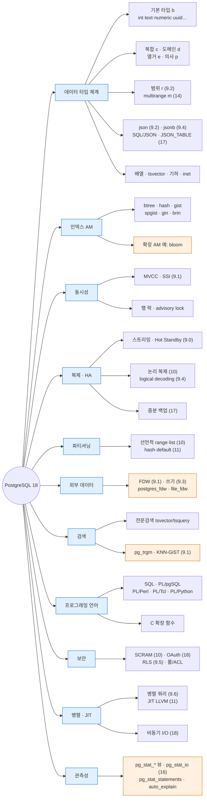

괄호 안 숫자는 해당 기능이 **처음 들어온 메이저 버전**이며, 각 버전 release notes로 확인한 것만 적었다 (§15).
주황색은 contrib 확장 형태로 제공되는 부분이 섞인 영역.

### 0.2 확장 지점 지도 — 쿼리 한 건이 지나가는 길목마다 열린 문

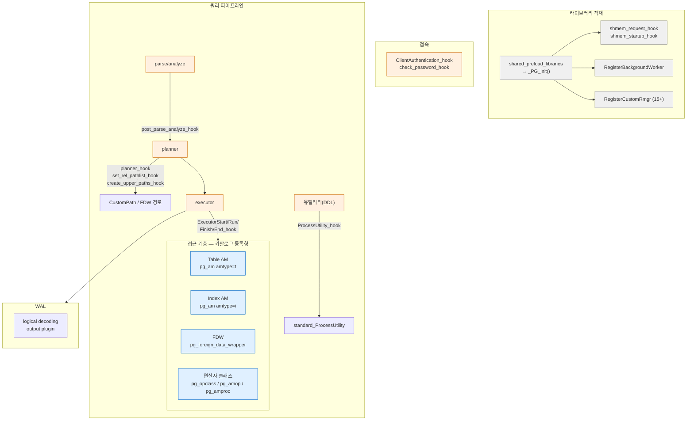

확장 지점은 성격이 둘로 갈린다.

| 구분 | 방식 | 등록 위치 | 예 |
|---|---|---|---|
| **카탈로그 등록형** | SQL DDL로 카탈로그에 행을 넣고, 행이 C 핸들러 함수를 가리킨다 | `pg_am`, `pg_opclass`, `pg_foreign_data_wrapper`, `pg_language`, `pg_type` | `CREATE ACCESS METHOD`, `CREATE OPERATOR CLASS`, `CREATE FOREIGN DATA WRAPPER`, `CREATE TYPE` |
| **훅 등록형** | 공유 라이브러리의 `_PG_init()`이 전역 함수 포인터 변수를 자기 함수로 바꿔 끼운다 | C 전역 변수 (`*_hook`) | `pg_stat_statements`, `auto_explain`, `passwordcheck` |

카탈로그 등록형은 **트랜잭션·의존성·pg_dump 대상**이 되는 반면, 훅 등록형은 **프로세스 메모리에만 존재**하고
SQL 쪽에는 흔적이 남지 않는다. 이 차이가 이후 모든 절의 배경이다.

## 1. 기능 영역별 내부 구현 위치

기능 영역마다 "내부적으로 어디에 사는가"를 이 시리즈 문서와 연결한다.

| 영역 | 핵심 기능 | 내부 구현의 거처 | 이 시리즈 | 사용법 문서 |
|---|---|---|---|---|
| 데이터 타입 | 기본/복합/도메인/열거/범위/multirange, JSON, 배열 | `pg_type`, `pg_range`, `pg_enum` + 타입별 in/out 함수 | §4 | [[PostgreSQL/09-POSTGRES-ONLY\|09]] §1~4 |
| 인덱스 | btree·hash·gist·spgist·gin·brin | `pg_am` + `IndexAmRoutine` | §3 | [[PostgreSQL/11-PERFORMANCE\|11. 성능]] |
| 동시성 | MVCC, SSI, 행 락 | 튜플 헤더 xmin/xmax, CLOG, predicate lock | [[PostgreSQL/INTERNALS/04-MVCC-WAL\|04]] | [[PostgreSQL/10-TRANSACTION\|10]] |
| 복제·HA | 물리 스트리밍, 논리 복제 | WAL sender/receiver, logical decoding (`pgoutput` 플러그인) | [[PostgreSQL/INTERNALS/04-MVCC-WAL\|04]], §11 | — |
| 파티셔닝 | range/list/hash, pruning | 파티션 키는 `pg_partitioned_table`, 라우팅은 executor | [[PostgreSQL/INTERNALS/05-QUERY-PIPELINE\|05]] | [[PostgreSQL/02-DDL\|02]], [[PostgreSQL/15-AUTHORITY\|15]] |
| 외부 데이터 | FDW | `FdwRoutine` 콜백 | §6 | [[PostgreSQL/09-POSTGRES-ONLY\|09]] §5 |
| 검색 | 전문검색, 트라이그램 | GIN/GiST 연산자 클래스 (`tsvector_ops`, `gin_trgm_ops`) | §3, §4.6 | [[PostgreSQL/09-POSTGRES-ONLY\|09]] §6 |
| 언어 | SQL, PL/pgSQL, C | `pg_language` + 언어 핸들러 | [[PostgreSQL/INTERNALS/07-FUNCTION-MANAGER\|07]] | [[PostgreSQL/07-PLPGSQL\|07]] |
| 보안 | 인증, ACL, RLS | `pg_hba.conf`, `pg_authid`, `pg_policy`, 인증 훅 | §8 | [[PostgreSQL/15-AUTHORITY\|15]] |
| 병렬·JIT·AIO | Gather, LLVM JIT, io worker | 병렬 워커 = 동적 background worker, AIO = `io_method` | [[PostgreSQL/INTERNALS/02-PROCESS-MEMORY\|02]], [[PostgreSQL/INTERNALS/05-QUERY-PIPELINE\|05]], §10 | [[PostgreSQL/14-TUNING\|14]] |
| 관측성 | 통계 뷰, 쿼리 통계 | 누적 통계 시스템, 훅 기반 확장 | §13 | [[PostgreSQL/14-TUNING\|14]] |

## 2. 확장성의 근본 원리 — 카탈로그 주도 + 동적 로딩

공식 문서(“How Extensibility Works”, docs/18/extend-how.html)는 PostgreSQL이 확장 가능한 이유를
두 가지로 설명한다.

1. **카탈로그 주도(catalog-driven) 동작** — 테이블·컬럼뿐 아니라 데이터 타입·함수·접근 방법까지
   카탈로그에 저장하고, 서버는 그 카탈로그를 읽어서 동작한다. 사용자가 카탈로그에 행을 추가하면
   (DDL을 통해) 서버의 동작이 바뀐다.
2. **동적 로딩** — 새 타입이나 함수를 구현한 공유 라이브러리를 지정하면 서버가 필요할 때 적재한다.

이 둘을 이어 주는 것이 **핸들러 함수 패턴**이다. 카탈로그 행은 C 함수 하나(`regproc`)만 가리키고,
그 함수가 호출되면 **콜백 함수 포인터로 채운 구조체**를 돌려준다. 핸들러의 반환 타입은 전용 의사 타입으로
구분된다. 18.4 임시 클러스터(확장 bloom·file_fdw·postgres_fdw 설치 후)에서 조회한 결과는 다음과 같다.

```sql
SELECT prorettype::regtype, string_agg(proname, ', ')
  FROM pg_proc
 WHERE prorettype IN ('index_am_handler'::regtype, 'table_am_handler'::regtype,
                      'fdw_handler'::regtype, 'tsm_handler'::regtype, 'language_handler'::regtype)
 GROUP BY 1;
```

```text
    prorettype    |                                    string_agg
------------------+----------------------------------------------------------------------------------
 table_am_handler | table_am_handler_in, heap_tableam_handler
 index_am_handler | gisthandler, ginhandler, index_am_handler_in, brinhandler, blhandler, bthandler, spghandler, hashhandler
 language_handler | plpgsql_call_handler, language_handler_in
 fdw_handler      | file_fdw_handler, postgres_fdw_handler, fdw_handler_in
 tsm_handler      | tsm_handler_in, bernoulli, system
```

| 의사 타입 | 핸들러가 돌려주는 것 | 카탈로그 | 조회 함수(소스) |
|---|---|---|---|
| `index_am_handler` | `IndexAmRoutine *` | `pg_am.amhandler` (amtype `i`) | `GetIndexAmRoutine()` (`access/index/amapi.c`) |
| `table_am_handler` | `TableAmRoutine *` | `pg_am.amhandler` (amtype `t`) | `GetTableAmRoutine()` (`access/tableam.h` 선언) |
| `fdw_handler` | `FdwRoutine *` | `pg_foreign_data_wrapper.fdwhandler` | `GetFdwRoutine()` (`foreign/fdwapi.h` 선언) |
| `tsm_handler` | `TsmRoutine *` (TABLESAMPLE 방식) | `pg_proc` 직접 | — |
| `language_handler` | 함수 호출 자체를 처리 | `pg_language.lanplcallfoid` | [[PostgreSQL/INTERNALS/07-FUNCTION-MANAGER\|07. fmgr]] 참고 |

`*_in` 함수는 의사 타입의 입력 함수(값을 직접 입력하는 것을 막는 용도)이며 핸들러가 아니다.
`index_am_handler` 계열의 실제 호출 경로는 소스(REL_18_STABLE `amapi.c`)에서 확인된다.

```c
GetIndexAmRoutine(Oid amhandler)
{
	Datum		datum;
	IndexAmRoutine *routine;

	datum = OidFunctionCall0(amhandler);
	routine = (IndexAmRoutine *) DatumGetPointer(datum);

	if (routine == NULL || !IsA(routine, IndexAmRoutine))
		elog(ERROR, "index access method handler function %u did not return an IndexAmRoutine struct",
			 amhandler);

	return routine;
}
```

즉 **카탈로그 OID → fmgr 호출 → 구조체 포인터 → 구조체 안의 함수 포인터 호출**. 07편의 fmgr이
확장성 전체의 공통 하부 구조라는 뜻이다.

## 3. 인덱스 액세스 메서드 6종

### 3.1 pg_am — 테이블 AM과 인덱스 AM이 한 카탈로그에

```sql
SELECT oid, amname, amhandler, amtype FROM pg_am ORDER BY oid;
```

```text
 oid  | amname |      amhandler       | amtype
------+--------+----------------------+--------
    2 | heap   | heap_tableam_handler | t
  403 | btree  | bthandler            | i
  405 | hash   | hashhandler          | i
  783 | gist   | gisthandler          | i
 2742 | gin    | ginhandler           | i
 3580 | brin   | brinhandler          | i
 4000 | spgist | spghandler           | i
```

- `amtype = 't'`는 테이블 AM, `'i'`는 인덱스 AM. 기본 설치에는 테이블 AM이 `heap` 하나뿐이다.
- OID는 initdb가 부여하는 고정 OID 범위 (06편 참고). `btree = 403`은 카탈로그 곳곳에 하드코딩된 값이다.
- 9.6 이전에는 `pg_am`에 AM 속성 컬럼이 많았으나, 9.6에서 `CREATE ACCESS METHOD` 도입과 함께
  대부분 제거되고 속성 조회 함수(`pg_indexam_has_property` 등)로 대체되었다 (9.6 release notes).

### 3.2 구조·적합 쿼리·지원 연산

연산자 목록은 공식 문서 docs/18/indexes-types.html 기준, 구조 설명은 18.4 헤더 주석과 공식 문서 기준이다.

| AM | 자료구조 | 적합한 쿼리 | 대표 연산자(내장 opclass 기준) | 비고 |
|---|---|---|---|---|
| **btree** | 정렬된 균형 트리. Lehman–Yao 알고리즘 계열 (`access/nbtree.h` 주석에 high key 요구 언급) | 등호·범위·정렬·`IS NULL`·`IN`, 앵커된 `LIKE 'foo%'` | `<` `<=` `=` `>=` `>` | 기본 AM. 유일하게 UNIQUE·정렬 출력 지원. PG13 중복 제거, PG18 skip scan |
| **hash** | 해시 버킷 | 등호만 | `=` | PG10부터 WAL 기록(크래시 안전·복제 가능) |
| **gist** | 일반화 검색 트리(균형). opclass가 consistent/union/penalty/picksplit 제공 | 기하·범위 겹침/포함, 최근접(KNN, `<->`) | `<<` `&<` `&>` `>>` `@>` `<@` `~=` `&&` 등 | 배제 제약(EXCLUDE)의 주력. PG12 INCLUDE |
| **spgist** | 공간 분할 트리(비균형): 쿼드트리, k-d 트리, radix 트리 | 점·텍스트 접두·범위, KNN | 점: `<<` `>>` `~=` `<@` `<<\|` `\|>>` | 9.2 도입. PG14 INCLUDE |
| **gin** | 역색인(키 → 행 목록). pending list로 빠른 갱신 | 배열 원소·jsonb 키·전문검색 단어 포함 여부 | 배열: `<@` `@>` `=` `&&` | `gin_pending_list_limit` 기본 4MB (실측) |
| **brin** | 블록 범위별 요약(min/max, bloom 등) | 물리 순서와 상관관계 높은 대용량 컬럼의 범위 | `<` `<=` `=` `>=` `>` | 9.5 도입. `pages_per_range` 기본 128 (실측) |

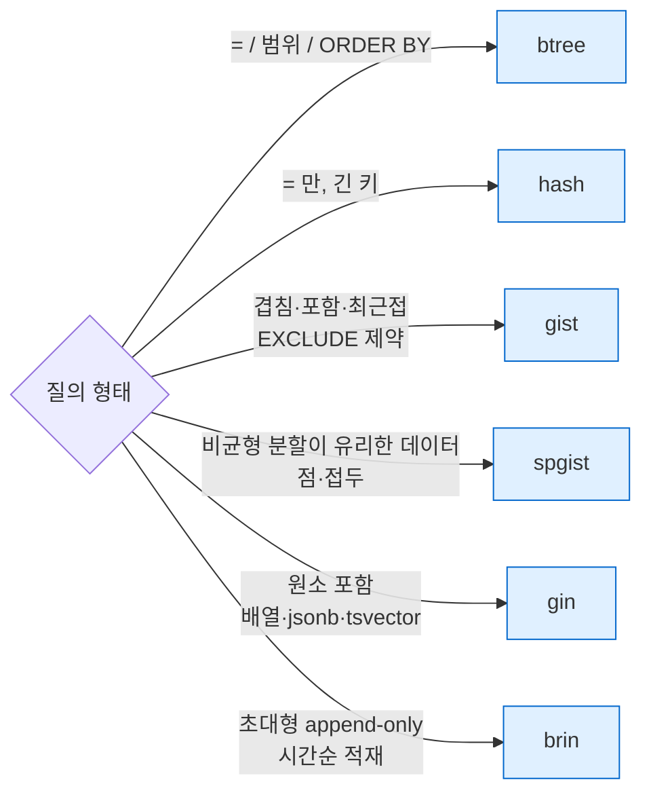

**JSONB를 GIN으로 거는 방법**(`jsonb_ops` vs `jsonb_path_ops`)은
[[PostgreSQL/09-POSTGRES-ONLY|09. 고유 기능]] §2에 있다. 여기선 두 opclass의 내부 키 타입 차이만 기록한다.

```text
    opcname     | amname |   opcintype   | opckeytype
----------------+--------+---------------+------------
 jsonb_ops      | gin    | jsonb         | text
 jsonb_path_ops | gin    | jsonb         | integer
 tsvector_ops   | gin    | tsvector      | text
 array_ops      | gin    | anyarray      | anyelement
 point_ops      | gist   | point         | box
 tsvector_ops   | gist   | tsvector      | gtsvector
 kd_point_ops   | spgist | point         | -
 quad_point_ops | spgist | point         | -
```

`opckeytype`은 **인덱스에 실제 저장되는 타입**이다. `jsonb_path_ops`는 경로를 해시한 정수를 저장하므로
`jsonb_ops`(키·값 텍스트)보다 작고, 그 대가로 키 존재 연산자(`?`)를 지원하지 못한다.
GiST `point_ops`가 `box`를 저장하는 것은 내부 노드가 하위 점들의 **경계 상자**를 들고 있기 때문이다.

### 3.3 AM 수준 기능 비교 — `pg_indexam_has_property`

```sql
SELECT a.amname,
       pg_indexam_has_property(a.oid,'can_order')     AS ord,
       pg_indexam_has_property(a.oid,'can_unique')    AS uniq,
       pg_indexam_has_property(a.oid,'can_multi_col') AS multi,
       pg_indexam_has_property(a.oid,'can_exclude')   AS excl,
       pg_indexam_has_property(a.oid,'can_include')   AS incl
  FROM pg_am a WHERE a.amtype = 'i' ORDER BY a.oid;
```

```text
 amname | ord | uniq | multi | excl | incl
--------+-----+------+-------+------+------
 btree  | t   | t    | t     | t    | t
 hash   | f   | f    | f     | t    | f
 gist   | f   | f    | t     | t    | t
 gin    | f   | f    | t     | f    | f
 brin   | f   | f    | t     | f    | f
 spgist | f   | f    | f     | t    | t
```

| 속성 | 의미 | 관찰 |
|---|---|---|
| `can_order` | `ORDER BY`를 인덱스 순서로 만족 | btree만 |
| `can_unique` | UNIQUE 인덱스 | btree만 — PK/UNIQUE 제약이 btree인 이유 |
| `can_multi_col` | 다중 컬럼 | hash·spgist 불가 |
| `can_exclude` | EXCLUDE 제약에 사용 | gin·brin 불가 (개별 행 검증이 안 되는 구조) |
| `can_include` | `INCLUDE` 비키 컬럼 | btree·gist·spgist |

### 3.4 인덱스·컬럼 수준 속성 — `pg_index_has_property`, `pg_index_column_has_property`

각 AM으로 인덱스를 하나씩 만들고 조회했다 (`t_btree(i int)`, `t_hash(i)`, `t_gist(p point)`,
`t_spgist(p point)`, `t_gin(a int[])`, `t_brin(i)`).

```text
   idx    | ordbl | dist | ret | sarr | snull |  clus | iscan | bscan | bwd
----------+-------+------+-----+------+-------+-------+-------+-------+-----
 t_btree  | t     | f    | t   | t    | t     |  t    | t     | t     | t
 t_hash   | f     | f    | f   | f    | f     |  f    | t     | t     | t
 t_gist   | f     | t    | t   | f    | t     |  t    | t     | t     | f
 t_spgist | f     | t    | t   | f    | t     |  f    | t     | t     | f
 t_gin    | f     | f    | f   | f    | f     |  f    | f     | t     | f
 t_brin   | f     | f    | f   | f    | t     |  f    | f     | t     | f
```

(두 쿼리 결과를 한 표로 합침. 앞 5열은 컬럼 속성, 뒤 4열은 인덱스 속성.)

| 속성 | 의미 | 해석 |
|---|---|---|
| `orderable` | 컬럼 값 순서로 정렬 반환 | btree |
| `distance_orderable` | `ORDER BY col <-> 상수` (KNN) | gist·spgist의 point opclass |
| `returnable` | 인덱스 값 반환 가능 → **Index Only Scan** 가능 | btree·gist·spgist. gin·brin·hash는 불가 |
| `search_array` | `col = ANY(array)`를 AM이 직접 처리 | btree |
| `search_nulls` | `IS NULL` 검색 | hash·gin 불가 |
| `clusterable` | `CLUSTER` 기준 인덱스 | btree·gist |
| `index_scan` | `amgettuple` 제공 (튜플 단위 반환) | **gin·brin 없음 → 항상 Bitmap Scan** |
| `bitmap_scan` | `amgetbitmap` 제공 | 6종 모두 |
| `backward_scan` | 역방향 스캔 | btree·hash |

GIN·BRIN이 EXPLAIN에서 늘 `Bitmap Index Scan`으로만 나오는 이유가 `index_scan = f`, 즉
`IndexAmRoutine.amgettuple`이 비어 있다는 데 있다.

### 3.5 IndexAmRoutine — 인덱스 AM이 서버와 맺는 계약

18.4 `access/amapi.h`의 `IndexAmRoutine`은 **불리언/정수 능력 플래그**와 **콜백 함수 포인터** 두 부분으로 되어 있다.
위 속성 함수들은 이 플래그를 그대로 읽는다(헤더 주석: 새 속성을 추가하면 property API에도 노출하라).

| 분류 | 필드 (18.4 헤더 그대로) |
|---|---|
| 전략·지원 함수 수 | `amstrategies`, `amsupport`, `amoptsprocnum` |
| 능력 플래그 | `amcanorder`, `amcanorderbyop`, `amcanhash`, `amconsistentequality`, `amconsistentordering`, `amcanbackward`, `amcanunique`, `amcanmulticol`, `amoptionalkey`, `amsearcharray`, `amsearchnulls`, `amstorage`, `amclusterable`, `ampredlocks`, `amcanparallel`, `amcanbuildparallel`, `amcaninclude`, `amusemaintenanceworkmem`, `amsummarizing`, `amparallelvacuumoptions`, `amkeytype` |
| 빌드·갱신 | `ambuild`, `ambuildempty`, `aminsert`, `aminsertcleanup` |
| VACUUM | `ambulkdelete`, `amvacuumcleanup` |
| 플래너 | `amcanreturn`, `amcostestimate`, `amgettreeheight`, `amoptions`, `amproperty`, `ambuildphasename`, `amvalidate`, `amadjustmembers` |
| 스캔 | `ambeginscan`, `amrescan`, `amgettuple`, `amgetbitmap`, `amendscan`, `ammarkpos`, `amrestrpos` |
| 병렬 스캔 | `amestimateparallelscan`, `aminitparallelscan`, `amparallelrescan` |
| 전략 변환 | `amtranslatestrategy`, `amtranslatecmptype` |

`amcanhash`, `amconsistentequality`, `amconsistentordering`, `amtranslate*` 는 18.4 헤더에서 확인한 필드이며,
도입 버전은 이 문서에서 따로 확인하지 않았다 (확인 필요).

### 3.6 AM별 지원 함수 번호 — 연산자 클래스가 채워야 할 슬롯

인덱스 AM은 "어떤 연산자를 지원하는가"를 스스로 정하지 않는다. **연산자 클래스가 슬롯 번호에 함수를 꽂아** 주면
AM은 그 슬롯을 호출할 뿐이다. 18.4 헤더의 `#define` 값.

| AM | 지원 함수 슬롯 (번호: 이름) | 헤더 |
|---|---|---|
| btree | 1 `BTORDER_PROC`(비교, 필수), 2 `BTSORTSUPPORT_PROC`, 3 `BTINRANGE_PROC`, 4 `BTEQUALIMAGE_PROC`, 5 `BTOPTIONS_PROC`, 6 `BTSKIPSUPPORT_PROC` — `BTNProcs = 6` | `access/nbtree.h` |
| hash | 1 `HASHSTANDARD_PROC`, 2 `HASHEXTENDED_PROC`, 3 `HASHOPTIONS_PROC` | `access/hash.h` |
| gist | 1 consistent, 2 union, 3 compress, 4 decompress, 5 penalty, 6 picksplit, 7 equal, 8 distance, 9 fetch, 10 options, 11 sortsupport, 12 translate_cmptype — `GISTNProcs = 12` | `access/gist.h` |
| spgist | 1 config, 2 choose, 3 picksplit, 4 inner_consistent, 5 leaf_consistent, 6 compress, 7 options | `access/spgist.h` |
| gin | 1 compare, 2 extractValue, 3 extractQuery, 4 consistent, 5 comparePartial, 6 triConsistent, 7 options | `access/gin.h` |
| brin | 1 opcinfo, 2 add_value, 3 consistent, 4 union (필수 4개), 5 options, 11~15 opclass 전용 | `access/brin_internal.h` |

btree 전략 번호는 `access/stratnum.h`에 `BTLessStrategyNumber = 1` … `BTMaxStrategyNumber = 5`로 고정되어 있다
(1 `<`, 2 `<=`, 3 `=`, 4 `>=`, 5 `>`). GiST 같은 AM은 고정 전략 집합이 없고(`amstrategies = 0` 허용)
opclass마다 번호의 의미가 다르다.

PG18 skip scan은 이 구조 위에 얹혔다. `integer_ops` 패밀리에 6번 슬롯 `btint4skipsupport`가 들어 있다 (§4.4 실측).

## 4. 타입 시스템 확장성

### 4.1 pg_type의 typtype — 타입의 종류

```sql
SELECT typname, typtype, typcategory, typinput, typoutput, typreceive, typsend, typlen, typbyval, typalign, typstorage
  FROM pg_type WHERE typname IN ('int4','text','jsonb','point','pair','posint','mood','floatrange','floatmultirange')
 ORDER BY typtype, typname;
```

```text
     typname     | typtype | typcategory |   typinput    |   typoutput    |   typreceive    |     typsend     | typlen | typbyval | typalign | typstorage
-----------------+---------+-------------+---------------+----------------+-----------------+-----------------+--------+----------+----------+------------
 int4            | b       | N           | int4in        | int4out        | int4recv        | int4send        |      4 | t        | i        | p
 jsonb           | b       | U           | jsonb_in      | jsonb_out      | jsonb_recv      | jsonb_send      |     -1 | f        | i        | x
 point           | b       | G           | point_in      | point_out      | point_recv      | point_send      |     16 | f        | d        | p
 text            | b       | S           | textin        | textout        | textrecv        | textsend        |     -1 | f        | i        | x
 pair            | c       | C           | record_in     | record_out     | record_recv     | record_send     |     -1 | f        | d        | x
 posint          | d       | N           | domain_in     | int4out        | domain_recv     | int4send        |      4 | t        | i        | p
 mood            | e       | E           | enum_in       | enum_out       | enum_recv       | enum_send       |      4 | t        | i        | p
 floatmultirange | m       | R           | multirange_in | multirange_out | multirange_recv | multirange_send |     -1 | f        | d        | x
 floatrange      | r       | R           | range_in      | range_out      | range_recv      | range_send      |     -1 | f        | d        | x
```

(`pair`, `posint`, `mood`, `floatrange`는 실증용으로 만든 사용자 타입. 생성 문법은 09-POSTGRES-ONLY §3~4 참고.)

| typtype | 종류 | in/out 함수의 정체 | 관찰 포인트 |
|---|---|---|---|
| `b` | 기본(base) 타입 | **타입 전용 C 함수** (`int4in`/`int4out`) | 표현 형식을 C가 완전히 결정 |
| `c` | 복합 타입 (테이블 행 타입 포함) | 범용 `record_in`/`record_out` | 내부는 heap 튜플 형태 |
| `d` | 도메인 | 입력은 `domain_in`(기저 타입 입력 + 제약 검사), 출력은 **기저 타입의 `int4out` 그대로** | 저장 표현은 기저 타입과 동일 |
| `e` | 열거 | 범용 `enum_in`/`enum_out` | 저장은 4바이트 OID, 라벨은 `pg_enum` |
| `r` | 범위 | 범용 `range_in`/`range_out` | 하위 타입·정렬 opclass는 `pg_range` |
| `m` | multirange (PG14+) | 범용 `multirange_in` | 범위 타입 생성 시 **자동 생성** |
| `p` | 의사(pseudo) 타입 | — | `internal`, `anyelement`, `*_handler` 등 |

`pg_catalog` 스키마의 typtype 분포 (실측): `b` 291, `c` 144, `m` 6, `p` 26, `r` 6.
`b`에는 배열 타입(`typcategory = 'A'`)이 포함되며, 배열을 뺀 기본 타입은 68개였다.
`c`가 많은 것은 시스템 카탈로그·뷰마다 행 타입이 하나씩 있기 때문이다.

범위 타입을 만들면 multirange가 따라 생긴다.

```sql
CREATE TYPE floatrange AS RANGE (subtype = float8, subtype_diff = float8mi);
SELECT rngtypid::regtype, rngsubtype::regtype, rngmultitypid::regtype, rngsubopc, rngsubdiff
  FROM pg_range WHERE rngtypid = 'floatrange'::regtype;
```

```text
  rngtypid  |    rngsubtype    |  rngmultitypid  | rngsubopc | rngsubdiff
------------+------------------+-----------------+-----------+------------
 floatrange | double precision | floatmultirange |      3123 | float8mi
```

`rngsubopc`(하위 타입의 btree opclass)가 범위의 경계 비교 방법을 결정하고, `subtype_diff`는 GiST 인덱스의
penalty 계산 품질에 쓰인다(공식 문서 CREATE TYPE 설명). 즉 범위 타입도 결국 **연산자 클래스에 기대어** 동작한다.

열거 타입의 순서는 `pg_enum.enumsortorder`(float)로 저장된다.

```text
 enumlabel | enumsortorder
-----------+---------------
 sad       |             1
 ok        |             2
 happy     |             3
```

### 4.2 사용자 정의 기본 타입 — C in/out 함수가 핵심

기본 타입(`typtype = 'b'`)은 SQL만으로 만들 수 없다. **입력 함수(cstring → 내부 표현)와 출력 함수(내부 표현 → cstring)를
C로 작성**해야 하기 때문이다. 공식 문서(docs/18/xtypes.html)의 `complex` 예제 흐름을 요약하면:

```sql
-- 공식 문서 예제 형식 (이 문서에서 실행하지 않음)
CREATE TYPE complex;                         -- 1) shell 타입: 이름만 예약

CREATE FUNCTION complex_in(cstring) RETURNS complex
    AS 'filename' LANGUAGE C IMMUTABLE STRICT;
CREATE FUNCTION complex_out(complex) RETURNS cstring
    AS 'filename' LANGUAGE C IMMUTABLE STRICT;

CREATE TYPE complex (                        -- 2) 본 정의
   internallength = 16,
   input  = complex_in,
   output = complex_out,
   alignment = double
);
```

shell 타입이 필요한 이유는 닭과 달걀 문제다. `complex_in`의 반환 타입이 `complex`인데, `complex`의 정의에는 `complex_in`이
필요하다. 먼저 이름만 있는 shell을 만들어 함수 시그니처를 확정한 뒤 본 정의로 채운다.

| `CREATE TYPE` 속성 | 들어가는 `pg_type` 컬럼 | 의미 |
|---|---|---|
| `INPUT` / `OUTPUT` | `typinput` / `typoutput` | 텍스트 표현 변환 (필수) |
| `RECEIVE` / `SEND` | `typreceive` / `typsend` | 바이너리 프로토콜 변환 (선택) |
| `INTERNALLENGTH` | `typlen` | 고정 길이, `VARIABLE`이면 -1 (varlena) |
| `PASSEDBYVALUE` | `typbyval` | Datum에 값 자체를 담는가 |
| `ALIGNMENT` | `typalign` | `c`/`s`/`i`/`d` 정렬 |
| `STORAGE` | `typstorage` | `p`(plain)/`e`/`m`/`x`(extended, TOAST 가능) |
| `ANALYZE` | `typanalyze` | 통계 수집 함수 |
| `SUBSCRIPT` (PG14+) | `typsubscript` | `x[...]` 구독 처리 함수 |

C 함수를 빌드·로드하는 실제 절차와 `PG_FUNCTION_ARGS`/`Datum` 규약은
[[PostgreSQL/INTERNALS/07-FUNCTION-MANAGER|07. 함수 실행 구조]], `typlen`·`typalign`·`typstorage`가 튜플 레이아웃에 미치는 영향은
[[PostgreSQL/INTERNALS/03-STORAGE|03. 물리 저장 구조]]를 본다.

### 4.3 연산자 → 연산자 클래스 → 인덱스

새 타입을 만들어도 그것만으로는 `WHERE col = x`가 인덱스를 타지 않는다. 인덱스와 연산자를 잇는 다리가
**연산자 클래스(opclass)와 연산자 패밀리(opfamily)** 이다.

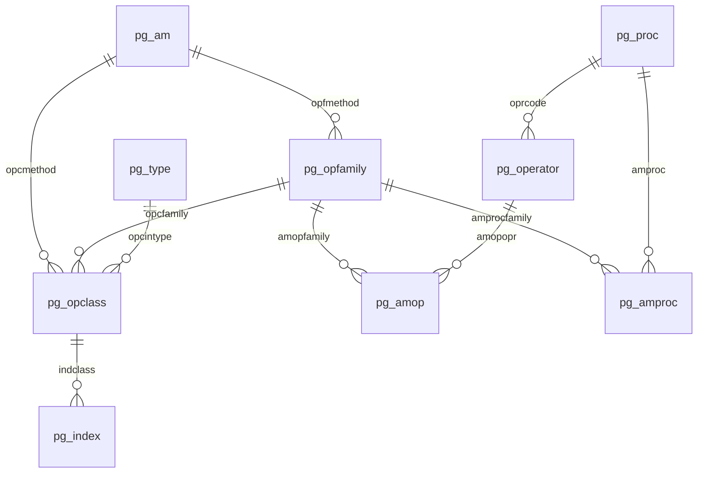

| 카탈로그 | 한 행의 의미 |
|---|---|
| `pg_operator` | 연산자 기호 + 좌우 타입 + 구현 함수(`oprcode`) |
| `pg_opfamily` | "같은 의미론을 공유하는 연산자 묶음" (예: btree `integer_ops`는 int2/int4/int8 간 교차 비교까지 포함) |
| `pg_opclass` | "특정 입력 타입의 컬럼을 이 AM으로 인덱싱하는 방법". `opcdefault`면 `USING btree (col)`에서 자동 선택 |
| `pg_amop` | 패밀리 안에서 **전략 번호 ↔ 연산자** 매핑 |
| `pg_amproc` | 패밀리 안에서 **지원 함수 번호 ↔ 함수** 매핑 |

btree `integer_ops`에서 int4×int4 부분만 뽑으면:

```text
 amopstrategy | amoplefttype | amoprighttype |       amopopr
--------------+--------------+---------------+---------------------
            1 | integer      | integer       | <(integer,integer)
            2 | integer      | integer       | <=(integer,integer)
            3 | integer      | integer       | =(integer,integer)
            4 | integer      | integer       | >=(integer,integer)
            5 | integer      | integer       | >(integer,integer)

 amprocnum | amproclefttype | amprocrighttype |       amproc
-----------+----------------+-----------------+---------------------
         1 | integer        | integer         | btint4cmp
         2 | integer        | integer         | btint4sortsupport
         3 | integer        | integer         | pg_catalog.in_range
         4 | integer        | integer         | btequalimage
         6 | integer        | integer         | btint4skipsupport
```

`integer_ops` 패밀리 전체는 연산자 45개, (좌, 우) 타입 쌍 9개(int2/int4/int8의 3×3)였다. 패밀리 단위로 교차 타입 연산자를
묶어 두기 때문에 `int8_col = 42::int4` 같은 비교도 캐스팅 없이 같은 인덱스를 쓸 수 있다.

기본 설치(확장 설치 전) AM별 opclass/opfamily 수:

```text
 amname | opclasses | families
--------+-----------+----------
 btree  |        44 |       35
 hash   |        41 |       34
 gist   |         9 |        9
 gin    |         4 |        4
 brin   |        72 |       57
 spgist |         7 |        7
```

int4 컬럼에 쓸 수 있는 opclass는 btree `int4_ops`(기본), hash `int4_ops`(기본), brin `int4_minmax_ops`(기본)·
`int4_minmax_multi_ops`·`int4_bloom_ops`였다. GiST/GIN에는 int4용 내장 opclass가 없어서 `btree_gist`/`btree_gin`
확장이 필요하다 — 09-POSTGRES-ONLY §5 표의 두 확장이 존재하는 이유가 바로 이것이다.

### 4.4 새 연산자가 인덱스를 타는 원리

플래너는 WHERE 절의 각 조건에 대해 "이 연산자가 인덱스 컬럼의 opfamily 소속인가"를 묻는다.
REL_18_STABLE `src/backend/optimizer/path/indxpath.c`의 `match_clause_to_indexcol()` →
`match_opclause_to_indexcol()` 안에서 `op_in_opfamily(expr_op, opfamily)`로 판정한다.

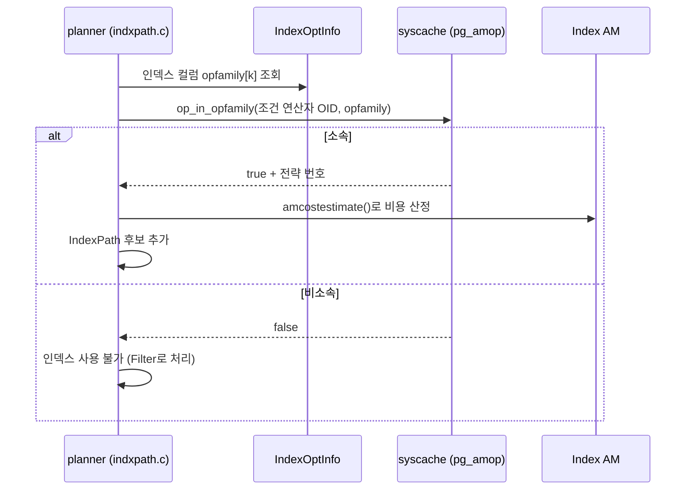

이 원리를 직접 확인하려고, **절댓값 순서로 정렬하는 btree 연산자 클래스**를 SQL만으로 만들었다 (V7).

```sql
CREATE FUNCTION abs_lt(int,int) RETURNS bool LANGUAGE plpgsql IMMUTABLE STRICT
    AS 'begin return abs($1) < abs($2); end';
-- abs_le / abs_eq / abs_ge / abs_gt 동일 패턴
CREATE FUNCTION abs_cmp(int,int) RETURNS int LANGUAGE sql IMMUTABLE STRICT
    AS 'select case when abs($1)<abs($2) then -1 when abs($1)>abs($2) then 1 else 0 end';

CREATE OPERATOR |<|  (leftarg=int, rightarg=int, function=abs_lt);
CREATE OPERATOR |<=| (leftarg=int, rightarg=int, function=abs_le);
CREATE OPERATOR |=|  (leftarg=int, rightarg=int, function=abs_eq);
CREATE OPERATOR |>=| (leftarg=int, rightarg=int, function=abs_ge);
CREATE OPERATOR |>|  (leftarg=int, rightarg=int, function=abs_gt);

CREATE OPERATOR CLASS int4_abs_ops FOR TYPE int USING btree AS
    OPERATOR 1 |<| , OPERATOR 2 |<=| , OPERATOR 3 |=| , OPERATOR 4 |>=| , OPERATOR 5 |>| ,
    FUNCTION 1 abs_cmp(int,int);

CREATE TABLE nums AS SELECT (g - 5000) n FROM generate_series(1,10000) g;
CREATE INDEX nums_abs ON nums (n int4_abs_ops);
```

```text
EXPLAIN SELECT * FROM nums WHERE n |=| 42;
 Index Only Scan using nums_abs on nums
   Index Cond: (n |=| 42)              → 결과: -42, 42

EXPLAIN SELECT * FROM nums WHERE n |<| 3 ORDER BY n USING |<|;
 Index Only Scan using nums_abs on nums
   Index Cond: (n |<| 3)               → 결과: 0, -1, 1, -2, 2 (절댓값 순)

EXPLAIN SELECT * FROM nums WHERE n = 42;
 Seq Scan on nums
   Filter: (n = 42)                    → 일반 = 는 이 인덱스의 opfamily 소속이 아님
```

- 같은 int 컬럼, 같은 btree인데 **연산자 클래스가 무엇이냐에 따라 인덱스가 이해하는 연산자가 바뀐다.**
- `ORDER BY n USING |<|`도 인덱스 순서로 해결되었다. 정렬 연산자가 전략 1(`<` 역할)로 등록되어 있기 때문.
- 이 opclass는 `opcdefault = f`라서 인덱스 생성 시 `int4_abs_ops`를 명시해야 했다.

**함정 — SQL 함수 인라이닝 (V7b).** 처음에는 비교 함수를 `LANGUAGE sql`로 만들었는데, 그때는 인덱스를 **타지 않았다.**

```text
 Seq Scan on nums
   Filter: (abs(n) = 42)
```

플래너가 단순 SQL 함수를 본문으로 인라이닝하면서 `n |=| 42`가 `abs(n) = 42`로 바뀌었고, 바뀐 식의 연산자는
일반 `=`이므로 opfamily 매칭에 실패했다. 연산자 구현 함수를 PL/pgSQL(인라이닝 대상 아님)로 바꾸자 정상 동작했다.
실제 확장에서는 이 함수들을 C로 작성하므로 문제가 되지 않지만, SQL로 연산자를 흉내 낼 때는 주의해야 한다.

### 4.5 확장이 기존 타입에 새 인덱스 능력을 더하는 예 — pg_trgm

`pg_trgm`은 새 타입 없이 **기존 `text` 타입에 GIN/GiST opclass를 추가**해서 `LIKE '%abc%'`를 인덱싱 가능하게 만든다.

```text
 amopstrategy |    amopopr          ← gin_trgm_ops 패밀리 (pg_amop)
--------------+----------------
            1 | %(text,text)        유사도
            3 | ~~(text,text)       LIKE
            4 | ~~*(text,text)      ILIKE
            5 | ~(text,text)        정규식
            6 | ~*(text,text)
            7 | %>(text,text)
            9 | %>>(text,text)
           11 | =(text,text)        1.6에서 추가

 amprocnum |         amproc       ← gin_trgm_ops 지원 함수 (pg_amproc)
-----------+------------------------
         1 | btint4cmp              키(트라이그램 = int4) 비교
         2 | gin_extract_value_trgm 값 → 트라이그램 집합
         3 | gin_extract_query_trgm 질의 → 트라이그램 집합
         4 | gin_trgm_consistent
         6 | gin_trgm_triconsistent
```

LIKE 연산자 `~~`가 **전략 3번으로 opfamily에 등록**되어 있으니 §4.4의 `op_in_opfamily`가 참이 되고, 그래서 인덱스가 선택된다.
20,000행 md5 문자열 테이블에서 btree 인덱스만 있을 때와 trgm GIN 인덱스를 추가한 뒤를 비교했다 (V8).

```text
-- btree만 있을 때
 Seq Scan on words
   Filter: (w ~~ '%abc%'::text)

-- CREATE INDEX words_trgm ON words USING gin (w gin_trgm_ops) 후
 Bitmap Heap Scan on words
   Recheck Cond: (w ~~ '%abc%'::text)
   ->  Bitmap Index Scan on words_trgm
         Index Cond: (w ~~ '%abc%'::text)
```

`Recheck Cond`가 붙는 것은 GIN이 lossy할 수 있어서(트라이그램 일치 ≠ 패턴 일치) heap에서 원래 조건을 재평가해야 하기 때문이다.

## 5. Table AM API (PG12+)

PG12 release notes: "pluggable table storage interface" — `CREATE ACCESS METHOD … TYPE TABLE`로 새 테이블 저장 방식을 만들 수 있다.
기본은 `heap`이며 `default_table_access_method`(context `user`)로 바꿀 수 있다.

### 5.1 TableAmRoutine 콜백 44개

18.4 `access/tableam.h`의 `TableAmRoutine`에서 함수 포인터를 세면 44개다.

| 그룹 (헤더 주석 기준) | 콜백 |
|---|---|
| 슬롯 | `slot_callbacks` |
| 테이블 스캔 | `scan_begin`, `scan_end`, `scan_rescan`, `scan_getnextslot`, `scan_set_tidrange`, `scan_getnextslot_tidrange` |
| 병렬 스캔 | `parallelscan_estimate`, `parallelscan_initialize`, `parallelscan_reinitialize` |
| 인덱스 경유 fetch | `index_fetch_begin`, `index_fetch_reset`, `index_fetch_end`, `index_fetch_tuple` |
| 개별 튜플 | `tuple_fetch_row_version`, `tuple_tid_valid`, `tuple_get_latest_tid`, `tuple_satisfies_snapshot`, `index_delete_tuples` |
| DML | `tuple_insert`, `tuple_insert_speculative`, `tuple_complete_speculative`, `multi_insert`, `tuple_delete`, `tuple_update`, `tuple_lock`, `finish_bulk_insert` |
| DDL·저장소 | `relation_set_new_filelocator`, `relation_nontransactional_truncate`, `relation_copy_data`, `relation_copy_for_cluster`, `relation_vacuum` |
| ANALYZE | `scan_analyze_next_block`, `scan_analyze_next_tuple` |
| 인덱스 빌드 | `index_build_range_scan`, `index_validate_scan` |
| 크기·TOAST | `relation_size`, `relation_needs_toast_table`, `relation_toast_am`, `relation_fetch_toast_slice` |
| 플래너 | `relation_estimate_size` |
| 비트맵·샘플 스캔 | `scan_bitmap_next_tuple`, `scan_sample_next_block`, `scan_sample_next_tuple` |

`tuple_satisfies_snapshot`과 `relation_vacuum`이 AM 콜백이라는 점이 중요하다. **MVCC 가시성 판정과 VACUUM이
heap 고유의 구현**이고 ([[PostgreSQL/INTERNALS/04-MVCC-WAL|04]]), 다른 AM은 다른 방식을 택할 수 있다는 뜻이다.
반면 WAL·버퍼 매니저·트랜잭션 관리자는 AM 바깥의 공통 인프라다.

### 5.2 실증 — heap 핸들러로 새 테이블 AM 만들기 (V9)

```sql
SHOW default_table_access_method;                 -- heap
CREATE ACCESS METHOD myheap TYPE TABLE HANDLER heap_tableam_handler;
CREATE TABLE th (x int) USING myheap;
INSERT INTO th VALUES (1),(2);

SELECT c.relname, a.amname, a.amtype
  FROM pg_class c JOIN pg_am a ON a.oid = c.relam
 WHERE c.relname IN ('th','nums','nums_abs','words_trgm');
```

```text
  relname   | amname | amtype
------------+--------+--------
 words_trgm | gin    | i
 nums       | heap   | t
 nums_abs   | btree  | i
 th         | myheap | t
```

- `pg_class.relam`은 테이블이면 테이블 AM, 인덱스면 인덱스 AM을 가리킨다.
- 같은 핸들러를 가리키는 새 이름을 만든 것이라 동작은 heap과 같다. 실제 대체 저장 엔진은 이 자리에 자기 핸들러를 넣는다.
- 뷰·복합 타입·외부 테이블(`relkind` v/c/f)은 `relam = 0`이었다(실측 150행). 저장소가 없으니 AM도 없다.

## 6. FDW — 외부 데이터 래퍼

### 6.1 handler와 validator

FDW는 **두 개의 C 함수**로 정의된다. `file_fdw` 확장 스크립트(`share/extension/file_fdw--1.0.sql`)가 그 전형이다.

```sql
CREATE FUNCTION file_fdw_handler()
RETURNS fdw_handler
AS 'MODULE_PATHNAME'
LANGUAGE C STRICT;

CREATE FUNCTION file_fdw_validator(text[], oid)
RETURNS void
AS 'MODULE_PATHNAME'
LANGUAGE C STRICT;

CREATE FOREIGN DATA WRAPPER file_fdw
  HANDLER file_fdw_handler
  VALIDATOR file_fdw_validator;
```

```text
   fdwname    |      fdwhandler      |      fdwvalidator
--------------+----------------------+------------------------
 file_fdw     | file_fdw_handler     | file_fdw_validator
 postgres_fdw | postgres_fdw_handler | postgres_fdw_validator
```

| 함수 | 시점 | 역할 |
|---|---|---|
| handler | 플래닝·실행 때 | `FdwRoutine *`(콜백 구조체) 반환 |
| validator `(text[], oid)` | `CREATE/ALTER SERVER·USER MAPPING·FOREIGN TABLE` 때 | 옵션 배열과 "어느 카탈로그의 옵션인가"(oid)를 받아 검증 |

validator가 DDL 시점에 동작하는 것을 확인했다 (V10c).

```text
CREATE FOREIGN TABLE csv_bad (id int) SERVER csvsrv OPTIONS (filenam 'x');
ERROR:  invalid option "filenam"
HINT:  Perhaps you meant the option "filename".
```

### 6.2 FdwRoutine 콜백 45개

18.4 `foreign/fdwapi.h`의 `FdwRoutine` 함수 포인터는 45개. 헤더 주석의 그룹을 따르면:

| 그룹 | 콜백 | 필수 여부 |
|---|---|---|
| 스캔 | `GetForeignRelSize`, `GetForeignPaths`, `GetForeignPlan`, `BeginForeignScan`, `IterateForeignScan`, `ReScanForeignScan`, `EndForeignScan` | 읽기 FDW 필수 |
| 원격 조인 | `GetForeignJoinPaths` | 선택 |
| 상위 관계(집계·정렬 등) | `GetForeignUpperPaths` | 선택 |
| 갱신 | `AddForeignUpdateTargets`, `PlanForeignModify`, `BeginForeignModify`, `ExecForeignInsert`, `ExecForeignBatchInsert`, `GetForeignModifyBatchSize`, `ExecForeignUpdate`, `ExecForeignDelete`, `EndForeignModify`, `BeginForeignInsert`, `EndForeignInsert`, `IsForeignRelUpdatable`, `PlanDirectModify`, `BeginDirectModify`, `IterateDirectModify`, `EndDirectModify` | 쓰기 FDW (9.3+) |
| 행 락 | `GetForeignRowMarkType`, `RefetchForeignRow`, `RecheckForeignScan` | 선택 |
| EXPLAIN | `ExplainForeignScan`, `ExplainForeignModify`, `ExplainDirectModify` | 선택 |
| ANALYZE | `AnalyzeForeignTable` | 선택 |
| IMPORT FOREIGN SCHEMA | `ImportForeignSchema` | 선택 (9.5+) |
| TRUNCATE | `ExecForeignTruncate` | 선택 |
| 병렬 | `IsForeignScanParallelSafe`, `EstimateDSMForeignScan`, `InitializeDSMForeignScan`, `ReInitializeDSMForeignScan`, `InitializeWorkerForeignScan`, `ShutdownForeignScan` | 선택 |
| 경로 재매개변수화 | `ReparameterizeForeignPathByChild` | 선택 |
| 비동기 실행 | `IsForeignPathAsyncCapable`, `ForeignAsyncRequest`, `ForeignAsyncConfigureWait`, `ForeignAsyncNotify` | 선택 |

### 6.3 file_fdw vs postgres_fdw — 같은 API, 다른 깊이

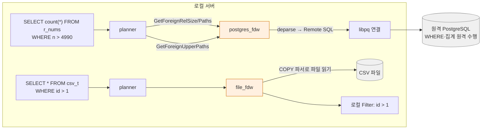

실측 (V10a, V10b) — postgres_fdw는 같은 서버로 루프백 연결했다.

```text
EXPLAIN SELECT * FROM csv_t WHERE id > 1;
 Foreign Scan on csv_t
   Filter: (id > 1)                         ← 조건은 로컬에서 평가
   Foreign File: $SCRATCH/sample.csv

EXPLAIN (VERBOSE) SELECT count(*) FROM r_nums WHERE n > 4990;
 Foreign Scan
   Output: (count(*))
   Relations: Aggregate on (public.r_nums)
   Remote SQL: SELECT count(*) FROM public.nums WHERE ((n > 4990))   ← WHERE와 집계까지 원격으로
```

`file_fdw`는 스캔 콜백만 구현하므로 조건이 로컬 `Filter`로 남는다. `postgres_fdw`는 `GetForeignUpperPaths`로
집계 경로까지 제안하고, 플래너가 그 경로를 골라 **집계 결과 한 행만** 받아 온다. 9.6에서 원격 조인·정렬·UPDATE/DELETE
pushdown이 들어왔다 (9.6 release notes).

## 7. Custom Scan (9.5+)

9.5 release notes: 확장이 자기만의 경로(path)·스캔 방법을 정의해 옵티마이저와 실행기를 제어할 수 있게 했다.
FDW가 "외부 테이블 하나"를 담당한다면, Custom Scan은 **일반 테이블이나 조인에 대해 대체 실행 방법**을 제안한다.

| 단계 | 구조체 (18.4 `nodes/extensible.h`) | 확장이 하는 일 |
|---|---|---|
| 경로 | `CustomPath` + `CustomPathMethods { PlanCustomPath, ReparameterizeCustomPathByChild }` | `set_rel_pathlist_hook`/`set_join_pathlist_hook`에서 `add_path()`로 후보 등록 |
| 플랜 | `CustomScan` + `CustomScanMethods { CustomName, CreateCustomScanState }` | 경로가 선택되면 플랜 노드로 변환 |
| 실행 | `CustomScanState` + `CustomExecMethods` | Volcano 반복자 구현 |

`CustomExecMethods`의 콜백 (18.4 헤더): 필수 `BeginCustomScan`, `ExecCustomScan`, `EndCustomScan`, `ReScanCustomScan` /
선택 `MarkPosCustomScan`, `RestrPosCustomScan` (mark/restore), `EstimateDSMCustomScan`, `InitializeDSMCustomScan`,
`ReInitializeDSMCustomScan`, `InitializeWorkerCustomScan`, `ShutdownCustomScan` (병렬), `ExplainCustomScan`.
경로 플래그로 `CUSTOMPATH_SUPPORT_BACKWARD_SCAN`, `CUSTOMPATH_SUPPORT_MARK_RESTORE`, `CUSTOMPATH_SUPPORT_PROJECTION`이 있다.

병렬 쿼리 직렬화를 위해 `RegisterCustomScanMethods()`로 이름을 등록해 두고, 워커는 `GetCustomScanMethods(name)`으로 찾는다.
플랜 트리가 병렬 워커로 넘어갈 때 함수 포인터가 아니라 **이름**으로 전달되기 때문이다.

`set_rel_pathlist_hook` 호출 지점은 `src/backend/optimizer/path/allpaths.c`에서 확인했다.

```c
	if (set_rel_pathlist_hook)
		(*set_rel_pathlist_hook) (root, rel, rti, rte);
```

이 절은 로컬 실증 대상 확장이 없어 헤더·소스 확인으로만 작성했다.

## 8. 훅(hook) 목록

### 8.1 18.4 헤더에 실제 존재하는 훅 변수

`$(pg_config --includedir-server)` 아래 `.h` 파일 전체에서 `extern PGDLLIMPORT … _hook` 선언을 grep한 결과 34개.

| 단계 | 훅 변수 | 헤더 |
|---|---|---|
| **공유 메모리** | `shmem_request_hook` | `miscadmin.h` |
| | `shmem_startup_hook` | `storage/ipc.h` |
| **인증** | `ClientAuthentication_hook` | `libpq/auth.h` |
| | `ldap_password_hook` | `libpq/auth.h` |
| | `openssl_tls_init_hook` | `libpq/libpq-be.h` |
| | `check_password_hook` | `commands/user.h` |
| **파싱·분석** | `post_parse_analyze_hook` | `parser/analyze.h` |
| **재작성(RLS)** | `row_security_policy_hook_permissive`, `row_security_policy_hook_restrictive` | `rewrite/rowsecurity.h` |
| **플래너** | `planner_hook`, `create_upper_paths_hook` | `optimizer/planner.h` |
| | `set_rel_pathlist_hook`, `set_join_pathlist_hook`, `join_search_hook` | `optimizer/paths.h` |
| | `get_relation_info_hook` | `optimizer/plancat.h` |
| | `get_relation_stats_hook`, `get_index_stats_hook` | `utils/selfuncs.h` |
| | `get_attavgwidth_hook` | `utils/lsyscache.h` |
| **실행기** | `ExecutorStart_hook`, `ExecutorRun_hook`, `ExecutorFinish_hook`, `ExecutorEnd_hook` | `executor/executor.h` |
| | `ExecutorCheckPerms_hook` | `executor/executor.h` |
| **유틸리티(DDL)** | `ProcessUtility_hook` | `tcop/utility.h` |
| **EXPLAIN** | `ExplainOneQuery_hook`, `explain_per_plan_hook`, `explain_per_node_hook`, `explain_get_index_name_hook` | `commands/explain.h` |
| | `explain_validate_options_hook` | `commands/explain_state.h` |
| **함수 호출** | `needs_fmgr_hook`, `fmgr_hook` | `fmgr.h` |
| **객체 접근(보안 라벨 등)** | `object_access_hook`, `object_access_hook_str` | `catalog/objectaccess.h` |
| **로그** | `emit_log_hook` | `utils/elog.h` |

`explain_per_plan_hook`/`explain_per_node_hook`/`explain_validate_options_hook`과 이를 쓰는 `pg_overexplain`은 PG18 신규로 보이며,
`pg_overexplain`이 PG18 신규 확장인 것은 18 release notes로 확인했다. 개별 훅의 도입 버전은 이 문서에서 일일이 확인하지 않았다 (확인 필요).

### 8.2 훅 체인 패턴

모든 훅은 같은 관용구를 따른다. 서버 쪽은 "훅이 있으면 훅, 없으면 표준 함수"이고(REL_18_STABLE `execMain.c`):

```c
void
ExecutorStart(QueryDesc *queryDesc, int eflags)
{
	pgstat_report_query_id(queryDesc->plannedstmt->queryId, false);

	if (ExecutorStart_hook)
		(*ExecutorStart_hook) (queryDesc, eflags);
	else
		standard_ExecutorStart(queryDesc, eflags);
}
```

`planner()`(`planner.c`), `ProcessUtility()`(`utility.c`), `ClientAuthentication`(`auth.c`), `parse_analyze_*`(`analyze.c`)
모두 같은 형태임을 소스에서 확인했다. 확장 쪽은 **이전 값을 저장하고 자기 함수로 교체한 뒤, 자기 함수 안에서 이전 값을 호출**한다.
`pg_stat_statements`의 `pgss_ExecutorStart`:

```c
static void
pgss_ExecutorStart(QueryDesc *queryDesc, int eflags)
{
	if (prev_ExecutorStart)
		prev_ExecutorStart(queryDesc, eflags);
	else
		standard_ExecutorStart(queryDesc, eflags);
	/* … 이후 계측 구조 할당 … */
}
```

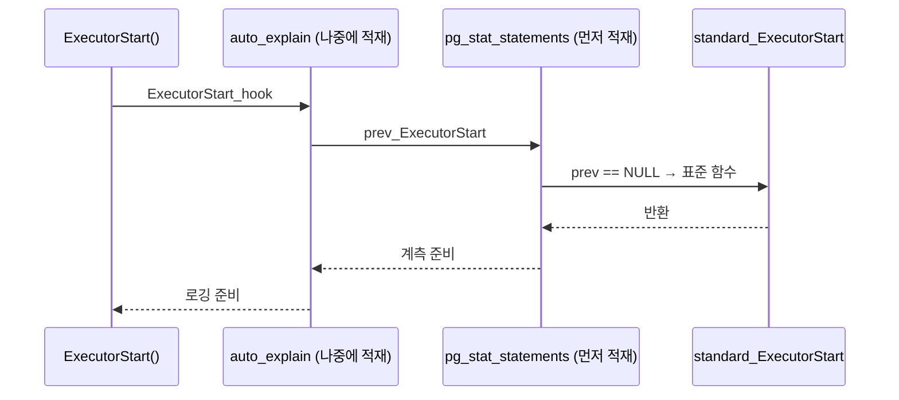

결과적으로 훅은 **연결 리스트처럼 쌓이며 나중에 적재된 것이 바깥**에 온다. 체인을 끊지 않는 것(이전 값을 반드시 호출)이
확장 작성자의 의무이고, 서버는 이를 강제하지 않는다.

### 8.3 실제 모듈이 어떤 훅을 쓰는가 — 심볼 테이블로 확인

설치된 `.dylib`의 미정의 심볼(`nm -u`)을 보면 그 모듈이 참조하는 서버 전역 변수 = 쓰는 훅이 드러난다 (V11).

| 모듈 | 정의 심볼 | 참조하는 훅·등록 API |
|---|---|---|
| `pg_stat_statements` | `_PG_init`, `Pg_magic_func` | `shmem_request_hook`, `shmem_startup_hook`, `post_parse_analyze_hook`, `planner_hook`, `ExecutorStart/Run/Finish/End_hook`, `ProcessUtility_hook`, `RequestAddinShmemSpace`, `RequestNamedLWLockTranche`, `DefineCustom*Variable`, `MarkGUCPrefixReserved` |
| `auto_explain` | `_PG_init`, `Pg_magic_func` | `ExecutorStart/Run/Finish/End_hook`, `DefineCustom*Variable` |
| `passwordcheck` | `_PG_init`, `Pg_magic_func` | `check_password_hook` |
| `auth_delay` | `_PG_init`, `Pg_magic_func` | `ClientAuthentication_hook` |
| `pg_overexplain` (PG18) | `_PG_init`, `Pg_magic_func` | `explain_per_plan_hook`, `explain_per_node_hook` |
| `pg_prewarm` | `_PG_init`, `Pg_magic_func` | `RegisterBackgroundWorker` |
| `test_decoding` | `_PG_init`, `_PG_output_plugin_init` | (훅 없음 — 출력 플러그인 진입점) |
| `bloom` | `_PG_init`, `blhandler` | `add_reloption_kind` (인덱스 AM — 훅 없음, 카탈로그 등록형) |

macOS Mach-O 심볼은 앞에 `_`가 붙어 `__PG_init`, `_planner_hook`처럼 보인다. 표에서는 C 이름으로 적었다.

## 9. 라이브러리 적재 — shared_preload_libraries와 _PG_init

### 9.1 적재 경로 4가지

| 방법 | 시점 | 프로세스 | 권한 (`pg_settings.context`) | 용도 |
|---|---|---|---|---|
| `shared_preload_libraries` | postmaster 기동 | postmaster (자식이 fork로 상속) | `postmaster` (재시작 필요) | 공유 메모리·bgworker·custom rmgr 필요한 모듈 |
| `session_preload_libraries` | 각 세션 시작 | 백엔드 | `superuser` | 세션마다 필요한 모듈 |
| `local_preload_libraries` | 각 세션 시작 | 백엔드 | `user` (`$libdir/plugins` 제한) | 일반 사용자용 |
| `LOAD 'x'` / 첫 C 함수 호출 | 즉시 | 현재 백엔드 | `LOAD`는 superuser 외 제한 | 일시 사용 |

라이브러리 탐색 경로는 `dynamic_library_path` (기본 `$libdir`), 확장 control 파일 탐색 경로는 PG18의
`extension_control_path` (기본 `$system`)이다 (실측 V14).

### 9.2 postmaster 기동 순서 — 왜 공유 메모리 확장은 preload여야 하는가

REL_18_STABLE `postmaster.c`의 `PostmasterMain()`에서 순서를 확인했다 (줄 번호는 해당 파일 기준).

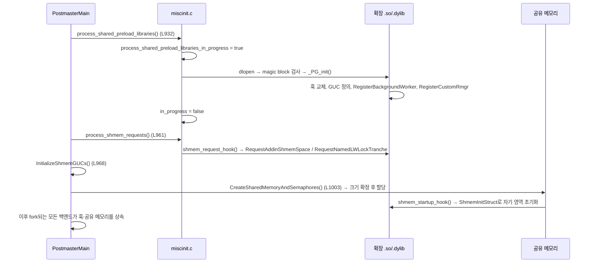

공유 메모리는 **기동 시 한 번 크기를 정해 할당**한다 ([[PostgreSQL/INTERNALS/02-PROCESS-MEMORY|02]]).
그 전에 요청하지 않은 모듈은 영역을 얻을 수 없다. 그래서 `pg_stat_statements`의 `_PG_init`은 첫 줄에서
preload 중이 아니면 아무것도 하지 않고 반환한다.

```c
void
_PG_init(void)
{
	if (!process_shared_preload_libraries_in_progress)
		return;

	EnableQueryId();
	/* DefineCustomIntVariable("pg_stat_statements.max", …) 등 GUC 5개 */
	MarkGUCPrefixReserved("pg_stat_statements");

	prev_shmem_request_hook = shmem_request_hook;
	shmem_request_hook = pgss_shmem_request;
	prev_shmem_startup_hook = shmem_startup_hook;
	shmem_startup_hook = pgss_shmem_startup;
	prev_post_parse_analyze_hook = post_parse_analyze_hook;
	post_parse_analyze_hook = pgss_post_parse_analyze;
	prev_planner_hook = planner_hook;
	planner_hook = pgss_planner;
	prev_ExecutorStart = ExecutorStart_hook;
	ExecutorStart_hook = pgss_ExecutorStart;
	/* ExecutorRun / Finish / End, ProcessUtility 동일 패턴 */
}
```

(REL_18_STABLE `contrib/pg_stat_statements/pg_stat_statements.c`에서 발췌, GUC 정의부와 반복부는 주석으로 축약.)

### 9.3 dfmgr.c — 라이브러리 하나를 여는 과정

REL_18_STABLE `src/backend/utils/fmgr/dfmgr.c`에서 확인한 흐름.

1. `dlopen(filename, RTLD_NOW | RTLD_GLOBAL)`
2. `dlsym(handle, PG_MAGIC_FUNCTION_NAME_STRING)`로 **magic block** 조회. 없으면
   `incompatible library "…": missing magic block`
3. magic 내용 비교 — 불일치 시 `version mismatch` / `ABI mismatch` / `magic block mismatch`
4. `dlsym(handle, "_PG_init")`가 있으면 호출
5. 한 번 연 라이브러리는 프로세스 수명 동안 유지 (언로드 없음)

magic block은 18.4 `fmgr.h`의 `PG_MODULE_MAGIC` 매크로가 만드는 `Pg_magic_struct`이며, PG18에서
`PG_MODULE_MAGIC_EXT(...)`가 추가되어 모듈 이름·버전을 담을 수 있게 되었다. 이렇게 담긴 정보는 PG18 신규 함수
`pg_get_loaded_modules()`로 보인다 (18 release notes, V14).

```text
    module_name     |     version     |        file_name
--------------------+-----------------+--------------------------
 pg_stat_statements | 18.4 (Homebrew) | pg_stat_statements.dylib
 pg_prewarm         | 18.4 (Homebrew) | pg_prewarm.dylib
```

### 9.4 실증 — preload 없이 쓰면 (V12), preload 후 (V13), LOAD 즉시 적재 (V15)

```text
-- shared_preload_libraries = ''
CREATE EXTENSION pg_stat_statements;       → CREATE EXTENSION  (SQL 객체는 만들어짐)
SELECT count(*) FROM pg_stat_statements;
ERROR:  pg_stat_statements must be loaded via "shared_preload_libraries"
```

`CREATE EXTENSION`은 **카탈로그 객체(뷰·함수)만** 만든다. 공유 메모리 영역과 훅은 별개이고, 그쪽은 preload 없이는 존재하지 않는다.
이 오류 문자열은 소스의 `pg_stat_statements_internal()`에 있다.

```text
-- shared_preload_libraries = 'pg_stat_statements,pg_prewarm' 후 재시작
SELECT count(*) FROM nums WHERE n > 0;
SELECT calls, rows, query FROM pg_stat_statements WHERE query LIKE 'select count(*) from nums%';
 calls | rows |                 query
-------+------+----------------------------------------
     1 |    1 | select count(*) from nums where n > $1
```

상수 `0`이 `$1`로 정규화되었다. `post_parse_analyze_hook`에서 받은 query ID(`compute_query_id = auto`이고
`_PG_init`이 `EnableQueryId()`를 호출했으므로 계산됨)로 묶은 결과다.

반면 공유 메모리가 필요 없는 `auto_explain`은 세션 안에서 `LOAD`만으로 동작했다.

```text
LOAD 'auto_explain';
SET auto_explain.log_min_duration = 0;
SET auto_explain.log_analyze = on;
SELECT count(*) FROM nums WHERE n > 0;
-- 서버 로그:
LOG:  duration: 0.309 ms  plan:
	Query Text: select count(*) from nums where n > 0;
	Aggregate  (cost=182.50..182.51 rows=1 width=8) (actual time=0.305..0.306 rows=1.00 loops=1)
	  ->  Seq Scan on nums  (cost=0.00..170.00 rows=5000 width=0) (actual …)
```

**preload가 필수인지 여부는 "공유 메모리·bgworker·rmgr를 쓰는가"로 갈린다.** 훅만 쓰는 모듈은 세션 단위로 적재해도 된다.

### 9.5 실증 환경 메모

- Unix 소켓 경로는 최대 103바이트라 긴 스크래치 경로를 `-k`로 줄 수 없었다. 소켓 디렉터리만 짧은 경로로 분리했다.
- macOS에서 locale 환경변수가 유효하지 않으면 postmaster가 `postmaster became multithreaded during startup`으로 기동을 거부했다
  (HINT: `LC_ALL`을 유효한 locale로). `LC_ALL=C`로 해결.
- `ALTER SYSTEM SET shared_preload_libraries = 'a,b'`처럼 **한 문자열로 따옴표를 감싸면** 목록이 아니라 이름 하나(`"a,b"`)로
  저장되어 재시작 시 `could not access file "pg_stat_statements,pg_prewarm"`로 기동 실패했다. 목록 GUC는
  `= 'a', 'b'`처럼 원소별로 써야 한다.

## 10. Background worker

### 10.1 구조

9.3에서 정적 background worker, 9.4에서 동적 등록이 들어왔다 (각 release notes).
18.4 `postmaster/bgworker.h`의 등록 구조체:

```c
typedef struct BackgroundWorker
{
	char		bgw_name[BGW_MAXLEN];
	char		bgw_type[BGW_MAXLEN];
	int			bgw_flags;
	BgWorkerStartTime bgw_start_time;
	int			bgw_restart_time;	/* in seconds, or BGW_NEVER_RESTART */
	char		bgw_library_name[MAXPGPATH];
	char		bgw_function_name[BGW_MAXLEN];
	Datum		bgw_main_arg;
	char		bgw_extra[BGW_EXTRALEN];
	pid_t		bgw_notify_pid; /* SIGUSR1 this backend on start/stop */
} BackgroundWorker;
```

| 항목 | 값 (18.4 헤더) | 의미 |
|---|---|---|
| `bgw_flags` | `BGWORKER_SHMEM_ACCESS` (0x0001), `BGWORKER_BACKEND_DATABASE_CONNECTION` (0x0002) | 공유 메모리 접근 / DB 접속(후자는 전자 필요) |
| `bgw_start_time` | `BgWorkerStart_PostmasterStart`, `BgWorkerStart_ConsistentState`, `BgWorkerStart_RecoveryFinished` | 언제 띄울지 |
| `bgw_restart_time` | 초 단위 또는 `BGW_NEVER_RESTART` (-1) | 비정상 종료 후 재기동 간격 |
| `BGW_MAXLEN` | 96 | 이름 길이 상한 |
| `bgw_library_name` + `bgw_function_name` | 진입점 | **함수 포인터가 아니라 이름**으로 지정 — fork 후(또는 EXEC_BACKEND 환경에서) 새 프로세스가 다시 찾아야 하므로 |

| 등록 API | 호출 시점 | 비고 |
|---|---|---|
| `RegisterBackgroundWorker()` | `_PG_init` (preload 중) | 소스: preload 밖에서 부르면 `must be registered in "shared_preload_libraries"` LOG 후 무시 |
| `RegisterDynamicBackgroundWorker()` | 실행 중 아무 백엔드 | 공유 메모리의 워커 슬롯을 사용 |

### 10.2 서버 자신도 bgworker를 쓴다

REL_18_STABLE `bgworker.c`의 `InternalBGWorkers` 배열 진입점: `ParallelWorkerMain`, `ApplyLauncherMain`,
`ApplyWorkerMain`, `ParallelApplyWorkerMain`, `TablesyncWorkerMain`. 즉 **병렬 쿼리 워커와 논리 복제 워커가 모두
동적 background worker**다. 확장이 쓰는 인프라와 코어 기능이 같은 인프라다.

실측 (V16, V17):

```text
-- pg_stat_activity.backend_type (preload: pg_stat_statements, pg_prewarm)
 autovacuum launcher
 background writer
 checkpointer
 client backend
 io worker            × 3   (PG18 AIO, io_method = worker, io_workers = 3)
 logical replication launcher   ← bgworker (ApplyLauncherMain)
 walwriter

-- ps 출력에는 별도로
 postgres: autoprewarm leader   ← pg_prewarm이 RegisterBackgroundWorker로 띄운 정적 워커
```

`autoprewarm leader`는 OS 프로세스로는 보였지만 이 시점 `pg_stat_activity`에는 나타나지 않았다. 원인은 이 문서에서 추적하지 않았다 (확인 필요).

```text
EXPLAIN (ANALYZE) SELECT count(*) FROM sk;      -- 병렬 비용 0으로 강제
 Finalize Aggregate (actual rows=1.00 loops=1)
   ->  Gather (actual rows=3.00 loops=1)
         Workers Planned: 2
         Workers Launched: 2                   ← 동적 bgworker 2개가 실제로 기동
         ->  Partial Aggregate (actual rows=1.00 loops=3)
               ->  Parallel Seq Scan on sk (actual rows=33333.33 loops=3)
```

## 11. Logical decoding output plugin (9.4+)

WAL을 논리 변경(행 단위 INSERT/UPDATE/DELETE)으로 해독하는 기능. 해독 엔진은 코어에 있고, **출력 형식만 플러그인**이 정한다.
코어 논리 복제가 쓰는 `pgoutput`도 같은 인터페이스의 플러그인이다 (`pkglibdir`에 `pgoutput.dylib`로 존재).

### 11.1 진입점과 콜백

18.4 `replication/output_plugin.h`: 플러그인은 `_PG_output_plugin_init(OutputPluginCallbacks *cb)`를 export하고,
그 안에서 콜백 구조체를 채운다.

| 그룹 | 콜백 |
|---|---|
| 기본 | `startup_cb`, `begin_cb`, `change_cb`, `truncate_cb`, `commit_cb`, `message_cb`, `filter_by_origin_cb`, `shutdown_cb` |
| 2PC | `filter_prepare_cb`, `begin_prepare_cb`, `prepare_cb`, `commit_prepared_cb`, `rollback_prepared_cb` |
| 스트리밍(진행 중 대형 트랜잭션) | `stream_start_cb`, `stream_stop_cb`, `stream_abort_cb`, `stream_prepare_cb`, `stream_commit_cb`, `stream_change_cb`, `stream_message_cb`, `stream_truncate_cb` |

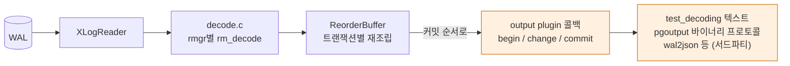

`decode.c`·`ReorderBuffer` 단계 이름은 일반적인 구조 설명이며, `rm_decode` 콜백이 `RmgrData`에 있다는 점은 18.4 헤더로 확인했다 (§12).

### 11.2 실증 — test_decoding (V18)

`wal_level = logical`로 재시작 후:

```sql
SELECT * FROM pg_create_logical_replication_slot('s1', 'test_decoding');
CREATE TABLE ld (id int PRIMARY KEY, v text);
INSERT INTO ld VALUES (1,'a');
UPDATE ld SET v='b' WHERE id=1;
SELECT data FROM pg_logical_slot_get_changes('s1', NULL, NULL);
```

```text
 BEGIN 819
 COMMIT 819                                       ← CREATE TABLE: DDL은 행 변경이 없어 빈 트랜잭션
 BEGIN 820
 table public.ld: INSERT: id[integer]:1 v[text]:'a'
 COMMIT 820
 BEGIN 821
 table public.ld: UPDATE: id[integer]:1 v[text]:'b'
 COMMIT 821
```

DDL은 해독 대상이 아니다. 논리 복제가 스키마 변경을 복제하지 않는 근본 이유가 여기 있다.

## 12. Custom WAL resource manager (PG15+)

PG15 release notes(Source Code 절): 확장이 custom WAL resource manager를 정의할 수 있게 되었다.
그 이전에는 9.6의 **generic WAL**(표준 페이지 레이아웃 변경을 범용 redo로 재생)이 확장용 유일한 WAL 수단이었다.
`bloom` 인덱스 AM이 generic WAL 방식을 쓰는 대표 예로 알려져 있으나, 이 문서에서는 bloom 소스를 확인하지 않았다 (확인 필요).

18.4 `access/xlog_internal.h`의 `RmgrData`:

```c
typedef struct RmgrData
{
	const char *rm_name;
	void		(*rm_redo) (XLogReaderState *record);
	void		(*rm_desc) (StringInfo buf, XLogReaderState *record);
	const char *(*rm_identify) (uint8 info);
	void		(*rm_startup) (void);
	void		(*rm_cleanup) (void);
	void		(*rm_mask) (char *pagedata, BlockNumber blkno);
	void		(*rm_decode) (struct LogicalDecodingContext *ctx,
							  struct XLogRecordBuffer *buf);
} RmgrData;
```

| 항목 | 18.4 값 / 규칙 | 근거 |
|---|---|---|
| 내장 rmgr | 22개 (ID 0 `XLOG` … 21 `LogicalMessage`) | `pg_get_wal_resource_managers()` 실측 |
| custom ID 범위 | `RM_MIN_CUSTOM_ID = 128` ~ `RM_MAX_CUSTOM_ID = UINT8_MAX` (255) | `access/rmgr.h` |
| 실험용 예약 ID | `RM_EXPERIMENTAL_ID = 128` | `access/rmgr.h` |
| 등록 API | `RegisterCustomRmgr(RmgrId, const RmgrData *)` | `access/xlog_internal.h` |
| 등록 조건 | preload 중일 것, ID 범위 내, ID·이름 중복 없음(이름은 대소문자 무시 비교) | `rmgr.c` |

**rmgr를 preload에서만 등록할 수 있는 이유**는 크래시 복구 때문이다. startup 프로세스가 redo를 시작하기 전에
WAL 레코드의 rmgr ID를 해석할 수 있어야 하므로, 해당 모듈은 postmaster 기동 단계에 이미 적재되어 있어야 한다.
custom rmgr 레코드가 남은 WAL을 그 모듈 없이 재생하려 하면 복구가 불가능하다는 운영상 함의도 따라온다.

내장 22개 (실측): `XLOG, Transaction, Storage, CLOG, Database, Tablespace, MultiXact, RelMap, Standby, Heap2, Heap, Btree,
Hash, Gin, Gist, Sequence, SPGist, BRIN, CommitTs, ReplicationOrigin, Generic, LogicalMessage`.
6종 인덱스 AM이 각자 rmgr를 갖고 있고, `Generic`이 9.6 generic WAL이다. 인덱스 AM과 WAL rmgr의 짝 구조는
[[PostgreSQL/INTERNALS/04-MVCC-WAL|04. MVCC·WAL]]의 WAL 레코드 설명과 이어진다.

## 13. pg_stat_statements 해부 — 훅을 조합한 확장의 표본

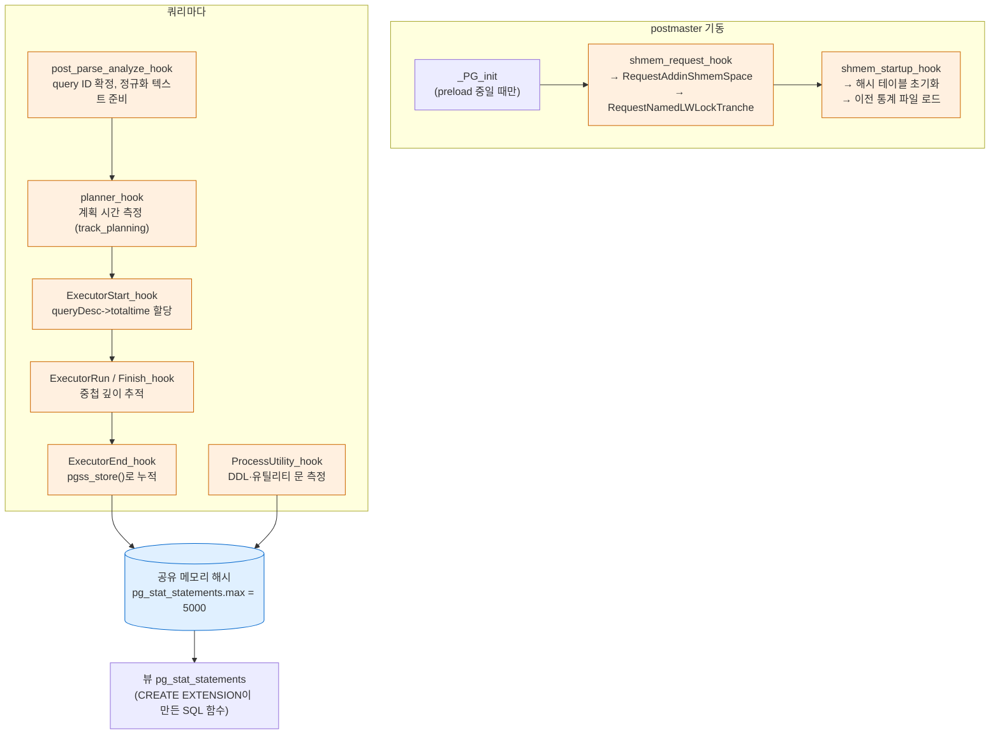

| 구성 요소 | 무엇으로 만들어지나 | preload 없이 존재? |
|---|---|---|
| 뷰·함수 (`pg_stat_statements`, `pg_stat_statements_reset()`) | `CREATE EXTENSION` → 카탈로그 | ✅ (V12에서 생성됨) |
| GUC 5개 (`pg_stat_statements.max/track/track_utility/track_planning/save`) | `_PG_init`의 `DefineCustom*Variable` | ❌ |
| 공유 메모리 해시·LWLock | `shmem_request_hook` + `shmem_startup_hook` | ❌ |
| 측정 | 8개 훅 | ❌ |

`pg_stat_statements.max` 기본값 5000, context `PGC_POSTMASTER`는 소스의 `DefineCustomIntVariable` 인자로 확인했다.
preload 후 `pg_settings`에서 `pg_stat_statements.%` GUC 5개를 실측했다.

카탈로그 쪽 확장(SQL 객체)과 프로세스 쪽 확장(훅·공유 메모리)이 **하나의 확장 이름 아래 따로 놀 수 있다**는 점이
운영 장애의 흔한 원인이다. "확장은 설치했는데 뷰가 오류" = 카탈로그만 있고 preload가 빠진 상태.

## 14. CREATE EXTENSION 메커니즘

### 14.1 구성 파일

확장 하나는 `$(pg_config --sharedir)/extension/` 아래의 **control 파일 + SQL 스크립트들**과,
필요하면 `$(pg_config --pkglibdir)`의 공유 라이브러리로 구성된다. 이 환경의 control 파일 수는 56개였다.

```text
# pg_trgm extension                                   ← $SHAREDIR/extension/pg_trgm.control
comment = 'text similarity measurement and index searching based on trigrams'
default_version = '1.6'
module_pathname = '$libdir/pg_trgm'
relocatable = true
trusted = true
```

```text
$SHAREDIR/extension/ 의 pg_trgm 관련 파일
pg_trgm.control
pg_trgm--1.3.sql            ← 설치 스크립트 (기준 버전)
pg_trgm--1.0--1.1.sql       ← 업데이트 스크립트들
pg_trgm--1.1--1.2.sql
pg_trgm--1.2--1.3.sql
pg_trgm--1.3--1.4.sql
pg_trgm--1.4--1.5.sql
pg_trgm--1.5--1.6.sql
```

control 파일 파라미터 (docs/18/extend-extensions.html):

| 파라미터 | 의미 |
|---|---|
| `directory` | 스크립트 디렉터리 (기본: control 파일 위치) |
| `default_version` | `VERSION` 생략 시 설치 버전 |
| `comment` | 확장 주석 (최초 생성 시에만 적용) |
| `encoding` | 스크립트 문자 인코딩 |
| `module_pathname` | 스크립트의 `MODULE_PATHNAME` 치환값 |
| `requires` | 선행 확장 목록 |
| `no_relocate` | `@extschema:name@`으로 참조하는, 스키마 변경 불가로 묶을 선행 확장 |
| `superuser` | 기본 true — 슈퍼유저만 설치·업데이트 |
| `trusted` | true면 DB `CREATE` 권한 보유 비슈퍼유저도 설치 가능 (PG13+) |
| `relocatable` | 설치 후 `ALTER EXTENSION … SET SCHEMA` 허용 |
| `schema` | 비재배치 확장의 고정 스키마 |

스크립트 안의 `MODULE_PATHNAME`은 C 함수의 `AS 'MODULE_PATHNAME'`에, `@extschema@`는 대상 스키마 이름으로 치환된다.
pg_trgm 업데이트 스크립트는 첫 줄 `\echo … \quit`로 psql 직접 실행을 막는다.

```sql
-- pg_trgm--1.5--1.6.sql 발췌
\echo Use "ALTER EXTENSION pg_trgm UPDATE TO '1.6'" to load this file. \quit

ALTER OPERATOR FAMILY gin_trgm_ops USING gin ADD
        OPERATOR        11       pg_catalog.= (text, text);
```

1.6의 변화가 **opfamily에 `=` 연산자 하나 추가**라는 것이 §4.5 표의 전략 11과 정확히 대응한다.

### 14.2 실행 흐름 (extension.c)

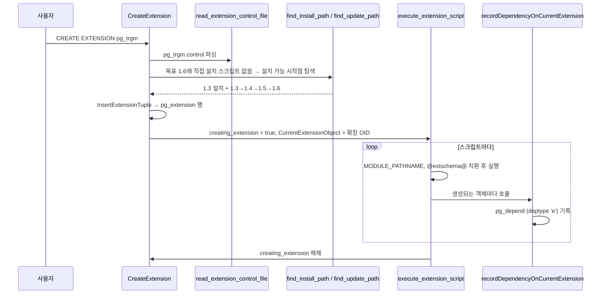

| 함수 (REL_18_STABLE `commands/extension.c`) | 역할 |
|---|---|
| `CreateExtension` → `CreateExtensionInternal` | 진입점, `requires`·`CASCADE` 처리 |
| `read_extension_control_file` | control 파싱 (`trusted` 등) |
| `find_install_path` | 목표 버전의 직접 설치 스크립트가 없을 때 **설치 가능한 시작 버전 + 업데이트 경로** 선택. 주석: 짧은 경로 우선, 동률이면 시작 버전 이름 strcmp |
| `find_update_path` | 버전 그래프에서 **Dijkstra** 최단 경로 (소스 주석에 명시) |
| `execute_extension_script` | `creating_extension = true; CurrentExtensionObject = extensionOid;` 설정 후 스크립트 실행 |
| `extension_is_trusted` | control의 `trusted` 이고 현재 DB에 `ACL_CREATE`가 있으면 true |
| `ExecAlterExtensionStmt` → `ApplyExtensionUpdates` | `ALTER EXTENSION UPDATE` |
| `recordDependencyOnCurrentExtension` (`catalog/pg_depend.c`) | `creating_extension`일 때 새 객체를 확장 소속으로 기록. 이미 다른 확장 소속이면 오류 |

전역 플래그 `creating_extension`이 켜져 있는 동안 **모든 DDL이 자동으로 확장 소속이 된다**는 점이 핵심이다.
스크립트 작성자가 소속을 일일이 선언하지 않는 이유다.

### 14.3 실증 — 버전 그래프 (V21)

```sql
SELECT * FROM pg_extension_update_paths('pg_trgm') WHERE source = '1.3' AND path IS NOT NULL;
SELECT * FROM pg_extension_update_paths('pg_trgm') WHERE source = '1.0' AND target = '1.6';
```

```text
 source | target |        path
--------+--------+--------------------
 1.3    | 1.4    | 1.3--1.4
 1.3    | 1.5    | 1.3--1.4--1.5
 1.3    | 1.6    | 1.3--1.4--1.5--1.6

 source | target |               path
--------+--------+-----------------------------------
 1.0    | 1.6    | 1.0--1.1--1.2--1.3--1.4--1.5--1.6
```

`pg_available_extension_versions`에는 pg_trgm이 1.3~1.6만 나왔다. 1.0~1.2는 그 버전에 도달하는 **설치 경로**가 없기 때문
(설치 스크립트가 1.3뿐이고 업데이트는 순방향만 있음). 1.0→1.6 경로는 구 버전에서 올라오는 기존 DB를 위한 것이다.

실제로 구 버전을 설치하고 올렸다 (V24).

```text
CREATE EXTENSION pg_trgm VERSION '1.3' SCHEMA old;   → extversion 1.3, 소속 객체 37개
ALTER EXTENSION pg_trgm UPDATE;                      → extversion 1.6, 소속 객체 47개
```

업데이트 스크립트 3개가 객체 10개를 더했다.

### 14.4 실증 — 소속 객체 추적 (V22, V23)

`CREATE EXTENSION pg_trgm`(1.6) 직후:

```sql
SELECT classid::regclass, count(*)
  FROM pg_depend d JOIN pg_extension e ON d.refobjid = e.oid AND d.refclassid = 'pg_extension'::regclass
 WHERE d.deptype = 'e' AND e.extname = 'pg_trgm'
 GROUP BY 1 ORDER BY 2 DESC;
```

```text
   classid   | count
-------------+-------
 pg_proc     |    31
 pg_operator |    10
 pg_type     |     2
 pg_opclass  |     2
 pg_opfamily |     2
```

`pg_type` 2개는 `gtrgm`과 `gtrgm[]`(GiST 내부 키 타입과 그 배열), opclass 2개는 `gin_trgm_ops`·`gist_trgm_ops`.
연산자 10개: `%`, `%>`, `%>>`, `<%`, `<<%`, `<->`, `<->>`, `<->>>`, `<<->`, `<<<->` (모두 `(text,text)`).

소속 객체는 개별 삭제가 막힌다.

```text
DROP FUNCTION similarity(text,text);
ERROR:  2BP01: cannot drop function similarity(text,text) because extension pg_trgm requires it
HINT:  You can drop extension pg_trgm instead.
LOCATION:  findDependentObjects, dependency.c:791
```

`deptype 'e'`가 일반 의존성(`'n'`)과 다른 점은 이것과, pg_dump가 소속 객체를 **개별 DDL이 아니라 `CREATE EXTENSION` 한 줄**로
덤프한다는 점이다. 확장 테이블 중 사용자 데이터를 담는 것은 `pg_extension_config_dump()`로 표시해 데이터를 덤프에 포함시킨다
(공식 문서).

확장 AM도 같은 방식으로 추적된다. `CREATE EXTENSION bloom`의 소속 객체 (V9b):

```text
 function blhandler(internal)
 access method bloom
 operator family int4_ops for access method bloom
 operator class int4_ops for access method bloom
 operator family text_ops for access method bloom
 operator class text_ops for access method bloom
```

`pg_am`에 `bloom | blhandler | i` (OID 16606, 사용자 OID 범위) 행이 생겼고, 3컬럼 bloom 인덱스로 `b = 5 AND c = 3` 조건이
`Bitmap Index Scan on bt_bloom`을 탔다. bloom의 `can_order = f`, `can_multi_col = t`. **코어 6종과 똑같은 경로로 7번째 AM이 꽂힌 것**이다.

### 14.5 실증 — requires·trusted (V25~V27)

```text
CREATE EXTENSION earthdistance;
ERROR:  required extension "cube" is not installed
HINT:  Use CREATE EXTENSION ... CASCADE to install required extensions too.

CREATE EXTENSION earthdistance CASCADE;
NOTICE:  installing required extension "cube"
```

비슈퍼유저 `app`에게 DB `CREATE` 권한만 주고:

```text
SET ROLE app;
CREATE EXTENSION pgcrypto;        → 성공 (trusted = true)
CREATE EXTENSION pageinspect;
ERROR:  permission denied to create extension "pageinspect"
HINT:  Must be superuser to create this extension.
```

trusted 확장의 소유 구조가 흥미롭다.

| 대상 | 소유자 (실측) |
|---|---|
| `pg_extension.extowner` (pgcrypto) | `app` (설치한 사람) |
| 소속 함수 37개의 `proowner` | `postgres` (부트스트랩 슈퍼유저) |

스크립트는 슈퍼유저 권한으로 실행되고 객체도 슈퍼유저 소유가 되며, 확장 자체만 설치자 소유로 남는다.
설치자가 확장의 C 함수를 마음대로 `ALTER`할 수 없게 하는 장치로 볼 수 있다
([[PostgreSQL/15-AUTHORITY|15. 권한 체계]]의 소유권 개념과 연결).

이 환경에서 trusted로 표시된 확장은 25개: `bool_plperl, btree_gin, btree_gist, citext, cube, dict_int, fuzzystrmatch, hstore,
intarray, isn, jsonb_plperl, lo, ltree, pg_trgm, pgcrypto, plperl, plpgsql, pltcl, seg, tablefunc, tcn, tsm_system_rows,
tsm_system_time, unaccent, uuid-ossp`. 공통점은 **서버 파일·메모리·다른 세션에 접근하지 않는** 확장이라는 것이다.
`pageinspect`(원시 페이지 읽기), `file_fdw`(서버 파일 읽기), `pg_stat_statements`(모든 쿼리 열람)는 untrusted.

### 14.6 수치 요약 (V20, V28)

| 항목 | 값 |
|---|---|
| control 파일 수 (`$SHAREDIR/extension/*.control`) | 56 |
| `pg_available_extensions` | 56 (initdb 직후 설치 1개 = `plpgsql`) |
| `pg_available_extension_versions` | 127 |
| trusted 확장 | 25 |
| `pkglibdir`의 `.dylib` | 92 (인코딩 변환 모듈·libpq 등 포함) |

`plpgsql`은 initdb가 `pg_catalog`에 설치하며 `extrelocatable = f`였다. 기본 언어도 확장 메커니즘으로 관리된다.

## 15. 버전별 주요 기능 연표 (9.0 ~ 18)

각 버전 release notes의 Overview/Major Enhancements에서 확인한 것만 적었다. 날짜는 x.0 출시일.

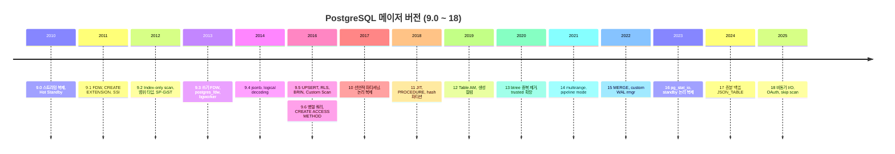

| 버전 | 출시일 | 주요 기능 (release notes 확인) | 확장성 관점 의미 |
|---|---|---|---|
| **9.0** | 2010-09-20 | 스트리밍 복제, Hot Standby, `DO` 익명 블록, PL/pgSQL 기본 설치, 배제 제약, 컬럼 트리거·`WHEN`, `VACUUM FULL` 재작성, pg_upgrade(contrib), 64비트 Windows | 배제 제약 = GiST opclass 활용 |
| **9.1** | 2011-09-12 | 동기 복제, 외부 테이블(SQL/MED), **`CREATE EXTENSION`**, SERIALIZABLE(SSI), unlogged 테이블, 컬럼별 collation, KNN-GiST, 쓰기 가능 CTE | 확장 패키징·FDW의 시작 |
| **9.2** | 2012-09-10 | Index-only scan, 캐스케이드 복제, `json` 타입, 범위 타입, **SP-GiST**, security barrier 뷰, prepared statement custom plan | 새 인덱스 AM 추가 |
| **9.3** | 2013-09-09 | 머티리얼라이즈드 뷰, `LATERAL`, 쓰기 가능 외부 테이블, `postgres_fdw`, 이벤트 트리거, 데이터 체크섬, **background worker** | bgworker 인프라 |
| **9.4** | 2014-12-18 | `jsonb`, `ALTER SYSTEM`, **logical decoding**, 복제 슬롯, **동적 bgworker**, `REFRESH … CONCURRENTLY` | 출력 플러그인 API |
| **9.5** | 2016-01-07 | `INSERT … ON CONFLICT`, RLS, **BRIN**, `GROUPING SETS`/`CUBE`/`ROLLUP`, `IMPORT FOREIGN SCHEMA`, `TABLESAMPLE`, **Custom Scan·조인 pushdown 훅** | Custom Scan, TSM 핸들러 |
| **9.6** | 2016-09-29 | **병렬** 순차 스캔·조인·집계, freeze map, 다중 동기 standby, 구문 검색, postgres_fdw 원격 조인·정렬·UPDATE/DELETE, **generic WAL**, **`CREATE ACCESS METHOD`**(인덱스 AM) | 인덱스 AM을 확장으로 |
| **10** | 2017-10-05 | 선언적 파티셔닝(range/list), 논리 복제(pub/sub), 병렬 확대, quorum commit, SCRAM-SHA-256, hash 인덱스 WAL 기록, **두 자리 버전 체계** | `pgoutput` 기반 논리 복제 |
| **11** | 2018-10-18 | hash 파티셔닝, default 파티션, 파티션 pruning 강화, 파티션 PK/FK, `CREATE PROCEDURE`(트랜잭션 제어), **JIT(LLVM)**, 커버링 인덱스(`INCLUDE`), 병렬 btree 빌드 | — |
| **12** | 2019-10-03 | **pluggable table storage(Table AM)**, stored 생성 컬럼, JIT 기본 활성(빌드 지원 시), CTE 자동 인라인, SQL/JSON path, `REINDEX CONCURRENTLY`, `WITH OIDS` 제거, GiST `INCLUDE` | 테이블 AM을 확장으로 |
| **13** | 2020-09-24 | btree 중복 제거, incremental sort, 병렬 인덱스 VACUUM, 내장 `gen_random_uuid()`, **trusted 확장**, 파티션 테이블 논리 복제 | 비슈퍼유저 확장 설치 |
| **14** | 2021-09-30 | 프로시저 `OUT` 파라미터, CTE `SEARCH`/`CYCLE`, 임의 타입 subscripting(jsonb 포함), **multirange**, libpq pipeline mode, 표현식 확장 통계, SP-GiST `INCLUDE` | `SUBSCRIPT` 타입 속성 |
| **15** | 2022-10-13 | `MERGE`, 논리 복제 컬럼 목록·행 필터, zstd/LZ4 압축, JSON 로그, 정렬 성능, exclusive 백업 모드 제거, **custom WAL rmgr** | WAL 확장 |
| **16** | 2023-09-14 | `FULL`/right outer 해시 조인 병렬화, standby에서 논리 복제, 대형 트랜잭션 병렬 apply, `pg_stat_io`, SQL/JSON 생성자, `pg_hba.conf` 정규식 | — |
| **17** | 2024-09-26 | VACUUM 메모리 구조 개편, `JSON_TABLE`, streaming I/O 순차 읽기, 다중 값 btree 검색, failover 슬롯, `pg_createsubscriber`, 증분 백업, `COPY ON_ERROR`, `MAINTAIN` 권한, `MERGE … RETURNING` | — |
| **18** | 2025-09-25 | §16 참고 | `PG_MODULE_MAGIC_EXT`, EXPLAIN 확장 훅 |

## 16. PostgreSQL 18 주요 기능 — release notes 확인 + 로컬 실측

공식 18 release notes(docs/18/release-18.html, 출시 2025-09-25)의 Overview 8개 항목과 그 밖의 확인 항목을 18.4에서 직접 확인했다.

| 기능 | release notes | 18.4 로컬 실측 (V29~V35) |
|---|---|---|
| 비동기 I/O (AIO) | 순차 스캔·비트맵 힙 스캔·VACUUM 등 개선. `io_method`로 제어 | `io_method = worker`, `io_workers = 3`, `io_combine_limit = 16`; `pg_stat_activity`에 `io worker` 3개 |
| pg_upgrade가 옵티마이저 통계 유지 | 확장 통계는 제외, `--no-statistics`로 끌 수 있음 | (pg_upgrade 미실행 — 미실측) |
| btree **skip scan** | 다중 컬럼 btree에서 선두 컬럼 조건 없이도 사용 | `(a,b)` 인덱스(a 5종)에서 `WHERE b = 777` → `Index Only Scan`, `Index Searches: 6` |
| `uuidv7()` | 시간순 정렬 UUID | `uuid_extract_version(uuidv7()) = 7` (`gen_random_uuid()`는 4) |
| 가상 생성 컬럼 | 읽을 때 계산. **생성 컬럼 기본값이 VIRTUAL** | `b int GENERATED ALWAYS AS (a*2)` → `attgenerated = 'v'` |
| OAuth 인증 | `pg_hba.conf` `oauth` 방식, `oauth_validator_libraries` | GUC 존재 확인 (값 비어 있음) — 인증 흐름 미실측 |
| `RETURNING`의 `OLD`/`NEW` | INSERT/UPDATE/DELETE/MERGE | `INSERT … RETURNING old.b, new.b` → `NULL`, `2` |
| 시간 제약 (`WITHOUT OVERLAPS`) | PK/UNIQUE/FK에 범위 비겹침 | `PRIMARY KEY (id, during WITHOUT OVERLAPS)`에 겹치는 기간 INSERT → `conflicting key value violates exclusion constraint` (`btree_gist` 필요) |
| MD5 비밀번호 폐기 예고 | CREATE/ALTER ROLE 시 경고, `md5_password_warnings` | GUC `md5_password_warnings = on` |
| initdb 체크섬 기본 활성 | `--no-data-checksums`로 끔 | `-k` 없이 initdb → `Data page checksum version: 1` ([[PostgreSQL/INTERNALS/03-STORAGE\|03]] §1 실측) |
| `PG_MODULE_MAGIC_EXT` | 확장이 이름·버전 보고, `pg_get_loaded_modules()` | 헤더 매크로 확인, 함수 결과 확인 (V14) |
| `pg_overexplain` | EXPLAIN 디버그 정보 확장 | `pkglibdir`에 존재, explain 훅 2개 참조 (V11) |
| `extension_control_path` | control 파일 추가 탐색 경로 | GUC 기본값 `$system` |

skip scan의 `Index Searches: 6`은 선두 컬럼 `a`의 서로 다른 값 5개 각각에 대해 하강 + 종료 확인으로 읽힌다.
skip scan이 btree opclass의 6번 지원 함수(`BTSKIPSUPPORT_PROC`, int4는 `btint4skipsupport`)와 연결된다는 것은 §3.6 헤더로 확인했다.
`Index Searches` 숫자의 정확한 계산 규칙은 이 문서에서 소스로 확인하지 않았다 (확인 필요).

JIT는 이 Homebrew 빌드에서 `jit = on`이지만 `pg_jit_available() = f`였다. LLVM 지원 없이 빌드된 바이너리에서는
GUC가 켜져 있어도 JIT가 동작하지 않는다(PG12 release notes의 "빌드 지원 시 기본 활성"과 일치).

## 17. 설계 교리와의 연결 — 확장 가능한 DBMS라는 출발점

Stonebraker와 Rowe의 *The Design of POSTGRES* (ACM SIGMOD, 1986년 5월 — PostgreSQL 공식 문서 참고문헌 [ston86])는
초록에서 설계 목표 6개를 나열한다. 그중 두 번째가 이 문서 전체의 원형이다.

> "provide user extendibility for data types, operators and access methods" — Stonebraker & Rowe, *The Design of POSTGRES*

같은 논문 2절은 그 이유를, 기존 관계형 DBMS가 소수의 내장 타입과 접근 방법만 가져서 CAD나 지도 같은 응용이 필요로 하는
전용 타입(기하 타입, 위경도 등)을 내장 타입으로 흉내 내면 질의가 장황해지고 성능도 나쁘다는 데서 찾는다.
01편에서 다룬 설계 교리 가운데 "확장성"이 40년 가까이 어떤 구조로 실현되어 왔는지를 이 문서의 절들과 짝지으면:

| POSTGRES 목표 (1986) | 오늘의 구현 | 절 |
|---|---|---|
| 데이터 타입 확장 | `CREATE TYPE` + C in/out 함수, 범위·multirange·도메인 | §4.1~4.2 |
| 연산자 확장 | `CREATE OPERATOR` → `pg_operator` | §4.3 |
| 접근 방법 확장 | 연산자 클래스(기존 AM에 새 타입), `CREATE ACCESS METHOD`(새 AM, 9.6 인덱스 / 12 테이블) | §3, §4.4, §5 |
| (논문 이후 추가) 외부 데이터 | FDW (9.1) | §6 |
| (논문 이후 추가) 실행 경로 개입 | 훅, Custom Scan (9.5) | §7, §8 |
| (논문 이후 추가) 프로세스·WAL 수준 | bgworker (9.3), logical decoding (9.4), custom rmgr (15) | §10~12 |
| (논문 이후 추가) 배포 단위 | `CREATE EXTENSION` (9.1), trusted (13) | §14 |

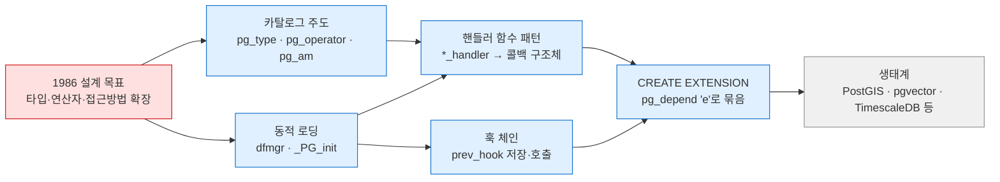

(생태계 노드의 서드파티 확장 이름은 널리 알려진 예시이며, 이 문서에서 해당 확장의 내부 구조를 확인하지는 않았다.)

관찰 한 가지. PostgreSQL은 **옵티마이저 힌트를 코어에 넣지 않는다**는 정책을 유지해 왔는데(01편), 같은 서버가
`planner_hook`·`set_rel_pathlist_hook`·`get_relation_info_hook`으로 플래너 내부를 확장에 열어 둔다.
"코어는 원칙을 지키고, 원칙에서 벗어나는 요구는 확장 지점으로 흡수한다"는 태도가 확장성 구조 전반에 깔려 있다고 해석할 수 있다
(해석이며, 공식 입장 문서로 확인한 내용은 아님).

이 시리즈를 01에서 09까지 읽으면, 결국 확장성은 **카탈로그(06)를 진리의 원천으로 두고, fmgr(07)로 C 코드를 부르고,
프로세스 모델(02) 위에서 공유 메모리를 기동 시 고정한다**는 앞선 설계 선택들의 귀결이다.
반대로 이 세 가지가 확장 작성의 제약(preload 필수, 재시작 필요, 체인 유지 의무)도 함께 만든다.

## 18. 실증 기록 (PostgreSQL 18.4)

로컬 임시 클러스터(`initdb -U postgres --auth=trust -E UTF8 --locale=C`, 포트 55409)에서 검증.
중간에 `shared_preload_libraries = 'pg_stat_statements,pg_prewarm'`, `wal_level = logical`로 두 차례 재시작했다.
경로는 `$SHAREDIR` = `pg_config --sharedir`, `$SCRATCH` = 스크래치 디렉터리로 치환.

| # | 시나리오 | 결과 |
|---|---|---|
| V1 | `pg_am` 전체 조회 | 7행: heap(t) + btree/hash/gist/gin/brin/spgist(i). OID 2/403/405/783/2742/3580/4000 |
| V2 | `pg_indexam_has_property` 5종 × 6 AM | can_order·can_unique는 btree만, can_include는 btree·gist·spgist |
| V3 | `pg_index(_column)_has_property` 9종 × 6 인덱스 | gin·brin `index_scan = f`(비트맵 전용), returnable은 btree·gist·spgist |
| V4 | `pg_type` typtype 분포·in/out 함수 | b 291 / c 144 / m 6 / p 26 / r 6. 도메인 출력 함수 = 기저 타입 `int4out` |
| V5 | `CREATE TYPE … AS RANGE` | `floatmultirange` 자동 생성, `pg_range.rngsubdiff = float8mi` |
| V6 | btree `integer_ops` 의 `pg_amop`/`pg_amproc` | 전략 1~5, 지원 함수 1·2·3·4·6 (`btint4skipsupport`). 패밀리 전체 45 연산자 / 9 타입쌍 |
| V7 | 사용자 정의 btree opclass `int4_abs_ops` (PL/pgSQL 함수) | `n \|=\| 42` → Index Only Scan, 결과 -42·42. 일반 `=`는 Seq Scan |
| V7b | 같은 opclass를 `LANGUAGE sql` 함수로 | 인라이닝으로 `abs(n) = 42` 변환 → Seq Scan (인덱스 미사용) |
| V8 | `LIKE '%abc%'` btree만 / `gin_trgm_ops` 추가 | Seq Scan → Bitmap Index Scan on words_trgm |
| V9 | `CREATE ACCESS METHOD myheap TYPE TABLE HANDLER heap_tableam_handler` | `CREATE TABLE … USING myheap` 성공, `relam` → myheap |
| V9b | `CREATE EXTENSION bloom` | `pg_am`에 bloom(i) 추가, 소속 객체 6개, 다중 컬럼 조건에 Bitmap Index Scan |
| V10a | file_fdw CSV 조회 + EXPLAIN | 3행 조회, `Filter: (id > 1)` 로컬 평가 |
| V10b | postgres_fdw 루프백 집계 | `Remote SQL: SELECT count(*) FROM public.nums WHERE ((n > 4990))`, 결과 10 |
| V10c | file_fdw 옵션 오타 | validator가 `invalid option "filenam"` + HINT |
| V11 | `nm`으로 모듈 심볼 확인 (8개 모듈) | pg_stat_statements가 훅 8개 + shmem API 참조 등 §8.3 표 |
| V12 | preload 없이 pg_stat_statements | `CREATE EXTENSION` 성공, 뷰 조회 시 `must be loaded via "shared_preload_libraries"` |
| V13 | preload 후 재시작 | `calls=1`, 쿼리 텍스트 `… where n > $1`로 정규화 |
| V14 | `pg_get_loaded_modules()` / 경로 GUC | 2개 모듈 버전 `18.4 (Homebrew)`. `extension_control_path = $system`, `dynamic_library_path = $libdir` |
| V15 | `LOAD 'auto_explain'` (세션) | 서버 로그에 실행 계획 출력 — preload 불필요 |
| V16 | 프로세스 목록 | `io worker` ×3, `logical replication launcher`; `autoprewarm leader`는 ps에만 보임 |
| V17 | 병렬 집계 강제 | `Workers Launched: 2` |
| V18 | `test_decoding` 슬롯 | INSERT/UPDATE 행 변경 텍스트 출력, CREATE TABLE은 빈 BEGIN/COMMIT |
| V19 | `pg_get_wal_resource_managers()` | 내장 22개 (0 XLOG … 21 LogicalMessage, `rm_builtin = t`) |
| V20 | `$SHAREDIR/extension` | control 56개, `pg_trgm.control` 내용 §14.1 |
| V21 | `pg_extension_update_paths('pg_trgm')` | 1.3→1.6 = `1.3--1.4--1.5--1.6`, 1.0→1.6 = 6단계 |
| V22 | pg_trgm 소속 객체 (`deptype 'e'`) | proc 31 / operator 10 / type 2 / opclass 2 / opfamily 2 |
| V23 | 소속 함수 개별 DROP | `2BP01 cannot drop function … because extension pg_trgm requires it` (`findDependentObjects`) |
| V24 | `VERSION '1.3'` 설치 후 `ALTER EXTENSION UPDATE` | 1.3 → 1.6, 소속 객체 37 → 47 |
| V25 | `earthdistance` (requires cube) | CASCADE 없이 오류, CASCADE로 cube 자동 설치 |
| V26 | 비슈퍼유저 + DB CREATE: pgcrypto / pageinspect | trusted 성공 / untrusted `Must be superuser` |
| V27 | trusted 확장 소유자 | `extowner = app`, 소속 함수 37개 `proowner = postgres` |
| V28 | 확장 수치 | available 56, versions 127, trusted 25 |
| V29 | PG18 `uuidv7()` | version 7 |
| V30 | PG18 생성 컬럼 기본 | `attgenerated = 'v'` |
| V31 | PG18 AIO 설정 | `io_method = worker`, `io_workers = 3` |
| V32 | PG18 `RETURNING old/new` | `NULL`, `2` |
| V33 | PG18 `WITHOUT OVERLAPS` PK | 겹침 INSERT 거부 |
| V34 | PG18 skip scan | `Index Searches: 6`, Index Only Scan |
| V35 | JIT 가용성 | `jit = on`이나 `pg_jit_available() = f` (LLVM 미포함 빌드) |

## 관련 문서

- [[PostgreSQL/INTERNALS/00-INDEX|내부 구조 분석서 인덱스]]
- [[PostgreSQL/INTERNALS/01-ORIGIN-PHILOSOPHY|01. 기원·개발 언어·설계 교리]] — POSTGRES 설계 목표, 힌트 거부 정책
- [[PostgreSQL/INTERNALS/02-PROCESS-MEMORY|02. 프로세스·메모리 아키텍처]] — 공유 메모리 고정 할당, 보조 프로세스·io worker
- [[PostgreSQL/INTERNALS/04-MVCC-WAL|04. 트랜잭션·MVCC·WAL 내부]] — 가시성 판정, WAL 레코드, 논리 복제 원리
- [[PostgreSQL/INTERNALS/05-QUERY-PIPELINE|05. 쿼리 처리 파이프라인]] — 훅이 끼어드는 단계들, 병렬 쿼리, JIT
- [[PostgreSQL/INTERNALS/06-CATALOG-OID|06. 시스템 카탈로그와 OID]] — 카탈로그 주도 설계, 고정 OID
- [[PostgreSQL/INTERNALS/07-FUNCTION-MANAGER|07. 함수 실행 구조 (fmgr)]] — 핸들러 호출 경로, C 확장 함수 빌드
- [[PostgreSQL/INTERNALS/08-SYSTEM-FUNCTIONS|08. 기본 제공 시스템 함수와 실행 경로]]
- [[PostgreSQL/09-POSTGRES-ONLY|09. PostgreSQL 고유 기능]] — JSONB·배열·범위·확장 사용법
- [[PostgreSQL/11-PERFORMANCE|11. 성능]] — 인덱스 선택과 EXPLAIN
- [[PostgreSQL/14-TUNING|14. DB 튜닝 방법론]] — pg_stat_statements 활용
- [[PostgreSQL/15-AUTHORITY|15. 권한 체계]] — 소유권, trusted 확장과 권한
